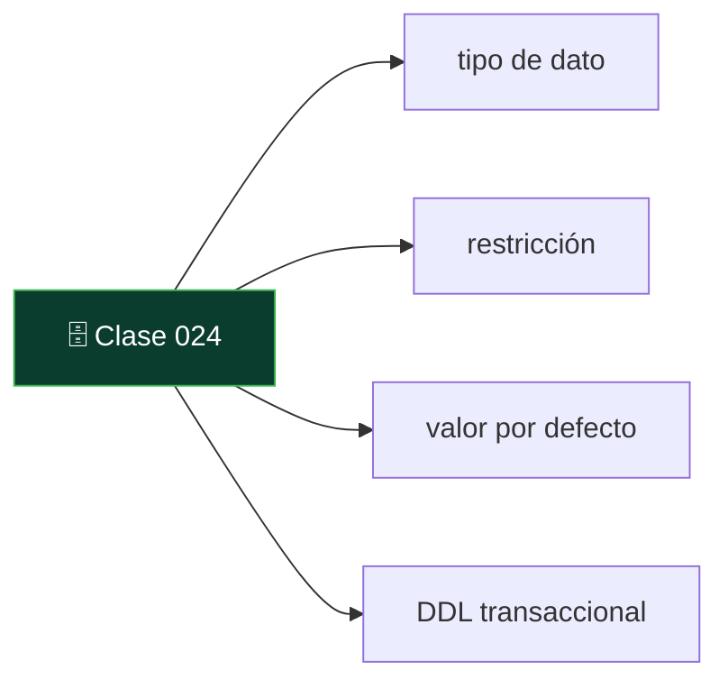
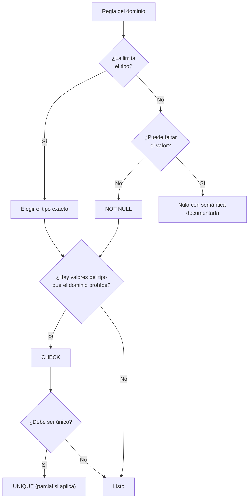

# 024 — DDL: el esquema como contrato ejecutable

   

> [Programa](../../../README.md) · [Parte 04](../README.md) · [← Anterior](../../part-03-modelo-relacional-y-algebra/023-integridad-restricciones-y-acciones-referenciales/README.md) · [Siguiente →](../../part-04-sql-en-profundidad/025-select-filtrado-proyeccion-y-orden/README.md)

Parte 04 — SQL en profundidad · Fundamentos ·
3 horas estimadas · motores `postgresql`, `sqlite`, `mysql` · laboratorio
[`labs/01-sql-foundations`](../../../labs/01-sql-foundations/README.md) · 4 fuentes.

**Conceptos centrales:** `tipo de dato` · `restricción` · `valor por defecto` · `DDL transaccional`

**En este caso se comparan 8 motores**: 5 lo resuelven (5 con el resultado comprobado por máquina) y 3 no, con el motivo escrito.



---

## Propósito

Escribir el esquema como un contrato ejecutable: cada línea de DDL es una promesa que el motor hace cumplir. Un esquema laxo traslada esa responsabilidad a cada programa cliente, presente y futuro.

## Resultados de aprendizaje

Al terminar podrás:

1. Elegir tipos por el dominio del dato, no por costumbre.
2. Justificar por qué el dinero no se guarda en coma flotante, con una demostración.
3. Aplicar el criterio de tipos para fechas, horas y zonas horarias.
4. Aprovechar el DDL transaccional donde existe y protegerte donde no.
5. Escribir un esquema en el que un dato inválido sea imposible, no improbable.

## Fundamentos

### El tipo es la primera restricción

Antes de cualquier `CHECK`, el tipo ya limita el dominio. Elegirlo mal deja pasar valores que ninguna restricción posterior recupera.

| Dato | Tipo correcto | Tipo frecuente y equivocado | Qué se rompe |
|---|---|---|---|
| Dinero | `NUMERIC(12,2)` / entero de centavos | `FLOAT`, `REAL` | Errores de redondeo acumulativos |
| Fecha y hora con huso | `TIMESTAMPTZ` | `TIMESTAMP` sin huso | Ambigüedad en cambios de hora |
| Fecha sin hora | `DATE` | `TEXT` | Comparaciones y aritmética imposibles |
| Identificador externo | `TEXT` con `CHECK` de formato | `INTEGER` | Se pierden ceros a la izquierda |
| Booleano | `BOOLEAN` | `INTEGER`, `CHAR(1)` | Tres estados donde debe haber dos |
| Enumeración corta | `TEXT` + `CHECK IN (...)` | `TEXT` libre | Valores nuevos sin control |
| Duración | Entero de segundos o `INTERVAL` | `TEXT` «2h 30m» | Aritmética imposible |

### Dinero en coma flotante: la demostración

Los tipos `FLOAT` y `DOUBLE` siguen IEEE 754, que representa en binario. El valor decimal `0,1` no tiene representación binaria finita, igual que 1/3 no la tiene en decimal.

```sql
SELECT 0.1 + 0.2 = 0.3;             -- en coma flotante: falso
SELECT CAST(0.1 AS REAL) + CAST(0.2 AS REAL);   -- 0.30000000000000004
```

Con 10 000 transacciones de un producto de 19,99, el error acumulado deja de ser teórico y aparece en la conciliación contable como un descuadre de céntimos que nadie sabe explicar. `NUMERIC` almacena en base 10 y es exacto para estos valores; a cambio, la aritmética es más lenta. Para dinero, esa lentitud es irrelevante y la exactitud no lo es.

### Fechas y husos horarios

`TIMESTAMP WITHOUT TIME ZONE` guarda una pared de reloj sin decir de qué reloj. Dos consecuencias:

- Un evento registrado a las 02:30 durante el retroceso del horario de verano es **ambiguo**: ocurrió dos veces.
- Comparar registros de dos regiones da resultados incorrectos sin conversión explícita.

`TIMESTAMPTZ` (en PostgreSQL) guarda un instante absoluto normalizado a UTC y lo presenta en el huso de la sesión. Regla operativa: **almacenar instantes en UTC, convertir solo al presentar**. La excepción legítima es la fecha civil sin instante —un cumpleaños, un feriado—, que es `DATE` y no tiene huso.

### DDL transaccional

| Motor | ¿`CREATE`/`ALTER` dentro de una transacción con reversión? |
|---|---|
| PostgreSQL | Sí, casi todo el DDL |
| SQLite | Sí |
| SQL Server | Sí, en su mayor parte |
| MySQL / MariaDB | **No**: cada sentencia DDL confirma implícitamente |
| Oracle | No: confirmación implícita |

La consecuencia es enorme para las migraciones. En PostgreSQL, una migración de cinco pasos que falla en el cuarto revierte entera. En MySQL, deja el esquema a medias y hay que escribir el camino de vuelta a mano. Quien despliega sobre MySQL necesita migraciones idempotentes y verificadas paso a paso (clase 049).



## Ejemplo trabajado

Esquema laxo, del tipo que se escribe en el primer prototipo y sobrevive tres años:

```sql
CREATE TABLE pagos (
  id      INTEGER,
  alumno  TEXT,
  monto   REAL,
  fecha   TEXT,
  estado  TEXT
);
```

Valores que este esquema acepta sin protestar, y que no significan nada:

```sql
INSERT INTO pagos VALUES (1, NULL, -0.1, 'ayer', 'PAGADO');
INSERT INTO pagos VALUES (1, 'Ana', 1e308, '2026-13-45', 'pagadoo');
```

Dos filas con `id = 1`, un monto negativo, otro que desborda cualquier moneda real, dos fechas imposibles y un estado con una errata. Todo dentro del contrato, porque el contrato no dice nada.

Esquema como contrato:

```sql
CREATE TABLE pagos (
  id          INTEGER PRIMARY KEY,
  student_id  INTEGER NOT NULL REFERENCES students(id) ON DELETE RESTRICT,
  monto_clp   INTEGER NOT NULL CHECK (monto_clp > 0),
  pagado_en   TEXT    NOT NULL CHECK (pagado_en LIKE '____-__-__T__:__:__Z'),
  estado      TEXT    NOT NULL DEFAULT 'pendiente'
              CHECK (estado IN ('pendiente','pagado','anulado')),
  referencia  TEXT    UNIQUE
);
```

Decisiones y su motivo:

- **`monto_clp` como entero.** El peso chileno no tiene decimales, así que el entero es exacto y natural. Para monedas con decimales, `NUMERIC(12,2)` o enteros de centavos con el nombre del campo diciéndolo (`monto_centavos`).
- **`pagado_en` en texto ISO-8601 con `Z`.** SQLite no tiene tipo de fecha; el patrón fuerza el formato y el sufijo declara UTC. En PostgreSQL sería `TIMESTAMPTZ NOT NULL`.
- **`estado` enumerado con `CHECK`.** «pagadoo» ahora falla en la inserción, no en el informe trimestral.
- **`referencia UNIQUE`.** Impide registrar dos veces el mismo pago del proveedor: es idempotencia declarada en el esquema (clase 037).
- **`ON DELETE RESTRICT`.** Un pago es evidencia contable; borrar al estudiante no puede borrarlo.

**Comprobación de que el contrato funciona:**

```sql
INSERT INTO pagos (id, student_id, monto_clp, pagado_en, estado)
VALUES (1, 999, -500, 'ayer', 'pagadoo');
-- FOREIGN KEY constraint failed  /  CHECK constraint failed
```

Cuatro errores detectados en la inserción en lugar de cuatro incidencias en producción.

**Unicidad condicional.** Regla frecuente: «solo puede haber un pago pendiente por estudiante». Un `UNIQUE (student_id)` prohibiría también los pagados. La forma correcta es un índice único parcial:

```sql
CREATE UNIQUE INDEX pagos_un_pendiente
  ON pagos (student_id) WHERE estado = 'pendiente';
```

Disponible en PostgreSQL y SQLite. En MySQL se emula con una columna generada que vale `student_id` cuando el estado es pendiente y `NULL` en otro caso, aprovechando que los nulos no colisionan en un índice único.

## Comparación

| Decisión | Esquema laxo | Esquema como contrato |
|---|---|---|
| Dónde falla un dato malo | En el informe, semanas después | En el `INSERT`, al instante |
| Quién valida | Cada cliente, si se acuerda | El motor, siempre |
| Costo de un cliente nuevo | Reimplementar las validaciones | Ninguno |
| Migración de datos sucios | Inevitable | Innecesaria |
| Coste de escritura | Mínimo | Comprobaciones por fila (despreciable) |

## Errores frecuentes

1. **`REAL` para dinero.** Error garantizado, solo cuestión de volumen.
2. **`TEXT` para todo.** Traslada el análisis sintáctico a cada consulta y hace imposible ordenar y comparar.
3. **`VARCHAR(255)` por inercia.** El 255 viene de un límite histórico de MySQL, no del dominio. Si el límite real es 40, escribe 40.
4. **Guardar horas locales sin huso.** Se descubre en el cambio de horario, con datos ya escritos.
5. **Enumeraciones sin `CHECK`.** El estado con errata entra y contamina todos los agregados.
6. **Suponer DDL transaccional en MySQL.** Una migración a medias en producción.

## De la clase a la operación

Los proyectos de «limpieza de datos» existen porque en su día el esquema aceptó lo que no debía. Cada `CHECK` escrito hoy es un proyecto de limpieza que no ocurrirá.

## Reto de transferencia

1. Toma una tabla real y lista los valores absurdos que hoy acepta.
2. Reescribe su DDL como contrato, con tipos, `NOT NULL`, `CHECK` y `UNIQUE`.
3. Demuestra con inserciones fallidas que cada regla se aplica.
4. Escribe la consulta que encuentra los datos existentes que el nuevo contrato rechazaría, y decide qué hacer con ellos.

## Preguntas de evaluación

1. Demuestra numéricamente por qué `REAL` no sirve para dinero.
2. ¿Qué diferencia práctica hay entre `TIMESTAMP` y `TIMESTAMPTZ` durante un cambio de horario?
3. Escribe la unicidad condicional de tu dominio en dos motores distintos.
4. Tu migración falla a mitad en MySQL. Describe el estado del esquema y cómo lo recuperas.

---

## 🌐 El mismo problema en cada motor

**Caso:** Un esquema que rechaza por su cuenta los datos que no cumplen el contrato

El DDL no describe los datos: los **restringe**. Un esquema es un contrato
ejecutable, y la forma de comprobar que existe es intentar romperlo.

El caso intenta guardar cuatro notas. Dos son válidas. Una trae nota 130
—fuera del rango declarado— y otra trae el nombre del estudiante vacío. El
programa no comprueba nada; las dos inválidas tienen que rebotar contra el
esquema. La consulta devuelve lo que quedó guardado, ordenado por
estudiante: exactamente las dos válidas.

Salida esperada, idéntica en todos los motores que lo resuelven:

| estudiante | nota |
|---|---|
| `Ada` | `90` |
| `Linus` | `58` |

El contrato vive en [`motores.yaml`](motores.yaml) y lo comprueba
`python scripts/verificar_equivalencia.py --clase 024`: 5 de
las 5 implementaciones se ejecutan de verdad y su
resultado se compara con esa tabla; el resto se declara como material revisado,
no ejecutado.

| Motor | ¿Resuelve el caso? | Nivel de prueba | Código | Fuente |
|---|---|---|---|---|
| SQLite | sí | núcleo | [código](implementaciones/sqlite/consulta.sql) | [doc oficial](https://sqlite.org/stricttables.html) |
| DuckDB | sí | núcleo | [código](implementaciones/duckdb/consulta.sql) | [doc oficial](https://duckdb.org/docs/stable/sql/constraints.html) |
| PostgreSQL | sí | servicio | [código](implementaciones/postgresql/consulta.sql) | [doc oficial](https://www.postgresql.org/docs/current/ddl-constraints.html) |
| MySQL | sí | servicio | [código](implementaciones/mysql/consulta.sql) | [doc oficial](https://dev.mysql.com/doc/refman/8.4/en/create-table-check-constraints.html) |
| MongoDB | sí | servicio | [código](implementaciones/mongodb/consulta.js) | [doc oficial](https://www.mongodb.com/docs/manual/core/schema-validation/) |
| Apache Cassandra | **no** | — | — | [doc oficial](https://cassandra.apache.org/doc/latest/cassandra/developing/cql/types.html) |
| Redis | **no** | — | — | [doc oficial](https://redis.io/docs/latest/develop/data-types/) |
| OpenSearch | **no** | — | — | [doc oficial](https://docs.opensearch.org/latest/field-types/) |

### Los que resuelven el caso

#### SQLite · [`implementaciones/sqlite/consulta.sql`](implementaciones/sqlite/consulta.sql)

✅ **verificado** — se ejecuta en CI sin servicios

```sql
-- motor: sqlite
-- doc: https://sqlite.org/stricttables.html
-- nota: la clausula STRICT es lo que hace que el tipo se comprueba de verdad.
--       Sin ella, la afinidad de tipos deja pasar una cadena en una columna
--       INTEGER si no puede convertirla.

-- === preparacion ===
CREATE TABLE notas (
    estudiante TEXT NOT NULL CHECK (length(estudiante) > 0),
    curso      TEXT NOT NULL,
    nota       INTEGER NOT NULL CHECK (nota BETWEEN 0 AND 100),
    PRIMARY KEY (estudiante, curso)
) STRICT;

INSERT INTO notas (estudiante, curso, nota) VALUES ('Ada', 'DB-101', 90);
INSERT INTO notas (estudiante, curso, nota) VALUES ('Linus', 'DB-101', 58);
-- Las dos siguientes rebotan contra el contrato. OR IGNORE deja verlo sin
-- abortar el guion; sin OR IGNORE, cada una lanza un error.
INSERT OR IGNORE INTO notas (estudiante, curso, nota) VALUES ('Grace', 'DB-101', 130);
INSERT OR IGNORE INTO notas (estudiante, curso, nota) VALUES ('', 'DB-101', 70);

-- === consulta ===
SELECT estudiante, nota FROM notas ORDER BY estudiante;
```

- **Por qué sí:** Tiene `CHECK`, `NOT NULL`, `UNIQUE` y claves foráneas, y `INSERT OR IGNORE` permite ver el rechazo sin abortar el guion: el contrato actúa a la vista.
- **Por qué no:** Su tipado es dinámico por afinidad: en una columna `INTEGER` cabe la cadena `'alto'` si el motor no la puede convertir. Desde 3.37 existen las tablas `STRICT`, pero no son las de por omisión, así que casi ninguna base SQLite existente comprueba tipos.
- 📄 Documentación oficial: <https://sqlite.org/stricttables.html>

#### DuckDB · [`implementaciones/duckdb/consulta.sql`](implementaciones/duckdb/consulta.sql)

✅ **verificado** — se ejecuta en CI sin servicios

```sql
-- motor: duckdb
-- doc: https://duckdb.org/docs/stable/sql/constraints.html
-- nota: DuckDB no tiene INSERT OR IGNORE para violaciones de CHECK: la fila
--       invalida aborta la sentencia. Por eso los dos intentos prohibidos van
--       comentados; descomentar cualquiera de los dos hace fallar el guion, que
--       es precisamente la prueba de que el contrato existe.

-- === preparacion ===
CREATE TABLE notas (
    estudiante VARCHAR NOT NULL CHECK (length(estudiante) > 0),
    curso      VARCHAR NOT NULL,
    nota       INTEGER NOT NULL CHECK (nota BETWEEN 0 AND 100),
    PRIMARY KEY (estudiante, curso)
);

INSERT INTO notas VALUES ('Ada', 'DB-101', 90);
INSERT INTO notas VALUES ('Linus', 'DB-101', 58);
-- INSERT INTO notas VALUES ('Grace', 'DB-101', 130);  -- Constraint Error: CHECK
-- INSERT INTO notas VALUES ('',      'DB-101', 70);   -- Constraint Error: CHECK

-- === consulta ===
SELECT estudiante, nota FROM notas ORDER BY estudiante;
```

- **Por qué sí:** El tipado sí es estricto: una nota `'alto'` en una columna entera falla al insertar, sin conversiones silenciosas. Es el motor donde el contrato de tipos se cumple sin pedirlo.
- **Por qué no:** No tiene `INSERT OR IGNORE` para violaciones de `CHECK`: la fila inválida aborta la sentencia entera. Para cargar datos sucios hay que filtrarlos antes, que es justo lo que un almacén analítico espera que hayas hecho ya.
- 📄 Documentación oficial: <https://duckdb.org/docs/stable/sql/constraints.html>

#### PostgreSQL · [`implementaciones/postgresql/consulta.sql`](implementaciones/postgresql/consulta.sql)

✅ **verificado** — se ejecuta contra el motor real levantado con `docker compose`

```sql
-- motor: postgresql
-- doc: https://www.postgresql.org/docs/current/ddl-constraints.html
-- nota: el dominio da NOMBRE a la restriccion y la hace reutilizable: cualquier
--       columna declarada `nota_valida` hereda el rango, y cambiarlo en un solo
--       sitio lo cambia en todas.

-- === preparacion ===
DROP TABLE IF EXISTS notas;
DROP DOMAIN IF EXISTS nota_valida;

CREATE DOMAIN nota_valida AS integer CHECK (VALUE BETWEEN 0 AND 100);

CREATE TABLE notas (
    estudiante text NOT NULL CHECK (length(estudiante) > 0),
    curso      text NOT NULL,
    nota       nota_valida NOT NULL,
    PRIMARY KEY (estudiante, curso)
);

INSERT INTO notas (estudiante, curso, nota) VALUES ('Ada', 'DB-101', 90);
INSERT INTO notas (estudiante, curso, nota) VALUES ('Linus', 'DB-101', 58);

-- Los dos intentos prohibidos se ejecutan de verdad, capturando el error: la
-- prueba de que el contrato actua queda en el guion, no en un comentario.
DO $$
DECLARE rechazadas integer := 0;
BEGIN
    BEGIN
        INSERT INTO notas (estudiante, curso, nota) VALUES ('Grace', 'DB-101', 130);
    EXCEPTION WHEN check_violation THEN rechazadas := rechazadas + 1;
    END;
    BEGIN
        INSERT INTO notas (estudiante, curso, nota) VALUES ('', 'DB-101', 70);
    EXCEPTION WHEN check_violation THEN rechazadas := rechazadas + 1;
    END;
    IF rechazadas <> 2 THEN
        RAISE EXCEPTION 'el esquema acepto datos que su contrato prohibe';
    END IF;
END;
$$;

-- === consulta ===
SELECT estudiante, nota FROM notas ORDER BY estudiante;
```

- **Por qué sí:** Es el que más lejos lleva la idea de contrato: además de `CHECK` tiene dominios (`CREATE DOMAIN`) para dar nombre a una restricción y reutilizarla, tipos enumerados y restricciones de exclusión. La regla se declara una vez y vale para toda tabla que use el tipo.
- **Por qué no:** Añadir un `CHECK` a una tabla grande la bloquea mientras valida las filas existentes, salvo que se declare `NOT VALID` y se valide después: el contrato se endurece con una ventana de mantenimiento, no con un despliegue.
- 📄 Documentación oficial: <https://www.postgresql.org/docs/current/ddl-constraints.html>

#### MySQL · [`implementaciones/mysql/consulta.sql`](implementaciones/mysql/consulta.sql)

✅ **verificado** — se ejecuta contra el motor real levantado con `docker compose`

```sql
-- motor: mysql
-- doc: https://dev.mysql.com/doc/refman/8.4/en/create-table-check-constraints.html
-- nota: antes de 8.0.16, MySQL analizaba los CHECK y los ignoraba en silencio.
--       Comprobar la version del servidor es parte de leer el esquema.

-- === preparacion ===
DROP TABLE IF EXISTS notas;

CREATE TABLE notas (
    estudiante VARCHAR(50) NOT NULL CHECK (CHAR_LENGTH(estudiante) > 0),
    curso      VARCHAR(50) NOT NULL,
    nota       INT NOT NULL CHECK (nota BETWEEN 0 AND 100),
    PRIMARY KEY (estudiante, curso)
);

INSERT INTO notas (estudiante, curso, nota) VALUES ('Ada', 'DB-101', 90);
INSERT INTO notas (estudiante, curso, nota) VALUES ('Linus', 'DB-101', 58);
INSERT IGNORE INTO notas (estudiante, curso, nota) VALUES ('Grace', 'DB-101', 130);
INSERT IGNORE INTO notas (estudiante, curso, nota) VALUES ('', 'DB-101', 70);

-- === consulta ===
SELECT estudiante, nota FROM notas ORDER BY estudiante;
```

- **Por qué sí:** Desde 8.0.16 los `CHECK` se comprueban de verdad, y `INSERT IGNORE` convierte el rechazo en aviso, lo que permite cargar por lotes sin perder el lote entero.
- **Por qué no:** Antes de 8.0.16 el `CHECK` se analizaba y se **ignoraba en silencio**: hay esquemas heredados llenos de restricciones que nunca comprobaron nada. Y sin el modo estricto, un `INSERT` con un valor imposible se convertía en un aviso y guardaba un cero.
- 📄 Documentación oficial: <https://dev.mysql.com/doc/refman/8.4/en/create-table-check-constraints.html>

#### MongoDB · [`implementaciones/mongodb/consulta.js`](implementaciones/mongodb/consulta.js)

✅ **verificado** — se ejecuta contra el motor real levantado con `docker compose`

```javascript
// motor: mongodb
// doc: https://www.mongodb.com/docs/manual/core/schema-validation/
// nota: validationAction "error" es lo que convierte el esquema en contrato.
//       Con "warn" el documento invalido se guarda igual y solo queda una
//       linea en el registro que nadie lee.

// === preparacion ===
db.notas.drop();
db.createCollection("notas", {
  validator: {
    $jsonSchema: {
      bsonType: "object",
      required: ["estudiante", "curso", "nota"],
      properties: {
        estudiante: { bsonType: "string", minLength: 1 },
        curso: { bsonType: "string" },
        nota: { bsonType: "int", minimum: 0, maximum: 100 },
      },
    },
  },
  validationAction: "error",
  validationLevel: "strict",
});

db.notas.insertOne({ estudiante: "Ada", curso: "DB-101", nota: NumberInt(90) });
db.notas.insertOne({ estudiante: "Linus", curso: "DB-101", nota: NumberInt(58) });

let rechazadas = 0;
for (const malo of [
  { estudiante: "Grace", curso: "DB-101", nota: NumberInt(130) },
  { estudiante: "", curso: "DB-101", nota: NumberInt(70) },
]) {
  try {
    db.notas.insertOne(malo);
  } catch (e) {
    rechazadas += 1;
  }
}
if (rechazadas !== 2) throw new Error("el validador acepto lo que prohibe");

// === consulta ===
db.notas
  .find({}, { _id: 0, estudiante: 1, nota: 1 })
  .sort({ estudiante: 1 })
  .forEach((d) => print(d.estudiante + "|" + d.nota));
```

- **Por qué sí:** `$jsonSchema` con `validationAction: "error"` da un contrato equivalente —tipos, rangos, campos obligatorios— sin renunciar a que el documento evolucione: se puede empezar sin esquema y endurecerlo cuando el dominio se entiende.
- **Por qué no:** Es opcional y se aplica solo a las escrituras posteriores: con `validationLevel: "moderate"` los documentos que ya estaban mal siguen estando mal, y nada en el documento delata que hay un contrato detrás.
- 📄 Documentación oficial: <https://www.mongodb.com/docs/manual/core/schema-validation/>

### Los que no resuelven este caso — y qué se hace en su lugar

Descartar un motor con un argumento es tan formativo como usarlo. Ninguna de estas filas dice que el motor sea peor: dice que este problema no es el suyo.

| Motor | Por qué no | Qué se hace en su lugar | Fuente |
|---|---|---|---|
| Apache Cassandra | CQL declara tipos, pero no tiene `CHECK` ni restricciones de dominio: no hay forma de decir «la nota está entre 0 y 100». Cualquier comprobación de ese tipo exigiría leer o validar en el servidor, y su modelo de escritura no lee nada. | Validar en la capa de servicio que está delante del clúster, y aceptar que el contrato vive en el código, no en el almacén: si alguien escribe con `cqlsh`, no hay red de seguridad. | [doc](https://cassandra.apache.org/doc/latest/cassandra/developing/cql/types.html) |
| Redis | No hay esquema en absoluto: toda clave admite cualquier valor. La única «restricción» es el tipo de la estructura —no se puede hacer `INCR` sobre una lista—, y eso no es un contrato de dominio. | Validar antes de escribir en el cliente, o usar RedisJSON con un esquema comprobado en la aplicación; en cualquier caso, la regla la sostiene el código. | [doc](https://redis.io/docs/latest/develop/data-types/) |
| OpenSearch | Un `mapping` fija tipos, pero su comportamiento por omisión es el contrario al de un contrato: el mapeo dinámico **crea** el campo que aparezca. Y un campo mal tipado no se puede cambiar sin reindexar. | `dynamic: strict` en el mapeo, que rechaza los documentos con campos no declarados; sigue sin haber rangos ni condiciones sobre los valores. | [doc](https://docs.opensearch.org/latest/field-types/) |

---

## Laboratorio

```bash
python scripts/validate_repository.py
python labs/01-sql-foundations/run_lab.py
```

Guarda como evidencia la salida completa, la versión del motor y la semilla o
los parámetros usados. Una captura sin comando no es evidencia: no se puede
repetir.

## Evaluación

| Criterio | Peso | Qué se comprueba |
|---|---:|---|
| Comprensión conceptual | 25 % | Explica el mecanismo, no solo el resultado |
| Ejecución reproducible | 25 % | Otra persona obtiene lo mismo con las instrucciones dadas |
| Interpretación basada en evidencia | 25 % | Cada conclusión se apoya en una salida o una medición |
| Límites y riesgos declarados | 25 % | Dice qué no demuestra el ejercicio y qué faltaría en producción |

La clase se da por superada cuando la respuesta explica el mecanismo, muestra
la salida que la respalda y declara al menos un límite del ejercicio.

## Fuentes de esta clase

Todo lo afirmado arriba procede de estas obras. Los identificadores viven en
[`catalog/sources.json`](../../../catalog/sources.json) y el estado de los
enlaces se comprueba con `python scripts/check_external_links.py`.

- **ISO/IEC JTC 1/SC 32** (2023). [ISO/IEC 9075: Information technology - Database languages - SQL](https://www.iso.org/standard/76583.html).  
  Norma del lenguaje SQL. Ningún motor la implementa por completo.
- **PostgreSQL Global Development Group** (2026). [PostgreSQL Documentation](https://www.postgresql.org/docs/current/).  
  Documentación de referencia del motor relacional principal del programa.
- **C. J. Date** (2015). [SQL and Relational Theory: How to Write Accurate SQL Code](https://www.oreilly.com/library/view/sql-and-relational/9781491941164/). 3.a ed. O'Reilly. ISBN 978-1-4919-4117-1.  
  Separa el modelo relacional de lo que SQL realmente implementa, incluidos los nulos.
- **SQLite Consortium** (2026). [SQLite Documentation](https://sqlite.org/docs.html).  
  Motor embebido usado por los laboratorios sin dependencias del programa.

---

> [Programa](../../../README.md) · [Parte 04](../README.md) · [← Anterior](../../part-03-modelo-relacional-y-algebra/023-integridad-restricciones-y-acciones-referenciales/README.md) · [Siguiente →](../../part-04-sql-en-profundidad/025-select-filtrado-proyeccion-y-orden/README.md)
