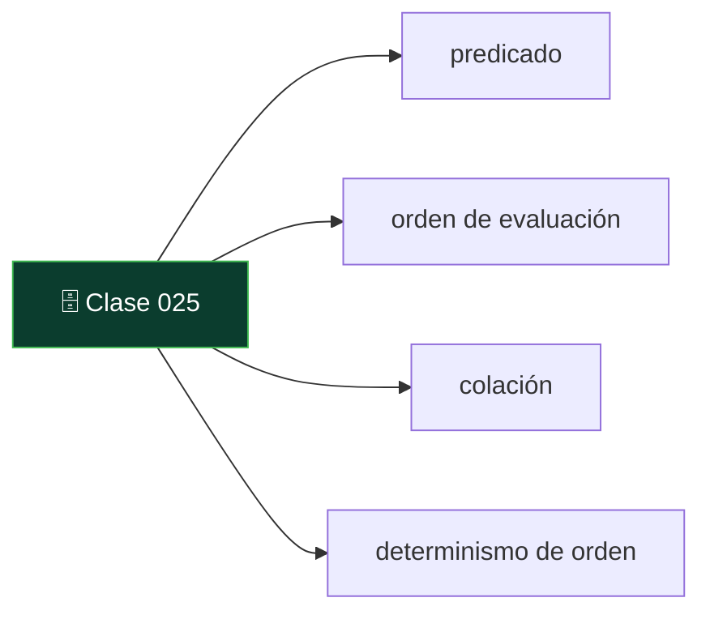

# 025 — SELECT: filtrado, proyección y orden con semántica precisa

   

> [Programa](../../../README.md) · [Parte 04](../README.md) · [← Anterior](../../part-04-sql-en-profundidad/024-ddl-el-esquema-como-contrato/README.md) · [Siguiente →](../../part-04-sql-en-profundidad/026-reuniones-inner-outer-semi-y-anti/README.md)

Parte 04 — SQL en profundidad · Fundamentos ·
3 horas estimadas · motores `postgresql`, `sqlite` · laboratorio
[`labs/01-sql-foundations`](../../../labs/01-sql-foundations/README.md) · 3 fuentes.

**Conceptos centrales:** `predicado` · `orden de evaluación` · `colación` · `determinismo de orden`

**En este caso se comparan 7 motores**: 7 lo resuelven (6 con el resultado comprobado por máquina) y 0 no, con el motivo escrito.



---

## Propósito

Escribir `SELECT` sabiendo exactamente qué devuelve. La mayoría de los errores de consulta no son de sintaxis: son de semántica, y aparecen cuando los datos cambian.

## Resultados de aprendizaje

Al terminar podrás:

1. Enunciar el orden lógico de evaluación de una consulta y usarlo para explicar errores.
2. Distinguir orden lógico de orden físico de ejecución.
3. Escribir un `ORDER BY` determinista y explicar por qué hace falta.
4. Prever el efecto de la colación en comparaciones y ordenaciones.
5. Paginar sin saltarse ni repetir filas.

## Fundamentos

### El orden lógico

SQL se escribe en un orden y se evalúa en otro. El orden lógico definido por la norma es:

```text
1. FROM      (y los JOIN)
2. WHERE
3. GROUP BY
4. HAVING
5. SELECT    (incluidas las funciones de ventana)
6. DISTINCT
7. ORDER BY
8. LIMIT / OFFSET
```

De aquí salen, sin más teoría, tres reglas que suelen memorizarse mal:

- **No se puede usar un alias de `SELECT` en `WHERE`.** En el paso 2 ese alias todavía no existe. Sí se puede en `ORDER BY`, porque es posterior.
- **`WHERE` filtra filas; `HAVING` filtra grupos.** Poner una condición de fila en `HAVING` funciona pero agrupa de más y es más lento.
- **Las funciones de ventana no se pueden filtrar en `WHERE`.** Se calculan en el paso 5. Para filtrarlas hace falta una subconsulta o una CTE (clase 018).

El orden **físico** es otro: el motor aplica las equivalencias de la clase 011 y puede filtrar antes de reunir. Ambas cosas conviven porque el resultado es el mismo.

### El orden de las filas no existe

Sin `ORDER BY`, el orden de salida es un accidente del plan. Con `ORDER BY` sobre una columna con valores repetidos, el orden entre las filas empatadas **tampoco** está definido.

Esto rompe la paginación por desplazamiento:

```sql
SELECT * FROM students ORDER BY nombre LIMIT 20 OFFSET 0;   -- página 1
SELECT * FROM students ORDER BY nombre LIMIT 20 OFFSET 20;  -- página 2
```

Con dos estudiantes llamados «Ana Pérez», su orden relativo puede cambiar entre las dos consultas: uno aparece en ambas páginas y otro en ninguna. La solución es un **orden total**, añadiendo una columna única como desempate:

```sql
SELECT * FROM students ORDER BY nombre, id LIMIT 20 OFFSET 20;
```

### Paginación por clave

`OFFSET` tiene además un problema de costo: para saltar 100 000 filas, el motor las produce y las descarta. El costo crece con el número de página. La alternativa es la paginación por clave (*keyset*), que recuerda dónde se quedó:

```sql
-- primera página
SELECT id, nombre FROM students ORDER BY nombre, id LIMIT 20;
-- siguiente, con el último par visto
SELECT id, nombre FROM students
WHERE (nombre, id) > ('Ana Pérez', 412)
ORDER BY nombre, id LIMIT 20;
```

La comparación de tuplas `(a, b) > (x, y)` es la forma correcta y está en la norma. Con un índice sobre `(nombre, id)`, el costo es constante por página, no creciente. Winand desarrolla este punto como uno de los usos canónicos del índice compuesto.

### Colación

La colación decide cómo se comparan y ordenan los textos: si `'a' = 'A'`, dónde va la «ñ», si los acentos importan.

| Motor | Comportamiento por defecto |
|---|---|
| PostgreSQL | Sensible a mayúsculas; colación del `initdb` (a menudo del sistema) |
| MySQL | Históricamente **insensible** a mayúsculas (`utf8mb4_0900_ai_ci`) |
| SQLite | `BINARY`: sensible a mayúsculas y solo ASCII en `NOCASE` |
| SQL Server | Depende de la instalación; suele ser insensible |

Esa diferencia hace que `WHERE email = 'ANA@X.CL'` encuentre la fila en MySQL y no en PostgreSQL. Es la causa de portabilidad más subestimada (clase 022). La defensa es normalizar explícitamente al escribir —guardar el correo en minúsculas— en vez de depender de la colación.

## Ejemplo trabajado

```sql
SELECT s.nombre,
       AVG(e.nota) AS promedio
FROM students s
JOIN enrollments e ON e.student_id = s.id
WHERE promedio > 5.0            -- ERROR
GROUP BY s.nombre;
```

Falla porque en el paso 2 (`WHERE`) el alias `promedio` no existe y la agregación aún no se ha hecho. La forma correcta usa `HAVING`:

```sql
SELECT s.id, s.nombre, AVG(e.nota) AS promedio
FROM students s
JOIN enrollments e ON e.student_id = s.id
GROUP BY s.id, s.nombre
HAVING AVG(e.nota) > 5.0
ORDER BY promedio DESC, s.id;
```

Detalles que no son adorno:

- Se agrupa por `s.id` además de `s.nombre`: dos estudiantes homónimos se contarían como uno solo al agrupar solo por nombre. Un error de resultado, no de estilo.
- `ORDER BY promedio DESC, s.id` usa el alias (permitido en el paso 7) y desempata con la clave.

**Filtro de fila frente a filtro de grupo.** Comparemos:

```sql
-- A: filtra filas antes de agrupar
SELECT e.course_id, AVG(e.nota)
FROM enrollments e
WHERE e.estado = 'activa'
GROUP BY e.course_id;

-- B: filtra grupos después
SELECT e.course_id, AVG(e.nota)
FROM enrollments e
GROUP BY e.course_id
HAVING MIN(e.estado) = 'activa';
```

No son equivalentes ni en resultado ni en costo. A calcula el promedio **solo** de las activas; B calcula el promedio de todas y luego descarta grupos. Con 240 000 inscripciones de las que 200 000 están activas, A agrega 200 000 filas y B agrega 240 000 para descartar después. La regla: **filtrar lo antes posible**, que es la equivalencia E2 de la clase 011 aplicada a mano.

**Paginación, medición.** Sobre 5 millones de filas con índice en `(nombre, id)`:

```text
OFFSET 0        →  20 filas producidas
OFFSET 100 000  →  100 020 filas producidas, 100 000 descartadas
keyset          →  20 filas producidas, siempre
```

## Comparación

| Necesidad | Construcción correcta | Trampa habitual |
|---|---|---|
| Filtrar filas | `WHERE` | Hacerlo en `HAVING` |
| Filtrar agregados | `HAVING` | Intentarlo en `WHERE` |
| Filtrar ventanas | Subconsulta o CTE | Intentarlo en `WHERE` |
| Orden estable | `ORDER BY` con columna única final | Confiar en el orden natural |
| Paginar mucho | Paginación por clave | `OFFSET` creciente |
| Comparar texto | Normalizar al escribir | Depender de la colación |

## Errores frecuentes

1. **Paginar con `OFFSET` sobre un orden no total.** Filas repetidas y filas perdidas, sin ningún error visible.
2. **Agrupar por el nombre y no por la clave.** Fusiona homónimos en silencio.
3. **`SELECT *` con `JOIN`.** Trae columnas duplicadas y ata el cliente al esquema.
4. **Suponer que `WHERE` y `HAVING` son intercambiables.** Cambian el resultado cuando hay agregados.
5. **Confiar en la insensibilidad a mayúsculas.** Funciona en MySQL y falla al migrar a PostgreSQL.
6. **`LIMIT` sin `ORDER BY`.** Devuelve «20 filas cualesquiera», que pueden ser otras 20 en la siguiente ejecución.

## De la clase a la operación

Las listas paginadas con elementos que se repiten o desaparecen son un clásico de los informes de error de usuario, y casi siempre se atribuyen al *frontend*. Casi siempre son un `ORDER BY` sin desempate.

## Reto de transferencia

1. Encuentra una consulta paginada real y demuestra con datos que su orden no es total.
2. Conviértela a paginación por clave y mide el costo en la página 1 y en la 5 000.
3. Reescribe una consulta que use `HAVING` para filtrar filas y compara los planes.
4. Documenta la colación por defecto de tu motor y una consulta cuyo resultado cambiaría al migrar.

## Preguntas de evaluación

1. Explica con el orden lógico por qué un alias funciona en `ORDER BY` y no en `WHERE`.
2. Da un caso donde `WHERE` y `HAVING` produzcan resultados distintos, con datos.
3. ¿Por qué la paginación por clave necesita un índice sobre exactamente las columnas del `ORDER BY`?
4. Tu aplicación funciona en MySQL y falla en PostgreSQL al buscar correos. Diagnostica y propón la corrección definitiva.

---

## 🌐 El mismo problema en cada motor

**Caso:** Los dos mejores de DB-101 con al menos 60

Un `SELECT` toma cinco decisiones y conviene no mezclarlas: de dónde salen
las filas, cuáles sobreviven al filtro, qué columnas se ven, en qué orden se
leen y cuántas se devuelven.

El caso pide los dos mejores resultados de DB-101 con nota igual o superior
a 60, con su nota, de mayor a menor. La trampa que esta clase entrena está en
la última decisión: **`LIMIT` sin `ORDER BY` devuelve dos filas
cualesquiera**, y como suelen ser las «correctas» en pruebas pequeñas, el
error sobrevive hasta producción.

Salida esperada, idéntica en todos los motores que lo resuelven:

| estudiante | nota |
|---|---|
| `Ada` | `90` |
| `Grace` | `72` |

El contrato vive en [`motores.yaml`](motores.yaml) y lo comprueba
`python scripts/verificar_equivalencia.py --clase 025`: 6 de
las 7 implementaciones se ejecutan de verdad y su
resultado se compara con esa tabla; el resto se declara como material revisado,
no ejecutado.

| Motor | ¿Resuelve el caso? | Nivel de prueba | Código | Fuente |
|---|---|---|---|---|
| SQLite | sí | núcleo | [código](implementaciones/sqlite/consulta.sql) | [doc oficial](https://sqlite.org/lang_select.html) |
| DuckDB | sí | núcleo | [código](implementaciones/duckdb/consulta.sql) | [doc oficial](https://duckdb.org/docs/stable/sql/query_syntax/select.html) |
| PostgreSQL | sí | servicio | [código](implementaciones/postgresql/consulta.sql) | [doc oficial](https://www.postgresql.org/docs/current/queries-limit.html) |
| MySQL | sí | servicio | [código](implementaciones/mysql/consulta.sql) | [doc oficial](https://dev.mysql.com/doc/refman/8.4/en/limit-optimization.html) |
| MongoDB | sí | servicio | [código](implementaciones/mongodb/consulta.js) | [doc oficial](https://www.mongodb.com/docs/manual/reference/method/cursor.sort/) |
| Redis | sí | servicio | [código](implementaciones/redis/consulta.txt) | [doc oficial](https://redis.io/docs/latest/develop/data-types/sorted-sets/) |
| Apache Cassandra | sí | declarado | [código](implementaciones/cassandra/consulta.cql) | [doc oficial](https://cassandra.apache.org/doc/latest/cassandra/developing/cql/dml.html) |

### Los que resuelven el caso

#### SQLite · [`implementaciones/sqlite/consulta.sql`](implementaciones/sqlite/consulta.sql)

✅ **verificado** — se ejecuta en CI sin servicios

```sql
-- motor: sqlite
-- doc: https://sqlite.org/lang_select.html

-- === preparacion ===
CREATE TABLE notas (
    estudiante TEXT NOT NULL,
    curso      TEXT NOT NULL,
    nota       INTEGER NOT NULL,
    PRIMARY KEY (estudiante, curso)
);
INSERT INTO notas (estudiante, curso, nota) VALUES
    ('Ada',   'DB-101', 90),
    ('Linus', 'DB-101', 58),
    ('Grace', 'DB-101', 72),
    ('Ada',   'SE-201', 66),
    ('Grace', 'SE-201', 78);

-- === consulta ===
-- Las cuatro decisiones de un SELECT, en el orden en que el motor las aplica:
--   FROM      de donde salen las filas
--   WHERE     cuales sobreviven      (seleccion)
--   SELECT    que columnas se ven    (proyeccion)
--   ORDER BY  en que orden se leen   (presentacion, NO parte de la relacion)
--   LIMIT     cuantas se devuelven   (sin ORDER BY, LIMIT devuelve CUALQUIERA)
SELECT estudiante, nota
FROM notas
WHERE curso = 'DB-101' AND nota >= 60
ORDER BY nota DESC
LIMIT 2;
```

- **Por qué sí:** Implementa `WHERE`, `ORDER BY` y `LIMIT` con la sintaxis del estándar de facto, la misma de PostgreSQL y MySQL.
- **Por qué no:** `LIMIT` sin `ORDER BY` devuelve aquí un orden estable en la práctica, que es la peor forma de aprender: el mismo código en otro motor devuelve otra cosa y nadie entiende por qué.
- 📄 Documentación oficial: <https://sqlite.org/lang_select.html>

#### DuckDB · [`implementaciones/duckdb/consulta.sql`](implementaciones/duckdb/consulta.sql)

✅ **verificado** — se ejecuta en CI sin servicios

```sql
-- motor: duckdb
-- doc: https://duckdb.org/docs/stable/sql/query_syntax/select.html
-- nota: quitar el ORDER BY aqui devuelve dos filas distintas entre ejecuciones,
--       porque el motor lee en paralelo por trozos. Es la demostracion mas
--       clara de que LIMIT sin ORDER BY no significa nada.

-- === preparacion ===
CREATE TABLE notas (
    estudiante VARCHAR NOT NULL,
    curso      VARCHAR NOT NULL,
    nota       INTEGER NOT NULL,
    PRIMARY KEY (estudiante, curso)
);
INSERT INTO notas (estudiante, curso, nota) VALUES
    ('Ada',   'DB-101', 90),
    ('Linus', 'DB-101', 58),
    ('Grace', 'DB-101', 72),
    ('Ada',   'SE-201', 66),
    ('Grace', 'SE-201', 78);

-- === consulta ===
-- Las cuatro decisiones de un SELECT, en el orden en que el motor las aplica:
--   FROM      de donde salen las filas
--   WHERE     cuales sobreviven      (seleccion)
--   SELECT    que columnas se ven    (proyeccion)
--   ORDER BY  en que orden se leen   (presentacion, NO parte de la relacion)
--   LIMIT     cuantas se devuelven   (sin ORDER BY, LIMIT devuelve CUALQUIERA)
SELECT estudiante, nota
FROM notas
WHERE curso = 'DB-101' AND nota >= 60
ORDER BY nota DESC
LIMIT 2;
```

- **Por qué sí:** Añade atajos que ahorran errores reales —`SELECT * EXCLUDE (columna)`, `GROUP BY ALL`— y su ejecución en paralelo hace evidente que sin `ORDER BY` no hay orden.
- **Por qué no:** Esos atajos no son estándar: la consulta cómoda que se escribe aquí no se puede pegar en el motor transaccional de al lado.
- 📄 Documentación oficial: <https://duckdb.org/docs/stable/sql/query_syntax/select.html>

#### PostgreSQL · [`implementaciones/postgresql/consulta.sql`](implementaciones/postgresql/consulta.sql)

✅ **verificado** — se ejecuta contra el motor real levantado con `docker compose`

```sql
-- motor: postgresql
-- doc: https://www.postgresql.org/docs/current/queries-limit.html
-- nota: con el indice de abajo, EXPLAIN muestra «Index Scan» sin nodo «Sort»:
--       el motor lee las dos primeras entradas y para. El orden pedido y el
--       orden almacenado son el mismo.

DROP TABLE IF EXISTS notas;

-- === preparacion ===
CREATE TABLE notas (
    estudiante text NOT NULL,
    curso      text NOT NULL,
    nota       integer NOT NULL,
    PRIMARY KEY (estudiante, curso)
);
INSERT INTO notas (estudiante, curso, nota) VALUES
    ('Ada',   'DB-101', 90),
    ('Linus', 'DB-101', 58),
    ('Grace', 'DB-101', 72),
    ('Ada',   'SE-201', 66),
    ('Grace', 'SE-201', 78);

CREATE INDEX notas_por_curso_y_nota ON notas (curso, nota DESC);

-- === consulta ===
-- Las cuatro decisiones de un SELECT, en el orden en que el motor las aplica:
--   FROM      de donde salen las filas
--   WHERE     cuales sobreviven      (seleccion)
--   SELECT    que columnas se ven    (proyeccion)
--   ORDER BY  en que orden se leen   (presentacion, NO parte de la relacion)
--   LIMIT     cuantas se devuelven   (sin ORDER BY, LIMIT devuelve CUALQUIERA)
SELECT estudiante, nota
FROM notas
WHERE curso = 'DB-101' AND nota >= 60
ORDER BY nota DESC
LIMIT 2;
```

- **Por qué sí:** Con un índice sobre `(curso, nota DESC)` este `LIMIT 2` no ordena nada: lee las dos primeras entradas del índice y para. Es el ejemplo canónico de que el orden pedido y el orden almacenado pueden ser el mismo.
- **Por qué no:** La paginación con `OFFSET` grande obliga a leer y descartar todas las filas anteriores: la página 1000 cuesta mil veces la primera, y hay que sustituirla por paginación por clave.
- 📄 Documentación oficial: <https://www.postgresql.org/docs/current/queries-limit.html>

#### MySQL · [`implementaciones/mysql/consulta.sql`](implementaciones/mysql/consulta.sql)

✅ **verificado** — se ejecuta contra el motor real levantado con `docker compose`

```sql
-- motor: mysql
-- doc: https://dev.mysql.com/doc/refman/8.4/en/limit-optimization.html

DROP TABLE IF EXISTS notas;

-- === preparacion ===
CREATE TABLE notas (
    estudiante VARCHAR(50) NOT NULL,
    curso      VARCHAR(50) NOT NULL,
    nota       INT NOT NULL,
    PRIMARY KEY (estudiante, curso)
);
INSERT INTO notas (estudiante, curso, nota) VALUES
    ('Ada',   'DB-101', 90),
    ('Linus', 'DB-101', 58),
    ('Grace', 'DB-101', 72),
    ('Ada',   'SE-201', 66),
    ('Grace', 'SE-201', 78);

-- === consulta ===
-- Las cuatro decisiones de un SELECT, en el orden en que el motor las aplica:
--   FROM      de donde salen las filas
--   WHERE     cuales sobreviven      (seleccion)
--   SELECT    que columnas se ven    (proyeccion)
--   ORDER BY  en que orden se leen   (presentacion, NO parte de la relacion)
--   LIMIT     cuantas se devuelven   (sin ORDER BY, LIMIT devuelve CUALQUIERA)
SELECT estudiante, nota
FROM notas
WHERE curso = 'DB-101' AND nota >= 60
ORDER BY nota DESC
LIMIT 2;
```

- **Por qué sí:** Misma sintaxis y misma optimización de `ORDER BY ... LIMIT` cuando el índice cubre el orden.
- **Por qué no:** Cuando no lo cubre, aplica un ordenamiento en memoria limitado por `sort_buffer_size` y puede caer a archivos temporales en disco sin avisar: la misma consulta pasa de milisegundos a segundos por un cambio de datos.
- 📄 Documentación oficial: <https://dev.mysql.com/doc/refman/8.4/en/limit-optimization.html>

#### MongoDB · [`implementaciones/mongodb/consulta.js`](implementaciones/mongodb/consulta.js)

✅ **verificado** — se ejecuta contra el motor real levantado con `docker compose`

```javascript
// motor: mongodb
// doc: https://www.mongodb.com/docs/manual/reference/method/cursor.sort/
// nota: el indice compuesto { curso: 1, nota: -1 } cubre el filtro Y el orden,
//       asi que el motor recorre el indice y se detiene en el segundo. Sin el,
//       la ordenacion en memoria esta limitada a 32 MB y la consulta falla.

// === preparacion ===
db.notas.drop();
db.notas.insertMany([
  { estudiante: "Ada", curso: "DB-101", nota: 90 },
  { estudiante: "Linus", curso: "DB-101", nota: 58 },
  { estudiante: "Grace", curso: "DB-101", nota: 72 },
  { estudiante: "Ada", curso: "SE-201", nota: 66 },
  { estudiante: "Grace", curso: "SE-201", nota: 78 },
]);
db.notas.createIndex({ curso: 1, nota: -1 });

// === consulta ===
db.notas
  .find({ curso: "DB-101", nota: { $gte: 60 } }, { _id: 0, estudiante: 1, nota: 1 })
  .sort({ nota: -1 })
  .limit(2)
  .forEach((d) => print(d.estudiante + "|" + d.nota));
```

- **Por qué sí:** `find().sort().limit()` es la traducción directa, y con un índice compuesto el motor aplica el mismo atajo: recorre el índice y se detiene.
- **Por qué no:** Sin índice que cubra el `sort`, la ordenación en memoria está limitada a 32 MB y la consulta **falla** en vez de ir lenta. Es un fallo mejor que un cuelgue, pero sorprende en producción.
- 📄 Documentación oficial: <https://www.mongodb.com/docs/manual/reference/method/cursor.sort/>

#### Redis · [`implementaciones/redis/consulta.txt`](implementaciones/redis/consulta.txt)

✅ **verificado** — se ejecuta contra el motor real levantado con `docker compose`

```text
# motor: redis
# doc: https://redis.io/docs/latest/develop/data-types/sorted-sets/
# nota: el orden se paga en la ESCRITURA. ZADD mantiene el conjunto ordenado
#       por puntuacion, asi que «los dos mejores» es leer dos elementos del
#       extremo: O(log N) para llegar y O(1) por elemento. El precio es que el
#       filtro por curso obliga a un conjunto por curso.

# === preparacion ===
FLUSHDB
ZADD notas:DB-101 90 Ada
ZADD notas:DB-101 58 Linus
ZADD notas:DB-101 72 Grace
ZADD notas:SE-201 66 Ada
ZADD notas:SE-201 78 Grace

# === consulta ===
EVAL "local t=redis.call('ZREVRANGEBYSCORE','notas:DB-101','+inf','60','WITHSCORES','LIMIT',0,2) local r={} for i=1,#t,2 do r[#r+1]=t[i]..'|'..t[i+1] end return r" 0
```

- **Por qué sí:** Un conjunto ordenado mantiene el orden **en la escritura**: pedir los dos mejores es leer dos elementos del extremo, sin ordenar nada. Para un marcador que se consulta miles de veces por segundo, no hay estructura más barata.
- **Por qué no:** Solo ordena por una puntuación numérica y el filtro por curso obliga a tener un conjunto por curso: cada criterio de orden nuevo es una estructura nueva que hay que mantener al escribir.
- 📄 Documentación oficial: <https://redis.io/docs/latest/develop/data-types/sorted-sets/>

#### Apache Cassandra · [`implementaciones/cassandra/consulta.cql`](implementaciones/cassandra/consulta.cql)

⚪ **declarado** — se revisa a mano contra la documentación citada; la máquina no lo ejecuta

```sql
-- motor: cassandra
-- doc: https://cassandra.apache.org/doc/latest/cassandra/developing/cql/dml.html
-- nota: implementacion declarada. Aqui el ORDER BY no ordena: DESCRIBE el orden
--       que ya tienen las filas en el disco dentro de la particion. Por eso
--       LIMIT 2 lee dos celdas contiguas y nada mas.

-- === preparacion ===
CREATE KEYSPACE IF NOT EXISTS escuela
  WITH replication = {'class': 'SimpleStrategy', 'replication_factor': 1};

DROP TABLE IF EXISTS escuela.notas_por_curso;

CREATE TABLE escuela.notas_por_curso (
    curso      text,
    nota       int,
    estudiante text,
    PRIMARY KEY (curso, nota, estudiante)
) WITH CLUSTERING ORDER BY (nota DESC, estudiante ASC);

INSERT INTO escuela.notas_por_curso (curso, nota, estudiante) VALUES ('DB-101', 90, 'Ada');
INSERT INTO escuela.notas_por_curso (curso, nota, estudiante) VALUES ('DB-101', 58, 'Linus');
INSERT INTO escuela.notas_por_curso (curso, nota, estudiante) VALUES ('DB-101', 72, 'Grace');
INSERT INTO escuela.notas_por_curso (curso, nota, estudiante) VALUES ('SE-201', 66, 'Ada');
INSERT INTO escuela.notas_por_curso (curso, nota, estudiante) VALUES ('SE-201', 78, 'Grace');

-- === consulta ===
-- El filtro por `nota` es legal porque `nota` es columna de agrupamiento. Si
-- se filtrara por `estudiante`, haria falta ALLOW FILTERING: la forma que tiene
-- Cassandra de avisar de que va a escanear la particion entera.
SELECT estudiante, nota
FROM escuela.notas_por_curso
WHERE curso = 'DB-101' AND nota >= 60
LIMIT 2;
```

- **Por qué sí:** Si la tabla se modela con el curso como partición y la nota como columna de agrupamiento descendente, el orden está en el disco y `LIMIT 2` lee dos celdas contiguas: la consulta más barata posible.
- **Por qué no:** Ese orden es el único disponible: pedir «los dos mejores por estudiante» exige otra tabla. Y el filtro `nota >= 60` solo funciona sobre la columna de agrupamiento; sobre cualquier otra hace falta `ALLOW FILTERING`, que es la forma que tiene Cassandra de decir «esto va a escanear».
- 📄 Documentación oficial: <https://cassandra.apache.org/doc/latest/cassandra/developing/cql/dml.html>

---

## Laboratorio

```bash
python scripts/validate_repository.py
python labs/01-sql-foundations/run_lab.py
```

Guarda como evidencia la salida completa, la versión del motor y la semilla o
los parámetros usados. Una captura sin comando no es evidencia: no se puede
repetir.

## Evaluación

| Criterio | Peso | Qué se comprueba |
|---|---:|---|
| Comprensión conceptual | 25 % | Explica el mecanismo, no solo el resultado |
| Ejecución reproducible | 25 % | Otra persona obtiene lo mismo con las instrucciones dadas |
| Interpretación basada en evidencia | 25 % | Cada conclusión se apoya en una salida o una medición |
| Límites y riesgos declarados | 25 % | Dice qué no demuestra el ejercicio y qué faltaría en producción |

La clase se da por superada cuando la respuesta explica el mecanismo, muestra
la salida que la respalda y declara al menos un límite del ejercicio.

## Fuentes de esta clase

Todo lo afirmado arriba procede de estas obras. Los identificadores viven en
[`catalog/sources.json`](../../../catalog/sources.json) y el estado de los
enlaces se comprueba con `python scripts/check_external_links.py`.

- **C. J. Date** (2015). [SQL and Relational Theory: How to Write Accurate SQL Code](https://www.oreilly.com/library/view/sql-and-relational/9781491941164/). 3.a ed. O'Reilly. ISBN 978-1-4919-4117-1.  
  Separa el modelo relacional de lo que SQL realmente implementa, incluidos los nulos.
- **Anthony Molinaro, Robert de Graaf** (2020). [SQL Cookbook](https://www.oreilly.com/library/view/sql-cookbook-2nd/9781492077435/). 2.a ed. O'Reilly. ISBN 978-1-4920-7744-2.  
  Recetas comparadas entre dialectos, útil para la matriz de portabilidad.
- **SQLite Consortium** (2026). [SQLite Documentation](https://sqlite.org/docs.html).  
  Motor embebido usado por los laboratorios sin dependencias del programa.

---

> [Programa](../../../README.md) · [Parte 04](../README.md) · [← Anterior](../../part-04-sql-en-profundidad/024-ddl-el-esquema-como-contrato/README.md) · [Siguiente →](../../part-04-sql-en-profundidad/026-reuniones-inner-outer-semi-y-anti/README.md)
