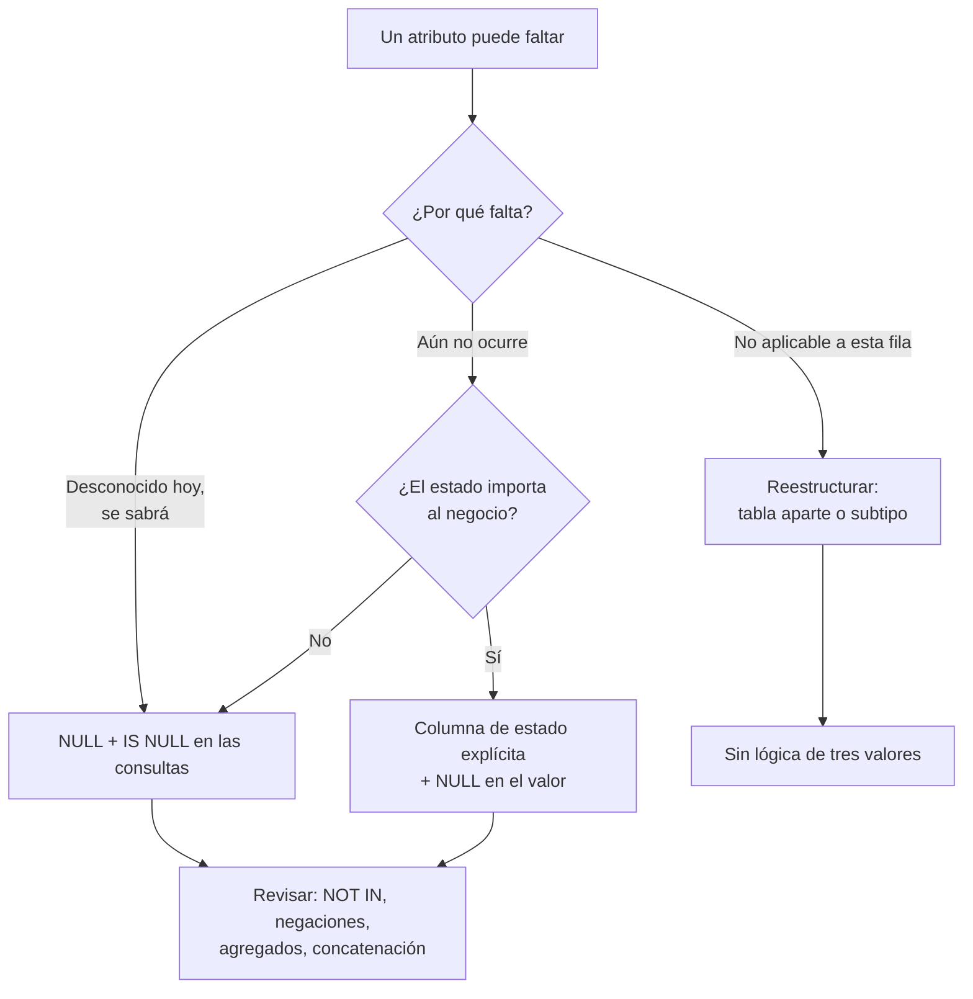

# 029 — Nulos y lógica de tres valores

> [Programa](../../../README.md) · [Parte 04](../README.md) · [← Anterior](../../part-04-sql-en-profundidad/028-cte-subconsultas-y-funciones-de-ventana/README.md) · [Siguiente →](../../part-05-motores-relacionales-y-dialectos/030-portabilidad-y-matriz-de-dialectos/README.md)

Parte 04 — SQL en profundidad · Intermedio ·
3 horas estimadas · motores `postgresql`, `sqlite`, `mysql` · laboratorio
[`labs/01-sql-foundations`](../../../labs/01-sql-foundations/README.md) · 3 fuentes.

**Conceptos centrales:** `UNKNOWN` · `IS DISTINCT FROM` · `NOT IN con nulos` · `agregados y nulos`

**En este caso se comparan 7 motores**: 5 lo resuelven (5 con el resultado comprobado por máquina) y 2 no, con el motivo escrito.

---

## Propósito

Manejar la ausencia de información sin que produzca resultados falsos. El nulo de SQL no es un valor: es una marca, y la lógica que lo gobierna tiene tres estados, no dos.

## Resultados de aprendizaje

Al terminar podrás:

1. Evaluar expresiones bajo lógica de tres valores.
2. Explicar por qué `NULL = NULL` no es verdadero y dónde sí se comparan como iguales.
3. Predecir el efecto de los nulos en `WHERE`, `JOIN`, `GROUP BY`, `UNIQUE` y `CHECK`.
4. Elegir entre `IS DISTINCT FROM`, `COALESCE` y reestructurar el esquema.
5. Distinguir los tres significados que la gente mete en un mismo nulo.

## Fundamentos

### Tres valores de verdad

Codd (1979) introdujo el nulo para representar información faltante. La consecuencia es que toda comparación con nulo devuelve `UNKNOWN`:

```text
AND       V   F   U          OR        V   F   U          NOT
V         V   F   U          V         V   V   V          V -> F
F         F   F   F          F         V   F   U          F -> V
U         U   F   U          U         V   U   U          U -> U
```

Regla operativa: **`WHERE` deja pasar solo `TRUE`**. `FALSE` y `UNKNOWN` se descartan igual, y esa equiparación es la que engaña.

### Dónde los nulos se comportan de forma distinta

Aquí está la inconsistencia real de SQL, y conviene tenerla en una tabla:

| Contexto | ¿Dos nulos son iguales? |
|---|---|
| `WHERE a = b` | No (`UNKNOWN`) |
| `GROUP BY` | **Sí**: todos los nulos forman un solo grupo |
| `DISTINCT` | **Sí**: se conserva un solo nulo |
| `UNION` / `INTERSECT` / `EXCEPT` | **Sí** |
| `ORDER BY` | **Sí**: se agrupan al principio o al final |
| Índice `UNIQUE` | **No** (norma): admite varios nulos |
| `IS NOT DISTINCT FROM` | **Sí**, por definición |
| Clave primaria | Prohibidos |

Que `GROUP BY` los agrupe y `=` no los iguale no es un error de nadie: son operadores distintos con definiciones distintas. Pero explica por qué un `DISTINCT` y un `JOIN` sobre la misma columna dan resultados que no cuadran.

### El caso `UNIQUE`

```sql
CREATE TABLE t (email TEXT UNIQUE);
INSERT INTO t VALUES (NULL), (NULL), (NULL);   -- las tres pasan
```

Según la norma, un índice único admite múltiples nulos, porque no puede afirmar que dos desconocidos sean iguales. SQL Server es la excepción: solo admite uno. PostgreSQL 15 añadió `UNIQUE NULLS NOT DISTINCT` para el otro comportamiento.

Este detalle se aprovecha a propósito: una columna generada que vale `NULL` cuando la fila no debe participar en la restricción emula la unicidad condicional en motores sin índices parciales (clase 014).

### Las tres trampas

**1. `NOT IN` con nulos:**

```sql
SELECT * FROM students WHERE id NOT IN (SELECT student_id FROM enrollments);
```

Si la subconsulta devuelve un nulo, la expresión se convierte en `id<>x ∧ id<>y ∧ id<>NULL` → `... ∧ UNKNOWN` → nunca `TRUE`. Resultado: **cero filas**, sin error. `NOT EXISTS` no tiene este problema.

**2. Negación que no devuelve el complemento:**

```sql
SELECT COUNT(*) FROM enrollments WHERE nota >= 4.0;   -- 24
SELECT COUNT(*) FROM enrollments WHERE nota <  4.0;   -- 8
SELECT COUNT(*) FROM enrollments;                      -- 40
```

24 + 8 = 32, no 40. Faltan las 8 filas con nota nula, que no cumplen ninguna de las dos condiciones. Para el complemento real: `WHERE nota < 4.0 OR nota IS NULL`.

**3. Concatenación y aritmética:**

```sql
SELECT 'Total: ' || total FROM ventas;   -- NULL si total es NULL, no 'Total: '
SELECT precio * cantidad FROM items;     -- NULL si cualquiera lo es
```

Un nulo se propaga por toda la expresión.

### Tres significados en una sola marca

El problema de fondo, que ninguna sintaxis resuelve: `NULL` se usa para al menos tres cosas distintas.

| Significado | Ejemplo | Tratamiento correcto |
|---|---|---|
| Desconocido | No sabemos el teléfono, pero existe | Nulo es adecuado |
| No aplicable | Fecha de egreso de quien sigue estudiando | Mejor reestructurar |
| Aún no ocurrido | Nota de una inscripción sin calificar | Nulo o estado explícito |

Date argumenta que confundirlos es la raíz del problema, y propone evitar los nulos reestructurando: sacar el atributo opcional a una tabla propia donde su ausencia se representa como ausencia de fila. Es la solución más limpia y también la que añade una reunión; la decisión se toma caso a caso.



## Ejemplo trabajado

Tabla `enrollments` con 40 filas: 24 con nota ≥ 4,0; 8 con nota < 4,0; 8 con nota nula.

```sql
-- 1. ¿Cuántos no aprobaron?
SELECT COUNT(*) FROM enrollments WHERE nota < 4.0;                   -- 8
SELECT COUNT(*) FROM enrollments WHERE NOT (nota >= 4.0);            -- 8  (¡no 16!)
SELECT COUNT(*) FROM enrollments WHERE nota < 4.0 OR nota IS NULL;   -- 16
```

La segunda consulta es la que engaña: parece la negación de la primera y no lo es, porque `NOT UNKNOWN` es `UNKNOWN`.

```sql
-- 2. Promedio: dos preguntas distintas
SELECT AVG(nota) FROM enrollments;                      -- sobre 32 calificados
SELECT AVG(COALESCE(nota, 0)) FROM enrollments;         -- sobre 40, no calificadas = 0
```

```sql
-- 3. Comparar dos columnas que pueden ser nulas
SELECT * FROM notas WHERE nota_anterior <> nota;                     -- pierde filas
SELECT * FROM notas WHERE nota_anterior IS DISTINCT FROM nota;       -- correcto
```

`IS DISTINCT FROM` trata dos nulos como iguales y un nulo frente a un valor como distintos, que es lo que casi siempre se quiere al detectar cambios. Está en PostgreSQL y SQLite; MySQL usa el operador `<=>` para la forma negada.

**Reestructuración como alternativa.** Si `fecha_egreso` es nula para todos los estudiantes activos, en vez de:

```sql
CREATE TABLE students (id INTEGER PRIMARY KEY, nombre TEXT, fecha_egreso DATE);
```

se puede escribir:

```sql
CREATE TABLE students  (id INTEGER PRIMARY KEY, nombre TEXT NOT NULL);
CREATE TABLE egresos   (student_id INTEGER PRIMARY KEY REFERENCES students(id),
                        fecha DATE NOT NULL);
```

Ahora «egresado» es la existencia de una fila, no un valor especial. Las consultas usan `EXISTS`/`NOT EXISTS` y desaparece la lógica de tres valores. El costo: una reunión más y una tabla más.

**Traza del beneficio:** la consulta «estudiantes no egresados» pasa de `WHERE fecha_egreso IS NULL` —correcta pero frágil ante quien escriba `<> ''`— a `NOT EXISTS (...)`, que no admite interpretación ambigua.

## Comparación

| Operación | Con nulos | Alternativa segura |
|---|---|---|
| `a = b` | `UNKNOWN` | `a IS NOT DISTINCT FROM b` |
| `a <> b` | `UNKNOWN` | `a IS DISTINCT FROM b` |
| `x NOT IN (sub)` | Vacío si hay nulos | `NOT EXISTS` |
| `SUM(col)` sobre vacío | `NULL` | `COALESCE(SUM(col), 0)` |
| `'a' \|\| col` | `NULL` | `'a' \|\| COALESCE(col, '')` |
| `CHECK (col > 0)` | Acepta nulos | `CHECK (col IS NOT NULL AND col > 0)` |

## Errores frecuentes

1. **`= NULL` en vez de `IS NULL`.** No da error: no devuelve nada.
2. **Suponer que una condición y su negación cubren todas las filas.** Nunca cubren los nulos.
3. **`NOT IN` con subconsulta sin `NOT NULL` garantizado.**
4. **`CHECK` que no rechaza nulos.** Deja pasar exactamente lo que se quería prohibir.
5. **Usar un centinela (`-1`, `''`, `'1900-01-01'`).** Cambia un problema conocido por uno silencioso que contamina agregados.
6. **Permitir nulos por defecto al crear tablas.** `NOT NULL` debería ser la elección por omisión mental.

## De la clase a la operación

Los descuadres entre informes suelen resolverse en la misma línea: uno de los dos contaba los nulos y el otro no. Declarar `NOT NULL` siempre que sea cierto elimina la clase entera de problemas antes de que exista.

## Reto de transferencia

1. Localiza en un esquema real una columna que admita nulos con dos significados distintos mezclados.
2. Escribe una consulta que hoy devuelva un resultado incorrecto por esa causa, con las cifras.
3. Propón la reestructuración que elimina el nulo y estima su costo.
4. Audita tu código en busca de `NOT IN` sobre subconsultas y verifica cuáles pueden devolver nulos.

## Preguntas de evaluación

1. Evalúa `NULL OR TRUE`, `NULL AND FALSE` y `NOT NULL` bajo lógica de tres valores.
2. ¿Por qué `GROUP BY` agrupa los nulos y `=` no los iguala?
3. Da un caso donde un índice `UNIQUE` con varios nulos sea el comportamiento deseado.
4. Convierte una columna con nulo «no aplicable» a un diseño sin nulos y compara las dos consultas equivalentes.

---

## 🌐 El mismo problema en cada motor

**Caso:** Quién no está inscrito en nada, cuando hay un nulo de por medio

En SQL una comparación no devuelve verdadero o falso: devuelve verdadero,
falso o **desconocido**. Y `NULL` no es un valor, es la ausencia de valor:
`NULL = NULL` no es cierto, y `NULL <> 'Ada'` tampoco es cierto.

El caso pide los estudiantes sin ninguna inscripción. En la tabla de
inscripciones hay una fila con el estudiante en nulo —dato sucio, de los que
hay en cualquier sistema real—, y esa única fila basta para que la forma
escrita con `NOT IN` devuelva **cero filas** en vez de una. No lanza un
error: devuelve un informe vacío. La forma con `NOT EXISTS` devuelve lo
correcto: Grace.

Salida esperada, idéntica en todos los motores que lo resuelven:

| nombre |
|---|
| `Grace` |

El contrato vive en [`motores.yaml`](motores.yaml) y lo comprueba
`python scripts/verificar_equivalencia.py --clase 029`: 5 de
las 5 implementaciones se ejecutan de verdad y su
resultado se compara con esa tabla; el resto se declara como material revisado,
no ejecutado.

| Motor | ¿Resuelve el caso? | Nivel de prueba | Código | Fuente |
|---|---|---|---|---|
| SQLite | sí | núcleo | [código](implementaciones/sqlite/consulta.sql) | [doc oficial](https://sqlite.org/nulls.html) |
| DuckDB | sí | núcleo | [código](implementaciones/duckdb/consulta.sql) | [doc oficial](https://duckdb.org/docs/stable/sql/expressions/comparison_operators.html) |
| PostgreSQL | sí | servicio | [código](implementaciones/postgresql/consulta.sql) | [doc oficial](https://www.postgresql.org/docs/current/functions-subquery.html) |
| MySQL | sí | servicio | [código](implementaciones/mysql/consulta.sql) | [doc oficial](https://dev.mysql.com/doc/refman/8.4/en/working-with-null.html) |
| MongoDB | sí | servicio | [código](implementaciones/mongodb/consulta.js) | [doc oficial](https://www.mongodb.com/docs/manual/reference/operator/query/type/) |
| Apache Cassandra | **no** | — | — | [doc oficial](https://cassandra.apache.org/doc/latest/cassandra/managing/operating/compaction/) |
| Redis | **no** | — | — | [doc oficial](https://redis.io/docs/latest/commands/hget/) |

### Los que resuelven el caso

#### SQLite · [`implementaciones/sqlite/consulta.sql`](implementaciones/sqlite/consulta.sql)

✅ **verificado** — se ejecuta en CI sin servicios

```sql
-- motor: sqlite
-- doc: https://sqlite.org/nulls.html

-- === preparacion ===
CREATE TABLE estudiantes (
    nombre TEXT PRIMARY KEY
);
CREATE TABLE inscripciones (
    id         INTEGER PRIMARY KEY,
    estudiante TEXT,          -- admite nulo: el dato sucio del mundo real
    curso      TEXT NOT NULL
);

INSERT INTO estudiantes (nombre) VALUES ('Ada'), ('Linus'), ('Grace');
INSERT INTO inscripciones (id, estudiante, curso) VALUES
    (1, 'Ada',   'DB-101'),
    (2, 'Linus', 'DB-101'),
    (3, NULL,    'SE-201');   -- una sola fila asi rompe el NOT IN

-- === consulta ===
-- La forma CORRECTA. La forma rota seria:
--   SELECT nombre FROM estudiantes
--   WHERE nombre NOT IN (SELECT estudiante FROM inscripciones);
-- que devuelve CERO filas. Al comparar 'Grace' con el nulo, el resultado no es
-- falso sino DESCONOCIDO; NOT IN exige que todas las comparaciones sean falsas,
-- y «desconocido» no lo es. El informe sale vacio y nadie ve un error.
SELECT e.nombre
FROM estudiantes e
WHERE NOT EXISTS (
    SELECT 1 FROM inscripciones i WHERE i.estudiante = e.nombre
)
ORDER BY e.nombre;
```

- **Por qué sí:** Implementa la lógica de tres valores del estándar, así que el fallo del `NOT IN` se reproduce aquí igual que en cualquier motor grande: es el sitio más barato para verlo con los propios ojos.
- **Por qué no:** Permite nulos en columnas de clave primaria salvo en tablas `STRICT` o con `NOT NULL` explícito, una desviación del estándar que multiplica las ocasiones de encontrarse un nulo donde no debía haberlo.
- 📄 Documentación oficial: <https://sqlite.org/nulls.html>

#### DuckDB · [`implementaciones/duckdb/consulta.sql`](implementaciones/duckdb/consulta.sql)

✅ **verificado** — se ejecuta en CI sin servicios

```sql
-- motor: duckdb
-- doc: https://duckdb.org/docs/stable/sql/expressions/comparison_operators.html
-- nota: IS DISTINCT FROM compara tratando el nulo como un valor mas. La forma
--         WHERE i.estudiante IS NOT DISTINCT FROM e.nombre
--       es la que hay que usar al comparar filas que pueden traer nulos.

-- === preparacion ===
CREATE TABLE estudiantes (
    nombre VARCHAR PRIMARY KEY
);
CREATE TABLE inscripciones (
    id         INTEGER PRIMARY KEY,
    estudiante VARCHAR,          -- admite nulo: el dato sucio del mundo real
    curso      VARCHAR NOT NULL
);

INSERT INTO estudiantes (nombre) VALUES ('Ada'), ('Linus'), ('Grace');
INSERT INTO inscripciones (id, estudiante, curso) VALUES
    (1, 'Ada',   'DB-101'),
    (2, 'Linus', 'DB-101'),
    (3, NULL,    'SE-201');   -- una sola fila asi rompe el NOT IN

-- === consulta ===
-- La forma CORRECTA. La forma rota seria:
--   SELECT nombre FROM estudiantes
--   WHERE nombre NOT IN (SELECT estudiante FROM inscripciones);
-- que devuelve CERO filas. Al comparar 'Grace' con el nulo, el resultado no es
-- falso sino DESCONOCIDO; NOT IN exige que todas las comparaciones sean falsas,
-- y «desconocido» no lo es. El informe sale vacio y nadie ve un error.
SELECT e.nombre
FROM estudiantes e
WHERE NOT EXISTS (
    SELECT 1 FROM inscripciones i WHERE i.estudiante = e.nombre
)
ORDER BY e.nombre;
```

- **Por qué sí:** Sigue el estándar y añade `IS DISTINCT FROM`, que compara tratando el nulo como un valor más: es la herramienta correcta para detectar cambios entre dos versiones de una fila sin que los nulos estropeen la comparación.
- **Por qué no:** En analítica los nulos llegan por millones desde ficheros mal formados, y las funciones de agregación los ignoran en silencio: `AVG` sobre una columna medio vacía devuelve un número perfectamente creíble y equivocado.
- 📄 Documentación oficial: <https://duckdb.org/docs/stable/sql/expressions/comparison_operators.html>

#### PostgreSQL · [`implementaciones/postgresql/consulta.sql`](implementaciones/postgresql/consulta.sql)

✅ **verificado** — se ejecuta contra el motor real levantado con `docker compose`

```sql
-- motor: postgresql
-- doc: https://www.postgresql.org/docs/current/functions-subquery.html
-- nota: la documentacion avisa expresamente de que NOT IN sobre una subconsulta
--       con nulos no hace lo que parece. No es un fallo del motor: es la logica
--       de tres valores del estandar aplicada al pie de la letra.

DROP TABLE IF EXISTS inscripciones, estudiantes;

-- === preparacion ===
CREATE TABLE estudiantes (
    nombre text PRIMARY KEY
);
CREATE TABLE inscripciones (
    id         integer PRIMARY KEY,
    estudiante text,          -- admite nulo: el dato sucio del mundo real
    curso      text NOT NULL
);

INSERT INTO estudiantes (nombre) VALUES ('Ada'), ('Linus'), ('Grace');
INSERT INTO inscripciones (id, estudiante, curso) VALUES
    (1, 'Ada',   'DB-101'),
    (2, 'Linus', 'DB-101'),
    (3, NULL,    'SE-201');   -- una sola fila asi rompe el NOT IN

-- === consulta ===
-- La forma CORRECTA. La forma rota seria:
--   SELECT nombre FROM estudiantes
--   WHERE nombre NOT IN (SELECT estudiante FROM inscripciones);
-- que devuelve CERO filas. Al comparar 'Grace' con el nulo, el resultado no es
-- falso sino DESCONOCIDO; NOT IN exige que todas las comparaciones sean falsas,
-- y «desconocido» no lo es. El informe sale vacio y nadie ve un error.
SELECT e.nombre
FROM estudiantes e
WHERE NOT EXISTS (
    SELECT 1 FROM inscripciones i WHERE i.estudiante = e.nombre
)
ORDER BY e.nombre;
```

- **Por qué sí:** Su documentación es explícita sobre la trampa del `NOT IN` con subconsultas que pueden devolver nulos, y ofrece las herramientas para evitarla: `NOT EXISTS`, `IS DISTINCT FROM` y restricciones `NOT NULL`.
- **Por qué no:** El índice B-Tree por omisión sí indexa los nulos, pero `UNIQUE` los deja pasar todos: una columna única y anulable admite mil filas con nulo, que casi nunca es lo que se quería.
- 📄 Documentación oficial: <https://www.postgresql.org/docs/current/functions-subquery.html>

#### MySQL · [`implementaciones/mysql/consulta.sql`](implementaciones/mysql/consulta.sql)

✅ **verificado** — se ejecuta contra el motor real levantado con `docker compose`

```sql
-- motor: mysql
-- doc: https://dev.mysql.com/doc/refman/8.4/en/working-with-null.html
-- nota: el operador <=> compara con nulos de forma segura: NULL <=> NULL es
--       verdadero. No es estandar, pero evita salir a una subconsulta.

DROP TABLE IF EXISTS inscripciones;
DROP TABLE IF EXISTS estudiantes;

-- === preparacion ===
CREATE TABLE estudiantes (
    nombre VARCHAR(50) PRIMARY KEY
);
CREATE TABLE inscripciones (
    id         INT PRIMARY KEY,
    estudiante VARCHAR(50),          -- admite nulo: el dato sucio del mundo real
    curso      VARCHAR(50) NOT NULL
);

INSERT INTO estudiantes (nombre) VALUES ('Ada'), ('Linus'), ('Grace');
INSERT INTO inscripciones (id, estudiante, curso) VALUES
    (1, 'Ada',   'DB-101'),
    (2, 'Linus', 'DB-101'),
    (3, NULL,    'SE-201');   -- una sola fila asi rompe el NOT IN

-- === consulta ===
-- La forma CORRECTA. La forma rota seria:
--   SELECT nombre FROM estudiantes
--   WHERE nombre NOT IN (SELECT estudiante FROM inscripciones);
-- que devuelve CERO filas. Al comparar 'Grace' con el nulo, el resultado no es
-- falso sino DESCONOCIDO; NOT IN exige que todas las comparaciones sean falsas,
-- y «desconocido» no lo es. El informe sale vacio y nadie ve un error.
SELECT e.nombre
FROM estudiantes e
WHERE NOT EXISTS (
    SELECT 1 FROM inscripciones i WHERE i.estudiante = e.nombre
)
ORDER BY e.nombre;
```

- **Por qué sí:** Tiene la misma semántica de tres valores y añade el operador `<=>`, que compara con nulos de forma segura sin salirse a una subconsulta.
- **Por qué no:** Sin modo estricto, insertar `NULL` en una columna `NOT NULL` no fallaba: guardaba el valor por omisión y emitía un aviso. Hay tablas heredadas llenas de cadenas vacías y ceros que en realidad significan «no se sabe».
- 📄 Documentación oficial: <https://dev.mysql.com/doc/refman/8.4/en/working-with-null.html>

#### MongoDB · [`implementaciones/mongodb/consulta.js`](implementaciones/mongodb/consulta.js)

✅ **verificado** — se ejecuta contra el motor real levantado con `docker compose`

```javascript
// motor: mongodb
// doc: https://www.mongodb.com/docs/manual/reference/operator/query/type/
// nota: la trampa aqui es otra. { estudiante: null } encuentra TANTO los
//       documentos con el campo en null COMO los que no tienen el campo. Para
//       distinguirlos hay que usar { estudiante: { $type: "null" } } frente a
//       { estudiante: { $exists: false } }.

// === preparacion ===
db.estudiantes.drop();
db.inscripciones.drop();

db.estudiantes.insertMany([
  { nombre: "Ada" },
  { nombre: "Linus" },
  { nombre: "Grace" },
]);
db.inscripciones.insertMany([
  { estudiante: "Ada", curso: "DB-101" },
  { estudiante: "Linus", curso: "DB-101" },
  { estudiante: null, curso: "SE-201" },
]);

// === consulta ===
db.estudiantes
  .aggregate([
    { $lookup: { from: "inscripciones", localField: "nombre",
                 foreignField: "estudiante", as: "i" } },
    { $match: { i: { $size: 0 } } },
    { $project: { _id: 0, nombre: 1 } },
    { $sort: { nombre: 1 } },
  ])
  .forEach((d) => print(d.nombre));
```

- **Por qué sí:** Resuelve la pregunta sin subconsultas, con `$lookup` y comprobando que el arreglo resultante esté vacío: la ausencia se mide por tamaño, no por comparación con un nulo.
- **Por qué no:** Aquí hay **dos** formas de ausencia —el campo con valor `null` y el campo que no existe— y `{campo: null}` encuentra las dos. Es una trampa peor que la de SQL, porque no hay error ni resultado vacío: hay resultados de más.
- 📄 Documentación oficial: <https://www.mongodb.com/docs/manual/reference/operator/query/type/>

### Los que no resuelven este caso — y qué se hace en su lugar

Descartar un motor con un argumento es tan formativo como usarlo. Ninguna de estas filas dice que el motor sea peor: dice que este problema no es el suyo.

| Motor | Por qué no | Qué se hace en su lugar | Fuente |
|---|---|---|---|
| Apache Cassandra | Escribir un nulo no guarda un nulo: crea una **lápida** (`tombstone`), un marcador de borrado que ocupa espacio, viaja a las réplicas y hay que recorrer en cada lectura. Miles de lápidas en una partición hacen que la lectura falle por tiempo de espera. | No escribir la columna en absoluto cuando no hay valor: en Cassandra una columna ausente y una columna nula no son lo mismo, y la ausente es gratis. | [doc](https://cassandra.apache.org/doc/latest/cassandra/managing/operating/compaction/) |
| Redis | No existe el nulo: una clave está o no está, y un campo de hash existe o no existe. La lógica es de dos valores, lo que evita la trampa a cambio de no poder distinguir «no se sabe» de «no aplica». | Codificar explícitamente el desconocido con un valor centinela acordado, y documentarlo: si el centinela no está escrito en algún sitio, dentro de un año nadie sabrá si `""` significaba vacío o desconocido. | [doc](https://redis.io/docs/latest/commands/hget/) |

---

## Laboratorio

```bash
python scripts/validate_repository.py
python labs/01-sql-foundations/run_lab.py
```

Guarda como evidencia la salida completa, la versión del motor y la semilla o
los parámetros usados. Una captura sin comando no es evidencia: no se puede
repetir.

## Evaluación

| Criterio | Peso | Qué se comprueba |
|---|---:|---|
| Comprensión conceptual | 25 % | Explica el mecanismo, no solo el resultado |
| Ejecución reproducible | 25 % | Otra persona obtiene lo mismo con las instrucciones dadas |
| Interpretación basada en evidencia | 25 % | Cada conclusión se apoya en una salida o una medición |
| Límites y riesgos declarados | 25 % | Dice qué no demuestra el ejercicio y qué faltaría en producción |

La clase se da por superada cuando la respuesta explica el mecanismo, muestra
la salida que la respalda y declara al menos un límite del ejercicio.

## Fuentes de esta clase

Todo lo afirmado arriba procede de estas obras. Los identificadores viven en
[`catalog/sources.json`](../../../catalog/sources.json) y el estado de los
enlaces se comprueba con `python scripts/check_external_links.py`.

- **E. F. Codd** (1979). [Extending the Database Relational Model to Capture More Meaning](https://dl.acm.org/doi/10.1145/320107.320109). ACM TODS 4(4). DOI [10.1145/320107.320109](https://doi.org/10.1145/320107.320109).  
  Introduce los valores nulos y la semántica de información faltante.
- **C. J. Date** (2015). [SQL and Relational Theory: How to Write Accurate SQL Code](https://www.oreilly.com/library/view/sql-and-relational/9781491941164/). 3.a ed. O'Reilly. ISBN 978-1-4919-4117-1.  
  Separa el modelo relacional de lo que SQL realmente implementa, incluidos los nulos.
- **PostgreSQL Global Development Group** (2026). [PostgreSQL Documentation](https://www.postgresql.org/docs/current/).  
  Documentación de referencia del motor relacional principal del programa.

---

> [Programa](../../../README.md) · [Parte 04](../README.md) · [← Anterior](../../part-04-sql-en-profundidad/028-cte-subconsultas-y-funciones-de-ventana/README.md) · [Siguiente →](../../part-05-motores-relacionales-y-dialectos/030-portabilidad-y-matriz-de-dialectos/README.md)
