# Parte 04 — SQL en profundidad

> [Programa](../../README.md) · [Índice de clases](../README.md) ·
> [Glosario](../../GLOSARIO.md) · [Modelo de aprendizaje](../../docs/LEARNING-MODEL.md)

Escribir SQL cuya semántica se pueda defender: definición del esquema, reuniones, agregación, ventanas y el comportamiento real de los nulos.

**6 clases · 20 horas · 27 conceptos · 9 fuentes**

## Antes de esta parte

Esta parte se apoya en lo trabajado antes. Si vienes de fuera del programa, revisa al menos el vocabulario de:

- [Parte 03 — Modelo relacional y álgebra](../part-03-modelo-relacional-y-algebra/README.md)

## De qué trata esta parte

Seis clases para escribir SQL cuya semántica se pueda defender. No es un recorrido por la sintaxis: es la parte donde se cierran los huecos por los que se cuelan los resultados silenciosamente incorrectos, que son mucho peores que los errores, porque no fallan.

El orden sigue el ciclo de vida de una consulta. Primero el DDL como contrato ejecutable, porque lo que el esquema rechaza no hay que validarlo en ningún lenguaje. Después el `SELECT` con su orden lógico de evaluación y la colación, que decide si `a` es igual a `A`. Luego las cuatro formas de reunir, con la semirreunión como la corrección que más código arregla. La agregación y el doble conteo que produce una reunión previa. Las CTE, la recursión y las funciones de ventana, para lo que no cabe en una expresión. Y al final los nulos, colocados a propósito al cierre para que se vean actuando sobre todo lo anterior.

Si solo hay tiempo para dos clases de esta parte, son la 026 y la 029: reuniones y nulos concentran la mayoría de los errores que llegan a producción sin ser detectados.

## Al terminar esta parte podrás

1. Escribir DDL que exprese las reglas del dominio como restricciones que el motor impone.
2. Predecir el resultado de una consulta razonando desde el orden lógico de evaluación.
3. Elegir entre reunión interna, externa, semi y anti según lo que la pregunta realmente pide.
4. Detectar y corregir un doble conteo causado por una reunión que multiplica filas.
5. Resolver con CTE, recursión o funciones de ventana lo que no cabe en una consulta plana.
6. Predecir el efecto de los nulos en comparaciones, agregados y `NOT IN`.

## Mapa de la parte

```mermaid
flowchart LR
    C024["024<br/>DDL: el esquema como contrato ejecutable"]
    C025["025<br/>SELECT: filtrado, proyección y orden con…"]
    C026["026<br/>Reuniones: interna, externa, semi y anti"]
    C027["027<br/>Agregación, GROUP BY y HAVING sin duplica…"]
    C028["028<br/>CTE, subconsultas y funciones de ventana"]
    C029["029<br/>Nulos y lógica de tres valores"]
    C024 --> C025
    C025 --> C026
    C026 --> C027
    C027 --> C028
    C028 --> C029
    classDef fund fill:#0b3d2e,stroke:#3fb950,color:#fff
    classDef inter fill:#0d2d5e,stroke:#58a6ff,color:#fff
    classDef avan fill:#2d1b4e,stroke:#bc8cff,color:#fff
    class C024 fund
    class C025 fund
    class C026 inter
    class C027 inter
    class C028 inter
    class C029 inter
```

| # | Clase | Nivel | Horas | Fuentes |
|---|---|---|---:|---:|
| [024](024-ddl-el-esquema-como-contrato/README.md) | [DDL: el esquema como contrato ejecutable](024-ddl-el-esquema-como-contrato/README.md) | Fundamentos | 3 | 4 |
| [025](025-select-filtrado-proyeccion-y-orden/README.md) | [SELECT: filtrado, proyección y orden con semántica precisa](025-select-filtrado-proyeccion-y-orden/README.md) | Fundamentos | 3 | 3 |
| [026](026-reuniones-inner-outer-semi-y-anti/README.md) | [Reuniones: interna, externa, semi y anti](026-reuniones-inner-outer-semi-y-anti/README.md) | Intermedio | 4 | 3 |
| [027](027-agregacion-group-by-y-having/README.md) | [Agregación, GROUP BY y HAVING sin duplicar filas](027-agregacion-group-by-y-having/README.md) | Intermedio | 3 | 3 |
| [028](028-cte-subconsultas-y-funciones-de-ventana/README.md) | [CTE, subconsultas y funciones de ventana](028-cte-subconsultas-y-funciones-de-ventana/README.md) | Intermedio | 4 | 4 |
| [029](029-nulos-y-logica-de-tres-valores/README.md) | [Nulos y lógica de tres valores](029-nulos-y-logica-de-tres-valores/README.md) | Intermedio | 3 | 3 |

## Las clases, una por una

### [024 — DDL: el esquema como contrato ejecutable](024-ddl-el-esquema-como-contrato/README.md)

*Fundamentos · 3 h · 4 fuentes · requiere [006](../part-00-primeros-pasos-del-archivo-a-la-base-de-datos/006-tipos-de-datos-un-numero-no-es-un-texto/README.md), [023](../part-03-modelo-relacional-y-algebra/023-integridad-restricciones-y-acciones-referenciales/README.md)*

El DDL leído como un contrato ejecutable: cada tipo y cada restricción es una validación que ya no hay que escribir en ninguna aplicación. Incluye una divergencia que decide cómo se hacen las migraciones: si el DDL es transaccional en tu motor o si una migración a medias deja un estado sin retorno.

**Conceptos que introduce:** `tipo de dato` · `restricción` · `valor por defecto` · `DDL transaccional`

[Ir a la clase →](024-ddl-el-esquema-como-contrato/README.md)

### [025 — SELECT: filtrado, proyección y orden con semántica precisa](025-select-filtrado-proyeccion-y-orden/README.md)

*Fundamentos · 3 h · 3 fuentes · requiere [004](../part-00-primeros-pasos-del-archivo-a-la-base-de-datos/004-leer-datos-select-where-y-order-by/README.md), [020](../part-03-modelo-relacional-y-algebra/020-la-relacion-como-conjunto/README.md)*

El `SELECT` con su semántica exacta: el orden lógico de evaluación que explica por qué un alias del `SELECT` no vale en el `WHERE`, y la colación, que decide si `a` es igual a `A` y dónde va la `ñ`. Cierra con el determinismo de orden, que es la diferencia entre una consulta reproducible y una que cambia el día que cambia el plan.

**Conceptos que introduce:** `predicado` · `orden de evaluación` · `colación` · `determinismo de orden`

[Ir a la clase →](025-select-filtrado-proyeccion-y-orden/README.md)

### [026 — Reuniones: interna, externa, semi y anti](026-reuniones-inner-outer-semi-y-anti/README.md)

*Intermedio · 4 h · 3 fuentes · requiere [008](../part-00-primeros-pasos-del-archivo-a-la-base-de-datos/008-dos-tablas-y-una-relacion/README.md), [021](../part-03-modelo-relacional-y-algebra/021-algebra-relacional-operadores/README.md)*

Las cuatro formas de reunir y cuándo se quiere cada una. La distinción que más código corrige es la semirreunión: el `EXISTS` que casi siempre se quería cuando se escribió un `JOIN` seguido de `DISTINCT`, sin multiplicar filas ni arriesgar el doble conteo.

**Conceptos que introduce:** `reunión interna` · `reunión externa` · `semirreunion` · `antirreunion` · `multiplicación de filas`

[Ir a la clase →](026-reuniones-inner-outer-semi-y-anti/README.md)

### [027 — Agregación, GROUP BY y HAVING sin duplicar filas](027-agregacion-group-by-y-having/README.md)

*Intermedio · 3 h · 3 fuentes · requiere [026](026-reuniones-inner-outer-semi-y-anti/README.md)*

Agregar sin mentir. Explica por qué `WHERE` y `HAVING` no son intercambiables, cómo una reunión previa multiplica filas y produce totales inflados, y cómo se corrige agregando en una CTE antes de reunir. Incluye la divergencia entre motores sobre qué columnas se pueden seleccionar sin agrupar.

**Conceptos que introduce:** `agrupación` · `agregado` · `HAVING` · `doble conteo` · `dependencia funcional en GROUP BY`

[Ir a la clase →](027-agregacion-group-by-y-having/README.md)

### [028 — CTE, subconsultas y funciones de ventana](028-cte-subconsultas-y-funciones-de-ventana/README.md)

*Intermedio · 4 h · 4 fuentes · requiere [026](026-reuniones-inner-outer-semi-y-anti/README.md), [027](027-agregacion-group-by-y-having/README.md)*

Las herramientas para consultas que no caben en una sola expresión: CTE para nombrar pasos, recursión para recorrer jerarquías y funciones de ventana para calcular por grupo sin perder el detalle. La sutileza que más resultados cambia es el marco por defecto de una ventana con `ORDER BY`.

**Conceptos que introduce:** `CTE` · `recursión` · `subconsulta correlacionada` · `partición de ventana` · `marco`

[Ir a la clase →](028-cte-subconsultas-y-funciones-de-ventana/README.md)

### [029 — Nulos y lógica de tres valores](029-nulos-y-logica-de-tres-valores/README.md)

*Intermedio · 3 h · 3 fuentes · requiere [003](../part-00-primeros-pasos-del-archivo-a-la-base-de-datos/003-tu-primera-base-de-datos/README.md), [025](025-select-filtrado-proyeccion-y-orden/README.md)*

La lógica de tres valores y sus consecuencias prácticas: `NOT IN` que devuelve vacío por un solo nulo, agregados que ignoran ausencias y comparaciones que nunca son ciertas. Presenta `IS DISTINCT FROM` como la forma correcta de comparar columnas opcionales, que reaparece al detectar cambios en una migración.

**Conceptos que introduce:** `UNKNOWN` · `IS DISTINCT FROM` · `NOT IN con nulos` · `agregados y nulos`

[Ir a la clase →](029-nulos-y-logica-de-tres-valores/README.md)

## Errores frecuentes en esta parte

Cada uno de estos es una creencia habitual y su corrección. Si alguna te suena
propia, la clase que la desmonta está señalada arriba.

- «`WHERE` y `HAVING` son intercambiables.» `WHERE` filtra filas antes de agrupar y `HAVING` filtra grupos después. Cambiar uno por otro cambia el resultado o el costo.
- «Añadí un `DISTINCT` y ya salen bien.» El `DISTINCT` tapa el síntoma de una reunión que multiplica filas; casi siempre lo que se quería era una semirreunión.
- «`NOT IN` y `NOT EXISTS` son lo mismo.» Con un solo nulo en la subconsulta, `NOT IN` devuelve el conjunto vacío. `NOT EXISTS` no.
- «`LEFT JOIN` conserva las filas sin pareja.» Salvo que pongas una condición sobre la tabla externa en el `WHERE`, que la convierte de nuevo en interna.
- «`COUNT(*)` y `COUNT(columna)` son lo mismo.» El segundo ignora los nulos.

## Vocabulario de la parte

Los 27 términos que esta parte introduce. Cada uno enlaza a la clase
en la que se trabaja, y todos aparecen también en el
[glosario del programa](../../GLOSARIO.md) con sus términos relacionados.

| Término | Qué significa | Se trabaja en |
|---|---|---|
| **agregado** | Conjunto de datos que se trata como una unidad para leer, escribir y garantizar consistencia: un pedido con sus líneas. Sadalage y Fowler lo toman del diseño dirigido por el dominio y lo convierten en el criterio que separa a los motores NoSQL del relacional. (En la clase 027 la palabra se usa en su otro sentido: el resultado de una función de agregación como `SUM` o `COUNT`.) | [027](027-agregacion-group-by-y-having/README.md) |
| **agregados y nulos** | Las funciones de agregado ignoran los nulos, salvo `COUNT(*)` que cuenta filas. Por eso `COUNT(columna)` y `COUNT(*)` difieren, y por eso un `AVG` sobre una columna con huecos es la media de los presentes, no del total. | [029](029-nulos-y-logica-de-tres-valores/README.md) |
| **agrupación** | Partir las filas en grupos por los valores de unas columnas (`GROUP BY`) y producir una fila de resultado por grupo. Todo lo que aparezca en el `SELECT` debe ser o columna de agrupación o resultado de una función de agregado. | [027](027-agregacion-group-by-y-having/README.md) |
| **antirreunion** | Quedarse con las filas que *no* tienen pareja: `NOT EXISTS`, o `LEFT JOIN … WHERE clave IS NULL`. `NOT IN` parece equivalente y no lo es: basta un nulo en la subconsulta para que devuelva el conjunto vacío. | [026](026-reuniones-inner-outer-semi-y-anti/README.md) |
| **colación** | El conjunto de reglas que decide cómo se comparan y ordenan los textos: si `a` = `A`, dónde va la `ñ`, si los acentos cuentan. Cambia el resultado de `ORDER BY`, de `=` y de un `UNIQUE`, y es distinta por defecto en cada motor. | [025](025-select-filtrado-proyeccion-y-orden/README.md) |
| **CTE** | Expresión de tabla común (`WITH … AS`): un resultado con nombre, visible en la consulta que la sigue. Sirve para nombrar pasos intermedios y hacer legible una consulta larga; en algunos motores es además una barrera de optimización, y eso puede ayudar o estorbar. | [028](028-cte-subconsultas-y-funciones-de-ventana/README.md) |
| **DDL transaccional** | Capacidad de ejecutar `CREATE`, `ALTER` o `DROP` dentro de una transacción y poder revertirlos. PostgreSQL y SQLite la tienen; MySQL histórico y Oracle confirman implícitamente, lo que convierte una migración fallida a mitad en un estado sin retorno. | [024](024-ddl-el-esquema-como-contrato/README.md) |
| **dependencia funcional en GROUP BY** | Regla que permite seleccionar una columna no agrupada si depende funcionalmente de la clave de agrupación —agrupar por `id` y seleccionar `nombre`—. PostgreSQL la reconoce; otros motores exigen listar todo, y MySQL en modo laxo devuelve un valor arbitrario sin avisar. | [027](027-agregacion-group-by-y-having/README.md) |
| **determinismo de orden** | Que dos ejecuciones de la misma consulta devuelvan las filas en el mismo orden. Solo lo garantiza un `ORDER BY` cuyas columnas no empaten; con empates, el desempate lo decide el plan y puede cambiar mañana. | [025](025-select-filtrado-proyeccion-y-orden/README.md) |
| **doble conteo** | Sumar o contar sobre un resultado que una reunión ya había multiplicado. El síntoma es un total que crece al añadir un `JOIN` que «solo traía un dato más»; la cura es agregar en una subconsulta o CTE antes de reunir. | [027](027-agregacion-group-by-y-having/README.md) |
| **HAVING** | Filtro que se aplica a los grupos ya formados, después de agregar. `WHERE` descarta filas antes de agrupar y por eso es más barato: la regla es filtrar en `WHERE` todo lo que no dependa del agregado. | [027](027-agregacion-group-by-y-having/README.md) |
| **IS DISTINCT FROM** | Comparación que trata el nulo como un valor más: dos nulos son iguales y un nulo es distinto de cualquier valor, sin producir `UNKNOWN`. Es la forma correcta de comparar columnas opcionales, por ejemplo al detectar cambios en una migración. | [029](029-nulos-y-logica-de-tres-valores/README.md) |
| **marco** | El `ROWS`/`RANGE BETWEEN` que define qué filas de la partición entran en el cálculo de cada fila. Su valor por defecto no es «toda la partición» cuando hay `ORDER BY`, y esa sutileza cambia el resultado de una suma acumulada. | [028](028-cte-subconsultas-y-funciones-de-ventana/README.md) |
| **multiplicación de filas** | Efecto de reunir con una tabla que tiene varias filas por clave: cada fila del lado uno aparece repetida. Es la causa del doble conteo cuando después se suma, y la razón de que agregar antes de reunir sea a menudo la corrección. | [026](026-reuniones-inner-outer-semi-y-anti/README.md) |
| **NOT IN con nulos** | Trampa clásica: si la lista o la subconsulta de un `NOT IN` contiene un solo nulo, el predicado nunca es verdadero y el resultado es vacío. `NOT EXISTS` no tiene ese problema y es la sustitución recomendada. | [029](029-nulos-y-logica-de-tres-valores/README.md) |
| **orden de evaluación** | El orden lógico en que SQL procesa una consulta: `FROM`, `WHERE`, `GROUP BY`, `HAVING`, `SELECT`, `ORDER BY`, `LIMIT`. Explica por qué no se puede usar un alias del `SELECT` en el `WHERE` y por qué `HAVING` filtra grupos y `WHERE` filtra filas. | [025](025-select-filtrado-proyeccion-y-orden/README.md) |
| **partición de ventana** | El `PARTITION BY` de una función de ventana: divide las filas en grupos para calcular el agregado dentro de cada uno, pero sin colapsarlas. Es la diferencia esencial con `GROUP BY`: la ventana conserva el detalle y añade el cálculo al lado. | [028](028-cte-subconsultas-y-funciones-de-ventana/README.md) |
| **predicado** | Expresión lógica que se evalúa a verdadero, falso o desconocido para cada fila. En SQL solo pasan el filtro las filas cuyo predicado es verdadero: `UNKNOWN` se descarta igual que `FALSE`, y ahí empiezan los resultados sorprendentes con nulos. | [025](025-select-filtrado-proyeccion-y-orden/README.md) |
| **recursión** | `WITH RECURSIVE`: una CTE que se referencia a sí misma para recorrer jerarquías y grafos —organigramas, listas de materiales, caminos—. Necesita siempre una condición de parada; sin ella el motor recorre hasta agotar la memoria. | [028](028-cte-subconsultas-y-funciones-de-ventana/README.md) |
| **restricción** | Regla declarada en el esquema que el motor impone siempre: `NOT NULL`, `UNIQUE`, `CHECK`, `PRIMARY KEY`, `FOREIGN KEY`. Su ventaja sobre la validación en la aplicación es que no depende de que alguien se acuerde. | [024](024-ddl-el-esquema-como-contrato/README.md) |
| **reunión externa** | `LEFT`, `RIGHT` o `FULL OUTER JOIN`: conserva las filas sin pareja y rellena con nulos. Cuidado con poner en el `WHERE` una condición sobre la tabla externa: la convierte de nuevo en interna. | [026](026-reuniones-inner-outer-semi-y-anti/README.md) |
| **reunión interna** | `INNER JOIN`: devuelve solo los pares que casan. Las filas sin pareja desaparecen, y ese descarte silencioso es la causa más frecuente de informes con menos filas de las esperadas. | [026](026-reuniones-inner-outer-semi-y-anti/README.md) |
| **semirreunion** | Filtrar una tabla por la existencia de una pareja, sin traer columnas de la otra ni multiplicar filas: `WHERE EXISTS (…)` o `IN (…)`. Es lo que casi siempre se quería cuando se escribió un `JOIN` seguido de `DISTINCT`. | [026](026-reuniones-inner-outer-semi-y-anti/README.md) |
| **subconsulta correlacionada** | Subconsulta que referencia una columna de la consulta externa y por tanto se evalúa en función de cada fila. Conceptualmente es un bucle; los optimizadores modernos suelen convertirla en una reunión, pero conviene comprobarlo en el plan y no suponerlo. | [028](028-cte-subconsultas-y-funciones-de-ventana/README.md) |
| **tipo de dato** | La declaración que fija qué valores acepta una columna y qué operaciones tienen sentido sobre ella. Es la primera línea de defensa del esquema y la más barata: lo que el tipo rechaza no hay que validarlo en ningún lenguaje de aplicación. | [024](024-ddl-el-esquema-como-contrato/README.md) |
| **UNKNOWN** | El tercer valor de verdad de SQL, resultado de comparar con un nulo. No es verdadero ni falso: `NOT UNKNOWN` sigue siendo `UNKNOWN`, y un `WHERE` que se evalúa a `UNKNOWN` descarta la fila igual que si fuera falso. | [029](029-nulos-y-logica-de-tres-valores/README.md) |
| **valor por defecto** | Valor que el motor asigna cuando el `INSERT` no menciona la columna. Bien usado evita nulos accidentales; mal usado enmascara datos que faltaban de verdad y que convenía detectar. | [024](024-ddl-el-esquema-como-contrato/README.md) |

## Fuentes usadas en esta parte

9 obras distintas sostienen lo que se afirma en estas
6 clases. Los identificadores viven en
[`catalog/sources.json`](../../catalog/sources.json) y el estado de los enlaces
se comprueba con `python scripts/check_external_links.py`.

- **Hector Garcia-Molina, Jeffrey D. Ullman, Jennifer Widom** (2008). [Database Systems: The Complete Book](http://infolab.stanford.edu/~ullman/dscb.html). 2.a ed. Pearson. ISBN 978-0-13-187325-4.  
  Tratamiento formal de dependencias funcionales, normalización y optimización.  
  *Se cita en las clases 027.*
- **Joe Celko** (2014). [Joe Celko's SQL for Smarties: Advanced SQL Programming](https://www.sciencedirect.com/book/9780128007617/joe-celkos-sql-for-smarties). 5.a ed. Morgan Kaufmann. ISBN 978-0-12-800761-7.  
  Modelado de jerarquias, conjuntos anidados y SQL declarativo avanzado.  
  *Se cita en las clases 027, 028.*
- **Anthony Molinaro, Robert de Graaf** (2020). [SQL Cookbook](https://www.oreilly.com/library/view/sql-cookbook-2nd/9781492077435/). 2.a ed. O'Reilly. ISBN 978-1-4920-7744-2.  
  Recetas comparadas entre dialectos, útil para la matriz de portabilidad.  
  *Se cita en las clases 025, 026, 027, 028.*
- **Markus Winand** (2012). [SQL Performance Explained](https://use-the-index-luke.com/). Markus Winand. ISBN 978-3-9503078-2-5.  
  Versión web gratuita. Índices B-Tree y su relación con el orden de las columnas.  
  *Se cita en las clases 026.*
- **C. J. Date** (2015). [SQL and Relational Theory: How to Write Accurate SQL Code](https://www.oreilly.com/library/view/sql-and-relational/9781491941164/). 3.a ed. O'Reilly. ISBN 978-1-4919-4117-1.  
  Separa el modelo relacional de lo que SQL realmente implementa, incluidos los nulos.  
  *Se cita en las clases 024, 025, 026, 029.*
- **PostgreSQL Global Development Group** (2026). [PostgreSQL Documentation](https://www.postgresql.org/docs/current/).  
  Documentación de referencia del motor relacional principal del programa.  
  *Se cita en las clases 024, 028, 029.*
- **SQLite Consortium** (2026). [SQLite Documentation](https://sqlite.org/docs.html).  
  Motor embebido usado por los laboratorios sin dependencias del programa.  
  *Se cita en las clases 024, 025.*
- **E. F. Codd** (1979). [Extending the Database Relational Model to Capture More Meaning](https://dl.acm.org/doi/10.1145/320107.320109). ACM TODS 4(4). DOI [10.1145/320107.320109](https://doi.org/10.1145/320107.320109).  
  Introduce los valores nulos y la semántica de información faltante.  
  *Se cita en las clases 029.*
- **ISO/IEC JTC 1/SC 32** (2023). [ISO/IEC 9075: Information technology - Database languages - SQL](https://www.iso.org/standard/76583.html).  
  Norma del lenguaje SQL. Ningún motor la implementa por completo.  
  *Se cita en las clases 024, 028.*

## Cómo estudiar esta parte

El mismo método en las 74 clases, y conviene respetar el orden:

1. **Lee el vocabulario antes que la materia.** Cada clase define sus términos
   arriba precisamente para que no haya que deducirlos del contexto.
2. **Ejecuta el ejemplo trabajado mientras lees**, no después. La mitad de lo
   que se aprende aquí solo aparece cuando la salida no es la esperada.
3. **Compara los motores.** La sección comparada muestra el mismo problema
   resuelto —o descartado con argumento— en varios sistemas. Lee también las
   filas de los que no lo resuelven: descartar con motivo es la habilidad que
   se evalúa en el proyecto final.
4. **Responde las preguntas de evaluación por escrito.** Una respuesta que no
   se puede escribir en tres líneas todavía no está entendida.
5. **Haz el reto de transferencia.** Es el único ejercicio que comprueba si el
   concepto se puede aplicar a un caso que la clase no mostró.
6. **Guarda la evidencia**: comando, versión del motor, semilla y salida
   completa. Sin eso no hay nota, porque no hay nada que revisar.

## Otras partes

- [Parte 00 — Primeros pasos: del archivo a la base de datos](../part-00-primeros-pasos-del-archivo-a-la-base-de-datos/README.md)
- [Parte 01 — Fundamentos, sistemas y método](../part-01-fundamentos-datos-sistemas-y-metodo/README.md)
- [Parte 02 — Modelado conceptual y requisitos](../part-02-modelado-conceptual-y-requisitos/README.md)
- [Parte 03 — Modelo relacional y álgebra](../part-03-modelo-relacional-y-algebra/README.md)
- [Parte 05 — Motores relacionales y dialectos](../part-05-motores-relacionales-y-dialectos/README.md)
- [Parte 06 — Documentos y clave-valor](../part-06-documentos-y-clave-valor/README.md)
- [Parte 07 — Grafos, columnas, tiempo y búsqueda](../part-07-grafos-columnas-tiempo-y-busqueda/README.md)
- [Parte 08 — Transacciones, concurrencia y recuperación](../part-08-transacciones-concurrencia-y-recuperacion/README.md)
- [Parte 09 — Almacenamiento, índices y planes](../part-09-almacenamiento-indices-y-planes/README.md)
- [Parte 10 — Distribución, réplica y consistencia](../part-10-distribucion-replica-y-consistencia/README.md)
- [Parte 11 — Operación, seguridad y gobierno](../part-11-operacion-seguridad-y-gobierno/README.md)
- [Parte 12 — Analítica, integración y streaming](../part-12-analitica-integracion-y-streaming/README.md)
- [Parte 13 — Vectores, recuperación y RAG](../part-13-vectores-recuperacion-y-rag/README.md)
- [Parte 14 — Arquitectura y proyecto final](../part-14-arquitectura-y-proyecto-final/README.md)
