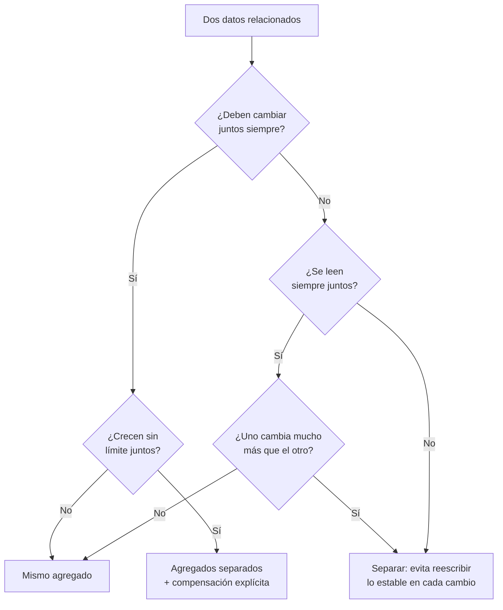

## Propósito

Entender la idea que organiza casi todo el mundo no relacional: el **agregado**. Elegir sus fronteras es elegir dónde hay transacciones y dónde no.

## Resultados de aprendizaje

Al terminar podrás:

1. Definir agregado y distinguirlo de entidad y de tabla.
2. Explicar por qué la frontera del agregado es la frontera de la atomicidad.
3. Aplicar el criterio de Helland sobre entidades y actividades.
4. Diseñar la coherencia entre agregados sin transacción distribuida.
5. Reconocer cuándo un agregado mal elegido produce un punto caliente.

## Fundamentos

### Qué es un agregado

Sadalage y Fowler toman el término del diseño dirigido por el dominio: un **agregado** es un conjunto de datos que se trata como una unidad para lectura y escritura. Un pedido con sus líneas y su dirección de envío es un agregado; el cliente que lo hizo es otro.

En un modelo relacional el agregado no existe: cada entidad es su tabla y la transacción puede abarcar cuantas quiera. En los modelos documental, clave-valor y de columnas anchas, el agregado **es** la unidad de almacenamiento, de replicación y —esto es lo decisivo— de **atomicidad**.

| Modelo | Unidad de atomicidad garantizada |
|---|---|
| Relacional | La transacción, sobre cualquier conjunto de tablas |
| Documental | El documento; varios documentos solo con transacciones explícitas |
| Clave-valor | La clave; operaciones multiclave solo con guiones o transacciones |
| Columnas anchas | La partición |

### La consecuencia

Si dos datos deben cambiar juntos **siempre**, deben estar en el mismo agregado o hay que asumir explícitamente la inconsistencia transitoria. No hay tercera opción barata.

Ejemplo: «el saldo del monedero y el registro del movimiento deben cuadrar». En un solo documento, la escritura es atómica. En dos documentos, existe un instante en que uno se escribió y el otro no; si el proceso muere ahí, queda una inconsistencia que alguien debe reparar.

### Entidades y actividades

Helland ofrece el marco más útil para el caso distribuido:

- **Entidad:** unidad con identidad y estado, que cabe en un nodo y se actualiza atómicamente. Es el agregado.
- **Actividad:** coordinación entre entidades, que **no** puede ser atómica y debe tolerar reintentos y llegadas fuera de orden.

De ahí sus dos exigencias para cualquier interacción entre agregados: los mensajes deben ser **idempotentes** (procesar dos veces no cambia el resultado) y **conmutativos** cuando sea posible (el orden de llegada no altera el estado final).

Ese es exactamente el patrón saga de la clase 047: la actividad se descompone en pasos locales atómicos, cada uno con su compensación.

### Cómo elegir la frontera



Tres preguntas, en este orden: ¿cambian juntos?, ¿crecen sin límite?, ¿se leen juntos? La primera manda sobre las otras dos, porque es la única que afecta a la corrección; las otras afectan al rendimiento.

## Ejemplo trabajado

Dominio: inscripciones a cursos, con la regla «el contador de inscritos del curso debe coincidir con el número de inscripciones».

**Diseño A — agregado por curso:**

```json
{
  "_id": "curso-2026-1-bd",
  "nombre": "Bases de datos",
  "periodo": "2026-1",
  "cupo": 40,
  "inscritos": 3,
  "inscripciones": [
    {"student_id": 11, "nota": 6.0},
    {"student_id": 12, "nota": null},
    {"student_id": 13, "nota": 5.5}
  ]
}
```

Inscribir a alguien es **una** escritura atómica: se añade al arreglo y se incrementa el contador en la misma operación. La invariante no puede romperse.

Problemas, con números:

- **Crecimiento no acotado.** Con 40 inscritos es correcto. Con 5 000, cada lectura del curso trae 5 000 subdocumentos aunque solo se quiera el nombre, y cada inscripción reescribe el documento entero. MongoDB además limita el documento a 16 MB.
- **Punto caliente.** Todas las inscripciones al mismo curso se serializan sobre el mismo documento. En un período de matrícula, con 200 inscripciones por segundo al curso más demandado, esa serialización es la cola entera.
- **Consulta imposible sin barrido.** «Todos los cursos de un estudiante» exige recorrer todos los cursos, porque el estudiante no es la clave.

**Diseño B — agregado por inscripción:**

```json
{"_id": "11:curso-2026-1-bd", "student_id": 11, "course_id": "curso-2026-1-bd",
 "nota": 6.0, "estado": "activa", "registrada_en": "2026-03-11T12:00:00Z"}
```

Escala en escritura y permite indexar por estudiante y por curso. A cambio, el contador de inscritos ya **no** puede mantenerse atómicamente: está en otro documento.

Las tres respuestas honestas a ese hueco:

| Respuesta | Garantía | Costo |
|---|---|---|
| Calcular contando al leer | Exacta siempre | Una agregación por lectura |
| Transacción multidocumento | Exacta | Coordinación; en clúster, latencia y contención |
| Contador eventual + reconciliación | Aproximada entre reconciliaciones | Barata; exige la invariante auditada |

**Diseño C — híbrido, el habitual en producción:**

```json
{"_id": "curso-2026-1-bd", "nombre": "Bases de datos", "cupo": 40,
 "inscritos_aprox": 3812, "actualizado_en": "2026-03-11T12:00:05Z"}
```

Las inscripciones son documentos propios; el curso guarda un contador **declaradamente aproximado**. El nombre del campo comunica su semántica: quien lo lee sabe que no es una verdad transaccional. Para el control de cupo, que sí exige exactitud, se cuenta de verdad en el momento crítico.

**La invariante, obligatoria en B y C:**

```javascript
db.enrollments.aggregate([
  {$match: {estado: "activa"}},
  {$group: {_id: "$course_id", real: {$sum: 1}}},
  {$lookup: {from: "courses", localField: "_id", foreignField: "_id", as: "c"}},
  {$unwind: "$c"},
  {$match: {$expr: {$ne: ["$real", "$c.inscritos_aprox"]}}}
])
```

Cero resultados: coherente. Con resultados: la divergencia, cuantificada.

## Comparación

| Diseño | Atomicidad de la invariante | Escala en escritura | Consulta por estudiante | Tamaño acotado |
|---|---|---|---|---|
| A: agregado por curso | Total | Mala (punto caliente) | Mala | No |
| B: agregado por inscripción | Ninguna | Buena | Buena | Sí |
| C: híbrido | Aproximada, declarada | Buena | Buena | Sí |
| Relacional normalizado | Total (transacción) | Buena | Buena | Sí |

La última fila merece atención: el modelo relacional **no** obliga a elegir entre atomicidad y escalabilidad de escritura mientras quepa en un nodo. Renunciar a él tiene sentido cuando ya no cabe, no antes.

## Errores frecuentes

1. **Agregados que crecen sin límite.** Toda lista dentro de un documento necesita una cota conocida.
2. **Suponer atomicidad entre documentos.** No existe salvo que se pida explícitamente.
3. **Elegir el agregado por cómo se lee, ignorando cómo se escribe.** El punto caliente aparece después.
4. **Contadores sin marcar como aproximados.** Quien los lee supone exactitud.
5. **Copiar el modelo relacional a documentos.** Una colección por tabla con referencias reproduce las reuniones sin tener el motor que las optimiza.
6. **Usar transacciones multidocumento como si fuesen gratis.** En clúster tienen un costo de coordinación real.

## De la clase a la operación

El punto caliente por agregado demasiado grande no se ve en desarrollo: aparece el día de mayor tráfico, que es el peor día para descubrirlo. Estimar el tamaño máximo del agregado y su tasa de escritura es parte del diseño, no una optimización posterior.

## Reto de transferencia

1. Elige una entidad de tu dominio y propón dos fronteras de agregado distintas.
2. Para cada una, escribe la invariante que se garantiza atómicamente y la que no.
3. Estima el tamaño máximo del agregado y la tasa de escritura sobre el más caliente.
4. Diseña la reconciliación para la invariante que quedó fuera y su periodicidad.

## Preguntas de evaluación

1. ¿Por qué la frontera del agregado es la frontera de la atomicidad?
2. Da un agregado de tu dominio que crecería sin límite y propón cómo acotarlo.
3. Explica el criterio de Helland de idempotencia con un mensaje concreto de tu sistema.
4. ¿En qué caso concreto renunciarías al modelo relacional por uno de agregados, y con qué evidencia?
