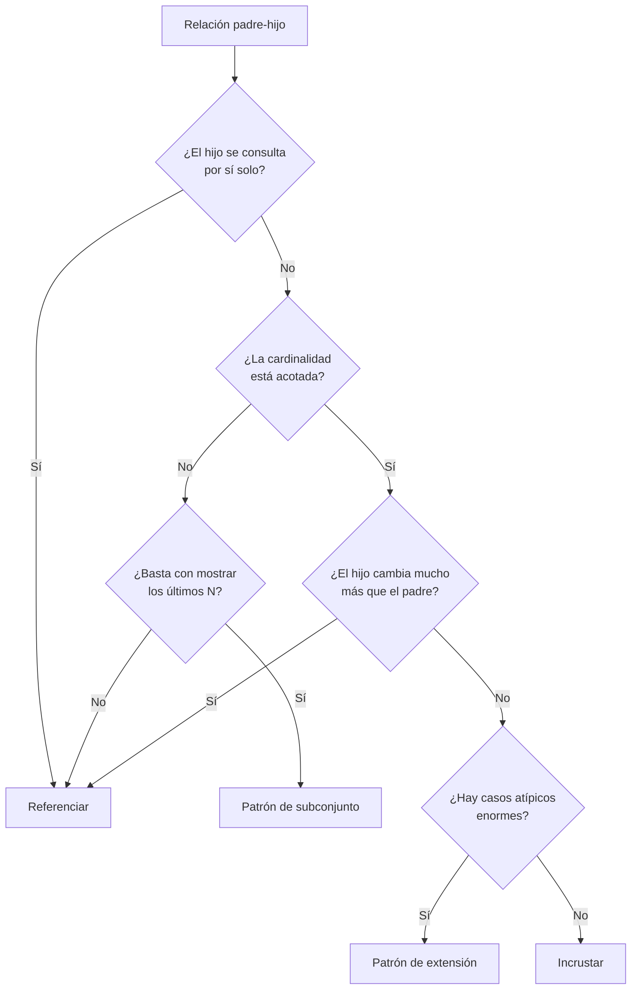

# 025 — Modelado documental: incrustar o referenciar

> [Programa](../../../README.md) · [Parte 05](../README.md) · [← Anterior](../../part-05-documentos-y-clave-valor/024-el-agregado-como-unidad-de-consistencia/README.md) · [Siguiente →](../../part-05-documentos-y-clave-valor/026-consultas-e-indices-sobre-documentos/README.md)

Parte 05 — Documentos y clave-valor · Intermedio ·
4 horas estimadas · motores `mongodb` · laboratorio
[`labs/05-nosql-workloads`](../../../labs/05-nosql-workloads/README.md) · 3 fuentes.

**Conceptos centrales:** `incrustación` · `referencia` · `crecimiento no acotado` · `patrón de extensión`

---

## Propósito

Tomar la decisión central del modelado documental —incrustar o referenciar— con criterios medibles, y conocer los patrones que resuelven los casos donde ninguna de las dos basta.

## Resultados de aprendizaje

Al terminar podrás:

1. Aplicar los cuatro criterios de decisión de la documentación de MongoDB.
2. Reconocer y aplicar los patrones de extensión, de subconjunto y de atributo.
3. Detectar el crecimiento no acotado antes de que llegue al límite de tamaño.
4. Modelar relaciones N:M en documentos sin duplicación descontrolada.
5. Justificar cuándo un modelo documental es peor que uno relacional.

## Fundamentos

### Los cuatro criterios

| Criterio | Favorece incrustar | Favorece referenciar |
|---|---|---|
| **Cómo se lee** | Siempre junto al padre | A veces solo, o desde otros padres |
| **Cardinalidad** | Pocos y acotados | Muchos o sin cota |
| **Frecuencia de cambio** | Cambian con el padre | El hijo cambia mucho más |
| **Duplicación** | El hijo pertenece a un solo padre | El hijo es compartido |

Regla resumida de la documentación oficial: *«los datos a los que se accede juntos deben almacenarse juntos»*. El matiz que se olvida: **junto ≠ siempre dentro**. Si se leen juntos pero uno se escribe cien veces más, incrustar obliga a reescribir el padre entero en cada cambio.

### El límite duro

MongoDB limita cada documento a **16 MB**. Con subdocumentos de ~200 bytes, eso son unos 80 000 elementos. Pero el problema práctico llega mucho antes:

- Un arreglo de 5 000 elementos hace que cada lectura del padre transfiera 1 MB aunque se quiera un solo campo.
- Cada actualización de un elemento reescribe el documento; si crece más allá del espacio reservado, se reubica.
- Los índices multiclave generan **una entrada por elemento del arreglo**: un arreglo de 5 000 elementos en 10 000 documentos produce 50 millones de entradas de índice.

Criterio operativo del repositorio: **si el arreglo puede superar unos cientos de elementos, no se incrusta**.

### Los tres patrones que resuelven el 80 % de los casos

**Patrón de extensión (*outlier*)** — la mayoría de los casos son pequeños y unos pocos son enormes:

```json
{"_id": "curso-bd", "inscritos": [ ...40 elementos... ], "tiene_extension": false}
{"_id": "curso-intro", "inscritos": [ ...primeros 100... ], "tiene_extension": true}
```

Los casos normales se resuelven con una lectura; los excepcionales llevan una marca y sus datos adicionales viven en otra colección. Se optimiza el caso común sin romperse en el raro.

**Patrón de subconjunto** — incrustar solo lo que se muestra:

```json
{"_id": "curso-bd", "nombre": "Bases de datos",
 "ultimas_inscripciones": [ {"student_id": 11, "nombre": "Ana"}, ... 5 elementos ... ],
 "total_inscritos": 3812}
```

La portada se sirve con una lectura; el detalle completo consulta la colección de inscripciones. Es la respuesta correcta cuando la interfaz muestra «los últimos N».

**Patrón de atributo** — muchos campos opcionales sobre los que se filtra:

```json
{"_id": "curso-bd",
 "atributos": [{"k": "sala", "v": "B-201"}, {"k": "modalidad", "v": "presencial"}]}
```

Con un único índice sobre `atributos.k` y `atributos.v` se filtra por cualquier atributo. Sin este patrón haría falta un índice por campo posible.



## Ejemplo trabajado

Dominio: cursos, estudiantes e inscripciones, en MongoDB.

**Modelo 1 — todo incrustado en el curso.** Ya analizado en la clase 024: correcto para cursos pequeños, insostenible para uno con 20 000 inscritos.

**Modelo 2 — copiar el relacional.** Tres colecciones y `$lookup` para reunir. Funciona, pero el motor documental no está optimizado para reuniones: no hay optimizador de orden de reunión ni índices de hash de reunión. Si el modelo necesita `$lookup` en todas las consultas, la pregunta correcta es por qué no se usa un motor relacional.

**Modelo 3 — dirigido por las consultas reales.** Enumeramos primero qué se pregunta:

| Consulta | Frecuencia diaria |
|---|---:|
| Portada del curso: nombre, cupo, total inscritos, últimos 5 | 200 000 |
| Ficha del estudiante: sus cursos con nota | 40 000 |
| Listado completo de inscritos de un curso (paginado) | 3 000 |
| Inscribir | 400 |

Diseño resultante:

```json
// courses
{"_id": "curso-2026-1-bd", "nombre": "Bases de datos", "periodo": "2026-1", "cupo": 40,
 "total_inscritos": 38,
 "ultimas_inscripciones": [{"student_id": 11, "nombre": "Ana Pérez",
                            "en": "2026-03-11T12:00:00Z"}]}

// enrollments
{"_id": {"s": 11, "c": "curso-2026-1-bd"},
 "student_id": 11, "student_nombre": "Ana Pérez",
 "course_id": "curso-2026-1-bd", "course_nombre": "Bases de datos",
 "nota": 6.0, "estado": "activa", "registrada_en": "2026-03-11T12:00:00Z"}
```

Justificación de cada decisión:

- **`_id` compuesto en `enrollments`**: la clave natural garantiza que no haya inscripciones duplicadas. Es la misma clave natural compuesta de la clase 007, aquí como identificador del documento.
- **`student_nombre` y `course_nombre` duplicados**: evitan `$lookup` en la ficha del estudiante y en el listado. Son datos que cambian rarísimamente.
- **`ultimas_inscripciones` acotado a 5**: patrón de subconjunto, mantenido con `$push` + `$slice: -5`.
- **`total_inscritos`**: contador declarado, con su invariante (clase 024).

**El costo de duplicar el nombre.** Si una estudiante cambia de nombre, hay que actualizar sus N inscripciones:

```javascript
db.enrollments.updateMany({student_id: 11}, {$set: {student_nombre: "Ana Rojas"}})
```

Con 8 inscripciones de media, son 8 escrituras por cambio de nombre. Si los cambios de nombre son ~5 al mes y las lecturas que se ahorran el `$lookup` son 40 000 diarias, la aritmética es clara: **40 escrituras mensuales frente a 1,2 millones de reuniones evitadas**. Esa comparación —y no una preferencia estética— es lo que justifica la duplicación.

La misma aritmética con datos que cambian a diario daría el resultado opuesto.

**Índices necesarios:**

```javascript
db.enrollments.createIndex({student_id: 1, registrada_en: -1})
db.enrollments.createIndex({course_id: 1, estado: 1})
db.courses.createIndex({periodo: 1})
```

## Comparación

| Modelo | Lecturas de portada | Reuniones | Riesgo de divergencia | Escala en escritura |
|---|---|---|---|---|
| Todo incrustado | 1 | 0 | Ninguno | Mala |
| Copia del relacional | 1 + `$lookup` | Muchas | Ninguno | Buena |
| Dirigido por consultas | 1 | 0 | Real, acotado y medido | Buena |
| Relacional | 1 con reunión | Optimizadas por el motor | Ninguno | Buena hasta un nodo |

## Errores frecuentes

1. **Incrustar arreglos sin cota.** Se descubre al llegar a 16 MB, con datos ya en producción.
2. **Duplicar datos que cambian a menudo.** La aritmética se invierte y cada cambio propaga N escrituras.
3. **`$lookup` en el camino crítico.** Si es imprescindible, el motor relacional lo hace mejor.
4. **Un índice por campo posible.** Usa el patrón de atributo.
5. **Modelar antes de enumerar las consultas.** En documental, las consultas *son* el modelo.
6. **Olvidar el índice multiclave.** Un arreglo indexado multiplica las entradas por su longitud.

## De la clase a la operación

Cambiar la forma de los documentos con datos en producción exige una migración con lectura tolerante a las dos formas: los documentos antiguos y los nuevos conviven durante semanas. Diseñar previendo esa convivencia —con un campo de versión de esquema— es lo que evita una parada.

## Reto de transferencia

1. Enumera las cinco consultas más frecuentes de tu dominio con su frecuencia real.
2. Diseña el modelo documental que las sirve con una lectura cada una.
3. Calcula la aritmética de duplicación: escrituras añadidas frente a reuniones evitadas.
4. Identifica el arreglo con mayor riesgo de crecimiento y aplícale el patrón que corresponda.

## Preguntas de evaluación

1. ¿Por qué «se leen juntos» no implica «se guardan dentro»?
2. Calcula el punto de equilibrio de duplicar un campo en tu dominio, con cifras reales.
3. Explica el efecto de un arreglo de 5 000 elementos sobre un índice multiclave.
4. Da un caso de tu dominio donde el modelo documental sea peor que el relacional, y justifícalo.

---

## Laboratorio

```bash
python scripts/validate_repository.py
python labs/05-nosql-workloads/run_nosql_lab.py
```

Guarda como evidencia la salida completa, la versión del motor y la semilla o
los parámetros usados. Una captura sin comando no es evidencia: no se puede
repetir.

## Evaluación

| Criterio | Peso | Qué se comprueba |
|---|---:|---|
| Comprensión conceptual | 25 % | Explica el mecanismo, no solo el resultado |
| Ejecución reproducible | 25 % | Otra persona obtiene lo mismo con las instrucciones dadas |
| Interpretación basada en evidencia | 25 % | Cada conclusión se apoya en una salida o una medición |
| Límites y riesgos declarados | 25 % | Dice qué no demuestra el ejercicio y qué faltaría en producción |

La clase se da por superada cuando la respuesta explica el mecanismo, muestra
la salida que la respalda y declara al menos un límite del ejercicio.

## Fuentes de esta clase

Todo lo afirmado arriba procede de estas obras. Los identificadores viven en
[`catalog/sources.json`](../../../catalog/sources.json) y el estado de los
enlaces se comprueba con `python scripts/check_external_links.py`.

- **MongoDB, Inc.** (2026). [MongoDB: Data Modeling](https://www.mongodb.com/docs/manual/data-modeling/).  
  Criterio para incrustar o referenciar según patrones de acceso.
- **Shannon Bradshaw, Eoin Brazil, Kristina Chodorow** (2019). [MongoDB: The Definitive Guide](https://www.oreilly.com/library/view/mongodb-the-definitive/9781491954454/). 3.a ed. O'Reilly. ISBN 978-1-4919-5446-1.  
  Modelado documental, índices y canalización de agregación.
- **Pramod J. Sadalage, Martin Fowler** (2012). [NoSQL Distilled: A Brief Guide to the Emerging World of Polyglot Persistence](https://martinfowler.com/books/nosql.html). Addison-Wesley. ISBN 978-0-321-82662-6.  
  Origen del término agregado y de la persistencia políglota que estructura este programa.

---

> [Programa](../../../README.md) · [Parte 05](../README.md) · [← Anterior](../../part-05-documentos-y-clave-valor/024-el-agregado-como-unidad-de-consistencia/README.md) · [Siguiente →](../../part-05-documentos-y-clave-valor/026-consultas-e-indices-sobre-documentos/README.md)
