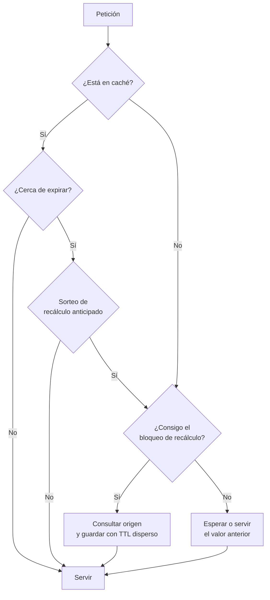

## Propósito

Usar un almacén clave-valor sabiendo exactamente qué se pierde y cuándo. Una caché mal diseñada no solo no acelera: sirve datos incorrectos y derriba el origen cuando expira.

## Resultados de aprendizaje

Al terminar podrás:

1. Elegir la estructura de datos de Redis adecuada al problema.
2. Explicar qué se pierde exactamente con RDB, con AOF y con cada valor de `appendfsync`.
3. Aplicar las tres estrategias de invalidación y sus consecuencias.
4. Prevenir la estampida de caché con tres mecanismos distintos.
5. Decidir cuándo un almacén clave-valor es la base de datos y cuándo solo es caché.

## Fundamentos

### No es solo una tabla hash

Redis ofrece estructuras con operaciones atómicas propias, y elegir bien evita lógica en la aplicación:

| Estructura | Operaciones | Caso de uso |
|---|---|---|
| String | `GET`, `SET`, `INCR` | Caché, contadores |
| Hash | `HGET`, `HSET`, `HINCRBY` | Objeto con campos actualizables por separado |
| List | `LPUSH`, `BRPOP` | Cola simple |
| Set | `SADD`, `SINTER` | Pertenencia, intersecciones |
| Sorted set | `ZADD`, `ZRANGEBYSCORE` | Ranking, colas por prioridad, ventanas temporales |
| Stream | `XADD`, `XREADGROUP` | Registro de eventos con grupos de consumidores |
| HyperLogLog | `PFADD`, `PFCOUNT` | Conteo aproximado de distintos con ~12 KB fijos |

`INCR` es atómico: no hay lectura-modificación-escritura y por tanto no hay actualización perdida (clase 001). Esa atomicidad por operación es la principal razón para usar Redis en vez de una tabla hash en memoria del proceso.

### Qué se pierde exactamente

La pregunta que hay que responder antes de guardar algo importante:

| Configuración | Qué se pierde ante caída del proceso | Ante caída de la máquina |
|---|---|---|
| Sin persistencia | Todo | Todo |
| RDB cada 5 min | Hasta 5 min | Hasta 5 min |
| AOF `appendfsync everysec` | Nada | **Hasta 1 segundo** |
| AOF `appendfsync always` | Nada | Nada (con un costo alto por escritura) |
| RDB + AOF | Lo que indique el AOF | Ídem |

`everysec` es el valor por defecto y el que casi todos usan. Es una elección correcta para una caché y una elección **que hay que declarar** si se guardan datos que no están en ningún otro sitio.

Advertencia adicional: con replicación asíncrona, un `SET` confirmado al cliente puede perderse si el primario cae antes de replicar. Redis no ofrece durabilidad sincrónica por omisión.

### Invalidación

| Estrategia | Cómo funciona | Riesgo |
|---|---|---|
| **TTL** | El dato expira solo | Ventana de datos obsoletos igual al TTL |
| **Escritura y borrado** (*write-through invalidate*) | Al escribir en el origen, se borra la clave | Carrera entre el borrado y una lectura concurrente |
| **Escritura directa** (*write-through*) | Se escribe en ambos | Doble escritura, posible divergencia si una falla |

La carrera de la segunda estrategia es real y merece detalle:

```text
t0  Lector    : falla la caché, lee del origen -> valor V1
t1  Escritor  : actualiza el origen            -> valor V2
t2  Escritor  : borra la clave de la caché
t3  Lector    : escribe en la caché lo que leyó en t0 -> V1  (obsoleto, ¡y sin TTL, para siempre!)
```

Defensas: poner **siempre** un TTL aunque se invalide explícitamente (acota el daño), o usar `SET ... XX` con comprobación de versión.

### Estampida

Cuando una clave muy solicitada expira, todas las peticiones concurrentes fallan a la vez y golpean el origen simultáneamente. Con 5 000 peticiones por segundo y una consulta de 200 ms, la expiración de una sola clave lanza ~1 000 consultas idénticas contra la base de datos.

Tres defensas:

1. **Bloqueo de recálculo:** solo una petición recalcula; las demás esperan o sirven el valor antiguo.

   ```text
   SET recalculo:clave 1 NX EX 30     -- solo uno lo consigue
   ```

2. **TTL con dispersión aleatoria:** `TTL = base + aleatorio(0, base·0,1)`. Evita que miles de claves creadas a la vez expiren a la vez.
3. **Recálculo anticipado probabilístico:** cada lectura recalcula con probabilidad creciente conforme se acerca la expiración, de modo que la clave se renueva antes de caducar.



## Ejemplo trabajado

Caché del panel del curso, que en la clase 009 costaba una agregación sobre millones de filas.

```python
import json, random, time

TTL_BASE = 300  # 5 minutos

def panel_curso(redis, db, course_id):
    clave = f"curso:{course_id}:panel"
    dato = redis.get(clave)
    if dato is not None:
        return json.loads(dato)

    # Solo un proceso recalcula; el resto espera brevemente y reintenta.
    if redis.set(f"lock:{clave}", "1", nx=True, ex=30):
        try:
            panel = consultar_panel(db, course_id)          # la agregación cara
            ttl = TTL_BASE + random.randint(0, TTL_BASE // 10)
            redis.set(clave, json.dumps(panel), ex=ttl)
            return panel
        finally:
            redis.delete(f"lock:{clave}")

    time.sleep(0.05)
    dato = redis.get(clave)
    return json.loads(dato) if dato else consultar_panel(db, course_id)
```

**Efecto medido**, con 5 000 peticiones/s a un curso y una agregación de 200 ms:

| Escenario | Consultas al origen por expiración |
|---|---:|
| Sin caché | 5 000/s, continuamente |
| Caché sin bloqueo | ~1 000 de golpe cada 5 min |
| Caché con bloqueo + TTL disperso | 1 cada ~5 min |

**Invalidación al inscribir**, para que el panel no espere 5 minutos:

```python
def inscribir(db, redis, student_id, course_id):
    with db.transaction():                     # el origen es la verdad
        db.execute("INSERT INTO enrollments (student_id, course_id) VALUES (?,?)",
                   (student_id, course_id))
    redis.delete(f"curso:{course_id}:panel")   # fuera de la transacción, a propósito
```

El borrado va **después** del `COMMIT` y fuera de la transacción. Si se hiciera dentro y la transacción se revirtiera, se habría invalidado una caché correcta; peor aún, una lectura concurrente podría repoblarla con el valor no confirmado. El precio de este orden es una ventana de milisegundos con el panel obsoleto, que el TTL acota de todos modos.

**Estructura adecuada.** Si el panel solo necesita el contador:

```text
HINCRBY curso:bd:contadores inscritos 1
```

Una operación atómica de O(1) en vez de invalidar y recalcular. La lección: elegir la estructura correcta a veces elimina el problema de invalidación en lugar de resolverlo.

## Comparación

| Uso | ¿Es aceptable perder los datos? | Configuración |
|---|---|---|
| Caché de consultas | Sí | Sin persistencia, TTL, `maxmemory-policy allkeys-lru` |
| Sesiones de usuario | Molesto, no grave | AOF `everysec`, TTL |
| Cola de trabajos | No | Streams con confirmación, o un motor de colas real |
| Contadores de negocio | No | Origen relacional; Redis solo acelera |
| Límite de tasa | Sí | Sin persistencia, TTL corto |
| Ranking en vivo | Depende | Sorted set + reconstrucción desde el origen |

## Errores frecuentes

1. **Caché sin TTL.** Un fallo de invalidación se vuelve permanente.
2. **Usar Redis como fuente de verdad sin declarar la durabilidad.** `everysec` pierde hasta un segundo.
3. **Invalidar dentro de la transacción.** Repuebla con datos no confirmados.
4. **Todas las claves con el mismo TTL.** Expiran en bloque y provocan estampida.
5. **`KEYS *` en producción.** Bloquea el servidor, que es de un solo hilo para comandos; usar `SCAN`.
6. **Guardar objetos enormes.** Un valor de varios megabytes bloquea el hilo durante su serialización.
7. **Sin `maxmemory-policy`.** Al llenarse, Redis empieza a rechazar escrituras en vez de desalojar.

## De la clase a la operación

La caída más habitual asociada a caché no es la caché: es el origen, cuando la caché se vacía de golpe (reinicio, despliegue, expiración masiva) y recibe de una vez todo el tráfico que llevaba meses sin ver. Probar el arranque en frío bajo carga es parte de la entrega.

## Reto de transferencia

1. Elige una consulta cara real y cachéala con TTL disperso y bloqueo de recálculo.
2. Mide las consultas al origen con y sin bloqueo, provocando la expiración bajo carga.
3. Documenta qué se pierde en tu configuración de persistencia, en unidades de tiempo.
4. Reproduce la carrera de invalidación y demuestra que el TTL acota el daño.

## Preguntas de evaluación

1. ¿Cuántos datos se pierden exactamente con `appendfsync everysec` y una caída de la máquina?
2. Traza la carrera entre un lector y un escritor que deja un valor obsoleto en la caché.
3. Calcula la estampida esperada en tu sistema con sus cifras de tráfico.
4. Da un dato de tu dominio que **no** guardarías en Redis y explica por qué.
