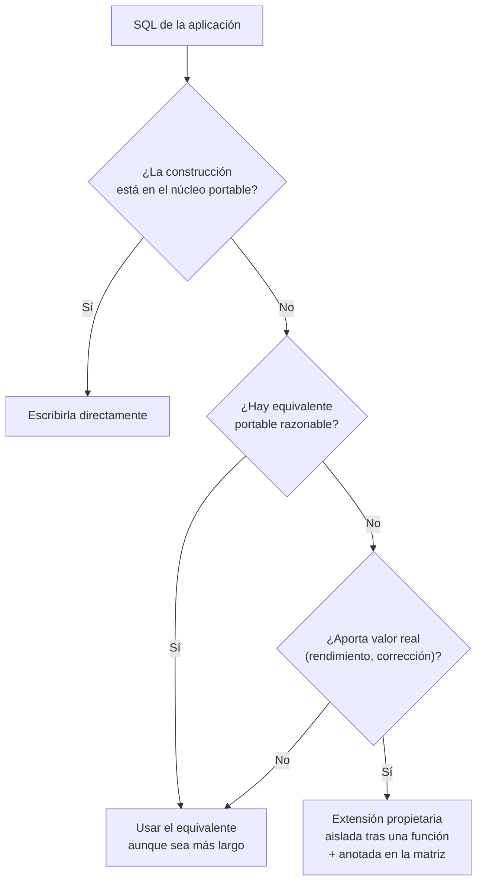

# 030 — Portabilidad: qué exige la norma y qué añade cada motor

> [Programa](../../../README.md) · [Parte 05](../README.md) · [← Anterior](../../part-04-sql-en-profundidad/029-nulos-y-logica-de-tres-valores/README.md) · [Siguiente →](../../part-05-motores-relacionales-y-dialectos/031-postgresql-tipos-extensiones-y-procesos/README.md)

Parte 05 — Motores relacionales y dialectos · Intermedio ·
3 horas estimadas · motores `postgresql`, `mysql`, `sqlite`, `sql-server`, `oracle-database` · laboratorio
[`labs/03-transactions`](../../../labs/03-transactions/README.md) · 4 fuentes.

**Conceptos centrales:** `norma frente a producto` · `matriz de portabilidad` · `extensión propietaria`

**En este caso se comparan 7 motores**: 6 lo resuelven (4 con el resultado comprobado por máquina) y 1 no, con el motivo escrito.

---

## Propósito

Escribir SQL que sobreviva a un cambio de motor, y saber exactamente dónde se paga por no hacerlo. La portabilidad total no existe; la portabilidad *gestionada* sí.

## Resultados de aprendizaje

Al terminar podrás:

1. Explicar por qué ningún motor implementa la norma completa.
2. Construir una matriz de portabilidad para tu propio código.
3. Aislar las divergencias en una capa en vez de esparcirlas.
4. Decidir cuándo usar una extensión propietaria a sabiendas.
5. Distinguir divergencia sintáctica de divergencia semántica, que es mucho peor.

## Fundamentos

### Qué es la norma y qué no

ISO/IEC 9075 define SQL en varias partes y con niveles de conformidad. La realidad es que **ningún producto implementa la norma completa** y todos añaden extensiones. La norma no es un contrato de compatibilidad: es un vocabulario común.

Lo estable en la práctica —el «núcleo portable»— es aproximadamente:

`CREATE TABLE` con tipos básicos · `PRIMARY KEY`, `FOREIGN KEY`, `UNIQUE`, `CHECK`, `NOT NULL` · `SELECT/FROM/WHERE/GROUP BY/HAVING/ORDER BY` · `INNER`, `LEFT`, `RIGHT`, `FULL JOIN` · `UNION`, `INTERSECT`, `EXCEPT` · subconsultas y `EXISTS` · CTE y `WITH RECURSIVE` · funciones de ventana · `INSERT`, `UPDATE`, `DELETE` · `BEGIN`/`COMMIT`/`ROLLBACK`.

Lo que **no** es portable, aunque lo parezca: tipos de fecha y hora, funciones de cadena, autoincremento, `LIMIT`, `UPSERT`, tipos JSON, expresiones regulares, `TOP`/`FETCH`, y —la peor— la colación.

### Sintáctica frente a semántica

Esta distinción es la que decide cuánto duele una migración.

- **Divergencia sintáctica:** el mismo concepto se escribe distinto. Falla al ejecutar, se ve enseguida, se arregla una vez.
- **Divergencia semántica:** la misma sintaxis hace cosas distintas. **No falla**: devuelve otro resultado. Se descubre en un informe, meses después.

| Divergencia | Tipo | Consecuencia |
|---|---|---|
| `LIMIT` frente a `FETCH FIRST` frente a `TOP` | Sintáctica | Error de sintaxis |
| `AUTO_INCREMENT` / `SERIAL` / `IDENTITY` | Sintáctica | Error en DDL |
| Concatenación `\|\|` frente a `CONCAT()` | Sintáctica | Error, salvo en MySQL donde `\|\|` es `OR` |
| Comparación de texto sensible o no a mayúsculas | **Semántica** | Resultados distintos, sin error |
| División entera frente a decimal | **Semántica** | Números distintos |
| Cadena vacía tratada como nulo (Oracle) | **Semántica** | Filas que aparecen o desaparecen |
| Redondeo a la mitad | **Semántica** | Descuadres contables |

El caso de `||` en MySQL merece atención: con el modo `PIPES_AS_CONCAT` desactivado, `'a' || 'b'` se evalúa como `'a' OR 'b'` → `0`. No es un error; es un resultado equivocado.

### Estrategias



La regla operativa: **usar extensiones está permitido; esparcirlas por todo el código, no**. Una extensión aislada en un único punto es una decisión reversible; la misma extensión en 200 consultas es una migración de trimestre.

## Ejemplo trabajado

Consulta «los 10 estudiantes con mejor promedio», en cinco dialectos.

```sql
-- Núcleo portable (norma SQL:2008, soportado hoy por PostgreSQL, SQL Server, Oracle, MariaDB 10.6+)
SELECT s.id, s.nombre, AVG(e.nota) AS promedio
FROM students s JOIN enrollments e ON e.student_id = s.id
GROUP BY s.id, s.nombre
ORDER BY promedio DESC, s.id
FETCH FIRST 10 ROWS ONLY;
```

| Motor | Cláusula de límite | ¿Acepta `FETCH FIRST`? |
|---|---|---|
| PostgreSQL | `LIMIT 10` | Sí |
| MySQL / MariaDB | `LIMIT 10` | Solo MariaDB reciente |
| SQLite | `LIMIT 10` | No |
| SQL Server | `TOP 10` u `OFFSET ... FETCH` | Sí, con `ORDER BY` |
| Oracle | `FETCH FIRST 10 ROWS ONLY` (12c+) | Sí |

Como SQLite y MySQL no aceptan `FETCH FIRST`, el mínimo común denominador real hoy es `LIMIT`, que **no** está en la norma. Conclusión honesta: la portabilidad se negocia contra el conjunto de motores que uno realmente soporta, no contra la norma.

**Ahora la divergencia semántica**, mucho más peligrosa:

```sql
SELECT * FROM students WHERE email = 'ANA@EJEMPLO.CL';
```

| Motor | Colación por defecto | ¿Encuentra `ana@ejemplo.cl`? |
|---|---|---|
| MySQL 8 | `utf8mb4_0900_ai_ci` | **Sí** |
| PostgreSQL | Del sistema, sensible | **No** |
| SQLite | `BINARY` | **No** |
| SQL Server | Suele ser `_CI_AS` | **Sí** |

Una aplicación desarrollada sobre MySQL y desplegada sobre PostgreSQL deja de encontrar usuarios al iniciar sesión, sin ningún error en los registros. La defensa no es configurar la colación: es **normalizar al escribir**.

```sql
CREATE TABLE students (
  id     INTEGER PRIMARY KEY,
  email  TEXT NOT NULL CHECK (email = lower(email)),
  UNIQUE (email)
);
```

El `CHECK` convierte una suposición implícita en una regla comprobada por el motor, en cualquier motor.

**Aritmética:**

```sql
SELECT 7 / 2;
```

| Motor | Resultado |
|---|---|
| PostgreSQL, Oracle, SQL Server | `3` (división entera) |
| MySQL | `3.5` |
| SQLite | `3` |

Escribir `7.0 / 2` o `CAST(7 AS NUMERIC) / 2` elimina la ambigüedad en todos.

**Inserción idempotente (`UPSERT`)**, ninguna forma es portable:

```sql
-- PostgreSQL, SQLite
INSERT INTO t (id, v) VALUES (1,'x') ON CONFLICT (id) DO UPDATE SET v = excluded.v;
-- MySQL
INSERT INTO t (id, v) VALUES (1,'x') ON DUPLICATE KEY UPDATE v = VALUES(v);
-- Norma (SQL Server, Oracle): MERGE
```

Esta es la construcción que más justifica una capa de aislamiento: se usa constantemente y se escribe distinto en todos.

## Comparación

| Aspecto | Escribir portable | Usar extensiones libremente |
|---|---|---|
| Velocidad de desarrollo | Menor | Mayor |
| Costo de migrar | Bajo | Alto o prohibitivo |
| Rendimiento | A veces peor | Mejor si la extensión existe por algo |
| Riesgo semántico | Bajo si se normaliza | Alto |
| Recomendación | Núcleo portable por defecto | Extensiones aisladas y documentadas |

## Errores frecuentes

1. **Suponer que «SQL es SQL».** El núcleo común es más pequeño de lo que parece.
2. **Confiar en la colación por defecto.** Es la divergencia semántica más frecuente y la más silenciosa.
3. **Depender de la división entera o del redondeo.** Cambia entre motores.
4. **Usar `||` en MySQL sin activar `PIPES_AS_CONCAT`.** Devuelve `0`.
5. **Probar solo en el motor de desarrollo.** Si producción usa otro, la matriz no se ha comprobado, se ha imaginado.
6. **Portabilidad como dogma.** Renunciar a `jsonb` o a índices parciales «por si acaso» cuesta más de lo que ahorra.

## De la clase a la operación

La migración de motor rara vez se decide por gusto: llega por licencias, por costo de nube o por una adquisición. El código que la sobrevive es el que aisló las diferencias cuando no había ninguna urgencia.

## Reto de transferencia

1. Toma 10 consultas reales de tu proyecto y clasifícalas: núcleo portable, divergencia sintáctica o semántica.
2. Ejecuta las 10 en dos motores del `docker-compose` y captura las diferencias.
3. Escribe la matriz de portabilidad resultante, con la construcción y su equivalente en cada motor.
4. Aísla la construcción menos portable tras una única función y demuestra que el resto del código no cambia.

## Preguntas de evaluación

1. Da un ejemplo propio de divergencia semántica y explica por qué es peor que una sintáctica.
2. ¿Por qué `LIMIT` es más portable en la práctica que `FETCH FIRST`, pese a no estar en la norma?
3. Escribe el `UPSERT` de tu dominio en tres dialectos.
4. Justifica un caso donde usarías una extensión propietaria a sabiendas, y cómo la documentarías.

---

## 🌐 El mismo problema en cada motor

**Caso:** Una etiqueta concatenada y las dos primeras filas, escrito de forma portable

Pedir «los dos mejores de DB-101 con su nombre y su curso en una sola
cadena» parece trivial hasta que hay que ejecutarlo en cinco motores. Dos
detalles minúsculos rompen el código al migrar: **cómo se concatenan dos
cadenas** y **cómo se limita el número de filas**.

La norma ISO/IEC 9075 define `||` para lo primero y `FETCH FIRST n ROWS
ONLY` para lo segundo. Casi ningún motor implementa exactamente eso: MySQL
interpreta `||` como el `OR` lógico salvo que se cambie el modo, SQL Server
concatena con `+` y limita con `TOP`, y SQLite y PostgreSQL usan `LIMIT`,
que no está en la norma pero es el estándar de facto.

La salida es la misma en todos. Lo que cambia —y esta clase obliga a
escribir— es cuánto hay que tocar para conseguirla.

Salida esperada, idéntica en todos los motores que lo resuelven:

| etiqueta |
|---|
| `Ada - DB-101` |
| `Grace - DB-101` |

El contrato vive en [`motores.yaml`](motores.yaml) y lo comprueba
`python scripts/verificar_equivalencia.py --clase 030`: 4 de
las 6 implementaciones se ejecutan de verdad y su
resultado se compara con esa tabla; el resto se declara como material revisado,
no ejecutado.

| Motor | ¿Resuelve el caso? | Nivel de prueba | Código | Fuente |
|---|---|---|---|---|
| SQLite | sí | núcleo | [código](implementaciones/sqlite/consulta.sql) | [doc oficial](https://sqlite.org/lang_expr.html) |
| DuckDB | sí | núcleo | [código](implementaciones/duckdb/consulta.sql) | [doc oficial](https://duckdb.org/docs/stable/sql/dialect/postgresql_compatibility.html) |
| PostgreSQL | sí | servicio | [código](implementaciones/postgresql/consulta.sql) | [doc oficial](https://www.postgresql.org/docs/current/functions-string.html) |
| MySQL | sí | servicio | [código](implementaciones/mysql/consulta.sql) | [doc oficial](https://dev.mysql.com/doc/refman/8.4/en/sql-mode.html) |
| Microsoft SQL Server | sí | declarado | [código](implementaciones/sql-server/consulta.sql) | [doc oficial](https://learn.microsoft.com/sql/t-sql/functions/concat-transact-sql) |
| Oracle Database | sí | declarado | [código](implementaciones/oracle-database/consulta.sql) | [doc oficial](https://docs.oracle.com/en/database/oracle/oracle-database/23/sqlrf/Data-Types.html) |
| MariaDB | **no** | — | — | [doc oficial](https://mariadb.com/docs/server/reference/sql-functions/string-functions/concat) |

### Los que resuelven el caso

#### SQLite · [`implementaciones/sqlite/consulta.sql`](implementaciones/sqlite/consulta.sql)

✅ **verificado** — se ejecuta en CI sin servicios

```sql
-- motor: sqlite
-- doc: https://sqlite.org/lang_expr.html
-- nota: || es el operador de la norma. LIMIT no lo es, pero lo entienden
--       SQLite, PostgreSQL, MySQL, MariaDB y DuckDB: es el estandar de facto.

-- === preparacion ===
CREATE TABLE notas (
    estudiante TEXT NOT NULL,
    curso      TEXT NOT NULL,
    nota       INTEGER NOT NULL,
    PRIMARY KEY (estudiante, curso)
);
INSERT INTO notas (estudiante, curso, nota) VALUES
    ('Ada',   'DB-101', 90),
    ('Grace', 'DB-101', 72),
    ('Linus', 'DB-101', 58),
    ('Ada',   'SE-201', 66);

-- === consulta ===
SELECT estudiante || ' - ' || curso AS etiqueta
FROM notas
WHERE curso = 'DB-101'
ORDER BY nota DESC
LIMIT 2;
```

- **Por qué sí:** Implementa `||` como manda la norma y `LIMIT` como el estándar de facto: es el subconjunto que más motores entienden sin cambios.
- **Por qué no:** Su tolerancia con los tipos hace que expresiones que en otro motor darían error aquí devuelvan algo: el código «funciona» en SQLite y revienta al llegar a PostgreSQL.
- 📄 Documentación oficial: <https://sqlite.org/lang_expr.html>

#### DuckDB · [`implementaciones/duckdb/consulta.sql`](implementaciones/duckdb/consulta.sql)

✅ **verificado** — se ejecuta en CI sin servicios

```sql
-- motor: duckdb
-- doc: https://duckdb.org/docs/stable/sql/dialect/postgresql_compatibility.html

-- === preparacion ===
CREATE TABLE notas (
    estudiante VARCHAR NOT NULL,
    curso      VARCHAR NOT NULL,
    nota       INTEGER NOT NULL,
    PRIMARY KEY (estudiante, curso)
);
INSERT INTO notas (estudiante, curso, nota) VALUES
    ('Ada',   'DB-101', 90),
    ('Grace', 'DB-101', 72),
    ('Linus', 'DB-101', 58),
    ('Ada',   'SE-201', 66);

-- === consulta ===
SELECT estudiante || ' - ' || curso AS etiqueta
FROM notas
WHERE curso = 'DB-101'
ORDER BY nota DESC
LIMIT 2;
```

- **Por qué sí:** Acepta el dialecto de PostgreSQL casi por completo, así que sirve de banco de pruebas de portabilidad sin levantar un servidor.
- **Por qué no:** Añade extensiones cómodas que no existen en ningún otro sitio (`SELECT * EXCLUDE`, `GROUP BY ALL`, `QUALIFY`): probar aquí no garantiza que la consulta sea portable, solo que es válida aquí.
- 📄 Documentación oficial: <https://duckdb.org/docs/stable/sql/dialect/postgresql_compatibility.html>

#### PostgreSQL · [`implementaciones/postgresql/consulta.sql`](implementaciones/postgresql/consulta.sql)

✅ **verificado** — se ejecuta contra el motor real levantado con `docker compose`

```sql
-- motor: postgresql
-- doc: https://www.postgresql.org/docs/current/functions-string.html
-- nota: PostgreSQL tambien acepta la forma de la norma,
--         FETCH FIRST 2 ROWS ONLY
--       que es la que hay que usar si el destino puede ser Oracle o SQL Server.

-- === preparacion ===
DROP TABLE IF EXISTS notas;

CREATE TABLE notas (
    estudiante text NOT NULL,
    curso      text NOT NULL,
    nota       integer NOT NULL,
    PRIMARY KEY (estudiante, curso)
);
INSERT INTO notas (estudiante, curso, nota) VALUES
    ('Ada',   'DB-101', 90),
    ('Grace', 'DB-101', 72),
    ('Linus', 'DB-101', 58),
    ('Ada',   'SE-201', 66);

-- === consulta ===
SELECT estudiante || ' - ' || curso AS etiqueta
FROM notas
WHERE curso = 'DB-101'
ORDER BY nota DESC
LIMIT 2;
```

- **Por qué sí:** Es el motor generalista más cercano a la norma y el que más avisa cuando algo no lo es: rechaza conversiones implícitas que otros aceptan en silencio, de modo que el código que pasa aquí suele pasar en el resto.
- **Por qué no:** Su catálogo de extensiones propias —tipos de rango, `LATERAL`, `DISTINCT ON`, arreglos— es tan cómodo que la portabilidad se pierde sin darse cuenta. La única defensa es decidir de antemano si se quiere y probarlo.
- 📄 Documentación oficial: <https://www.postgresql.org/docs/current/functions-string.html>

#### MySQL · [`implementaciones/mysql/consulta.sql`](implementaciones/mysql/consulta.sql)

✅ **verificado** — se ejecuta contra el motor real levantado con `docker compose`

```sql
-- motor: mysql
-- doc: https://dev.mysql.com/doc/refman/8.4/en/sql-mode.html
-- nota: aqui esta la trampa de la clase. Por omision,
--         SELECT estudiante || ' - ' || curso
--       NO concatena: || es el OR logico y la consulta devuelve 0 en cada fila,
--       sin error. Con SET sql_mode = 'PIPES_AS_CONCAT' pasaria a concatenar.
--       CONCAT() evita la ambiguedad y ademas es portable a SQL Server y Oracle.

-- === preparacion ===
DROP TABLE IF EXISTS notas;

CREATE TABLE notas (
    estudiante VARCHAR(50) NOT NULL,
    curso      VARCHAR(50) NOT NULL,
    nota       INT NOT NULL,
    PRIMARY KEY (estudiante, curso)
);
INSERT INTO notas (estudiante, curso, nota) VALUES
    ('Ada',   'DB-101', 90),
    ('Grace', 'DB-101', 72),
    ('Linus', 'DB-101', 58),
    ('Ada',   'SE-201', 66);

-- === consulta ===
SELECT CONCAT(estudiante, ' - ', curso) AS etiqueta
FROM notas
WHERE curso = 'DB-101'
ORDER BY nota DESC
LIMIT 2;
```

- **Por qué sí:** Con `CONCAT()` y `LIMIT` resuelve el caso, y `CONCAT` sí es portable a SQL Server (2012+) y a Oracle.
- **Por qué no:** Por omisión, `'a' || 'b'` no concatena: devuelve `0`, porque `||` es el `OR` lógico salvo que se active `PIPES_AS_CONCAT`. Es el error de migración más silencioso de todos, porque no falla: devuelve un número.
- 📄 Documentación oficial: <https://dev.mysql.com/doc/refman/8.4/en/sql-mode.html>

#### Microsoft SQL Server · [`implementaciones/sql-server/consulta.sql`](implementaciones/sql-server/consulta.sql)

⚪ **declarado** — se revisa a mano contra la documentación citada; la máquina no lo ejecuta

```sql
-- motor: sql-server
-- doc: https://learn.microsoft.com/sql/t-sql/functions/concat-transact-sql
-- nota: implementacion declarada. Se escribe con CONCAT y con OFFSET/FETCH
--       —las formas de la norma— en vez de con + y TOP, que es lo que aparece
--       en el codigo heredado. La diferencia importa: `'Ada' + 5` intenta
--       convertir la cadena a numero y falla; CONCAT convierte a texto.

-- === preparacion ===
DROP TABLE IF EXISTS dbo.notas;

CREATE TABLE dbo.notas (
    estudiante NVARCHAR(50) NOT NULL,
    curso      NVARCHAR(20) NOT NULL,
    nota       INT NOT NULL,
    CONSTRAINT pk_notas PRIMARY KEY (estudiante, curso)
);
INSERT INTO dbo.notas (estudiante, curso, nota) VALUES
    (N'Ada', N'DB-101', 90), (N'Grace', N'DB-101', 72),
    (N'Linus', N'DB-101', 58), (N'Ada', N'SE-201', 66);

-- === consulta ===
SELECT CONCAT(estudiante, N' - ', curso) AS etiqueta
FROM dbo.notas
WHERE curso = N'DB-101'
ORDER BY nota DESC
OFFSET 0 ROWS FETCH NEXT 2 ROWS ONLY;
```

- **Por qué sí:** Desde SQL Server 2012 admite `CONCAT()` y `OFFSET ... FETCH NEXT`, que es la forma de la norma: escrito así, el mismo código vale para Oracle.
- **Por qué no:** El `TOP n` heredado sigue siendo lo que aparece en todo el código existente, y `+` sobre una cadena y un número intenta convertir el texto a número y falla, en vez de concatenar.
- 📄 Documentación oficial: <https://learn.microsoft.com/sql/t-sql/functions/concat-transact-sql>

#### Oracle Database · [`implementaciones/oracle-database/consulta.sql`](implementaciones/oracle-database/consulta.sql)

⚪ **declarado** — se revisa a mano contra la documentación citada; la máquina no lo ejecuta

```sql
-- motor: oracle-database
-- doc: https://docs.oracle.com/en/database/oracle/oracle-database/23/sqlrf/Data-Types.html
-- nota: implementacion declarada. Oracle si implementa || de la norma, y desde
--       12c admite FETCH FIRST. Antes habia que envolver la consulta:
--         SELECT * FROM (SELECT ... ORDER BY nota DESC) WHERE ROWNUM <= 2;
--       Y ojo con la cadena vacia: en Oracle '' ES NULL, asi que concatenar con
--       una columna vacia no da lo mismo que en el resto de motores.

-- === preparacion ===
CREATE TABLE notas (
    estudiante VARCHAR2(50) NOT NULL,
    curso      VARCHAR2(20) NOT NULL,
    nota       NUMBER NOT NULL,
    CONSTRAINT pk_notas PRIMARY KEY (estudiante, curso)
);
INSERT INTO notas (estudiante, curso, nota) VALUES ('Ada', 'DB-101', 90);
INSERT INTO notas (estudiante, curso, nota) VALUES ('Grace', 'DB-101', 72);
INSERT INTO notas (estudiante, curso, nota) VALUES ('Linus', 'DB-101', 58);
INSERT INTO notas (estudiante, curso, nota) VALUES ('Ada', 'SE-201', 66);
COMMIT;

-- === consulta ===
SELECT estudiante || ' - ' || curso AS etiqueta
FROM notas
WHERE curso = 'DB-101'
ORDER BY nota DESC
FETCH FIRST 2 ROWS ONLY;
```

- **Por qué sí:** Implementa `||` de la norma, y desde la versión 12c admite `FETCH FIRST n ROWS ONLY`, que sustituye al viejo rodeo con `ROWNUM` en una subconsulta.
- **Por qué no:** Trata la cadena vacía como `NULL`, así que concatenar con una cadena vacía no siempre hace lo que se espera; y en versiones anteriores a 12c hay que envolver la consulta para poder limitar.
- 📄 Documentación oficial: <https://docs.oracle.com/en/database/oracle/oracle-database/23/sqlrf/Data-Types.html>

### Los que no resuelven este caso — y qué se hace en su lugar

Descartar un motor con un argumento es tan formativo como usarlo. Ninguna de estas filas dice que el motor sea peor: dice que este problema no es el suyo.

| Motor | Por qué no | Qué se hace en su lugar | Fuente |
|---|---|---|---|
| MariaDB | Aquí no aporta una fila distinta: comparte el dialecto de MySQL en todo lo que este caso toca, incluida la interpretación de `\|\|`. Repetirlo sería inflar la matriz sin enseñar nada. | Se trata donde sí diverge —secuencias, `RETURNING`, motores de almacenamiento y el catálogo de funciones JSON— en la clase de divergencias entre dialectos. | [doc](https://mariadb.com/docs/server/reference/sql-functions/string-functions/concat) |

---

## Laboratorio

```bash
python scripts/validate_repository.py
python labs/03-transactions/run_transactions_lab.py
```

Guarda como evidencia la salida completa, la versión del motor y la semilla o
los parámetros usados. Una captura sin comando no es evidencia: no se puede
repetir.

## Evaluación

| Criterio | Peso | Qué se comprueba |
|---|---:|---|
| Comprensión conceptual | 25 % | Explica el mecanismo, no solo el resultado |
| Ejecución reproducible | 25 % | Otra persona obtiene lo mismo con las instrucciones dadas |
| Interpretación basada en evidencia | 25 % | Cada conclusión se apoya en una salida o una medición |
| Límites y riesgos declarados | 25 % | Dice qué no demuestra el ejercicio y qué faltaría en producción |

La clase se da por superada cuando la respuesta explica el mecanismo, muestra
la salida que la respalda y declara al menos un límite del ejercicio.

## Fuentes de esta clase

Todo lo afirmado arriba procede de estas obras. Los identificadores viven en
[`catalog/sources.json`](../../../catalog/sources.json) y el estado de los
enlaces se comprueba con `python scripts/check_external_links.py`.

- **ISO/IEC JTC 1/SC 32** (2023). [ISO/IEC 9075: Information technology - Database languages - SQL](https://www.iso.org/standard/76583.html).  
  Norma del lenguaje SQL. Ningún motor la implementa por completo.
- **Anthony Molinaro, Robert de Graaf** (2020). [SQL Cookbook](https://www.oreilly.com/library/view/sql-cookbook-2nd/9781492077435/). 2.a ed. O'Reilly. ISBN 978-1-4920-7744-2.  
  Recetas comparadas entre dialectos, útil para la matriz de portabilidad.
- **Oracle** (2026). [MySQL Reference Manual](https://dev.mysql.com/doc/).  
  Dialecto y comportamiento del motor InnoDB.
- **PostgreSQL Global Development Group** (2026). [PostgreSQL Documentation](https://www.postgresql.org/docs/current/).  
  Documentación de referencia del motor relacional principal del programa.

---

> [Programa](../../../README.md) · [Parte 05](../README.md) · [← Anterior](../../part-04-sql-en-profundidad/029-nulos-y-logica-de-tres-valores/README.md) · [Siguiente →](../../part-05-motores-relacionales-y-dialectos/031-postgresql-tipos-extensiones-y-procesos/README.md)
