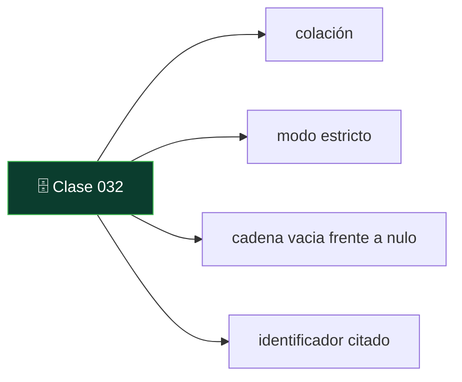
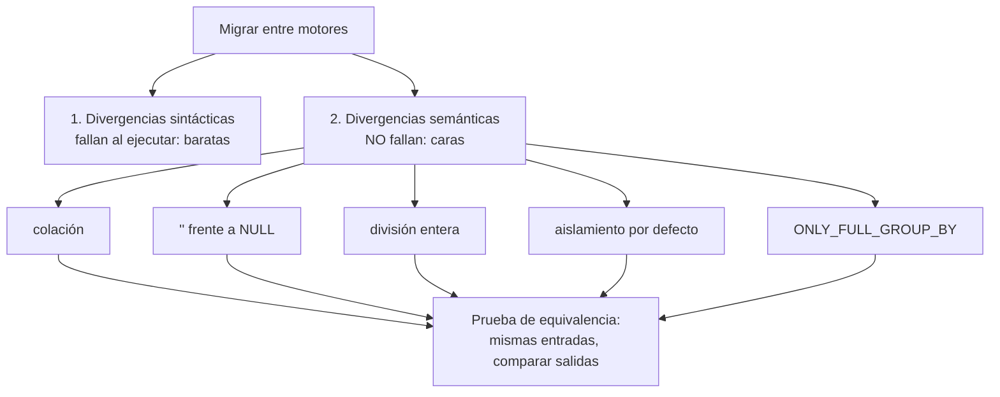

# 032 — MySQL, MariaDB, SQL Server y Oracle: divergencias que rompen código

   

> [Programa](../../../README.md) · [Parte 05](../README.md) · [← Anterior](../../part-05-motores-relacionales-y-dialectos/031-postgresql-tipos-extensiones-y-procesos/README.md) · [Siguiente →](../../part-05-motores-relacionales-y-dialectos/033-sqlite-y-duckdb-motores-embebidos/README.md)

Parte 05 — Motores relacionales y dialectos · Intermedio ·
3 horas estimadas · motores `mysql`, `mariadb`, `sql-server`, `oracle-database` · laboratorio
[`labs/03-transactions`](../../../labs/03-transactions/README.md) · 4 fuentes.

**Conceptos centrales:** `colación` · `modo estricto` · `cadena vacia frente a nulo` · `identificador citado`

**En este caso se comparan 7 motores**: 7 lo resuelven (4 con el resultado comprobado por máquina) y 0 no, con el motivo escrito.



---

## Propósito

Conocer las divergencias concretas de MySQL/MariaDB, SQL Server y Oracle que rompen código escrito para otro motor — especialmente las que no producen ningún error.

## Resultados de aprendizaje

Al terminar podrás:

1. Anticipar el comportamiento de MySQL en modo estricto y fuera de él.
2. Explicar el tratamiento de la cadena vacía en Oracle y su efecto.
3. Comparar los niveles de aislamiento por defecto de los cuatro motores.
4. Identificar las diferencias de identificadores, citas y sensibilidad a mayúsculas.
5. Construir una prueba que detecte divergencias semánticas antes de migrar.

## Fundamentos

### MySQL / MariaDB

**Modo estricto.** Históricamente MySQL truncaba y convertía en silencio en vez de fallar. Con `sql_mode` estricto (por defecto desde 5.7) rechaza; con él desactivado, sigue aceptando:

```sql
INSERT INTO t (n) VALUES (300);     -- columna TINYINT
-- estricto: error 1264 out of range
-- no estricto: guarda 127 y emite un aviso
```

Un aviso no detiene un despliegue. Comprobar `SELECT @@sql_mode` es el primer paso al recibir una base MySQL heredada.

**`ONLY_FULL_GROUP_BY`.** Sin este modo, MySQL permite columnas en `SELECT` que no están en `GROUP BY` y devuelve **un valor arbitrario** del grupo. El resultado es plausible y erróneo. Está activo por defecto desde 5.7, pero muchas bases heredadas lo desactivan «porque rompía consultas» — consultas que ya estaban mal.

**Colación.** Por defecto insensible a mayúsculas y acentos (`utf8mb4_0900_ai_ci`), a diferencia de PostgreSQL. Es la divergencia semántica de la clase 020.

**Motores de almacenamiento.** InnoDB es transaccional; MyISAM no lo es. Una tabla MyISAM ignora las transacciones sin avisar: el `ROLLBACK` no revierte nada.

**Aislamiento por defecto:** `REPEATABLE READ`, distinto de casi todos los demás.

### SQL Server

**Aislamiento por defecto: `READ COMMITTED` con bloqueo**, no con versiones. Los lectores bloquean a los escritores y viceversa, salvo que se active `READ_COMMITTED_SNAPSHOT`. Es la causa de bloqueos que no aparecen en PostgreSQL ni en Oracle.

**Identificadores** entre corchetes `[tabla]` además de comillas dobles. **Colación** definida en la instalación, la base y hasta la columna; lo habitual es insensible a mayúsculas.

**`TOP` y `OFFSET ... FETCH`:** `TOP` es propietario; `OFFSET/FETCH` es la norma y exige `ORDER BY`.

**Concatenación con nulos:** por defecto `'a' + NULL` es `NULL`, igual que en la norma, pero el ajuste `CONCAT_NULL_YIELDS_NULL` podía cambiarlo en versiones antiguas.

### Oracle

**La cadena vacía es `NULL`.** Es la divergencia más severa de todo el ecosistema:

```sql
INSERT INTO t (s) VALUES ('');
SELECT * FROM t WHERE s IS NULL;   -- devuelve la fila
SELECT * FROM t WHERE s = '';      -- no devuelve nada
```

Código que distingue «vacío» de «desconocido» —lo cual es una distinción legítima del dominio— no se puede portar a Oracle sin reescribir el modelo.

**Identificadores en mayúsculas** salvo que se citen: `create table Alumno` crea `ALUMNO`, y `"Alumno"` es una tabla distinta.

**Consistencia de lectura multiversión** desde siempre, con la particularidad histórica del error «snapshot too old» cuando el segmento de deshacer se recicla durante una consulta larga.

**`DUAL`:** las consultas sin tabla requieren `SELECT 1 FROM dual`.

### Tabla comparativa

| Aspecto | PostgreSQL | MySQL 8 (InnoDB) | SQL Server | Oracle | SQLite |
|---|---|---|---|---|---|
| Aislamiento por defecto | `READ COMMITTED` (MVCC) | `REPEATABLE READ` | `READ COMMITTED` (bloqueo) | `READ COMMITTED` (MVCC) | `SERIALIZABLE` de hecho |
| `''` es `NULL` | No | No | No | **Sí** | No |
| Colación por defecto | Sensible | **Insensible** | Suele ser insensible | Sensible | `BINARY` |
| Identificadores sin citar | minúsculas | según el sistema de archivos | insensible | **MAYÚSCULAS** | insensible |
| Límite de filas | `LIMIT` | `LIMIT` | `TOP` / `FETCH` | `FETCH FIRST` | `LIMIT` |
| DDL transaccional | Sí | **No** | Sí | No | Sí |
| Autoincremento | `GENERATED ... IDENTITY` | `AUTO_INCREMENT` | `IDENTITY` | secuencia / `IDENTITY` | `AUTOINCREMENT` |
| `7/2` | `3` | `3.5` | `3` | `3.5` | `3` |
| Índice parcial | Sí | No | Filtrado, sí | No (índice por función) | Sí |
| `CHECK` aplicado | Sí | Desde 8.0.16 | Sí | Sí | Sí |



## Ejemplo trabajado

Prueba de equivalencia que detecta divergencias **antes** de migrar. La idea es ejecutar el mismo conjunto de sentencias en dos motores y comparar las salidas exactas.

```sql
-- casos.sql : cada uno pensado para exponer una divergencia conocida
SELECT '01-division'        AS caso, CAST(7/2 AS CHAR(10))                        AS valor;
SELECT '02-colacion'        AS caso, CAST((SELECT COUNT(*) FROM students
                                           WHERE email='ANA@EJEMPLO.CL') AS CHAR(10));
SELECT '03-cadena-vacia'    AS caso, CASE WHEN '' IS NULL THEN 'es-null'
                                          ELSE 'no-es-null' END;
SELECT '04-concat'          AS caso, CAST(('a' || 'b') AS CHAR(10));
SELECT '05-orden-nulos'     AS caso, CAST((SELECT nota FROM enrollments
                                           ORDER BY nota LIMIT 1) AS CHAR(10));
SELECT '06-redondeo'        AS caso, CAST(ROUND(2.5) AS CHAR(10));
```

Salidas observadas:

| Caso | PostgreSQL | MySQL 8 | SQLite | Oracle |
|---|---|---|---|---|
| 01 división | `3` | `3.5` | `3` | `3.5` |
| 02 colación | `0` | `1` | `0` | `0` |
| 03 cadena vacía | `no-es-null` | `no-es-null` | `no-es-null` | `es-null` |
| 04 concatenación | `ab` | `0` | `ab` | `ab` |
| 05 orden de nulos | `NULL` primero | `NULL` primero | `NULL` primero | `NULL` **último** |
| 06 redondeo de 2,5 | `2` (al par) | `3` | `3` | `3` |

Seis líneas de SQL revelan seis formas distintas de obtener resultados incorrectos en silencio. El caso 06 es especialmente traicionero: PostgreSQL aplica redondeo bancario (al par más cercano) para `numeric`, y eso produce descuadres de céntimos frente a un sistema que redondea siempre hacia arriba.

**Orden de los nulos:** la norma deja la decisión al motor. La forma portable de fijarlo es escribirlo:

```sql
ORDER BY nota ASC NULLS LAST      -- PostgreSQL, Oracle, SQLite 3.30+
ORDER BY (nota IS NULL), nota     -- portable a MySQL y SQL Server
```

**Interpretación:** la migración no consiste en traducir sintaxis. Consiste en enumerar las divergencias semánticas que afectan a tu dominio y escribir una prueba por cada una. Esa prueba se ejecuta en CI contra los dos motores y es lo único que convierte «debería funcionar» en «funciona».

## Comparación

| Migración | Dificultad dominante |
|---|---|
| MySQL → PostgreSQL | Colación, `ONLY_FULL_GROUP_BY`, tipos laxos, división |
| PostgreSQL → MySQL | Índices parciales, `jsonb`, tipos avanzados, DDL transaccional |
| Oracle → PostgreSQL | Cadena vacía, `DUAL`, PL/SQL, identificadores en mayúsculas |
| SQL Server → PostgreSQL | Aislamiento por bloqueo, `TOP`, T-SQL |
| Cualquiera → SQLite | Concurrencia de escritura, tipado dinámico |

## Errores frecuentes

1. **Migrar comparando solo la sintaxis.** Las divergencias caras no dan error.
2. **Desactivar `ONLY_FULL_GROUP_BY` para que «funcione».** Devuelve valores arbitrarios.
3. **Suponer que `''` y `NULL` son distintos en Oracle.**
4. **No fijar `NULLS FIRST/LAST`.** Los informes ordenan distinto según el motor.
5. **Ignorar el motor de almacenamiento en MySQL heredado.** MyISAM no es transaccional.
6. **Probar la migración solo con datos limpios.** Las divergencias aparecen con nulos, vacíos y acentos.

## De la clase a la operación

Una migración de motor sin pruebas de equivalencia se descubre incompleta durante meses, en forma de incidencias sueltas que nadie relaciona entre sí. El conjunto de casos de esta clase es barato de escribir y es lo que convierte la migración en un proyecto con final.

## Reto de transferencia

1. Amplía el archivo de casos con cinco divergencias que afecten a tu dominio.
2. Ejecútalo en dos motores del `docker-compose` y guarda ambas salidas.
3. Escribe un comparador que falle si difieren y añádelo a la integración continua.
4. Documenta, por cada divergencia, la corrección adoptada.

## Preguntas de evaluación

1. ¿Por qué `ONLY_FULL_GROUP_BY` desactivado produce informes erróneos y no errores?
2. Explica qué código de tu dominio se rompería al migrar a Oracle por el tratamiento de la cadena vacía.
3. ¿Qué implica que SQL Server use bloqueo en `READ COMMITTED` para una consulta de informe larga?
4. Escribe un `ORDER BY` con posición de nulos fijada que funcione en los cinco motores de la tabla.

---

## 🌐 El mismo problema en cada motor

**Caso:** Cuántos nombres distintos hay, cuando el motor decide si «Ada» y «ada» son el mismo

Una tabla con cuatro filas: `Ada`, `ada`, `ADA` y `Linus`. La pregunta es
cuántos nombres distintos hay, y la respuesta correcta —cuatro— no depende
de la consulta: depende de la **intercalación** de la columna, que no está
escrita en ninguna parte de la consulta.

Con la configuración por omisión, MySQL responde **2**: su intercalación
`utf8mb4_0900_ai_ci` ignora mayúsculas y acentos, así que las tres primeras
filas son el mismo valor. SQL Server responde lo que diga la intercalación
de la instancia, que se eligió al instalarla y que casi nadie recuerda.
PostgreSQL, SQLite y DuckDB responden 4, porque comparan byte a byte.

Esta es la divergencia que rompe migraciones sin dar un solo error: los
recuentos cambian, los `UNIQUE` aceptan o rechazan cosas distintas, y el
`ORDER BY` devuelve otro orden. El caso obliga a escribir en cada motor la
versión que responde 4.

Salida esperada, idéntica en todos los motores que lo resuelven:

| distintos |
|---|
| `4` |

El contrato vive en [`motores.yaml`](motores.yaml) y lo comprueba
`python scripts/verificar_equivalencia.py --clase 032`: 4 de
las 7 implementaciones se ejecutan de verdad y su
resultado se compara con esa tabla; el resto se declara como material revisado,
no ejecutado.

| Motor | ¿Resuelve el caso? | Nivel de prueba | Código | Fuente |
|---|---|---|---|---|
| SQLite | sí | núcleo | [código](implementaciones/sqlite/consulta.sql) | [doc oficial](https://sqlite.org/datatype3.html) |
| DuckDB | sí | núcleo | [código](implementaciones/duckdb/consulta.sql) | [doc oficial](https://duckdb.org/docs/stable/sql/expressions/collations.html) |
| PostgreSQL | sí | servicio | [código](implementaciones/postgresql/consulta.sql) | [doc oficial](https://www.postgresql.org/docs/current/collation.html) |
| MySQL | sí | servicio | [código](implementaciones/mysql/consulta.sql) | [doc oficial](https://dev.mysql.com/doc/refman/8.4/en/charset-collation-names.html) |
| MariaDB | sí | declarado | [código](implementaciones/mariadb/consulta.sql) | [doc oficial](https://mariadb.com/docs/server/reference/data-types/string-data-types/character-sets) |
| Microsoft SQL Server | sí | declarado | [código](implementaciones/sql-server/consulta.sql) | [doc oficial](https://learn.microsoft.com/sql/relational-databases/collations/collation-and-unicode-support) |
| Oracle Database | sí | declarado | [código](implementaciones/oracle-database/consulta.sql) | [doc oficial](https://docs.oracle.com/en/database/oracle/oracle-database/23/nlspg/linguistic-sorting-and-matching.html) |

### Los que resuelven el caso

#### SQLite · [`implementaciones/sqlite/consulta.sql`](implementaciones/sqlite/consulta.sql)

✅ **verificado** — se ejecuta en CI sin servicios

```sql
-- motor: sqlite
-- doc: https://sqlite.org/datatype3.html
-- nota: la intercalacion por omision es BINARY: compara byte a byte. Cambiar
--       la columna a `TEXT COLLATE NOCASE` haria que esta consulta devolviera 2.

-- === preparacion ===
CREATE TABLE registros (
    id     INTEGER PRIMARY KEY,
    nombre TEXT NOT NULL
);
INSERT INTO registros (id, nombre) VALUES (1, 'Ada'), (2, 'ada'), (3, 'ADA'), (4, 'Linus');

-- === consulta ===
-- Cuantos nombres DISTINTOS hay. La respuesta correcta depende de algo que no
-- esta en la consulta: la intercalacion de la columna.
SELECT COUNT(DISTINCT nombre) AS distintos FROM registros;
```

- **Por qué sí:** Su intercalación por omisión es `BINARY`: compara byte a byte y responde 4 sin configurar nada. Para comparar sin mayúsculas hay que pedirlo expresamente con `COLLATE NOCASE`.
- **Por qué no:** `NOCASE` solo ignora mayúsculas en el alfabeto ASCII: `Á` y `á` siguen siendo distintas. Cualquier aplicación con texto en español necesita algo más que la intercalación integrada.
- 📄 Documentación oficial: <https://sqlite.org/datatype3.html>

#### DuckDB · [`implementaciones/duckdb/consulta.sql`](implementaciones/duckdb/consulta.sql)

✅ **verificado** — se ejecuta en CI sin servicios

```sql
-- motor: duckdb
-- doc: https://duckdb.org/docs/stable/sql/expressions/collations.html
-- nota: al analizar un volcado que viene de MySQL, este recuento NO coincide
--       con el del origen. No es un fallo: es la intercalacion.

-- === preparacion ===
CREATE TABLE registros (
    id     INTEGER PRIMARY KEY,
    nombre VARCHAR NOT NULL
);
INSERT INTO registros (id, nombre) VALUES (1, 'Ada'), (2, 'ada'), (3, 'ADA'), (4, 'Linus');

-- === consulta ===
-- Cuantos nombres DISTINTOS hay. La respuesta correcta depende de algo que no
-- esta en la consulta: la intercalacion de la columna.
SELECT COUNT(DISTINCT nombre) AS distintos FROM registros;
```

- **Por qué sí:** Compara respetando mayúsculas por omisión y ofrece intercalaciones ICU como extensión cuando hace falta ordenar por idioma.
- **Por qué no:** Al analizar datos que vienen de MySQL, el recuento distinto que devuelve DuckDB **no coincide** con el del origen: no es un fallo, es la intercalación, y descubrirlo tarde invalida el informe entero.
- 📄 Documentación oficial: <https://duckdb.org/docs/stable/sql/expressions/collations.html>

#### PostgreSQL · [`implementaciones/postgresql/consulta.sql`](implementaciones/postgresql/consulta.sql)

✅ **verificado** — se ejecuta contra el motor real levantado con `docker compose`

```sql
-- motor: postgresql
-- doc: https://www.postgresql.org/docs/current/collation.html
-- nota: la comparacion por omision distingue mayusculas. Lo que hay que vigilar
--       aqui es otra cosa: la intercalacion viene de la biblioteca del sistema,
--       y una actualizacion de glibc puede cambiar el orden y dejar los indices
--       B-Tree de texto en un estado incoherente. De ahi el proveedor `icu`.

-- === preparacion ===
DROP TABLE IF EXISTS registros;

CREATE TABLE registros (
    id     integer PRIMARY KEY,
    nombre text NOT NULL
);
INSERT INTO registros (id, nombre) VALUES (1, 'Ada'), (2, 'ada'), (3, 'ADA'), (4, 'Linus');

-- === consulta ===
-- Cuantos nombres DISTINTOS hay. La respuesta correcta depende de algo que no
-- esta en la consulta: la intercalacion de la columna.
SELECT COUNT(DISTINCT nombre) AS distintos FROM registros;
```

- **Por qué sí:** La intercalación es explícita y se puede fijar por columna o por expresión; el comportamiento por omisión distingue mayúsculas, que es lo que casi siempre se quiere para una identidad.
- **Por qué no:** La intercalación depende de la biblioteca del sistema operativo: una actualización de `glibc` puede cambiar el orden y **corromper los índices B-Tree** sobre columnas de texto. Por eso existe el proveedor `icu` y por eso hay que declararlo.
- 📄 Documentación oficial: <https://www.postgresql.org/docs/current/collation.html>

#### MySQL · [`implementaciones/mysql/consulta.sql`](implementaciones/mysql/consulta.sql)

✅ **verificado** — se ejecuta contra el motor real levantado con `docker compose`

```sql
-- motor: mysql
-- doc: https://dev.mysql.com/doc/refman/8.4/en/charset-collation-names.html
-- nota: SIN el COLLATE utf8mb4_bin de abajo, esta consulta devuelve 2, no 4:
--       la intercalacion por omision utf8mb4_0900_ai_ci ignora mayusculas y
--       acentos. Es la divergencia mas cara de las migraciones a y desde MySQL.

-- === preparacion ===
DROP TABLE IF EXISTS registros;

CREATE TABLE registros (
    id     INT PRIMARY KEY,
    nombre VARCHAR(50) COLLATE utf8mb4_bin NOT NULL
);
INSERT INTO registros (id, nombre) VALUES (1, 'Ada'), (2, 'ada'), (3, 'ADA'), (4, 'Linus');

-- === consulta ===
-- Cuantos nombres DISTINTOS hay. La respuesta correcta depende de algo que no
-- esta en la consulta: la intercalacion de la columna.
SELECT COUNT(DISTINCT nombre) AS distintos FROM registros;
```

- **Por qué sí:** Se puede pedir la comparación exacta con `COLLATE utf8mb4_bin` en la columna o en la propia consulta, sin cambiar la configuración del servidor.
- **Por qué no:** Por omisión hace justo lo contrario, y en silencio: `utf8mb4_0900_ai_ci` ignora mayúsculas y acentos. Un `UNIQUE` sobre un correo acepta `Ada@x.org` **o** `ada@x.org`, pero no las dos, y eso es una decisión de producto que nadie tomó.
- 📄 Documentación oficial: <https://dev.mysql.com/doc/refman/8.4/en/charset-collation-names.html>

#### MariaDB · [`implementaciones/mariadb/consulta.sql`](implementaciones/mariadb/consulta.sql)

⚪ **declarado** — se revisa a mano contra la documentación citada; la máquina no lo ejecuta

```sql
-- motor: mariadb
-- doc: https://mariadb.com/docs/server/reference/data-types/string-data-types/character-sets
-- nota: implementacion declarada. La sintaxis es la de MySQL, pero la
--       intercalacion por omision NO es la misma (utf8mb4_general_ci frente a
--       utf8mb4_0900_ai_ci): dos motores que se anuncian compatibles ordenan
--       distinto. Por eso el COLLATE explicito no es opcional al migrar.

-- === preparacion ===
DROP TABLE IF EXISTS registros;

CREATE TABLE registros (
    id     INT PRIMARY KEY,
    nombre VARCHAR(50) COLLATE utf8mb4_bin NOT NULL
);
INSERT INTO registros (id, nombre) VALUES (1, 'Ada'), (2, 'ada'), (3, 'ADA'), (4, 'Linus');

-- === consulta ===
SELECT COUNT(DISTINCT nombre) AS distintos FROM registros;
```

- **Por qué sí:** Comparte la sintaxis de MySQL, así que la corrección con `COLLATE` es la misma y el código migra sin cambios.
- **Por qué no:** Sus intercalaciones por omisión **no son las mismas** que las de MySQL 8 (`utf8mb4_general_ci` frente a `utf8mb4_0900_ai_ci`), y ordenan distinto: dos motores que se anuncian compatibles devuelven listas en otro orden.
- 📄 Documentación oficial: <https://mariadb.com/docs/server/reference/data-types/string-data-types/character-sets>

#### Microsoft SQL Server · [`implementaciones/sql-server/consulta.sql`](implementaciones/sql-server/consulta.sql)

⚪ **declarado** — se revisa a mano contra la documentación citada; la máquina no lo ejecuta

```sql
-- motor: sql-server
-- doc: https://learn.microsoft.com/sql/relational-databases/collations/collation-and-unicode-support
-- nota: implementacion declarada. La intercalacion por omision se elige AL
--       INSTALAR la instancia y afecta tambien a los nombres de objetos y a
--       tempdb. Fijarla en la columna, como aqui, es la unica forma de que el
--       resultado no dependa de la maquina.

-- === preparacion ===
DROP TABLE IF EXISTS dbo.registros;

CREATE TABLE dbo.registros (
    id     INT PRIMARY KEY,
    nombre NVARCHAR(50) COLLATE Latin1_General_BIN2 NOT NULL
);
INSERT INTO dbo.registros (id, nombre) VALUES
    (1, N'Ada'), (2, N'ada'), (3, N'ADA'), (4, N'Linus');

-- === consulta ===
SELECT COUNT(DISTINCT nombre) AS distintos FROM dbo.registros;
```

- **Por qué sí:** La intercalación se puede fijar en la propia consulta con `COLLATE Latin1_General_BIN2`, sin tocar la base ni la instancia.
- **Por qué no:** La intercalación por omisión se elige **al instalar la instancia** y afecta también a los nombres de objetos y a las tablas temporales: mezclar dos bases con intercalaciones distintas produce errores al reunir columnas de texto que no se pueden resolver sin conversiones explícitas.
- 📄 Documentación oficial: <https://learn.microsoft.com/sql/relational-databases/collations/collation-and-unicode-support>

#### Oracle Database · [`implementaciones/oracle-database/consulta.sql`](implementaciones/oracle-database/consulta.sql)

⚪ **declarado** — se revisa a mano contra la documentación citada; la máquina no lo ejecuta

```sql
-- motor: oracle-database
-- doc: https://docs.oracle.com/en/database/oracle/oracle-database/23/nlspg/linguistic-sorting-and-matching.html
-- nota: implementacion declarada. Aqui el comportamiento se controla POR SESION
--       con NLS_SORT y NLS_COMP: la misma consulta puede devolver 2 o 4 segun
--       quien la lance. Dejarlo en BINARY es la unica forma de que el resultado
--       sea el mismo para todos.

-- === preparacion ===
ALTER SESSION SET NLS_SORT = 'BINARY';
ALTER SESSION SET NLS_COMP = 'BINARY';

CREATE TABLE registros (
    id     NUMBER PRIMARY KEY,
    nombre VARCHAR2(50) NOT NULL
);
INSERT INTO registros (id, nombre) VALUES (1, 'Ada');
INSERT INTO registros (id, nombre) VALUES (2, 'ada');
INSERT INTO registros (id, nombre) VALUES (3, 'ADA');
INSERT INTO registros (id, nombre) VALUES (4, 'Linus');
COMMIT;

-- === consulta ===
SELECT COUNT(DISTINCT nombre) AS distintos FROM registros;
```

- **Por qué sí:** Con `NLS_SORT` y `NLS_COMP` se controla el mismo comportamiento por sesión, lo que permite ajustar la comparación sin cambiar el esquema.
- **Por qué no:** Que sea por sesión es también el problema: la misma consulta devuelve resultados distintos según quién la lance. Y la cadena vacía sigue siendo `NULL`, lo que suma una divergencia más al recuento.
- 📄 Documentación oficial: <https://docs.oracle.com/en/database/oracle/oracle-database/23/nlspg/linguistic-sorting-and-matching.html>

---

## Laboratorio

```bash
python scripts/validate_repository.py
python labs/03-transactions/run_transactions_lab.py
```

Guarda como evidencia la salida completa, la versión del motor y la semilla o
los parámetros usados. Una captura sin comando no es evidencia: no se puede
repetir.

## Evaluación

| Criterio | Peso | Qué se comprueba |
|---|---:|---|
| Comprensión conceptual | 25 % | Explica el mecanismo, no solo el resultado |
| Ejecución reproducible | 25 % | Otra persona obtiene lo mismo con las instrucciones dadas |
| Interpretación basada en evidencia | 25 % | Cada conclusión se apoya en una salida o una medición |
| Límites y riesgos declarados | 25 % | Dice qué no demuestra el ejercicio y qué faltaría en producción |

La clase se da por superada cuando la respuesta explica el mecanismo, muestra
la salida que la respalda y declara al menos un límite del ejercicio.

## Fuentes de esta clase

Todo lo afirmado arriba procede de estas obras. Los identificadores viven en
[`catalog/sources.json`](../../../catalog/sources.json) y el estado de los
enlaces se comprueba con `python scripts/check_external_links.py`.

- **Oracle** (2026). [MySQL Reference Manual](https://dev.mysql.com/doc/).  
  Dialecto y comportamiento del motor InnoDB.
- **MariaDB Foundation** (2026). [MariaDB Documentation](https://mariadb.com/docs/).  
  Divergencias respecto de MySQL relevantes para la portabilidad.
- **Microsoft** (2026). [SQL Server Documentation](https://learn.microsoft.com/sql/sql-server/).  
  T-SQL, niveles de aislamiento y almacen de consultas.
- **Oracle** (2026). [Oracle Database Documentation](https://docs.oracle.com/en/database/).  
  PL/SQL y modelo de consistencia de lectura de Oracle.

---

> [Programa](../../../README.md) · [Parte 05](../README.md) · [← Anterior](../../part-05-motores-relacionales-y-dialectos/031-postgresql-tipos-extensiones-y-procesos/README.md) · [Siguiente →](../../part-05-motores-relacionales-y-dialectos/033-sqlite-y-duckdb-motores-embebidos/README.md)
