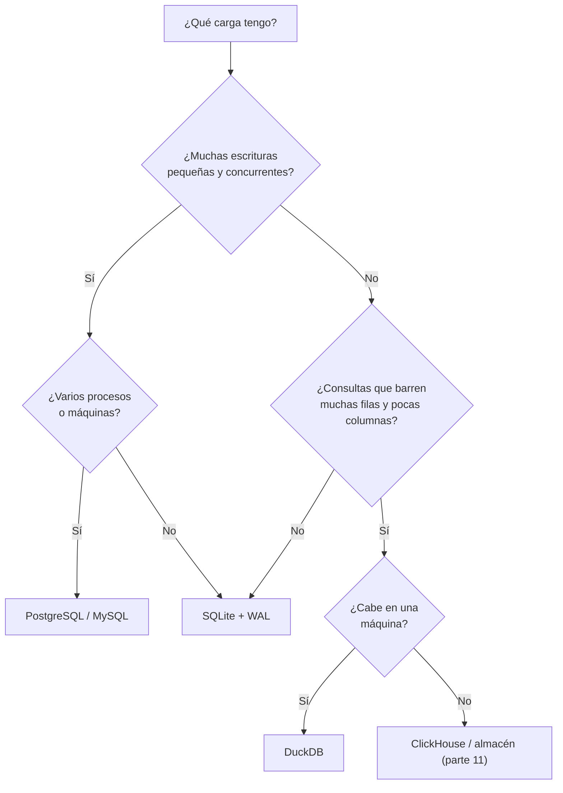

# 033 — SQLite y DuckDB: motores embebidos, transaccional frente a analítico

> [Programa](../../../README.md) · [Parte 05](../README.md) · [← Anterior](../../part-05-motores-relacionales-y-dialectos/032-mysql-sqlserver-y-oracle-divergencias/README.md) · [Siguiente →](../../part-06-documentos-y-clave-valor/034-el-agregado-como-unidad-de-consistencia/README.md)

Parte 05 — Motores relacionales y dialectos · Intermedio ·
3 horas estimadas · motores `sqlite`, `duckdb` · laboratorio
[`labs/01-sql-foundations`](../../../labs/01-sql-foundations/README.md) · 3 fuentes.

**Conceptos centrales:** `motor embebido` · `tipado dinamico` · `almacenamiento columnar` · `vectorización`

**En este caso se comparan 6 motores**: 4 lo resuelven (3 con el resultado comprobado por máquina) y 2 no, con el motivo escrito.

---

## Propósito

Entender los motores embebidos y, con ellos, la diferencia fundamental entre un sistema transaccional y uno analítico. SQLite y DuckDB comparten arquitectura y resuelven problemas opuestos.

## Resultados de aprendizaje

Al terminar podrás:

1. Explicar qué significa «embebido» y qué desaparece al no haber servidor.
2. Describir el tipado dinámico de SQLite y cuándo muerde.
3. Justificar por qué SQLite admite un solo escritor y qué habilita el modo WAL.
4. Explicar por qué el almacenamiento columnar cambia el orden de magnitud en analítica.
5. Elegir entre ambos según la carga de trabajo.

## Fundamentos

### Embebido

No hay proceso servidor ni protocolo de red: el motor es una biblioteca enlazada al programa. Lo que desaparece:

- La latencia de red (microsegundos en vez de milisegundos por consulta).
- La autenticación y los permisos por usuario: quien puede leer el archivo, lo puede todo.
- El acceso concurrente entre máquinas.
- La administración: no hay nada que arrancar ni que parchear por separado.

Lo que **no** desaparece: transacciones, índices, planificador, registro anticipado y recuperación. SQLite implementa todo eso en menos de un megabyte, y por eso es el mejor motor para estudiar un gestor completo.

### Tipado dinámico de SQLite

SQLite no tiene tipos de columna en el sentido habitual: tiene **afinidades**. Una columna declarada `INTEGER` acepta texto.

```sql
CREATE TABLE t (n INTEGER);
INSERT INTO t VALUES ('hola');     -- se acepta
SELECT typeof(n) FROM t;           -- 'text'
```

Desde la versión 3.37 existen las tablas `STRICT`, que restauran el comportamiento esperado:

```sql
CREATE TABLE t (n INTEGER) STRICT;
INSERT INTO t VALUES ('hola');     -- error: cannot store TEXT value in INTEGER column
```

**Recomendación del repositorio:** usar `STRICT` siempre que la versión lo permita. El tipado laxo es una fuente de datos sucios que después nadie sabe de dónde salieron.

Tampoco hay tipos de fecha: se usa texto ISO-8601, número Julian o entero Unix. El repositorio usa texto ISO-8601 en UTC con `CHECK` de formato, porque es legible y ordenable lexicográficamente.

### Un solo escritor

SQLite serializa las escrituras a nivel de base de datos completa. En modo de registro por reversión (`rollback journal`), un escritor bloquea también a los lectores. En modo **WAL**:

```sql
PRAGMA journal_mode = WAL;
```

- Los lectores no bloquean al escritor y el escritor no bloquea a los lectores.
- Sigue habiendo **un solo escritor a la vez**.
- Requiere memoria compartida, así que no funciona bien sobre sistemas de archivos en red.

Configuración habitual para una aplicación real:

```sql
PRAGMA journal_mode = WAL;
PRAGMA synchronous  = NORMAL;    -- FULL es más seguro; NORMAL es seguro con WAL ante caída de proceso
PRAGMA foreign_keys = ON;        -- ¡por conexión!
PRAGMA busy_timeout = 5000;      -- esperar en vez de fallar con SQLITE_BUSY
```

`busy_timeout` es el que más incidencias evita: sin él, cualquier colisión de escritura devuelve un error inmediato al cliente.

### DuckDB: la misma forma, el problema opuesto

DuckDB es también embebido y también SQL, pero está construido para analítica:

| Dimensión | SQLite | DuckDB |
|---|---|---|
| Almacenamiento | Por filas | **Por columnas** |
| Ejecución | Fila a fila | **Vectorizada** (lotes de ~2 048 valores) |
| Carga objetivo | Muchas transacciones pequeñas | Pocas consultas que barren mucho |
| Escritura concurrente | Un escritor | Un escritor |
| Lectura de Parquet/CSV | No nativa | Nativa, sin importar |
| Uso típico | Aplicación, móvil, borde | Análisis local, transformación |

**Por qué el formato columnar cambia el orden de magnitud.** Para `SELECT AVG(nota) FROM enrollments` sobre una tabla de 20 columnas y 10 millones de filas:

- **Por filas:** para leer una columna hay que leer las páginas que contienen las filas enteras. Si la fila ocupa 200 bytes y la nota 8, se leen ~2 GB para usar 80 MB.
- **Por columnas:** la columna `nota` está contigua. Se leen ~80 MB, y además comprime mucho mejor porque los valores contiguos son homogéneos.

Factor 25 en E/S por el mismo SQL y los mismos datos. A eso se añade la ejecución vectorizada, que procesa lotes en vez de fila a fila y aprovecha mejor la caché de la CPU.



## Ejemplo trabajado

Misma pregunta analítica, dos motores. 10 millones de inscripciones.

```sql
SELECT c.periodo, COUNT(*) AS inscritos, AVG(e.nota) AS promedio
FROM enrollments e JOIN courses c ON c.id = e.course_id
GROUP BY c.periodo ORDER BY c.periodo;
```

| Motor | Datos leídos | Estrategia |
|---|---|---|
| SQLite | Todas las páginas de `enrollments` (filas completas) | Barrido por filas, agregación por hash |
| DuckDB | Solo `course_id` y `nota` | Barrido columnar comprimido, agregación vectorizada |

La diferencia no está en la calidad del código de cada motor: está en el formato. SQLite no puede leer solo dos columnas porque no están separadas físicamente.

**Y el caso inverso**, una carga transaccional:

```sql
BEGIN;
INSERT INTO enrollments (student_id, course_id) VALUES (:s, :c);
UPDATE courses SET inscritos = inscritos + 1 WHERE id = :c;
COMMIT;
```

Repetido 100 000 veces con parámetros distintos, SQLite es netamente superior: escribir una fila en formato columnar obliga a tocar tantos bloques como columnas tenga la tabla. DuckDB está diseñado para cargas por lotes, no para transacciones pequeñas.

**Conclusión operativa:** no es que uno sea mejor. Es que el formato de almacenamiento **es** la decisión, y determina qué carga sale barata. Esta es la misma idea que reaparece en la clase 032 (analítica columnar) y en la 054 (OLTP frente a OLAP).

**Interoperabilidad.** DuckDB lee archivos SQLite y Parquet directamente:

```sql
INSTALL sqlite; LOAD sqlite;
SELECT COUNT(*) FROM sqlite_scan('school.db', 'enrollments');
SELECT * FROM read_parquet('notas/*.parquet') WHERE periodo = '2026-1';
```

Patrón muy útil: la aplicación escribe en SQLite y el análisis se hace con DuckDB sobre el mismo archivo, sin ETL ni servidor.

## Comparación

| Criterio | SQLite | DuckDB | PostgreSQL |
|---|---|---|---|
| Proceso servidor | No | No | Sí |
| Escritores concurrentes | 1 | 1 | Muchos |
| Formato | Filas | Columnas | Filas |
| Bueno en | OLTP pequeño | OLAP local | OLTP general |
| Control de acceso | Del archivo | Del archivo | Por rol y fila |
| Réplica | No nativa | No | Sí |

## Errores frecuentes

1. **Olvidar `PRAGMA foreign_keys = ON`.** Se aplica por conexión; sin él, las claves foráneas son decorativas.
2. **No activar WAL en aplicaciones con lectores concurrentes.** Los lectores se bloquean sin necesidad.
3. **SQLite en un sistema de archivos en red.** El bloqueo no es fiable; es la vía rápida a la corrupción.
4. **No usar tablas `STRICT`.** El tipado laxo deja entrar datos que después hay que limpiar.
5. **Usar DuckDB como base transaccional.** No es su carga; el formato columnar castiga la escritura fila a fila.
6. **Sin `busy_timeout`.** Errores `SQLITE_BUSY` esporádicos que parecen aleatorios.

## De la clase a la operación

Una parte grande de los sistemas que usan PostgreSQL solo por costumbre funcionarían mejor con SQLite: menos operación, menos latencia, respaldo trivial (copiar un archivo). El criterio es la concurrencia de escritura y el número de máquinas, no el tamaño de los datos.

## Reto de transferencia

1. Ejecuta la misma consulta analítica sobre el mismo conjunto en SQLite y en DuckDB, y mide.
2. Ejecuta la misma carga transaccional en ambos y mide.
3. Activa WAL en SQLite y demuestra con dos conexiones que un lector no bloquea al escritor.
4. Crea una tabla `STRICT` y demuestra qué inserción deja de aceptarse.

## Preguntas de evaluación

1. ¿Qué garantías se pierden al no tener proceso servidor, y cuáles se conservan?
2. Explica con números por qué el formato columnar reduce la E/S de una consulta analítica.
3. ¿Por qué el modo WAL no permite dos escritores simultáneos?
4. Da un sistema real de tu experiencia que hoy usa un servidor y podría usar SQLite, y defiende la decisión.

---

## 🌐 El mismo problema en cada motor

**Caso:** El mismo agregado, sin servidor, en el proceso de la propia aplicación

Un motor embebido no es un motor pequeño: es un motor **sin servidor**, que
vive dentro del proceso de la aplicación. No hay red, no hay conexión, no
hay usuario que autenticar. Y la base de datos es un archivo que se puede
copiar, adjuntar en un correo o versionar.

El caso es deliberadamente simple —filas y suma de notas por curso— porque
lo que se compara no es la consulta sino **dónde se ejecuta**. SQLite y
DuckDB dan la misma respuesta y son la misma clase de sistema; lo que los
separa es para qué está optimizado cada uno: uno guarda filas y sirve
transacciones, el otro guarda columnas y sirve análisis.

Salida esperada, idéntica en todos los motores que lo resuelven:

| curso | filas | suma |
|---|---|---|
| `DB-101` | `3` | `220` |
| `SE-201` | `1` | `66` |

El contrato vive en [`motores.yaml`](motores.yaml) y lo comprueba
`python scripts/verificar_equivalencia.py --clase 033`: 3 de
las 4 implementaciones se ejecutan de verdad y su
resultado se compara con esa tabla; el resto se declara como material revisado,
no ejecutado.

| Motor | ¿Resuelve el caso? | Nivel de prueba | Código | Fuente |
|---|---|---|---|---|
| SQLite | sí | núcleo | [código](implementaciones/sqlite/consulta.sql) | [doc oficial](https://sqlite.org/whentouse.html) |
| DuckDB | sí | núcleo | [código](implementaciones/duckdb/consulta.sql) | [doc oficial](https://duckdb.org/docs/stable/why_duckdb) |
| PostgreSQL | sí | servicio | [código](implementaciones/postgresql/consulta.sql) | [doc oficial](https://www.postgresql.org/docs/current/tutorial-arch.html) |
| ClickHouse | sí | declarado | [código](implementaciones/clickhouse/consulta.sql) | [doc oficial](https://clickhouse.com/docs/en/operations/utilities/clickhouse-local) |
| Redis | **no** | — | — | [doc oficial](https://redis.io/docs/latest/develop/reference/protocol-spec/) |
| MongoDB | **no** | — | — | [doc oficial](https://www.mongodb.com/docs/manual/administration/install-community/) |

### Los que resuelven el caso

#### SQLite · [`implementaciones/sqlite/consulta.sql`](implementaciones/sqlite/consulta.sql)

✅ **verificado** — se ejecuta en CI sin servicios

```sql
-- motor: sqlite
-- doc: https://sqlite.org/whentouse.html
-- nota: guarda FILAS completas, una detras de otra en la pagina. Para sumar la
--       columna `nota` hay que leer tambien `estudiante` y `curso` de cada fila:
--       con veinte columnas y un millon de filas, sumar una sola cuesta leerlo
--       casi todo.

-- === preparacion ===
CREATE TABLE notas (
    estudiante TEXT NOT NULL,
    curso      TEXT NOT NULL,
    nota       INTEGER NOT NULL,
    PRIMARY KEY (estudiante, curso)
);
INSERT INTO notas (estudiante, curso, nota) VALUES
    ('Ada',   'DB-101', 90),
    ('Grace', 'DB-101', 72),
    ('Linus', 'DB-101', 58),
    ('Ada',   'SE-201', 66);

-- === consulta ===
SELECT curso, COUNT(*) AS filas, SUM(nota) AS suma
FROM notas
GROUP BY curso
ORDER BY curso;
```

- **Por qué sí:** Es el motor embebido transaccional: guarda filas completas, cumple ACID sobre un archivo y está en cada teléfono, cada navegador y cada avión. Si la aplicación escribe registros de uno en uno y los vuelve a leer de uno en uno, es exactamente la herramienta.
- **Por qué no:** Al guardar filas, un agregado sobre una columna tiene que leer todas las demás columnas de todas las filas. Con un millón de registros y veinte columnas, sumar una sola cuesta leerlo casi todo.
- 📄 Documentación oficial: <https://sqlite.org/whentouse.html>

#### DuckDB · [`implementaciones/duckdb/consulta.sql`](implementaciones/duckdb/consulta.sql)

✅ **verificado** — se ejecuta en CI sin servicios

```sql
-- motor: duckdb
-- doc: https://duckdb.org/docs/stable/why_duckdb
-- nota: guarda COLUMNAS. Este agregado lee la columna `nota` y la columna
--       `curso`, y ninguna otra. Ademas, la misma consulta funciona sobre un
--       archivo sin cargarlo:
--         SELECT curso, COUNT(*), SUM(nota) FROM 'notas.parquet' GROUP BY curso;

-- === preparacion ===
CREATE TABLE notas (
    estudiante VARCHAR NOT NULL,
    curso      VARCHAR NOT NULL,
    nota       INTEGER NOT NULL,
    PRIMARY KEY (estudiante, curso)
);
INSERT INTO notas (estudiante, curso, nota) VALUES
    ('Ada',   'DB-101', 90),
    ('Grace', 'DB-101', 72),
    ('Linus', 'DB-101', 58),
    ('Ada',   'SE-201', 66);

-- === consulta ===
SELECT curso, COUNT(*) AS filas, SUM(nota) AS suma
FROM notas
GROUP BY curso
ORDER BY curso;
```

- **Por qué sí:** Es el motor embebido analítico: guarda columnas, las comprime y las procesa en lotes vectorizados. El mismo agregado sobre millones de filas lee solo la columna que necesita, y además puede consultar directamente un CSV o un Parquet sin cargarlo.
- **Por qué no:** Un solo proceso escritor y sin control de concurrencia entre aplicaciones: no es el sitio donde vive la verdad del negocio, sino donde se analiza una copia de ella.
- 📄 Documentación oficial: <https://duckdb.org/docs/stable/why_duckdb>

#### PostgreSQL · [`implementaciones/postgresql/consulta.sql`](implementaciones/postgresql/consulta.sql)

✅ **verificado** — se ejecuta contra el motor real levantado con `docker compose`

```sql
-- motor: postgresql
-- doc: https://www.postgresql.org/docs/current/tutorial-arch.html
-- nota: la misma respuesta, con un proceso servidor detras. Lo que se gana
--       —usuarios, permisos, conexiones remotas, replica, concurrencia— y lo
--       que se paga —instalar, configurar, actualizar, respaldar— es la
--       decision entera de esta clase.

-- === preparacion ===
DROP TABLE IF EXISTS notas;

CREATE TABLE notas (
    estudiante text NOT NULL,
    curso      text NOT NULL,
    nota       integer NOT NULL,
    PRIMARY KEY (estudiante, curso)
);
INSERT INTO notas (estudiante, curso, nota) VALUES
    ('Ada',   'DB-101', 90),
    ('Grace', 'DB-101', 72),
    ('Linus', 'DB-101', 58),
    ('Ada',   'SE-201', 66);

-- === consulta ===
SELECT curso, COUNT(*) AS filas, SUM(nota) AS suma
FROM notas
GROUP BY curso
ORDER BY curso;
```

- **Por qué sí:** Está aquí como contraste: la misma respuesta, con un servidor detrás que aporta lo que ningún embebido tiene —usuarios, permisos, conexiones remotas, réplica y escrituras concurrentes de muchas aplicaciones.
- **Por qué no:** Todo eso hay que instalarlo, configurarlo, actualizarlo y respaldarlo. Para una aplicación de escritorio, una herramienta de línea de órdenes o una prueba automatizada, es infraestructura que no resuelve nada.
- 📄 Documentación oficial: <https://www.postgresql.org/docs/current/tutorial-arch.html>

#### ClickHouse · [`implementaciones/clickhouse/consulta.sql`](implementaciones/clickhouse/consulta.sql)

⚪ **declarado** — se revisa a mano contra la documentación citada; la máquina no lo ejecuta

```sql
-- motor: clickhouse
-- doc: https://clickhouse.com/docs/en/operations/utilities/clickhouse-local
-- nota: implementacion declarada. Se ejecuta con `clickhouse-local`, sin
--       servidor ni configuracion:
--         clickhouse-local --queries-file consulta.sql
--       Sirve para ver que «embebido» y «columnar» son dos ejes distintos:
--       SQLite es embebido y de filas, DuckDB embebido y columnar, ClickHouse
--       servidor columnar... y tambien columnar sin servidor con esta utilidad.

-- === preparacion ===
CREATE TABLE notas (
    estudiante String,
    curso      String,
    nota       Int32
) ENGINE = MergeTree ORDER BY (curso, estudiante);

INSERT INTO notas VALUES
    ('Ada',   'DB-101', 90),
    ('Grace', 'DB-101', 72),
    ('Linus', 'DB-101', 58),
    ('Ada',   'SE-201', 66);

-- === consulta ===
SELECT curso, COUNT(*) AS filas, SUM(nota) AS suma
FROM notas
GROUP BY curso
ORDER BY curso;
```

- **Por qué sí:** También tiene un modo embebido, `clickhouse-local`, que ejecuta consultas sobre archivos sin servidor. Sirve para comprobar que «embebido» y «columnar» son dos ejes independientes: hay cuatro combinaciones y las cuatro existen.
- **Por qué no:** Ese modo es una herramienta de línea de órdenes, no una biblioteca que se enlaza en la aplicación: no se puede empotrar en un programa como se hace con SQLite o DuckDB.
- 📄 Documentación oficial: <https://clickhouse.com/docs/en/operations/utilities/clickhouse-local>

### Los que no resuelven este caso — y qué se hace en su lugar

Descartar un motor con un argumento es tan formativo como usarlo. Ninguna de estas filas dice que el motor sea peor: dice que este problema no es el suyo.

| Motor | Por qué no | Qué se hace en su lugar | Fuente |
|---|---|---|---|
| Redis | Aunque corra en la misma máquina, sigue siendo un servidor con su protocolo y su puerto: hay serialización y viaje de red aunque sea por bucle local. No es un motor embebido, es un servidor cercano. | Para una caché dentro del proceso, una estructura en memoria del propio lenguaje; Redis empieza a valer cuando esa caché tiene que compartirse entre varios procesos o máquinas. | [doc](https://redis.io/docs/latest/develop/reference/protocol-spec/) |
| MongoDB | No hay versión embebida disponible: la biblioteca `mongodb-embedded` se retiró, así que MongoDB implica siempre un proceso servidor aparte. | Para almacenamiento documental dentro del proceso, SQLite con sus funciones JSON cubre buena parte del caso sin añadir un servicio. | [doc](https://www.mongodb.com/docs/manual/administration/install-community/) |

---

## Laboratorio

```bash
python scripts/validate_repository.py
python labs/01-sql-foundations/run_lab.py
```

Guarda como evidencia la salida completa, la versión del motor y la semilla o
los parámetros usados. Una captura sin comando no es evidencia: no se puede
repetir.

## Evaluación

| Criterio | Peso | Qué se comprueba |
|---|---:|---|
| Comprensión conceptual | 25 % | Explica el mecanismo, no solo el resultado |
| Ejecución reproducible | 25 % | Otra persona obtiene lo mismo con las instrucciones dadas |
| Interpretación basada en evidencia | 25 % | Cada conclusión se apoya en una salida o una medición |
| Límites y riesgos declarados | 25 % | Dice qué no demuestra el ejercicio y qué faltaría en producción |

La clase se da por superada cuando la respuesta explica el mecanismo, muestra
la salida que la respalda y declara al menos un límite del ejercicio.

## Fuentes de esta clase

Todo lo afirmado arriba procede de estas obras. Los identificadores viven en
[`catalog/sources.json`](../../../catalog/sources.json) y el estado de los
enlaces se comprueba con `python scripts/check_external_links.py`.

- **SQLite Consortium** (2026). [SQLite Documentation](https://sqlite.org/docs.html).  
  Motor embebido usado por los laboratorios sin dependencias del programa.
- **DuckDB Foundation** (2026). [DuckDB Documentation](https://duckdb.org/docs/).  
  Motor analítico embebido: OLAP columnar sin servidor.
- **SQLite Consortium** (2026). [SQLite: Query Optimizer Overview](https://sqlite.org/optoverview.html).  
  Como decide SQLite usar un índice; útil para leer EXPLAIN QUERY PLAN.

---

> [Programa](../../../README.md) · [Parte 05](../README.md) · [← Anterior](../../part-05-motores-relacionales-y-dialectos/032-mysql-sqlserver-y-oracle-divergencias/README.md) · [Siguiente →](../../part-06-documentos-y-clave-valor/034-el-agregado-como-unidad-de-consistencia/README.md)
