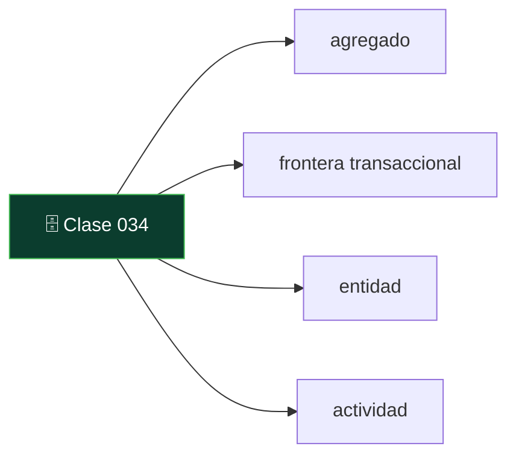
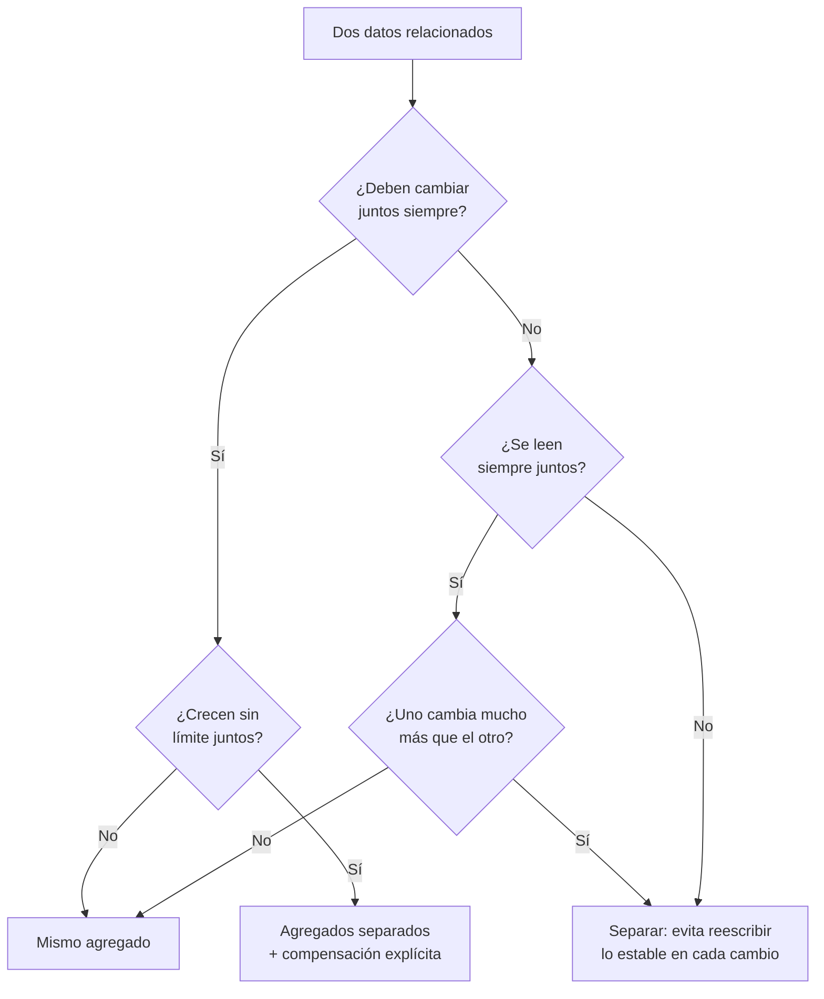

# 034 — El agregado como unidad de consistencia

   

> [Programa](../../../README.md) · [Parte 06](../README.md) · [← Anterior](../../part-05-motores-relacionales-y-dialectos/033-sqlite-y-duckdb-motores-embebidos/README.md) · [Siguiente →](../../part-06-documentos-y-clave-valor/035-modelado-documental-incrustar-o-referenciar/README.md)

Parte 06 — Documentos y clave-valor · Intermedio ·
3 horas estimadas · motores `mongodb`, `redis`, `dynamodb` · laboratorio
[`labs/02-polyglot-modeling`](../../../labs/02-polyglot-modeling/README.md) · 3 fuentes.

**Conceptos centrales:** `agregado` · `frontera transaccional` · `entidad` · `actividad`

**En este caso se comparan 7 motores**: 5 lo resuelven (5 con el resultado comprobado por máquina) y 2 no, con el motivo escrito.



---

## Propósito

Entender la idea que organiza casi todo el mundo no relacional: el **agregado**. Elegir sus fronteras es elegir dónde hay transacciones y dónde no.

## Resultados de aprendizaje

Al terminar podrás:

1. Definir agregado y distinguirlo de entidad y de tabla.
2. Explicar por qué la frontera del agregado es la frontera de la atomicidad.
3. Aplicar el criterio de Helland sobre entidades y actividades.
4. Diseñar la coherencia entre agregados sin transacción distribuida.
5. Reconocer cuándo un agregado mal elegido produce un punto caliente.

## Fundamentos

### Qué es un agregado

Sadalage y Fowler toman el término del diseño dirigido por el dominio: un **agregado** es un conjunto de datos que se trata como una unidad para lectura y escritura. Un pedido con sus líneas y su dirección de envío es un agregado; el cliente que lo hizo es otro.

En un modelo relacional el agregado no existe: cada entidad es su tabla y la transacción puede abarcar cuantas quiera. En los modelos documental, clave-valor y de columnas anchas, el agregado **es** la unidad de almacenamiento, de replicación y —esto es lo decisivo— de **atomicidad**.

| Modelo | Unidad de atomicidad garantizada |
|---|---|
| Relacional | La transacción, sobre cualquier conjunto de tablas |
| Documental | El documento; varios documentos solo con transacciones explícitas |
| Clave-valor | La clave; operaciones multiclave solo con guiones o transacciones |
| Columnas anchas | La partición |

### La consecuencia

Si dos datos deben cambiar juntos **siempre**, deben estar en el mismo agregado o hay que asumir explícitamente la inconsistencia transitoria. No hay tercera opción barata.

Ejemplo: «el saldo del monedero y el registro del movimiento deben cuadrar». En un solo documento, la escritura es atómica. En dos documentos, existe un instante en que uno se escribió y el otro no; si el proceso muere ahí, queda una inconsistencia que alguien debe reparar.

### Entidades y actividades

Helland ofrece el marco más útil para el caso distribuido:

- **Entidad:** unidad con identidad y estado, que cabe en un nodo y se actualiza atómicamente. Es el agregado.
- **Actividad:** coordinación entre entidades, que **no** puede ser atómica y debe tolerar reintentos y llegadas fuera de orden.

De ahí sus dos exigencias para cualquier interacción entre agregados: los mensajes deben ser **idempotentes** (procesar dos veces no cambia el resultado) y **conmutativos** cuando sea posible (el orden de llegada no altera el estado final).

Ese es exactamente el patrón saga de la clase 047: la actividad se descompone en pasos locales atómicos, cada uno con su compensación.

### Cómo elegir la frontera



Tres preguntas, en este orden: ¿cambian juntos?, ¿crecen sin límite?, ¿se leen juntos? La primera manda sobre las otras dos, porque es la única que afecta a la corrección; las otras afectan al rendimiento.

## Ejemplo trabajado

Dominio: inscripciones a cursos, con la regla «el contador de inscritos del curso debe coincidir con el número de inscripciones».

**Diseño A — agregado por curso:**

```json
{
  "_id": "curso-2026-1-bd",
  "nombre": "Bases de datos",
  "periodo": "2026-1",
  "cupo": 40,
  "inscritos": 3,
  "inscripciones": [
    {"student_id": 11, "nota": 6.0},
    {"student_id": 12, "nota": null},
    {"student_id": 13, "nota": 5.5}
  ]
}
```

Inscribir a alguien es **una** escritura atómica: se añade al arreglo y se incrementa el contador en la misma operación. La invariante no puede romperse.

Problemas, con números:

- **Crecimiento no acotado.** Con 40 inscritos es correcto. Con 5 000, cada lectura del curso trae 5 000 subdocumentos aunque solo se quiera el nombre, y cada inscripción reescribe el documento entero. MongoDB además limita el documento a 16 MB.
- **Punto caliente.** Todas las inscripciones al mismo curso se serializan sobre el mismo documento. En un período de matrícula, con 200 inscripciones por segundo al curso más demandado, esa serialización es la cola entera.
- **Consulta imposible sin barrido.** «Todos los cursos de un estudiante» exige recorrer todos los cursos, porque el estudiante no es la clave.

**Diseño B — agregado por inscripción:**

```json
{"_id": "11:curso-2026-1-bd", "student_id": 11, "course_id": "curso-2026-1-bd",
 "nota": 6.0, "estado": "activa", "registrada_en": "2026-03-11T12:00:00Z"}
```

Escala en escritura y permite indexar por estudiante y por curso. A cambio, el contador de inscritos ya **no** puede mantenerse atómicamente: está en otro documento.

Las tres respuestas honestas a ese hueco:

| Respuesta | Garantía | Costo |
|---|---|---|
| Calcular contando al leer | Exacta siempre | Una agregación por lectura |
| Transacción multidocumento | Exacta | Coordinación; en clúster, latencia y contención |
| Contador eventual + reconciliación | Aproximada entre reconciliaciones | Barata; exige la invariante auditada |

**Diseño C — híbrido, el habitual en producción:**

```json
{"_id": "curso-2026-1-bd", "nombre": "Bases de datos", "cupo": 40,
 "inscritos_aprox": 3812, "actualizado_en": "2026-03-11T12:00:05Z"}
```

Las inscripciones son documentos propios; el curso guarda un contador **declaradamente aproximado**. El nombre del campo comunica su semántica: quien lo lee sabe que no es una verdad transaccional. Para el control de cupo, que sí exige exactitud, se cuenta de verdad en el momento crítico.

**La invariante, obligatoria en B y C:**

```javascript
db.enrollments.aggregate([
  {$match: {estado: "activa"}},
  {$group: {_id: "$course_id", real: {$sum: 1}}},
  {$lookup: {from: "courses", localField: "_id", foreignField: "_id", as: "c"}},
  {$unwind: "$c"},
  {$match: {$expr: {$ne: ["$real", "$c.inscritos_aprox"]}}}
])
```

Cero resultados: coherente. Con resultados: la divergencia, cuantificada.

## Comparación

| Diseño | Atomicidad de la invariante | Escala en escritura | Consulta por estudiante | Tamaño acotado |
|---|---|---|---|---|
| A: agregado por curso | Total | Mala (punto caliente) | Mala | No |
| B: agregado por inscripción | Ninguna | Buena | Buena | Sí |
| C: híbrido | Aproximada, declarada | Buena | Buena | Sí |
| Relacional normalizado | Total (transacción) | Buena | Buena | Sí |

La última fila merece atención: el modelo relacional **no** obliga a elegir entre atomicidad y escalabilidad de escritura mientras quepa en un nodo. Renunciar a él tiene sentido cuando ya no cabe, no antes.

## Errores frecuentes

1. **Agregados que crecen sin límite.** Toda lista dentro de un documento necesita una cota conocida.
2. **Suponer atomicidad entre documentos.** No existe salvo que se pida explícitamente.
3. **Elegir el agregado por cómo se lee, ignorando cómo se escribe.** El punto caliente aparece después.
4. **Contadores sin marcar como aproximados.** Quien los lee supone exactitud.
5. **Copiar el modelo relacional a documentos.** Una colección por tabla con referencias reproduce las reuniones sin tener el motor que las optimiza.
6. **Usar transacciones multidocumento como si fuesen gratis.** En clúster tienen un costo de coordinación real.

## De la clase a la operación

El punto caliente por agregado demasiado grande no se ve en desarrollo: aparece el día de mayor tráfico, que es el peor día para descubrirlo. Estimar el tamaño máximo del agregado y su tasa de escritura es parte del diseño, no una optimización posterior.

## Reto de transferencia

1. Elige una entidad de tu dominio y propón dos fronteras de agregado distintas.
2. Para cada una, escribe la invariante que se garantiza atómicamente y la que no.
3. Estima el tamaño máximo del agregado y la tasa de escritura sobre el más caliente.
4. Diseña la reconciliación para la invariante que quedó fuera y su periodicidad.

## Preguntas de evaluación

1. ¿Por qué la frontera del agregado es la frontera de la atomicidad?
2. Da un agregado de tu dominio que crecería sin límite y propón cómo acotarlo.
3. Explica el criterio de Helland de idempotencia con un mensaje concreto de tu sistema.
4. ¿En qué caso concreto renunciarías al modelo relacional por uno de agregados, y con qué evidencia?

---

## 🌐 El mismo problema en cada motor

**Caso:** Un pedido y sus líneas que cambian juntos o no cambian

Un **agregado**, en el sentido de Evans y de Vernon, es el grupo de datos
que se trata como una unidad: tiene una raíz —el pedido—, un límite —sus
líneas— y un invariante que debe cumplirse siempre. Aquí el invariante es
que el total guardado sea igual a la suma de las líneas.

El caso crea el pedido con dos líneas, añade una tercera y sube el total. La
consulta devuelve el total guardado y el calculado. Que coincidan es todo el
ejercicio: lo interesante no es el número, sino **qué mecanismo garantiza
que nunca se separen** en cada motor, y qué pasa cuando el agregado no cabe
en la unidad atómica que ese motor ofrece.

Salida esperada, idéntica en todos los motores que lo resuelven:

| pedido | total_guardado | total_calculado |
|---|---|---|
| `P-1` | `300` | `300` |

El contrato vive en [`motores.yaml`](motores.yaml) y lo comprueba
`python scripts/verificar_equivalencia.py --clase 034`: 5 de
las 5 implementaciones se ejecutan de verdad y su
resultado se compara con esa tabla; el resto se declara como material revisado,
no ejecutado.

| Motor | ¿Resuelve el caso? | Nivel de prueba | Código | Fuente |
|---|---|---|---|---|
| SQLite | sí | núcleo | [código](implementaciones/sqlite/consulta.sql) | [doc oficial](https://sqlite.org/lang_transaction.html) |
| DuckDB | sí | núcleo | [código](implementaciones/duckdb/consulta.sql) | [doc oficial](https://duckdb.org/docs/stable/sql/statements/transactions.html) |
| PostgreSQL | sí | servicio | [código](implementaciones/postgresql/consulta.sql) | [doc oficial](https://www.postgresql.org/docs/current/tutorial-transactions.html) |
| MongoDB | sí | servicio | [código](implementaciones/mongodb/consulta.js) | [doc oficial](https://www.mongodb.com/docs/manual/core/write-operations-atomicity/) |
| Redis | sí | servicio | [código](implementaciones/redis/consulta.txt) | [doc oficial](https://redis.io/docs/latest/develop/programmability/eval-intro/) |
| Amazon DynamoDB | **no** | — | — | [doc oficial](https://docs.aws.amazon.com/amazondynamodb/latest/developerguide/transaction-apis.html) |
| Apache Cassandra | **no** | — | — | [doc oficial](https://cassandra.apache.org/doc/latest/cassandra/developing/cql/dml.html) |

### Los que resuelven el caso

#### SQLite · [`implementaciones/sqlite/consulta.sql`](implementaciones/sqlite/consulta.sql)

✅ **verificado** — se ejecuta en CI sin servicios

```sql
-- motor: sqlite
-- doc: https://sqlite.org/lang_transaction.html
-- nota: el limite del agregado es una CONVENCION, no una propiedad del
--       esquema. Nada impide un UPDATE suelto que rompa el invariante.

-- === preparacion ===
CREATE TABLE pedidos (
    id    TEXT PRIMARY KEY,
    total INTEGER NOT NULL
);
CREATE TABLE lineas (
    pedido_id TEXT NOT NULL REFERENCES pedidos(id),
    producto  TEXT NOT NULL,
    importe   INTEGER NOT NULL,
    PRIMARY KEY (pedido_id, producto)
);

-- El agregado nace entero, dentro de UNA transaccion.
BEGIN;
INSERT INTO pedidos (id, total) VALUES ('P-1', 200);
INSERT INTO lineas (pedido_id, producto, importe) VALUES ('P-1', 'teclado', 120);
INSERT INTO lineas (pedido_id, producto, importe) VALUES ('P-1', 'raton', 80);
COMMIT;

-- Y cambia entero: la linea nueva y el total suben juntos o no sube ninguno.
BEGIN;
INSERT INTO lineas (pedido_id, producto, importe) VALUES ('P-1', 'cable', 100);
UPDATE pedidos SET total = total + 100 WHERE id = 'P-1';
COMMIT;

-- === consulta ===
-- El invariante del agregado: el total guardado y la suma de sus lineas. Si
-- alguna vez dejan de coincidir, la transaccion no estaba haciendo su trabajo.
SELECT p.id AS pedido,
       p.total AS total_guardado,
       (SELECT SUM(l.importe) FROM lineas l WHERE l.pedido_id = p.id) AS total_calculado
FROM pedidos p
ORDER BY p.id;
```

- **Por qué sí:** El agregado se reparte en dos tablas y la transacción lo mantiene entero: `BEGIN`/`COMMIT` es la frontera. En un motor relacional el límite del agregado lo decide el diseñador, no el almacén.
- **Por qué no:** Precisamente por eso el límite es invisible: nada en el esquema dice que `pedidos` y `lineas` son una unidad, y basta un `UPDATE` suelto sin transacción para romper el invariante sin que nada proteste.
- 📄 Documentación oficial: <https://sqlite.org/lang_transaction.html>

#### DuckDB · [`implementaciones/duckdb/consulta.sql`](implementaciones/duckdb/consulta.sql)

✅ **verificado** — se ejecuta en CI sin servicios

```sql
-- motor: duckdb
-- doc: https://duckdb.org/docs/stable/sql/statements/transactions.html

-- === preparacion ===
CREATE TABLE pedidos (
    id    VARCHAR PRIMARY KEY,
    total INTEGER NOT NULL
);
CREATE TABLE lineas (
    pedido_id VARCHAR NOT NULL,
    producto  VARCHAR NOT NULL,
    importe   INTEGER NOT NULL,
    PRIMARY KEY (pedido_id, producto)
);

-- El agregado nace entero, dentro de UNA transaccion.
BEGIN;
INSERT INTO pedidos (id, total) VALUES ('P-1', 200);
INSERT INTO lineas (pedido_id, producto, importe) VALUES ('P-1', 'teclado', 120);
INSERT INTO lineas (pedido_id, producto, importe) VALUES ('P-1', 'raton', 80);
COMMIT;

-- Y cambia entero: la linea nueva y el total suben juntos o no sube ninguno.
BEGIN;
INSERT INTO lineas (pedido_id, producto, importe) VALUES ('P-1', 'cable', 100);
UPDATE pedidos SET total = total + 100 WHERE id = 'P-1';
COMMIT;

-- === consulta ===
-- El invariante del agregado: el total guardado y la suma de sus lineas. Si
-- alguna vez dejan de coincidir, la transaccion no estaba haciendo su trabajo.
SELECT p.id AS pedido,
       p.total AS total_guardado,
       (SELECT SUM(l.importe) FROM lineas l WHERE l.pedido_id = p.id) AS total_calculado
FROM pedidos p
ORDER BY p.id;
```

- **Por qué sí:** Tiene transacciones ACID sobre el archivo, así que el mismo guion sirve para comprobar el invariante sobre un volcado analítico.
- **Por qué no:** Un solo proceso escritor: el agregado está a salvo de una escritura a medias, pero no de dos aplicaciones que quieran escribirlo a la vez, porque esa situación sencillamente no está contemplada.
- 📄 Documentación oficial: <https://duckdb.org/docs/stable/sql/statements/transactions.html>

#### PostgreSQL · [`implementaciones/postgresql/consulta.sql`](implementaciones/postgresql/consulta.sql)

✅ **verificado** — se ejecuta contra el motor real levantado con `docker compose`

```sql
-- motor: postgresql
-- doc: https://www.postgresql.org/docs/current/tutorial-transactions.html
-- nota: el invariante se puede llevar al esquema con una restriccion diferible
--       comprobada al COMMIT, en vez de dejarlo en manos de quien escriba.

-- === preparacion ===
DROP TABLE IF EXISTS lineas, pedidos;

CREATE TABLE pedidos (
    id    text PRIMARY KEY,
    total integer NOT NULL
);
CREATE TABLE lineas (
    pedido_id text NOT NULL REFERENCES pedidos(id),
    producto  text NOT NULL,
    importe   integer NOT NULL,
    PRIMARY KEY (pedido_id, producto)
);

-- El agregado nace entero, dentro de UNA transaccion.
BEGIN;
INSERT INTO pedidos (id, total) VALUES ('P-1', 200);
INSERT INTO lineas (pedido_id, producto, importe) VALUES ('P-1', 'teclado', 120);
INSERT INTO lineas (pedido_id, producto, importe) VALUES ('P-1', 'raton', 80);
COMMIT;

-- Y cambia entero: la linea nueva y el total suben juntos o no sube ninguno.
BEGIN;
INSERT INTO lineas (pedido_id, producto, importe) VALUES ('P-1', 'cable', 100);
UPDATE pedidos SET total = total + 100 WHERE id = 'P-1';
COMMIT;

-- === consulta ===
-- El invariante del agregado: el total guardado y la suma de sus lineas. Si
-- alguna vez dejan de coincidir, la transaccion no estaba haciendo su trabajo.
SELECT p.id AS pedido,
       p.total AS total_guardado,
       (SELECT SUM(l.importe) FROM lineas l WHERE l.pedido_id = p.id) AS total_calculado
FROM pedidos p
ORDER BY p.id;
```

- **Por qué sí:** La transacción abarca cuantas tablas haga falta, con aislamiento configurable y con restricciones diferibles: el límite del agregado puede ser tan grande como el problema pida, y el invariante se puede comprobar al confirmar en vez de en cada sentencia.
- **Por qué no:** Esa libertad invita a agregados enormes: una transacción que toca diez tablas retiene bloqueos y versiones durante todo su recorrido, y en concurrencia alta convierte el invariante en una cola.
- 📄 Documentación oficial: <https://www.postgresql.org/docs/current/tutorial-transactions.html>

#### MongoDB · [`implementaciones/mongodb/consulta.js`](implementaciones/mongodb/consulta.js)

✅ **verificado** — se ejecuta contra el motor real levantado con `docker compose`

```javascript
// motor: mongodb
// doc: https://www.mongodb.com/docs/manual/core/write-operations-atomicity/
// nota: aqui NO hay transaccion, y no hace falta. El pedido y sus lineas son un
//       solo documento, y la escritura de un documento es atomica: $push y $inc
//       en la misma orden se aplican juntos o no se aplica ninguno.

// === preparacion ===
db.pedidos.drop();

db.pedidos.insertOne({
  _id: "P-1",
  total: 200,
  lineas: [
    { producto: "teclado", importe: 120 },
    { producto: "raton", importe: 80 },
  ],
});

// Una sola orden: la linea nueva y el total suben juntos.
db.pedidos.updateOne(
  { _id: "P-1" },
  {
    $push: { lineas: { producto: "cable", importe: 100 } },
    $inc: { total: 100 },
  },
);

// === consulta ===
db.pedidos
  .aggregate([
    { $project: { _id: 0, pedido: "$_id", total_guardado: "$total",
                  total_calculado: { $sum: "$lineas.importe" } } },
    { $sort: { pedido: 1 } },
  ])
  .forEach((d) => print(d.pedido + "|" + d.total_guardado + "|" + d.total_calculado));
```

- **Por qué sí:** Aquí el agregado es literal: pedido y líneas son **un documento**, y la escritura de un documento es atómica por definición. El límite del agregado deja de ser una convención y pasa a ser una propiedad del almacén, sin transacción que declarar.
- **Por qué no:** Ese límite es también una jaula: el documento no puede pasar de 16 MB, un pedido con cien mil líneas no cabe, y todo lo que cruce la frontera del documento vuelve a necesitar transacciones de varios documentos, que aquí cuestan más que en un motor relacional.
- 📄 Documentación oficial: <https://www.mongodb.com/docs/manual/core/write-operations-atomicity/>

#### Redis · [`implementaciones/redis/consulta.txt`](implementaciones/redis/consulta.txt)

✅ **verificado** — se ejecuta contra el motor real levantado con `docker compose`

```text
# motor: redis
# doc: https://redis.io/docs/latest/develop/programmability/eval-intro/
# nota: el script Lua es la unidad atomica: se ejecuta entero, sin que ninguna
#       otra orden se cuele en medio. Es lo que permite que la linea nueva y el
#       total suban juntos. Lo que NO garantiza es durabilidad: atomico y
#       durable son dos propiedades distintas.

# === preparacion ===
FLUSHDB
HSET pedido:P-1 total 200
HSET pedido:P-1:linea teclado 120
HSET pedido:P-1:linea raton 80

# Anadir la linea y subir el total, sin estado intermedio observable.
EVAL "redis.call('HSET','pedido:P-1:linea','cable',100) redis.call('HINCRBY','pedido:P-1','total',100) return 1" 0

# === consulta ===
EVAL "local t=redis.call('HGET','pedido:P-1','total') local ls=redis.call('HVALS','pedido:P-1:linea') local s=0 for _,v in ipairs(ls) do s=s+tonumber(v) end return {'P-1|'..t..'|'..s}" 0
```

- **Por qué sí:** Un script Lua se ejecuta entero y sin interrupciones: es la unidad atómica de Redis y permite actualizar varias claves del mismo agregado sin que nadie vea un estado intermedio.
- **Por qué no:** La atomicidad no es durabilidad: si el servidor cae antes de volcar, el agregado consistente que se acaba de escribir puede no existir al arrancar. Y en un clúster, las claves del agregado tienen que compartir ranura (`hash tag`) o el script ni siquiera se puede ejecutar.
- 📄 Documentación oficial: <https://redis.io/docs/latest/develop/programmability/eval-intro/>

### Los que no resuelven este caso — y qué se hace en su lugar

Descartar un motor con un argumento es tan formativo como usarlo. Ninguna de estas filas dice que el motor sea peor: dice que este problema no es el suyo.

| Motor | Por qué no | Qué se hace en su lugar | Fuente |
|---|---|---|---|
| Amazon DynamoDB | Un elemento es la unidad atómica, y está limitado a 400 KB. Un agregado que no quepa ahí necesita `TransactWriteItems`, que admite como mucho 100 elementos, cuesta el doble de capacidad de escritura y no admite dos operaciones sobre el mismo elemento. | Diseñar el agregado para que quepa en un elemento, o repartirlo en la misma clave de partición y aceptar que la coherencia entre sus elementos la comprueba un proceso posterior. | [doc](https://docs.aws.amazon.com/amazondynamodb/latest/developerguide/transaction-apis.html) |
| Apache Cassandra | `BATCH` no es una transacción: no hay aislamiento entre particiones y no se puede deshacer. Solo dentro de **una** partición la escritura por lotes es atómica y aislada; en cuanto el agregado toca dos particiones, se puede observar a medias. | Modelar el agregado entero dentro de una sola partición —el pedido como clave, las líneas como filas de agrupamiento— y usar `BATCH` únicamente dentro de ella. | [doc](https://cassandra.apache.org/doc/latest/cassandra/developing/cql/dml.html) |

---

## Laboratorio

```bash
python scripts/validate_repository.py
# labs/02-polyglot-modeling se entrega escrito: no hay guion que ejecutar
```

Guarda como evidencia la salida completa, la versión del motor y la semilla o
los parámetros usados. Una captura sin comando no es evidencia: no se puede
repetir.

## Evaluación

| Criterio | Peso | Qué se comprueba |
|---|---:|---|
| Comprensión conceptual | 25 % | Explica el mecanismo, no solo el resultado |
| Ejecución reproducible | 25 % | Otra persona obtiene lo mismo con las instrucciones dadas |
| Interpretación basada en evidencia | 25 % | Cada conclusión se apoya en una salida o una medición |
| Límites y riesgos declarados | 25 % | Dice qué no demuestra el ejercicio y qué faltaría en producción |

La clase se da por superada cuando la respuesta explica el mecanismo, muestra
la salida que la respalda y declara al menos un límite del ejercicio.

## Fuentes de esta clase

Todo lo afirmado arriba procede de estas obras. Los identificadores viven en
[`catalog/sources.json`](../../../catalog/sources.json) y el estado de los
enlaces se comprueba con `python scripts/check_external_links.py`.

- **Pramod J. Sadalage, Martin Fowler** (2012). [NoSQL Distilled: A Brief Guide to the Emerging World of Polyglot Persistence](https://martinfowler.com/books/nosql.html). Addison-Wesley. ISBN 978-0-321-82662-6.  
  Origen del término agregado y de la persistencia políglota que estructura este programa.
- **Pat Helland** (2007). [Life beyond Distributed Transactions: An Apostate's Opinion](https://www.cidrdb.org/cidr2007/papers/cidr07p15.pdf). CIDR.  
  Entidades, actividades y por qué las transacciones distribuidas no escalan.
- **Martin Kleppmann** (2017). [Designing Data-Intensive Applications](https://dataintensive.net/). O'Reilly. ISBN 978-1-4493-7332-0.  
  Referencia central del programa para replicación, partición, transacciones distribuidas y streaming.

---

> [Programa](../../../README.md) · [Parte 06](../README.md) · [← Anterior](../../part-05-motores-relacionales-y-dialectos/033-sqlite-y-duckdb-motores-embebidos/README.md) · [Siguiente →](../../part-06-documentos-y-clave-valor/035-modelado-documental-incrustar-o-referenciar/README.md)
