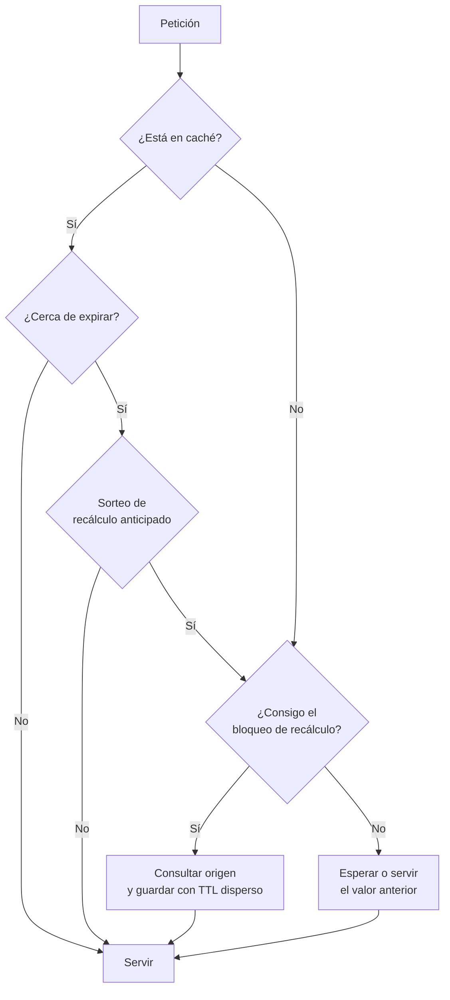

# 037 — Clave-valor, caché y expiración: qué se pierde exactamente

> [Programa](../../../README.md) · [Parte 06](../README.md) · [← Anterior](../../part-06-documentos-y-clave-valor/036-consultas-e-indices-sobre-documentos/README.md) · [Siguiente →](../../part-07-grafos-columnas-tiempo-y-busqueda/038-grafos-de-propiedades-y-recorridos/README.md)

Parte 06 — Documentos y clave-valor · Intermedio ·
3 horas estimadas · motores `redis`, `dynamodb` · laboratorio
[`labs/05-nosql-workloads`](../../../labs/05-nosql-workloads/README.md) · 3 fuentes.

**Conceptos centrales:** `TTL` · `invalidación` · `estampida de caché` · `durabilidad configurable`

**En este caso se comparan 7 motores**: 6 lo resuelven (5 con el resultado comprobado por máquina) y 1 no, con el motivo escrito.

---

## Propósito

Usar un almacén clave-valor sabiendo exactamente qué se pierde y cuándo. Una caché mal diseñada no solo no acelera: sirve datos incorrectos y derriba el origen cuando expira.

## Resultados de aprendizaje

Al terminar podrás:

1. Elegir la estructura de datos de Redis adecuada al problema.
2. Explicar qué se pierde exactamente con RDB, con AOF y con cada valor de `appendfsync`.
3. Aplicar las tres estrategias de invalidación y sus consecuencias.
4. Prevenir la estampida de caché con tres mecanismos distintos.
5. Decidir cuándo un almacén clave-valor es la base de datos y cuándo solo es caché.

## Fundamentos

### No es solo una tabla hash

Redis ofrece estructuras con operaciones atómicas propias, y elegir bien evita lógica en la aplicación:

| Estructura | Operaciones | Caso de uso |
|---|---|---|
| String | `GET`, `SET`, `INCR` | Caché, contadores |
| Hash | `HGET`, `HSET`, `HINCRBY` | Objeto con campos actualizables por separado |
| List | `LPUSH`, `BRPOP` | Cola simple |
| Set | `SADD`, `SINTER` | Pertenencia, intersecciones |
| Sorted set | `ZADD`, `ZRANGEBYSCORE` | Ranking, colas por prioridad, ventanas temporales |
| Stream | `XADD`, `XREADGROUP` | Registro de eventos con grupos de consumidores |
| HyperLogLog | `PFADD`, `PFCOUNT` | Conteo aproximado de distintos con ~12 KB fijos |

`INCR` es atómico: no hay lectura-modificación-escritura y por tanto no hay actualización perdida (clase 001). Esa atomicidad por operación es la principal razón para usar Redis en vez de una tabla hash en memoria del proceso.

### Qué se pierde exactamente

La pregunta que hay que responder antes de guardar algo importante:

| Configuración | Qué se pierde ante caída del proceso | Ante caída de la máquina |
|---|---|---|
| Sin persistencia | Todo | Todo |
| RDB cada 5 min | Hasta 5 min | Hasta 5 min |
| AOF `appendfsync everysec` | Nada | **Hasta 1 segundo** |
| AOF `appendfsync always` | Nada | Nada (con un costo alto por escritura) |
| RDB + AOF | Lo que indique el AOF | Ídem |

`everysec` es el valor por defecto y el que casi todos usan. Es una elección correcta para una caché y una elección **que hay que declarar** si se guardan datos que no están en ningún otro sitio.

Advertencia adicional: con replicación asíncrona, un `SET` confirmado al cliente puede perderse si el primario cae antes de replicar. Redis no ofrece durabilidad sincrónica por omisión.

### Invalidación

| Estrategia | Cómo funciona | Riesgo |
|---|---|---|
| **TTL** | El dato expira solo | Ventana de datos obsoletos igual al TTL |
| **Escritura y borrado** (*write-through invalidate*) | Al escribir en el origen, se borra la clave | Carrera entre el borrado y una lectura concurrente |
| **Escritura directa** (*write-through*) | Se escribe en ambos | Doble escritura, posible divergencia si una falla |

La carrera de la segunda estrategia es real y merece detalle:

```text
t0  Lector    : falla la caché, lee del origen -> valor V1
t1  Escritor  : actualiza el origen            -> valor V2
t2  Escritor  : borra la clave de la caché
t3  Lector    : escribe en la caché lo que leyó en t0 -> V1  (obsoleto, ¡y sin TTL, para siempre!)
```

Defensas: poner **siempre** un TTL aunque se invalide explícitamente (acota el daño), o usar `SET ... XX` con comprobación de versión.

### Estampida

Cuando una clave muy solicitada expira, todas las peticiones concurrentes fallan a la vez y golpean el origen simultáneamente. Con 5 000 peticiones por segundo y una consulta de 200 ms, la expiración de una sola clave lanza ~1 000 consultas idénticas contra la base de datos.

Tres defensas:

1. **Bloqueo de recálculo:** solo una petición recalcula; las demás esperan o sirven el valor antiguo.

   ```text
   SET recalculo:clave 1 NX EX 30     -- solo uno lo consigue
   ```

2. **TTL con dispersión aleatoria:** `TTL = base + aleatorio(0, base·0,1)`. Evita que miles de claves creadas a la vez expiren a la vez.
3. **Recálculo anticipado probabilístico:** cada lectura recalcula con probabilidad creciente conforme se acerca la expiración, de modo que la clave se renueva antes de caducar.



## Ejemplo trabajado

Caché del panel del curso, que en la clase 009 costaba una agregación sobre millones de filas.

```python
import json, random, time

TTL_BASE = 300  # 5 minutos

def panel_curso(redis, db, course_id):
    clave = f"curso:{course_id}:panel"
    dato = redis.get(clave)
    if dato is not None:
        return json.loads(dato)

    # Solo un proceso recalcula; el resto espera brevemente y reintenta.
    if redis.set(f"lock:{clave}", "1", nx=True, ex=30):
        try:
            panel = consultar_panel(db, course_id)          # la agregación cara
            ttl = TTL_BASE + random.randint(0, TTL_BASE // 10)
            redis.set(clave, json.dumps(panel), ex=ttl)
            return panel
        finally:
            redis.delete(f"lock:{clave}")

    time.sleep(0.05)
    dato = redis.get(clave)
    return json.loads(dato) if dato else consultar_panel(db, course_id)
```

**Efecto medido**, con 5 000 peticiones/s a un curso y una agregación de 200 ms:

| Escenario | Consultas al origen por expiración |
|---|---:|
| Sin caché | 5 000/s, continuamente |
| Caché sin bloqueo | ~1 000 de golpe cada 5 min |
| Caché con bloqueo + TTL disperso | 1 cada ~5 min |

**Invalidación al inscribir**, para que el panel no espere 5 minutos:

```python
def inscribir(db, redis, student_id, course_id):
    with db.transaction():                     # el origen es la verdad
        db.execute("INSERT INTO enrollments (student_id, course_id) VALUES (?,?)",
                   (student_id, course_id))
    redis.delete(f"curso:{course_id}:panel")   # fuera de la transacción, a propósito
```

El borrado va **después** del `COMMIT` y fuera de la transacción. Si se hiciera dentro y la transacción se revirtiera, se habría invalidado una caché correcta; peor aún, una lectura concurrente podría repoblarla con el valor no confirmado. El precio de este orden es una ventana de milisegundos con el panel obsoleto, que el TTL acota de todos modos.

**Estructura adecuada.** Si el panel solo necesita el contador:

```text
HINCRBY curso:bd:contadores inscritos 1
```

Una operación atómica de O(1) en vez de invalidar y recalcular. La lección: elegir la estructura correcta a veces elimina el problema de invalidación en lugar de resolverlo.

## Comparación

| Uso | ¿Es aceptable perder los datos? | Configuración |
|---|---|---|
| Caché de consultas | Sí | Sin persistencia, TTL, `maxmemory-policy allkeys-lru` |
| Sesiones de usuario | Molesto, no grave | AOF `everysec`, TTL |
| Cola de trabajos | No | Streams con confirmación, o un motor de colas real |
| Contadores de negocio | No | Origen relacional; Redis solo acelera |
| Límite de tasa | Sí | Sin persistencia, TTL corto |
| Ranking en vivo | Depende | Sorted set + reconstrucción desde el origen |

## Errores frecuentes

1. **Caché sin TTL.** Un fallo de invalidación se vuelve permanente.
2. **Usar Redis como fuente de verdad sin declarar la durabilidad.** `everysec` pierde hasta un segundo.
3. **Invalidar dentro de la transacción.** Repuebla con datos no confirmados.
4. **Todas las claves con el mismo TTL.** Expiran en bloque y provocan estampida.
5. **`KEYS *` en producción.** Bloquea el servidor, que es de un solo hilo para comandos; usar `SCAN`.
6. **Guardar objetos enormes.** Un valor de varios megabytes bloquea el hilo durante su serialización.
7. **Sin `maxmemory-policy`.** Al llenarse, Redis empieza a rechazar escrituras en vez de desalojar.

## De la clase a la operación

La caída más habitual asociada a caché no es la caché: es el origen, cuando la caché se vacía de golpe (reinicio, despliegue, expiración masiva) y recibe de una vez todo el tráfico que llevaba meses sin ver. Probar el arranque en frío bajo carga es parte de la entrega.

## Reto de transferencia

1. Elige una consulta cara real y cachéala con TTL disperso y bloqueo de recálculo.
2. Mide las consultas al origen con y sin bloqueo, provocando la expiración bajo carga.
3. Documenta qué se pierde en tu configuración de persistencia, en unidades de tiempo.
4. Reproduce la carrera de invalidación y demuestra que el TTL acota el daño.

## Preguntas de evaluación

1. ¿Cuántos datos se pierden exactamente con `appendfsync everysec` y una caída de la máquina?
2. Traza la carrera entre un lector y un escritor que deja un valor obsoleto en la caché.
3. Calcula la estampida esperada en tu sistema con sus cifras de tráfico.
4. Da un dato de tu dominio que **no** guardarías en Redis y explica por qué.

---

## 🌐 El mismo problema en cada motor

**Caso:** Los tres estados de una clave con caducidad

Una caché no tiene dos estados sino tres, y confundirlos es la causa de casi
todos los errores de caducidad: la clave **existe y caduca**, la clave
**existe y no caduca**, o la clave **no está**. Redis los distingue en el
valor que devuelve `TTL`: un número positivo, `-1` y `-2`.

El caso guarda `k1` con caducidad, `k2` sin ella, no guarda `k3`, y pide el
estado de las tres, ordenadas por clave. Lo revelador es lo que hay que
escribir en los motores que **no** tienen caducidad: la columna de
vencimiento, el filtro en cada lectura y el trabajo que borra lo vencido.
Todo eso es lo que Redis regala y lo que se paga al no usarlo.

Salida esperada, idéntica en todos los motores que lo resuelven:

| clave | estado |
|---|---|
| `k1` | `expira` |
| `k2` | `permanente` |
| `k3` | `ausente` |

El contrato vive en [`motores.yaml`](motores.yaml) y lo comprueba
`python scripts/verificar_equivalencia.py --clase 037`: 5 de
las 6 implementaciones se ejecutan de verdad y su
resultado se compara con esa tabla; el resto se declara como material revisado,
no ejecutado.

| Motor | ¿Resuelve el caso? | Nivel de prueba | Código | Fuente |
|---|---|---|---|---|
| Redis | sí | servicio | [código](implementaciones/redis/consulta.txt) | [doc oficial](https://redis.io/docs/latest/commands/expire/) |
| MongoDB | sí | servicio | [código](implementaciones/mongodb/consulta.js) | [doc oficial](https://www.mongodb.com/docs/manual/core/index-ttl/) |
| Apache Cassandra | sí | declarado | [código](implementaciones/cassandra/consulta.cql) | [doc oficial](https://cassandra.apache.org/doc/latest/cassandra/developing/cql/dml.html) |
| SQLite | sí | núcleo | [código](implementaciones/sqlite/consulta.sql) | [doc oficial](https://sqlite.org/lang_datefunc.html) |
| DuckDB | sí | núcleo | [código](implementaciones/duckdb/consulta.sql) | [doc oficial](https://duckdb.org/docs/stable/sql/functions/date.html) |
| PostgreSQL | sí | servicio | [código](implementaciones/postgresql/consulta.sql) | [doc oficial](https://www.postgresql.org/docs/current/indexes-partial.html) |
| Amazon DynamoDB | **no** | — | — | [doc oficial](https://docs.aws.amazon.com/amazondynamodb/latest/developerguide/TTL.html) |

### Los que resuelven el caso

#### Redis · [`implementaciones/redis/consulta.txt`](implementaciones/redis/consulta.txt)

✅ **verificado** — se ejecuta contra el motor real levantado con `docker compose`

```text
# motor: redis
# doc: https://redis.io/docs/latest/commands/expire/
# nota: TTL devuelve tres cosas distintas y hay que leerlas como tres:
#         > 0   segundos que le quedan
#         -1    existe y no caduca
#         -2    no existe
#       Confundir -1 con -2 es el error clasico: «la clave no esta» y «la clave
#       esta y no caduca» son estados opuestos.

# === preparacion ===
FLUSHDB
SET k1 "con caducidad" EX 3600
SET k2 "permanente"
# k3 no se escribe: la ausencia tambien es un estado.

# === consulta ===
EVAL "local r={} for _,k in ipairs({'k1','k2','k3'}) do local t=redis.call('TTL',k) local e='expira' if t==-1 then e='permanente' elseif t==-2 then e='ausente' end r[#r+1]=k..'|'..e end return r" 0
```

- **Por qué sí:** La caducidad es parte del almacén: se fija por clave, la aplica el servidor y `TTL` distingue los tres estados sin ambigüedad. La memoria se libera sola, con caducidad pasiva al leer y un muestreo activo de fondo.
- **Por qué no:** La expiración es **aproximada**: entre el instante de vencimiento y el momento en que la memoria se libera pasa un tiempo indeterminado. Y si la memoria se agota antes, la política de desalojo puede borrar claves que todavía no habían vencido: una caché no es un almacén.
- 📄 Documentación oficial: <https://redis.io/docs/latest/commands/expire/>

#### MongoDB · [`implementaciones/mongodb/consulta.js`](implementaciones/mongodb/consulta.js)

✅ **verificado** — se ejecuta contra el motor real levantado con `docker compose`

```javascript
// motor: mongodb
// doc: https://www.mongodb.com/docs/manual/core/index-ttl/
// nota: el indice TTL libera ESPACIO, no define VISIBILIDAD: el proceso que
//       borra corre cada 60 segundos, asi que un documento vencido sigue
//       siendo visible hasta un minuto despues. La consulta filtra por fecha
//       igualmente; el indice solo evita que la coleccion crezca sin fin.

// === preparacion ===
db.cache.drop();
db.cache.createIndex({ expira_en: 1 }, { expireAfterSeconds: 0 });

db.cache.insertMany([
  { _id: "k1", valor: "con caducidad", expira_en: new Date("2099-01-01T00:00:00Z") },
  { _id: "k2", valor: "permanente" },
]);
// k3 no se inserta.

// === consulta ===
for (const clave of ["k1", "k2", "k3"]) {
  const doc = db.cache.findOne({ _id: clave });
  const estado = doc === null
    ? "ausente"
    : doc.expira_en === undefined
      ? "permanente"
      : "expira";
  print(clave + "|" + estado);
}
```

- **Por qué sí:** Un índice TTL sobre un campo de fecha borra los documentos vencidos sin que nadie lo pida, así que la colección puede hacer de caché duradera con la misma semántica de tres estados.
- **Por qué no:** El proceso que borra corre **cada 60 segundos**: un documento vencido sigue siendo visible hasta un minuto después, así que la consulta tiene que filtrar por la fecha igualmente. El índice TTL libera espacio; no define visibilidad.
- 📄 Documentación oficial: <https://www.mongodb.com/docs/manual/core/index-ttl/>

#### Apache Cassandra · [`implementaciones/cassandra/consulta.cql`](implementaciones/cassandra/consulta.cql)

⚪ **declarado** — se revisa a mano contra la documentación citada; la máquina no lo ejecuta

```sql
-- motor: cassandra
-- doc: https://cassandra.apache.org/doc/latest/cassandra/developing/cql/dml.html
-- nota: implementacion declarada. Aqui la caducidad es POR CELDA, no por fila:
--       un atributo puede caducar y el resto de la fila seguir viva. Ningun
--       otro motor de esta lista ofrece esa granularidad.
--       El precio: cada celda vencida deja una lapida que hay que recorrer en
--       las lecturas hasta que la compactacion la retire.

-- === preparacion ===
CREATE KEYSPACE IF NOT EXISTS escuela
  WITH replication = {'class': 'SimpleStrategy', 'replication_factor': 1};

DROP TABLE IF EXISTS escuela.cache;

CREATE TABLE escuela.cache (
    clave text PRIMARY KEY,
    valor text
);

INSERT INTO escuela.cache (clave, valor) VALUES ('k1', 'con caducidad') USING TTL 3600;
INSERT INTO escuela.cache (clave, valor) VALUES ('k2', 'permanente');
-- k3 no se escribe.

-- === consulta ===
-- TTL() sobre una columna devuelve los segundos que le quedan, o null si no
-- caduca. La fila ausente sencillamente no aparece: los tres estados hay que
-- reconstruirlos en el cliente, igual que en los motores relacionales.
SELECT clave, TTL(valor) AS segundos FROM escuela.cache;
```

- **Por qué sí:** La caducidad se declara por **celda**, no por fila: `USING TTL` permite que un atributo caduque y el resto de la fila siga viva, algo que ningún otro motor de esta lista ofrece.
- **Por qué no:** Cada celda vencida se convierte en una lápida que hay que recorrer en las lecturas hasta que la compactación la retire: usar TTL como mecanismo de cola de trabajo es uno de los antipatrones más conocidos de Cassandra.
- 📄 Documentación oficial: <https://cassandra.apache.org/doc/latest/cassandra/developing/cql/dml.html>

#### SQLite · [`implementaciones/sqlite/consulta.sql`](implementaciones/sqlite/consulta.sql)

✅ **verificado** — se ejecuta en CI sin servicios

```sql
-- motor: sqlite
-- doc: https://sqlite.org/lang_datefunc.html
-- nota: esta es la version larga de lo que Redis hace con una letra. La
--       caducidad son tres cosas que hay que escribir a mano: la columna, el
--       filtro en CADA lectura y el borrado periodico
--         DELETE FROM cache WHERE expira_en IS NOT NULL AND expira_en <= datetime('now');
--       Olvidar cualquiera de las tres deja datos vencidos a la vista.

-- === preparacion ===
CREATE TABLE cache (
    clave     TEXT PRIMARY KEY,
    valor     TEXT NOT NULL,
    expira_en TEXT          -- nulo = sin caducidad
);

INSERT INTO cache (clave, valor, expira_en) VALUES
    ('k1', 'con caducidad', '2099-01-01T00:00:00Z'),
    ('k2', 'permanente',    NULL);
-- k3 no se inserta: la ausencia tambien es un estado, y hay que distinguirla.

-- === consulta ===
-- Los tres estados que un almacen clave-valor con caducidad distingue, y que
-- aqui hay que reconstruir a mano porque el motor no los conoce.
WITH consultadas(clave) AS (
    VALUES ('k1'), ('k2'), ('k3')
)
SELECT c.clave,
       CASE
           WHEN e.clave IS NULL     THEN 'ausente'
           WHEN e.expira_en IS NULL THEN 'permanente'
           ELSE 'expira'
       END AS estado
FROM consultadas c
LEFT JOIN cache e ON e.clave = c.clave
ORDER BY c.clave;
```

- **Por qué sí:** Enseña lo que cuesta no tener caducidad: una columna de vencimiento, un filtro en **cada** lectura y un borrado periódico. Escrito así, se ve que la caducidad no es magia, es trabajo que alguien tiene que hacer.
- **Por qué no:** Ese trabajo hay que acordarse de hacerlo siempre: la consulta que olvide el filtro devolverá datos vencidos, y el borrado que nadie programe hará crecer la tabla para siempre.
- 📄 Documentación oficial: <https://sqlite.org/lang_datefunc.html>

#### DuckDB · [`implementaciones/duckdb/consulta.sql`](implementaciones/duckdb/consulta.sql)

✅ **verificado** — se ejecuta en CI sin servicios

```sql
-- motor: duckdb
-- doc: https://duckdb.org/docs/stable/sql/functions/date.html
-- nota: aqui no se implementa una cache: se AUDITA. Sobre un volcado de la
--       cache real, esta consulta responde cuantas claves hay en cada estado,
--       que es la pregunta de operacion que nadie se hace a tiempo.

-- === preparacion ===
CREATE TABLE cache (
    clave     VARCHAR PRIMARY KEY,
    valor     VARCHAR NOT NULL,
    expira_en VARCHAR          -- nulo = sin caducidad
);

INSERT INTO cache (clave, valor, expira_en) VALUES
    ('k1', 'con caducidad', '2099-01-01T00:00:00Z'),
    ('k2', 'permanente',    NULL);
-- k3 no se inserta: la ausencia tambien es un estado, y hay que distinguirla.

-- === consulta ===
-- Los tres estados que un almacen clave-valor con caducidad distingue, y que
-- aqui hay que reconstruir a mano porque el motor no los conoce.
WITH consultadas(clave) AS (
    VALUES ('k1'), ('k2'), ('k3')
)
SELECT c.clave,
       CASE
           WHEN e.clave IS NULL     THEN 'ausente'
           WHEN e.expira_en IS NULL THEN 'permanente'
           ELSE 'expira'
       END AS estado
FROM consultadas c
LEFT JOIN cache e ON e.clave = c.clave
ORDER BY c.clave;
```

- **Por qué sí:** Sirve para la pregunta de operación que nadie se hace a tiempo: cuántas claves hay vencidas, desde cuándo y cuánto espacio ocupan, sobre un volcado de la caché.
- **Por qué no:** No es un almacén de claves ni tiene caducidad: aquí solo se analiza el estado de una caché que vive en otro sitio.
- 📄 Documentación oficial: <https://duckdb.org/docs/stable/sql/functions/date.html>

#### PostgreSQL · [`implementaciones/postgresql/consulta.sql`](implementaciones/postgresql/consulta.sql)

✅ **verificado** — se ejecuta contra el motor real levantado con `docker compose`

```sql
-- motor: postgresql
-- doc: https://www.postgresql.org/docs/current/indexes-partial.html
-- nota: aqui aparece un limite que sorprende. Un indice parcial
--         CREATE INDEX ... WHERE expira_en > now()
--       NO se puede crear: el predicado de un indice tiene que ser IMMUTABLE y
--       now() es STABLE. Si se pudiera, el indice quedaria obsoleto en cuanto
--       pasara el tiempo. Asi que el indice va sobre la columna y el filtro se
--       aplica en cada consulta, que es exactamente el trabajo que Redis evita.

-- === preparacion ===
DROP TABLE IF EXISTS cache;

CREATE TABLE cache (
    clave     text PRIMARY KEY,
    valor     text NOT NULL,
    expira_en timestamptz
);
CREATE INDEX cache_por_vencimiento ON cache (expira_en);

INSERT INTO cache (clave, valor, expira_en) VALUES
    ('k1', 'con caducidad', TIMESTAMPTZ '2099-01-01 00:00:00+00'),
    ('k2', 'permanente',    NULL);

-- === consulta ===
WITH consultadas(clave) AS (
    VALUES ('k1'), ('k2'), ('k3')
)
SELECT c.clave,
       CASE
           WHEN e.clave IS NULL     THEN 'ausente'
           WHEN e.expira_en IS NULL THEN 'permanente'
           ELSE 'expira'
       END AS estado
FROM consultadas c
LEFT JOIN cache e ON e.clave = c.clave
ORDER BY c.clave;
```

- **Por qué sí:** Con `timestamptz`, un índice sobre el vencimiento y un programador (`pg_cron`) para el borrado se consigue una caché duradera, transaccional y consultable: a veces es exactamente lo que hace falta y ahorra un sistema entero.
- **Por qué no:** Cada lectura se convierte en una consulta al motor transaccional, con su conexión y su latencia: si la caché existía para descargar a PostgreSQL, ponerla dentro de PostgreSQL no descarga nada. Y ni siquiera se puede indexar «lo vigente»: un índice parcial con `now()` se rechaza, porque el predicado de un índice tiene que ser inmutable.
- 📄 Documentación oficial: <https://www.postgresql.org/docs/current/indexes-partial.html>

### Los que no resuelven este caso — y qué se hace en su lugar

Descartar un motor con un argumento es tan formativo como usarlo. Ninguna de estas filas dice que el motor sea peor: dice que este problema no es el suyo.

| Motor | Por qué no | Qué se hace en su lugar | Fuente |
|---|---|---|---|
| Amazon DynamoDB | Tiene caducidad por elemento, pero su documentación advierte de que el borrado puede tardar **hasta 48 horas** en aplicarse: no sirve para distinguir los tres estados en el momento de la lectura. | Guardar la marca de vencimiento como atributo y filtrarla en cada lectura, usando el TTL solo como mecanismo de limpieza de espacio, nunca como control de visibilidad. | [doc](https://docs.aws.amazon.com/amazondynamodb/latest/developerguide/TTL.html) |

---

## Laboratorio

```bash
python scripts/validate_repository.py
python labs/05-nosql-workloads/run_nosql_lab.py
```

Guarda como evidencia la salida completa, la versión del motor y la semilla o
los parámetros usados. Una captura sin comando no es evidencia: no se puede
repetir.

## Evaluación

| Criterio | Peso | Qué se comprueba |
|---|---:|---|
| Comprensión conceptual | 25 % | Explica el mecanismo, no solo el resultado |
| Ejecución reproducible | 25 % | Otra persona obtiene lo mismo con las instrucciones dadas |
| Interpretación basada en evidencia | 25 % | Cada conclusión se apoya en una salida o una medición |
| Límites y riesgos declarados | 25 % | Dice qué no demuestra el ejercicio y qué faltaría en producción |

La clase se da por superada cuando la respuesta explica el mecanismo, muestra
la salida que la respalda y declara al menos un límite del ejercicio.

## Fuentes de esta clase

Todo lo afirmado arriba procede de estas obras. Los identificadores viven en
[`catalog/sources.json`](../../../catalog/sources.json) y el estado de los
enlaces se comprueba con `python scripts/check_external_links.py`.

- **Redis Ltd.** (2026). [Redis Documentation](https://redis.io/docs/latest/).  
  Estructuras de datos, expiración y semántica de comandos.
- **Redis Ltd.** (2026). [Redis: Persistence](https://redis.io/docs/latest/operate/oss_and_stack/management/persistence/).  
  RDB frente a AOF: qué se pierde exactamente en cada configuración.
- **Martin Kleppmann** (2017). [Designing Data-Intensive Applications](https://dataintensive.net/). O'Reilly. ISBN 978-1-4493-7332-0.  
  Referencia central del programa para replicación, partición, transacciones distribuidas y streaming.

---

> [Programa](../../../README.md) · [Parte 06](../README.md) · [← Anterior](../../part-06-documentos-y-clave-valor/036-consultas-e-indices-sobre-documentos/README.md) · [Siguiente →](../../part-07-grafos-columnas-tiempo-y-busqueda/038-grafos-de-propiedades-y-recorridos/README.md)
