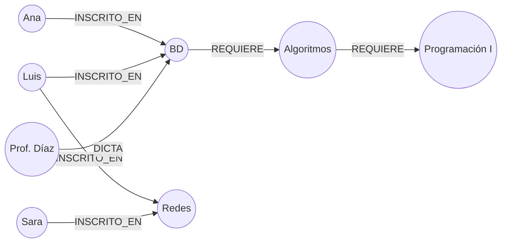

## Propósito

Reconocer las consultas para las que el modelo relacional paga un precio estructural —los recorridos de profundidad variable— y saber qué ofrece a cambio un motor de grafos.

## Resultados de aprendizaje

Al terminar podrás:

1. Modelar un dominio como grafo de propiedades.
2. Explicar por qué una reunión relacional cuesta más conforme aumenta la profundidad.
3. Traducir entre Cypher y SQL recursivo.
4. Medir la diferencia con un caso concreto y su traza de cardinalidad.
5. Decidir cuándo el grafo **no** compensa.

## Fundamentos

### El modelo de grafo de propiedades

Cuatro elementos:

- **Nodo:** entidad, con una o más etiquetas (`:Estudiante`).
- **Arista:** relación **dirigida y con tipo** (`-[:INSCRITO_EN]->`), que es un objeto de primera clase.
- **Propiedades:** pares clave-valor, tanto en nodos como en aristas.
- **Recorrido:** navegación siguiendo aristas.

La diferencia estructural con el relacional: en un grafo, la arista **es** el dato. En el relacional, la relación se reconstruye en cada consulta buscando en un índice.

### Por qué la profundidad importa

Robinson, Webber y Eifrem lo llaman *adyacencia sin índice*: cada nodo guarda punteros directos a sus vecinos. Encontrar los vecinos de un nodo es seguir punteros, con costo proporcional al número de vecinos y **no** al tamaño del grafo.

En el modelo relacional, cada nivel de profundidad es una reunión más. Con un índice B-Tree, cada reunión cuesta `O(log N)` por fila de entrada, y el número de filas de entrada se multiplica por el factor de ramificación en cada nivel.

| Profundidad | Relacional (con índice) | Grafo |
|---|---|---|
| 1 | 1 búsqueda de índice | seguir punteros |
| 2 | R búsquedas | seguir punteros |
| 3 | R² búsquedas | seguir punteros |
| k | R^(k−1) búsquedas | proporcional a los nodos visitados |

Con factor de ramificación R = 50 y profundidad 4: 125 000 búsquedas de índice contra el recorrido de la vecindad efectivamente alcanzada. La ventaja no está en el álgebra —ambos calculan lo mismo— sino en el acceso físico.

### Cypher

```cypher
MATCH (s:Estudiante {id: 11})-[:INSCRITO_EN]->(c:Curso)<-[:INSCRITO_EN]-(otro:Estudiante)
WHERE otro.id <> 11
RETURN otro.nombre, count(c) AS cursos_en_comun
ORDER BY cursos_en_comun DESC LIMIT 10
```

El patrón se **dibuja**. La misma consulta en SQL exige dos reuniones explícitas de `enrollments` consigo misma. Con profundidad variable, la diferencia se hace cualitativa:

```cypher
MATCH (a:Curso {id: 'bd'})-[:REQUIERE*1..5]->(pre:Curso)
RETURN DISTINCT pre.id
```

`*1..5` es profundidad variable. En SQL exige una CTE recursiva completa (clase 018), con su cota y su riesgo de ciclo.



## Ejemplo trabajado

Pregunta: *«todos los prerrequisitos de un curso, a cualquier profundidad, con su nivel»*.

**SQL recursivo:**

```sql
WITH RECURSIVE prereq(curso_id, nivel) AS (
    SELECT requiere_id, 1 FROM prerequisitos WHERE curso_id = 'bd'
  UNION
    SELECT p.requiere_id, pr.nivel + 1
    FROM prereq pr JOIN prerequisitos p ON p.curso_id = pr.curso_id
    WHERE pr.nivel < 10
)
SELECT curso_id, MIN(nivel) AS nivel FROM prereq GROUP BY curso_id;
```

**Cypher:**

```cypher
MATCH path = (c:Curso {id:'bd'})-[:REQUIERE*1..10]->(pre:Curso)
RETURN pre.id, min(length(path)) AS nivel
```

Ambas son correctas. La diferencia está en el trabajo físico. **Traza con factor de ramificación 3 y profundidad 5:**

```text
nivel 1:     3 prerrequisitos    ->    3 búsquedas de índice
nivel 2:     9                   ->    9
nivel 3:    27                   ->   27
nivel 4:    81                   ->   81
nivel 5:   243                   ->  243
                                    ------
total relacional:                     363 búsquedas de índice sobre `prerequisitos`
total grafo:                          363 saltos de puntero
```

Con este tamaño, **el relacional gana o empata**: 363 búsquedas de índice sobre una tabla que cabe en memoria son microsegundos, y el motor relacional está mucho más optimizado. La ventaja del grafo aparece cuando la tabla de aristas no cabe en memoria y cada búsqueda de índice se convierte en una lectura de disco.

Este matiz es el punto honesto de la clase: **el grafo no es mágicamente más rápido**. Gana cuando (a) la profundidad es alta y variable, (b) el grafo es grande y disperso, y (c) las consultas son de vecindad y no agregaciones globales.

**Dónde el grafo pierde claramente:**

| Consulta | Relacional | Grafo |
|---|---|---|
| «Promedio de notas por período» | Agregación con índice | Recorrido completo, sin ventaja |
| «Los 100 cursos con más inscritos» | `GROUP BY` + índice | Recorrido completo |
| «Insertar 10 000 inscripciones» | `COPY` masivo | Creación de nodos y aristas, más lenta |
| «Camino más corto entre dos personas» | CTE recursiva costosa | **Ventaja clara** |
| «Detección de comunidades» | Prácticamente inviable | **Ventaja clara** |

**Alternativa intermedia.** Antes de añadir un motor nuevo al sistema (clase 062), conviene comprobar si el relacional basta con el índice adecuado:

```sql
CREATE INDEX prereq_curso ON prerequisitos(curso_id, requiere_id);
```

Un índice cubriente sobre la tabla de aristas hace que la CTE recursiva no toque la tabla base. En muchos dominios de tamaño medio, eso cierra la brecha entera y ahorra un sistema que operar.

## Comparación

| Dimensión | Relacional | Grafo de propiedades |
|---|---|---|
| Relación como dato | Fila en tabla puente | Objeto de primera clase con propiedades |
| Profundidad fija | Excelente | Bien |
| Profundidad variable | CTE recursiva, con cota | Natural |
| Agregación global | Excelente | Pobre |
| Carga masiva | Excelente | Lenta |
| Restricciones declarativas | Ricas | Limitadas (unicidad, existencia) |
| Madurez operativa | Muy alta | Menor |

## Errores frecuentes

1. **Adoptar un grafo porque el dominio «tiene relaciones».** Todos los dominios las tienen; lo que importa es la profundidad variable.
2. **Modelar propiedades como nodos.** Un nodo por cada valor de atributo hincha el grafo sin aportar recorridos.
3. **Aristas sin dirección pensada.** La dirección es semántica: `REQUIERE` no es lo mismo en un sentido que en otro.
4. **Recorridos sin cota.** Un `*` sin límite superior en un grafo cíclico no termina.
5. **Usar el grafo como almacén principal de datos tabulares.** Los informes agregados serán lentos.
6. **No medir el relacional con el índice adecuado antes de migrar.**

## De la clase a la operación

Añadir un motor de grafos añade un sistema que replicar, respaldar, asegurar y mantener sincronizado con el origen. Ese costo permanente debe compararse con la ganancia medida, no con la esperada (clase 062).

## Reto de transferencia

1. Identifica en tu dominio una consulta de profundidad variable.
2. Impleméntala con CTE recursiva y mide con el índice adecuado.
3. Impleméntala en Cypher sobre los mismos datos y mide.
4. Documenta a partir de qué profundidad y qué volumen el grafo compensa, con tus cifras.

## Preguntas de evaluación

1. Explica la adyacencia sin índice y por qué el tamaño total del grafo deja de importar.
2. Calcula las búsquedas de índice de un recorrido de profundidad 6 con ramificación 10.
3. Da una consulta de tu dominio donde el grafo sería claramente peor.
4. ¿Qué garantías de integridad pierdes al mover datos de un relacional a un grafo?
