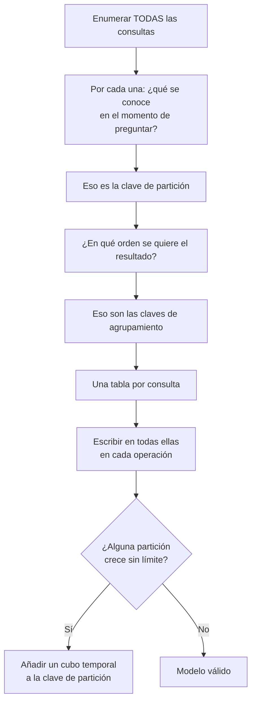

## Propósito

Modelar en un motor de columnas anchas, donde la regla se invierte: no se normaliza y luego se consulta, sino que se enumeran las consultas y se diseña una tabla por cada una.

## Resultados de aprendizaje

Al terminar podrás:

1. Distinguir clave de partición de clave de agrupamiento y su efecto físico.
2. Diseñar tablas a partir de las consultas, aceptando la duplicación.
3. Reconocer las particiones calientes y las particiones sin límite.
4. Explicar por qué CQL prohíbe deliberadamente operaciones que SQL permite.
5. Elegir el nivel de consistencia y calcular cuándo hay lectura consistente.

## Fundamentos

### La clave primaria tiene dos partes

```sql
PRIMARY KEY ( (course_id, periodo), registrada_en, student_id )
--             ^^^^^^^^^^^^^^^^^^   ^^^^^^^^^^^^^^^^^^^^^^^^^^
--             clave de partición    claves de agrupamiento
```

- **Clave de partición:** decide **en qué nodo** viven los datos, por hash. Todas las filas con la misma clave de partición están juntas en el mismo nodo.
- **Claves de agrupamiento:** deciden **el orden dentro** de la partición. Los datos se guardan físicamente ordenados por ellas.

Consecuencias que rigen todo lo demás:

1. Toda consulta eficiente **debe** especificar la clave de partición completa. Sin ella, hay que preguntar a todos los nodos.
2. Solo se puede filtrar por rango en las claves de agrupamiento y **en orden**, sin saltarse ninguna.
3. `ORDER BY` solo funciona sobre las claves de agrupamiento y en el sentido declarado.

### Lo que CQL prohíbe, y por qué

| Operación SQL | En CQL | Motivo |
|---|---|---|
| `JOIN` | No existe | Exigiría coordinación entre nodos |
| `GROUP BY` arbitrario | Muy limitado | Ídem |
| Filtrar por columna no clave | Requiere `ALLOW FILTERING` | Sería un barrido del clúster |
| Subconsultas | No existen | Ídem |
| `OR` en el `WHERE` | No | Rompería la localización por partición |

`ALLOW FILTERING` no es una opción avanzada: es una advertencia. Su presencia en código de producción indica casi siempre que el modelo no corresponde a la consulta.

Las prohibiciones son **de diseño**. Un motor que permitiera reuniones distribuidas ofrecería consultas cuyo costo crece con el tamaño del clúster, y eso es exactamente lo que Cassandra evita para garantizar latencia predecible.

### Modelado dirigido por la consulta



### Particiones: los dos fallos

**Partición caliente:** una clave concreta recibe una fracción desproporcionada del tráfico. Si `course_id` es la clave y un curso tiene el 40 % de las inscripciones, un nodo hace el 40 % del trabajo mientras los demás están ociosos.

**Partición sin límite:** una partición que crece indefinidamente. Cassandra recomienda mantenerlas por debajo de ~100 MB y ~100 000 filas. Una partición por `sensor_id` que recibe una medición por segundo supera esa cota en poco más de un día.

La solución para ambos es la misma: **añadir un cubo a la clave de partición**.

```sql
PRIMARY KEY ( (sensor_id, dia), medido_en )
```

Ahora cada partición cubre un día. El costo: una consulta de siete días debe preguntar por siete particiones, lo que el cliente resuelve con siete consultas en paralelo. Elegir el tamaño del cubo es un cálculo, no una intuición:

```text
mediciones por día = 86 400
tamaño de fila     ≈ 100 bytes
partición diaria   ≈ 8,6 MB          ← correcto
partición mensual  ≈ 260 MB          ← demasiado grande
```

### Consistencia ajustable

Cada operación elige cuántas réplicas deben responder:

| Nivel | Significado |
|---|---|
| `ONE` | Una réplica |
| `QUORUM` | ⌊RF/2⌋ + 1 |
| `LOCAL_QUORUM` | Quórum dentro del centro de datos local |
| `ALL` | Todas |

**Regla de lectura consistente:** `R + W > RF`. Con factor de replicación 3:

| W | R | ¿Lectura consistente? |
|---|---|---|
| `ONE` (1) | `ONE` (1) | No: 1+1 = 2 ≤ 3 |
| `QUORUM` (2) | `QUORUM` (2) | **Sí**: 2+2 = 4 > 3 |
| `ALL` (3) | `ONE` (1) | Sí, pero sin tolerancia a fallos en escritura |
| `ONE` (1) | `ALL` (3) | Sí, pero sin tolerancia a fallos en lectura |

`QUORUM`/`QUORUM` es el punto de equilibrio habitual: tolera la caída de una réplica en ambos sentidos. Es el mismo cálculo de quórums de Dynamo, que se retoma en la clase 043.

## Ejemplo trabajado

Consultas del dominio:

| # | Consulta | Se conoce |
|---|---|---|
| Q1 | Inscripciones de un curso, las más recientes primero | `course_id`, `periodo` |
| Q2 | Cursos de un estudiante | `student_id` |
| Q3 | Una inscripción concreta | ambos |

**Tres tablas, una por consulta:**

```sql
CREATE TABLE inscripciones_por_curso (
  course_id     text, periodo text,
  registrada_en timestamp, student_id int,
  student_nombre text, nota decimal, estado text,
  PRIMARY KEY ((course_id, periodo), registrada_en, student_id)
) WITH CLUSTERING ORDER BY (registrada_en DESC, student_id ASC);

CREATE TABLE cursos_por_estudiante (
  student_id int, periodo text,
  course_id text, course_nombre text, nota decimal, estado text,
  PRIMARY KEY ((student_id), periodo, course_id)
) WITH CLUSTERING ORDER BY (periodo DESC, course_id ASC);

CREATE TABLE inscripcion (
  student_id int, course_id text,
  periodo text, nota decimal, estado text, registrada_en timestamp,
  PRIMARY KEY ((student_id, course_id))
);
```

Los mismos datos, tres veces. **Eso es correcto en este modelo**: el almacenamiento es barato y la coordinación distribuida es cara.

**Escritura: un lote lógico.**

```sql
BEGIN BATCH
  INSERT INTO inscripciones_por_curso (course_id, periodo, registrada_en, student_id,
                                       student_nombre, estado)
         VALUES ('bd','2026-1', toTimestamp(now()), 11, 'Ana Pérez', 'activa');
  INSERT INTO cursos_por_estudiante (student_id, periodo, course_id, course_nombre, estado)
         VALUES (11, '2026-1', 'bd', 'Bases de datos', 'activa');
  INSERT INTO inscripcion (student_id, course_id, periodo, estado, registrada_en)
         VALUES (11, 'bd', '2026-1', 'activa', toTimestamp(now()));
APPLY BATCH;
```

Advertencia importante: un `BATCH` que abarca varias particiones **no** es una transacción. Garantiza que todas las sentencias se aplicarán *eventualmente*, mediante un registro de lote, y tiene un costo de coordinación notable. Los lotes son adecuados para mantener sincronizadas vistas duplicadas de una misma escritura lógica, no para lógica transaccional.

**Comprobación de la partición sin límite.** `inscripciones_por_curso` tiene una partición por `(course_id, periodo)`. Un curso masivo con 50 000 inscritos y filas de ~150 bytes da 7,5 MB: dentro de lo aceptable. Si el dominio admitiera cursos de un millón, habría que cubetear por mes de inscripción.

**Q2 con `ALLOW FILTERING`**, el antipatrón:

```sql
SELECT * FROM inscripciones_por_curso WHERE student_id = 11 ALLOW FILTERING;
```

Funciona y pregunta a **todos** los nodos, leyendo todas las particiones. Con 300 cursos, la consulta lee 300 particiones para devolver 8 filas. Por eso existe `cursos_por_estudiante`.

## Comparación

| Dimensión | Relacional | Columnas anchas |
|---|---|---|
| Punto de partida | El esquema normalizado | Las consultas |
| Duplicación | Se evita | Se busca |
| Reuniones | En el motor | En la escritura |
| Consultas no previstas | Se escriben y funcionan | Exigen tabla nueva y relleno |
| Coste de escritura | Uno | Uno por vista |
| Escalado horizontal de escritura | Limitado | Lineal |

## Errores frecuentes

1. **`ALLOW FILTERING` en producción.** Señal de modelo ausente.
2. **Particiones sin cota.** Degradan la latencia progresivamente hasta el fallo.
3. **Confundir `BATCH` con transacción.** No hay atomicidad entre particiones.
4. **Clave de partición de baja cardinalidad.** Concentra los datos en pocos nodos.
5. **Leer con `ONE` tras escribir con `ONE` y esperar consistencia.** `R + W ≤ RF`.
6. **Índices secundarios de Cassandra por costumbre.** Consultan todos los nodos; en general se prefiere una tabla nueva.

## De la clase a la operación

Una consulta no prevista en un modelo de columnas anchas no es un `SELECT` nuevo: es una tabla nueva más el relleno histórico de todos los datos existentes. Enumerar bien las consultas al principio no es burocracia, es la única forma barata de hacerlo.

## Reto de transferencia

1. Enumera las consultas de tu dominio con lo que se conoce en el momento de preguntar.
2. Diseña una tabla por consulta con sus claves de partición y agrupamiento.
3. Calcula el tamaño máximo de la partición más grande y decide el cubo si hace falta.
4. Elige `R` y `W` para dos operaciones distintas y justifica con `R + W > RF`.

## Preguntas de evaluación

1. ¿Por qué CQL prohíbe las reuniones en lugar de permitirlas y avisar de su costo?
2. Calcula el tamaño de partición de una serie tuya y elige el cubo temporal.
3. Con RF = 5, ¿qué combinaciones de `R` y `W` dan lectura consistente?
4. Da una consulta nueva sobre tu modelo y describe el trabajo completo de añadirla.
