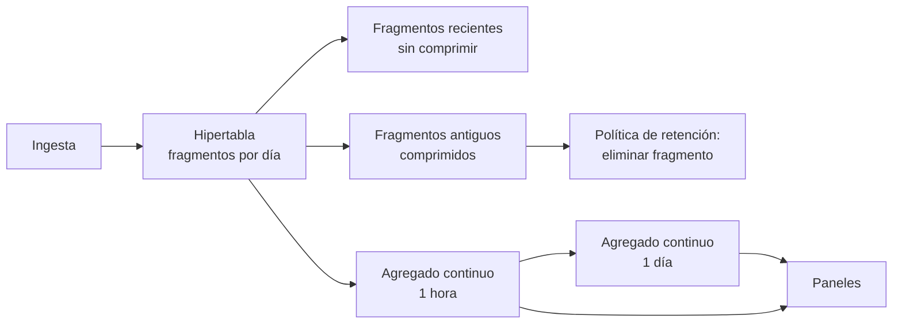

# 030 — Series temporales: cardinalidad, retención y agregados continuos

> [Programa](../../../README.md) · [Parte 06](../README.md) · [← Anterior](../../part-06-grafos-columnas-tiempo-y-busqueda/029-columnas-anchas-modelar-desde-la-consulta/README.md) · [Siguiente →](../../part-06-grafos-columnas-tiempo-y-busqueda/031-busqueda-de-texto-indice-invertido-y-relevancia/README.md)

| | |
|---|---|
| **Parte** | 06 — Grafos, columnas, tiempo y búsqueda |
| **Nivel** | Intermedio |
| **Horas estimadas** | 3 |
| **Motores** | `timescaledb`, `influxdb` |
| **Laboratorio** | [`labs/04-indexing`](../../../labs/04-indexing/README.md) |
| **Fuentes** | 3 |

**Conceptos centrales:** `cardinalidad de etiquetas` · `submuestreo` · `retención` · `agregado continuo`

---

## Propósito

Diseñar almacenamiento para datos que llegan continuamente y se consultan por ventanas de tiempo, sin que la cardinalidad de las etiquetas destruya el sistema.

## Resultados de aprendizaje

Al terminar podrás:

1. Calcular la cardinalidad de una serie y detectar cuándo es insostenible.
2. Diseñar una política de retención por niveles con su ahorro estimado.
3. Explicar qué son las hipertablas y los agregados continuos.
4. Distinguir tiempo de evento de tiempo de ingesta y sus consecuencias.
5. Elegir entre una extensión sobre el relacional y un motor especializado.

## Fundamentos

### La cardinalidad es el número que decide

Una serie temporal se identifica por su métrica y el conjunto de sus etiquetas. La **cardinalidad** es el número de combinaciones distintas:

```text
cardinalidad = ∏ (valores distintos de cada etiqueta)
```

Ejemplo de laboratorio:

```text
métrica: latencia_consulta
etiquetas: servicio(20) × endpoint(50) × region(3) × metodo(4)
cardinalidad = 20 · 50 · 3 · 4 = 12 000 series      ← perfectamente manejable
```

Ahora alguien añade `user_id` como etiqueta, con 500 000 usuarios:

```text
cardinalidad = 12 000 · 500 000 = 6 000 000 000 series
```

Seis mil millones de series. El sistema no se pone lento: **deja de funcionar**, porque los índices de series no caben en memoria.

**Regla:** una etiqueta debe tener cardinalidad acotada y conocida. Identificadores de usuario, de petición, de sesión o marcas de tiempo **nunca** son etiquetas. Si hace falta ese detalle, corresponde a un registro de eventos, no a una serie temporal.

### Tiempo de evento frente a tiempo de ingesta

- **Tiempo de evento:** cuándo ocurrió realmente.
- **Tiempo de ingesta:** cuándo llegó al sistema.

Difieren por latencia de red, colas y dispositivos que estuvieron desconectados. Las consecuencias son concretas: un agregado por hora calculado al cerrar la hora pierde los datos que lleguen tarde; si se recalcula al llegar, un panel puede mostrar cifras distintas para la misma hora en dos momentos.

Se decide explícitamente: cuánto se espera a los rezagados y qué se hace con los que llegan después de ese plazo. Es el mismo problema de las marcas de agua de la clase 057.

### Retención por niveles

Nadie necesita resolución de un segundo sobre datos de hace dos años. La política habitual:

| Antigüedad | Resolución | Tamaño relativo |
|---|---|---|
| 0 – 7 días | 1 s (bruto) | 100 % |
| 7 – 90 días | 1 min | 1,7 % |
| 90 días – 2 años | 1 h | 0,03 % |
| > 2 años | 1 día | 0,001 % |

**Cálculo real** para 12 000 series a 1 medición/s y 16 bytes por punto:

```text
bruto 1 año:   12 000 · 31 536 000 · 16 B  ≈  6,0 PB      ← inviable
con niveles:
  7 días a 1s:   12 000 ·   604 800 · 16 B ≈  116 GB
  83 días a 1m:  12 000 ·   119 520 · 16 B ≈   23 GB
  275 días a 1h: 12 000 ·     6 600 · 16 B ≈  1,3 GB
  total                                     ≈  140 GB
```

De 6 petabytes a 140 gigabytes conservando lo que se consulta de verdad. La compresión específica de series (delta-of-delta para marcas de tiempo, XOR para valores) reduce eso otro orden de magnitud.

### Hipertablas y agregados continuos

TimescaleDB extiende PostgreSQL: una **hipertabla** se ve como una tabla y por dentro es un conjunto de fragmentos particionados por tiempo.

```sql
CREATE TABLE mediciones (
  medido_en TIMESTAMPTZ NOT NULL,
  sensor_id INTEGER     NOT NULL,
  valor     DOUBLE PRECISION NOT NULL
);
SELECT create_hypertable('mediciones', 'medido_en', chunk_time_interval => INTERVAL '1 day');
```

Ventajas de fragmentar por tiempo:

- Una consulta con filtro temporal descarta fragmentos enteros sin mirarlos (poda).
- Borrar datos antiguos es eliminar fragmentos, no un `DELETE` masivo que deja filas muertas.
- Los fragmentos antiguos se comprimen; los recientes se mantienen sin comprimir para escritura rápida.

```sql
ALTER TABLE mediciones SET (timescaledb.compress,
                            timescaledb.compress_segmentby = 'sensor_id');
SELECT add_compression_policy('mediciones', INTERVAL '7 days');
SELECT add_retention_policy('mediciones',   INTERVAL '2 years');
```

**Agregado continuo:** vista materializada que se refresca de forma incremental, solo sobre los fragmentos que cambiaron.

```sql
CREATE MATERIALIZED VIEW mediciones_hora
WITH (timescaledb.continuous) AS
SELECT time_bucket('1 hour', medido_en) AS hora,
       sensor_id, avg(valor) AS media, max(valor) AS maximo, count(*) AS n
FROM mediciones GROUP BY hora, sensor_id;

SELECT add_continuous_aggregate_policy('mediciones_hora',
  start_offset => INTERVAL '3 hours',   -- reprocesa 3 h: margen para rezagados
  end_offset   => INTERVAL '10 minutes',
  schedule_interval => INTERVAL '10 minutes');
```

El `start_offset` **es** la decisión sobre los rezagados: tres horas de margen antes de considerar cerrada una ventana.



## Ejemplo trabajado

Dominio: 800 sensores, una medición cada 10 s, consultas de panel sobre las últimas 24 h y comparativas anuales.

```text
puntos por día = 800 · 8 640 = 6 912 000
puntos por año ≈ 2 523 millones
```

**Sin diseño:** una tabla plana con índice en `(sensor_id, medido_en)`. La consulta de panel de 24 h sobre un sensor lee 8 640 filas: rápido. La comparativa anual sobre todos los sensores lee 2 523 millones: minutos, y el índice pesa más que los datos.

**Con hipertabla y agregados:**

| Consulta | Sobre | Filas leídas |
|---|---|---:|
| Panel 24 h, un sensor, bruto | hipertabla, 1 fragmento | 8 640 |
| Panel 30 días, un sensor | `mediciones_hora` | 720 |
| Comparativa anual, todos | `mediciones_dia` | 292 000 |
| Comparativa anual, bruto | hipertabla | 2 523 000 000 |

La última fila es la que justifica todo lo anterior: **cuatro órdenes de magnitud** por consultar el agregado adecuado.

**El error de cardinalidad, cuantificado.** Si se añadiera `numero_de_serie_del_lote` como etiqueta, con 200 000 valores distintos al año:

```text
antes:  800 series
después: 800 · 200 000 = 160 000 000 series
```

El índice de series pasa de kilobytes a decenas de gigabytes solo en metadatos. El dato del lote debe ir como **campo** (columna de valor), no como etiqueta: se guarda y se consulta, pero no multiplica el número de series.

Esta distinción entre etiqueta (indexada, define la serie) y campo (dato, no indexado) es la decisión de modelado central en InfluxDB y equivalentes.

## Comparación

| Opción | Ingesta | Consulta por ventana | Operación | Cuándo |
|---|---|---|---|---|
| PostgreSQL con índice | Buena | Degrada con el volumen | Simple | < 100 M puntos |
| TimescaleDB | Muy buena | Excelente con agregados | Simple: es PostgreSQL | Hasta miles de millones |
| InfluxDB | Excelente | Excelente | Sistema aparte | Métricas puras |
| ClickHouse | Excelente | Excelente | Sistema aparte | Analítica + series |
| Archivos Parquet + DuckDB | Por lotes | Muy buena | Mínima | Histórico frío |

## Errores frecuentes

1. **Etiquetas de cardinalidad no acotada.** El fallo más grave y el más común.
2. **Guardar todo en resolución máxima para siempre.** El costo crece linealmente y el valor no.
3. **`DELETE` masivo para purgar.** Deja filas muertas; hay que eliminar fragmentos.
4. **Ignorar los datos rezagados.** Los agregados quedan incompletos sin que nadie lo note.
5. **Consultar los datos brutos desde el panel.** Existiendo el agregado, es trabajo desperdiciado.
6. **Confundir etiqueta con campo.** Determina si el dato multiplica la cardinalidad.

## De la clase a la operación

El fallo por cardinalidad no avisa: el sistema funciona bien hasta que una versión nueva del emisor añade una etiqueta y, en horas, el almacén se satura. Un límite de cardinalidad vigilado y con alerta es tan necesario como el de espacio en disco.

## Reto de transferencia

1. Calcula la cardinalidad de una serie real tuya y la que tendría al añadir una etiqueta candidata.
2. Diseña la política de retención por niveles y calcula el ahorro en bytes.
3. Implementa una hipertabla con agregado continuo y compara la consulta anual antes y después.
4. Define el margen para rezagados y justifícalo con la latencia real de tu ingesta.

## Preguntas de evaluación

1. ¿Por qué un identificador de usuario nunca debe ser etiqueta?
2. Calcula el almacenamiento anual de tu serie con y sin retención por niveles.
3. Explica la diferencia entre tiempo de evento y de ingesta con un caso de tu sistema.
4. ¿Qué ventaja tiene eliminar un fragmento frente a un `DELETE` con filtro temporal?

---

## Laboratorio

```bash
python scripts/validate_repository.py
python labs/04-indexing/run_lab.py
```

Guarda como evidencia la salida completa, la versión del motor y la semilla o
los parámetros usados. Una captura sin comando no es evidencia: no se puede
repetir.

## Evaluación

| Criterio | Peso | Qué se comprueba |
|---|---:|---|
| Comprensión conceptual | 25 % | Explica el mecanismo, no solo el resultado |
| Ejecución reproducible | 25 % | Otra persona obtiene lo mismo con las instrucciones dadas |
| Interpretación basada en evidencia | 25 % | Cada conclusión se apoya en una salida o una medición |
| Límites y riesgos declarados | 25 % | Dice qué no demuestra el ejercicio y qué faltaría en producción |

La clase se da por superada cuando la respuesta explica el mecanismo, muestra
la salida que la respalda y declara al menos un límite del ejercicio.

## Fuentes de esta clase

Todo lo afirmado arriba procede de estas obras. Los identificadores viven en
[`catalog/sources.json`](../../../catalog/sources.json) y el estado de los
enlaces se comprueba con `python scripts/check_external_links.py`.

- **Timescale, Inc.** (2026). [TimescaleDB Documentation](https://docs.timescale.com/).  
  Hipertablas, compresión y agregados continuos sobre PostgreSQL.
- **InfluxData** (2026). [InfluxDB Documentation](https://docs.influxdata.com/).  
  Modelo de medición, etiquetas y campos para series temporales.
- **Martin Kleppmann** (2017). [Designing Data-Intensive Applications](https://dataintensive.net/). O'Reilly. ISBN 978-1-4493-7332-0.  
  Referencia central del programa para replicación, partición, transacciones distribuidas y streaming.

---

> [Programa](../../../README.md) · [Parte 06](../README.md) · [← Anterior](../../part-06-grafos-columnas-tiempo-y-busqueda/029-columnas-anchas-modelar-desde-la-consulta/README.md) · [Siguiente →](../../part-06-grafos-columnas-tiempo-y-busqueda/031-busqueda-de-texto-indice-invertido-y-relevancia/README.md)
