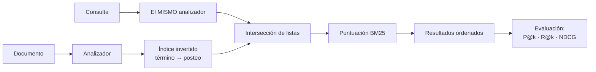

# 031 — Búsqueda de texto: índice invertido, análisis y relevancia

> [Programa](../../../README.md) · [Parte 06](../README.md) · [← Anterior](../../part-06-grafos-columnas-tiempo-y-busqueda/030-series-temporales-cardinalidad-y-retencion/README.md) · [Siguiente →](../../part-06-grafos-columnas-tiempo-y-busqueda/032-analitica-columnar-y-vectorizacion/README.md)

Parte 06 — Grafos, columnas, tiempo y búsqueda · Intermedio ·
3 horas estimadas · motores `opensearch`, `postgresql` · laboratorio
[`labs/06-vector-search`](../../../labs/06-vector-search/README.md) · 3 fuentes.

**Conceptos centrales:** `índice invertido` · `analizador` · `TF-IDF` · `BM25` · `precisión y exhaustividad`

**En este caso se comparan 7 motores**: 5 lo resuelven (4 con el resultado comprobado por máquina) y 2 no, con el motivo escrito.

---

## Propósito

Entender cómo se busca texto: qué es un índice invertido, qué hace el analizador y cómo se ordena por relevancia. Es también la base de comparación honesta para la búsqueda vectorial de la parte 12.

## Resultados de aprendizaje

Al terminar podrás:

1. Construir a mano un índice invertido y explicar su costo.
2. Describir la cadena de análisis y por qué debe ser la misma al indexar y al consultar.
3. Calcular una puntuación BM25 y explicar cada uno de sus términos.
4. Medir relevancia con precisión, exhaustividad y NDCG.
5. Decidir entre la búsqueda de texto del motor relacional y un motor de búsqueda dedicado.

## Fundamentos

### El índice invertido

Un índice normal va de documento a contenido. El **invertido** va de término a documentos:

```text
documentos:
  d1 "Bases de datos relacionales"
  d2 "Bases de datos distribuidas"
  d3 "Sistemas distribuidos"

índice invertido (tras analizar):
  base        -> d1, d2
  dato        -> d1, d2
  relacional  -> d1
  distribuido -> d2, d3
  sistema     -> d3
```

Buscar «datos distribuidos» es intersecar las listas de `dato` y `distribuido` → `{d2}`. La operación es una intersección de listas ordenadas: costo proporcional a la longitud de la lista más corta, no al número de documentos.

Cada término guarda además la frecuencia y las posiciones dentro del documento, lo que permite puntuar y buscar frases exactas.

### El analizador

Convierte texto en términos, y **debe ser el mismo al indexar y al consultar**. Si no lo es, se busca algo que nunca se indexó.

```text
"Las Bases de Datos Relacionales"
  → normalización de caracteres  → "Las Bases de Datos Relacionales"
  → segmentación                 → [Las, Bases, de, Datos, Relacionales]
  → minúsculas                   → [las, bases, de, datos, relacionales]
  → vacías (español)             → [bases, datos, relacionales]
  → sin acentos                  → [bases, datos, relacionales]
  → lematización (español)       → [base, dato, relacional]
```

Cada paso es una decisión con consecuencias. Quitar acentos hace que «canción» encuentre «cancion», y también que «peso» encuentre «pesó». Eliminar palabras vacías ahorra espacio y hace imposible buscar la frase «ser o no ser».

### BM25

Robertson y Zaragoza formalizan la función de ranking que sigue siendo la referencia:

```text
score(D,Q) = Σ_{t∈Q}  IDF(t) ·  ( f(t,D) · (k1+1) ) / ( f(t,D) + k1·(1 - b + b·|D|/avgdl) )

IDF(t) = ln( (N - n(t) + 0,5) / (n(t) + 0,5) + 1 )
```

Los tres componentes, en lenguaje llano:

| Componente | Qué expresa |
|---|---|
| `IDF(t)` | Un término raro discrimina más que uno común |
| `f(t,D)` con saturación | Repetir un término 20 veces no vale 20 veces más que una |
| `\|D\|/avgdl` con `b` | Un documento largo tiene más ocurrencias por azar: se penaliza |

Valores habituales: `k1 = 1,2` (saturación), `b = 0,75` (normalización por longitud).

La saturación es lo que distingue BM25 de TF-IDF puro y lo que impide el relleno de palabras clave.

### Medir relevancia

| Métrica | Qué mide | Cuándo usarla |
|---|---|---|
| Precisión@k | De los k devueltos, cuántos son relevantes | El usuario mira solo los primeros |
| Exhaustividad@k | De los relevantes, cuántos aparecen en los k | Cobertura (legal, cumplimiento) |
| MRR | Posición del primer resultado relevante | Hay una única respuesta correcta |
| NDCG@k | Ganancia acumulada descontada por posición | Relevancia graduada, no binaria |

Sin un conjunto de consultas con juicios de relevancia, «mejoré la búsqueda» es una opinión. Construir ese conjunto —30 a 100 consultas reales con sus resultados esperados— es el trabajo que hace evaluable todo lo demás, y es el mismo requisito de la clase 061.



## Ejemplo trabajado

Colección de 3 cursos, buscamos «bases distribuidas».

```text
N = 3 documentos, longitud media avgdl = 3,33 términos
d1 [base, dato, relacional]     |d1| = 3
d2 [base, dato, distribuido]    |d2| = 3
d3 [sistema, distribuido]       |d3| = 2
```

**IDF:**

```text
n(base)        = 2  →  IDF = ln((3-2+0,5)/(2+0,5) + 1) = ln(1,6)  = 0,470
n(distribuido) = 2  →  IDF = 0,470
```

**Puntuación de d2** (`k1=1,2`, `b=0,75`, `f=1` para ambos términos, `|d2|=3`):

```text
denominador = 1 + 1,2·(1 - 0,75 + 0,75·3/3,33) = 1 + 1,2·(0,25 + 0,676) = 2,111
por término = 0,470 · (1 · 2,2) / 2,111 = 0,490
score(d2)   = 0,490 + 0,490 = 0,980
```

**Puntuación de d3** (solo contiene `distribuido`, `|d3|=2`):

```text
denominador = 1 + 1,2·(0,25 + 0,75·2/3,33) = 1 + 1,2·(0,25 + 0,450) = 1,840
score(d3)   = 0,470 · 2,2 / 1,840 = 0,562
```

Orden final: **d2 (0,980) > d3 (0,562) > d1 (0,470)**. d2 gana por contener ambos términos; d3 supera a d1 pese a tener un solo término coincidente porque es más corto y ese término aporta lo mismo.

**En un motor real:**

```json
POST /cursos/_search
{ "query": { "multi_match": {
      "query": "bases distribuidas",
      "fields": ["nombre^3", "descripcion"],
      "type": "best_fields" } },
  "highlight": { "fields": { "descripcion": {} } } }
```

`nombre^3` triplica el peso del título: una decisión de negocio expresada en el ranking.

**Alternativa en PostgreSQL**, que evita añadir un sistema:

```sql
ALTER TABLE courses ADD COLUMN busqueda tsvector
  GENERATED ALWAYS AS (
    setweight(to_tsvector('spanish', coalesce(nombre,'')), 'A') ||
    setweight(to_tsvector('spanish', coalesce(descripcion,'')), 'B')
  ) STORED;
CREATE INDEX courses_busqueda ON courses USING gin (busqueda);

SELECT id, nombre, ts_rank(busqueda, query) AS score
FROM courses, plainto_tsquery('spanish', 'bases distribuidas') query
WHERE busqueda @@ query ORDER BY score DESC LIMIT 10;
```

**Comparación honesta:**

| Capacidad | PostgreSQL `tsvector` | OpenSearch |
|---|---|---|
| Índice invertido | Sí (GIN) | Sí |
| Lematización en español | Sí | Sí, con más opciones |
| BM25 | No: `ts_rank` es más simple | Sí |
| Tolerancia a erratas | Con `pg_trgm` | Nativa (*fuzzy*) |
| Sugerencias y autocompletado | Manual | Nativo |
| Facetas | `GROUP BY` | Nativas |
| Escala horizontal | Limitada | Diseñada para ello |
| Sistemas que operar | **Cero adicionales** | Uno más |

Criterio: si la búsqueda es una funcionalidad secundaria sobre menos de unos millones de documentos, PostgreSQL basta y ahorra un sistema entero. Si la búsqueda **es** el producto, el motor dedicado se justifica.

## Comparación

| Necesidad | Herramienta |
|---|---|
| `LIKE 'prefijo%'` | Índice B-Tree ordinario |
| `LIKE '%infijo%'` | Trigramas (`pg_trgm`) |
| Palabras con lematización | `tsvector` o motor de búsqueda |
| Ranking por relevancia | BM25 (motor dedicado) |
| Erratas y sinónimos | Motor dedicado |
| Similitud semántica | Vectores (parte 12) |

## Errores frecuentes

1. **Analizadores distintos al indexar y al consultar.** Cero resultados sin ningún error.
2. **`LIKE '%x%'` sobre tablas grandes.** Barrido completo; ningún B-Tree ayuda.
3. **Ajustar pesos sin conjunto de evaluación.** Se mejora una consulta y se empeoran diez.
4. **Eliminar palabras vacías y luego querer buscar frases.**
5. **Idioma del analizador equivocado.** El lematizador inglés destroza el español.
6. **Confundir puntuación con probabilidad.** BM25 no está acotada ni es comparable entre consultas.

## De la clase a la operación

Los cambios de relevancia se hacen a ciegas si no hay medición: alguien se queja, se ajusta un peso, se rompe otra cosa y nadie lo sabe. El conjunto de consultas juzgadas es el activo que convierte la búsqueda en ingeniería.

## Reto de transferencia

1. Construye a mano el índice invertido de 5 documentos de tu dominio.
2. Calcula BM25 para una consulta de dos términos y ordena los resultados.
3. Implementa la búsqueda en PostgreSQL y en OpenSearch sobre los mismos datos.
4. Construye 20 consultas juzgadas y mide P@5 y NDCG@10 en ambos.

## Preguntas de evaluación

1. ¿Por qué la saturación de la frecuencia de término mejora el ranking frente a TF-IDF puro?
2. Da un caso donde eliminar acentos empeore los resultados en español.
3. Calcula el IDF de un término presente en 999 de 1 000 documentos e interpreta el valor.
4. Justifica con cifras si tu caso necesita un motor de búsqueda dedicado.

---

## 🌐 El mismo problema en cada motor

**Caso:** Qué documentos hablan de bases de datos, buscando por palabras y no por subcadenas

Buscar texto no es `LIKE '%bases%'`. Un índice invertido no guarda cadenas:
guarda **términos** —después de partir el texto, pasarlo a minúsculas,
quitar acentos y reducir las palabras a su raíz— y para cada término, la
lista de documentos donde aparece. Por eso «Bases» encuentra «bases», por
eso «datos» encuentra «dato», y por eso `LIKE` no hace ninguna de las dos
cosas.

El caso busca los documentos que hablan de bases **y** de datos entre tres
títulos, y los devuelve ordenados por identificador. La relevancia —qué
documento va primero— se discute en cada motor, pero no se compara: cada uno
la calcula con su propia fórmula, y presentar esas puntuaciones como si
fueran equivalentes sería falso.

Salida esperada, idéntica en todos los motores que lo resuelven:

| documento |
|---|
| `d1` |
| `d2` |

El contrato vive en [`motores.yaml`](motores.yaml) y lo comprueba
`python scripts/verificar_equivalencia.py --clase 031`: 4 de
las 5 implementaciones se ejecutan de verdad y su
resultado se compara con esa tabla; el resto se declara como material revisado,
no ejecutado.

| Motor | ¿Resuelve el caso? | Nivel de prueba | Código | Fuente |
|---|---|---|---|---|
| OpenSearch | sí | declarado | [código](implementaciones/opensearch/consulta.json) | [doc oficial](https://docs.opensearch.org/latest/query-dsl/full-text/match/) |
| PostgreSQL | sí | servicio | [código](implementaciones/postgresql/consulta.sql) | [doc oficial](https://www.postgresql.org/docs/current/textsearch-intro.html) |
| SQLite | sí | núcleo | [código](implementaciones/sqlite/consulta.sql) | [doc oficial](https://sqlite.org/fts5.html) |
| MySQL | sí | servicio | [código](implementaciones/mysql/consulta.sql) | [doc oficial](https://dev.mysql.com/doc/refman/8.4/en/fulltext-search.html) |
| MongoDB | sí | servicio | [código](implementaciones/mongodb/consulta.js) | [doc oficial](https://www.mongodb.com/docs/manual/core/indexes/index-types/index-text/) |
| DuckDB | **no** | — | — | [doc oficial](https://duckdb.org/docs/stable/extensions/full_text_search.html) |
| Redis | **no** | — | — | [doc oficial](https://redis.io/docs/latest/commands/sinter/) |

### Los que resuelven el caso

#### OpenSearch · [`implementaciones/opensearch/consulta.json`](implementaciones/opensearch/consulta.json)

⚪ **declarado** — se revisa a mano contra la documentación citada; la máquina no lo ejecuta

```json
{
  "_comentario": [
    "motor: opensearch",
    "doc: https://docs.opensearch.org/latest/query-dsl/full-text/match/",
    "nota: implementacion declarada. Lo que distingue a un motor de busqueda de",
    "una funcion de busqueda esta en el bloque `settings`: el analizador es",
    "configurable —minusculas, sin acentos, raices en espanol, palabras vacias—",
    "y de esa configuracion depende que «Bases» encuentre «bases» y que «datos»",
    "encuentre «dato». Cambiar el analizador obliga a REINDEXAR: el indice",
    "guarda terminos ya analizados, no el texto original.",
    "Se aplica con:  PUT /documentos   (settings + mappings)",
    "y se consulta:  POST /documentos/_search   (bloque `busqueda`)"
  ],

  "settings": {
    "analysis": {
      "analyzer": {
        "es_personalizado": {
          "tokenizer": "standard",
          "filter": ["lowercase", "asciifolding", "spanish_stop", "spanish_stemmer"]
        }
      },
      "filter": {
        "spanish_stop": { "type": "stop", "stopwords": "_spanish_" },
        "spanish_stemmer": { "type": "stemmer", "language": "light_spanish" }
      }
    }
  },

  "mappings": {
    "properties": {
      "titulo": { "type": "text", "analyzer": "es_personalizado" }
    }
  },

  "busqueda": {
    "_nota": "operator AND exige los dos terminos; sin el, basta con uno.",
    "query": {
      "match": { "titulo": { "query": "bases datos", "operator": "and" } }
    },
    "sort": ["_id"],
    "_id_de_los_resultados_esperados": ["d1", "d2"]
  }
}
```

- **Por qué sí:** Es un motor de búsqueda entero, no una función: analizadores por idioma, sinónimos, corrección de errores tipográficos, resaltado, facetas y puntuación BM25 ajustable. Cuando la búsqueda **es** el producto, esto es lo que hace falta.
- **Por qué no:** Es un sistema más que operar, y el índice va por detrás del origen: es un almacén secundario, no la verdad. Reindexar cuando cambia el analizador es una operación de horas sobre volúmenes reales.
- 📄 Documentación oficial: <https://docs.opensearch.org/latest/query-dsl/full-text/match/>

#### PostgreSQL · [`implementaciones/postgresql/consulta.sql`](implementaciones/postgresql/consulta.sql)

✅ **verificado** — se ejecuta contra el motor real levantado con `docker compose`

```sql
-- motor: postgresql
-- doc: https://www.postgresql.org/docs/current/textsearch-intro.html
-- nota: la columna tsvector es GENERADA, asi que se mantiene sola y el indice
--       GIN nunca va por detras. Es la diferencia con un motor de busqueda
--       aparte: aqui el indice se actualiza DENTRO de la misma transaccion que
--       el dato.
--       Para ver que guarda de verdad el indice:
--         SELECT to_tsvector('spanish', 'Bases de datos distribuidas');
--         -> 'bas':1 'dat':3 'distribu':4    (raices, sin palabras vacias)

-- === preparacion ===
DROP TABLE IF EXISTS documentos;

CREATE TABLE documentos (
    id      text PRIMARY KEY,
    titulo  text NOT NULL,
    buscado tsvector GENERATED ALWAYS AS (to_tsvector('spanish', titulo)) STORED
);
CREATE INDEX documentos_buscado ON documentos USING GIN (buscado);

INSERT INTO documentos (id, titulo) VALUES
    ('d1', 'Introduccion a las bases de datos relacionales'),
    ('d2', 'Bases de datos distribuidas y replicacion'),
    ('d3', 'Redes de computadores y protocolos');

-- === consulta ===
SELECT id AS documento
FROM documentos
WHERE buscado @@ to_tsquery('spanish', 'bases & datos')
ORDER BY id;
```

- **Por qué sí:** `tsvector` y `tsquery` con índice GIN dan búsqueda por términos, con raíces y palabras vacías por idioma, **dentro de la misma transacción** que los datos: el índice nunca va por detrás, y se puede combinar con cualquier filtro del esquema.
- **Por qué no:** La relevancia (`ts_rank`) es mucho más pobre que BM25 y no tiene corrección de errores ni sinónimos sin trabajo adicional. Y el `tsvector` hay que mantenerlo: como columna generada, o el índice se calcula en cada consulta.
- 📄 Documentación oficial: <https://www.postgresql.org/docs/current/textsearch-intro.html>

#### SQLite · [`implementaciones/sqlite/consulta.sql`](implementaciones/sqlite/consulta.sql)

✅ **verificado** — se ejecuta en CI sin servicios

```sql
-- motor: sqlite
-- doc: https://sqlite.org/fts5.html
-- nota: FTS5 es un indice invertido completo dentro del archivo. La consulta
--       'bases datos' significa «los dos terminos», no la subcadena: por eso
--       encuentra «Bases» con mayuscula y no encuentra d3, que no habla de
--       datos. Un LIKE '%bases%' fallaria en ambas cosas.

-- === preparacion ===
CREATE VIRTUAL TABLE documentos USING fts5(id UNINDEXED, titulo);

INSERT INTO documentos (id, titulo) VALUES
    ('d1', 'Introduccion a las bases de datos relacionales'),
    ('d2', 'Bases de datos distribuidas y replicacion'),
    ('d3', 'Redes de computadores y protocolos');

-- === consulta ===
SELECT id AS documento
FROM documentos
WHERE documentos MATCH 'bases datos'
ORDER BY id;
```

- **Por qué sí:** FTS5 es un índice invertido completo dentro de un archivo: tokenización, operadores booleanos, frases y puntuación BM25. Para buscar en la documentación de una aplicación de escritorio o en un teléfono, sobra.
- **Por qué no:** La tabla FTS es una tabla aparte que hay que mantener sincronizada con la real —con disparadores o con las tablas `external content`—, y el analizador por omisión no quita acentos salvo que se active `remove_diacritics`.
- 📄 Documentación oficial: <https://sqlite.org/fts5.html>

#### MySQL · [`implementaciones/mysql/consulta.sql`](implementaciones/mysql/consulta.sql)

✅ **verificado** — se ejecuta contra el motor real levantado con `docker compose`

```sql
-- motor: mysql
-- doc: https://dev.mysql.com/doc/refman/8.4/en/fulltext-search.html
-- nota: se usa el MODO BOOLEANO a proposito. En modo de lenguaje natural,
--       InnoDB descarta las palabras que aparecen en mas del 50 % de las filas,
--       asi que con tres documentos «datos» se ignoraria y la busqueda
--       devolveria cualquier cosa. Es la sorpresa clasica de las pruebas
--       pequenas.

-- === preparacion ===
DROP TABLE IF EXISTS documentos;

CREATE TABLE documentos (
    id     VARCHAR(10) PRIMARY KEY,
    titulo TEXT NOT NULL,
    FULLTEXT KEY ft_titulo (titulo)
) ENGINE=InnoDB;

INSERT INTO documentos (id, titulo) VALUES
    ('d1', 'Introduccion a las bases de datos relacionales'),
    ('d2', 'Bases de datos distribuidas y replicacion'),
    ('d3', 'Redes de computadores y protocolos');

-- === consulta ===
SELECT id AS documento
FROM documentos
WHERE MATCH(titulo) AGAINST('+bases +datos' IN BOOLEAN MODE)
ORDER BY id;
```

- **Por qué sí:** InnoDB tiene índices `FULLTEXT` con modo booleano y de lenguaje natural, así que la búsqueda vive junto a los datos transaccionales sin añadir un sistema.
- **Por qué no:** El mínimo de longitud de palabra por omisión es de 3 caracteres, y en modo de lenguaje natural las palabras presentes en más de la mitad de las filas se ignoran: con pocos documentos, una búsqueda razonable puede devolver cero resultados sin explicación aparente.
- 📄 Documentación oficial: <https://dev.mysql.com/doc/refman/8.4/en/fulltext-search.html>

#### MongoDB · [`implementaciones/mongodb/consulta.js`](implementaciones/mongodb/consulta.js)

✅ **verificado** — se ejecuta contra el motor real levantado con `docker compose`

```javascript
// motor: mongodb
// doc: https://www.mongodb.com/docs/manual/core/indexes/index-types/index-text/
// nota: solo se permite UN indice de texto por coleccion, y el idioma decide
//       las raices y las palabras vacias. La puntuacion se expone con
//       $meta: "textScore", y es rudimentaria comparada con BM25.

// === preparacion ===
db.documentos.drop();
db.documentos.insertMany([
  { _id: "d1", titulo: "Introduccion a las bases de datos relacionales" },
  { _id: "d2", titulo: "Bases de datos distribuidas y replicacion" },
  { _id: "d3", titulo: "Redes de computadores y protocolos" },
]);
db.documentos.createIndex({ titulo: "text" }, { default_language: "spanish" });

// === consulta ===
// Las comillas fuerzan que AMBOS terminos esten presentes; sin ellas, $text
// devuelve los documentos que tengan CUALQUIERA de los dos.
db.documentos
  .find({ $text: { $search: '"bases" "datos"' } }, { _id: 1 })
  .sort({ _id: 1 })
  .forEach((d) => print(d._id));
```

- **Por qué sí:** Un índice de texto cubre la búsqueda por términos con raíces por idioma sin salir de la base, y `$meta: "textScore"` expone la puntuación para ordenar.
- **Por qué no:** Solo se permite **un** índice de texto por colección, no hay control sobre el analizador y la puntuación es rudimentaria. Para búsqueda seria, su propia oferta es Atlas Search, que por debajo es Lucene: es decir, otro motor.
- 📄 Documentación oficial: <https://www.mongodb.com/docs/manual/core/indexes/index-types/index-text/>

### Los que no resuelven este caso — y qué se hace en su lugar

Descartar un motor con un argumento es tan formativo como usarlo. Ninguna de estas filas dice que el motor sea peor: dice que este problema no es el suyo.

| Motor | Por qué no | Qué se hace en su lugar | Fuente |
|---|---|---|---|
| DuckDB | Tiene una extensión de búsqueda de texto, pero hay que instalarla desde la red en tiempo de ejecución: incluirla como motor de núcleo haría que la verificación del repositorio dependiera de una descarga, y eso rompería la regla de que el núcleo se ejecuta en cualquier máquina. | Para el trabajo analítico sobre texto que sí encaja aquí —contar términos, medir cobertura de un corpus— bastan las funciones de cadena y `UNNEST` sobre las palabras. | [doc](https://duckdb.org/docs/stable/extensions/full_text_search.html) |
| Redis | El servidor base no busca dentro de los valores: son opacos. Sin el módulo de búsqueda, la única opción sería traerse los documentos y filtrarlos en el cliente. | Mantener a mano el índice invertido —un conjunto por término con los identificadores— y cruzarlo con `SINTER`. Se consigue el «y» booleano; no hay raíces, ni relevancia, ni frases. | [doc](https://redis.io/docs/latest/commands/sinter/) |

---

## Laboratorio

```bash
python scripts/validate_repository.py
python labs/06-vector-search/run_vector_lab.py
```

Guarda como evidencia la salida completa, la versión del motor y la semilla o
los parámetros usados. Una captura sin comando no es evidencia: no se puede
repetir.

## Evaluación

| Criterio | Peso | Qué se comprueba |
|---|---:|---|
| Comprensión conceptual | 25 % | Explica el mecanismo, no solo el resultado |
| Ejecución reproducible | 25 % | Otra persona obtiene lo mismo con las instrucciones dadas |
| Interpretación basada en evidencia | 25 % | Cada conclusión se apoya en una salida o una medición |
| Límites y riesgos declarados | 25 % | Dice qué no demuestra el ejercicio y qué faltaría en producción |

La clase se da por superada cuando la respuesta explica el mecanismo, muestra
la salida que la respalda y declara al menos un límite del ejercicio.

## Fuentes de esta clase

Todo lo afirmado arriba procede de estas obras. Los identificadores viven en
[`catalog/sources.json`](../../../catalog/sources.json) y el estado de los
enlaces se comprueba con `python scripts/check_external_links.py`.

- **Stephen Robertson, Hugo Zaragoza** (2009). [The Probabilistic Relevance Framework: BM25 and Beyond](https://www.staff.city.ac.uk/~sbrp622/papers/foundations_bm25_review.pdf). Foundations and Trends in Information Retrieval 3(4). DOI [10.1561/1500000019](https://doi.org/10.1561/1500000019).  
  Función de ranking léxico contra la que se compara toda búsqueda semántica.
- **OpenSearch Project** (2026). [OpenSearch Documentation](https://docs.opensearch.org/latest/).  
  Índice invertido, analizadores, relevancia y búsqueda k-NN.
- **PostgreSQL Global Development Group** (2026). [PostgreSQL Documentation](https://www.postgresql.org/docs/current/).  
  Documentación de referencia del motor relacional principal del programa.

---

> [Programa](../../../README.md) · [Parte 06](../README.md) · [← Anterior](../../part-06-grafos-columnas-tiempo-y-busqueda/030-series-temporales-cardinalidad-y-retencion/README.md) · [Siguiente →](../../part-06-grafos-columnas-tiempo-y-busqueda/032-analitica-columnar-y-vectorizacion/README.md)
