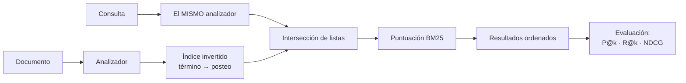

# 031 — Búsqueda de texto: índice invertido, análisis y relevancia

> [Programa](../../../README.md) · [Parte 06](../README.md) · [← Anterior](../../part-06-grafos-columnas-tiempo-y-busqueda/030-series-temporales-cardinalidad-y-retencion/README.md) · [Siguiente →](../../part-06-grafos-columnas-tiempo-y-busqueda/032-analitica-columnar-y-vectorizacion/README.md)

| | |
|---|---|
| **Parte** | 06 — Grafos, columnas, tiempo y búsqueda |
| **Nivel** | Intermedio |
| **Horas estimadas** | 3 |
| **Motores** | `opensearch`, `postgresql` |
| **Laboratorio** | [`labs/06-vector-search`](../../../labs/06-vector-search/README.md) |
| **Fuentes** | 3 |

**Conceptos centrales:** `índice invertido` · `analizador` · `TF-IDF` · `BM25` · `precisión y exhaustividad`

---

## Propósito

Entender cómo se busca texto: qué es un índice invertido, qué hace el analizador y cómo se ordena por relevancia. Es también la base de comparación honesta para la búsqueda vectorial de la parte 12.

## Resultados de aprendizaje

Al terminar podrás:

1. Construir a mano un índice invertido y explicar su costo.
2. Describir la cadena de análisis y por qué debe ser la misma al indexar y al consultar.
3. Calcular una puntuación BM25 y explicar cada uno de sus términos.
4. Medir relevancia con precisión, exhaustividad y NDCG.
5. Decidir entre la búsqueda de texto del motor relacional y un motor de búsqueda dedicado.

## Fundamentos

### El índice invertido

Un índice normal va de documento a contenido. El **invertido** va de término a documentos:

```text
documentos:
  d1 "Bases de datos relacionales"
  d2 "Bases de datos distribuidas"
  d3 "Sistemas distribuidos"

índice invertido (tras analizar):
  base        -> d1, d2
  dato        -> d1, d2
  relacional  -> d1
  distribuido -> d2, d3
  sistema     -> d3
```

Buscar «datos distribuidos» es intersecar las listas de `dato` y `distribuido` → `{d2}`. La operación es una intersección de listas ordenadas: costo proporcional a la longitud de la lista más corta, no al número de documentos.

Cada término guarda además la frecuencia y las posiciones dentro del documento, lo que permite puntuar y buscar frases exactas.

### El analizador

Convierte texto en términos, y **debe ser el mismo al indexar y al consultar**. Si no lo es, se busca algo que nunca se indexó.

```text
"Las Bases de Datos Relacionales"
  → normalización de caracteres  → "Las Bases de Datos Relacionales"
  → segmentación                 → [Las, Bases, de, Datos, Relacionales]
  → minúsculas                   → [las, bases, de, datos, relacionales]
  → vacías (español)             → [bases, datos, relacionales]
  → sin acentos                  → [bases, datos, relacionales]
  → lematización (español)       → [base, dato, relacional]
```

Cada paso es una decisión con consecuencias. Quitar acentos hace que «canción» encuentre «cancion», y también que «peso» encuentre «pesó». Eliminar palabras vacías ahorra espacio y hace imposible buscar la frase «ser o no ser».

### BM25

Robertson y Zaragoza formalizan la función de ranking que sigue siendo la referencia:

```text
score(D,Q) = Σ_{t∈Q}  IDF(t) ·  ( f(t,D) · (k1+1) ) / ( f(t,D) + k1·(1 - b + b·|D|/avgdl) )

IDF(t) = ln( (N - n(t) + 0,5) / (n(t) + 0,5) + 1 )
```

Los tres componentes, en lenguaje llano:

| Componente | Qué expresa |
|---|---|
| `IDF(t)` | Un término raro discrimina más que uno común |
| `f(t,D)` con saturación | Repetir un término 20 veces no vale 20 veces más que una |
| `\|D\|/avgdl` con `b` | Un documento largo tiene más ocurrencias por azar: se penaliza |

Valores habituales: `k1 = 1,2` (saturación), `b = 0,75` (normalización por longitud).

La saturación es lo que distingue BM25 de TF-IDF puro y lo que impide el relleno de palabras clave.

### Medir relevancia

| Métrica | Qué mide | Cuándo usarla |
|---|---|---|
| Precisión@k | De los k devueltos, cuántos son relevantes | El usuario mira solo los primeros |
| Exhaustividad@k | De los relevantes, cuántos aparecen en los k | Cobertura (legal, cumplimiento) |
| MRR | Posición del primer resultado relevante | Hay una única respuesta correcta |
| NDCG@k | Ganancia acumulada descontada por posición | Relevancia graduada, no binaria |

Sin un conjunto de consultas con juicios de relevancia, «mejoré la búsqueda» es una opinión. Construir ese conjunto —30 a 100 consultas reales con sus resultados esperados— es el trabajo que hace evaluable todo lo demás, y es el mismo requisito de la clase 061.



## Ejemplo trabajado

Colección de 3 cursos, buscamos «bases distribuidas».

```text
N = 3 documentos, longitud media avgdl = 3,33 términos
d1 [base, dato, relacional]     |d1| = 3
d2 [base, dato, distribuido]    |d2| = 3
d3 [sistema, distribuido]       |d3| = 2
```

**IDF:**

```text
n(base)        = 2  →  IDF = ln((3-2+0,5)/(2+0,5) + 1) = ln(1,6)  = 0,470
n(distribuido) = 2  →  IDF = 0,470
```

**Puntuación de d2** (`k1=1,2`, `b=0,75`, `f=1` para ambos términos, `|d2|=3`):

```text
denominador = 1 + 1,2·(1 - 0,75 + 0,75·3/3,33) = 1 + 1,2·(0,25 + 0,676) = 2,111
por término = 0,470 · (1 · 2,2) / 2,111 = 0,490
score(d2)   = 0,490 + 0,490 = 0,980
```

**Puntuación de d3** (solo contiene `distribuido`, `|d3|=2`):

```text
denominador = 1 + 1,2·(0,25 + 0,75·2/3,33) = 1 + 1,2·(0,25 + 0,450) = 1,840
score(d3)   = 0,470 · 2,2 / 1,840 = 0,562
```

Orden final: **d2 (0,980) > d3 (0,562) > d1 (0,470)**. d2 gana por contener ambos términos; d3 supera a d1 pese a tener un solo término coincidente porque es más corto y ese término aporta lo mismo.

**En un motor real:**

```json
POST /cursos/_search
{ "query": { "multi_match": {
      "query": "bases distribuidas",
      "fields": ["nombre^3", "descripcion"],
      "type": "best_fields" } },
  "highlight": { "fields": { "descripcion": {} } } }
```

`nombre^3` triplica el peso del título: una decisión de negocio expresada en el ranking.

**Alternativa en PostgreSQL**, que evita añadir un sistema:

```sql
ALTER TABLE courses ADD COLUMN busqueda tsvector
  GENERATED ALWAYS AS (
    setweight(to_tsvector('spanish', coalesce(nombre,'')), 'A') ||
    setweight(to_tsvector('spanish', coalesce(descripcion,'')), 'B')
  ) STORED;
CREATE INDEX courses_busqueda ON courses USING gin (busqueda);

SELECT id, nombre, ts_rank(busqueda, query) AS score
FROM courses, plainto_tsquery('spanish', 'bases distribuidas') query
WHERE busqueda @@ query ORDER BY score DESC LIMIT 10;
```

**Comparación honesta:**

| Capacidad | PostgreSQL `tsvector` | OpenSearch |
|---|---|---|
| Índice invertido | Sí (GIN) | Sí |
| Lematización en español | Sí | Sí, con más opciones |
| BM25 | No: `ts_rank` es más simple | Sí |
| Tolerancia a erratas | Con `pg_trgm` | Nativa (*fuzzy*) |
| Sugerencias y autocompletado | Manual | Nativo |
| Facetas | `GROUP BY` | Nativas |
| Escala horizontal | Limitada | Diseñada para ello |
| Sistemas que operar | **Cero adicionales** | Uno más |

Criterio: si la búsqueda es una funcionalidad secundaria sobre menos de unos millones de documentos, PostgreSQL basta y ahorra un sistema entero. Si la búsqueda **es** el producto, el motor dedicado se justifica.

## Comparación

| Necesidad | Herramienta |
|---|---|
| `LIKE 'prefijo%'` | Índice B-Tree ordinario |
| `LIKE '%infijo%'` | Trigramas (`pg_trgm`) |
| Palabras con lematización | `tsvector` o motor de búsqueda |
| Ranking por relevancia | BM25 (motor dedicado) |
| Erratas y sinónimos | Motor dedicado |
| Similitud semántica | Vectores (parte 12) |

## Errores frecuentes

1. **Analizadores distintos al indexar y al consultar.** Cero resultados sin ningún error.
2. **`LIKE '%x%'` sobre tablas grandes.** Barrido completo; ningún B-Tree ayuda.
3. **Ajustar pesos sin conjunto de evaluación.** Se mejora una consulta y se empeoran diez.
4. **Eliminar palabras vacías y luego querer buscar frases.**
5. **Idioma del analizador equivocado.** El lematizador inglés destroza el español.
6. **Confundir puntuación con probabilidad.** BM25 no está acotada ni es comparable entre consultas.

## De la clase a la operación

Los cambios de relevancia se hacen a ciegas si no hay medición: alguien se queja, se ajusta un peso, se rompe otra cosa y nadie lo sabe. El conjunto de consultas juzgadas es el activo que convierte la búsqueda en ingeniería.

## Reto de transferencia

1. Construye a mano el índice invertido de 5 documentos de tu dominio.
2. Calcula BM25 para una consulta de dos términos y ordena los resultados.
3. Implementa la búsqueda en PostgreSQL y en OpenSearch sobre los mismos datos.
4. Construye 20 consultas juzgadas y mide P@5 y NDCG@10 en ambos.

## Preguntas de evaluación

1. ¿Por qué la saturación de la frecuencia de término mejora el ranking frente a TF-IDF puro?
2. Da un caso donde eliminar acentos empeore los resultados en español.
3. Calcula el IDF de un término presente en 999 de 1 000 documentos e interpreta el valor.
4. Justifica con cifras si tu caso necesita un motor de búsqueda dedicado.

---

## Laboratorio

```bash
python scripts/validate_repository.py
python labs/06-vector-search/run_lab.py
```

Guarda como evidencia la salida completa, la versión del motor y la semilla o
los parámetros usados. Una captura sin comando no es evidencia: no se puede
repetir.

## Evaluación

| Criterio | Peso | Qué se comprueba |
|---|---:|---|
| Comprensión conceptual | 25 % | Explica el mecanismo, no solo el resultado |
| Ejecución reproducible | 25 % | Otra persona obtiene lo mismo con las instrucciones dadas |
| Interpretación basada en evidencia | 25 % | Cada conclusión se apoya en una salida o una medición |
| Límites y riesgos declarados | 25 % | Dice qué no demuestra el ejercicio y qué faltaría en producción |

La clase se da por superada cuando la respuesta explica el mecanismo, muestra
la salida que la respalda y declara al menos un límite del ejercicio.

## Fuentes de esta clase

Todo lo afirmado arriba procede de estas obras. Los identificadores viven en
[`catalog/sources.json`](../../../catalog/sources.json) y el estado de los
enlaces se comprueba con `python scripts/check_external_links.py`.

- **Stephen Robertson, Hugo Zaragoza** (2009). [The Probabilistic Relevance Framework: BM25 and Beyond](https://www.staff.city.ac.uk/~sbrp622/papers/foundations_bm25_review.pdf). Foundations and Trends in Information Retrieval 3(4). DOI [10.1561/1500000019](https://doi.org/10.1561/1500000019).  
  Función de ranking léxico contra la que se compara toda búsqueda semántica.
- **OpenSearch Project** (2026). [OpenSearch Documentation](https://docs.opensearch.org/latest/).  
  Índice invertido, analizadores, relevancia y búsqueda k-NN.
- **PostgreSQL Global Development Group** (2026). [PostgreSQL Documentation](https://www.postgresql.org/docs/current/).  
  Documentación de referencia del motor relacional principal del programa.

---

> [Programa](../../../README.md) · [Parte 06](../README.md) · [← Anterior](../../part-06-grafos-columnas-tiempo-y-busqueda/030-series-temporales-cardinalidad-y-retencion/README.md) · [Siguiente →](../../part-06-grafos-columnas-tiempo-y-busqueda/032-analitica-columnar-y-vectorizacion/README.md)
