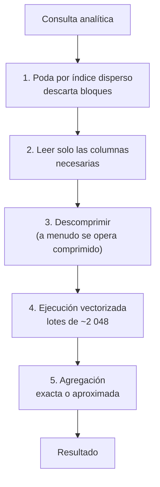

# 032 — Analítica columnar: por qué el formato cambia el orden de magnitud

> [Programa](../../../README.md) · [Parte 06](../README.md) · [← Anterior](../../part-06-grafos-columnas-tiempo-y-busqueda/031-busqueda-de-texto-indice-invertido-y-relevancia/README.md) · [Siguiente →](../../part-07-transacciones-concurrencia-y-recuperacion/033-acid-que-garantiza-cada-letra/README.md)

Parte 06 — Grafos, columnas, tiempo y búsqueda · Avanzado ·
3 horas estimadas · motores `clickhouse`, `duckdb` · laboratorio
[`labs/04-indexing`](../../../labs/04-indexing/README.md) · 4 fuentes.

**Conceptos centrales:** `almacenamiento columnar` · `compresión` · `ejecución vectorizada` · `poda de particiones`

**En este caso se comparan 7 motores**: 6 lo resuelven (3 con el resultado comprobado por máquina) y 1 no, con el motivo escrito.

---

## Propósito

Explicar por qué un motor columnar responde en segundos lo que un motor por filas tarda minutos, y qué se paga a cambio. La respuesta está en el formato, la compresión y la forma de ejecutar.

## Resultados de aprendizaje

Al terminar podrás:

1. Calcular la E/S de una consulta analítica en formato por filas y por columnas.
2. Explicar por qué la compresión es mucho más eficaz por columnas.
3. Describir la ejecución vectorizada y su relación con la caché de la CPU.
4. Elegir clave de ordenamiento y granularidad de índice disperso.
5. Justificar el conteo aproximado y calcular su error.

## Fundamentos

### El formato manda

```text
Tabla: 20 columnas, 100 millones de filas, fila media 200 bytes → 20 GB

Consulta: SELECT periodo, AVG(nota) FROM enrollments GROUP BY periodo
Columnas necesarias: periodo (8 B) + nota (8 B) = 16 B por fila

Por filas:     hay que leer las páginas completas          → ~20 GB
Por columnas:  solo dos columnas                           → ~1,6 GB
Con compresión columnar (factor típico 8×)                 → ~0,2 GB
```

**Factor 100** de E/S para el mismo SQL y los mismos datos. Ninguna optimización de consulta compite con eso.

### Por qué comprime tanto mejor

En formato por filas, bytes contiguos pertenecen a columnas distintas: un entero, un texto, una fecha. La entropía local es alta y el compresor genérico saca poco.

Por columnas, los valores contiguos son del mismo tipo y a menudo del mismo rango, lo que habilita codificaciones específicas:

| Codificación | Cuándo | Ejemplo |
|---|---|---|
| Diccionario | Pocos valores distintos | 300 períodos en 100 M de filas → 2 bytes por fila |
| Longitud de secuencia | Valores repetidos contiguos | Datos ordenados por esa columna |
| Delta | Valores crecientes | Marcas de tiempo, identificadores |
| Delta-of-delta | Incrementos regulares | Series a intervalo fijo |
| Bit-packing | Rango pequeño conocido | Nota de 1,0 a 7,0 en un decimal → 6 bits |

Regla práctica: **la clave de ordenamiento decide la compresión**. Ordenar por una columna de baja cardinalidad hace que sus valores queden contiguos y la codificación por longitud de secuencia rinda al máximo.

### Ejecución vectorizada

Un motor por filas ejecuta un árbol de operadores fila a fila: por cada fila, una llamada virtual por operador. Con 100 millones de filas y 5 operadores, son 500 millones de llamadas.

Un motor vectorizado procesa **lotes** de ~1 024–2 048 valores por llamada. Consecuencias:

- Se amortiza el coste de la llamada entre miles de valores.
- El bucle interior opera sobre un arreglo contiguo, que cabe en la caché L1/L2.
- El compilador puede autovectorizar con instrucciones SIMD.

Es la razón por la que DuckDB y ClickHouse superan a un motor por filas incluso cuando todos los datos están en memoria: la ventaja no es solo de E/S.

### Índice disperso y poda

ClickHouse no indexa cada fila: guarda una marca cada `index_granularity` filas (8 192 por defecto) con el valor mínimo y máximo del bloque. Es un índice **disperso**.

```sql
CREATE TABLE enrollments (
  periodo    LowCardinality(String),
  course_id  UInt32,
  student_id UInt32,
  nota       Decimal(2,1),
  registrada_en DateTime
) ENGINE = MergeTree
ORDER BY (periodo, course_id, registrada_en);
```

`ORDER BY` aquí **no** es orden de salida: es el orden físico de almacenamiento y define el índice primario. Una consulta con `WHERE periodo = '2026-1'` descarta bloques enteros sin leerlos. Con 100 M de filas repartidas en 300 períodos, la poda elimina el 99,7 % de los datos antes de descomprimir nada.

`LowCardinality(String)` aplica codificación por diccionario explícita: para columnas con menos de ~10 000 valores distintos, reduce el tamaño y acelera los agrupamientos.

### Conteo aproximado

Contar valores distintos exactamente exige recordar todos los vistos. HyperLogLog (Flajolet et al.) lo estima con memoria prácticamente constante:

```text
memoria     ≈ 12 KB
error medio ≈ 1,04 / √m,  con m = 2^14 = 16 384 registros
            ≈ 0,81 %
```

```sql
SELECT uniq(student_id)      FROM enrollments;   -- aproximado, ~12 KB
SELECT uniqExact(student_id) FROM enrollments;   -- exacto, memoria proporcional a la cardinalidad
```

Con 50 millones de estudiantes distintos, `uniqExact` necesita gigabytes; `uniq` responde con 12 KB y un error inferior al 1 %. Para un panel, ese error es irrelevante; para una factura, no. **La decisión es del negocio, y debe estar escrita.**



## Ejemplo trabajado

Pregunta: *«promedio de nota y número de estudiantes distintos por período»* sobre 100 millones de inscripciones.

**PostgreSQL (por filas), sin índice útil:**

```text
Barrido secuencial de enrollments      → 20 GB leídos
HashAggregate sobre 100 M filas
Tiempo: minutos
```

**ClickHouse:**

```sql
SELECT periodo, avg(nota) AS promedio, uniq(student_id) AS estudiantes
FROM enrollments GROUP BY periodo ORDER BY periodo;
```

```text
Columnas leídas: periodo (diccionario), nota, student_id
Bytes leídos tras compresión: ~0,4 GB
Agregación vectorizada + HyperLogLog
Tiempo: segundos
```

**Y la consulta inversa**, un solo registro:

```sql
SELECT * FROM enrollments WHERE student_id = 11 AND course_id = 42;
```

- PostgreSQL con índice: **una** búsqueda B-Tree, ~4 páginas, latencia inferior al milisegundo.
- ClickHouse: `student_id` no encabeza la clave de ordenamiento, así que no hay poda. Debe leer todos los bloques de todas las columnas seleccionadas.

Esta asimetría es el punto central: **no existe un motor bueno para todo**. Es la razón de que OLTP y OLAP se separen (clase 054) y de que la persistencia poliglota exista (clase 062).

**Efecto de la clave de ordenamiento, medido.** La misma tabla con dos claves distintas:

| `ORDER BY` | Tamaño en disco | `WHERE periodo=...` | `WHERE student_id=...` |
|---|---:|---|---|
| `(periodo, course_id, registrada_en)` | 1,2 GB | Poda al 0,3 % | Sin poda |
| `(student_id, registrada_en)` | 2,8 GB | Sin poda | Poda al 0,001 % |

El tamaño difiere porque ordenar por `periodo` agrupa valores repetidos y la codificación por longitud de secuencia rinde mucho más. **La clave de ordenamiento afecta simultáneamente al tamaño y a qué consultas son rápidas**: es la decisión de diseño más importante en un motor columnar, equivalente a la clave de partición en columnas anchas (clase 029).

## Comparación

| Dimensión | Por filas (OLTP) | Columnar (OLAP) |
|---|---|---|
| Leer una fila entera | Excelente | Malo |
| Leer 2 columnas de millones de filas | Malo | Excelente |
| Insertar una fila | Excelente | Malo (por lotes) |
| Actualizar una fila | Excelente | Muy costoso |
| Compresión | 2–3× | 8–30× |
| Transacciones | Completas | Limitadas |
| Índices secundarios | Muchos | Pocos, dispersos |

## Errores frecuentes

1. **Usar un motor columnar como OLTP.** Cada `UPDATE` puntual reescribe partes de muchas columnas.
2. **Insertar fila a fila en ClickHouse.** Genera miles de fragmentos pequeños y la fusión no da abasto; hay que insertar por lotes.
3. **Elegir `ORDER BY` sin mirar las consultas.** Se pierde la poda y la compresión a la vez.
4. **`SELECT *` en columnar.** Anula la única ventaja del formato.
5. **Presentar cifras aproximadas como exactas.** `uniq` no es `uniqExact`.
6. **Suponer que la compresión es gratis.** Cuesta CPU al escribir; se recupera con creces en lectura.

## De la clase a la operación

Migrar informes de un motor por filas a uno columnar suele dar mejoras de uno o dos órdenes de magnitud, y añade un sistema que sincronizar con el origen (clase 056). Antes de eso, conviene comprobar qué consigue DuckDB sobre exportaciones Parquet: a menudo basta y no añade servicio alguno.

## Reto de transferencia

1. Toma tu consulta analítica más pesada y calcula los bytes que lee en formato por filas.
2. Exporta los datos a Parquet y ejecútala con DuckDB; mide bytes y tiempo.
3. Prueba dos claves de ordenamiento distintas y compara tamaño y poda.
4. Sustituye un conteo exacto por uno aproximado, mide el error real y decide si es aceptable.

## Preguntas de evaluación

1. Calcula la E/S de una consulta tuya en ambos formatos, con cifras reales.
2. ¿Por qué ordenar por una columna de baja cardinalidad reduce el tamaño total?
3. Explica por qué la ejecución vectorizada ayuda incluso con todos los datos en memoria.
4. Da una métrica de tu negocio donde el error del 1 % de HyperLogLog sea inaceptable.

---

## 🌐 El mismo problema en cada motor

**Caso:** Sumar una columna de mil filas y entender por qué el formato decide el tiempo

La consulta analítica típica toca **pocas columnas de muchísimas filas**. La
transaccional toca **todas las columnas de pocas filas**. Esa diferencia, y
no el lenguaje, es la que separa a los dos mundos: un almacén orientado a
filas guarda la fila entera junta, así que para sumar una columna tiene que
leer también todas las demás.

El caso genera mil filas repartidas en dos categorías y suma el importe de
cada una. Con mil filas, todos los motores tardan lo mismo: eso es
deliberado, porque lo que se compara aquí es **cómo** llegan al mismo
número. El «por qué no» de cada motor dice a partir de qué volumen ese cómo
empieza a decidir si la consulta tarda un segundo o un minuto.

Salida esperada, idéntica en todos los motores que lo resuelven:

| categoria | importe |
|---|---|
| `c0` | `250500` |
| `c1` | `250000` |

El contrato vive en [`motores.yaml`](motores.yaml) y lo comprueba
`python scripts/verificar_equivalencia.py --clase 032`: 3 de
las 6 implementaciones se ejecutan de verdad y su
resultado se compara con esa tabla; el resto se declara como material revisado,
no ejecutado.

| Motor | ¿Resuelve el caso? | Nivel de prueba | Código | Fuente |
|---|---|---|---|---|
| DuckDB | sí | núcleo | [código](implementaciones/duckdb/consulta.sql) | [doc oficial](https://duckdb.org/docs/stable/internals/storage.html) |
| ClickHouse | sí | declarado | [código](implementaciones/clickhouse/consulta.sql) | [doc oficial](https://clickhouse.com/docs/en/engines/table-engines/mergetree-family/mergetree) |
| SQLite | sí | núcleo | [código](implementaciones/sqlite/consulta.sql) | [doc oficial](https://sqlite.org/fileformat.html) |
| PostgreSQL | sí | servicio | [código](implementaciones/postgresql/consulta.sql) | [doc oficial](https://www.postgresql.org/docs/current/parallel-query.html) |
| Google BigQuery | sí | declarado | [código](implementaciones/bigquery/consulta.sql) | [doc oficial](https://cloud.google.com/bigquery/docs/best-practices-costs) |
| Snowflake | sí | declarado | [código](implementaciones/snowflake/consulta.sql) | [doc oficial](https://docs.snowflake.com/en/user-guide/tables-clustering-micropartitions) |
| MongoDB | **no** | — | — | [doc oficial](https://www.mongodb.com/docs/manual/core/aggregation-pipeline-optimization/) |

### Los que resuelven el caso

#### DuckDB · [`implementaciones/duckdb/consulta.sql`](implementaciones/duckdb/consulta.sql)

✅ **verificado** — se ejecuta en CI sin servicios

```sql
-- motor: duckdb
-- doc: https://duckdb.org/docs/stable/internals/storage.html
-- nota: aqui la suma lee DOS columnas y ninguna mas, ya comprimidas, en lotes
--       de miles de valores por operacion en vez de una llamada por fila. Es la
--       misma consulta y una arquitectura distinta.
--       Para verlo: EXPLAIN ANALYZE delante de la consulta.

-- === preparacion ===
CREATE TABLE hechos (
    id        INTEGER PRIMARY KEY,
    categoria VARCHAR NOT NULL,
    importe   INTEGER NOT NULL
);

INSERT INTO hechos
SELECT n, 'c' || (n % 2), n FROM generate_series(1, 1000) AS s(n);

-- === consulta ===
SELECT categoria, SUM(importe) AS importe
FROM hechos
GROUP BY categoria
ORDER BY categoria;
```

- **Por qué sí:** Almacenamiento columnar, ejecución vectorizada por lotes de miles de valores y paralelismo por trozos: la suma lee solo las dos columnas que necesita, ya comprimidas, y sin una llamada de función por fila. Es la arquitectura analítica completa dentro de un proceso.
- **Por qué no:** Esa arquitectura es pésima para lo contrario: leer una fila entera por su clave obliga a tocar todos los bloques de columna, y modificar filas sueltas reescribe bloques enteros.
- 📄 Documentación oficial: <https://duckdb.org/docs/stable/internals/storage.html>

#### ClickHouse · [`implementaciones/clickhouse/consulta.sql`](implementaciones/clickhouse/consulta.sql)

⚪ **declarado** — se revisa a mano contra la documentación citada; la máquina no lo ejecuta

```sql
-- motor: clickhouse
-- doc: https://clickhouse.com/docs/en/engines/table-engines/mergetree-family/mergetree
-- nota: implementacion declarada. La clausula ORDER BY del motor MergeTree no
--       es un orden de presentacion: es el ORDEN FISICO de los datos, y de el
--       dependen la compresion y los indices de salto, que descartan bloques
--       enteros sin leerlos.
--       Lo que este motor NO tiene: transacciones. No hay BEGIN, y corregir
--       filas es una mutacion asincrona que reescribe partes.

-- === preparacion ===
CREATE TABLE hechos (
    id        UInt32,
    categoria LowCardinality(String),
    importe   UInt32
) ENGINE = MergeTree ORDER BY (categoria, id);

INSERT INTO hechos
SELECT number + 1, concat('c', toString((number + 1) % 2)), number + 1
FROM numbers(1000);

-- === consulta ===
SELECT categoria, SUM(importe) AS importe
FROM hechos
GROUP BY categoria
ORDER BY categoria;
```

- **Por qué sí:** Lleva la misma idea a escala distribuida: `MergeTree` ordena y comprime por partes, los índices de salto descartan bloques enteros sin leerlos, y la ejecución es masivamente paralela. Es lo que se usa cuando la tabla tiene miles de millones de filas.
- **Por qué no:** No es transaccional: no hay `BEGIN`, las actualizaciones y borrados son mutaciones asíncronas que reescriben partes, y las reuniones entre tablas grandes son su punto débil. Es un almacén de hechos, no un sistema operacional.
- 📄 Documentación oficial: <https://clickhouse.com/docs/en/engines/table-engines/mergetree-family/mergetree>

#### SQLite · [`implementaciones/sqlite/consulta.sql`](implementaciones/sqlite/consulta.sql)

✅ **verificado** — se ejecuta en CI sin servicios

```sql
-- motor: sqlite
-- doc: https://sqlite.org/fileformat.html
-- nota: SQLite guarda la FILA entera junta en la pagina. Para sumar `importe`
--       tiene que leer tambien `id` y `categoria` de cada una de las mil filas.
--       Con mil no se nota. Con cien millones, es el problema entero, y ningun
--       indice lo arregla: no se trata de encontrar las filas, se trata de
--       leerlas todas.

-- === preparacion ===
CREATE TABLE hechos (
    id        INTEGER PRIMARY KEY,
    categoria TEXT NOT NULL,
    importe   INTEGER NOT NULL
);

WITH RECURSIVE serie(n) AS (
    SELECT 1
    UNION ALL
    SELECT n + 1 FROM serie WHERE n < 1000
)
INSERT INTO hechos (id, categoria, importe)
SELECT n, 'c' || (n % 2), n FROM serie;

-- === consulta ===
SELECT categoria, SUM(importe) AS importe
FROM hechos
GROUP BY categoria
ORDER BY categoria;
```

- **Por qué sí:** Está aquí para mostrar el contraste desde el otro lado: el mismo SQL, el mismo resultado, y un almacenamiento por filas que obliga a leer cada registro entero para sumar una columna.
- **Por qué no:** Con mil filas no se nota; con cien millones, la diferencia es de órdenes de magnitud, y no hay índice que la arregle porque el problema no es encontrar las filas, es leerlas todas.
- 📄 Documentación oficial: <https://sqlite.org/fileformat.html>

#### PostgreSQL · [`implementaciones/postgresql/consulta.sql`](implementaciones/postgresql/consulta.sql)

✅ **verificado** — se ejecuta contra el motor real levantado con `docker compose`

```sql
-- motor: postgresql
-- doc: https://www.postgresql.org/docs/current/parallel-query.html
-- nota: el punto intermedio. Filas en disco, pero con agregacion en paralelo
--       (Parallel Seq Scan + Partial Aggregate + Gather) cuando la tabla es lo
--       bastante grande. Para verlo hacen falta mas de mil filas y
--         SET max_parallel_workers_per_gather = 4;
--         EXPLAIN (ANALYZE) SELECT ...

-- === preparacion ===
DROP TABLE IF EXISTS hechos;

CREATE TABLE hechos (
    id        integer PRIMARY KEY,
    categoria text NOT NULL,
    importe   integer NOT NULL
);

INSERT INTO hechos (id, categoria, importe)
SELECT n, 'c' || (n % 2), n FROM generate_series(1, 1000) AS s(n);

-- === consulta ===
SELECT categoria, SUM(importe) AS importe
FROM hechos
GROUP BY categoria
ORDER BY categoria;
```

- **Por qué sí:** Es el punto intermedio honesto: filas en disco, pero con ejecución paralela, agregación en paralelo y `BRIN` para tablas ordenadas. Para analítica de tamaño medio sobre los datos operativos, evita montar un almacén aparte.
- **Por qué no:** Sigue leyendo filas completas y usando una versión por fila para el control de concurrencia: por mucho paralelismo, no compite con un formato columnar cuando la consulta toca dos columnas de una tabla de cien.
- 📄 Documentación oficial: <https://www.postgresql.org/docs/current/parallel-query.html>

#### Google BigQuery · [`implementaciones/bigquery/consulta.sql`](implementaciones/bigquery/consulta.sql)

⚪ **declarado** — se revisa a mano contra la documentación citada; la máquina no lo ejecuta

```sql
-- motor: bigquery
-- doc: https://cloud.google.com/bigquery/docs/best-practices-costs
-- nota: implementacion declarada. Aqui la optimizacion no es de tiempo: es de
--       FACTURA. Se paga por bytes LEIDOS, y al ser columnar, leer dos columnas
--       cuesta dos columnas. La misma consulta con SELECT * sobre una tabla de
--       cien columnas cuesta cincuenta veces mas y devuelve lo mismo.
--       Antes de lanzarla en serio:
--         bq query --dry_run   -> dice cuantos bytes se van a leer, sin cobrar.

-- === preparacion ===
CREATE OR REPLACE TABLE analitica.hechos
PARTITION BY RANGE_BUCKET(id, GENERATE_ARRAY(0, 1000000, 100000))
CLUSTER BY categoria
AS
SELECT n AS id,
       CONCAT('c', CAST(MOD(n, 2) AS STRING)) AS categoria,
       n AS importe
FROM UNNEST(GENERATE_ARRAY(1, 1000)) AS n;

-- === consulta ===
SELECT categoria, SUM(importe) AS importe
FROM analitica.hechos
GROUP BY categoria
ORDER BY categoria;
```

- **Por qué sí:** Separa por completo almacenamiento y cómputo: el mismo formato columnar, con miles de nodos efímeros que se asignan por consulta y sin nada que administrar. Para un agregado sobre petabytes ocasional, es la opción con menos operación.
- **Por qué no:** Se paga por bytes leídos: la misma consulta escrita con `SELECT *` en vez de dos columnas cuesta dinero de verdad, y una consulta mal filtrada puede costar más que el análisis que la motivó. Aquí la optimización no es de tiempo, es de factura.
- 📄 Documentación oficial: <https://cloud.google.com/bigquery/docs/best-practices-costs>

#### Snowflake · [`implementaciones/snowflake/consulta.sql`](implementaciones/snowflake/consulta.sql)

⚪ **declarado** — se revisa a mano contra la documentación citada; la máquina no lo ejecuta

```sql
-- motor: snowflake
-- doc: https://docs.snowflake.com/en/user-guide/tables-clustering-micropartitions
-- nota: implementacion declarada. Snowflake divide la tabla en micro-particiones
--       columnares de 50-500 MB y guarda metadatos de cada una —minimo, maximo,
--       numero de valores distintos—, de modo que una consulta filtrada puede
--       descartar particiones enteras sin leerlas. Ese es todo el secreto, y
--       depende de que los datos esten agrupados por la columna que se filtra.
--       El computo se factura por TIEMPO ENCENDIDO: dimensionar y suspender el
--       almacen es parte del diseno, no una tarea de operacion posterior.

-- === preparacion ===
CREATE OR REPLACE TABLE hechos (
    id        NUMBER,
    categoria STRING,
    importe   NUMBER
) CLUSTER BY (categoria);

INSERT INTO hechos (id, categoria, importe)
SELECT SEQ4() + 1,
       'c' || TO_VARCHAR(MOD(SEQ4() + 1, 2)),
       SEQ4() + 1
FROM TABLE(GENERATOR(ROWCOUNT => 1000));

-- === consulta ===
SELECT categoria, SUM(importe) AS importe
FROM hechos
GROUP BY categoria
ORDER BY categoria;
```

- **Por qué sí:** Micro-particiones columnares con metadatos por partición que permiten descartar bloques sin leerlos, y almacenes de cómputo independientes que se dimensionan por carga: el equipo de análisis no compite con el de ingesta.
- **Por qué no:** El cómputo se factura por tiempo encendido, así que la disciplina de apagar y dimensionar es parte del diseño; y su rendimiento depende del orden de agrupamiento, que hay que mantener con `CLUSTER BY` en tablas grandes.
- 📄 Documentación oficial: <https://docs.snowflake.com/en/user-guide/tables-clustering-micropartitions>

### Los que no resuelven este caso — y qué se hace en su lugar

Descartar un motor con un argumento es tan formativo como usarlo. Ninguna de estas filas dice que el motor sea peor: dice que este problema no es el suyo.

| Motor | Por qué no | Qué se hace en su lugar | Fuente |
|---|---|---|---|
| MongoDB | Su almacenamiento es orientado a documentos: sumar un campo de un millón de documentos obliga a leer un millón de documentos completos. La tubería de agregación es expresiva, pero el formato no ayuda. | Exportar a Parquet y analizar con DuckDB o ClickHouse, que es lo que hace en la práctica casi todo el que tiene datos operativos en MongoDB y preguntas analíticas sobre ellos. | [doc](https://www.mongodb.com/docs/manual/core/aggregation-pipeline-optimization/) |

---

## Laboratorio

```bash
python scripts/validate_repository.py
python labs/04-indexing/run_indexing_lab.py
```

Guarda como evidencia la salida completa, la versión del motor y la semilla o
los parámetros usados. Una captura sin comando no es evidencia: no se puede
repetir.

## Evaluación

| Criterio | Peso | Qué se comprueba |
|---|---:|---|
| Comprensión conceptual | 25 % | Explica el mecanismo, no solo el resultado |
| Ejecución reproducible | 25 % | Otra persona obtiene lo mismo con las instrucciones dadas |
| Interpretación basada en evidencia | 25 % | Cada conclusión se apoya en una salida o una medición |
| Límites y riesgos declarados | 25 % | Dice qué no demuestra el ejercicio y qué faltaría en producción |

La clase se da por superada cuando la respuesta explica el mecanismo, muestra
la salida que la respalda y declara al menos un límite del ejercicio.

## Fuentes de esta clase

Todo lo afirmado arriba procede de estas obras. Los identificadores viven en
[`catalog/sources.json`](../../../catalog/sources.json) y el estado de los
enlaces se comprueba con `python scripts/check_external_links.py`.

- **ClickHouse, Inc.** (2026). [ClickHouse Documentation](https://clickhouse.com/docs/).  
  Motores de tabla, claves de ordenamiento y vistas materializadas.
- **DuckDB Foundation** (2026). [DuckDB Documentation](https://duckdb.org/docs/).  
  Motor analítico embebido: OLAP columnar sin servidor.
- **Michael Stonebraker, Samuel Madden, Daniel J. Abadi, Stavros Harizopoulos, Nabil Hachem, Pat Helland** (2007). [The End of an Architectural Era (It's Time for a Complete Rewrite)](https://cs.brown.edu/courses/cs227/archives/2008/Papers/OLTP/hstore.pdf). VLDB.  
  Mide en qué gasta el tiempo realmente un motor OLTP tradicional.
- **Philippe Flajolet, Eric Fusy, Olivier Gandouet, Frederic Meunier** (2007). [HyperLogLog: The Analysis of a Near-Optimal Cardinality Estimation Algorithm](http://algo.inria.fr/flajolet/Publications/FlFuGaMe07.pdf). Analysis of Algorithms (AofA).  
  Conteo aproximado de distintos con memoria prácticamente constante.

---

> [Programa](../../../README.md) · [Parte 06](../README.md) · [← Anterior](../../part-06-grafos-columnas-tiempo-y-busqueda/031-busqueda-de-texto-indice-invertido-y-relevancia/README.md) · [Siguiente →](../../part-07-transacciones-concurrencia-y-recuperacion/033-acid-que-garantiza-cada-letra/README.md)
