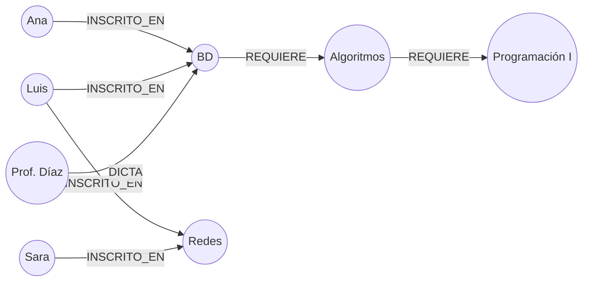

# 038 — Grafos de propiedades y los recorridos que SQL hace mal

> [Programa](../../../README.md) · [Parte 07](../README.md) · [← Anterior](../../part-06-documentos-y-clave-valor/037-clave-valor-cache-y-expiracion/README.md) · [Siguiente →](../../part-07-grafos-columnas-tiempo-y-busqueda/039-columnas-anchas-modelar-desde-la-consulta/README.md)

Parte 07 — Grafos, columnas, tiempo y búsqueda · Intermedio ·
3 horas estimadas · motores `neo4j`, `postgresql` · laboratorio
[`labs/02-polyglot-modeling`](../../../labs/02-polyglot-modeling/README.md) · 3 fuentes.

**Conceptos centrales:** `nodo` · `arista` · `recorrido de profundidad variable` · `reunión sin índice`

**En este caso se comparan 7 motores**: 5 lo resuelven (5 con el resultado comprobado por máquina) y 2 no, con el motivo escrito.

---

## Propósito

Reconocer las consultas para las que el modelo relacional paga un precio estructural —los recorridos de profundidad variable— y saber qué ofrece a cambio un motor de grafos.

## Resultados de aprendizaje

Al terminar podrás:

1. Modelar un dominio como grafo de propiedades.
2. Explicar por qué una reunión relacional cuesta más conforme aumenta la profundidad.
3. Traducir entre Cypher y SQL recursivo.
4. Medir la diferencia con un caso concreto y su traza de cardinalidad.
5. Decidir cuándo el grafo **no** compensa.

## Fundamentos

### El modelo de grafo de propiedades

Cuatro elementos:

- **Nodo:** entidad, con una o más etiquetas (`:Estudiante`).
- **Arista:** relación **dirigida y con tipo** (`-[:INSCRITO_EN]->`), que es un objeto de primera clase.
- **Propiedades:** pares clave-valor, tanto en nodos como en aristas.
- **Recorrido:** navegación siguiendo aristas.

La diferencia estructural con el relacional: en un grafo, la arista **es** el dato. En el relacional, la relación se reconstruye en cada consulta buscando en un índice.

### Por qué la profundidad importa

Robinson, Webber y Eifrem lo llaman *adyacencia sin índice*: cada nodo guarda punteros directos a sus vecinos. Encontrar los vecinos de un nodo es seguir punteros, con costo proporcional al número de vecinos y **no** al tamaño del grafo.

En el modelo relacional, cada nivel de profundidad es una reunión más. Con un índice B-Tree, cada reunión cuesta `O(log N)` por fila de entrada, y el número de filas de entrada se multiplica por el factor de ramificación en cada nivel.

| Profundidad | Relacional (con índice) | Grafo |
|---|---|---|
| 1 | 1 búsqueda de índice | seguir punteros |
| 2 | R búsquedas | seguir punteros |
| 3 | R² búsquedas | seguir punteros |
| k | R^(k−1) búsquedas | proporcional a los nodos visitados |

Con factor de ramificación R = 50 y profundidad 4: 125 000 búsquedas de índice contra el recorrido de la vecindad efectivamente alcanzada. La ventaja no está en el álgebra —ambos calculan lo mismo— sino en el acceso físico.

### Cypher

```cypher
MATCH (s:Estudiante {id: 11})-[:INSCRITO_EN]->(c:Curso)<-[:INSCRITO_EN]-(otro:Estudiante)
WHERE otro.id <> 11
RETURN otro.nombre, count(c) AS cursos_en_comun
ORDER BY cursos_en_comun DESC LIMIT 10
```

El patrón se **dibuja**. La misma consulta en SQL exige dos reuniones explícitas de `enrollments` consigo misma. Con profundidad variable, la diferencia se hace cualitativa:

```cypher
MATCH (a:Curso {id: 'bd'})-[:REQUIERE*1..5]->(pre:Curso)
RETURN DISTINCT pre.id
```

`*1..5` es profundidad variable. En SQL exige una CTE recursiva completa (clase 018), con su cota y su riesgo de ciclo.



## Ejemplo trabajado

Pregunta: *«todos los prerrequisitos de un curso, a cualquier profundidad, con su nivel»*.

**SQL recursivo:**

```sql
WITH RECURSIVE prereq(curso_id, nivel) AS (
    SELECT requiere_id, 1 FROM prerequisitos WHERE curso_id = 'bd'
  UNION
    SELECT p.requiere_id, pr.nivel + 1
    FROM prereq pr JOIN prerequisitos p ON p.curso_id = pr.curso_id
    WHERE pr.nivel < 10
)
SELECT curso_id, MIN(nivel) AS nivel FROM prereq GROUP BY curso_id;
```

**Cypher:**

```cypher
MATCH path = (c:Curso {id:'bd'})-[:REQUIERE*1..10]->(pre:Curso)
RETURN pre.id, min(length(path)) AS nivel
```

Ambas son correctas. La diferencia está en el trabajo físico. **Traza con factor de ramificación 3 y profundidad 5:**

```text
nivel 1:     3 prerrequisitos    ->    3 búsquedas de índice
nivel 2:     9                   ->    9
nivel 3:    27                   ->   27
nivel 4:    81                   ->   81
nivel 5:   243                   ->  243
                                    ------
total relacional:                     363 búsquedas de índice sobre `prerequisitos`
total grafo:                          363 saltos de puntero
```

Con este tamaño, **el relacional gana o empata**: 363 búsquedas de índice sobre una tabla que cabe en memoria son microsegundos, y el motor relacional está mucho más optimizado. La ventaja del grafo aparece cuando la tabla de aristas no cabe en memoria y cada búsqueda de índice se convierte en una lectura de disco.

Este matiz es el punto honesto de la clase: **el grafo no es mágicamente más rápido**. Gana cuando (a) la profundidad es alta y variable, (b) el grafo es grande y disperso, y (c) las consultas son de vecindad y no agregaciones globales.

**Dónde el grafo pierde claramente:**

| Consulta | Relacional | Grafo |
|---|---|---|
| «Promedio de notas por período» | Agregación con índice | Recorrido completo, sin ventaja |
| «Los 100 cursos con más inscritos» | `GROUP BY` + índice | Recorrido completo |
| «Insertar 10 000 inscripciones» | `COPY` masivo | Creación de nodos y aristas, más lenta |
| «Camino más corto entre dos personas» | CTE recursiva costosa | **Ventaja clara** |
| «Detección de comunidades» | Prácticamente inviable | **Ventaja clara** |

**Alternativa intermedia.** Antes de añadir un motor nuevo al sistema (clase 062), conviene comprobar si el relacional basta con el índice adecuado:

```sql
CREATE INDEX prereq_curso ON prerequisitos(curso_id, requiere_id);
```

Un índice cubriente sobre la tabla de aristas hace que la CTE recursiva no toque la tabla base. En muchos dominios de tamaño medio, eso cierra la brecha entera y ahorra un sistema que operar.

## Comparación

| Dimensión | Relacional | Grafo de propiedades |
|---|---|---|
| Relación como dato | Fila en tabla puente | Objeto de primera clase con propiedades |
| Profundidad fija | Excelente | Bien |
| Profundidad variable | CTE recursiva, con cota | Natural |
| Agregación global | Excelente | Pobre |
| Carga masiva | Excelente | Lenta |
| Restricciones declarativas | Ricas | Limitadas (unicidad, existencia) |
| Madurez operativa | Muy alta | Menor |

## Errores frecuentes

1. **Adoptar un grafo porque el dominio «tiene relaciones».** Todos los dominios las tienen; lo que importa es la profundidad variable.
2. **Modelar propiedades como nodos.** Un nodo por cada valor de atributo hincha el grafo sin aportar recorridos.
3. **Aristas sin dirección pensada.** La dirección es semántica: `REQUIERE` no es lo mismo en un sentido que en otro.
4. **Recorridos sin cota.** Un `*` sin límite superior en un grafo cíclico no termina.
5. **Usar el grafo como almacén principal de datos tabulares.** Los informes agregados serán lentos.
6. **No medir el relacional con el índice adecuado antes de migrar.**

## De la clase a la operación

Añadir un motor de grafos añade un sistema que replicar, respaldar, asegurar y mantener sincronizado con el origen. Ese costo permanente debe compararse con la ganancia medida, no con la esperada (clase 062).

## Reto de transferencia

1. Identifica en tu dominio una consulta de profundidad variable.
2. Impleméntala con CTE recursiva y mide con el índice adecuado.
3. Impleméntala en Cypher sobre los mismos datos y mide.
4. Documenta a partir de qué profundidad y qué volumen el grafo compensa, con tus cifras.

## Preguntas de evaluación

1. Explica la adyacencia sin índice y por qué el tamaño total del grafo deja de importar.
2. Calcula las búsquedas de índice de un recorrido de profundidad 6 con ramificación 10.
3. Da una consulta de tu dominio donde el grafo sería claramente peor.
4. ¿Qué garantías de integridad pierdes al mover datos de un relacional a un grafo?

---

## 🌐 El mismo problema en cada motor

**Caso:** Todos los prerrequisitos de un curso, por lejos que estén en la cadena

AR-301 exige SE-201, que exige DB-101, que exige MA-100. La pregunta —«¿qué
tengo que haber aprobado antes de AR-301?»— tiene una propiedad que la hace
distinta de todas las anteriores: **no se sabe de antemano cuántas reuniones
hacen falta**. Hoy la cadena tiene tres eslabones; mañana, siete.

Todo motor relacional serio la resuelve con `WITH RECURSIVE`, y funciona. Lo
que esta clase compara es el precio: en SQL hay que escribir el caso base, el
paso recursivo y la protección contra ciclos cada vez; en un grafo, el
recorrido de profundidad variable es un símbolo del lenguaje.

Salida esperada, idéntica en todos los motores que lo resuelven:

| curso |
|---|
| `DB-101` |
| `MA-100` |
| `SE-201` |

El contrato vive en [`motores.yaml`](motores.yaml) y lo comprueba
`python scripts/verificar_equivalencia.py --clase 038`: 5 de
las 5 implementaciones se ejecutan de verdad y su
resultado se compara con esa tabla; el resto se declara como material revisado,
no ejecutado.

| Motor | ¿Resuelve el caso? | Nivel de prueba | Código | Fuente |
|---|---|---|---|---|
| Neo4j | sí | servicio | [código](implementaciones/neo4j/consulta.cypher) | [doc oficial](https://neo4j.com/docs/cypher-manual/current/patterns/variable-length-patterns/) |
| PostgreSQL | sí | servicio | [código](implementaciones/postgresql/consulta.sql) | [doc oficial](https://www.postgresql.org/docs/current/queries-with.html) |
| SQLite | sí | núcleo | [código](implementaciones/sqlite/consulta.sql) | [doc oficial](https://sqlite.org/lang_with.html) |
| DuckDB | sí | núcleo | [código](implementaciones/duckdb/consulta.sql) | [doc oficial](https://duckdb.org/docs/stable/sql/query_syntax/with.html) |
| MongoDB | sí | servicio | [código](implementaciones/mongodb/consulta.js) | [doc oficial](https://www.mongodb.com/docs/manual/reference/operator/aggregation/graphLookup/) |
| Apache Cassandra | **no** | — | — | [doc oficial](https://cassandra.apache.org/doc/latest/cassandra/developing/data-modeling/intro.html) |
| Redis | **no** | — | — | [doc oficial](https://redis.io/docs/latest/develop/data-types/sets/) |

### Los que resuelven el caso

#### Neo4j · [`implementaciones/neo4j/consulta.cypher`](implementaciones/neo4j/consulta.cypher)

✅ **verificado** — se ejecuta contra el motor real levantado con `docker compose`

```cypher
// motor: neo4j
// doc: https://neo4j.com/docs/cypher-manual/current/patterns/variable-length-patterns/
// nota: aqui esta la clase entera en dos caracteres. `*` significa «uno o mas
//       saltos», y el motor no resuelve cada salto por indice: cada nodo guarda
//       punteros a sus vecinos, asi que el costo depende del vecindario
//       recorrido y no del tamano del grafo.

// === preparacion ===
MATCH (n) DETACH DELETE n;
CREATE (ar:Curso {codigo: 'AR-301'}),
       (se:Curso {codigo: 'SE-201'}),
       (db:Curso {codigo: 'DB-101'}),
       (ma:Curso {codigo: 'MA-100'}),
       (ar)-[:REQUIERE]->(se),
       (se)-[:REQUIERE]->(db),
       (db)-[:REQUIERE]->(ma);

// === consulta ===
MATCH (:Curso {codigo: 'AR-301'})-[:REQUIERE*]->(previo:Curso)
RETURN DISTINCT previo.codigo AS curso
ORDER BY curso;
```

- **Por qué sí:** El recorrido de profundidad variable se escribe con dos caracteres: `-[:REQUIERE*]->`. Y el costo no depende del tamaño del grafo sino del vecindario recorrido, porque cada nodo guarda punteros a sus vecinos en vez de resolverse por índice en cada salto.
- **Por qué no:** Ese mismo modelo penaliza lo tabular: contar todos los nodos de una etiqueta o agregar sobre todos ellos es más caro que en una tabla, y mantener un grafo entero para una jerarquía de tres niveles es añadir un sistema para no escribir seis líneas de SQL.
- 📄 Documentación oficial: <https://neo4j.com/docs/cypher-manual/current/patterns/variable-length-patterns/>

#### PostgreSQL · [`implementaciones/postgresql/consulta.sql`](implementaciones/postgresql/consulta.sql)

✅ **verificado** — se ejecuta contra el motor real levantado con `docker compose`

```sql
-- motor: postgresql
-- doc: https://www.postgresql.org/docs/current/queries-with.html
-- nota: para grafos con ciclos, PostgreSQL tiene la clausula CYCLE, que lleva
--       la deteccion al propio lenguaje en vez de dejarla al UNION:
--         WITH RECURSIVE cadena(curso) AS (...) CYCLE curso SET hay_ciclo USING ruta

-- === preparacion ===
DROP TABLE IF EXISTS prerrequisitos;

CREATE TABLE prerrequisitos (
    curso    text NOT NULL,
    requiere text NOT NULL,
    PRIMARY KEY (curso, requiere)
);
INSERT INTO prerrequisitos (curso, requiere) VALUES
    ('AR-301', 'SE-201'),
    ('SE-201', 'DB-101'),
    ('DB-101', 'MA-100');

-- === consulta ===
-- La consulta recursiva del estandar: un caso base y un paso que se aplica
-- hasta que no aporta filas nuevas. Funciona, y hay que escribirla entera cada
-- vez, incluida la proteccion contra ciclos si el grafo puede tenerlos.
WITH RECURSIVE cadena(curso) AS (
    SELECT requiere FROM prerrequisitos WHERE curso = 'AR-301'
    UNION
    SELECT p.requiere
    FROM prerrequisitos p
    JOIN cadena c ON p.curso = c.curso
)
SELECT curso FROM cadena ORDER BY curso;
```

- **Por qué sí:** `WITH RECURSIVE` es del estándar y resuelve el caso sin salir del motor donde ya están los datos: para jerarquías de pocos niveles —organigramas, categorías, listas de materiales— es casi siempre la respuesta correcta.
- **Por qué no:** Cada nivel de profundidad es una reunión más, y el planificador estima muy mal el número de filas de una recursión: a partir de cierta profundidad, el plan deja de tener sentido y el tiempo se dispara sin aviso.
- 📄 Documentación oficial: <https://www.postgresql.org/docs/current/queries-with.html>

#### SQLite · [`implementaciones/sqlite/consulta.sql`](implementaciones/sqlite/consulta.sql)

✅ **verificado** — se ejecuta en CI sin servicios

```sql
-- motor: sqlite
-- doc: https://sqlite.org/lang_with.html
-- nota: UNION —no UNION ALL— es lo que protege de los ciclos: descarta las
--       filas ya vistas. Con UNION ALL y un grafo ciclico, esta consulta no
--       termina nunca.

-- === preparacion ===
CREATE TABLE prerrequisitos (
    curso    TEXT NOT NULL,
    requiere TEXT NOT NULL,
    PRIMARY KEY (curso, requiere)
);
INSERT INTO prerrequisitos (curso, requiere) VALUES
    ('AR-301', 'SE-201'),
    ('SE-201', 'DB-101'),
    ('DB-101', 'MA-100');

-- === consulta ===
-- La consulta recursiva del estandar: un caso base y un paso que se aplica
-- hasta que no aporta filas nuevas. Funciona, y hay que escribirla entera cada
-- vez, incluida la proteccion contra ciclos si el grafo puede tenerlos.
WITH RECURSIVE cadena(curso) AS (
    SELECT requiere FROM prerrequisitos WHERE curso = 'AR-301'
    UNION
    SELECT p.requiere
    FROM prerrequisitos p
    JOIN cadena c ON p.curso = c.curso
)
SELECT curso FROM cadena ORDER BY curso;
```

- **Por qué sí:** Implementa `WITH RECURSIVE` completo, así que el recorrido en anchura se puede estudiar sin instalar nada. `UNION` en vez de `UNION ALL` es lo que corta los ciclos: descarta las filas ya vistas.
- **Por qué no:** Solo tiene bucle anidado como algoritmo de reunión, así que cada nivel vuelve a buscar por índice fila a fila: la recursión funciona y no escala.
- 📄 Documentación oficial: <https://sqlite.org/lang_with.html>

#### DuckDB · [`implementaciones/duckdb/consulta.sql`](implementaciones/duckdb/consulta.sql)

✅ **verificado** — se ejecuta en CI sin servicios

```sql
-- motor: duckdb
-- doc: https://duckdb.org/docs/stable/sql/query_syntax/with.html
-- nota: la misma consulta funciona sobre un grafo exportado a Parquet sin
--       cargarlo, que es la via analitica cuando la pregunta es «cuantos
--       caminos hay» y no «dame este camino».

-- === preparacion ===
CREATE TABLE prerrequisitos (
    curso    VARCHAR NOT NULL,
    requiere VARCHAR NOT NULL,
    PRIMARY KEY (curso, requiere)
);
INSERT INTO prerrequisitos (curso, requiere) VALUES
    ('AR-301', 'SE-201'),
    ('SE-201', 'DB-101'),
    ('DB-101', 'MA-100');

-- === consulta ===
-- La consulta recursiva del estandar: un caso base y un paso que se aplica
-- hasta que no aporta filas nuevas. Funciona, y hay que escribirla entera cada
-- vez, incluida la proteccion contra ciclos si el grafo puede tenerlos.
WITH RECURSIVE cadena(curso) AS (
    SELECT requiere FROM prerrequisitos WHERE curso = 'AR-301'
    UNION
    SELECT p.requiere
    FROM prerrequisitos p
    JOIN cadena c ON p.curso = c.curso
)
SELECT curso FROM cadena ORDER BY curso;
```

- **Por qué sí:** Admite la misma sintaxis recursiva y la resuelve de forma vectorizada, lo que la hace viable sobre grafos grandes exportados a Parquet: es la vía analítica para responder «cuántos caminos hay» sin montar un grafo.
- **Por qué no:** No hay recorrido guiado ni algoritmos de grafo: para camino más corto, centralidad o comunidades hay que escribirlo todo a mano, si es que se puede.
- 📄 Documentación oficial: <https://duckdb.org/docs/stable/sql/query_syntax/with.html>

#### MongoDB · [`implementaciones/mongodb/consulta.js`](implementaciones/mongodb/consulta.js)

✅ **verificado** — se ejecuta contra el motor real levantado con `docker compose`

```javascript
// motor: mongodb
// doc: https://www.mongodb.com/docs/manual/reference/operator/aggregation/graphLookup/
// nota: $graphLookup hace el recorrido transitivo dentro del motor. Tiene un
//       limite de 100 MB por operacion y no aprovecha indices en colecciones
//       fragmentadas: sirve para jerarquias modestas, no para un grafo grande.

// === preparacion ===
db.prerrequisitos.drop();
db.prerrequisitos.insertMany([
  { curso: "AR-301", requiere: "SE-201" },
  { curso: "SE-201", requiere: "DB-101" },
  { curso: "DB-101", requiere: "MA-100" },
]);

// === consulta ===
db.prerrequisitos
  .aggregate([
    { $match: { curso: "AR-301" } },
    { $graphLookup: {
        from: "prerrequisitos",
        startWith: "$requiere",
        connectFromField: "requiere",
        connectToField: "curso",
        as: "cadena" } },
    { $project: { cursos: { $concatArrays: [["$requiere"], "$cadena.requiere"] } } },
    { $unwind: "$cursos" },
    { $group: { _id: "$cursos" } },
    { $sort: { _id: 1 } },
  ])
  .forEach((d) => print(d._id));
```

- **Por qué sí:** `$graphLookup` hace el recorrido transitivo dentro del motor, con profundidad máxima configurable: no hace falta traerse el grafo al cliente ni escribir la recursión.
- **Por qué no:** Está limitado a 100 MB de memoria por operación y no puede usar índice para la búsqueda recursiva en colecciones fragmentadas: es una herramienta para jerarquías modestas, no para un grafo de verdad.
- 📄 Documentación oficial: <https://www.mongodb.com/docs/manual/reference/operator/aggregation/graphLookup/>

### Los que no resuelven este caso — y qué se hace en su lugar

Descartar un motor con un argumento es tan formativo como usarlo. Ninguna de estas filas dice que el motor sea peor: dice que este problema no es el suyo.

| Motor | Por qué no | Qué se hace en su lugar | Fuente |
|---|---|---|---|
| Apache Cassandra | No hay reuniones, no hay recursión y no hay forma de recorrer una relación sin conocer de antemano cuántos saltos harán falta. Cada salto sería una consulta desde el cliente, con su latencia de red. | Guardar el cierre transitivo ya calculado —una fila por cada par (curso, prerrequisito lejano)— y recalcularlo cuando cambie el plan de estudios: se paga en escritura y en espacio lo que no se puede pagar en lectura. | [doc](https://cassandra.apache.org/doc/latest/cassandra/developing/data-modeling/intro.html) |
| Redis | Recorrer exigiría un viaje por salto o un script Lua que implemente la búsqueda en anchura a mano: el almacén no entiende la relación, solo entiende claves. | Guardar en un conjunto los prerrequisitos transitivos de cada curso (`curso:AR-301:requiere-todo`) y reconstruirlo al cambiar el grafo. | [doc](https://redis.io/docs/latest/develop/data-types/sets/) |

---

## Laboratorio

```bash
python scripts/validate_repository.py
# labs/02-polyglot-modeling se entrega escrito: no hay guion que ejecutar
```

Guarda como evidencia la salida completa, la versión del motor y la semilla o
los parámetros usados. Una captura sin comando no es evidencia: no se puede
repetir.

## Evaluación

| Criterio | Peso | Qué se comprueba |
|---|---:|---|
| Comprensión conceptual | 25 % | Explica el mecanismo, no solo el resultado |
| Ejecución reproducible | 25 % | Otra persona obtiene lo mismo con las instrucciones dadas |
| Interpretación basada en evidencia | 25 % | Cada conclusión se apoya en una salida o una medición |
| Límites y riesgos declarados | 25 % | Dice qué no demuestra el ejercicio y qué faltaría en producción |

La clase se da por superada cuando la respuesta explica el mecanismo, muestra
la salida que la respalda y declara al menos un límite del ejercicio.

## Fuentes de esta clase

Todo lo afirmado arriba procede de estas obras. Los identificadores viven en
[`catalog/sources.json`](../../../catalog/sources.json) y el estado de los
enlaces se comprueba con `python scripts/check_external_links.py`.

- **Ian Robinson, Jim Webber, Emil Eifrem** (2015). [Graph Databases](https://neo4j.com/graph-databases-book/). 2.a ed. O'Reilly. ISBN 978-1-4919-3089-2.  
  Descarga gratuita. Modelado de grafos de propiedades y recorridos.
- **Neo4j, Inc.** (2026). [Neo4j Documentation](https://neo4j.com/docs/).  
  Cypher y modelo de grafo de propiedades.
- **Joe Celko** (2014). [Joe Celko's SQL for Smarties: Advanced SQL Programming](https://www.sciencedirect.com/book/9780128007617/joe-celkos-sql-for-smarties). 5.a ed. Morgan Kaufmann. ISBN 978-0-12-800761-7.  
  Modelado de jerarquias, conjuntos anidados y SQL declarativo avanzado.

---

> [Programa](../../../README.md) · [Parte 07](../README.md) · [← Anterior](../../part-06-documentos-y-clave-valor/037-clave-valor-cache-y-expiracion/README.md) · [Siguiente →](../../part-07-grafos-columnas-tiempo-y-busqueda/039-columnas-anchas-modelar-desde-la-consulta/README.md)
