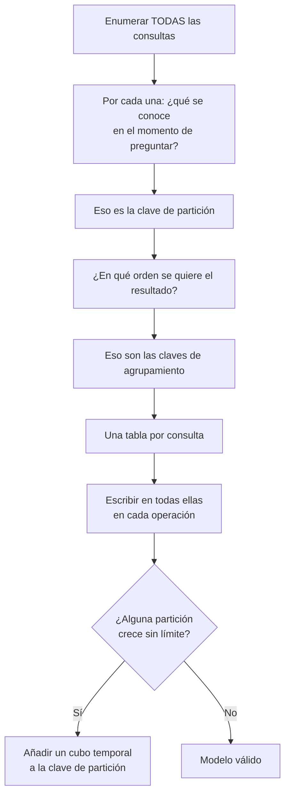

# 039 — Columnas anchas: modelar desde la consulta

> [Programa](../../../README.md) · [Parte 07](../README.md) · [← Anterior](../../part-07-grafos-columnas-tiempo-y-busqueda/038-grafos-de-propiedades-y-recorridos/README.md) · [Siguiente →](../../part-07-grafos-columnas-tiempo-y-busqueda/040-series-temporales-cardinalidad-y-retencion/README.md)

Parte 07 — Grafos, columnas, tiempo y búsqueda · Avanzado ·
3 horas estimadas · motores `cassandra`, `scylladb` · laboratorio
[`labs/05-nosql-workloads`](../../../labs/05-nosql-workloads/README.md) · 3 fuentes.

**Conceptos centrales:** `clave de partición` · `clave de agrupamiento` · `desnormalización por consulta`

**En este caso se comparan 7 motores**: 6 lo resuelven (4 con el resultado comprobado por máquina) y 1 no, con el motivo escrito.

---

## Propósito

Modelar en un motor de columnas anchas, donde la regla se invierte: no se normaliza y luego se consulta, sino que se enumeran las consultas y se diseña una tabla por cada una.

## Resultados de aprendizaje

Al terminar podrás:

1. Distinguir clave de partición de clave de agrupamiento y su efecto físico.
2. Diseñar tablas a partir de las consultas, aceptando la duplicación.
3. Reconocer las particiones calientes y las particiones sin límite.
4. Explicar por qué CQL prohíbe deliberadamente operaciones que SQL permite.
5. Elegir el nivel de consistencia y calcular cuándo hay lectura consistente.

## Fundamentos

### La clave primaria tiene dos partes

```sql
PRIMARY KEY ( (course_id, periodo), registrada_en, student_id )
--             ^^^^^^^^^^^^^^^^^^   ^^^^^^^^^^^^^^^^^^^^^^^^^^
--             clave de partición    claves de agrupamiento
```

- **Clave de partición:** decide **en qué nodo** viven los datos, por hash. Todas las filas con la misma clave de partición están juntas en el mismo nodo.
- **Claves de agrupamiento:** deciden **el orden dentro** de la partición. Los datos se guardan físicamente ordenados por ellas.

Consecuencias que rigen todo lo demás:

1. Toda consulta eficiente **debe** especificar la clave de partición completa. Sin ella, hay que preguntar a todos los nodos.
2. Solo se puede filtrar por rango en las claves de agrupamiento y **en orden**, sin saltarse ninguna.
3. `ORDER BY` solo funciona sobre las claves de agrupamiento y en el sentido declarado.

### Lo que CQL prohíbe, y por qué

| Operación SQL | En CQL | Motivo |
|---|---|---|
| `JOIN` | No existe | Exigiría coordinación entre nodos |
| `GROUP BY` arbitrario | Muy limitado | Ídem |
| Filtrar por columna no clave | Requiere `ALLOW FILTERING` | Sería un barrido del clúster |
| Subconsultas | No existen | Ídem |
| `OR` en el `WHERE` | No | Rompería la localización por partición |

`ALLOW FILTERING` no es una opción avanzada: es una advertencia. Su presencia en código de producción indica casi siempre que el modelo no corresponde a la consulta.

Las prohibiciones son **de diseño**. Un motor que permitiera reuniones distribuidas ofrecería consultas cuyo costo crece con el tamaño del clúster, y eso es exactamente lo que Cassandra evita para garantizar latencia predecible.

### Modelado dirigido por la consulta



### Particiones: los dos fallos

**Partición caliente:** una clave concreta recibe una fracción desproporcionada del tráfico. Si `course_id` es la clave y un curso tiene el 40 % de las inscripciones, un nodo hace el 40 % del trabajo mientras los demás están ociosos.

**Partición sin límite:** una partición que crece indefinidamente. Cassandra recomienda mantenerlas por debajo de ~100 MB y ~100 000 filas. Una partición por `sensor_id` que recibe una medición por segundo supera esa cota en poco más de un día.

La solución para ambos es la misma: **añadir un cubo a la clave de partición**.

```sql
PRIMARY KEY ( (sensor_id, dia), medido_en )
```

Ahora cada partición cubre un día. El costo: una consulta de siete días debe preguntar por siete particiones, lo que el cliente resuelve con siete consultas en paralelo. Elegir el tamaño del cubo es un cálculo, no una intuición:

```text
mediciones por día = 86 400
tamaño de fila     ≈ 100 bytes
partición diaria   ≈ 8,6 MB          ← correcto
partición mensual  ≈ 260 MB          ← demasiado grande
```

### Consistencia ajustable

Cada operación elige cuántas réplicas deben responder:

| Nivel | Significado |
|---|---|
| `ONE` | Una réplica |
| `QUORUM` | ⌊RF/2⌋ + 1 |
| `LOCAL_QUORUM` | Quórum dentro del centro de datos local |
| `ALL` | Todas |

**Regla de lectura consistente:** `R + W > RF`. Con factor de replicación 3:

| W | R | ¿Lectura consistente? |
|---|---|---|
| `ONE` (1) | `ONE` (1) | No: 1+1 = 2 ≤ 3 |
| `QUORUM` (2) | `QUORUM` (2) | **Sí**: 2+2 = 4 > 3 |
| `ALL` (3) | `ONE` (1) | Sí, pero sin tolerancia a fallos en escritura |
| `ONE` (1) | `ALL` (3) | Sí, pero sin tolerancia a fallos en lectura |

`QUORUM`/`QUORUM` es el punto de equilibrio habitual: tolera la caída de una réplica en ambos sentidos. Es el mismo cálculo de quórums de Dynamo, que se retoma en la clase 043.

## Ejemplo trabajado

Consultas del dominio:

| # | Consulta | Se conoce |
|---|---|---|
| Q1 | Inscripciones de un curso, las más recientes primero | `course_id`, `periodo` |
| Q2 | Cursos de un estudiante | `student_id` |
| Q3 | Una inscripción concreta | ambos |

**Tres tablas, una por consulta:**

```sql
CREATE TABLE inscripciones_por_curso (
  course_id     text, periodo text,
  registrada_en timestamp, student_id int,
  student_nombre text, nota decimal, estado text,
  PRIMARY KEY ((course_id, periodo), registrada_en, student_id)
) WITH CLUSTERING ORDER BY (registrada_en DESC, student_id ASC);

CREATE TABLE cursos_por_estudiante (
  student_id int, periodo text,
  course_id text, course_nombre text, nota decimal, estado text,
  PRIMARY KEY ((student_id), periodo, course_id)
) WITH CLUSTERING ORDER BY (periodo DESC, course_id ASC);

CREATE TABLE inscripcion (
  student_id int, course_id text,
  periodo text, nota decimal, estado text, registrada_en timestamp,
  PRIMARY KEY ((student_id, course_id))
);
```

Los mismos datos, tres veces. **Eso es correcto en este modelo**: el almacenamiento es barato y la coordinación distribuida es cara.

**Escritura: un lote lógico.**

```sql
BEGIN BATCH
  INSERT INTO inscripciones_por_curso (course_id, periodo, registrada_en, student_id,
                                       student_nombre, estado)
         VALUES ('bd','2026-1', toTimestamp(now()), 11, 'Ana Pérez', 'activa');
  INSERT INTO cursos_por_estudiante (student_id, periodo, course_id, course_nombre, estado)
         VALUES (11, '2026-1', 'bd', 'Bases de datos', 'activa');
  INSERT INTO inscripcion (student_id, course_id, periodo, estado, registrada_en)
         VALUES (11, 'bd', '2026-1', 'activa', toTimestamp(now()));
APPLY BATCH;
```

Advertencia importante: un `BATCH` que abarca varias particiones **no** es una transacción. Garantiza que todas las sentencias se aplicarán *eventualmente*, mediante un registro de lote, y tiene un costo de coordinación notable. Los lotes son adecuados para mantener sincronizadas vistas duplicadas de una misma escritura lógica, no para lógica transaccional.

**Comprobación de la partición sin límite.** `inscripciones_por_curso` tiene una partición por `(course_id, periodo)`. Un curso masivo con 50 000 inscritos y filas de ~150 bytes da 7,5 MB: dentro de lo aceptable. Si el dominio admitiera cursos de un millón, habría que cubetear por mes de inscripción.

**Q2 con `ALLOW FILTERING`**, el antipatrón:

```sql
SELECT * FROM inscripciones_por_curso WHERE student_id = 11 ALLOW FILTERING;
```

Funciona y pregunta a **todos** los nodos, leyendo todas las particiones. Con 300 cursos, la consulta lee 300 particiones para devolver 8 filas. Por eso existe `cursos_por_estudiante`.

## Comparación

| Dimensión | Relacional | Columnas anchas |
|---|---|---|
| Punto de partida | El esquema normalizado | Las consultas |
| Duplicación | Se evita | Se busca |
| Reuniones | En el motor | En la escritura |
| Consultas no previstas | Se escriben y funcionan | Exigen tabla nueva y relleno |
| Coste de escritura | Uno | Uno por vista |
| Escalado horizontal de escritura | Limitado | Lineal |

## Errores frecuentes

1. **`ALLOW FILTERING` en producción.** Señal de modelo ausente.
2. **Particiones sin cota.** Degradan la latencia progresivamente hasta el fallo.
3. **Confundir `BATCH` con transacción.** No hay atomicidad entre particiones.
4. **Clave de partición de baja cardinalidad.** Concentra los datos en pocos nodos.
5. **Leer con `ONE` tras escribir con `ONE` y esperar consistencia.** `R + W ≤ RF`.
6. **Índices secundarios de Cassandra por costumbre.** Consultan todos los nodos; en general se prefiere una tabla nueva.

## De la clase a la operación

Una consulta no prevista en un modelo de columnas anchas no es un `SELECT` nuevo: es una tabla nueva más el relleno histórico de todos los datos existentes. Enumerar bien las consultas al principio no es burocracia, es la única forma barata de hacerlo.

## Reto de transferencia

1. Enumera las consultas de tu dominio con lo que se conoce en el momento de preguntar.
2. Diseña una tabla por consulta con sus claves de partición y agrupamiento.
3. Calcula el tamaño máximo de la partición más grande y decide el cubo si hace falta.
4. Elige `R` y `W` para dos operaciones distintas y justifica con `R + W > RF`.

## Preguntas de evaluación

1. ¿Por qué CQL prohíbe las reuniones en lugar de permitirlas y avisar de su costo?
2. Calcula el tamaño de partición de una serie tuya y elige el cubo temporal.
3. Con RF = 5, ¿qué combinaciones de `R` y `W` dan lectura consistente?
4. Da una consulta nueva sobre tu modelo y describe el trabajo completo de añadirla.

---

## 🌐 El mismo problema en cada motor

**Caso:** Las dos últimas lecturas de un sensor, de la más reciente a la más antigua

En el modelo de columnas anchas no se modela el dominio: se modela **la
consulta**. La clave primaria de Cassandra tiene dos partes con papeles muy
distintos: la de partición decide en qué nodo vive la fila, y la de
agrupamiento decide en qué orden están las filas **dentro** de esa partición,
en el disco.

El caso lo pone a prueba con la consulta más común de la telemetría: las dos
últimas lecturas de `sensor-1`. Con la tabla modelada así, la respuesta son
dos celdas contiguas de una sola partición, en un solo nodo, sin ordenar
nada. Cambiar la pregunta —«las lecturas de todos los sensores a las 10:01»—
obliga a otra tabla, y esa es exactamente la lección.

Salida esperada, idéntica en todos los motores que lo resuelven:

| momento | valor |
|---|---|
| `2026-08-19T10:02:00Z` | `23` |
| `2026-08-19T10:01:00Z` | `22` |

El contrato vive en [`motores.yaml`](motores.yaml) y lo comprueba
`python scripts/verificar_equivalencia.py --clase 039`: 4 de
las 6 implementaciones se ejecutan de verdad y su
resultado se compara con esa tabla; el resto se declara como material revisado,
no ejecutado.

| Motor | ¿Resuelve el caso? | Nivel de prueba | Código | Fuente |
|---|---|---|---|---|
| Apache Cassandra | sí | declarado | [código](implementaciones/cassandra/consulta.cql) | [doc oficial](https://cassandra.apache.org/doc/latest/cassandra/developing/data-modeling/data-modeling_queries.html) |
| ScyllaDB | sí | declarado | [código](implementaciones/scylladb/consulta.cql) | [doc oficial](https://opensource.docs.scylladb.com/stable/cql/ddl.html) |
| SQLite | sí | núcleo | [código](implementaciones/sqlite/consulta.sql) | [doc oficial](https://sqlite.org/lang_createtable.html) |
| DuckDB | sí | núcleo | [código](implementaciones/duckdb/consulta.sql) | [doc oficial](https://duckdb.org/docs/stable/sql/query_syntax/orderby.html) |
| PostgreSQL | sí | servicio | [código](implementaciones/postgresql/consulta.sql) | [doc oficial](https://www.postgresql.org/docs/current/ddl-partitioning.html) |
| MongoDB | sí | servicio | [código](implementaciones/mongodb/consulta.js) | [doc oficial](https://www.mongodb.com/docs/manual/core/timeseries-collections/) |
| Redis | **no** | — | — | [doc oficial](https://redis.io/docs/latest/develop/data-types/timeseries/) |

### Los que resuelven el caso

#### Apache Cassandra · [`implementaciones/cassandra/consulta.cql`](implementaciones/cassandra/consulta.cql)

⚪ **declarado** — se revisa a mano contra la documentación citada; la máquina no lo ejecuta

```sql
-- motor: cassandra
-- doc: https://cassandra.apache.org/doc/latest/cassandra/developing/data-modeling/data-modeling_queries.html
-- nota: implementacion declarada. Las dos partes de la clave primaria hacen
--       cosas distintas y conviene no confundirlas:
--         (dispositivo)  clave de PARTICION -> en que nodo vive la fila
--         momento        clave de AGRUPAMIENTO -> en que orden estan las filas
--                        DENTRO de esa particion, en el disco
--       Por eso LIMIT 2 lee dos celdas contiguas de un solo nodo.

-- === preparacion ===
CREATE KEYSPACE IF NOT EXISTS telemetria
  WITH replication = {'class': 'SimpleStrategy', 'replication_factor': 1};

DROP TABLE IF EXISTS telemetria.lecturas_por_dispositivo;

CREATE TABLE telemetria.lecturas_por_dispositivo (
    dispositivo text,
    momento     timestamp,
    valor       int,
    PRIMARY KEY (dispositivo, momento)
) WITH CLUSTERING ORDER BY (momento DESC);

INSERT INTO telemetria.lecturas_por_dispositivo (dispositivo, momento, valor)
  VALUES ('sensor-1', '2026-08-19T10:00:00Z', 21);
INSERT INTO telemetria.lecturas_por_dispositivo (dispositivo, momento, valor)
  VALUES ('sensor-1', '2026-08-19T10:01:00Z', 22);
INSERT INTO telemetria.lecturas_por_dispositivo (dispositivo, momento, valor)
  VALUES ('sensor-1', '2026-08-19T10:02:00Z', 23);
INSERT INTO telemetria.lecturas_por_dispositivo (dispositivo, momento, valor)
  VALUES ('sensor-2', '2026-08-19T10:00:00Z', 30);
INSERT INTO telemetria.lecturas_por_dispositivo (dispositivo, momento, valor)
  VALUES ('sensor-2', '2026-08-19T10:01:00Z', 31);

-- === consulta ===
-- Sin ORDER BY: el orden ya esta en el disco. Y sin ALLOW FILTERING: la
-- consulta toca UNA particion.
--
-- La pregunta inversa —«todas las lecturas de las 10:01, de cualquier sensor»—
-- NO se puede responder con esta tabla, y esa es la leccion. Haria falta
-- lecturas_por_minuto, escrita por la aplicacion en la misma operacion.
--
-- Y ojo con la particion infinita: un sensor que emite para siempre hace crecer
-- su particion sin limite. En produccion la clave seria ((dispositivo, dia)).
SELECT momento, valor
FROM telemetria.lecturas_por_dispositivo
WHERE dispositivo = 'sensor-1'
LIMIT 2;
```

- **Por qué sí:** La consulta se resuelve por el orden físico: `LIMIT 2` lee dos celdas contiguas de una partición, en un nodo, sin ordenación ni reunión. Y añadir nodos aumenta la capacidad de escritura de forma lineal, porque el dispositivo reparte las particiones por todo el anillo.
- **Por qué no:** Solo responde la pregunta con la que se modeló. Cualquier otra exige otra tabla, escrita por la aplicación en la misma operación y sin transacción que garantice que ambas quedaron de acuerdo. Y una partición que crezca sin límite —un sensor que emite para siempre— acaba siendo un problema por sí sola: hay que meter el mes o el día en la clave de partición.
- 📄 Documentación oficial: <https://cassandra.apache.org/doc/latest/cassandra/developing/data-modeling/data-modeling_queries.html>

#### ScyllaDB · [`implementaciones/scylladb/consulta.cql`](implementaciones/scylladb/consulta.cql)

⚪ **declarado** — se revisa a mano contra la documentación citada; la máquina no lo ejecuta

```sql
-- motor: scylladb
-- doc: https://opensource.docs.scylladb.com/stable/cql/ddl.html
-- nota: implementacion declarada, y deliberadamente IDENTICA a la de Cassandra:
--       ese es el argumento. ScyllaDB habla el mismo CQL y usa el mismo modelo
--       de datos, asi que el diseno migra sin tocar una linea. Lo que cambia
--       esta debajo: implementacion en C++ con un hilo fijado por nucleo y sin
--       recolector de basura, lo que elimina las pausas que en Cassandra hay
--       que ajustar a mano.
--       Lo que NO es identico: indices secundarios, vistas materializadas y
--       herramientas de operacion. La compatibilidad es alta, no total.

-- === preparacion ===
CREATE KEYSPACE IF NOT EXISTS telemetria
  WITH replication = {'class': 'SimpleStrategy', 'replication_factor': 1};

DROP TABLE IF EXISTS telemetria.lecturas_por_dispositivo;

CREATE TABLE telemetria.lecturas_por_dispositivo (
    dispositivo text,
    momento     timestamp,
    valor       int,
    PRIMARY KEY (dispositivo, momento)
) WITH CLUSTERING ORDER BY (momento DESC);

INSERT INTO telemetria.lecturas_por_dispositivo (dispositivo, momento, valor)
  VALUES ('sensor-1', '2026-08-19T10:01:00Z', 22);
INSERT INTO telemetria.lecturas_por_dispositivo (dispositivo, momento, valor)
  VALUES ('sensor-1', '2026-08-19T10:02:00Z', 23);

-- === consulta ===
SELECT momento, valor
FROM telemetria.lecturas_por_dispositivo
WHERE dispositivo = 'sensor-1'
LIMIT 2;
```

- **Por qué sí:** Habla el mismo CQL y usa el mismo modelo de datos, así que el diseño migra sin cambios; su implementación en C++ con un hilo por núcleo y sin recolector de basura elimina las pausas que en Cassandra hay que ajustar.
- **Por qué no:** La compatibilidad no es total —hay diferencias en índices secundarios, vistas materializadas y herramientas— y el ecosistema alrededor es más pequeño: se gana rendimiento y se pierde comunidad.
- 📄 Documentación oficial: <https://opensource.docs.scylladb.com/stable/cql/ddl.html>

#### SQLite · [`implementaciones/sqlite/consulta.sql`](implementaciones/sqlite/consulta.sql)

✅ **verificado** — se ejecuta en CI sin servicios

```sql
-- motor: sqlite
-- doc: https://sqlite.org/lang_createtable.html
-- nota: la clave primaria (dispositivo, momento) ordena las filas en el arbol B
--       exactamente como la clave de agrupamiento de Cassandra ordena las celdas
--       dentro de la particion. La idea es la misma; lo que falta aqui es el
--       reparto entre nodos.

-- === preparacion ===
CREATE TABLE lecturas (
    dispositivo TEXT NOT NULL,
    momento     TEXT NOT NULL,
    valor       INTEGER NOT NULL,
    PRIMARY KEY (dispositivo, momento)
);
INSERT INTO lecturas (dispositivo, momento, valor) VALUES
    ('sensor-1', '2026-08-19T10:00:00Z', 21),
    ('sensor-1', '2026-08-19T10:01:00Z', 22),
    ('sensor-1', '2026-08-19T10:02:00Z', 23),
    ('sensor-2', '2026-08-19T10:00:00Z', 30),
    ('sensor-2', '2026-08-19T10:01:00Z', 31);

-- === consulta ===
-- Las dos ultimas lecturas de sensor-1, de la mas reciente a la mas antigua.
SELECT momento, valor
FROM lecturas
WHERE dispositivo = 'sensor-1'
ORDER BY momento DESC
LIMIT 2;
```

- **Por qué sí:** Con la clave primaria `(dispositivo, momento)`, SQLite guarda las filas ordenadas por esa clave en el árbol B: la misma idea de «el orden está en el disco» se puede comprobar aquí sin clúster.
- **Por qué no:** Un solo archivo y un solo escritor: la parte del modelo que justifica Cassandra —repartir la escritura entre muchos nodos— no se puede estudiar aquí en absoluto.
- 📄 Documentación oficial: <https://sqlite.org/lang_createtable.html>

#### DuckDB · [`implementaciones/duckdb/consulta.sql`](implementaciones/duckdb/consulta.sql)

✅ **verificado** — se ejecuta en CI sin servicios

```sql
-- motor: duckdb
-- doc: https://duckdb.org/docs/stable/sql/query_syntax/orderby.html
-- nota: la pregunta que hay que hacerle a DuckDB no es esta, sino esta otra:
--         SELECT dispositivo, COUNT(*) FROM lecturas
--         GROUP BY dispositivo ORDER BY 2 DESC LIMIT 10;
--       es decir, que particion va a crecer sin limite. Mejor saberlo antes.

-- === preparacion ===
CREATE TABLE lecturas (
    dispositivo VARCHAR NOT NULL,
    momento     VARCHAR NOT NULL,
    valor       INTEGER NOT NULL,
    PRIMARY KEY (dispositivo, momento)
);
INSERT INTO lecturas (dispositivo, momento, valor) VALUES
    ('sensor-1', '2026-08-19T10:00:00Z', 21),
    ('sensor-1', '2026-08-19T10:01:00Z', 22),
    ('sensor-1', '2026-08-19T10:02:00Z', 23),
    ('sensor-2', '2026-08-19T10:00:00Z', 30),
    ('sensor-2', '2026-08-19T10:01:00Z', 31);

-- === consulta ===
-- Las dos ultimas lecturas de sensor-1, de la mas reciente a la mas antigua.
SELECT momento, valor
FROM lecturas
WHERE dispositivo = 'sensor-1'
ORDER BY momento DESC
LIMIT 2;
```

- **Por qué sí:** Es la herramienta para la otra mitad del trabajo: comprobar si el diseño de particiones aguanta. Contar filas por partición sobre un volcado dice cuál va a crecer sin límite antes de que lo haga en producción.
- **Por qué no:** No hay particionado ni distribución: es donde se analiza la decisión, no donde se ejecuta.
- 📄 Documentación oficial: <https://duckdb.org/docs/stable/sql/query_syntax/orderby.html>

#### PostgreSQL · [`implementaciones/postgresql/consulta.sql`](implementaciones/postgresql/consulta.sql)

✅ **verificado** — se ejecuta contra el motor real levantado con `docker compose`

```sql
-- motor: postgresql
-- doc: https://www.postgresql.org/docs/current/ddl-partitioning.html
-- nota: el indice (dispositivo, momento DESC) da el mismo atajo que la clave de
--       agrupamiento de Cassandra: EXPLAIN muestra «Index Scan» sin nodo Sort.
--       La diferencia no esta en la lectura, esta en que la escritura sigue
--       pasando por un unico nodo primario.

-- === preparacion ===
DROP TABLE IF EXISTS lecturas;

CREATE TABLE lecturas (
    dispositivo text NOT NULL,
    momento     text NOT NULL,
    valor       integer NOT NULL,
    PRIMARY KEY (dispositivo, momento)
);
INSERT INTO lecturas (dispositivo, momento, valor) VALUES
    ('sensor-1', '2026-08-19T10:00:00Z', 21),
    ('sensor-1', '2026-08-19T10:01:00Z', 22),
    ('sensor-1', '2026-08-19T10:02:00Z', 23),
    ('sensor-2', '2026-08-19T10:00:00Z', 30),
    ('sensor-2', '2026-08-19T10:01:00Z', 31);

CREATE INDEX lecturas_recientes ON lecturas (dispositivo, momento DESC);

-- === consulta ===
-- Las dos ultimas lecturas de sensor-1, de la mas reciente a la mas antigua.
SELECT momento, valor
FROM lecturas
WHERE dispositivo = 'sensor-1'
ORDER BY momento DESC
LIMIT 2;
```

- **Por qué sí:** Un índice sobre `(dispositivo, momento DESC)` da el mismo atajo —leer dos entradas contiguas y parar— y además permite responder cualquier otra pregunta, aunque más despacio. Con particionado declarativo por rango de fecha se cubre buena parte de la carga de telemetría sin salir del motor.
- **Por qué no:** La escritura sigue pasando por un único nodo primario: cuando el volumen de ingesta supera lo que una máquina puede escribir, no hay índice que salve, y ahí es donde el modelo distribuido deja de ser una alternativa y pasa a ser la única.
- 📄 Documentación oficial: <https://www.postgresql.org/docs/current/ddl-partitioning.html>

#### MongoDB · [`implementaciones/mongodb/consulta.js`](implementaciones/mongodb/consulta.js)

✅ **verificado** — se ejecuta contra el motor real levantado con `docker compose`

```javascript
// motor: mongodb
// doc: https://www.mongodb.com/docs/manual/core/timeseries-collections/
// nota: una coleccion de series temporales agrupa internamente las medidas por
//       metaField y ventana de tiempo. El metaField hace el papel de la clave
//       de particion de Cassandra, y elegirlo mal produce el mismo problema:
//       un fragmento que recibe toda la escritura.

// === preparacion ===
db.lecturas.drop();
db.createCollection("lecturas", {
  timeseries: { timeField: "momento", metaField: "dispositivo", granularity: "minutes" },
});
db.lecturas.insertMany([
  { dispositivo: "sensor-1", momento: new Date("2026-08-19T10:00:00Z"), valor: 21 },
  { dispositivo: "sensor-1", momento: new Date("2026-08-19T10:01:00Z"), valor: 22 },
  { dispositivo: "sensor-1", momento: new Date("2026-08-19T10:02:00Z"), valor: 23 },
  { dispositivo: "sensor-2", momento: new Date("2026-08-19T10:00:00Z"), valor: 30 },
  { dispositivo: "sensor-2", momento: new Date("2026-08-19T10:01:00Z"), valor: 31 },
]);

// === consulta ===
db.lecturas
  .find({ dispositivo: "sensor-1" })
  .sort({ momento: -1 })
  .limit(2)
  .forEach((d) => print(d.momento.toISOString().replace(".000Z", "Z") + "|" + d.valor));
```

- **Por qué sí:** Las colecciones de series temporales agrupan las medidas por dispositivo y ventana de tiempo, lo que reduce mucho el espacio, y la clave de fragmentación cumple el papel de la clave de partición.
- **Por qué no:** Elegir mal la clave de fragmentación produce el mismo problema que en Cassandra —un fragmento caliente que recibe toda la escritura— y cambiarla en caliente, aunque hoy se pueda, es una operación cara.
- 📄 Documentación oficial: <https://www.mongodb.com/docs/manual/core/timeseries-collections/>

### Los que no resuelven este caso — y qué se hace en su lugar

Descartar un motor con un argumento es tan formativo como usarlo. Ninguna de estas filas dice que el motor sea peor: dice que este problema no es el suyo.

| Motor | Por qué no | Qué se hace en su lugar | Fuente |
|---|---|---|---|
| Redis | Un conjunto ordenado por marca de tiempo responde esta consulta muy bien, pero todo vive en memoria: la telemetría es precisamente el caso donde el volumen histórico no cabe y no se puede permitir perder. | Redis como ventana caliente de las últimas horas, con la serie completa en el almacén que sí puede guardarla; dos sistemas con dos papeles, declarado cuál es cuál. | [doc](https://redis.io/docs/latest/develop/data-types/timeseries/) |

---

## Laboratorio

```bash
python scripts/validate_repository.py
python labs/05-nosql-workloads/run_nosql_lab.py
```

Guarda como evidencia la salida completa, la versión del motor y la semilla o
los parámetros usados. Una captura sin comando no es evidencia: no se puede
repetir.

## Evaluación

| Criterio | Peso | Qué se comprueba |
|---|---:|---|
| Comprensión conceptual | 25 % | Explica el mecanismo, no solo el resultado |
| Ejecución reproducible | 25 % | Otra persona obtiene lo mismo con las instrucciones dadas |
| Interpretación basada en evidencia | 25 % | Cada conclusión se apoya en una salida o una medición |
| Límites y riesgos declarados | 25 % | Dice qué no demuestra el ejercicio y qué faltaría en producción |

La clase se da por superada cuando la respuesta explica el mecanismo, muestra
la salida que la respalda y declara al menos un límite del ejercicio.

## Fuentes de esta clase

Todo lo afirmado arriba procede de estas obras. Los identificadores viven en
[`catalog/sources.json`](../../../catalog/sources.json) y el estado de los
enlaces se comprueba con `python scripts/check_external_links.py`.

- **Fay Chang, Jeffrey Dean, Sanjay Ghemawat** (2006). [Bigtable: A Distributed Storage System for Structured Data](https://research.google/pubs/bigtable-a-distributed-storage-system-for-structured-data/). USENIX OSDI.  
  Origen del modelo de familias de columnas que adoptaron HBase y Cassandra.
- **Jeff Carpenter, Eben Hewitt** (2020). [Cassandra: The Definitive Guide](https://www.oreilly.com/library/view/cassandra-the-definitive/9781098115159/). 3.a ed. O'Reilly. ISBN 978-1-0981-1516-3.  
  Modelado dirigido por consultas en un motor de columnas anchas.
- **Apache Software Foundation** (2026). [Apache Cassandra Documentation](https://cassandra.apache.org/doc/latest/).  
  CQL, claves de partición y niveles de consistencia ajustables.

---

> [Programa](../../../README.md) · [Parte 07](../README.md) · [← Anterior](../../part-07-grafos-columnas-tiempo-y-busqueda/038-grafos-de-propiedades-y-recorridos/README.md) · [Siguiente →](../../part-07-grafos-columnas-tiempo-y-busqueda/040-series-temporales-cardinalidad-y-retencion/README.md)
