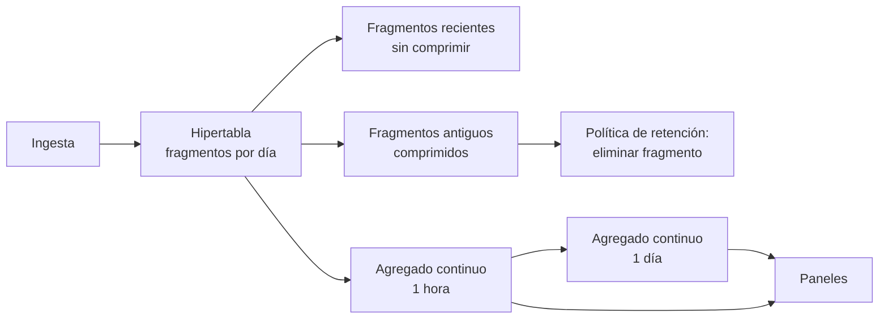

# 040 — Series temporales: cardinalidad, retención y agregados continuos

> [Programa](../../../README.md) · [Parte 07](../README.md) · [← Anterior](../../part-07-grafos-columnas-tiempo-y-busqueda/039-columnas-anchas-modelar-desde-la-consulta/README.md) · [Siguiente →](../../part-07-grafos-columnas-tiempo-y-busqueda/041-busqueda-de-texto-indice-invertido-y-relevancia/README.md)

Parte 07 — Grafos, columnas, tiempo y búsqueda · Intermedio ·
3 horas estimadas · motores `timescaledb`, `influxdb` · laboratorio
[`labs/04-indexing`](../../../labs/04-indexing/README.md) · 3 fuentes.

**Conceptos centrales:** `cardinalidad de etiquetas` · `submuestreo` · `retención` · `agregado continuo`

**En este caso se comparan 7 motores**: 6 lo resuelven (3 con el resultado comprobado por máquina) y 1 no, con el motivo escrito.

---

## Propósito

Diseñar almacenamiento para datos que llegan continuamente y se consultan por ventanas de tiempo, sin que la cardinalidad de las etiquetas destruya el sistema.

## Resultados de aprendizaje

Al terminar podrás:

1. Calcular la cardinalidad de una serie y detectar cuándo es insostenible.
2. Diseñar una política de retención por niveles con su ahorro estimado.
3. Explicar qué son las hipertablas y los agregados continuos.
4. Distinguir tiempo de evento de tiempo de ingesta y sus consecuencias.
5. Elegir entre una extensión sobre el relacional y un motor especializado.

## Fundamentos

### La cardinalidad es el número que decide

Una serie temporal se identifica por su métrica y el conjunto de sus etiquetas. La **cardinalidad** es el número de combinaciones distintas:

```text
cardinalidad = ∏ (valores distintos de cada etiqueta)
```

Ejemplo de laboratorio:

```text
métrica: latencia_consulta
etiquetas: servicio(20) × endpoint(50) × region(3) × metodo(4)
cardinalidad = 20 · 50 · 3 · 4 = 12 000 series      ← perfectamente manejable
```

Ahora alguien añade `user_id` como etiqueta, con 500 000 usuarios:

```text
cardinalidad = 12 000 · 500 000 = 6 000 000 000 series
```

Seis mil millones de series. El sistema no se pone lento: **deja de funcionar**, porque los índices de series no caben en memoria.

**Regla:** una etiqueta debe tener cardinalidad acotada y conocida. Identificadores de usuario, de petición, de sesión o marcas de tiempo **nunca** son etiquetas. Si hace falta ese detalle, corresponde a un registro de eventos, no a una serie temporal.

### Tiempo de evento frente a tiempo de ingesta

- **Tiempo de evento:** cuándo ocurrió realmente.
- **Tiempo de ingesta:** cuándo llegó al sistema.

Difieren por latencia de red, colas y dispositivos que estuvieron desconectados. Las consecuencias son concretas: un agregado por hora calculado al cerrar la hora pierde los datos que lleguen tarde; si se recalcula al llegar, un panel puede mostrar cifras distintas para la misma hora en dos momentos.

Se decide explícitamente: cuánto se espera a los rezagados y qué se hace con los que llegan después de ese plazo. Es el mismo problema de las marcas de agua de la clase 057.

### Retención por niveles

Nadie necesita resolución de un segundo sobre datos de hace dos años. La política habitual:

| Antigüedad | Resolución | Tamaño relativo |
|---|---|---|
| 0 – 7 días | 1 s (bruto) | 100 % |
| 7 – 90 días | 1 min | 1,7 % |
| 90 días – 2 años | 1 h | 0,03 % |
| > 2 años | 1 día | 0,001 % |

**Cálculo real** para 12 000 series a 1 medición/s y 16 bytes por punto:

```text
bruto 1 año:   12 000 · 31 536 000 · 16 B  ≈  6,0 PB      ← inviable
con niveles:
  7 días a 1s:   12 000 ·   604 800 · 16 B ≈  116 GB
  83 días a 1m:  12 000 ·   119 520 · 16 B ≈   23 GB
  275 días a 1h: 12 000 ·     6 600 · 16 B ≈  1,3 GB
  total                                     ≈  140 GB
```

De 6 petabytes a 140 gigabytes conservando lo que se consulta de verdad. La compresión específica de series (delta-of-delta para marcas de tiempo, XOR para valores) reduce eso otro orden de magnitud.

### Hipertablas y agregados continuos

TimescaleDB extiende PostgreSQL: una **hipertabla** se ve como una tabla y por dentro es un conjunto de fragmentos particionados por tiempo.

```sql
CREATE TABLE mediciones (
  medido_en TIMESTAMPTZ NOT NULL,
  sensor_id INTEGER     NOT NULL,
  valor     DOUBLE PRECISION NOT NULL
);
SELECT create_hypertable('mediciones', 'medido_en', chunk_time_interval => INTERVAL '1 day');
```

Ventajas de fragmentar por tiempo:

- Una consulta con filtro temporal descarta fragmentos enteros sin mirarlos (poda).
- Borrar datos antiguos es eliminar fragmentos, no un `DELETE` masivo que deja filas muertas.
- Los fragmentos antiguos se comprimen; los recientes se mantienen sin comprimir para escritura rápida.

```sql
ALTER TABLE mediciones SET (timescaledb.compress,
                            timescaledb.compress_segmentby = 'sensor_id');
SELECT add_compression_policy('mediciones', INTERVAL '7 days');
SELECT add_retention_policy('mediciones',   INTERVAL '2 years');
```

**Agregado continuo:** vista materializada que se refresca de forma incremental, solo sobre los fragmentos que cambiaron.

```sql
CREATE MATERIALIZED VIEW mediciones_hora
WITH (timescaledb.continuous) AS
SELECT time_bucket('1 hour', medido_en) AS hora,
       sensor_id, avg(valor) AS media, max(valor) AS maximo, count(*) AS n
FROM mediciones GROUP BY hora, sensor_id;

SELECT add_continuous_aggregate_policy('mediciones_hora',
  start_offset => INTERVAL '3 hours',   -- reprocesa 3 h: margen para rezagados
  end_offset   => INTERVAL '10 minutes',
  schedule_interval => INTERVAL '10 minutes');
```

El `start_offset` **es** la decisión sobre los rezagados: tres horas de margen antes de considerar cerrada una ventana.



## Ejemplo trabajado

Dominio: 800 sensores, una medición cada 10 s, consultas de panel sobre las últimas 24 h y comparativas anuales.

```text
puntos por día = 800 · 8 640 = 6 912 000
puntos por año ≈ 2 523 millones
```

**Sin diseño:** una tabla plana con índice en `(sensor_id, medido_en)`. La consulta de panel de 24 h sobre un sensor lee 8 640 filas: rápido. La comparativa anual sobre todos los sensores lee 2 523 millones: minutos, y el índice pesa más que los datos.

**Con hipertabla y agregados:**

| Consulta | Sobre | Filas leídas |
|---|---|---:|
| Panel 24 h, un sensor, bruto | hipertabla, 1 fragmento | 8 640 |
| Panel 30 días, un sensor | `mediciones_hora` | 720 |
| Comparativa anual, todos | `mediciones_dia` | 292 000 |
| Comparativa anual, bruto | hipertabla | 2 523 000 000 |

La última fila es la que justifica todo lo anterior: **cuatro órdenes de magnitud** por consultar el agregado adecuado.

**El error de cardinalidad, cuantificado.** Si se añadiera `numero_de_serie_del_lote` como etiqueta, con 200 000 valores distintos al año:

```text
antes:  800 series
después: 800 · 200 000 = 160 000 000 series
```

El índice de series pasa de kilobytes a decenas de gigabytes solo en metadatos. El dato del lote debe ir como **campo** (columna de valor), no como etiqueta: se guarda y se consulta, pero no multiplica el número de series.

Esta distinción entre etiqueta (indexada, define la serie) y campo (dato, no indexado) es la decisión de modelado central en InfluxDB y equivalentes.

## Comparación

| Opción | Ingesta | Consulta por ventana | Operación | Cuándo |
|---|---|---|---|---|
| PostgreSQL con índice | Buena | Degrada con el volumen | Simple | < 100 M puntos |
| TimescaleDB | Muy buena | Excelente con agregados | Simple: es PostgreSQL | Hasta miles de millones |
| InfluxDB | Excelente | Excelente | Sistema aparte | Métricas puras |
| ClickHouse | Excelente | Excelente | Sistema aparte | Analítica + series |
| Archivos Parquet + DuckDB | Por lotes | Muy buena | Mínima | Histórico frío |

## Errores frecuentes

1. **Etiquetas de cardinalidad no acotada.** El fallo más grave y el más común.
2. **Guardar todo en resolución máxima para siempre.** El costo crece linealmente y el valor no.
3. **`DELETE` masivo para purgar.** Deja filas muertas; hay que eliminar fragmentos.
4. **Ignorar los datos rezagados.** Los agregados quedan incompletos sin que nadie lo note.
5. **Consultar los datos brutos desde el panel.** Existiendo el agregado, es trabajo desperdiciado.
6. **Confundir etiqueta con campo.** Determina si el dato multiplica la cardinalidad.

## De la clase a la operación

El fallo por cardinalidad no avisa: el sistema funciona bien hasta que una versión nueva del emisor añade una etiqueta y, en horas, el almacén se satura. Un límite de cardinalidad vigilado y con alerta es tan necesario como el de espacio en disco.

## Reto de transferencia

1. Calcula la cardinalidad de una serie real tuya y la que tendría al añadir una etiqueta candidata.
2. Diseña la política de retención por niveles y calcula el ahorro en bytes.
3. Implementa una hipertabla con agregado continuo y compara la consulta anual antes y después.
4. Define el margen para rezagados y justifícalo con la latencia real de tu ingesta.

## Preguntas de evaluación

1. ¿Por qué un identificador de usuario nunca debe ser etiqueta?
2. Calcula el almacenamiento anual de tu serie con y sin retención por niveles.
3. Explica la diferencia entre tiempo de evento y de ingesta con un caso de tu sistema.
4. ¿Qué ventaja tiene eliminar un fragmento frente a un `DELETE` con filtro temporal?

---

## 🌐 El mismo problema en cada motor

**Caso:** Sumar las lecturas por hora, que es lo único que se mira de una serie

Nadie consulta una serie temporal lectura a lectura: se consulta por
ventanas. Sumar, promediar o contar por intervalos —el *bucketing*— es la
operación central, y todos los motores la resuelven; lo que cambia es si hay
que escribirla cada vez, si el resultado se mantiene solo y qué pasa con los
datos viejos.

El caso tiene cinco lecturas repartidas en dos horas y pide el total por
hora, ordenado. Las tres preguntas que la clase pone encima de la mesa —la
cardinalidad de las series, la retención de lo viejo y el agregado que se
mantiene al día— aparecen en el «por qué no» de cada motor, que es donde se
decide.

Salida esperada, idéntica en todos los motores que lo resuelven:

| hora | total |
|---|---|
| `2026-08-19 10:00` | `66` |
| `2026-08-19 11:00` | `45` |

El contrato vive en [`motores.yaml`](motores.yaml) y lo comprueba
`python scripts/verificar_equivalencia.py --clase 040`: 3 de
las 6 implementaciones se ejecutan de verdad y su
resultado se compara con esa tabla; el resto se declara como material revisado,
no ejecutado.

| Motor | ¿Resuelve el caso? | Nivel de prueba | Código | Fuente |
|---|---|---|---|---|
| TimescaleDB | sí | declarado | [código](implementaciones/timescaledb/consulta.sql) | [doc oficial](https://docs.timescale.com/use-timescale/latest/time-buckets/) |
| InfluxDB | sí | declarado | [código](implementaciones/influxdb/consulta.txt) | [doc oficial](https://docs.influxdata.com/influxdb/v2/write-data/best-practices/schema-design/) |
| PostgreSQL | sí | servicio | [código](implementaciones/postgresql/consulta.sql) | [doc oficial](https://www.postgresql.org/docs/current/functions-datetime.html) |
| DuckDB | sí | núcleo | [código](implementaciones/duckdb/consulta.sql) | [doc oficial](https://duckdb.org/docs/stable/sql/functions/timestamp.html) |
| SQLite | sí | núcleo | [código](implementaciones/sqlite/consulta.sql) | [doc oficial](https://sqlite.org/lang_datefunc.html) |
| ClickHouse | sí | declarado | [código](implementaciones/clickhouse/consulta.sql) | [doc oficial](https://clickhouse.com/docs/en/sql-reference/functions/date-time-functions) |
| MongoDB | **no** | — | — | [doc oficial](https://www.mongodb.com/docs/manual/reference/operator/aggregation/dateTrunc/) |

### Los que resuelven el caso

#### TimescaleDB · [`implementaciones/timescaledb/consulta.sql`](implementaciones/timescaledb/consulta.sql)

⚪ **declarado** — se revisa a mano contra la documentación citada; la máquina no lo ejecuta

```sql
-- motor: timescaledb
-- doc: https://docs.timescale.com/use-timescale/latest/time-buckets/
-- nota: implementacion declarada. Es PostgreSQL con la parte temporal resuelta:
--       hipertabla que particiona sola, time_bucket con ventanas arbitrarias,
--       agregado continuo que se mantiene al dia y politicas declarativas de
--       retencion y compresion. Todo lo de abajo sigue siendo SQL, y se puede
--       reunir con el resto del esquema.

-- === preparacion ===
CREATE EXTENSION IF NOT EXISTS timescaledb;

DROP TABLE IF EXISTS lecturas CASCADE;

CREATE TABLE lecturas (
    momento timestamptz NOT NULL,
    valor   integer NOT NULL
);
SELECT create_hypertable('lecturas', by_range('momento'));

INSERT INTO lecturas (momento, valor) VALUES
    ('2026-08-19 10:00:00+00', 20),
    ('2026-08-19 10:15:00+00', 21),
    ('2026-08-19 10:45:00+00', 25),
    ('2026-08-19 11:05:00+00', 22),
    ('2026-08-19 11:30:00+00', 23);

-- El agregado que NO hay que recalcular: se mantiene solo al llegar datos.
CREATE MATERIALIZED VIEW lecturas_por_hora
WITH (timescaledb.continuous) AS
SELECT time_bucket(INTERVAL '1 hour', momento) AS hora,
       SUM(valor) AS total
FROM lecturas
GROUP BY hora;

-- Y la retencion, declarada en vez de programada a mano:
SELECT add_retention_policy('lecturas', INTERVAL '90 days');

-- === consulta ===
SELECT to_char(hora, 'YYYY-MM-DD HH24:MI') AS hora, total
FROM lecturas_por_hora
ORDER BY hora;
```

- **Por qué sí:** Es PostgreSQL con la parte temporal resuelta: `time_bucket` para ventanas arbitrarias, hipertablas que particionan por tiempo sin que nadie lo administre, agregados continuos que se actualizan solos y políticas de retención y compresión declarativas. Y sigue siendo SQL, con reuniones contra el resto del esquema.
- **Por qué no:** Es una extensión: en un servicio administrado hay que comprobar que está disponible, y añade su propio ciclo de versiones sobre el de PostgreSQL. La compresión, además, hace las filas comprimidas más caras de modificar.
- 📄 Documentación oficial: <https://docs.timescale.com/use-timescale/latest/time-buckets/>

#### InfluxDB · [`implementaciones/influxdb/consulta.txt`](implementaciones/influxdb/consulta.txt)

⚪ **declarado** — se revisa a mano contra la documentación citada; la máquina no lo ejecuta

```text
# motor: influxdb
# doc: https://docs.influxdata.com/influxdb/v2/write-data/best-practices/schema-design/
# nota: implementacion declarada. Lo importante de este archivo no es la
#       consulta: es la linea de escritura de arriba.
#
#       En el protocolo de linea, lo que va antes del primer espacio son
#       ETIQUETAS (indexadas) y lo que va despues son CAMPOS (no indexados).
#       Cada combinacion distinta de valores de etiqueta crea una SERIE, y el
#       indice de series vive en memoria. Poner como etiqueta algo con muchos
#       valores distintos —un id de usuario, un id de peticion, una traza— es
#       el error que tumba servidores de InfluxDB, y no avisa: simplemente deja
#       de arrancar cuando el indice no cabe.
#
#       Regla: etiqueta lo que tenga POCOS valores distintos y sirva para
#       filtrar; deja como campo todo lo demas.

# === preparacion ===
# Escritura con el protocolo de linea (measurement,tags fields timestamp):
#   lecturas,sensor=sensor-1 valor=20 1787133600000000000
#   lecturas,sensor=sensor-1 valor=21 1787134500000000000
#   lecturas,sensor=sensor-1 valor=25 1787136300000000000
#   lecturas,sensor=sensor-1 valor=22 1787137500000000000
#   lecturas,sensor=sensor-1 valor=23 1787139000000000000

# === consulta ===
# Flux. La ventana es una primitiva del lenguaje, no una funcion sobre la fecha.
from(bucket: "telemetria")
  |> range(start: 2026-08-19T10:00:00Z, stop: 2026-08-19T12:00:00Z)
  |> filter(fn: (r) => r._measurement == "lecturas" and r._field == "valor")
  |> aggregateWindow(every: 1h, fn: sum, createEmpty: false)
  |> keep(columns: ["_time", "_value"])
```

- **Por qué sí:** Está construido solo para esto: escritura por lotes muy alta, compresión específica de series, retención por *bucket* y ventanas como primitiva del lenguaje. Para telemetría pura, el ajuste es directo.
- **Por qué no:** Aquí la cardinalidad manda: cada combinación distinta de etiquetas crea una serie, y un identificador único como etiqueta —un id de usuario, una traza— hace explotar la memoria del índice. Es el error clásico, y no avisa hasta que el servidor deja de arrancar. Además ha cambiado de lenguaje de consulta entre versiones mayores.
- 📄 Documentación oficial: <https://docs.influxdata.com/influxdb/v2/write-data/best-practices/schema-design/>

#### PostgreSQL · [`implementaciones/postgresql/consulta.sql`](implementaciones/postgresql/consulta.sql)

✅ **verificado** — se ejecuta contra el motor real levantado con `docker compose`

```sql
-- motor: postgresql
-- doc: https://www.postgresql.org/docs/current/functions-datetime.html
-- nota: la retencion barata no es DELETE, es DROP de una particion. Con
--       particionado declarativo por rango, tirar un mes entero cuesta lo mismo
--       que borrar un archivo:
--         CREATE TABLE lecturas (...) PARTITION BY RANGE (momento);
--         DROP TABLE lecturas_2026_07;

-- === preparacion ===
DROP TABLE IF EXISTS lecturas;

CREATE TABLE lecturas (
    momento timestamptz NOT NULL,
    valor   integer NOT NULL
);
INSERT INTO lecturas (momento, valor) VALUES
    (TIMESTAMPTZ '2026-08-19 10:00:00+00', 20),
    (TIMESTAMPTZ '2026-08-19 10:15:00+00', 21),
    (TIMESTAMPTZ '2026-08-19 10:45:00+00', 25),
    (TIMESTAMPTZ '2026-08-19 11:05:00+00', 22),
    (TIMESTAMPTZ '2026-08-19 11:30:00+00', 23);

-- === consulta ===
-- `AT TIME ZONE 'UTC'` fija la zona en la EXPRESION en vez de en la sesion. Si
-- dependiera de la sesion, la misma consulta agruparia en horas distintas segun
-- quien la lanzara, y ese es un error de informe muy dificil de ver.
SELECT to_char(date_trunc('hour', momento AT TIME ZONE 'UTC'),
               'YYYY-MM-DD HH24:MI') AS hora,
       SUM(valor) AS total
FROM lecturas
GROUP BY 1
ORDER BY 1;
```

- **Por qué sí:** `date_trunc` con `GROUP BY` resuelve el caso sin extensiones, y el particionado declarativo por rango permite tirar un mes entero con un `DROP TABLE` de la partición, que es la forma barata de la retención: borrar filas una a una es lo caro.
- **Por qué no:** Sin extensión no hay agregados que se mantengan solos ni compresión por columnas: una tabla de telemetría normal ocupa varias veces lo que ocuparía en un motor especializado, y el agregado se recalcula en cada consulta.
- 📄 Documentación oficial: <https://www.postgresql.org/docs/current/functions-datetime.html>

#### DuckDB · [`implementaciones/duckdb/consulta.sql`](implementaciones/duckdb/consulta.sql)

✅ **verificado** — se ejecuta en CI sin servicios

```sql
-- motor: duckdb
-- doc: https://duckdb.org/docs/stable/sql/functions/timestamp.html
-- nota: aqui la marca SI es un TIMESTAMP de verdad, y time_bucket admite
--       ventanas arbitrarias:
--         time_bucket(INTERVAL '15 minutes', momento)
--       La misma consulta funciona sobre un Parquet sin cargarlo.

-- === preparacion ===
CREATE TABLE lecturas (
    momento TIMESTAMP NOT NULL,
    valor   INTEGER NOT NULL
);
INSERT INTO lecturas VALUES
    ('2026-08-19 10:00:00', 20),
    ('2026-08-19 10:15:00', 21),
    ('2026-08-19 10:45:00', 25),
    ('2026-08-19 11:05:00', 22),
    ('2026-08-19 11:30:00', 23);

-- === consulta ===
SELECT strftime(time_bucket(INTERVAL '1 hour', momento), '%Y-%m-%d %H:%M') AS hora,
       SUM(valor) AS total
FROM lecturas
GROUP BY hora
ORDER BY hora;
```

- **Por qué sí:** Tiene `time_bucket` propio y agrega sobre millones de puntos en memoria: es la forma más rápida de explorar un histórico exportado a Parquet sin montar nada.
- **Por qué no:** No ingiere: no hay escritura continua, ni retención, ni agregados mantenidos. Analiza la serie; no la guarda.
- 📄 Documentación oficial: <https://duckdb.org/docs/stable/sql/functions/timestamp.html>

#### SQLite · [`implementaciones/sqlite/consulta.sql`](implementaciones/sqlite/consulta.sql)

✅ **verificado** — se ejecuta en CI sin servicios

```sql
-- motor: sqlite
-- doc: https://sqlite.org/lang_datefunc.html
-- nota: SQLite NO tiene tipo de fecha. Estas marcas son texto ISO-8601, que se
--       ordena y se compara bien por casualidad del formato. Mezclar texto ISO
--       con segundos desde la epoca en la misma columna no da error: da un
--       resultado equivocado.

-- === preparacion ===
CREATE TABLE lecturas (
    momento TEXT NOT NULL,
    valor   INTEGER NOT NULL
);
INSERT INTO lecturas (momento, valor) VALUES
    ('2026-08-19T10:00:00Z', 20),
    ('2026-08-19T10:15:00Z', 21),
    ('2026-08-19T10:45:00Z', 25),
    ('2026-08-19T11:05:00Z', 22),
    ('2026-08-19T11:30:00Z', 23);

-- === consulta ===
SELECT strftime('%Y-%m-%d %H:00', momento) AS hora,
       SUM(valor) AS total
FROM lecturas
GROUP BY hora
ORDER BY hora;
```

- **Por qué sí:** Con `strftime` se agrupa por hora sin nada más, lo que lo hace perfecto para telemetría **en el dispositivo**: guardar localmente lo que se mide y enviar solo el agregado.
- **Por qué no:** No tiene tipo de fecha: las marcas de tiempo son texto, números o segundos desde la época, y comparar dos formatos distintos no da error, da un resultado equivocado. La zona horaria hay que gestionarla entera a mano.
- 📄 Documentación oficial: <https://sqlite.org/lang_datefunc.html>

#### ClickHouse · [`implementaciones/clickhouse/consulta.sql`](implementaciones/clickhouse/consulta.sql)

⚪ **declarado** — se revisa a mano contra la documentación citada; la máquina no lo ejecuta

```sql
-- motor: clickhouse
-- doc: https://clickhouse.com/docs/en/sql-reference/functions/date-time-functions
-- nota: implementacion declarada. La vista materializada de ClickHouse no es
--       una copia que se refresca: es un disparador de insercion que agrega al
--       llegar los datos. El agregado nunca se recalcula.
--       El precio: corregir una lectura mal enviada no es un UPDATE, es una
--       mutacion asincrona que reescribe partes enteras.

-- === preparacion ===
CREATE TABLE lecturas (
    momento DateTime,
    valor   Int32
) ENGINE = MergeTree ORDER BY momento;

CREATE MATERIALIZED VIEW lecturas_por_hora
ENGINE = SummingMergeTree ORDER BY hora
AS SELECT toStartOfHour(momento) AS hora, SUM(valor) AS total
FROM lecturas GROUP BY hora;

INSERT INTO lecturas VALUES
    ('2026-08-19 10:00:00', 20),
    ('2026-08-19 10:15:00', 21),
    ('2026-08-19 10:45:00', 25),
    ('2026-08-19 11:05:00', 22),
    ('2026-08-19 11:30:00', 23);

-- === consulta ===
SELECT formatDateTime(hora, '%Y-%m-%d %H:%M') AS hora, SUM(total) AS total
FROM lecturas_por_hora
GROUP BY hora
ORDER BY hora;
```

- **Por qué sí:** `toStartOfHour` y las vistas materializadas que agregan al **insertar** dan el mismo resultado sin recalcular, y su compresión por columnas sobre datos temporales ordenados es de las mejores que existen. Es la opción cuando la serie tiene miles de millones de puntos.
- **Por qué no:** Actualizar o borrar puntos concretos es una operación pesada y asíncrona: corregir una lectura mal enviada no es un `UPDATE`, es una mutación que reescribe partes enteras.
- 📄 Documentación oficial: <https://clickhouse.com/docs/en/sql-reference/functions/date-time-functions>

### Los que no resuelven este caso — y qué se hace en su lugar

Descartar un motor con un argumento es tan formativo como usarlo. Ninguna de estas filas dice que el motor sea peor: dice que este problema no es el suyo.

| Motor | Por qué no | Qué se hace en su lugar | Fuente |
|---|---|---|---|
| MongoDB | Sus colecciones de series temporales resuelven bien el almacenamiento, pero para este caso concreto la comparación no aporta: la agregación por ventana se escribe con `$dateTrunc` y `$group`, que ya se estudió en la clase de agregación sobre documentos. | Se compara donde sí aporta —en el modelado por dispositivo y ventana, en la clase de columnas anchas— en vez de repetir aquí la misma tubería. | [doc](https://www.mongodb.com/docs/manual/reference/operator/aggregation/dateTrunc/) |

---

## Laboratorio

```bash
python scripts/validate_repository.py
python labs/04-indexing/run_indexing_lab.py
```

Guarda como evidencia la salida completa, la versión del motor y la semilla o
los parámetros usados. Una captura sin comando no es evidencia: no se puede
repetir.

## Evaluación

| Criterio | Peso | Qué se comprueba |
|---|---:|---|
| Comprensión conceptual | 25 % | Explica el mecanismo, no solo el resultado |
| Ejecución reproducible | 25 % | Otra persona obtiene lo mismo con las instrucciones dadas |
| Interpretación basada en evidencia | 25 % | Cada conclusión se apoya en una salida o una medición |
| Límites y riesgos declarados | 25 % | Dice qué no demuestra el ejercicio y qué faltaría en producción |

La clase se da por superada cuando la respuesta explica el mecanismo, muestra
la salida que la respalda y declara al menos un límite del ejercicio.

## Fuentes de esta clase

Todo lo afirmado arriba procede de estas obras. Los identificadores viven en
[`catalog/sources.json`](../../../catalog/sources.json) y el estado de los
enlaces se comprueba con `python scripts/check_external_links.py`.

- **Timescale, Inc.** (2026). [TimescaleDB Documentation](https://docs.timescale.com/).  
  Hipertablas, compresión y agregados continuos sobre PostgreSQL.
- **InfluxData** (2026). [InfluxDB Documentation](https://docs.influxdata.com/).  
  Modelo de medición, etiquetas y campos para series temporales.
- **Martin Kleppmann** (2017). [Designing Data-Intensive Applications](https://dataintensive.net/). O'Reilly. ISBN 978-1-4493-7332-0.  
  Referencia central del programa para replicación, partición, transacciones distribuidas y streaming.

---

> [Programa](../../../README.md) · [Parte 07](../README.md) · [← Anterior](../../part-07-grafos-columnas-tiempo-y-busqueda/039-columnas-anchas-modelar-desde-la-consulta/README.md) · [Siguiente →](../../part-07-grafos-columnas-tiempo-y-busqueda/041-busqueda-de-texto-indice-invertido-y-relevancia/README.md)
