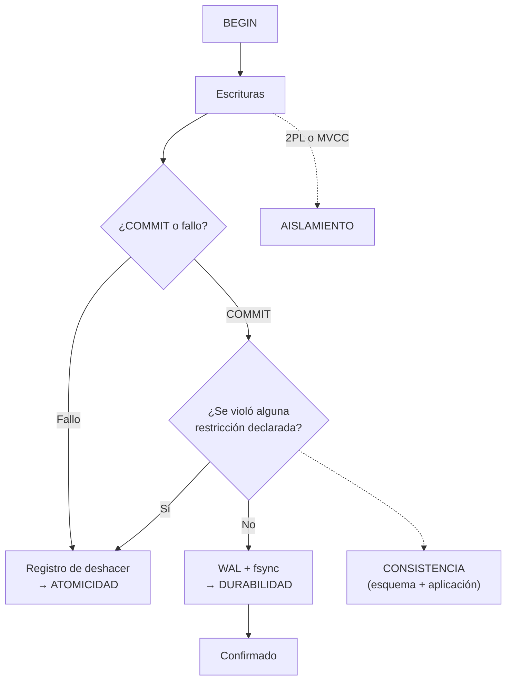

# 033 — ACID: qué garantiza cada letra y quién la implementa

> [Programa](../../../README.md) · [Parte 07](../README.md) · [← Anterior](../../part-06-grafos-columnas-tiempo-y-busqueda/032-analitica-columnar-y-vectorizacion/README.md) · [Siguiente →](../../part-07-transacciones-concurrencia-y-recuperacion/034-anomalias-de-aislamiento-y-la-critica-ansi/README.md)

Parte 07 — Transacciones, concurrencia y recuperación · Intermedio ·
3 horas estimadas · motores `postgresql`, `sqlite`, `mysql` · laboratorio
[`labs/03-transactions`](../../../labs/03-transactions/README.md) · 3 fuentes.

**Conceptos centrales:** `atomicidad` · `consistencia` · `aislamiento` · `durabilidad` · `unidad de recuperación`

---

## Propósito

Precisar qué garantiza cada letra de ACID, quién la implementa y qué queda fuera. «Usamos una base ACID» no significa que el sistema sea correcto: significa que existen unas garantías concretas si se usan bien.

## Resultados de aprendizaje

Al terminar podrás:

1. Definir con precisión atomicidad, consistencia, aislamiento y durabilidad.
2. Explicar por qué la C es distinta de las otras tres.
3. Identificar qué mecanismo del motor implementa cada letra.
4. Reconocer las garantías que se pierden por configuración.
5. Explicar por qué una transacción larga es un problema operativo.

## Fundamentos

### La transacción

Gray (1981) define la transacción como la unidad de trabajo que lleva la base de un estado consistente a otro, con la propiedad de que o se aplica entera o no se aplica nada. Es simultáneamente unidad de **recuperación**, de **concurrencia** y de **consistencia**.

### Las cuatro letras, una por una

**A — Atomicidad.** Todo o nada. Si la transacción falla o el proceso muere, no queda ningún efecto parcial. Lo implementa el registro de deshacer (*undo*): el motor guarda cómo revertir cada cambio antes de aplicarlo.

**C — Consistencia.** Aquí está la trampa pedagógica. Las otras tres letras son propiedades **del motor**; la C es una propiedad **de la aplicación y del esquema**. El motor solo garantiza las restricciones que alguien declaró (clase 013). Si nadie declaró que el saldo no puede ser negativo, ninguna transacción ACID lo impedirá.

Formulación honesta: *la atomicidad y el aislamiento permiten que la aplicación mantenga sus invariantes; la C es la afirmación de que las mantiene*.

**I — Aislamiento.** Las transacciones concurrentes producen un resultado equivalente a **alguna** ejecución en serie. Esa es la definición de serializabilidad, y es el nivel más fuerte. En la práctica casi todos los sistemas funcionan en niveles más débiles que **sí** permiten anomalías, y por defecto (clase 034). Lo implementan el bloqueo en dos fases o el control multiversión (clase 035).

**D — Durabilidad.** Una vez confirmada, la transacción sobrevive a fallos. Lo implementa el registro anticipado (clase 036). El matiz importante: durabilidad **frente a qué fallo**. Sobrevivir a la caída del proceso, a la de la máquina, a la pérdida del disco y a la del centro de datos son cuatro garantías distintas con cuatro costos distintos.

| Fallo | Mecanismo necesario |
|---|---|
| Caída del proceso | WAL escrito al sistema operativo |
| Caída de la máquina | `fsync` del WAL al disco |
| Pérdida del disco | Réplica o copia externa |
| Pérdida del centro de datos | Réplica geográficamente distante |
| Error humano (`DROP TABLE`) | Copia con recuperación a un punto en el tiempo |

Ninguna configuración de un solo nodo protege de las tres últimas.

### Garantías que se pierden por configuración

| Configuración | Qué se pierde |
|---|---|
| PostgreSQL `synchronous_commit = off` | Durabilidad: hasta ~0,2 s de transacciones confirmadas |
| PostgreSQL `fsync = off` | Durabilidad y posiblemente la integridad del archivo |
| MySQL `innodb_flush_log_at_trx_commit = 2` | Durabilidad ante caída de la máquina |
| MySQL con tablas MyISAM | **Todo**: no hay transacciones |
| Réplica asíncrona con conmutación | Las transacciones aún no replicadas |
| SQLite `synchronous = OFF` | Durabilidad e integridad ante corte de energía |

La primera y la tercera son decisiones legítimas para datos reconstruibles, y hay que **declararlas**, no heredarlas de un archivo de configuración copiado.



## Ejemplo trabajado

Transferencia entre cuentas, el caso canónico:

```sql
BEGIN;
UPDATE cuentas SET saldo = saldo - 300 WHERE id = 1;
UPDATE cuentas SET saldo = saldo + 300 WHERE id = 2;
COMMIT;
```

**Qué garantiza cada letra aquí:**

- **A:** si el proceso muere entre los dos `UPDATE`, ninguno queda aplicado. Los 300 no desaparecen.
- **I:** otra transferencia concurrente sobre la cuenta 1 no ve el estado intermedio ni provoca actualización perdida (con el nivel adecuado).
- **D:** tras el `COMMIT`, un corte de energía no deshace la operación.
- **C:** **nada**, salvo que se declare. Sin restricciones, esto se acepta:

```sql
BEGIN;
UPDATE cuentas SET saldo = saldo - 100000 WHERE id = 1;  -- saldo queda en -99 700
COMMIT;   -- ACID perfecto, negocio roto
```

La transacción es atómica, aislada y duradera, y deja un saldo imposible. La C exige escribirla:

```sql
ALTER TABLE cuentas ADD CONSTRAINT saldo_no_negativo CHECK (saldo >= 0);
```

Ahora sí: el `UPDATE` falla, la transacción se revierte y la atomicidad garantiza que no queda rastro.

**La invariante que un `CHECK` no cubre.** «La suma de todos los saldos es constante»: relaciona filas distintas y no hay `CHECK` estándar que lo exprese. Solo el aislamiento serializable garantiza que dos transferencias concurrentes no la rompan; en niveles más débiles hay que auditarla:

```sql
SELECT SUM(saldo) FROM cuentas;   -- debe coincidir con el total esperado
```

**Transacciones largas: el problema operativo.**

```sql
BEGIN;
SELECT * FROM enrollments;          -- el informe tarda 40 minutos
-- ... la sesión queda abierta ...
COMMIT;
```

Durante esos 40 minutos, en un motor MVCC:

- El motor **no puede** limpiar las versiones antiguas de fila, porque esta transacción podría necesitarlas. Las tablas se hinchan (clase 021).
- Con bloqueo (SQL Server en `READ COMMITTED` por defecto), además bloquea escritores.
- Si la transacción escribió algo, mantiene sus bloqueos todo ese tiempo.

Medición típica: una transacción abierta 40 minutos en una base con 2 000 actualizaciones por segundo impide recuperar ~4,8 millones de versiones de fila. La consecuencia se ve como «la base creció 30 GB de la nada».

**Regla operativa:** una transacción abarca las escrituras que deben ser atómicas y nada más. Nunca debe contener llamadas de red a servicios externos, esperas de usuario ni informes largos.

## Comparación

| Propiedad | La garantiza | Se pierde si |
|---|---|---|
| Atomicidad | Registro de deshacer | Casi nunca; el motor la sostiene |
| Consistencia | Esquema + aplicación | No se declaran las restricciones |
| Aislamiento | 2PL o MVCC | Nivel por defecto más débil que serializable |
| Durabilidad | WAL + `fsync` | Configuración de rendimiento; réplica asíncrona |

## Errores frecuentes

1. **Creer que la C la pone el motor.** La pone el esquema que se escribió.
2. **Suponer serializable por defecto.** Ningún motor de servidor lo hace por omisión.
3. **Transacciones que envuelven llamadas HTTP.** Un servicio lento hincha la base.
4. **Confiar en la durabilidad con réplica asíncrona y conmutación automática.** Se pierden transacciones confirmadas.
5. **Usar MyISAM y hablar de transacciones.** No las hay.
6. **No probar la restauración.** La durabilidad sin restauración probada es una suposición (clase 048).

## De la clase a la operación

«Somos ACID» es una respuesta incompleta a «¿pueden perder mi pedido?». La respuesta completa enumera: el nivel de aislamiento efectivo, la configuración de `fsync`, el modo de replicación y el resultado de la última prueba de restauración.

## Reto de transferencia

1. Determina el nivel de aislamiento y la configuración de durabilidad reales de tu base.
2. Escribe la invariante de negocio más importante y verifica si el esquema la garantiza.
3. Provoca un fallo a mitad de una transacción y demuestra la atomicidad.
4. Localiza la transacción más larga de tu sistema y estima su efecto sobre las versiones de fila.

## Preguntas de evaluación

1. ¿Por qué la C es de naturaleza distinta a A, I y D?
2. Da una invariante de tu dominio que ningún `CHECK` pueda expresar y di quién la vigila.
3. Enumera los cuatro fallos frente a los que puede exigirse durabilidad y el mecanismo de cada uno.
4. Explica el efecto de una transacción abierta durante una hora en un motor MVCC.

---

## Laboratorio

```bash
python scripts/validate_repository.py
python labs/03-transactions/run_transactions_lab.py
```

Guarda como evidencia la salida completa, la versión del motor y la semilla o
los parámetros usados. Una captura sin comando no es evidencia: no se puede
repetir.

## Evaluación

| Criterio | Peso | Qué se comprueba |
|---|---:|---|
| Comprensión conceptual | 25 % | Explica el mecanismo, no solo el resultado |
| Ejecución reproducible | 25 % | Otra persona obtiene lo mismo con las instrucciones dadas |
| Interpretación basada en evidencia | 25 % | Cada conclusión se apoya en una salida o una medición |
| Límites y riesgos declarados | 25 % | Dice qué no demuestra el ejercicio y qué faltaría en producción |

La clase se da por superada cuando la respuesta explica el mecanismo, muestra
la salida que la respalda y declara al menos un límite del ejercicio.

## Fuentes de esta clase

Todo lo afirmado arriba procede de estas obras. Los identificadores viven en
[`catalog/sources.json`](../../../catalog/sources.json) y el estado de los
enlaces se comprueba con `python scripts/check_external_links.py`.

- **Jim Gray** (1981). [The Transaction Concept: Virtues and Limitations](https://jimgray.azurewebsites.net/papers/thetransactionconcept.pdf). VLDB.  
  Define la transacción como unidad de consistencia y recuperación.
- **Jim Gray, Andreas Reuter** (1992). [Transaction Processing: Concepts and Techniques](https://www.sciencedirect.com/book/9781558601901/transaction-processing). Morgan Kaufmann. ISBN 978-1-55860-190-1.  
  Obra canónica sobre ACID, bloqueo, registro y recuperación.
- **Abraham Silberschatz, Henry F. Korth, S. Sudarshan** (2019). [Database System Concepts](https://db-book.com/). 7.a ed. McGraw-Hill. ISBN 978-0-07-802215-9.  
  Texto de referencia universitario. El sitio oficial publica diapositivas y capítulos de muestra.

---

> [Programa](../../../README.md) · [Parte 07](../README.md) · [← Anterior](../../part-06-grafos-columnas-tiempo-y-busqueda/032-analitica-columnar-y-vectorizacion/README.md) · [Siguiente →](../../part-07-transacciones-concurrencia-y-recuperacion/034-anomalias-de-aislamiento-y-la-critica-ansi/README.md)
