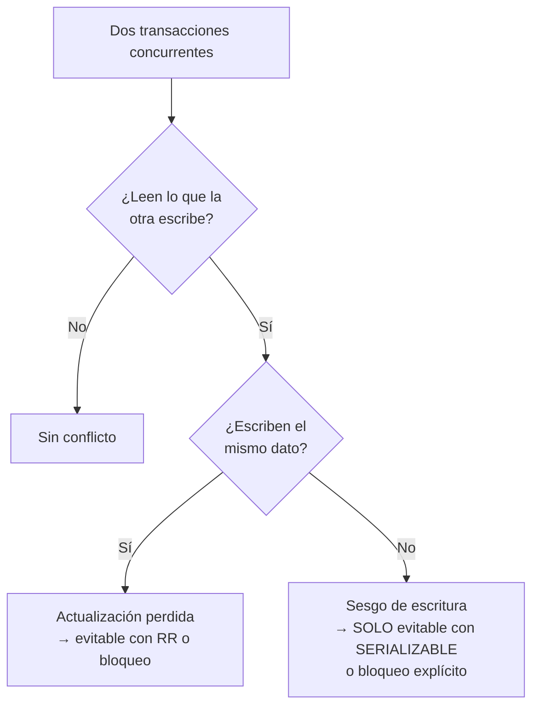

# 034 — Anomalías de aislamiento y la crítica a los niveles ANSI

> [Programa](../../../README.md) · [Parte 07](../README.md) · [← Anterior](../../part-07-transacciones-concurrencia-y-recuperacion/033-acid-que-garantiza-cada-letra/README.md) · [Siguiente →](../../part-07-transacciones-concurrencia-y-recuperacion/035-bloqueo-en-dos-fases-y-mvcc/README.md)

| | |
|---|---|
| **Parte** | 07 — Transacciones, concurrencia y recuperación |
| **Nivel** | Avanzado |
| **Horas estimadas** | 4 |
| **Motores** | `postgresql`, `mysql`, `sqlite` |
| **Laboratorio** | [`labs/03-transactions`](../../../labs/03-transactions/README.md) |
| **Fuentes** | 5 |

**Conceptos centrales:** `lectura sucia` · `lectura no repetible` · `fantasma` · `sesgo de escritura` · `snapshot isolation`

---

## Propósito

Reproducir las anomalías de concurrencia una por una y saber cuáles permite tu motor en su nivel por defecto. El nombre del nivel no basta: hay que comprobar el comportamiento.

## Resultados de aprendizaje

Al terminar podrás:

1. Reproducir cada anomalía con dos sesiones y una traza temporal.
2. Explicar por qué la norma ANSI define los niveles de forma ambigua.
3. Distinguir instantánea de serializable y describir el sesgo de escritura.
4. Comprobar empíricamente qué permite tu motor, con el método de Hermitage.
5. Elegir nivel de aislamiento con un criterio explícito.

## Fundamentos

### Las anomalías

| Anomalía | Qué ocurre |
|---|---|
| **P0 Escritura sucia** | Una transacción sobrescribe un dato no confirmado de otra |
| **P1 Lectura sucia** | Se lee un dato que después se revierte |
| **P2 Lectura no repetible** | Se lee dos veces el mismo dato y cambia |
| **P3 Fantasma** | Se repite una consulta de rango y aparecen filas nuevas |
| **P4 Actualización perdida** | Dos lecturas-modificaciones concurrentes; una se pierde |
| **A5A Lectura sesgada** | Se leen dos datos relacionados y se ve una combinación imposible |
| **A5B Sesgo de escritura** | Dos transacciones leen lo mismo, escriben cosas distintas y juntas rompen una invariante |

### La crítica de Berenson y otros

El artículo de 1995 demuestra que la norma ANSI SQL-92 define los niveles enumerando fenómenos prohibidos, y que esas definiciones son **ambiguas**: admiten una lectura estricta y otra laxa. Peor: no cubren el sesgo de escritura, así que un sistema puede ser conforme a `SERIALIZABLE` según la letra de la norma y permitir anomalías.

De ahí sale además la caracterización de **snapshot isolation** (aislamiento de instantánea), que la norma ni menciona y que hoy implementan PostgreSQL, Oracle y SQL Server.

Adya (1999) reformula las definiciones sin referirse a la implementación, mediante grafos de dependencias entre transacciones. Es la formulación que usan los verificadores modernos.

**Consecuencia práctica:** el nombre del nivel no dice qué garantiza. `REPEATABLE READ` significa cosas distintas en MySQL y en PostgreSQL.

### Lo que permite cada motor, de verdad

| Anomalía | PG `RC` | PG `RR` | PG `SER` | MySQL `RR` | SQLite |
|---|---|---|---|---|---|
| Lectura sucia | No | No | No | No | No |
| Lectura no repetible | **Sí** | No | No | No | No |
| Fantasma | **Sí** | No | No | No | No |
| Actualización perdida | **Sí** | No (aborta) | No | **Sí**\* | No |
| Sesgo de escritura | **Sí** | **Sí** | No | **Sí** | No |

\* MySQL `REPEATABLE READ` con lecturas normales; con `SELECT ... FOR UPDATE` se evita.

Dos hechos que importan:

- **PostgreSQL `REPEATABLE READ` es aislamiento de instantánea**, no la definición ANSI. No permite fantasmas —lo que la norma sí permitiría— y sí permite sesgo de escritura.
- **Solo `SERIALIZABLE` evita el sesgo de escritura.** PostgreSQL lo implementa con aislamiento de instantánea serializable (SSI), que detecta ciclos de dependencia y aborta una transacción.



## Ejemplo trabajado

### Actualización perdida

```text
Sesión A                              Sesión B
BEGIN;
SELECT saldo FROM c WHERE id=1;  1000
                                      BEGIN;
                                      SELECT saldo FROM c WHERE id=1;  1000
UPDATE c SET saldo=700 WHERE id=1;
COMMIT;
                                      UPDATE c SET saldo=500 WHERE id=1;
                                      COMMIT;
```

Resultado: 500. Correcto: 200.

| Nivel | Comportamiento |
|---|---|
| `READ COMMITTED` | Ocurre: B pisa a A |
| `REPEATABLE READ` (PG) | B aborta con `could not serialize access` |
| `READ COMMITTED` + `SELECT ... FOR UPDATE` | B espera a A y lee 700 |
| `UPDATE c SET saldo = saldo - 500` | El motor lee y escribe en una operación: no ocurre |

La última fila es la más importante: **una única sentencia atómica de lectura-modificación elimina la anomalía sin cambiar el nivel de aislamiento**. Es la solución más barata y la más ignorada.

### Sesgo de escritura

La anomalía que sobrevive al aislamiento de instantánea. Regla: *«siempre debe haber al menos un profesor asignado a cada curso»*. Hay dos, Ana y Luis, y ambos piden baja a la vez.

```text
Sesión A (Ana)                              Sesión B (Luis)
BEGIN ISOLATION LEVEL REPEATABLE READ;
SELECT COUNT(*) FROM teaching
  WHERE course_id='bd';           -- 2
                                            BEGIN ISOLATION LEVEL REPEATABLE READ;
                                            SELECT COUNT(*) FROM teaching
                                              WHERE course_id='bd';       -- 2
-- 2 >= 2, puedo darme de baja
DELETE FROM teaching
  WHERE course_id='bd' AND teacher_id=1;
                                            -- 2 >= 2, puedo darme de baja
                                            DELETE FROM teaching
                                              WHERE course_id='bd' AND teacher_id=2;
COMMIT;
                                            COMMIT;
```

**Resultado: cero profesores.** Ninguna transacción escribió sobre lo que la otra escribió —A borró la fila 1 y B la 2—, así que no hay conflicto de escritura que detectar. Cada una leyó un estado en el que su acción era válida y juntas rompieron la invariante.

Es el ejemplo canónico y el mejor argumento contra «con instantánea basta».

Tres soluciones:

```sql
-- 1. SERIALIZABLE: PostgreSQL detecta el ciclo y aborta una
BEGIN ISOLATION LEVEL SERIALIZABLE;
-- ... la segunda en confirmar recibe:
-- ERROR: could not serialize access due to read/write dependencies among transactions
```

```sql
-- 2. Materializar el conflicto: bloquear la fila padre
BEGIN;
SELECT id FROM courses WHERE id='bd' FOR UPDATE;   -- las dos compiten por ESTA fila
SELECT COUNT(*) FROM teaching WHERE course_id='bd';
DELETE FROM teaching WHERE course_id='bd' AND teacher_id=1;
COMMIT;
```

```sql
-- 3. Convertirlo en una restricción declarativa que el motor comprueba
--    (contador con CHECK, o restricción diferida: clase 013)
```

`SERIALIZABLE` es la solución correcta y tiene un costo: transacciones abortadas que la aplicación **debe** reintentar. Cualquier código que use `SERIALIZABLE` sin bucle de reintento está incompleto.

### Comprobarlo empíricamente

El método de Hermitage (Kleppmann) es un conjunto de guiones de dos sesiones, uno por anomalía, que se ejecutan contra cada motor y cada nivel. El resultado es una tabla de hechos, no de promesas de la documentación.

Reproducirlo con dos terminales sobre el `docker-compose` del repositorio es el laboratorio de esta clase.

## Comparación

| Nivel | Evita | Permite | Costo |
|---|---|---|---|
| `READ UNCOMMITTED` | — | Todo | Ninguno |
| `READ COMMITTED` | Lectura sucia | No repetible, fantasma, perdida, sesgo | Bajo |
| `REPEATABLE READ` / instantánea | + no repetible, fantasma, perdida | **Sesgo de escritura** | Abortos ocasionales |
| `SERIALIZABLE` | Todo | — | Abortos frecuentes con contención |

## Errores frecuentes

1. **Suponer que el nombre del nivel define el comportamiento.** Varía entre motores.
2. **Creer que instantánea es serializable.** El sesgo de escritura los separa.
3. **Usar `SERIALIZABLE` sin reintentos.** Los abortos son parte del contrato.
4. **Leer-modificar-escribir en la aplicación** cuando bastaría una sentencia atómica.
5. **Subir el nivel de aislamiento sin identificar la anomalía concreta.** Se paga contención sin saber qué se compró.
6. **Probar la concurrencia con una sola sesión.** No aparece nada.

## De la clase a la operación

El sesgo de escritura produce los datos imposibles que aparecen «una vez cada tantos meses» y nadie logra reproducir: dos reservas para la misma sala, un cupo excedido en uno, un turno sin nadie de guardia. Reconocer el patrón es la mitad del diagnóstico.

## Reto de transferencia

1. Reproduce la actualización perdida y el sesgo de escritura con dos sesiones, y captura ambas trazas.
2. Repite en dos motores y niveles distintos, y construye tu tabla de hechos.
3. Identifica en tu sistema una invariante vulnerable al sesgo de escritura.
4. Resuélvela de dos formas distintas y compara el costo en contención.

## Preguntas de evaluación

1. ¿Por qué el sesgo de escritura no lo detecta el aislamiento de instantánea?
2. Escribe una operación de tu sistema que hoy sea lectura-modificación-escritura y conviértela en atómica.
3. ¿Qué debe hacer la aplicación al recibir un error de serialización, y por qué no basta con reintentar sin límite?
4. Diseña el guion de dos sesiones que demuestre si tu motor permite fantasmas en su nivel por defecto.

---

## Laboratorio

```bash
python scripts/validate_repository.py
python labs/03-transactions/run_lab.py
```

Guarda como evidencia la salida completa, la versión del motor y la semilla o
los parámetros usados. Una captura sin comando no es evidencia: no se puede
repetir.

## Evaluación

| Criterio | Peso | Qué se comprueba |
|---|---:|---|
| Comprensión conceptual | 25 % | Explica el mecanismo, no solo el resultado |
| Ejecución reproducible | 25 % | Otra persona obtiene lo mismo con las instrucciones dadas |
| Interpretación basada en evidencia | 25 % | Cada conclusión se apoya en una salida o una medición |
| Límites y riesgos declarados | 25 % | Dice qué no demuestra el ejercicio y qué faltaría en producción |

La clase se da por superada cuando la respuesta explica el mecanismo, muestra
la salida que la respalda y declara al menos un límite del ejercicio.

## Fuentes de esta clase

Todo lo afirmado arriba procede de estas obras. Los identificadores viven en
[`catalog/sources.json`](../../../catalog/sources.json) y el estado de los
enlaces se comprueba con `python scripts/check_external_links.py`.

- **Hal Berenson, Phil Bernstein, Jim Gray, Jim Melton, Elizabeth O'Neil, Patrick O'Neil** (1995). [A Critique of ANSI SQL Isolation Levels](https://arxiv.org/abs/cs/0701157). ACM SIGMOD. DOI [10.1145/223784.223785](https://doi.org/10.1145/223784.223785).  
  Demuestra que los niveles de la norma no definen sin ambigüedad las anomalías e introduce snapshot isolation.
- **Atul Adya** (1999). [Weak Consistency: A Generalized Theory and Optimistic Implementations for Distributed Transactions](http://pmg.csail.mit.edu/papers/adya-phd.pdf). Tesis doctoral, MIT.  
  Definición de los fenomenos de aislamiento independiente de la implementación.
- **Martin Kleppmann** (2014). [Hermitage: Testing Transaction Isolation Levels](https://github.com/ept/hermitage).  
  Guion reproducible que muestra que anomalías permite cada motor en cada nivel.
- **PostgreSQL Global Development Group** (2026). [PostgreSQL: Concurrency Control](https://www.postgresql.org/docs/current/mvcc.html).  
  Niveles de aislamiento tal como los implementa PostgreSQL, no como los define la norma.
- **SQLite Consortium** (2026). [SQLite: Isolation](https://sqlite.org/isolation.html).  
  Que garantiza y que no garantiza SQLite entre conexiones.

---

> [Programa](../../../README.md) · [Parte 07](../README.md) · [← Anterior](../../part-07-transacciones-concurrencia-y-recuperacion/033-acid-que-garantiza-cada-letra/README.md) · [Siguiente →](../../part-07-transacciones-concurrencia-y-recuperacion/035-bloqueo-en-dos-fases-y-mvcc/README.md)
