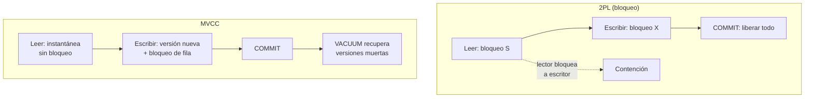

# 035 — Bloqueo en dos fases, MVCC e instantaneas

> [Programa](../../../README.md) · [Parte 07](../README.md) · [← Anterior](../../part-07-transacciones-concurrencia-y-recuperacion/034-anomalias-de-aislamiento-y-la-critica-ansi/README.md) · [Siguiente →](../../part-07-transacciones-concurrencia-y-recuperacion/036-registro-anticipado-y-recuperacion/README.md)

| | |
|---|---|
| **Parte** | 07 — Transacciones, concurrencia y recuperación |
| **Nivel** | Avanzado |
| **Horas estimadas** | 4 |
| **Motores** | `postgresql`, `mysql` |
| **Laboratorio** | [`labs/03-transactions`](../../../labs/03-transactions/README.md) |
| **Fuentes** | 3 |

**Conceptos centrales:** `2PL` · `versión de fila` · `instantánea` · `interbloqueo` · `vacuum`

---

## Propósito

Conocer los dos mecanismos con que los motores implementan el aislamiento —bloqueo y versiones— porque determinan qué operaciones se estorban entre sí y cómo se resuelve un interbloqueo.

## Resultados de aprendizaje

Al terminar podrás:

1. Explicar el bloqueo en dos fases y por qué garantiza serializabilidad.
2. Leer una matriz de compatibilidad de bloqueos.
3. Describir cómo MVCC decide qué versión de fila ve cada transacción.
4. Diagnosticar un interbloqueo y prevenirlo.
5. Explicar por qué MVCC necesita recolección de versiones muertas.

## Fundamentos

### Bloqueo en dos fases (2PL)

Dos reglas:

1. **Fase de crecimiento:** la transacción adquiere bloqueos y no libera ninguno.
2. **Fase de decrecimiento:** libera bloqueos y no adquiere ninguno.

En la práctica se usa **2PL estricto**: todos los bloqueos se liberan en el `COMMIT`. Eso evita además las lecturas sucias y las reversiones en cascada.

Matriz de compatibilidad, para bloqueos de fila:

| Tiene ↓ / Pide → | Compartido (S) | Exclusivo (X) |
|---|---|---|
| **Compartido (S)** | Compatible | Espera |
| **Exclusivo (X)** | Espera | Espera |

La consecuencia práctica en un motor con bloqueo puro (SQL Server en `READ COMMITTED` clásico): **los lectores bloquean a los escritores**. Un informe largo puede detener las escrituras.

### MVCC

En lugar de bloquear para leer, el motor guarda **varias versiones** de cada fila. Cada transacción ve una instantánea coherente.

En PostgreSQL, cada fila lleva `xmin` (transacción que la creó) y `xmax` (la que la borró o actualizó). Una transacción con instantánea `S` ve una versión si:

```text
xmin está confirmada y es visible en S,  y
xmax no existe, o no está confirmada, o no es visible en S
```

Un `UPDATE` no modifica: inserta una versión nueva y marca `xmax` en la anterior.

**La regla que resume MVCC: los lectores no bloquean a los escritores y los escritores no bloquean a los lectores.** Los escritores sí se bloquean entre sí sobre la misma fila.

Precio: las versiones muertas ocupan espacio hasta que `VACUUM` las recupera, y una transacción abierta impide recuperarlas (clase 033).

| Motor | Mecanismo |
|---|---|
| PostgreSQL | MVCC con versiones en la propia tabla + `VACUUM` |
| MySQL InnoDB | MVCC con versiones en el segmento de deshacer + bloqueo de siguiente clave |
| Oracle | MVCC con segmentos de deshacer |
| SQL Server | Bloqueo por defecto; MVCC con `READ_COMMITTED_SNAPSHOT` |
| SQLite | Instantánea por archivo; un escritor |

### Bloqueo de siguiente clave

MVCC evita los fantasmas en lectura, pero no basta para escrituras que dependen de un rango. InnoDB añade el **bloqueo de siguiente clave**: bloquea el registro y el hueco anterior en el índice, impidiendo insertar en ese rango.

```sql
SELECT * FROM enrollments WHERE course_id = 42 FOR UPDATE;
-- bloquea las filas existentes Y los huecos: nadie puede insertar con course_id = 42
```

Efecto secundario importante: si la consulta **no** usa un índice, InnoDB bloquea todas las filas examinadas, que pueden ser la tabla entera. Un `FOR UPDATE` sin índice adecuado convierte una operación puntual en un bloqueo global.

### Interbloqueo

```text
T1: bloquea fila A ... pide fila B
T2: bloquea fila B ... pide fila A
```

Ciclo de espera. El motor lo detecta y **aborta una** de las transacciones (la «víctima»). No es un error del motor: es su forma correcta de resolverlo.

Prevención, en orden de eficacia:

1. **Acceder siempre a los recursos en el mismo orden.** Si toda transacción bloquea las cuentas por identificador ascendente, no puede haber ciclo.
2. **Transacciones cortas.** Menos ventana para el ciclo.
3. **Bloquear lo mínimo.** `FOR UPDATE` solo sobre lo que se va a escribir, y con índice.
4. **Reintentar.** La víctima debe reintentar con retroceso; es parte del contrato.



## Ejemplo trabajado

### Interbloqueo reproducible

```text
Sesión A                                 Sesión B
BEGIN;
UPDATE cuentas SET saldo=saldo-100
  WHERE id=1;                            BEGIN;
                                         UPDATE cuentas SET saldo=saldo-50
                                           WHERE id=2;
UPDATE cuentas SET saldo=saldo+100
  WHERE id=2;      -- espera a B
                                         UPDATE cuentas SET saldo=saldo+50
                                           WHERE id=1;   -- espera a A → CICLO
```

PostgreSQL detecta el ciclo en ~1 s (`deadlock_timeout`) y aborta una:

```text
ERROR:  deadlock detected
DETAIL: Process 1234 waits for ShareLock on transaction 5678; blocked by process 5679.
HINT:   See server log for query details.
```

**Corrección por orden canónico:**

```python
def transferir(conn, origen, destino, monto):
    # Bloquear siempre por id ascendente: dos transferencias cruzadas
    # (1→2 y 2→1) piden los mismos bloqueos en el mismo orden y no hay ciclo.
    primero, segundo = sorted([origen, destino])
    with conn.transaction():
        conn.execute("SELECT id FROM cuentas WHERE id = %s FOR UPDATE", (primero,))
        conn.execute("SELECT id FROM cuentas WHERE id = %s FOR UPDATE", (segundo,))
        conn.execute("UPDATE cuentas SET saldo = saldo - %s WHERE id = %s", (monto, origen))
        conn.execute("UPDATE cuentas SET saldo = saldo + %s WHERE id = %s", (monto, destino))
```

Con el orden canónico, una de las dos espera y ambas terminan. Sin él, una muere y hay que reintentarla.

### MVCC en acción

```sql
-- Sesión A
BEGIN ISOLATION LEVEL REPEATABLE READ;
SELECT COUNT(*) FROM enrollments;   -- 240 000

-- Sesión B (concurrente)
INSERT INTO enrollments VALUES (...);   -- 1 000 filas
COMMIT;

-- Sesión A, otra vez
SELECT COUNT(*) FROM enrollments;   -- 240 000  ← sigue viendo su instantánea
COMMIT;
SELECT COUNT(*) FROM enrollments;   -- 241 000
```

Ninguna de las dos sesiones esperó a la otra. Ese es todo el valor de MVCC.

**El precio, medido.** Durante la transacción de A, las versiones antiguas no se pueden recuperar:

```sql
SELECT relname, n_dead_tup, last_autovacuum FROM pg_stat_user_tables
WHERE relname = 'enrollments';
```

Con 2 000 actualizaciones por segundo y una transacción de A abierta 30 minutos, se acumulan ~3,6 millones de versiones muertas que ningún vacuum puede retirar hasta que A termine. La tabla crece, los barridos leen páginas casi vacías y el rendimiento cae de forma sostenida.

**Diagnóstico de transacciones largas:**

```sql
SELECT pid, state, now() - xact_start AS duracion, query
FROM pg_stat_activity
WHERE state <> 'idle' AND xact_start IS NOT NULL
ORDER BY duracion DESC LIMIT 5;
```

Es la primera consulta que ejecutar cuando una base «crece sin motivo».

## Comparación

| Dimensión | 2PL puro | MVCC |
|---|---|---|
| Lector frente a escritor | Se bloquean | No se bloquean |
| Escritor frente a escritor | Se bloquean | Se bloquean |
| Coste en espacio | Bajo | Versiones + recolección |
| Interbloqueos | Frecuentes | Menos, pero existen |
| Lecturas consistentes | Con bloqueo largo | Gratis, por instantánea |
| Problema operativo típico | Contención | Hinchazón por transacción larga |

## Errores frecuentes

1. **`SELECT ... FOR UPDATE` sin índice.** Bloquea todas las filas examinadas.
2. **Orden de acceso inconsistente.** Fabrica interbloqueos evitables.
3. **No reintentar la víctima.** El interbloqueo llega al usuario como error.
4. **Transacciones largas en un motor MVCC.** Impiden la recolección.
5. **Suponer que MVCC elimina el bloqueo.** Los escritores siguen compitiendo por la misma fila.
6. **Bloquear el padre cuando bastaba una sentencia atómica.**

## De la clase a la operación

Los interbloqueos aumentan de golpe tras un despliegue que cambió el orden de las escrituras. Registrar el grafo de espera y el orden de acceso de cada transacción convierte un problema intermitente en uno reproducible.

## Reto de transferencia

1. Provoca un interbloqueo con dos sesiones y captura el mensaje del motor.
2. Corrígelo con orden canónico y demuestra que ya no ocurre.
3. Mide `n_dead_tup` antes, durante y después de una transacción larga.
4. Compara el mismo escenario en un motor con bloqueo y en uno con MVCC.

## Preguntas de evaluación

1. ¿Por qué el 2PL estricto evita las reversiones en cascada?
2. Explica con `xmin`/`xmax` por qué la sesión A sigue viendo 240 000 filas.
3. ¿Qué bloquea exactamente `FOR UPDATE` sobre una consulta sin índice en InnoDB?
4. Da dos transacciones de tu sistema que podrían formar un ciclo y define su orden canónico.

---

## Laboratorio

```bash
python scripts/validate_repository.py
python labs/03-transactions/run_lab.py
```

Guarda como evidencia la salida completa, la versión del motor y la semilla o
los parámetros usados. Una captura sin comando no es evidencia: no se puede
repetir.

## Evaluación

| Criterio | Peso | Qué se comprueba |
|---|---:|---|
| Comprensión conceptual | 25 % | Explica el mecanismo, no solo el resultado |
| Ejecución reproducible | 25 % | Otra persona obtiene lo mismo con las instrucciones dadas |
| Interpretación basada en evidencia | 25 % | Cada conclusión se apoya en una salida o una medición |
| Límites y riesgos declarados | 25 % | Dice qué no demuestra el ejercicio y qué faltaría en producción |

La clase se da por superada cuando la respuesta explica el mecanismo, muestra
la salida que la respalda y declara al menos un límite del ejercicio.

## Fuentes de esta clase

Todo lo afirmado arriba procede de estas obras. Los identificadores viven en
[`catalog/sources.json`](../../../catalog/sources.json) y el estado de los
enlaces se comprueba con `python scripts/check_external_links.py`.

- **Jim Gray, Andreas Reuter** (1992). [Transaction Processing: Concepts and Techniques](https://www.sciencedirect.com/book/9781558601901/transaction-processing). Morgan Kaufmann. ISBN 978-1-55860-190-1.  
  Obra canónica sobre ACID, bloqueo, registro y recuperación.
- **PostgreSQL Global Development Group** (2026). [PostgreSQL: Concurrency Control](https://www.postgresql.org/docs/current/mvcc.html).  
  Niveles de aislamiento tal como los implementa PostgreSQL, no como los define la norma.
- **Egor Rogov** (2022). [PostgreSQL 14 Internals](https://postgrespro.com/community/books/internals). Postgres Professional. ISBN 978-5-6041193-2-8.  
  PDF gratuito. MVCC, vacuum, buffers, índices y planificador sobre el código real.

---

> [Programa](../../../README.md) · [Parte 07](../README.md) · [← Anterior](../../part-07-transacciones-concurrencia-y-recuperacion/034-anomalias-de-aislamiento-y-la-critica-ansi/README.md) · [Siguiente →](../../part-07-transacciones-concurrencia-y-recuperacion/036-registro-anticipado-y-recuperacion/README.md)
