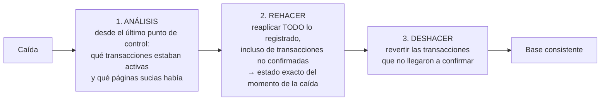

# 036 — Registro anticipado y recuperación: WAL y ARIES

> [Programa](../../../README.md) · [Parte 07](../README.md) · [← Anterior](../../part-07-transacciones-concurrencia-y-recuperacion/035-bloqueo-en-dos-fases-y-mvcc/README.md) · [Siguiente →](../../part-07-transacciones-concurrencia-y-recuperacion/037-concurrencia-en-la-aplicacion/README.md)

Parte 07 — Transacciones, concurrencia y recuperación · Avanzado ·
4 horas estimadas · motores `postgresql`, `sqlite` · laboratorio
[`labs/03-transactions`](../../../labs/03-transactions/README.md) · 3 fuentes.

**Conceptos centrales:** `WAL` · `punto de control` · `rehacer` · `deshacer` · `LSN`

**En este caso se comparan 7 motores**: 6 lo resuelven (0 con el resultado comprobado por máquina) y 1 no, con el motivo escrito.

---

## Propósito

Entender cómo un motor sobrevive a una caída: el registro anticipado y el algoritmo de recuperación. Es el mecanismo que hace real la D de ACID, y explica muchas decisiones de configuración.

## Resultados de aprendizaje

Al terminar podrás:

1. Enunciar la regla del registro anticipado y por qué es necesaria.
2. Describir las tres fases de ARIES y qué garantiza cada una.
3. Explicar qué es un punto de control y qué acorta.
4. Relacionar `fsync` con la durabilidad real ante cada tipo de fallo.
5. Leer el modo WAL de SQLite como ejemplo completo y pequeño.

## Fundamentos

### La regla

**Antes de escribir una página modificada al disco, debe estar en disco el registro que describe esa modificación.**

Sin esa regla no hay recuperación posible: si la página llegara antes que el registro, tras una caída habría un cambio en los datos del que no queda constancia de a qué transacción pertenece, y no se sabría si deshacerlo.

Escribir el registro es barato (secuencial, al final del archivo); escribir las páginas es caro (aleatorio). Por eso el motor confirma la transacción cuando el registro está a salvo y aplaza las páginas.

### ARIES: las tres fases

Mohan et al. (1992) definen el algoritmo que implementan casi todos los motores. Cada registro lleva un **LSN** (número de secuencia), y cada página guarda el LSN del último cambio que la afectó.



El punto que sorprende: la fase de rehacer **reaplica también cambios de transacciones que no se confirmaron**. Se llama *repeating history*. Reconstruye el estado exacto del instante de la caída y solo después deshace lo que corresponde. Es más simple y más robusto que intentar filtrar durante el rehacer.

Los registros de compensación (CLR) registran el propio deshacer, de forma que si el sistema cae **durante** la recuperación, la siguiente no repite trabajo ya deshecho. Es lo que hace la recuperación idempotente.

### Puntos de control

Sin ellos, la recuperación tendría que leer el registro desde el principio de los tiempos. Un punto de control anota el estado en un instante; la recuperación empieza ahí.

| Parámetro | Efecto de aumentarlo |
|---|---|
| Intervalo entre puntos de control | Menos E/S en marcha, **recuperación más larga** |
| Tamaño máximo del registro | Ídem |

Es un compromiso explícito entre rendimiento normal y tiempo de recuperación (RTO, clase 048). Un sistema con puntos de control cada hora puede tardar mucho en volver.

### `fsync`: durabilidad frente a qué

Escribir en un archivo no lo pone en el disco: lo deja en la caché del sistema operativo. `fsync` fuerza el volcado.

| Configuración | Caída del proceso | Caída de la máquina |
|---|---|---|
| Sin `fsync` en el commit | Sobrevive | **Se pierden transacciones confirmadas** |
| Con `fsync` en el commit | Sobrevive | Sobrevive |
| `fsync` + disco que miente sobre su caché | Sobrevive | **Puede perderse o corromperse** |

La tercera fila es real: discos de consumo con caché de escritura sin respaldo de energía confirman `fsync` antes de haber escrito. Es la razón por la que el hardware de servidor lleva caché con batería.

| Motor | Parámetro | Valor seguro |
|---|---|---|
| PostgreSQL | `synchronous_commit` | `on` |
| PostgreSQL | `fsync` | `on` (nunca `off` en producción) |
| MySQL | `innodb_flush_log_at_trx_commit` | `1` |
| SQLite | `synchronous` | `FULL`, o `NORMAL` con WAL |

### WAL en SQLite

SQLite es lo bastante pequeño para leer su mecanismo completo. En modo WAL:

- Los cambios se añaden al archivo `-wal`; el archivo principal no se toca en el momento del commit.
- Los lectores consultan un índice en memoria compartida (`-shm`) para saber qué páginas leer del WAL y cuáles del archivo principal.
- Un **checkpoint** traslada las páginas del WAL al archivo principal.

De ahí que `synchronous = NORMAL` sea seguro con WAL frente a la caída del proceso pero no frente a un corte de energía: el WAL no se sincroniza en cada commit, solo en los checkpoints.

## Ejemplo trabajado

Traza de una transacción y su recuperación.

```text
LSN  Registro
100  BEGIN T1
101  T1: UPDATE cuentas id=1  saldo 1000 -> 700   [undo: 1000] [redo: 700]
102  BEGIN T2
103  T2: UPDATE cuentas id=2  saldo  500 -> 800   [undo: 500]  [redo: 800]
104  T1: UPDATE cuentas id=2  saldo  800 -> 900   (espera: fila bloqueada por T2)
105  COMMIT T2                      <- fsync aquí
106  CHECKPOINT (activas: T1)
107  T1: UPDATE cuentas id=2  saldo  800 -> 900   [undo: 800] [redo: 900]
     *** CAÍDA ***   T1 nunca confirmó
```

**Recuperación:**

```text
ANÁLISIS   desde LSN 106: T1 activa, sin COMMIT. Páginas sucias: cuentas(1), cuentas(2)
REHACER    reaplica 107 (y 101, 103 si sus páginas no estaban en disco)
           estado tras rehacer: id=1 -> 700, id=2 -> 900     (incluye cambios de T1)
DESHACER   T1 no confirmó: revertir 107 y 101 usando la información de deshacer
           107 deshecho -> id=2 vuelve a 800   (CLR con LSN 108)
           101 deshecho -> id=1 vuelve a 1000  (CLR con LSN 109)
```

**Estado final:** `id=1 → 1000` (T1 revertida), `id=2 → 800` (T2 confirmada y conservada). Exactamente lo que ACID promete: T2 duradera, T1 como si nunca hubiera ocurrido.

Obsérvese que la fase de rehacer dejó momentáneamente `id=2 = 900`, un valor de una transacción no confirmada. No es un error: es el estado del instante de la caída, que la fase de deshacer corrige.

**Comprobación en SQLite:**

```bash
python - <<'PY'
import sqlite3, os
con = sqlite3.connect('demo.db')
con.execute('PRAGMA journal_mode=WAL')
con.execute('CREATE TABLE IF NOT EXISTS cuentas(id INTEGER PRIMARY KEY, saldo INTEGER)')
con.execute('INSERT OR REPLACE INTO cuentas VALUES (1, 1000)')
con.commit()
con.execute('BEGIN')
con.execute('UPDATE cuentas SET saldo = 700 WHERE id = 1')
print('WAL existe:', os.path.exists('demo.db-wal'))   # los cambios están en el WAL
os._exit(1)                                            # muerte del proceso, sin COMMIT
PY
sqlite3 demo.db "SELECT saldo FROM cuentas WHERE id=1;"   # 1000: la transacción se revirtió
```

El archivo `-wal` es visible durante la transacción y la reapertura ejecuta la recuperación automáticamente.

## Comparación

| Fallo | Qué lo cubre |
|---|---|
| Reversión de una transacción | Registro de deshacer, en marcha |
| Caída del proceso | Registro en la caché del sistema operativo |
| Caída de la máquina | `fsync` del registro en el commit |
| Corrupción de página | Suma de comprobación + copia + registro |
| Pérdida del disco | Réplica o copia externa (clase 048) |
| Error humano | Recuperación a un punto en el tiempo |

## Errores frecuentes

1. **`fsync = off` en producción.** Se descubre en el primer corte de energía.
2. **Puntos de control muy espaciados sin medir el RTO.** La recuperación tarda más de lo que el negocio tolera.
3. **Confundir el registro del motor con el registro de la aplicación.** Son cosas distintas con propósitos distintos.
4. **No vigilar el espacio del WAL.** Una réplica detenida impide reciclarlo y llena el disco.
5. **Suponer que el WAL es una copia de seguridad.** Lo es solo junto con una copia base.
6. **Almacenamiento que miente sobre `fsync`.** La durabilidad depende del hardware.

## De la clase a la operación

El WAL es también la base de la replicación (clase 043) y de la captura de cambios (clase 056): el mismo flujo que permite recuperarse permite que otro nodo reproduzca los cambios. Entenderlo aquí ahorra explicarlo tres veces más adelante.

## Reto de transferencia

1. Reproduce el experimento de SQLite y observa los archivos `-wal` y `-shm`.
2. Mata el proceso a mitad de una transacción y demuestra que la base queda consistente.
3. Mide el tiempo de recuperación con dos intervalos de punto de control distintos.
4. Documenta la configuración de durabilidad de tu sistema y qué se pierde en cada tipo de fallo.

## Preguntas de evaluación

1. ¿Por qué el registro debe llegar al disco antes que la página de datos?
2. Explica por qué la fase de rehacer reaplica transacciones que no se confirmaron.
3. ¿Qué función cumplen los registros de compensación si el sistema cae durante la recuperación?
4. Con `synchronous_commit = off`, ¿qué se pierde exactamente y ante qué fallo?

---

## 🌐 El mismo problema en cada motor

**Caso:** Qué se escribe primero para que un corte de luz no pierda nada

La durabilidad no se consigue escribiendo los datos: se consigue escribiendo
**la intención** antes que los datos. Esa es la regla del registro
anticipado: el cambio se anota en un registro secuencial y se fuerza a disco
**antes** de tocar las páginas de datos, que pueden esperar. Al arrancar tras
una caída, el motor rehace lo confirmado y deshace lo que no llegó a
confirmarse. ARIES puso nombre a ese protocolo en 1992 y sigue siendo el
esquema de casi todos.

Lo que hay que comparar aquí no es si cada motor lo tiene —lo tienen casi
todos— sino **el parámetro con el que se cambia durabilidad por
rendimiento**. Ese parámetro existe en todos y casi nadie lo declara al decir
«nuestra base de datos es ACID».

Esta comparación es **conceptual**: la decisión no se reduce a una consulta con
resultado, así que aquí no hay sello de máquina. Lo que se compara es lo que
cada motor **ofrece** y a qué precio, con la página oficial al lado de cada
afirmación.

| Motor | ¿Resuelve el caso? | Nivel de prueba | Código | Fuente |
|---|---|---|---|---|
| PostgreSQL | sí | conceptual | — | [doc oficial](https://www.postgresql.org/docs/current/wal-intro.html) |
| MySQL | sí | conceptual | — | [doc oficial](https://dev.mysql.com/doc/refman/8.4/en/innodb-parameters.html) |
| SQLite | sí | conceptual | — | [doc oficial](https://sqlite.org/wal.html) |
| Redis | sí | conceptual | — | [doc oficial](https://redis.io/docs/latest/operate/oss_and_stack/management/persistence/) |
| MongoDB | sí | conceptual | — | [doc oficial](https://www.mongodb.com/docs/manual/reference/write-concern/) |
| Apache Cassandra | sí | conceptual | — | [doc oficial](https://cassandra.apache.org/doc/latest/cassandra/managing/configuration/cass_yaml_file.html) |
| DuckDB | **no** | — | — | [doc oficial](https://duckdb.org/docs/stable/internals/storage.html) |

### Los que resuelven el caso

#### PostgreSQL

- **Cómo se hace aquí:** Registro anticipado (WAL) con puntos de control periódicos. `fsync = on` y `synchronous_commit = on` de fábrica: la confirmación no vuelve hasta que el registro está en disco. El mismo WAL sirve para la réplica y para la recuperación a un punto en el tiempo.
- **Por qué sí:** Un solo mecanismo cubre durabilidad, réplica y respaldo continuo, y se puede aflojar **por transacción**: las escrituras críticas síncronas y las accesorias asíncronas, en la misma aplicación.
- **Por qué no:** `synchronous_commit = off` multiplica el rendimiento y abre una ventana de pérdida de transacciones ya confirmadas; y `fsync = off` puede corromper la base entera. Los dos existen, los dos se usan, y casi nunca se documentan en el sitio donde alguien los vaya a leer.
- 📄 Documentación oficial: <https://www.postgresql.org/docs/current/wal-intro.html>

#### MySQL

- **Cómo se hace aquí:** InnoDB escribe en el registro de rehacer y usa además el **búfer de doble escritura** para protegerse de páginas escritas a medias. El parámetro clave es `innodb_flush_log_at_trx_commit`: 1 vuelca en cada confirmación, 2 vuelca al sistema operativo y 0 vuelca una vez por segundo.
- **Por qué sí:** Tener tres niveles explícitos permite decidir con conocimiento: 2 es un punto intermedio razonable si lo que puede caerse es el proceso y no la máquina.
- **Por qué no:** El valor 2 —y sobre todo el 0— significan perder hasta un segundo de transacciones **confirmadas**. Muchas guías de rendimiento lo recomiendan sin decir eso, y aparece en sistemas de facturación.
- 📄 Documentación oficial: <https://dev.mysql.com/doc/refman/8.4/en/innodb-parameters.html>

#### SQLite

- **Cómo se hace aquí:** Dos modos. El diario de reversión clásico guarda las páginas originales antes de modificarlas; el modo WAL escribe los cambios en un archivo aparte y consolida con puntos de control. `PRAGMA synchronous` decide si se fuerza a disco: `FULL` es durable, `NORMAL` en modo WAL puede perder las últimas transacciones.
- **Por qué sí:** Su implementación está entre las más probadas que existen —hay una batería de pruebas de fallo con cortes simulados— y funciona en dispositivos sin administrador.
- **Por qué no:** La durabilidad depende de que el sistema de archivos no mienta al confirmar la escritura, y varios lo hacen (montajes en red, algunos teléfonos). El motor cumple; la capa de abajo a veces no.
- 📄 Documentación oficial: <https://sqlite.org/wal.html>

#### Redis

- **Cómo se hace aquí:** Dos mecanismos combinables: instantáneas RDB —una copia completa cada cierto número de cambios— y AOF, un registro de las órdenes recibidas. `appendfsync` decide cuándo se fuerza: `always`, `everysec` (el valor por omisión) o `no`.
- **Por qué sí:** Deja explícito que la durabilidad es una **elección**, no una promesa: se puede ir desde ninguna hasta forzar en cada orden, y el costo de cada opción es visible.
- **Por qué no:** El valor por omisión, `everysec`, significa hasta un segundo de escrituras perdidas. Redis se usa como caché precisamente porque eso suele dar igual; el problema aparece cuando alguien empieza a guardar ahí lo que no puede perder.
- 📄 Documentación oficial: <https://redis.io/docs/latest/operate/oss_and_stack/management/persistence/>

#### MongoDB

- **Cómo se hace aquí:** WiredTiger escribe un **diario** con puntos de control cada 60 segundos, y la garantía real de una escritura la fija `writeConcern`: `w: "majority"` con `j: true` significa que la mayoría de las réplicas lo tiene y lo ha escrito en su diario.
- **Por qué sí:** La durabilidad se decide por operación y no por servidor: la escritura que importa puede exigir mayoría mientras el resto va rápido.
- **Por qué no:** Con `w: 1`, una escritura se da por hecha cuando la tiene **un** nodo, y una conmutación por error puede revertirla: la operación tuvo éxito para el cliente y no existe en la base. Es la clase de pérdida más difícil de explicar después.
- 📄 Documentación oficial: <https://www.mongodb.com/docs/manual/reference/write-concern/>

#### Apache Cassandra

- **Cómo se hace aquí:** Cada nodo escribe en su **registro de compromiso** y en una tabla en memoria; el registro se vuelca según `commitlog_sync`, que por omisión es periódico cada 10 ms. La durabilidad real, sin embargo, la da la replicación: con `QUORUM`, el dato está en varios nodos antes de contestar.
- **Por qué sí:** Reparte la garantía entre varias máquinas en vez de confiarla al disco de una: la pérdida de un nodo entero no pierde datos.
- **Por qué no:** Con `commitlog_sync` periódico, un corte de corriente simultáneo en varios nodos puede perder los últimos milisegundos. Y la reparación de lo que quedó desincronizado no es automática: hay que ejecutar reparaciones periódicas, y olvidarlas es una de las averías clásicas del motor.
- 📄 Documentación oficial: <https://cassandra.apache.org/doc/latest/cassandra/managing/configuration/cass_yaml_file.html>

### Los que no resuelven este caso — y qué se hace en su lugar

Descartar un motor con un argumento es tan formativo como usarlo. Ninguna de estas filas dice que el motor sea peor: dice que este problema no es el suyo.

| Motor | Por qué no | Qué se hace en su lugar | Fuente |
|---|---|---|---|
| DuckDB | Tiene registro anticipado sobre su archivo, pero compararlo aquí no enseña nada nuevo: no hay réplica que alimentar con ese registro, ni recuperación a un punto en el tiempo, ni parámetros de durabilidad que decidir. | En analítica la recuperación no se hace con el registro: se hace **reconstruyendo** desde el origen, que es la copia de verdad. Se trata en la parte de integración. | [doc](https://duckdb.org/docs/stable/internals/storage.html) |

---

## Laboratorio

```bash
python scripts/validate_repository.py
python labs/03-transactions/run_transactions_lab.py
```

Guarda como evidencia la salida completa, la versión del motor y la semilla o
los parámetros usados. Una captura sin comando no es evidencia: no se puede
repetir.

## Evaluación

| Criterio | Peso | Qué se comprueba |
|---|---:|---|
| Comprensión conceptual | 25 % | Explica el mecanismo, no solo el resultado |
| Ejecución reproducible | 25 % | Otra persona obtiene lo mismo con las instrucciones dadas |
| Interpretación basada en evidencia | 25 % | Cada conclusión se apoya en una salida o una medición |
| Límites y riesgos declarados | 25 % | Dice qué no demuestra el ejercicio y qué faltaría en producción |

La clase se da por superada cuando la respuesta explica el mecanismo, muestra
la salida que la respalda y declara al menos un límite del ejercicio.

## Fuentes de esta clase

Todo lo afirmado arriba procede de estas obras. Los identificadores viven en
[`catalog/sources.json`](../../../catalog/sources.json) y el estado de los
enlaces se comprueba con `python scripts/check_external_links.py`.

- **C. Mohan, Don Haderle, Bruce Lindsay, Hamid Pirahesh, Peter Schwarz** (1992). [ARIES: A Transaction Recovery Method Supporting Fine-Granularity Locking and Partial Rollbacks Using Write-Ahead Logging](https://dl.acm.org/doi/10.1145/128765.128770). ACM TODS 17(1). DOI [10.1145/128765.128770](https://doi.org/10.1145/128765.128770).  
  Algoritmo de recuperación con registro anticipado que implementan casi todos los motores.
- **SQLite Consortium** (2026). [SQLite: Write-Ahead Logging](https://sqlite.org/wal.html).  
  Registro anticipado explicado en un motor lo bastante pequeno para leerlo entero.
- **Alex Petrov** (2019). [Database Internals: A Deep Dive into How Distributed Data Systems Work](https://www.databass.dev/). O'Reilly. ISBN 978-1-4920-4034-7.  
  Motor de almacenamiento (B-Tree y LSM) y consenso explicados con detalle de implementación.

---

> [Programa](../../../README.md) · [Parte 07](../README.md) · [← Anterior](../../part-07-transacciones-concurrencia-y-recuperacion/035-bloqueo-en-dos-fases-y-mvcc/README.md) · [Siguiente →](../../part-07-transacciones-concurrencia-y-recuperacion/037-concurrencia-en-la-aplicacion/README.md)
