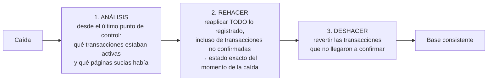

## Propósito

Entender cómo un motor sobrevive a una caída: el registro anticipado y el algoritmo de recuperación. Es el mecanismo que hace real la D de ACID, y explica muchas decisiones de configuración.

## Resultados de aprendizaje

Al terminar podrás:

1. Enunciar la regla del registro anticipado y por qué es necesaria.
2. Describir las tres fases de ARIES y qué garantiza cada una.
3. Explicar qué es un punto de control y qué acorta.
4. Relacionar `fsync` con la durabilidad real ante cada tipo de fallo.
5. Leer el modo WAL de SQLite como ejemplo completo y pequeño.

## Fundamentos

### La regla

**Antes de escribir una página modificada al disco, debe estar en disco el registro que describe esa modificación.**

Sin esa regla no hay recuperación posible: si la página llegara antes que el registro, tras una caída habría un cambio en los datos del que no queda constancia de a qué transacción pertenece, y no se sabría si deshacerlo.

Escribir el registro es barato (secuencial, al final del archivo); escribir las páginas es caro (aleatorio). Por eso el motor confirma la transacción cuando el registro está a salvo y aplaza las páginas.

### ARIES: las tres fases

Mohan et al. (1992) definen el algoritmo que implementan casi todos los motores. Cada registro lleva un **LSN** (número de secuencia), y cada página guarda el LSN del último cambio que la afectó.



El punto que sorprende: la fase de rehacer **reaplica también cambios de transacciones que no se confirmaron**. Se llama *repeating history*. Reconstruye el estado exacto del instante de la caída y solo después deshace lo que corresponde. Es más simple y más robusto que intentar filtrar durante el rehacer.

Los registros de compensación (CLR) registran el propio deshacer, de forma que si el sistema cae **durante** la recuperación, la siguiente no repite trabajo ya deshecho. Es lo que hace la recuperación idempotente.

### Puntos de control

Sin ellos, la recuperación tendría que leer el registro desde el principio de los tiempos. Un punto de control anota el estado en un instante; la recuperación empieza ahí.

| Parámetro | Efecto de aumentarlo |
|---|---|
| Intervalo entre puntos de control | Menos E/S en marcha, **recuperación más larga** |
| Tamaño máximo del registro | Ídem |

Es un compromiso explícito entre rendimiento normal y tiempo de recuperación (RTO, clase 048). Un sistema con puntos de control cada hora puede tardar mucho en volver.

### `fsync`: durabilidad frente a qué

Escribir en un archivo no lo pone en el disco: lo deja en la caché del sistema operativo. `fsync` fuerza el volcado.

| Configuración | Caída del proceso | Caída de la máquina |
|---|---|---|
| Sin `fsync` en el commit | Sobrevive | **Se pierden transacciones confirmadas** |
| Con `fsync` en el commit | Sobrevive | Sobrevive |
| `fsync` + disco que miente sobre su caché | Sobrevive | **Puede perderse o corromperse** |

La tercera fila es real: discos de consumo con caché de escritura sin respaldo de energía confirman `fsync` antes de haber escrito. Es la razón por la que el hardware de servidor lleva caché con batería.

| Motor | Parámetro | Valor seguro |
|---|---|---|
| PostgreSQL | `synchronous_commit` | `on` |
| PostgreSQL | `fsync` | `on` (nunca `off` en producción) |
| MySQL | `innodb_flush_log_at_trx_commit` | `1` |
| SQLite | `synchronous` | `FULL`, o `NORMAL` con WAL |

### WAL en SQLite

SQLite es lo bastante pequeño para leer su mecanismo completo. En modo WAL:

- Los cambios se añaden al archivo `-wal`; el archivo principal no se toca en el momento del commit.
- Los lectores consultan un índice en memoria compartida (`-shm`) para saber qué páginas leer del WAL y cuáles del archivo principal.
- Un **checkpoint** traslada las páginas del WAL al archivo principal.

De ahí que `synchronous = NORMAL` sea seguro con WAL frente a la caída del proceso pero no frente a un corte de energía: el WAL no se sincroniza en cada commit, solo en los checkpoints.

## Ejemplo trabajado

Traza de una transacción y su recuperación.

```text
LSN  Registro
100  BEGIN T1
101  T1: UPDATE cuentas id=1  saldo 1000 -> 700   [undo: 1000] [redo: 700]
102  BEGIN T2
103  T2: UPDATE cuentas id=2  saldo  500 -> 800   [undo: 500]  [redo: 800]
104  T1: UPDATE cuentas id=2  saldo  800 -> 900   (espera: fila bloqueada por T2)
105  COMMIT T2                      <- fsync aquí
106  CHECKPOINT (activas: T1)
107  T1: UPDATE cuentas id=2  saldo  800 -> 900   [undo: 800] [redo: 900]
     *** CAÍDA ***   T1 nunca confirmó
```

**Recuperación:**

```text
ANÁLISIS   desde LSN 106: T1 activa, sin COMMIT. Páginas sucias: cuentas(1), cuentas(2)
REHACER    reaplica 107 (y 101, 103 si sus páginas no estaban en disco)
           estado tras rehacer: id=1 -> 700, id=2 -> 900     (incluye cambios de T1)
DESHACER   T1 no confirmó: revertir 107 y 101 usando la información de deshacer
           107 deshecho -> id=2 vuelve a 800   (CLR con LSN 108)
           101 deshecho -> id=1 vuelve a 1000  (CLR con LSN 109)
```

**Estado final:** `id=1 → 1000` (T1 revertida), `id=2 → 800` (T2 confirmada y conservada). Exactamente lo que ACID promete: T2 duradera, T1 como si nunca hubiera ocurrido.

Obsérvese que la fase de rehacer dejó momentáneamente `id=2 = 900`, un valor de una transacción no confirmada. No es un error: es el estado del instante de la caída, que la fase de deshacer corrige.

**Comprobación en SQLite:**

```bash
python - <<'PY'
import sqlite3, os
con = sqlite3.connect('demo.db')
con.execute('PRAGMA journal_mode=WAL')
con.execute('CREATE TABLE IF NOT EXISTS cuentas(id INTEGER PRIMARY KEY, saldo INTEGER)')
con.execute('INSERT OR REPLACE INTO cuentas VALUES (1, 1000)')
con.commit()
con.execute('BEGIN')
con.execute('UPDATE cuentas SET saldo = 700 WHERE id = 1')
print('WAL existe:', os.path.exists('demo.db-wal'))   # los cambios están en el WAL
os._exit(1)                                            # muerte del proceso, sin COMMIT
PY
sqlite3 demo.db "SELECT saldo FROM cuentas WHERE id=1;"   # 1000: la transacción se revirtió
```

El archivo `-wal` es visible durante la transacción y la reapertura ejecuta la recuperación automáticamente.

## Comparación

| Fallo | Qué lo cubre |
|---|---|
| Reversión de una transacción | Registro de deshacer, en marcha |
| Caída del proceso | Registro en la caché del sistema operativo |
| Caída de la máquina | `fsync` del registro en el commit |
| Corrupción de página | Suma de comprobación + copia + registro |
| Pérdida del disco | Réplica o copia externa (clase 048) |
| Error humano | Recuperación a un punto en el tiempo |

## Errores frecuentes

1. **`fsync = off` en producción.** Se descubre en el primer corte de energía.
2. **Puntos de control muy espaciados sin medir el RTO.** La recuperación tarda más de lo que el negocio tolera.
3. **Confundir el registro del motor con el registro de la aplicación.** Son cosas distintas con propósitos distintos.
4. **No vigilar el espacio del WAL.** Una réplica detenida impide reciclarlo y llena el disco.
5. **Suponer que el WAL es una copia de seguridad.** Lo es solo junto con una copia base.
6. **Almacenamiento que miente sobre `fsync`.** La durabilidad depende del hardware.

## De la clase a la operación

El WAL es también la base de la replicación (clase 043) y de la captura de cambios (clase 056): el mismo flujo que permite recuperarse permite que otro nodo reproduzca los cambios. Entenderlo aquí ahorra explicarlo tres veces más adelante.

## Reto de transferencia

1. Reproduce el experimento de SQLite y observa los archivos `-wal` y `-shm`.
2. Mata el proceso a mitad de una transacción y demuestra que la base queda consistente.
3. Mide el tiempo de recuperación con dos intervalos de punto de control distintos.
4. Documenta la configuración de durabilidad de tu sistema y qué se pierde en cada tipo de fallo.

## Preguntas de evaluación

1. ¿Por qué el registro debe llegar al disco antes que la página de datos?
2. Explica por qué la fase de rehacer reaplica transacciones que no se confirmaron.
3. ¿Qué función cumplen los registros de compensación si el sistema cae durante la recuperación?
4. Con `synchronous_commit = off`, ¿qué se pierde exactamente y ante qué fallo?
