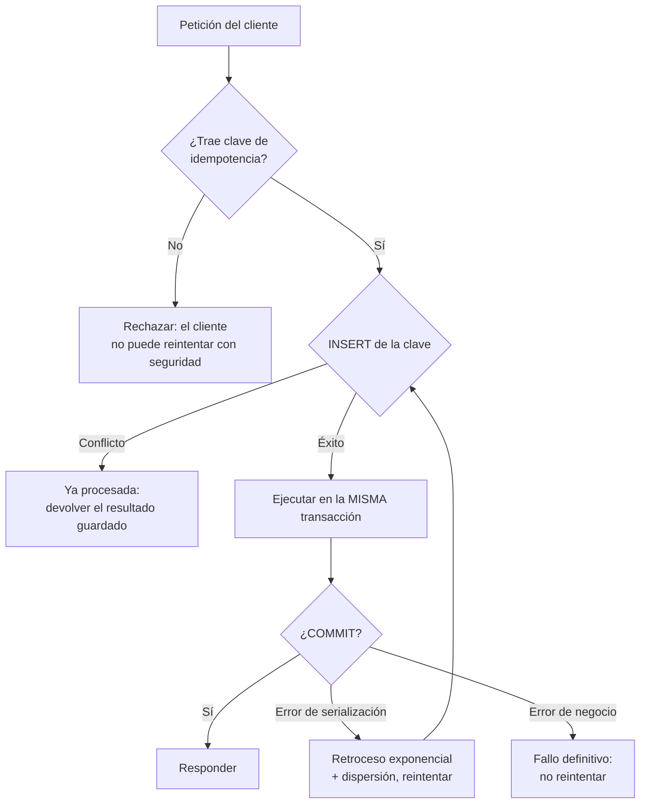

## Propósito

Escribir aplicaciones correctas frente a reintentos, mensajes duplicados y operaciones concurrentes. La transacción del motor termina en el `COMMIT`; el sistema no.

## Resultados de aprendizaje

Al terminar podrás:

1. Definir idempotencia y distinguirla de la ausencia de efectos.
2. Implementar una clave de idempotencia con garantía del motor.
3. Elegir entre bloqueo optimista y pesimista con un criterio medible.
4. Aplicar reintentos con retroceso exponencial y dispersión aleatoria.
5. Explicar el problema del confirmar-dos-veces y cómo se acota.

## Fundamentos

### Idempotencia

Una operación es **idempotente** si aplicarla N veces deja el mismo estado que aplicarla una vez. No significa «no hace nada»: significa que repetirla es seguro.

| Operación | ¿Idempotente? |
|---|---|
| `UPDATE cuentas SET saldo = 700 WHERE id = 1` | Sí |
| `UPDATE cuentas SET saldo = saldo - 300 WHERE id = 1` | **No** |
| `INSERT` con clave única y `ON CONFLICT DO NOTHING` | Sí |
| `INSERT` sin restricción | No |
| `DELETE FROM t WHERE id = 5` | Sí |
| «Enviar correo» | No |

Helland lo sitúa como requisito de cualquier comunicación entre agregados: en un sistema distribuido, **un mensaje se entrega una o más veces**, nunca exactamente una. La entrega exactamente-una-vez se consigue combinando al-menos-una-vez con un receptor idempotente.

### El problema del confirmar-dos-veces

```text
Cliente -> Servidor : cobrar 300
Servidor            : BEGIN ... COMMIT   (aplicado)
Servidor -> Cliente : respuesta          *** se pierde la red ***
Cliente             : tiempo agotado, reintenta
Cliente -> Servidor : cobrar 300         (¡otra vez!)
```

El cliente no puede distinguir «no se aplicó» de «se aplicó y se perdió la respuesta». La única defensa es que el servidor reconozca el reintento, y para eso el cliente debe enviar un identificador estable.

### Clave de idempotencia

El cliente genera un identificador único **por intención**, no por intento, y lo repite en cada reintento. El servidor lo registra con una restricción de unicidad:

```sql
CREATE TABLE operaciones (
  clave_idempotencia TEXT PRIMARY KEY,
  tipo               TEXT NOT NULL,
  resultado          TEXT NOT NULL,
  creada_en          TIMESTAMPTZ NOT NULL DEFAULT now()
);
```

La restricción `PRIMARY KEY` es lo que da la garantía: no depende de que la aplicación compruebe antes de insertar —eso sería una carrera—, sino de que el motor rechace el segundo insert.

### Optimista frente a pesimista

| | Optimista | Pesimista |
|---|---|---|
| Cómo | Se lee una versión, se escribe si no cambió | Se bloquea la fila al leer |
| Coste sin conflicto | Ninguno | Bloqueo mantenido |
| Coste con conflicto | Reintento completo | Espera |
| Bueno cuando | Conflictos raros (< ~10 %) | Conflictos frecuentes |
| Riesgo | Reintentos en cascada bajo contención | Interbloqueos, contención |

Regla: **medir la tasa de conflicto antes de elegir**. Con 2 % de conflictos, el optimista gana claramente; con 40 %, el reintento constante es peor que esperar.



## Ejemplo trabajado

Inscribir a un estudiante, con control de cupo, de forma segura ante reintentos.

```python
import random, time
import psycopg

MAX_INTENTOS = 5

def inscribir(conn, clave_idem: str, student_id: int, course_id: int) -> dict:
    for intento in range(MAX_INTENTOS):
        try:
            with conn.transaction():
                cur = conn.cursor()

                # 1. La restricción de unicidad, no un SELECT previo, es lo que
                #    hace atómica la detección del reintento.
                try:
                    cur.execute(
                        "INSERT INTO operaciones (clave_idempotencia, tipo, resultado) "
                        "VALUES (%s, 'inscripcion', '')",
                        (clave_idem,))
                except psycopg.errors.UniqueViolation:
                    raise YaProcesada()

                # 2. Bloqueo pesimista sobre el curso: el cupo es un recurso
                #    disputado y aquí los conflictos son la norma, no la excepción.
                cur.execute("SELECT cupo FROM courses WHERE id = %s FOR UPDATE",
                            (course_id,))
                (cupo,) = cur.fetchone()

                cur.execute("SELECT count(*) FROM enrollments "
                            "WHERE course_id = %s AND estado = 'activa'", (course_id,))
                (inscritos,) = cur.fetchone()

                if inscritos >= cupo:
                    # Error de negocio: reintentar no lo arregla.
                    raise SinCupo(f"{inscritos}/{cupo}")

                cur.execute("INSERT INTO enrollments (student_id, course_id, estado) "
                            "VALUES (%s, %s, 'activa') ON CONFLICT DO NOTHING",
                            (student_id, course_id))

                resultado = {"ok": True, "inscritos": inscritos + 1}
                cur.execute("UPDATE operaciones SET resultado = %s "
                            "WHERE clave_idempotencia = %s",
                            (json.dumps(resultado), clave_idem))
                return resultado

        except YaProcesada:
            # El reintento del cliente devuelve el resultado original, no un error.
            cur = conn.cursor()
            cur.execute("SELECT resultado FROM operaciones WHERE clave_idempotencia = %s",
                        (clave_idem,))
            return json.loads(cur.fetchone()[0])

        except psycopg.errors.SerializationFailure:
            # Retroceso exponencial CON dispersión: sin el factor aleatorio,
            # todos los clientes que chocaron reintentan a la vez y vuelven a chocar.
            espera = (2 ** intento) * 0.05 * (0.5 + random.random())
            time.sleep(espera)
            continue

    raise DemasiadosIntentos()
```

**Por qué cada pieza:**

- **`INSERT` de la clave dentro de la transacción.** Si la transacción se revierte, la clave desaparece y el reintento es legítimo. Insertarla fuera dejaría operaciones marcadas como hechas que nunca se hicieron.
- **`FOR UPDATE` sobre `courses`.** Materializa el conflicto: sin él, dos inscripciones concurrentes leen el mismo conteo y ambas pasan. Es el sesgo de escritura de la clase 034 aplicado al cupo.
- **`ON CONFLICT DO NOTHING`.** Segunda línea de defensa, por si el mismo par llega por otra vía.
- **Distinguir error de negocio de error transitorio.** `SinCupo` no se reintenta; `SerializationFailure` sí. Reintentar un error de negocio es un bucle infinito.
- **Dispersión en el retroceso.** Es lo que evita que los reintentos se sincronicen.

**Traza de un reintento tras respuesta perdida:**

```text
t0  cliente envía clave=abc-123        → servidor aplica, inscritos=1
t1  respuesta se pierde
t2  cliente reintenta clave=abc-123    → UniqueViolation → devuelve {"ok":true,"inscritos":1}
```

El cliente recibe el resultado correcto. No hay doble inscripción y no hay error visible.

**Alternativa optimista**, adecuada cuando los conflictos son raros:

```sql
UPDATE courses SET version = version + 1, inscritos = inscritos + 1
WHERE id = %s AND version = %s AND inscritos < cupo;
-- 0 filas afectadas = alguien se adelantó → reintentar
```

Sin bloqueos, con reintento en el cliente. Para un curso muy demandado durante la matrícula, el pesimista es mejor: el optimista generaría decenas de reintentos por inscripción exitosa.

## Comparación

| Escenario | Mecanismo |
|---|---|
| API de pagos | Clave de idempotencia obligatoria |
| Edición de un formulario por varias personas | Optimista con versión |
| Cupo muy disputado | Pesimista con `FOR UPDATE` |
| Consumo de una cola | Idempotencia por identificador de mensaje |
| Contador de alta frecuencia | Sentencia atómica (`saldo = saldo - x`) |
| Proceso por lotes reejecutable | Idempotencia por lote + `MERGE` |

## Errores frecuentes

1. **Comprobar con `SELECT` y luego `INSERT`.** Es una carrera; la restricción única es lo que garantiza.
2. **Clave de idempotencia generada por intento.** Cada reintento trae una clave nueva y no sirve de nada.
3. **Reintentar errores de negocio.** Bucle infinito.
4. **Retroceso sin dispersión.** Los clientes se sincronizan y el conflicto se repite.
5. **Reintentos sin límite.** Amplifican una caída parcial hasta convertirla en total.
6. **Registrar la operación fuera de la transacción.** Deja operaciones marcadas como hechas que se revirtieron.
7. **Efectos externos dentro de la transacción.** Un correo enviado no se revierte con `ROLLBACK`.

## De la clase a la operación

Los duplicados en producción —dos cobros, dos pedidos, dos correos— casi nunca vienen de un fallo del motor: vienen de un reintento sin clave de idempotencia. Exigirla en el contrato de la API es más barato que cualquier deduplicación posterior.

## Reto de transferencia

1. Elige una operación con efectos de tu sistema y añádele clave de idempotencia.
2. Simula la pérdida de la respuesta y demuestra que el reintento no duplica.
3. Mide la tasa de conflicto real y decide entre optimista y pesimista con ese dato.
4. Implementa el retroceso con dispersión y compara la carga con y sin él bajo contención.

## Preguntas de evaluación

1. ¿Por qué la restricción única es más fiable que comprobar antes de insertar?
2. Da una operación de tu sistema que no sea idempotente y conviértela.
3. Explica qué ocurre con reintentos sincronizados sin dispersión, con cifras.
4. ¿Qué efecto externo de tu código quedaría inconsistente si la transacción se revierte?
