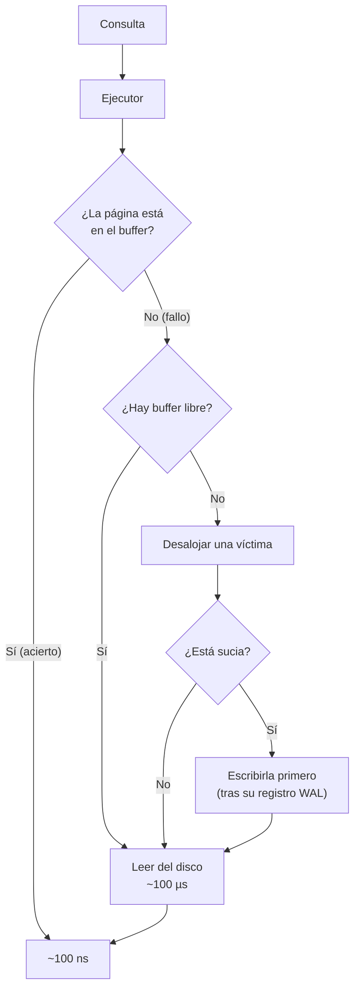

# 038 — Páginas, filas y buffer: por qué la entrada y salida manda

> [Programa](../../../README.md) · [Parte 08](../README.md) · [← Anterior](../../part-07-transacciones-concurrencia-y-recuperacion/037-concurrencia-en-la-aplicacion/README.md) · [Siguiente →](../../part-08-almacenamiento-indices-y-planes/039-b-tree-orden-de-columnas-y-selectividad/README.md)

Parte 08 — Almacenamiento, índices y planes · Intermedio ·
3 horas estimadas · motores `postgresql`, `sqlite` · laboratorio
[`labs/04-indexing`](../../../labs/04-indexing/README.md) · 3 fuentes.

**Conceptos centrales:** `pagina` · `factor de bloque` · `buffer pool` · `localidad` · `lectura secuencial`

---

## Propósito

Bajar al nivel donde se paga el costo real: páginas, filas y memoria. Casi todas las decisiones de rendimiento se explican como «cuántas páginas hay que tocar».

## Resultados de aprendizaje

Al terminar podrás:

1. Calcular cuántas páginas ocupa una tabla y por qué importa.
2. Explicar el factor de bloque y su efecto sobre los barridos.
3. Describir el buffer y su política de reemplazo.
4. Interpretar la tasa de aciertos y saber cuándo engaña.
5. Estimar el costo de una consulta en páginas antes de ejecutarla.

## Fundamentos

### La página

La unidad de E/S no es la fila: es la **página** (8 KB en PostgreSQL, 16 KB en InnoDB por defecto, configurable en SQLite). Leer un byte cuesta lo mismo que leer la página entera.

```text
Página de 8 192 bytes
  cabecera                      24 B
  punteros a filas         4 B × N
  espacio libre
  filas (desde el final)
  cabecera de fila             ~23 B en PostgreSQL
```

**Factor de bloque** = filas por página:

```text
fila de 100 B (más 23 B de cabecera) = 123 B
factor ≈ (8192 - 24) / (123 + 4) ≈ 64 filas por página
```

Con 1 000 000 de filas: **15 625 páginas ≈ 122 MB**. Ese número —no el de filas— determina el costo de un barrido.

### El ancho de la fila importa más de lo que parece

Añadir una columna `TEXT` de 200 bytes a la tabla anterior:

```text
fila de 323 B → factor ≈ 25 filas por página
1 000 000 de filas → 40 000 páginas ≈ 313 MB
```

El barrido pasa a costar **2,6 veces más**, incluso para consultas que no leen esa columna. Es el argumento físico a favor de sacar los campos grandes y poco consultados a una tabla aparte, y también la razón por la que el formato columnar gana en analítica (clase 032).

PostgreSQL mitiga esto con TOAST: los valores grandes se comprimen y se mueven a una tabla auxiliar, dejando un puntero en la fila. Solo se leen si la consulta los pide.

### El buffer

Caché de páginas en memoria compartida. La política habitual es una variante de LRU con protección contra barridos: un barrido secuencial de una tabla enorme no debe desalojar todo lo demás. PostgreSQL usa un anillo de buffers para barridos grandes por esa razón exacta.

```sql
SELECT relname,
       heap_blks_read  AS leidas_disco,
       heap_blks_hit   AS leidas_cache,
       round(100.0 * heap_blks_hit /
             NULLIF(heap_blks_hit + heap_blks_read, 0), 2) AS pct_aciertos
FROM pg_statio_user_tables ORDER BY heap_blks_read DESC LIMIT 10;
```

**Dónde engaña la tasa de aciertos.** Un 99 % suena excelente, pero:

- El sistema operativo tiene su propia caché: un «fallo» de PostgreSQL puede resolverse en RAM sin tocar el disco.
- Es un acumulado desde el arranque; un problema de la última hora queda diluido.
- Con un 99 % sobre 100 millones de accesos, el 1 % son un millón de lecturas físicas.

Es una métrica de contexto, no un objetivo.

### La jerarquía

| Nivel | Latencia típica | Relativo |
|---|---|---|
| Caché L1 | ~1 ns | 1 |
| RAM | ~100 ns | 100 |
| SSD NVMe | ~100 µs | 100 000 |
| Disco mecánico (aleatorio) | ~10 ms | 10 000 000 |
| Red (mismo centro) | ~500 µs | 500 000 |

El salto de RAM a SSD es de tres órdenes de magnitud. Toda la ingeniería de un motor consiste en cruzarlo lo menos posible.



## Ejemplo trabajado

Tabla `enrollments`: 5 000 000 de filas, fila de 80 bytes útiles.

```text
fila con cabecera ≈ 103 B
factor de bloque  ≈ (8192-24)/(103+4) ≈ 76 filas/página
páginas           = 5 000 000 / 76 ≈ 65 790
tamaño            ≈ 65 790 · 8 KB ≈ 514 MB
```

**Consulta A — barrido secuencial:**

```sql
SELECT AVG(nota) FROM enrollments;
```

Toca las 65 790 páginas. En SSD con lectura secuencial a 1 GB/s: ~0,5 s. Si estuvieran en el buffer, ~0,05 s.

**Consulta B — una fila por índice:**

```sql
SELECT * FROM enrollments WHERE student_id = 11 AND course_id = 42;
```

```text
altura del B-Tree ≈ 3 niveles
páginas de índice leídas: 3
página de datos:          1
total:                    4 páginas
```

**65 790 frente a 4.** Cuatro órdenes de magnitud, y la diferencia entera está en cuántas páginas se tocan.

**Consulta C — el caso intermedio, que es donde se decide:**

```sql
SELECT * FROM enrollments WHERE course_id = 42;   -- devuelve 40 000 filas
```

Dos caminos:

```text
Barrido secuencial: 65 790 páginas, lectura SECUENCIAL
Índice:             ~3 páginas de índice + hasta 40 000 lecturas ALEATORIAS de datos
```

Aquí la naturaleza del acceso manda. Una lectura secuencial de 65 790 páginas es más rápida que 40 000 aleatorias, porque el disco y el prelector trabajan a favor. **Por eso el optimizador elige el barrido cuando la consulta devuelve una fracción grande de la tabla** (clase 042): el umbral suele rondar el 5–20 % según el motor y la relación entre `random_page_cost` y `seq_page_cost`.

**La corrección: correlación física.** Si las filas del mismo curso estuvieran contiguas en disco, las 40 000 lecturas dejarían de ser aleatorias.

```sql
CLUSTER enrollments USING enrollments_course_idx;   -- PostgreSQL: reorganiza una vez
```

En InnoDB esto es automático: la tabla **es** el índice de clave primaria (índice agrupado), así que las filas con claves primarias contiguas están físicamente juntas. Es una diferencia arquitectónica con consecuencias directas:

| | PostgreSQL | InnoDB |
|---|---|---|
| Organización | Montón + índices separados | Tabla agrupada por clave primaria |
| Índice secundario apunta a | Ubicación física de la fila | **La clave primaria** |
| Consecuencia | Actualizar una fila puede exigir tocar todos los índices | Un índice secundario cuesta una búsqueda extra en el primario |
| Clave primaria ancha | Coste moderado | Se copia en **cada** índice secundario |

La última fila explica por qué en InnoDB una clave primaria ancha (un UUID en texto, una clave compuesta larga) infla todos los índices de la tabla.

## Comparación

| Acceso | Páginas tocadas | Naturaleza | Cuándo gana |
|---|---|---|---|
| Barrido secuencial | Todas | Secuencial | Se devuelve una fracción grande |
| Búsqueda por índice | log N + 1 | Aleatoria | Muy selectiva |
| Barrido de índice | Páginas del índice | Casi secuencial | Consulta cubierta |
| Barrido de mapa de bits | Índice + datos ordenados | Semialeatoria | Selectividad intermedia |

## Errores frecuentes

1. **Razonar en filas y no en páginas.** El costo lo fija la página.
2. **Columnas anchas en tablas muy consultadas.** Encarecen todos los barridos.
3. **Perseguir el 99,9 % de aciertos.** Se compra RAM sin mirar el número absoluto de lecturas.
4. **Suponer que el índice siempre gana.** Con baja selectividad, pierde.
5. **Clave primaria ancha en InnoDB.** Se copia en todos los índices secundarios.
6. **Medir con el caché caliente y presentarlo como mejora.**

## De la clase a la operación

Cuando una base «se pone lenta al crecer», casi siempre significa que el conjunto de trabajo dejó de caber en el buffer. El indicador que lo anticipa es el tamaño de las tablas e índices calientes frente a la memoria, no el uso de CPU.

## Reto de transferencia

1. Calcula el factor de bloque y el número de páginas de tu tabla más grande.
2. Estima el costo en páginas de tus tres consultas más frecuentes y contrástalo con `EXPLAIN (BUFFERS)`.
3. Mueve una columna ancha a una tabla aparte y mide el cambio en un barrido.
4. Compara el tamaño de un índice secundario con clave primaria estrecha y con una ancha.

## Preguntas de evaluación

1. Calcula las páginas de una tabla de 20 M de filas de 250 bytes.
2. ¿Por qué 40 000 lecturas aleatorias pueden ser más lentas que 65 000 secuenciales?
3. Explica la diferencia entre montón e índice agrupado y una consecuencia práctica de cada una.
4. Da un caso donde una tasa de aciertos del 99 % siga siendo un problema.

---

## Laboratorio

```bash
python scripts/validate_repository.py
python labs/04-indexing/run_indexing_lab.py
```

Guarda como evidencia la salida completa, la versión del motor y la semilla o
los parámetros usados. Una captura sin comando no es evidencia: no se puede
repetir.

## Evaluación

| Criterio | Peso | Qué se comprueba |
|---|---:|---|
| Comprensión conceptual | 25 % | Explica el mecanismo, no solo el resultado |
| Ejecución reproducible | 25 % | Otra persona obtiene lo mismo con las instrucciones dadas |
| Interpretación basada en evidencia | 25 % | Cada conclusión se apoya en una salida o una medición |
| Límites y riesgos declarados | 25 % | Dice qué no demuestra el ejercicio y qué faltaría en producción |

La clase se da por superada cuando la respuesta explica el mecanismo, muestra
la salida que la respalda y declara al menos un límite del ejercicio.

## Fuentes de esta clase

Todo lo afirmado arriba procede de estas obras. Los identificadores viven en
[`catalog/sources.json`](../../../catalog/sources.json) y el estado de los
enlaces se comprueba con `python scripts/check_external_links.py`.

- **Alex Petrov** (2019). [Database Internals: A Deep Dive into How Distributed Data Systems Work](https://www.databass.dev/). O'Reilly. ISBN 978-1-4920-4034-7.  
  Motor de almacenamiento (B-Tree y LSM) y consenso explicados con detalle de implementación.
- **Joseph M. Hellerstein, Michael Stonebraker, James Hamilton** (2007). [Architecture of a Database System](https://dsf.berkeley.edu/papers/fntdb07-architecture.pdf). Foundations and Trends in Databases 1(2). DOI [10.1561/1900000002](https://doi.org/10.1561/1900000002).  
  Descripción completa de los componentes internos de un SGBD relacional.
- **Egor Rogov** (2022). [PostgreSQL 14 Internals](https://postgrespro.com/community/books/internals). Postgres Professional. ISBN 978-5-6041193-2-8.  
  PDF gratuito. MVCC, vacuum, buffers, índices y planificador sobre el código real.

---

> [Programa](../../../README.md) · [Parte 08](../README.md) · [← Anterior](../../part-07-transacciones-concurrencia-y-recuperacion/037-concurrencia-en-la-aplicacion/README.md) · [Siguiente →](../../part-08-almacenamiento-indices-y-planes/039-b-tree-orden-de-columnas-y-selectividad/README.md)
