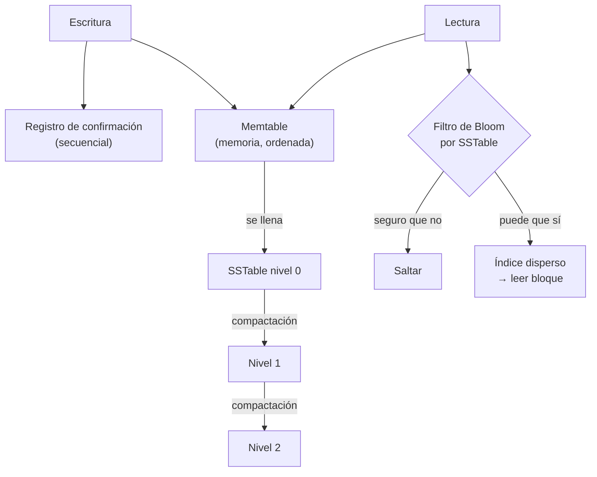

# 040 — LSM-Tree, compactación y amplificación de escritura

> [Programa](../../../README.md) · [Parte 08](../README.md) · [← Anterior](../../part-08-almacenamiento-indices-y-planes/039-b-tree-orden-de-columnas-y-selectividad/README.md) · [Siguiente →](../../part-08-almacenamiento-indices-y-planes/041-indices-especializados/README.md)

| | |
|---|---|
| **Parte** | 08 — Almacenamiento, índices y planes |
| **Nivel** | Avanzado |
| **Horas estimadas** | 3 |
| **Motores** | `cassandra`, `scylladb`, `redis` |
| **Laboratorio** | [`labs/04-indexing`](../../../labs/04-indexing/README.md) |
| **Fuentes** | 3 |

**Conceptos centrales:** `memtable` · `SSTable` · `compactación` · `amplificación de escritura` · `filtro de Bloom`

---

## Propósito

Entender la otra gran familia de estructuras de almacenamiento. El LSM-Tree sostiene Cassandra, RocksDB, ScyllaDB y LevelDB, y su compromiso es el inverso al del B-Tree.

## Resultados de aprendizaje

Al terminar podrás:

1. Describir el camino de una escritura y de una lectura en un LSM.
2. Definir y calcular las tres amplificaciones: escritura, lectura y espacio.
3. Explicar el papel del filtro de Bloom y calcular su tasa de falsos positivos.
4. Comparar compactación por niveles y por tamaños.
5. Elegir entre B-Tree y LSM según la carga.

## Fundamentos

### El camino de la escritura

```text
1. Registro de confirmación (append secuencial, para durabilidad)
2. Memtable: estructura ordenada en memoria
3. Cuando la memtable se llena → se vuelca como SSTable inmutable, ordenada
4. Las SSTables se fusionan periódicamente (compactación)
```

Todo lo que toca el disco es **secuencial**. No hay escritura aleatoria en el camino crítico, y ahí está la ventaja: una escritura secuencial es órdenes de magnitud más barata que una aleatoria.

Comparación con el B-Tree, que debe localizar la página correcta, modificarla en su sitio y posiblemente dividirla: escritura **aleatoria**, más el registro.

### El camino de la lectura

```text
1. Buscar en la memtable
2. Si no está, buscar en cada SSTable, de la más nueva a la más antigua
3. Filtro de Bloom por SSTable para descartar sin leer
4. Índice disperso dentro de la SSTable elegida
```

Aquí está el precio: una clave inexistente puede exigir consultar **todas** las SSTables. El filtro de Bloom es lo que hace viable el modelo.

### Filtro de Bloom

Estructura probabilística que responde «seguro que no está» o «puede que esté», nunca «seguro que sí».

```text
tasa de falsos positivos ≈ (1 - e^(-kn/m))^k

con 10 bits por clave y k = 7 funciones hash:  ≈ 0,82 %
```

Con 10 SSTables y 0,82 % de falsos positivos, una lectura de clave inexistente lee de media 0,082 SSTables en vez de 10. Un 1,25 % de memoria adicional elimina el 99 % del trabajo inútil.

### Las tres amplificaciones

| Amplificación | Definición | B-Tree | LSM |
|---|---|---|---|
| **Escritura** | Bytes escritos al disco / bytes lógicos | ~2–3× | 10–30× (por niveles) |
| **Lectura** | Páginas leídas / mínimo necesario | ~1× | 1–N según SSTables |
| **Espacio** | Espacio ocupado / datos vivos | 1,3–2× (fragmentación) | 1,1× (niveles) a 2× (tamaños) |

El dato contraintuitivo: **el LSM amplifica más la escritura**, porque cada dato se reescribe en cada compactación que lo mueve de nivel. Su ventaja no es escribir menos bytes: es escribirlos **secuencialmente**, lo que en la práctica rinde mucho más.

### Estrategias de compactación

| Estrategia | Amplificación de escritura | De lectura | De espacio | Cuándo |
|---|---|---|---|---|
| **Por niveles** | Alta (~10–30×) | Baja (~1 SSTable por nivel) | Baja (~1,1×) | Predomina la lectura |
| **Por tamaños** | Baja (~4–10×) | Alta (varias SSTables) | Alta (~2×) | Predomina la escritura |
| **Temporal** | Muy baja | Baja con filtro temporal | Baja | Series temporales con TTL |

La estrategia temporal es la correcta para datos con expiración: las SSTables agrupan por ventana temporal y expirar es eliminar archivos enteros, sin compactar nada.

### Lápidas

Borrar en un LSM no borra: escribe una **lápida** (marca de borrado). El dato desaparece de verdad cuando una compactación fusiona la lápida con el valor original.

Consecuencia práctica y frecuente: una tabla de la que se borra mucho puede **crecer** tras los borrados, y las lecturas se vuelven más lentas porque hay que leer y descartar lápidas. En Cassandra, una consulta de rango que atraviesa miles de lápidas es una causa habitual de tiempos agotados.



## Ejemplo trabajado

Carga: 50 000 escrituras/s de eventos, lecturas por clave puntual y consultas de rango por tiempo.

**Con B-Tree** (PostgreSQL, tabla con índice sobre `(sensor_id, medido_en)`):

```text
Por cada inserción:
  - registro WAL:                     secuencial
  - página de datos:                  aleatoria (o al final si hay correlación)
  - página de hoja del índice:        ALEATORIA
  - división de página ocasional:     escrituras extra
Amplificación ≈ 2-3×, pero con componente ALEATORIO dominante
```

Con 50 000 inserciones/s y claves dispersas, las hojas del índice se tocan en posiciones aleatorias: el cuello de botella son las IOPS aleatorias.

**Con LSM** (RocksDB o Cassandra):

```text
Por cada inserción:
  - registro de confirmación:         secuencial
  - memtable:                         memoria
Compactación en segundo plano:        SECUENCIAL, fuera del camino crítico
Amplificación ≈ 15×, todo secuencial
```

Escribe **cinco veces más bytes** y aun así sostiene mucho más caudal, porque la escritura secuencial en un SSD rinde varios GB/s frente a las decenas de miles de IOPS aleatorias.

**El precio, en la lectura de una clave inexistente:**

```text
niveles: L0 (4 SSTables) + L1 (10) + L2 (100) = 114 SSTables
sin filtro de Bloom: 114 comprobaciones, muchas con lectura de disco
con filtro (0,82 %):  114 · 0,0082 ≈ 0,93 lecturas de media
```

**Cálculo de espacio con lápidas.** 10 millones de filas de 100 B, se borra el 30 %:

```text
datos vivos                        700 MB
lápidas (30 %, ~50 B cada una)     150 MB
valores aún no compactados         300 MB
total antes de compactar         1 150 MB   ← 64 % más que los datos vivos
tras compactación completa         700 MB
```

Por eso `gc_grace_seconds` en Cassandra —el plazo antes de eliminar lápidas— es un parámetro operativo delicado: bajarlo libera espacio antes, y arriesga que un nodo que estuvo caído resucite datos borrados.

## Comparación

| Dimensión | B-Tree | LSM-Tree |
|---|---|---|
| Escritura aleatoria | Cara | Convertida en secuencial |
| Lectura puntual | Óptima (log N) | Buena con filtro de Bloom |
| Consulta de rango | Excelente (hojas enlazadas) | Buena, requiere fusionar SSTables |
| Amplificación de escritura | 2–3× | 10–30× |
| Espacio | Fragmentación interna | Lápidas y duplicados |
| Latencia | Predecible | Picos durante la compactación |
| Motores | PostgreSQL, InnoDB, SQLite | Cassandra, RocksDB, ScyllaDB, LevelDB |

## Errores frecuentes

1. **Borrar masivamente en un LSM y esperar que libere espacio.** Hasta la compactación, ocupa más.
2. **Consultas de rango sobre zonas con muchas lápidas.** Tiempos agotados difíciles de diagnosticar.
3. **Estrategia de compactación por defecto para cualquier carga.** Series temporales y cargas de lectura piden estrategias distintas.
4. **Filtros de Bloom mal dimensionados.** Pocos bits por clave disparan los falsos positivos.
5. **Ignorar los picos de latencia por compactación.** El percentil 99 es peor que la media.
6. **Elegir LSM «porque escala».** Si la carga es de lectura por rango, el B-Tree suele ganar.

## De la clase a la operación

Las incidencias de un LSM se ven como picos de latencia y de espacio, no como lentitud constante. Vigilar la deuda de compactación pendiente es la métrica que anticipa el problema, igual que la hinchazón lo es en un motor MVCC.

## Reto de transferencia

1. Calcula la amplificación de escritura de tu carga con compactación por niveles y por tamaños.
2. Estima la tasa de falsos positivos de tu filtro de Bloom con la configuración actual.
3. Reproduce el crecimiento de espacio tras un borrado masivo y mide antes y después de compactar.
4. Argumenta con cifras si tu carga encaja mejor en B-Tree o en LSM.

## Preguntas de evaluación

1. ¿Por qué un LSM escribe más bytes y aun así sostiene más caudal de escritura?
2. Calcula la tasa de falsos positivos con 8 bits por clave y 5 funciones hash.
3. Explica por qué borrar puede aumentar el espacio ocupado y ralentizar las lecturas.
4. ¿Qué estrategia de compactación elegirías para datos con TTL de 30 días, y por qué?

---

## Laboratorio

```bash
python scripts/validate_repository.py
python labs/04-indexing/run_lab.py
```

Guarda como evidencia la salida completa, la versión del motor y la semilla o
los parámetros usados. Una captura sin comando no es evidencia: no se puede
repetir.

## Evaluación

| Criterio | Peso | Qué se comprueba |
|---|---:|---|
| Comprensión conceptual | 25 % | Explica el mecanismo, no solo el resultado |
| Ejecución reproducible | 25 % | Otra persona obtiene lo mismo con las instrucciones dadas |
| Interpretación basada en evidencia | 25 % | Cada conclusión se apoya en una salida o una medición |
| Límites y riesgos declarados | 25 % | Dice qué no demuestra el ejercicio y qué faltaría en producción |

La clase se da por superada cuando la respuesta explica el mecanismo, muestra
la salida que la respalda y declara al menos un límite del ejercicio.

## Fuentes de esta clase

Todo lo afirmado arriba procede de estas obras. Los identificadores viven en
[`catalog/sources.json`](../../../catalog/sources.json) y el estado de los
enlaces se comprueba con `python scripts/check_external_links.py`.

- **Patrick O'Neil, Edward Cheng, Dieter Gawlick, Elizabeth O'Neil** (1996). [The Log-Structured Merge-Tree (LSM-Tree)](https://link.springer.com/article/10.1007/s002360050048). Acta Informatica 33(4). DOI [10.1007/s002360050048](https://doi.org/10.1007/s002360050048).  
  Estructura que sostiene RocksDB, Cassandra, ScyllaDB y LevelDB.
- **Alex Petrov** (2019). [Database Internals: A Deep Dive into How Distributed Data Systems Work](https://www.databass.dev/). O'Reilly. ISBN 978-1-4920-4034-7.  
  Motor de almacenamiento (B-Tree y LSM) y consenso explicados con detalle de implementación.
- **Burton H. Bloom** (1970). [Space/Time Trade-offs in Hash Coding with Allowable Errors](https://dl.acm.org/doi/10.1145/362686.362692). Communications of the ACM 13(7). DOI [10.1145/362686.362692](https://doi.org/10.1145/362686.362692).  
  Filtro de Bloom: clave para evitar lecturas de disco en motores LSM.

---

> [Programa](../../../README.md) · [Parte 08](../README.md) · [← Anterior](../../part-08-almacenamiento-indices-y-planes/039-b-tree-orden-de-columnas-y-selectividad/README.md) · [Siguiente →](../../part-08-almacenamiento-indices-y-planes/041-indices-especializados/README.md)
