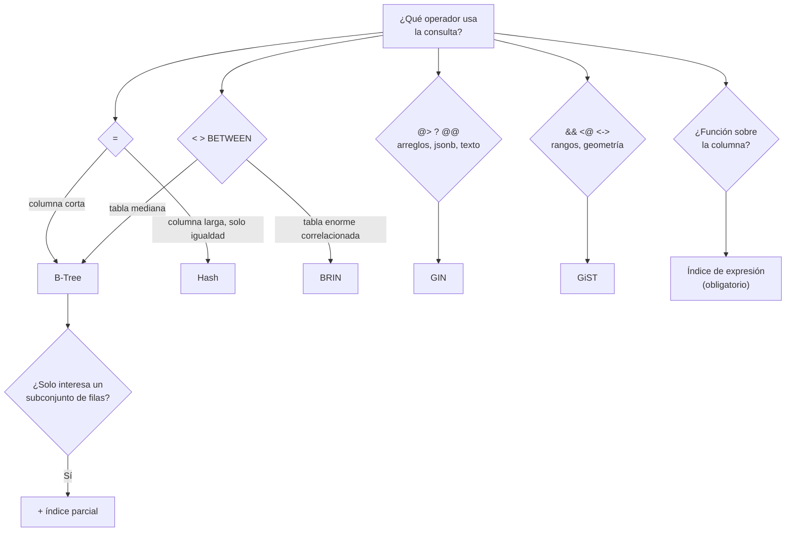

# 041 — Índices especializados: hash, GIN, GiST, BRIN, parciales y cubrientes

> [Programa](../../../README.md) · [Parte 08](../README.md) · [← Anterior](../../part-08-almacenamiento-indices-y-planes/040-lsm-tree-compactacion-y-amplificacion/README.md) · [Siguiente →](../../part-08-almacenamiento-indices-y-planes/042-planes-de-ejecucion-y-refutacion/README.md)

Parte 08 — Almacenamiento, índices y planes · Avanzado ·
3 horas estimadas · motores `postgresql` · laboratorio
[`labs/04-indexing`](../../../labs/04-indexing/README.md) · 3 fuentes.

**Conceptos centrales:** `índice parcial` · `índice de expresión` · `GIN` · `BRIN` · `costo de mantenimiento`

---

## Propósito

Salir del B-Tree. Hay consultas —contención de arreglos, texto, rangos, geometría, tablas enormes correlacionadas— para las que existe una estructura mucho mejor, y saber cuál evita rediseños innecesarios.

## Resultados de aprendizaje

Al terminar podrás:

1. Elegir el tipo de índice según el operador de la consulta.
2. Diseñar índices parciales y calcular su ahorro.
3. Usar índices de expresión y saber cuándo son obligatorios.
4. Explicar cuándo BRIN supera a B-Tree por dos órdenes de magnitud en tamaño.
5. Medir el costo de mantenimiento de cada índice.

## Fundamentos

### El catálogo

| Tipo | Operadores que acelera | Tamaño | Uso típico |
|---|---|---|---|
| **B-Tree** | `=`, `<`, `>`, `BETWEEN`, `LIKE 'p%'`, `ORDER BY` | Medio | Todo lo ordenable |
| **Hash** | Solo `=` | Menor que B-Tree | Igualdad pura sobre claves anchas |
| **GIN** | `@>`, `?`, `@@`, `&&` (arreglos, `jsonb`, texto) | Grande | Contención y búsqueda de texto |
| **GiST** | `&&`, `<@`, `<->` (rangos, geometría, vecino más cercano) | Medio | Rangos, geografía, exclusión |
| **SP-GiST** | Estructuras no equilibradas | Medio | Redes, cuadtrees |
| **BRIN** | `<`, `>`, `BETWEEN` con datos correlacionados | **Diminuto** | Tablas enormes ordenadas por inserción |

La pregunta que guía la elección no es «qué columna» sino **«qué operador»**. `WHERE etiquetas @> ARRAY['sql']` no lo acelera ningún B-Tree, por bien que se elija la columna.

### BRIN: el índice que cabe en un suspiro

Un índice de rango de bloques guarda, por cada grupo de páginas (128 por defecto), el valor mínimo y máximo. No localiza filas: **descarta bloques**.

```text
Tabla de 100 GB con 13 millones de páginas
B-Tree sobre una columna:   ~3 GB
BRIN con pages_per_range=128: ~100 000 rangos × ~32 B ≈ 3 MB
```

**Mil veces más pequeño.** Funciona solo si los datos están **físicamente correlacionados** con la columna: típicamente una marca de tiempo en una tabla donde se inserta en orden cronológico.

```sql
CREATE INDEX eventos_brin ON eventos USING brin (ocurrido_en);
SELECT attname, correlation FROM pg_stats WHERE tablename = 'eventos';
-- correlación cercana a 1 o -1 → BRIN es viable
```

Con correlación 0,99, BRIN descarta casi todos los bloques. Con correlación 0,1 —por ejemplo tras muchas actualizaciones que reubican filas— es inútil.

### Índice parcial

Indexa solo las filas que cumplen un predicado.

```sql
CREATE INDEX enr_pendientes ON enrollments (course_id, registrada_en)
WHERE estado = 'pendiente';
```

Dos condiciones para que se use: la consulta debe incluir un predicado que **implique** el del índice, y el planificador debe poder demostrarlo. `WHERE estado = 'pendiente'` sirve; `WHERE estado <> 'activa'` no, aunque lógicamente lo incluya.

Uso frecuente y elegante: excluir los nulos.

```sql
CREATE INDEX t_ref ON t (referencia) WHERE referencia IS NOT NULL;
```

### Índice de expresión

```sql
-- NO usa un índice sobre email:
SELECT * FROM students WHERE lower(email) = 'ana@ejemplo.cl';

CREATE INDEX students_email_lower ON students (lower(email));   -- ahora sí
```

Regla general: **cualquier función aplicada a la columna en el `WHERE` inutiliza el índice ordinario**. Incluye `date(created_at)`, `substr(codigo, 1, 3)` y las conversiones implícitas de tipo, que son las más difíciles de ver.

### Exclusión

Restricción declarativa que impide solapamientos, imposible con `UNIQUE`:

```sql
CREATE EXTENSION IF NOT EXISTS btree_gist;
ALTER TABLE reservas ADD CONSTRAINT sin_solape
  EXCLUDE USING gist (sala_id WITH =, durante WITH &&);
```

`durante` es un `tstzrange`. El motor rechaza cualquier reserva que solape en la misma sala. Es la solución declarativa a un problema que casi siempre se resuelve —mal— en la aplicación.



## Ejemplo trabajado

Tabla `eventos`: 500 millones de filas, 180 GB, insertada en orden cronológico.

```sql
CREATE TABLE eventos (
  id          BIGSERIAL PRIMARY KEY,
  ocurrido_en TIMESTAMPTZ NOT NULL,
  tipo        TEXT NOT NULL,
  etiquetas   TEXT[] NOT NULL DEFAULT '{}',
  carga       JSONB NOT NULL,
  procesado   BOOLEAN NOT NULL DEFAULT false
);
```

**Consulta A — rango temporal:**

```sql
SELECT * FROM eventos WHERE ocurrido_en BETWEEN '2026-08-01' AND '2026-08-02';
```

| Índice | Tamaño | Bloques leídos |
|---|---:|---|
| B-Tree sobre `ocurrido_en` | ~11 GB | Precisos, pero el índice no cabe en memoria |
| BRIN sobre `ocurrido_en` | **~15 MB** | Los del rango + algunos de más |

Con correlación 0,999, BRIN descarta el 99,7 % de los bloques leyendo un índice que cabe entero en caché. **Mil veces menos espacio y prácticamente el mismo resultado.**

**Consulta B — etiquetas:**

```sql
SELECT * FROM eventos WHERE etiquetas @> ARRAY['error','pago'];
CREATE INDEX eventos_etiquetas ON eventos USING gin (etiquetas);
```

Ningún B-Tree sirve aquí: el operador de contención no es de orden.

**Consulta C — pendientes de procesar:**

```sql
SELECT * FROM eventos WHERE procesado = false ORDER BY ocurrido_en LIMIT 100;
```

`procesado` es booleana: un B-Tree sobre ella no se usaría. Pero solo el 0,01 % está pendiente:

```sql
CREATE INDEX eventos_pendientes ON eventos (ocurrido_en) WHERE procesado = false;
```

```text
índice completo sobre (procesado, ocurrido_en): 500 000 000 entradas ≈ 15 GB
índice parcial:                                      50 000 entradas ≈  1,5 MB
```

Cuatro órdenes de magnitud. Y además: cuando un evento se marca como procesado, **sale** del índice, que se mantiene pequeño para siempre. Es el patrón canónico de la cola de trabajo.

**Consulta D — dentro del `jsonb`:**

```sql
SELECT * FROM eventos WHERE carga @> '{"cliente_id": 42}';
CREATE INDEX eventos_carga ON eventos USING gin (carga jsonb_path_ops);
```

`jsonb_path_ops` indexa solo el operador de contención: índice más pequeño y rápido que el GIN por defecto, a cambio de soportar menos operadores.

**El costo total, que hay que sumar:**

| Índice | Tamaño | Coste por inserción |
|---|---:|---|
| Clave primaria B-Tree | 11 GB | Bajo (clave creciente) |
| BRIN `ocurrido_en` | 15 MB | Casi nulo |
| GIN `etiquetas` | 8 GB | **Alto**: una entrada por elemento |
| Parcial `pendientes` | 1,5 MB | Solo si `procesado = false` |
| GIN `carga` | 22 GB | **Muy alto** |

Los índices GIN son los que más encarecen la escritura. PostgreSQL mitiga con `fastupdate`, que acumula en una lista pendiente y la fusiona después; el efecto secundario es que una consulta puede tener que recorrer esa lista.

## Comparación

| Consulta | Índice correcto |
|---|---|
| `WHERE a = 1 AND b > 2` | B-Tree `(a, b)` |
| `WHERE etiquetas @> ARRAY[...]` | GIN |
| `WHERE rango && '[...]'` | GiST |
| `WHERE ts BETWEEN ...` en tabla enorme ordenada | BRIN |
| `WHERE lower(x) = ...` | Expresión |
| `WHERE estado = 'raro'` | Parcial |
| `WHERE doc @> '{...}'` | GIN `jsonb_path_ops` |
| Sin solapamiento | `EXCLUDE USING gist` |

## Errores frecuentes

1. **B-Tree por defecto para todo.** No sirve para contención ni para solapamiento.
2. **BRIN sin comprobar la correlación.** Sin ella no descarta nada.
3. **Función sobre la columna sin índice de expresión.** El índice existente no se usa.
4. **Índice parcial con un predicado que la consulta no implica.** No se usará.
5. **GIN sobre columnas de escritura intensa.** Encarece mucho la inserción.
6. **No revisar el uso.** `idx_scan = 0` significa costo sin beneficio.

## De la clase a la operación

Cambiar un B-Tree de 15 GB por un índice parcial de 1,5 MB no es una micro-optimización: cambia qué cabe en memoria, y con ello el comportamiento de todo el sistema. Es de las intervenciones con mejor relación entre esfuerzo y efecto.

## Reto de transferencia

1. Inventaría los índices de tu base con su tamaño y su número de barridos.
2. Busca una consulta con función sobre la columna y crea el índice de expresión.
3. Identifica una tabla con columna correlacionada y compara B-Tree con BRIN.
4. Convierte un índice completo en parcial y mide el ahorro.

## Preguntas de evaluación

1. ¿Qué condición debe cumplir la tabla para que BRIN sea útil, y cómo se comprueba?
2. Explica por qué `WHERE date(creado) = '2026-08-01'` no usa el índice sobre `creado`.
3. Da una consulta de tu dominio que solo un GIN pueda acelerar.
4. Calcula el ahorro de convertir en parcial uno de tus índices, con cifras reales.

---

## Laboratorio

```bash
python scripts/validate_repository.py
python labs/04-indexing/run_indexing_lab.py
```

Guarda como evidencia la salida completa, la versión del motor y la semilla o
los parámetros usados. Una captura sin comando no es evidencia: no se puede
repetir.

## Evaluación

| Criterio | Peso | Qué se comprueba |
|---|---:|---|
| Comprensión conceptual | 25 % | Explica el mecanismo, no solo el resultado |
| Ejecución reproducible | 25 % | Otra persona obtiene lo mismo con las instrucciones dadas |
| Interpretación basada en evidencia | 25 % | Cada conclusión se apoya en una salida o una medición |
| Límites y riesgos declarados | 25 % | Dice qué no demuestra el ejercicio y qué faltaría en producción |

La clase se da por superada cuando la respuesta explica el mecanismo, muestra
la salida que la respalda y declara al menos un límite del ejercicio.

## Fuentes de esta clase

Todo lo afirmado arriba procede de estas obras. Los identificadores viven en
[`catalog/sources.json`](../../../catalog/sources.json) y el estado de los
enlaces se comprueba con `python scripts/check_external_links.py`.

- **PostgreSQL Global Development Group** (2026). [PostgreSQL: Indexes](https://www.postgresql.org/docs/current/indexes.html).  
  B-tree, hash, GiST, SP-GiST, GIN y BRIN con sus casos de uso.
- **Markus Winand** (2012). [SQL Performance Explained](https://use-the-index-luke.com/). Markus Winand. ISBN 978-3-9503078-2-5.  
  Versión web gratuita. Índices B-Tree y su relación con el orden de las columnas.
- **Egor Rogov** (2022). [PostgreSQL 14 Internals](https://postgrespro.com/community/books/internals). Postgres Professional. ISBN 978-5-6041193-2-8.  
  PDF gratuito. MVCC, vacuum, buffers, índices y planificador sobre el código real.

---

> [Programa](../../../README.md) · [Parte 08](../README.md) · [← Anterior](../../part-08-almacenamiento-indices-y-planes/040-lsm-tree-compactacion-y-amplificacion/README.md) · [Siguiente →](../../part-08-almacenamiento-indices-y-planes/042-planes-de-ejecucion-y-refutacion/README.md)
