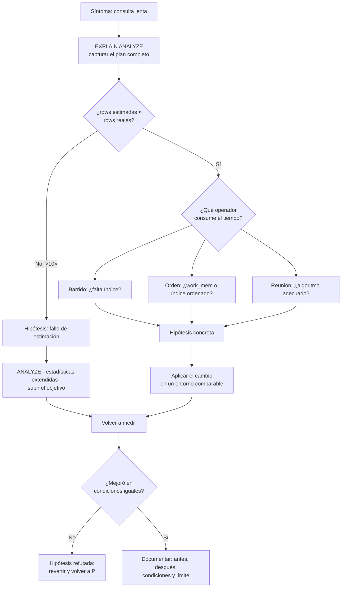

# 042 — Planes de ejecución: leer EXPLAIN y refutar una hipótesis

> [Programa](../../../README.md) · [Parte 08](../README.md) · [← Anterior](../../part-08-almacenamiento-indices-y-planes/041-indices-especializados/README.md) · [Siguiente →](../../part-09-distribucion-replica-y-consistencia/043-replica-lider-unico-multilider-y-sin-lider/README.md)

| | |
|---|---|
| **Parte** | 08 — Almacenamiento, índices y planes |
| **Nivel** | Avanzado |
| **Horas estimadas** | 4 |
| **Motores** | `postgresql`, `sqlite`, `duckdb` |
| **Laboratorio** | [`labs/04-indexing`](../../../labs/04-indexing/README.md) |
| **Fuentes** | 3 |

**Conceptos centrales:** `optimizador por costos` · `estadística` · `estimación de cardinalidad` · `costo frente a tiempo`

---

## Propósito

Leer un plan de ejecución como evidencia y no como adorno. El plan permite convertir «va lento» en una hipótesis concreta, comprobable y refutable.

## Resultados de aprendizaje

Al terminar podrás:

1. Explicar cómo el optimizador por costos elige un plan.
2. Distinguir costo estimado de tiempo real y filas estimadas de filas devueltas.
3. Diagnosticar los cuatro fallos habituales de estimación.
4. Refutar una hipótesis de rendimiento con evidencia.
5. Saber cuándo el problema es la estadística y no el índice.

## Fundamentos

### El optimizador por costos

Selinger et al. (1979) definieron el método que siguen todos los motores relacionales:

1. Enumerar planes equivalentes (equivalencias E1–E6 de la clase 011).
2. Estimar, para cada uno, cuántas filas produce cada operador a partir de las **estadísticas** del catálogo.
3. Asignar un costo mediante un modelo (páginas secuenciales, páginas aleatorias, CPU por fila).
4. Elegir el más barato.

El eslabón débil es el paso 2: **si la estimación de cardinalidad es mala, la elección será mala**, por bueno que sea el modelo de costos. Casi todos los planes malos son fallos de estimación.

### Las dos parejas de números

```sql
EXPLAIN (ANALYZE, BUFFERS, FORMAT TEXT) SELECT ...;
```

```text
Seq Scan on enrollments  (cost=0.00..91234.00 rows=12 width=32)
                         (actual time=0.03..842.11 rows=3841022 loops=1)
  Filter: (nota > 4.0)
  Rows Removed by Filter: 1158978
  Buffers: shared hit=1204 read=64586
```

| Pareja | Qué comparar |
|---|---|
| `cost` frente a `actual time` | El costo es una unidad interna, **no** milisegundos. Solo sirve para comparar planes entre sí |
| `rows` estimadas frente a `rows` reales | **Aquí está el diagnóstico.** Una desviación de más de 10× explica casi cualquier plan malo |

En el ejemplo: estimó 12 filas y devolvió 3 841 022. Un factor de 320 000. Con esa estimación el planificador eligió un bucle anidado que, con 3,8 millones de filas, es catastrófico.

### Los cuatro fallos de estimación

| Fallo | Síntoma | Corrección |
|---|---|---|
| **Estadísticas obsoletas** | Estimaciones lejanas tras una carga masiva | `ANALYZE tabla` |
| **Columnas correlacionadas** | Subestimación con varios `AND` | `CREATE STATISTICS ... (dependencies)` |
| **Distribución sesgada** | Bien para valores comunes, mal para los raros | Subir `default_statistics_target` |
| **Expresión opaca** | Estimación fija del 0,5 % o similar | Índice de expresión, o reescribir el predicado |

El segundo merece detalle. El planificador supone **independencia** entre predicados:

```text
sel(ciudad='Santiago') = 0,30
sel(region='Metropolitana') = 0,35
estimación combinada = 0,30 · 0,35 = 0,105  → 10,5 %
realidad: casi toda Santiago está en la Metropolitana → ~30 %
```

Subestima por un factor de 3. Con varias columnas correlacionadas, el error se multiplica. PostgreSQL 10+ permite corregirlo:

```sql
CREATE STATISTICS est_ciudad_region (dependencies, ndistinct)
  ON ciudad, region FROM direcciones;
ANALYZE direcciones;
```

### Método de refutación

Un plan no se «mejora»: se formula una hipótesis y se intenta **refutarla**.



El paso que casi nadie da es **revertir cuando la hipótesis se refuta**. Los índices que no sirvieron se quedan, y al cabo de dos años la tabla tiene once índices de los que se usan cuatro.

## Ejemplo trabajado

Síntoma: el panel del curso tarda 8 s.

```sql
EXPLAIN (ANALYZE, BUFFERS)
SELECT c.nombre, count(*) AS inscritos, avg(e.nota) AS promedio
FROM courses c JOIN enrollments e ON e.course_id = c.id
WHERE c.periodo = '2026-1' AND e.estado = 'activa'
GROUP BY c.id, c.nombre;
```

**Plan inicial:**

```text
HashAggregate  (cost=... rows=40) (actual time=8123.4..8124.1 rows=40 loops=1)
  ->  Nested Loop  (cost=... rows=53) (actual time=0.4..7890.2 rows=1521044 loops=1)
        ->  Seq Scan on courses c  (rows=40) (actual rows=40 loops=1)
              Filter: (periodo = '2026-1')
        ->  Index Scan using enr_course_idx on enrollments e
              (cost=... rows=1) (actual rows=38026 loops=40)
              Index Cond: (course_id = c.id)
              Filter: (estado = 'activa')
              Rows Removed by Filter: 6710
        Buffers: shared hit=201 read=182304
```

**Diagnóstico, leyendo los números:**

1. El bucle anidado estimó **53** filas y produjo **1 521 044**: factor 28 700.
2. El origen: el índice interno estimó `rows=1` por iteración y devolvió 38 026.
3. Con `rows=1` estimado, el bucle anidado parecía barato. Con 38 026, es la peor elección posible.

**Hipótesis 1:** las estadísticas de `enrollments` están obsoletas.

```sql
ANALYZE enrollments;
```

Nueva ejecución: la estimación interna pasa de 1 a 16 800. El planificador cambia a reunión por hash:

```text
HashAggregate  (actual time=612.3..613.0 rows=40 loops=1)
  ->  Hash Join  (actual time=88.1..520.7 rows=1521044 loops=1)
        ->  Seq Scan on enrollments e   (actual rows=4250000)
              Filter: (estado = 'activa')
        ->  Hash  ->  Seq Scan on courses c  (actual rows=40)
```

**8 123 ms → 613 ms** sin crear un solo índice. El problema nunca fue el índice: era la estadística.

**Hipótesis 2:** todavía se barren 4,25 millones de inscripciones. Un índice parcial evitaría el barrido.

```sql
CREATE INDEX enr_activas ON enrollments (course_id) INCLUDE (nota)
WHERE estado = 'activa';
```

```text
HashAggregate  (actual time=214.8..215.2 rows=40 loops=1)
  ->  Nested Loop  (actual rows=1521044 loops=1)
        ->  Seq Scan on courses c  (actual rows=40)
        ->  Index Only Scan using enr_activas  (actual rows=38026 loops=40)
              Heap Fetches: 0
```

**613 ms → 215 ms.** `Heap Fetches: 0` confirma que el índice cubre la consulta.

**Registro de evidencia, que es el entregable:**

```text
Consulta      : panel del curso, período 2026-1
Antes         : 8 123 ms · bucle anidado · estimación 53 / real 1 521 044
Intervención 1: ANALYZE enrollments        → 613 ms (reunión por hash)
Intervención 2: índice parcial cubriente   → 215 ms (Heap Fetches: 0)
Costo añadido : índice de 92 MB, mantenido en cada escritura de fila activa
Condiciones   : PostgreSQL 16, 5 M inscripciones, caché caliente en las tres medidas
No demuestra  : nada sobre concurrencia; una sola sesión
```

La penúltima línea —caché caliente en las tres medidas— es lo que hace comparables los números. La última evita que alguien extrapole.

## Comparación

| Señal en el plan | Causa probable | Acción |
|---|---|---|
| `rows` estimadas ≪ reales | Estadísticas obsoletas o correlación | `ANALYZE`, estadísticas extendidas |
| `Rows Removed by Filter` alto | Índice sin la columna del filtro | Añadirla al índice |
| `Sort Method: external merge` | `work_mem` insuficiente | Subirlo o indexar el orden |
| Bucle anidado con `loops` alto | Estimación baja del interno | Corregir estadística |
| `Heap Fetches` alto en barrido de índice | Mapa de visibilidad desactualizado | `VACUUM` |
| `read` ≫ `hit` en `Buffers` | El conjunto de trabajo no cabe | Más memoria o menos datos |

## Errores frecuentes

1. **Leer `cost` como milisegundos.** Es una unidad interna sin significado absoluto.
2. **Usar `EXPLAIN` sin `ANALYZE`.** No hay filas reales que comparar.
3. **Crear índices antes de mirar la estimación.** La mitad de los planes malos se arreglan con `ANALYZE`.
4. **Medir una vez en frío y otra en caliente.** Los números dejan de ser comparables.
5. **Forzar el plan con pistas.** Tapa el síntoma y estorba cuando los datos cambian.
6. **No revertir lo que no funcionó.** Los índices inútiles se acumulan.

## De la clase a la operación

Un plan que degrada tras un despliegue suele deberse a una carga masiva sin `ANALYZE` o a un cambio en la distribución de datos. Guardar los planes de las consultas críticas como referencia permite detectar el cambio en minutos en vez de en días.

## Reto de transferencia

1. Captura el plan de tu consulta más lenta con `ANALYZE` y `BUFFERS`.
2. Identifica el operador con mayor desviación entre estimación y realidad.
3. Formula una hipótesis, aplícala y vuelve a medir en las mismas condiciones.
4. Escribe el registro de evidencia completo, incluida la línea de «no demuestra».

## Preguntas de evaluación

1. ¿Por qué una subestimación de cardinalidad lleva a elegir bucle anidado?
2. Explica por qué el planificador subestima con columnas correlacionadas y cómo se corrige.
3. ¿Qué significa `Heap Fetches` distinto de cero en un barrido de índice?
4. Da una hipótesis tuya que resultó refutada y qué hiciste con el cambio.

---

## Laboratorio

```bash
python scripts/validate_repository.py
python labs/04-indexing/run_lab.py
```

Guarda como evidencia la salida completa, la versión del motor y la semilla o
los parámetros usados. Una captura sin comando no es evidencia: no se puede
repetir.

## Evaluación

| Criterio | Peso | Qué se comprueba |
|---|---:|---|
| Comprensión conceptual | 25 % | Explica el mecanismo, no solo el resultado |
| Ejecución reproducible | 25 % | Otra persona obtiene lo mismo con las instrucciones dadas |
| Interpretación basada en evidencia | 25 % | Cada conclusión se apoya en una salida o una medición |
| Límites y riesgos declarados | 25 % | Dice qué no demuestra el ejercicio y qué faltaría en producción |

La clase se da por superada cuando la respuesta explica el mecanismo, muestra
la salida que la respalda y declara al menos un límite del ejercicio.

## Fuentes de esta clase

Todo lo afirmado arriba procede de estas obras. Los identificadores viven en
[`catalog/sources.json`](../../../catalog/sources.json) y el estado de los
enlaces se comprueba con `python scripts/check_external_links.py`.

- **P. Griffiths Selinger, M. M. Astrahan, D. D. Chamberlin, R. A. Lorie, T. G. Price** (1979). [Access Path Selection in a Relational Database Management System](https://dl.acm.org/doi/10.1145/582095.582099). ACM SIGMOD. DOI [10.1145/582095.582099](https://doi.org/10.1145/582095.582099).  
  Base del optimizador por costos que siguen usando los motores actuales.
- **PostgreSQL Global Development Group** (2026). [PostgreSQL: Using EXPLAIN](https://www.postgresql.org/docs/current/using-explain.html).  
  Lectura de planes de ejecución y diferencia entre costo estimado y tiempo real.
- **SQLite Consortium** (2026). [SQLite: Query Optimizer Overview](https://sqlite.org/optoverview.html).  
  Como decide SQLite usar un índice; útil para leer EXPLAIN QUERY PLAN.

---

> [Programa](../../../README.md) · [Parte 08](../README.md) · [← Anterior](../../part-08-almacenamiento-indices-y-planes/041-indices-especializados/README.md) · [Siguiente →](../../part-09-distribucion-replica-y-consistencia/043-replica-lider-unico-multilider-y-sin-lider/README.md)
