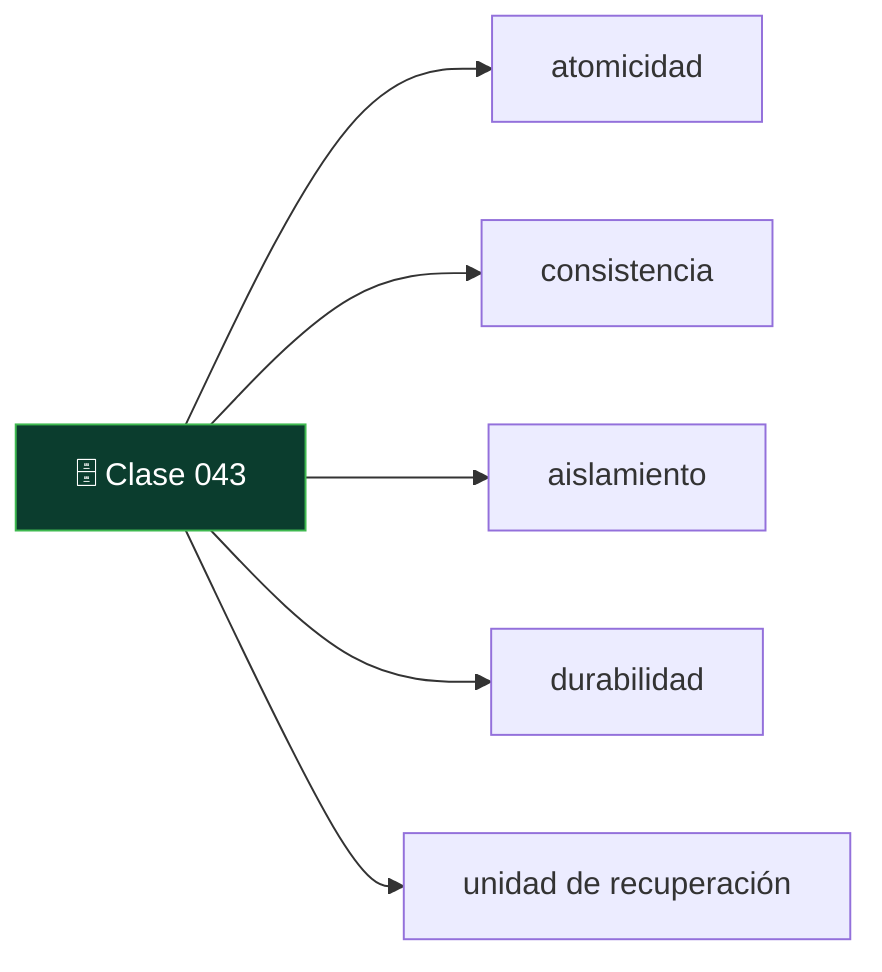
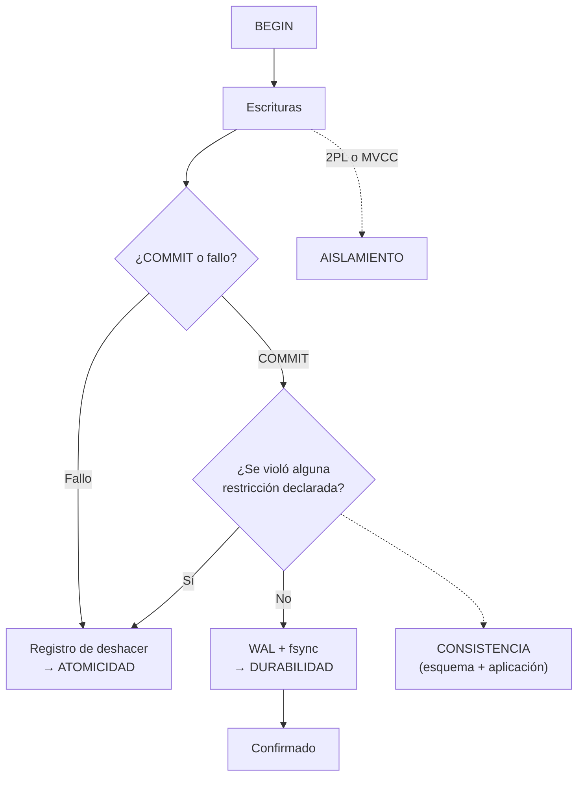

# 043 — ACID: qué garantiza cada letra y quién la implementa

   

> [Programa](../../../README.md) · [Parte 08](../README.md) · [← Anterior](../../part-07-grafos-columnas-tiempo-y-busqueda/042-analitica-columnar-y-vectorizacion/README.md) · [Siguiente →](../../part-08-transacciones-concurrencia-y-recuperacion/044-anomalias-de-aislamiento-y-la-critica-ansi/README.md)

Parte 08 — Transacciones, concurrencia y recuperación · Intermedio ·
3 horas estimadas · motores `postgresql`, `sqlite`, `mysql` · laboratorio
[`labs/03-transactions`](../../../labs/03-transactions/README.md) · 3 fuentes.

**Conceptos centrales:** `atomicidad` · `consistencia` · `aislamiento` · `durabilidad` · `unidad de recuperación`

**En este caso se comparan 7 motores**: 5 lo resuelven (4 con el resultado comprobado por máquina) y 2 no, con el motivo escrito.



---

## Propósito

Precisar qué garantiza cada letra de ACID, quién la implementa y qué queda fuera. «Usamos una base ACID» no significa que el sistema sea correcto: significa que existen unas garantías concretas si se usan bien.

## Resultados de aprendizaje

Al terminar podrás:

1. Definir con precisión atomicidad, consistencia, aislamiento y durabilidad.
2. Explicar por qué la C es distinta de las otras tres.
3. Identificar qué mecanismo del motor implementa cada letra.
4. Reconocer las garantías que se pierden por configuración.
5. Explicar por qué una transacción larga es un problema operativo.

## Fundamentos

### La transacción

Gray (1981) define la transacción como la unidad de trabajo que lleva la base de un estado consistente a otro, con la propiedad de que o se aplica entera o no se aplica nada. Es simultáneamente unidad de **recuperación**, de **concurrencia** y de **consistencia**.

### Las cuatro letras, una por una

**A — Atomicidad.** Todo o nada. Si la transacción falla o el proceso muere, no queda ningún efecto parcial. Lo implementa el registro de deshacer (*undo*): el motor guarda cómo revertir cada cambio antes de aplicarlo.

**C — Consistencia.** Aquí está la trampa pedagógica. Las otras tres letras son propiedades **del motor**; la C es una propiedad **de la aplicación y del esquema**. El motor solo garantiza las restricciones que alguien declaró (clase 013). Si nadie declaró que el saldo no puede ser negativo, ninguna transacción ACID lo impedirá.

Formulación honesta: *la atomicidad y el aislamiento permiten que la aplicación mantenga sus invariantes; la C es la afirmación de que las mantiene*.

**I — Aislamiento.** Las transacciones concurrentes producen un resultado equivalente a **alguna** ejecución en serie. Esa es la definición de serializabilidad, y es el nivel más fuerte. En la práctica casi todos los sistemas funcionan en niveles más débiles que **sí** permiten anomalías, y por defecto (clase 034). Lo implementan el bloqueo en dos fases o el control multiversión (clase 035).

**D — Durabilidad.** Una vez confirmada, la transacción sobrevive a fallos. Lo implementa el registro anticipado (clase 036). El matiz importante: durabilidad **frente a qué fallo**. Sobrevivir a la caída del proceso, a la de la máquina, a la pérdida del disco y a la del centro de datos son cuatro garantías distintas con cuatro costos distintos.

| Fallo | Mecanismo necesario |
|---|---|
| Caída del proceso | WAL escrito al sistema operativo |
| Caída de la máquina | `fsync` del WAL al disco |
| Pérdida del disco | Réplica o copia externa |
| Pérdida del centro de datos | Réplica geográficamente distante |
| Error humano (`DROP TABLE`) | Copia con recuperación a un punto en el tiempo |

Ninguna configuración de un solo nodo protege de las tres últimas.

### Garantías que se pierden por configuración

| Configuración | Qué se pierde |
|---|---|
| PostgreSQL `synchronous_commit = off` | Durabilidad: hasta ~0,2 s de transacciones confirmadas |
| PostgreSQL `fsync = off` | Durabilidad y posiblemente la integridad del archivo |
| MySQL `innodb_flush_log_at_trx_commit = 2` | Durabilidad ante caída de la máquina |
| MySQL con tablas MyISAM | **Todo**: no hay transacciones |
| Réplica asíncrona con conmutación | Las transacciones aún no replicadas |
| SQLite `synchronous = OFF` | Durabilidad e integridad ante corte de energía |

La primera y la tercera son decisiones legítimas para datos reconstruibles, y hay que **declararlas**, no heredarlas de un archivo de configuración copiado.



## Ejemplo trabajado

Transferencia entre cuentas, el caso canónico:

```sql
BEGIN;
UPDATE cuentas SET saldo = saldo - 300 WHERE id = 1;
UPDATE cuentas SET saldo = saldo + 300 WHERE id = 2;
COMMIT;
```

**Qué garantiza cada letra aquí:**

- **A:** si el proceso muere entre los dos `UPDATE`, ninguno queda aplicado. Los 300 no desaparecen.
- **I:** otra transferencia concurrente sobre la cuenta 1 no ve el estado intermedio ni provoca actualización perdida (con el nivel adecuado).
- **D:** tras el `COMMIT`, un corte de energía no deshace la operación.
- **C:** **nada**, salvo que se declare. Sin restricciones, esto se acepta:

```sql
BEGIN;
UPDATE cuentas SET saldo = saldo - 100000 WHERE id = 1;  -- saldo queda en -99 700
COMMIT;   -- ACID perfecto, negocio roto
```

La transacción es atómica, aislada y duradera, y deja un saldo imposible. La C exige escribirla:

```sql
ALTER TABLE cuentas ADD CONSTRAINT saldo_no_negativo CHECK (saldo >= 0);
```

Ahora sí: el `UPDATE` falla, la transacción se revierte y la atomicidad garantiza que no queda rastro.

**La invariante que un `CHECK` no cubre.** «La suma de todos los saldos es constante»: relaciona filas distintas y no hay `CHECK` estándar que lo exprese. Solo el aislamiento serializable garantiza que dos transferencias concurrentes no la rompan; en niveles más débiles hay que auditarla:

```sql
SELECT SUM(saldo) FROM cuentas;   -- debe coincidir con el total esperado
```

**Transacciones largas: el problema operativo.**

```sql
BEGIN;
SELECT * FROM enrollments;          -- el informe tarda 40 minutos
-- ... la sesión queda abierta ...
COMMIT;
```

Durante esos 40 minutos, en un motor MVCC:

- El motor **no puede** limpiar las versiones antiguas de fila, porque esta transacción podría necesitarlas. Las tablas se hinchan (clase 021).
- Con bloqueo (SQL Server en `READ COMMITTED` por defecto), además bloquea escritores.
- Si la transacción escribió algo, mantiene sus bloqueos todo ese tiempo.

Medición típica: una transacción abierta 40 minutos en una base con 2 000 actualizaciones por segundo impide recuperar ~4,8 millones de versiones de fila. La consecuencia se ve como «la base creció 30 GB de la nada».

**Regla operativa:** una transacción abarca las escrituras que deben ser atómicas y nada más. Nunca debe contener llamadas de red a servicios externos, esperas de usuario ni informes largos.

## Comparación

| Propiedad | La garantiza | Se pierde si |
|---|---|---|
| Atomicidad | Registro de deshacer | Casi nunca; el motor la sostiene |
| Consistencia | Esquema + aplicación | No se declaran las restricciones |
| Aislamiento | 2PL o MVCC | Nivel por defecto más débil que serializable |
| Durabilidad | WAL + `fsync` | Configuración de rendimiento; réplica asíncrona |

## Errores frecuentes

1. **Creer que la C la pone el motor.** La pone el esquema que se escribió.
2. **Suponer serializable por defecto.** Ningún motor de servidor lo hace por omisión.
3. **Transacciones que envuelven llamadas HTTP.** Un servicio lento hincha la base.
4. **Confiar en la durabilidad con réplica asíncrona y conmutación automática.** Se pierden transacciones confirmadas.
5. **Usar MyISAM y hablar de transacciones.** No las hay.
6. **No probar la restauración.** La durabilidad sin restauración probada es una suposición (clase 048).

## De la clase a la operación

«Somos ACID» es una respuesta incompleta a «¿pueden perder mi pedido?». La respuesta completa enumera: el nivel de aislamiento efectivo, la configuración de `fsync`, el modo de replicación y el resultado de la última prueba de restauración.

## Reto de transferencia

1. Determina el nivel de aislamiento y la configuración de durabilidad reales de tu base.
2. Escribe la invariante de negocio más importante y verifica si el esquema la garantiza.
3. Provoca un fallo a mitad de una transacción y demuestra la atomicidad.
4. Localiza la transacción más larga de tu sistema y estima su efecto sobre las versiones de fila.

## Preguntas de evaluación

1. ¿Por qué la C es de naturaleza distinta a A, I y D?
2. Da una invariante de tu dominio que ningún `CHECK` pueda expresar y di quién la vigila.
3. Enumera los cuatro fallos frente a los que puede exigirse durabilidad y el mecanismo de cada uno.
4. Explica el efecto de una transacción abierta durante una hora en un motor MVCC.

---

## 🌐 El mismo problema en cada motor

**Caso:** Una transferencia que se completa y otra que se deshace sin dejar rastro

ACID son cuatro promesas distintas y conviene no confundirlas. **A**tomicidad:
o todo o nada. **C**onsistencia: las reglas declaradas siguen siendo ciertas
al terminar. **I**slamiento: las transacciones concurrentes no se ven a
medias. **D**urabilidad: lo confirmado sobrevive a un corte de luz.

El caso ejercita las dos primeras. Una transferencia de 30 de A a B se
confirma; otra de 500 se deshace, y con ella la mitad que ya se había
escrito. Entre las dos sentencias de la transferencia hay un instante en el
que el dinero está duplicado: la atomicidad es la garantía de que ese
instante no existe para nadie más, y que al deshacer no queda rastro.

Al final, A tiene 70 y B tiene 80: la suma sigue siendo 150, que es el
invariante que ninguna transferencia debe romper.

Salida esperada, idéntica en todos los motores que lo resuelven:

| cuenta | saldo |
|---|---|
| `A` | `70` |
| `B` | `80` |

El contrato vive en [`motores.yaml`](motores.yaml) y lo comprueba
`python scripts/verificar_equivalencia.py --clase 043`: 4 de
las 5 implementaciones se ejecutan de verdad y su
resultado se compara con esa tabla; el resto se declara como material revisado,
no ejecutado.

| Motor | ¿Resuelve el caso? | Nivel de prueba | Código | Fuente |
|---|---|---|---|---|
| SQLite | sí | núcleo | [código](implementaciones/sqlite/consulta.sql) | [doc oficial](https://sqlite.org/transactional.html) |
| DuckDB | sí | núcleo | [código](implementaciones/duckdb/consulta.sql) | [doc oficial](https://duckdb.org/docs/stable/sql/statements/transactions.html) |
| PostgreSQL | sí | servicio | [código](implementaciones/postgresql/consulta.sql) | [doc oficial](https://www.postgresql.org/docs/current/tutorial-transactions.html) |
| MySQL | sí | servicio | [código](implementaciones/mysql/consulta.sql) | [doc oficial](https://dev.mysql.com/doc/refman/8.4/en/innodb-transaction-model.html) |
| MongoDB | sí | declarado | [código](implementaciones/mongodb/consulta.js) | [doc oficial](https://www.mongodb.com/docs/manual/core/transactions/) |
| Redis | **no** | — | — | [doc oficial](https://redis.io/docs/latest/develop/interact/transactions/) |
| Apache Cassandra | **no** | — | — | [doc oficial](https://cassandra.apache.org/doc/latest/cassandra/developing/cql/dml.html) |

### Los que resuelven el caso

#### SQLite · [`implementaciones/sqlite/consulta.sql`](implementaciones/sqlite/consulta.sql)

✅ **verificado** — se ejecuta en CI sin servicios

```sql
-- motor: sqlite
-- doc: https://sqlite.org/transactional.html
-- nota: el CHECK (saldo >= 0) es la «C» de ACID: la regla que sigue siendo
--       cierta al terminar. El ROLLBACK es la «A». Son dos garantias distintas
--       y aqui se ven las dos en el mismo archivo.

-- === preparacion ===
CREATE TABLE cuentas (
    id    TEXT PRIMARY KEY,
    saldo INTEGER NOT NULL CHECK (saldo >= 0)
);
INSERT INTO cuentas (id, saldo) VALUES ('A', 100), ('B', 50);

-- Transferencia valida: las dos escrituras son UNA operacion.
BEGIN;
UPDATE cuentas SET saldo = saldo - 30 WHERE id = 'A';
UPDATE cuentas SET saldo = saldo + 30 WHERE id = 'B';
COMMIT;

-- Transferencia imposible: A no tiene 500. El abono a B ya se ha escrito
-- cuando la aplicacion comprueba el origen y decide deshacer. Entre las dos
-- sentencias existe un instante en el que el dinero esta duplicado; la
-- atomicidad es la garantia de que ese instante no existe para nadie mas y de
-- que al deshacer no queda rastro de el.
BEGIN;
UPDATE cuentas SET saldo = saldo + 500 WHERE id = 'B';
-- El cargo a A ni siquiera se intenta: violaria el CHECK (saldo >= 0) y, sin
-- transaccion, el abono a B se habria quedado escrito para siempre.
ROLLBACK;

-- === consulta ===
SELECT id, saldo FROM cuentas ORDER BY id;
```

- **Por qué sí:** Es ACID completo desde su primera versión, sobre un archivo y sin servidor: la atomicidad se implementa con un diario de reversión o con WAL, y sobrevive a un corte de luz igual que un motor grande.
- **Por qué no:** El aislamiento es de grano grueso: en el modo por omisión, un escritor bloquea la base entera. Y la durabilidad depende de `PRAGMA synchronous`, que muchas aplicaciones bajan a `NORMAL` para ganar velocidad sin declarar que están cambiando la «D» por rendimiento.
- 📄 Documentación oficial: <https://sqlite.org/transactional.html>

#### DuckDB · [`implementaciones/duckdb/consulta.sql`](implementaciones/duckdb/consulta.sql)

✅ **verificado** — se ejecuta en CI sin servicios

```sql
-- motor: duckdb
-- doc: https://duckdb.org/docs/stable/sql/statements/transactions.html

-- === preparacion ===
CREATE TABLE cuentas (
    id    VARCHAR PRIMARY KEY,
    saldo INTEGER NOT NULL CHECK (saldo >= 0)
);
INSERT INTO cuentas (id, saldo) VALUES ('A', 100), ('B', 50);

-- Transferencia valida: las dos escrituras son UNA operacion.
BEGIN;
UPDATE cuentas SET saldo = saldo - 30 WHERE id = 'A';
UPDATE cuentas SET saldo = saldo + 30 WHERE id = 'B';
COMMIT;

-- Transferencia imposible: A no tiene 500. El abono a B ya se ha escrito
-- cuando la aplicacion comprueba el origen y decide deshacer. Entre las dos
-- sentencias existe un instante en el que el dinero esta duplicado; la
-- atomicidad es la garantia de que ese instante no existe para nadie mas y de
-- que al deshacer no queda rastro de el.
BEGIN;
UPDATE cuentas SET saldo = saldo + 500 WHERE id = 'B';
-- El cargo a A ni siquiera se intenta: violaria el CHECK (saldo >= 0) y, sin
-- transaccion, el abono a B se habria quedado escrito para siempre.
ROLLBACK;

-- === consulta ===
SELECT id, saldo FROM cuentas ORDER BY id;
```

- **Por qué sí:** También es ACID sobre su archivo, con control de concurrencia por versiones: sirve para comprobar el invariante en el mismo sitio donde se analizan los datos.
- **Por qué no:** Un solo proceso escritor: no hay transacciones entre aplicaciones, y por tanto el problema real de la concurrencia no se puede ni plantear aquí.
- 📄 Documentación oficial: <https://duckdb.org/docs/stable/sql/statements/transactions.html>

#### PostgreSQL · [`implementaciones/postgresql/consulta.sql`](implementaciones/postgresql/consulta.sql)

✅ **verificado** — se ejecuta contra el motor real levantado con `docker compose`

```sql
-- motor: postgresql
-- doc: https://www.postgresql.org/docs/current/tutorial-transactions.html
-- nota: aqui el DDL tambien es transaccional. Esto es legal y se deshace entero:
--         BEGIN; ALTER TABLE cuentas ADD COLUMN divisa text; ROLLBACK;
--       En MySQL y en Oracle, ese ALTER confirma la transaccion y no hay vuelta
--       atras. Es la razon por la que las migraciones de esquema son mucho mas
--       seguras en PostgreSQL.

-- === preparacion ===
DROP TABLE IF EXISTS cuentas;

CREATE TABLE cuentas (
    id    text PRIMARY KEY,
    saldo integer NOT NULL CHECK (saldo >= 0)
);
INSERT INTO cuentas (id, saldo) VALUES ('A', 100), ('B', 50);

-- Transferencia valida: las dos escrituras son UNA operacion.
BEGIN;
UPDATE cuentas SET saldo = saldo - 30 WHERE id = 'A';
UPDATE cuentas SET saldo = saldo + 30 WHERE id = 'B';
COMMIT;

-- Transferencia imposible: A no tiene 500. El abono a B ya se ha escrito
-- cuando la aplicacion comprueba el origen y decide deshacer. Entre las dos
-- sentencias existe un instante en el que el dinero esta duplicado; la
-- atomicidad es la garantia de que ese instante no existe para nadie mas y de
-- que al deshacer no queda rastro de el.
BEGIN;
UPDATE cuentas SET saldo = saldo + 500 WHERE id = 'B';
-- El cargo a A ni siquiera se intenta: violaria el CHECK (saldo >= 0) y, sin
-- transaccion, el abono a B se habria quedado escrito para siempre.
ROLLBACK;

-- === consulta ===
SELECT id, saldo FROM cuentas ORDER BY id;
```

- **Por qué sí:** Las cuatro letras están, y además el DDL es transaccional: se puede crear una tabla, cargarla y deshacerlo todo. Esa propiedad —que MySQL y Oracle no tienen— es la que hace seguras las migraciones de esquema.
- **Por qué no:** La durabilidad se puede aflojar por sesión con `synchronous_commit = off`, que multiplica el rendimiento a cambio de poder perder las últimas transacciones confirmadas. Es legítimo y hay que declararlo, porque deja de ser ACID en el sentido estricto.
- 📄 Documentación oficial: <https://www.postgresql.org/docs/current/tutorial-transactions.html>

#### MySQL · [`implementaciones/mysql/consulta.sql`](implementaciones/mysql/consulta.sql)

✅ **verificado** — se ejecuta contra el motor real levantado con `docker compose`

```sql
-- motor: mysql
-- doc: https://dev.mysql.com/doc/refman/8.4/en/innodb-transaction-model.html
-- nota: dos avisos que no estan en el codigo y hay que saber igual:
--       1) El DDL NO es transaccional: un ALTER TABLE dentro de una transaccion
--          la confirma implicitamente.
--       2) innodb_flush_log_at_trx_commit distinto de 1 significa perder hasta
--          un segundo de transacciones YA CONFIRMADAS tras una caida.

-- === preparacion ===
DROP TABLE IF EXISTS cuentas;

CREATE TABLE cuentas (
    id    VARCHAR(10) PRIMARY KEY,
    saldo INT NOT NULL CHECK (saldo >= 0)
);
INSERT INTO cuentas (id, saldo) VALUES ('A', 100), ('B', 50);

-- Transferencia valida: las dos escrituras son UNA operacion.
BEGIN;
UPDATE cuentas SET saldo = saldo - 30 WHERE id = 'A';
UPDATE cuentas SET saldo = saldo + 30 WHERE id = 'B';
COMMIT;

-- Transferencia imposible: A no tiene 500. El abono a B ya se ha escrito
-- cuando la aplicacion comprueba el origen y decide deshacer. Entre las dos
-- sentencias existe un instante en el que el dinero esta duplicado; la
-- atomicidad es la garantia de que ese instante no existe para nadie mas y de
-- que al deshacer no queda rastro de el.
BEGIN;
UPDATE cuentas SET saldo = saldo + 500 WHERE id = 'B';
-- El cargo a A ni siquiera se intenta: violaria el CHECK (saldo >= 0) y, sin
-- transaccion, el abono a B se habria quedado escrito para siempre.
ROLLBACK;

-- === consulta ===
SELECT id, saldo FROM cuentas ORDER BY id;
```

- **Por qué sí:** InnoDB es ACID: registro de rehacer, registro de deshacer y confirmación en dos fases con el registro binario.
- **Por qué no:** Dos trampas históricas. El DDL **no** es transaccional: un `ALTER TABLE` dentro de una transacción la confirma implícitamente y ya no hay vuelta atrás. Y `innodb_flush_log_at_trx_commit` distinto de 1 significa perder hasta un segundo de transacciones confirmadas tras una caída.
- 📄 Documentación oficial: <https://dev.mysql.com/doc/refman/8.4/en/innodb-transaction-model.html>

#### MongoDB · [`implementaciones/mongodb/consulta.js`](implementaciones/mongodb/consulta.js)

⚪ **declarado** — se revisa a mano contra la documentación citada; la máquina no lo ejecuta

```javascript
// motor: mongodb
// doc: https://www.mongodb.com/docs/manual/core/transactions/
// nota: implementacion DECLARADA, y el motivo es parte de la leccion: las
//       transacciones de varios documentos exigen un CONJUNTO DE REPLICAS. En
//       el servidor suelto que levanta este repositorio, este guion falla con
//       «Transaction numbers are only allowed on a replica set member or
//       mongos». No se ejecuta porque no se puede, y decirlo vale mas que
//       fingir que si.
//
//       Con una sola cuenta por documento no haria falta nada de esto: la
//       escritura de un documento ya es atomica. La transaccion aparece justo
//       cuando el agregado se reparte en dos documentos, que es la senal de que
//       el modelo documental se esta usando como si fuera relacional.

// === preparacion ===
db.cuentas.drop();
db.cuentas.insertMany([
  { _id: "A", saldo: 100 },
  { _id: "B", saldo: 50 },
]);

const sesion = db.getMongo().startSession();
const cuentas = sesion.getDatabase(db.getName()).cuentas;

// Transferencia valida.
sesion.startTransaction();
cuentas.updateOne({ _id: "A" }, { $inc: { saldo: -30 } });
cuentas.updateOne({ _id: "B" }, { $inc: { saldo: 30 } });
sesion.commitTransaction();

// Transferencia imposible: se comprueba DENTRO de la transaccion y se aborta.
sesion.startTransaction();
cuentas.updateOne({ _id: "B" }, { $inc: { saldo: 500 } });
const origen = cuentas.findOne({ _id: "A" });
if (origen.saldo < 500) {
  sesion.abortTransaction();
} else {
  cuentas.updateOne({ _id: "A" }, { $inc: { saldo: -500 } });
  sesion.commitTransaction();
}
sesion.endSession();

// === consulta ===
db.cuentas
  .find()
  .sort({ _id: 1 })
  .forEach((d) => print(d._id + "|" + d.saldo));
```

- **Por qué sí:** Desde la versión 4.0 tiene transacciones de varios documentos con la misma semántica: `startTransaction`, `commitTransaction`, `abortTransaction`. Sobre un solo documento, la atomicidad es automática y no hace falta nada.
- **Por qué no:** **Exigen un conjunto de réplicas**: en un servidor suelto —como el de este repositorio— sencillamente no se pueden usar, y por eso esta implementación se declara en vez de ejecutarse. Además tienen un límite de 60 segundos por omisión y un costo notable frente a escribir un solo documento, que es la señal de que el modelo debería haberse diseñado para no necesitarlas.
- 📄 Documentación oficial: <https://www.mongodb.com/docs/manual/core/transactions/>

### Los que no resuelven este caso — y qué se hace en su lugar

Descartar un motor con un argumento es tan formativo como usarlo. Ninguna de estas filas dice que el motor sea peor: dice que este problema no es el suyo.

| Motor | Por qué no | Qué se hace en su lugar | Fuente |
|---|---|---|---|
| Redis | `MULTI`/`EXEC` no es una transacción ACID: garantiza que las órdenes se ejecutan seguidas y sin intercalación, pero **no hay reversión**. Si una orden falla en medio, las anteriores ya se aplicaron y las siguientes se aplican igual. Su documentación lo dice sin rodeos. | Un script Lua, que sí es atómico y aislado, comprobando las condiciones **antes** de escribir nada: la reversión se sustituye por no llegar a empezar. | [doc](https://redis.io/docs/latest/develop/interact/transactions/) |
| Apache Cassandra | No hay transacciones entre particiones ni reversión. `BATCH` solo es atómico y aislado dentro de una partición, y su uso entre particiones lo desaconseja la propia documentación por el costo del registro de lotes. | Diseñar para que la operación quepa en una partición, o implementar una saga con pasos compensatorios en la aplicación, asumiendo que hay estados intermedios visibles. | [doc](https://cassandra.apache.org/doc/latest/cassandra/developing/cql/dml.html) |

---

## Laboratorio

```bash
python scripts/validate_repository.py
python labs/03-transactions/run_transactions_lab.py
```

Guarda como evidencia la salida completa, la versión del motor y la semilla o
los parámetros usados. Una captura sin comando no es evidencia: no se puede
repetir.

## Evaluación

| Criterio | Peso | Qué se comprueba |
|---|---:|---|
| Comprensión conceptual | 25 % | Explica el mecanismo, no solo el resultado |
| Ejecución reproducible | 25 % | Otra persona obtiene lo mismo con las instrucciones dadas |
| Interpretación basada en evidencia | 25 % | Cada conclusión se apoya en una salida o una medición |
| Límites y riesgos declarados | 25 % | Dice qué no demuestra el ejercicio y qué faltaría en producción |

La clase se da por superada cuando la respuesta explica el mecanismo, muestra
la salida que la respalda y declara al menos un límite del ejercicio.

## Fuentes de esta clase

Todo lo afirmado arriba procede de estas obras. Los identificadores viven en
[`catalog/sources.json`](../../../catalog/sources.json) y el estado de los
enlaces se comprueba con `python scripts/check_external_links.py`.

- **Jim Gray** (1981). [The Transaction Concept: Virtues and Limitations](https://jimgray.azurewebsites.net/papers/thetransactionconcept.pdf). VLDB.  
  Define la transacción como unidad de consistencia y recuperación.
- **Jim Gray, Andreas Reuter** (1992). [Transaction Processing: Concepts and Techniques](https://www.sciencedirect.com/book/9781558601901/transaction-processing). Morgan Kaufmann. ISBN 978-1-55860-190-1.  
  Obra canónica sobre ACID, bloqueo, registro y recuperación.
- **Abraham Silberschatz, Henry F. Korth, S. Sudarshan** (2019). [Database System Concepts](https://db-book.com/). 7.a ed. McGraw-Hill. ISBN 978-0-07-802215-9.  
  Texto de referencia universitario. El sitio oficial publica diapositivas y capítulos de muestra.

---

> [Programa](../../../README.md) · [Parte 08](../README.md) · [← Anterior](../../part-07-grafos-columnas-tiempo-y-busqueda/042-analitica-columnar-y-vectorizacion/README.md) · [Siguiente →](../../part-08-transacciones-concurrencia-y-recuperacion/044-anomalias-de-aislamiento-y-la-critica-ansi/README.md)
