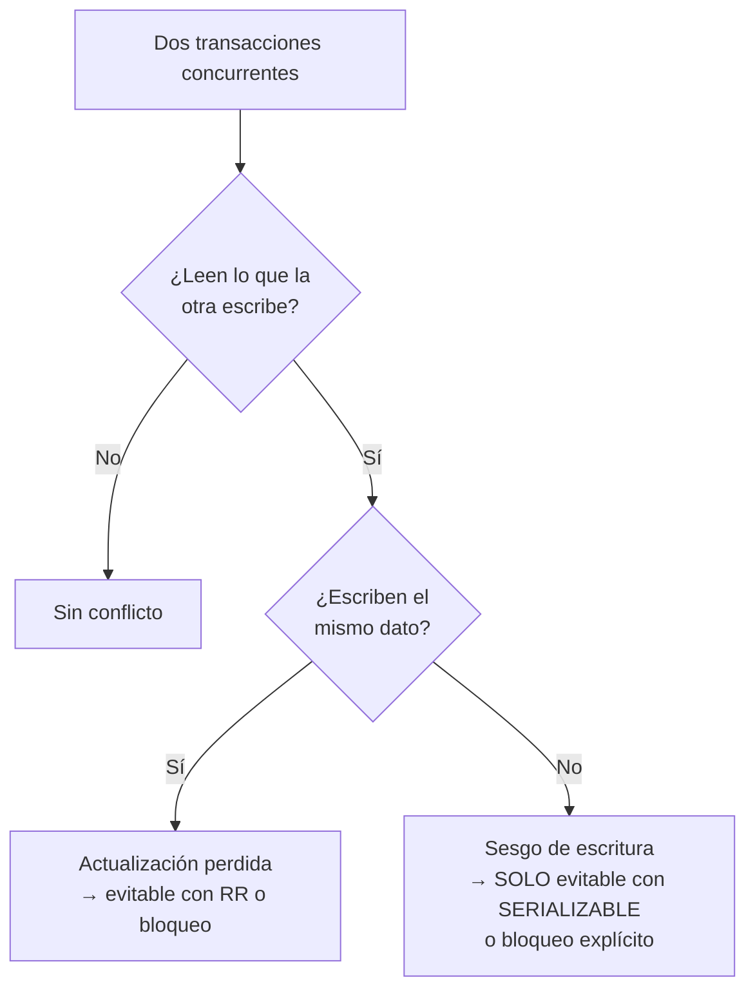

# 044 — Anomalías de aislamiento y la crítica a los niveles ANSI

> [Programa](../../../README.md) · [Parte 08](../README.md) · [← Anterior](../../part-08-transacciones-concurrencia-y-recuperacion/043-acid-que-garantiza-cada-letra/README.md) · [Siguiente →](../../part-08-transacciones-concurrencia-y-recuperacion/045-bloqueo-en-dos-fases-y-mvcc/README.md)

Parte 08 — Transacciones, concurrencia y recuperación · Avanzado ·
4 horas estimadas · motores `postgresql`, `mysql`, `sqlite` · laboratorio
[`labs/03-transactions`](../../../labs/03-transactions/README.md) · 5 fuentes.

**Conceptos centrales:** `lectura sucia` · `lectura no repetible` · `fantasma` · `sesgo de escritura` · `snapshot isolation`

**En este caso se comparan 7 motores**: 6 lo resuelven (0 con el resultado comprobado por máquina) y 1 no, con el motivo escrito.

---

## Propósito

Reproducir las anomalías de concurrencia una por una y saber cuáles permite tu motor en su nivel por defecto. El nombre del nivel no basta: hay que comprobar el comportamiento.

## Resultados de aprendizaje

Al terminar podrás:

1. Reproducir cada anomalía con dos sesiones y una traza temporal.
2. Explicar por qué la norma ANSI define los niveles de forma ambigua.
3. Distinguir instantánea de serializable y describir el sesgo de escritura.
4. Comprobar empíricamente qué permite tu motor, con el método de Hermitage.
5. Elegir nivel de aislamiento con un criterio explícito.

## Fundamentos

### Las anomalías

| Anomalía | Qué ocurre |
|---|---|
| **P0 Escritura sucia** | Una transacción sobrescribe un dato no confirmado de otra |
| **P1 Lectura sucia** | Se lee un dato que después se revierte |
| **P2 Lectura no repetible** | Se lee dos veces el mismo dato y cambia |
| **P3 Fantasma** | Se repite una consulta de rango y aparecen filas nuevas |
| **P4 Actualización perdida** | Dos lecturas-modificaciones concurrentes; una se pierde |
| **A5A Lectura sesgada** | Se leen dos datos relacionados y se ve una combinación imposible |
| **A5B Sesgo de escritura** | Dos transacciones leen lo mismo, escriben cosas distintas y juntas rompen una invariante |

### La crítica de Berenson y otros

El artículo de 1995 demuestra que la norma ANSI SQL-92 define los niveles enumerando fenómenos prohibidos, y que esas definiciones son **ambiguas**: admiten una lectura estricta y otra laxa. Peor: no cubren el sesgo de escritura, así que un sistema puede ser conforme a `SERIALIZABLE` según la letra de la norma y permitir anomalías.

De ahí sale además la caracterización de **snapshot isolation** (aislamiento de instantánea), que la norma ni menciona y que hoy implementan PostgreSQL, Oracle y SQL Server.

Adya (1999) reformula las definiciones sin referirse a la implementación, mediante grafos de dependencias entre transacciones. Es la formulación que usan los verificadores modernos.

**Consecuencia práctica:** el nombre del nivel no dice qué garantiza. `REPEATABLE READ` significa cosas distintas en MySQL y en PostgreSQL.

### Lo que permite cada motor, de verdad

| Anomalía | PG `RC` | PG `RR` | PG `SER` | MySQL `RR` | SQLite |
|---|---|---|---|---|---|
| Lectura sucia | No | No | No | No | No |
| Lectura no repetible | **Sí** | No | No | No | No |
| Fantasma | **Sí** | No | No | No | No |
| Actualización perdida | **Sí** | No (aborta) | No | **Sí**\* | No |
| Sesgo de escritura | **Sí** | **Sí** | No | **Sí** | No |

\* MySQL `REPEATABLE READ` con lecturas normales; con `SELECT ... FOR UPDATE` se evita.

Dos hechos que importan:

- **PostgreSQL `REPEATABLE READ` es aislamiento de instantánea**, no la definición ANSI. No permite fantasmas —lo que la norma sí permitiría— y sí permite sesgo de escritura.
- **Solo `SERIALIZABLE` evita el sesgo de escritura.** PostgreSQL lo implementa con aislamiento de instantánea serializable (SSI), que detecta ciclos de dependencia y aborta una transacción.



## Ejemplo trabajado

### Actualización perdida

```text
Sesión A                              Sesión B
BEGIN;
SELECT saldo FROM c WHERE id=1;  1000
                                      BEGIN;
                                      SELECT saldo FROM c WHERE id=1;  1000
UPDATE c SET saldo=700 WHERE id=1;
COMMIT;
                                      UPDATE c SET saldo=500 WHERE id=1;
                                      COMMIT;
```

Resultado: 500. Correcto: 200.

| Nivel | Comportamiento |
|---|---|
| `READ COMMITTED` | Ocurre: B pisa a A |
| `REPEATABLE READ` (PG) | B aborta con `could not serialize access` |
| `READ COMMITTED` + `SELECT ... FOR UPDATE` | B espera a A y lee 700 |
| `UPDATE c SET saldo = saldo - 500` | El motor lee y escribe en una operación: no ocurre |

La última fila es la más importante: **una única sentencia atómica de lectura-modificación elimina la anomalía sin cambiar el nivel de aislamiento**. Es la solución más barata y la más ignorada.

### Sesgo de escritura

La anomalía que sobrevive al aislamiento de instantánea. Regla: *«siempre debe haber al menos un profesor asignado a cada curso»*. Hay dos, Ana y Luis, y ambos piden baja a la vez.

```text
Sesión A (Ana)                              Sesión B (Luis)
BEGIN ISOLATION LEVEL REPEATABLE READ;
SELECT COUNT(*) FROM teaching
  WHERE course_id='bd';           -- 2
                                            BEGIN ISOLATION LEVEL REPEATABLE READ;
                                            SELECT COUNT(*) FROM teaching
                                              WHERE course_id='bd';       -- 2
-- 2 >= 2, puedo darme de baja
DELETE FROM teaching
  WHERE course_id='bd' AND teacher_id=1;
                                            -- 2 >= 2, puedo darme de baja
                                            DELETE FROM teaching
                                              WHERE course_id='bd' AND teacher_id=2;
COMMIT;
                                            COMMIT;
```

**Resultado: cero profesores.** Ninguna transacción escribió sobre lo que la otra escribió —A borró la fila 1 y B la 2—, así que no hay conflicto de escritura que detectar. Cada una leyó un estado en el que su acción era válida y juntas rompieron la invariante.

Es el ejemplo canónico y el mejor argumento contra «con instantánea basta».

Tres soluciones:

```sql
-- 1. SERIALIZABLE: PostgreSQL detecta el ciclo y aborta una
BEGIN ISOLATION LEVEL SERIALIZABLE;
-- ... la segunda en confirmar recibe:
-- ERROR: could not serialize access due to read/write dependencies among transactions
```

```sql
-- 2. Materializar el conflicto: bloquear la fila padre
BEGIN;
SELECT id FROM courses WHERE id='bd' FOR UPDATE;   -- las dos compiten por ESTA fila
SELECT COUNT(*) FROM teaching WHERE course_id='bd';
DELETE FROM teaching WHERE course_id='bd' AND teacher_id=1;
COMMIT;
```

```sql
-- 3. Convertirlo en una restricción declarativa que el motor comprueba
--    (contador con CHECK, o restricción diferida: clase 013)
```

`SERIALIZABLE` es la solución correcta y tiene un costo: transacciones abortadas que la aplicación **debe** reintentar. Cualquier código que use `SERIALIZABLE` sin bucle de reintento está incompleto.

### Comprobarlo empíricamente

El método de Hermitage (Kleppmann) es un conjunto de guiones de dos sesiones, uno por anomalía, que se ejecutan contra cada motor y cada nivel. El resultado es una tabla de hechos, no de promesas de la documentación.

Reproducirlo con dos terminales sobre el `docker-compose` del repositorio es el laboratorio de esta clase.

## Comparación

| Nivel | Evita | Permite | Costo |
|---|---|---|---|
| `READ UNCOMMITTED` | — | Todo | Ninguno |
| `READ COMMITTED` | Lectura sucia | No repetible, fantasma, perdida, sesgo | Bajo |
| `REPEATABLE READ` / instantánea | + no repetible, fantasma, perdida | **Sesgo de escritura** | Abortos ocasionales |
| `SERIALIZABLE` | Todo | — | Abortos frecuentes con contención |

## Errores frecuentes

1. **Suponer que el nombre del nivel define el comportamiento.** Varía entre motores.
2. **Creer que instantánea es serializable.** El sesgo de escritura los separa.
3. **Usar `SERIALIZABLE` sin reintentos.** Los abortos son parte del contrato.
4. **Leer-modificar-escribir en la aplicación** cuando bastaría una sentencia atómica.
5. **Subir el nivel de aislamiento sin identificar la anomalía concreta.** Se paga contención sin saber qué se compró.
6. **Probar la concurrencia con una sola sesión.** No aparece nada.

## De la clase a la operación

El sesgo de escritura produce los datos imposibles que aparecen «una vez cada tantos meses» y nadie logra reproducir: dos reservas para la misma sala, un cupo excedido en uno, un turno sin nadie de guardia. Reconocer el patrón es la mitad del diagnóstico.

## Reto de transferencia

1. Reproduce la actualización perdida y el sesgo de escritura con dos sesiones, y captura ambas trazas.
2. Repite en dos motores y niveles distintos, y construye tu tabla de hechos.
3. Identifica en tu sistema una invariante vulnerable al sesgo de escritura.
4. Resuélvela de dos formas distintas y compara el costo en contención.

## Preguntas de evaluación

1. ¿Por qué el sesgo de escritura no lo detecta el aislamiento de instantánea?
2. Escribe una operación de tu sistema que hoy sea lectura-modificación-escritura y conviértela en atómica.
3. ¿Qué debe hacer la aplicación al recibir un error de serialización, y por qué no basta con reintentar sin límite?
4. Diseña el guion de dos sesiones que demuestre si tu motor permite fantasmas en su nivel por defecto.

---

## 🌐 El mismo problema en cada motor

**Caso:** Qué anomalía deja pasar cada motor en el nivel que trae de fábrica

La norma SQL define cuatro niveles de aislamiento por las anomalías que
prohíben: lectura sucia, lectura no repetible y lectura fantasma. Berenson y
otros demostraron en 1995 que esa definición está incompleta —hay anomalías
que no encajan en ninguna de las tres, como la **actualización perdida** y el
**sesgo de escritura**— y que los nombres no significan lo mismo en dos
motores distintos.

De ahí sale la trampa práctica: `REPEATABLE READ` de MySQL y `REPEATABLE
READ` de PostgreSQL **no** son el mismo nivel, y el nivel por omisión cambia
de un motor a otro. Aquí se compara qué trae cada uno de fábrica y qué deja
pasar. La reproducción de una anomalía real, con dos procesos peleando, está
en el laboratorio `labs/03-transactions`, que la ejecuta de verdad.

Esta comparación es **conceptual**: la decisión no se reduce a una consulta con
resultado, así que aquí no hay sello de máquina. Lo que se compara es lo que
cada motor **ofrece** y a qué precio, con la página oficial al lado de cada
afirmación.

| Motor | ¿Resuelve el caso? | Nivel de prueba | Código | Fuente |
|---|---|---|---|---|
| PostgreSQL | sí | conceptual | — | [doc oficial](https://www.postgresql.org/docs/current/transaction-iso.html) |
| MySQL | sí | conceptual | — | [doc oficial](https://dev.mysql.com/doc/refman/8.4/en/innodb-transaction-isolation-levels.html) |
| SQLite | sí | conceptual | — | [doc oficial](https://sqlite.org/isolation.html) |
| Microsoft SQL Server | sí | conceptual | — | [doc oficial](https://learn.microsoft.com/sql/t-sql/statements/set-transaction-isolation-level-transact-sql) |
| Oracle Database | sí | conceptual | — | [doc oficial](https://docs.oracle.com/en/database/oracle/oracle-database/23/cncpt/data-concurrency-and-consistency.html) |
| MongoDB | sí | conceptual | — | [doc oficial](https://www.mongodb.com/docs/manual/reference/read-concern/) |
| Apache Cassandra | **no** | — | — | [doc oficial](https://cassandra.apache.org/doc/latest/cassandra/architecture/dynamo.html) |

### Los que resuelven el caso

#### PostgreSQL

- **Cómo se hace aquí:** Por omisión, `READ COMMITTED`. Ofrece los tres niveles útiles —el `READ UNCOMMITTED` de la norma se comporta como `READ COMMITTED`— y su `SERIALIZABLE` es **aislamiento de instantánea serializable** (SSI): no bloquea, detecta el conflicto al confirmar y aborta una de las transacciones con el error 40001. Es el único de esta lista que impide el sesgo de escritura sin que el programador haga nada.
- **Por qué sí:** Permite subir a `SERIALIZABLE` y olvidarse de razonar sobre anomalías, con la única condición de reintentar las transacciones abortadas.
- **Por qué no:** Ese reintento hay que escribirlo: si la aplicación no maneja el 40001, subir el nivel convierte una anomalía silenciosa en un error visible para el usuario. Y en `READ COMMITTED`, cada sentencia ve un instante distinto, cosa que sorprende a quien viene de MySQL.
- 📄 Documentación oficial: <https://www.postgresql.org/docs/current/transaction-iso.html>

#### MySQL

- **Cómo se hace aquí:** Por omisión, `REPEATABLE READ`, un nivel más alto que el de PostgreSQL. Su implementación usa instantáneas para leer y **bloqueos de hueco** (`gap locks`) para escribir, lo que evita fantasmas en muchos casos pero introduce interbloqueos donde no los habría.
- **Por qué sí:** El nivel por omisión ya evita la lectura no repetible, así que el código escrito sin pensar en aislamiento se comporta mejor de lo esperado.
- **Por qué no:** Su `REPEATABLE READ` **no** impide la actualización perdida ni el sesgo de escritura, y mezcla lectura por instantánea con escritura por bloqueo: una transacción puede leer un valor viejo y escribir sobre el nuevo sin enterarse. Los bloqueos de hueco, además, son una fuente conocida de interbloqueos en cargas de inserción.
- 📄 Documentación oficial: <https://dev.mysql.com/doc/refman/8.4/en/innodb-transaction-isolation-levels.html>

#### SQLite

- **Cómo se hace aquí:** No tiene niveles configurables como tales: en modo WAL, los lectores ven una instantánea coherente y **un solo escritor** puede actuar a la vez. El resultado equivale a `SERIALIZABLE`, conseguido por exclusión en vez de por detección.
- **Por qué sí:** Es el modelo más simple de razonar: si solo puede haber un escritor, no hay anomalías de escritura concurrente que estudiar.
- **Por qué no:** Esa simplicidad es el límite: el segundo escritor recibe `SQLITE_BUSY` y hay que reintentar, así que el problema no desaparece, cambia de sitio.
- 📄 Documentación oficial: <https://sqlite.org/isolation.html>

#### Microsoft SQL Server

- **Cómo se hace aquí:** Por omisión, `READ COMMITTED` **con bloqueos** —no con versiones—, lo que hace que los lectores bloqueen a los escritores y al revés. Activando `READ_COMMITTED_SNAPSHOT` pasa a un modelo de versiones parecido al de PostgreSQL, y ofrece además `SNAPSHOT` explícito.
- **Por qué sí:** Tener las dos implementaciones permite elegir por base de datos: bloqueo donde importa el orden estricto, versiones donde importa que los informes no bloqueen.
- **Por qué no:** El comportamiento por omisión es el que más sorpresas da: informes largos que bloquean escrituras y escaladas de bloqueo a nivel de tabla. La mayoría de los sistemas acaban activando el modo de instantánea, y ese cambio altera la semántica de todo el código ya escrito.
- 📄 Documentación oficial: <https://learn.microsoft.com/sql/t-sql/statements/set-transaction-isolation-level-transact-sql>

#### Oracle Database

- **Cómo se hace aquí:** Por omisión, `READ COMMITTED` con consistencia de lectura por versiones a nivel de sentencia. Su `SERIALIZABLE` es en realidad aislamiento de instantánea, no serializabilidad verdadera: **permite el sesgo de escritura**, y por eso existe `SELECT ... FOR UPDATE`.
- **Por qué sí:** Los lectores nunca bloquean a los escritores ni al revés, lo que hace previsible la latencia de los informes sobre sistemas muy cargados.
- **Por qué no:** El nombre `SERIALIZABLE` promete más de lo que da. Es exactamente la confusión que Berenson denunció, y sigue viva en un motor que sostiene buena parte de la banca mundial.
- 📄 Documentación oficial: <https://docs.oracle.com/en/database/oracle/oracle-database/23/cncpt/data-concurrency-and-consistency.html>

#### MongoDB

- **Cómo se hace aquí:** Fuera de una transacción no hay aislamiento entre operaciones: cada escritura de documento es atómica y nada más. Dentro de una transacción, el nivel es instantánea, con `readConcern` y `writeConcern` para elegir qué se lee y cuándo se considera escrito.
- **Por qué sí:** Separar `readConcern` de `writeConcern` permite decidir la garantía operación por operación en vez de para toda la base.
- **Por qué no:** Son dos ajustes más que hay que entender, y sus valores por omisión no son los más seguros en todas las versiones: una escritura con `w: 1` se considera hecha antes de que la hayan visto las réplicas, y puede perderse en una conmutación por error.
- 📄 Documentación oficial: <https://www.mongodb.com/docs/manual/reference/read-concern/>

### Los que no resuelven este caso — y qué se hace en su lugar

Descartar un motor con un argumento es tan formativo como usarlo. Ninguna de estas filas dice que el motor sea peor: dice que este problema no es el suyo.

| Motor | Por qué no | Qué se hace en su lugar | Fuente |
|---|---|---|---|
| Apache Cassandra | No hay transacciones ni niveles de aislamiento que comparar: cada escritura es independiente y la única elección es el nivel de consistencia, que responde a otra pregunta —cuántas réplicas contestan— y no a la de qué anomalías se evitan. | Se estudia en la parte de distribución, donde la pregunta correcta no es «qué anomalía deja pasar» sino «qué garantía pierde el usuario cuando algo falla». | [doc](https://cassandra.apache.org/doc/latest/cassandra/architecture/dynamo.html) |

---

## Laboratorio

```bash
python scripts/validate_repository.py
python labs/03-transactions/run_transactions_lab.py
```

Guarda como evidencia la salida completa, la versión del motor y la semilla o
los parámetros usados. Una captura sin comando no es evidencia: no se puede
repetir.

## Evaluación

| Criterio | Peso | Qué se comprueba |
|---|---:|---|
| Comprensión conceptual | 25 % | Explica el mecanismo, no solo el resultado |
| Ejecución reproducible | 25 % | Otra persona obtiene lo mismo con las instrucciones dadas |
| Interpretación basada en evidencia | 25 % | Cada conclusión se apoya en una salida o una medición |
| Límites y riesgos declarados | 25 % | Dice qué no demuestra el ejercicio y qué faltaría en producción |

La clase se da por superada cuando la respuesta explica el mecanismo, muestra
la salida que la respalda y declara al menos un límite del ejercicio.

## Fuentes de esta clase

Todo lo afirmado arriba procede de estas obras. Los identificadores viven en
[`catalog/sources.json`](../../../catalog/sources.json) y el estado de los
enlaces se comprueba con `python scripts/check_external_links.py`.

- **Hal Berenson, Phil Bernstein, Jim Gray, Jim Melton, Elizabeth O'Neil, Patrick O'Neil** (1995). [A Critique of ANSI SQL Isolation Levels](https://arxiv.org/abs/cs/0701157). ACM SIGMOD. DOI [10.1145/223784.223785](https://doi.org/10.1145/223784.223785).  
  Demuestra que los niveles de la norma no definen sin ambigüedad las anomalías e introduce snapshot isolation.
- **Atul Adya** (1999). [Weak Consistency: A Generalized Theory and Optimistic Implementations for Distributed Transactions](http://pmg.csail.mit.edu/papers/adya-phd.pdf). Tesis doctoral, MIT.  
  Definición de los fenomenos de aislamiento independiente de la implementación.
- **Martin Kleppmann** (2014). [Hermitage: Testing Transaction Isolation Levels](https://github.com/ept/hermitage).  
  Guion reproducible que muestra que anomalías permite cada motor en cada nivel.
- **PostgreSQL Global Development Group** (2026). [PostgreSQL: Concurrency Control](https://www.postgresql.org/docs/current/mvcc.html).  
  Niveles de aislamiento tal como los implementa PostgreSQL, no como los define la norma.
- **SQLite Consortium** (2026). [SQLite: Isolation](https://sqlite.org/isolation.html).  
  Que garantiza y que no garantiza SQLite entre conexiones.

---

> [Programa](../../../README.md) · [Parte 08](../README.md) · [← Anterior](../../part-08-transacciones-concurrencia-y-recuperacion/043-acid-que-garantiza-cada-letra/README.md) · [Siguiente →](../../part-08-transacciones-concurrencia-y-recuperacion/045-bloqueo-en-dos-fases-y-mvcc/README.md)
