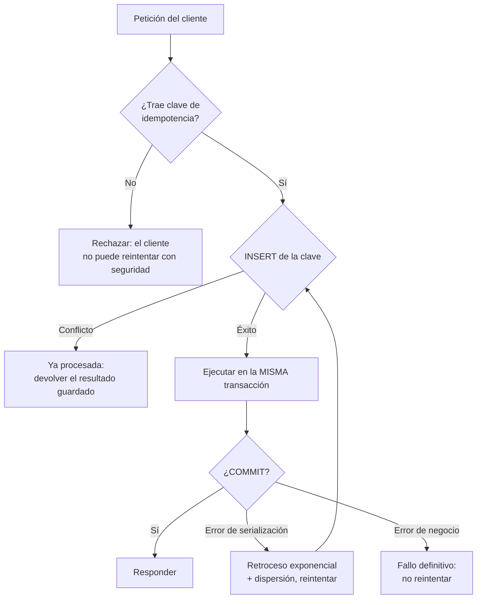

# 047 — Concurrencia en la aplicación: idempotencia, reintentos y bloqueo optimista

> [Programa](../../../README.md) · [Parte 08](../README.md) · [← Anterior](../../part-08-transacciones-concurrencia-y-recuperacion/046-registro-anticipado-y-recuperacion/README.md) · [Siguiente →](../../part-09-almacenamiento-indices-y-planes/048-paginas-filas-y-buffer-pool/README.md)

Parte 08 — Transacciones, concurrencia y recuperación · Avanzado ·
3 horas estimadas · motores `postgresql`, `redis` · laboratorio
[`labs/03-transactions`](../../../labs/03-transactions/README.md) · 3 fuentes.

**Conceptos centrales:** `idempotencia` · `clave de idempotencia` · `bloqueo optimista` · `reintento con retroceso`

**En este caso se comparan 8 motores**: 7 lo resuelven (6 con el resultado comprobado por máquina) y 1 no, con el motivo escrito.

---

## Propósito

Escribir aplicaciones correctas frente a reintentos, mensajes duplicados y operaciones concurrentes. La transacción del motor termina en el `COMMIT`; el sistema no.

## Resultados de aprendizaje

Al terminar podrás:

1. Definir idempotencia y distinguirla de la ausencia de efectos.
2. Implementar una clave de idempotencia con garantía del motor.
3. Elegir entre bloqueo optimista y pesimista con un criterio medible.
4. Aplicar reintentos con retroceso exponencial y dispersión aleatoria.
5. Explicar el problema del confirmar-dos-veces y cómo se acota.

## Fundamentos

### Idempotencia

Una operación es **idempotente** si aplicarla N veces deja el mismo estado que aplicarla una vez. No significa «no hace nada»: significa que repetirla es seguro.

| Operación | ¿Idempotente? |
|---|---|
| `UPDATE cuentas SET saldo = 700 WHERE id = 1` | Sí |
| `UPDATE cuentas SET saldo = saldo - 300 WHERE id = 1` | **No** |
| `INSERT` con clave única y `ON CONFLICT DO NOTHING` | Sí |
| `INSERT` sin restricción | No |
| `DELETE FROM t WHERE id = 5` | Sí |
| «Enviar correo» | No |

Helland lo sitúa como requisito de cualquier comunicación entre agregados: en un sistema distribuido, **un mensaje se entrega una o más veces**, nunca exactamente una. La entrega exactamente-una-vez se consigue combinando al-menos-una-vez con un receptor idempotente.

### El problema del confirmar-dos-veces

```text
Cliente -> Servidor : cobrar 300
Servidor            : BEGIN ... COMMIT   (aplicado)
Servidor -> Cliente : respuesta          *** se pierde la red ***
Cliente             : tiempo agotado, reintenta
Cliente -> Servidor : cobrar 300         (¡otra vez!)
```

El cliente no puede distinguir «no se aplicó» de «se aplicó y se perdió la respuesta». La única defensa es que el servidor reconozca el reintento, y para eso el cliente debe enviar un identificador estable.

### Clave de idempotencia

El cliente genera un identificador único **por intención**, no por intento, y lo repite en cada reintento. El servidor lo registra con una restricción de unicidad:

```sql
CREATE TABLE operaciones (
  clave_idempotencia TEXT PRIMARY KEY,
  tipo               TEXT NOT NULL,
  resultado          TEXT NOT NULL,
  creada_en          TIMESTAMPTZ NOT NULL DEFAULT now()
);
```

La restricción `PRIMARY KEY` es lo que da la garantía: no depende de que la aplicación compruebe antes de insertar —eso sería una carrera—, sino de que el motor rechace el segundo insert.

### Optimista frente a pesimista

| | Optimista | Pesimista |
|---|---|---|
| Cómo | Se lee una versión, se escribe si no cambió | Se bloquea la fila al leer |
| Coste sin conflicto | Ninguno | Bloqueo mantenido |
| Coste con conflicto | Reintento completo | Espera |
| Bueno cuando | Conflictos raros (< ~10 %) | Conflictos frecuentes |
| Riesgo | Reintentos en cascada bajo contención | Interbloqueos, contención |

Regla: **medir la tasa de conflicto antes de elegir**. Con 2 % de conflictos, el optimista gana claramente; con 40 %, el reintento constante es peor que esperar.



## Ejemplo trabajado

Inscribir a un estudiante, con control de cupo, de forma segura ante reintentos.

```python
import random, time
import psycopg

MAX_INTENTOS = 5

def inscribir(conn, clave_idem: str, student_id: int, course_id: int) -> dict:
    for intento in range(MAX_INTENTOS):
        try:
            with conn.transaction():
                cur = conn.cursor()

                # 1. La restricción de unicidad, no un SELECT previo, es lo que
                #    hace atómica la detección del reintento.
                try:
                    cur.execute(
                        "INSERT INTO operaciones (clave_idempotencia, tipo, resultado) "
                        "VALUES (%s, 'inscripcion', '')",
                        (clave_idem,))
                except psycopg.errors.UniqueViolation:
                    raise YaProcesada()

                # 2. Bloqueo pesimista sobre el curso: el cupo es un recurso
                #    disputado y aquí los conflictos son la norma, no la excepción.
                cur.execute("SELECT cupo FROM courses WHERE id = %s FOR UPDATE",
                            (course_id,))
                (cupo,) = cur.fetchone()

                cur.execute("SELECT count(*) FROM enrollments "
                            "WHERE course_id = %s AND estado = 'activa'", (course_id,))
                (inscritos,) = cur.fetchone()

                if inscritos >= cupo:
                    # Error de negocio: reintentar no lo arregla.
                    raise SinCupo(f"{inscritos}/{cupo}")

                cur.execute("INSERT INTO enrollments (student_id, course_id, estado) "
                            "VALUES (%s, %s, 'activa') ON CONFLICT DO NOTHING",
                            (student_id, course_id))

                resultado = {"ok": True, "inscritos": inscritos + 1}
                cur.execute("UPDATE operaciones SET resultado = %s "
                            "WHERE clave_idempotencia = %s",
                            (json.dumps(resultado), clave_idem))
                return resultado

        except YaProcesada:
            # El reintento del cliente devuelve el resultado original, no un error.
            cur = conn.cursor()
            cur.execute("SELECT resultado FROM operaciones WHERE clave_idempotencia = %s",
                        (clave_idem,))
            return json.loads(cur.fetchone()[0])

        except psycopg.errors.SerializationFailure:
            # Retroceso exponencial CON dispersión: sin el factor aleatorio,
            # todos los clientes que chocaron reintentan a la vez y vuelven a chocar.
            espera = (2 ** intento) * 0.05 * (0.5 + random.random())
            time.sleep(espera)
            continue

    raise DemasiadosIntentos()
```

**Por qué cada pieza:**

- **`INSERT` de la clave dentro de la transacción.** Si la transacción se revierte, la clave desaparece y el reintento es legítimo. Insertarla fuera dejaría operaciones marcadas como hechas que nunca se hicieron.
- **`FOR UPDATE` sobre `courses`.** Materializa el conflicto: sin él, dos inscripciones concurrentes leen el mismo conteo y ambas pasan. Es el sesgo de escritura de la clase 034 aplicado al cupo.
- **`ON CONFLICT DO NOTHING`.** Segunda línea de defensa, por si el mismo par llega por otra vía.
- **Distinguir error de negocio de error transitorio.** `SinCupo` no se reintenta; `SerializationFailure` sí. Reintentar un error de negocio es un bucle infinito.
- **Dispersión en el retroceso.** Es lo que evita que los reintentos se sincronicen.

**Traza de un reintento tras respuesta perdida:**

```text
t0  cliente envía clave=abc-123        → servidor aplica, inscritos=1
t1  respuesta se pierde
t2  cliente reintenta clave=abc-123    → UniqueViolation → devuelve {"ok":true,"inscritos":1}
```

El cliente recibe el resultado correcto. No hay doble inscripción y no hay error visible.

**Alternativa optimista**, adecuada cuando los conflictos son raros:

```sql
UPDATE courses SET version = version + 1, inscritos = inscritos + 1
WHERE id = %s AND version = %s AND inscritos < cupo;
-- 0 filas afectadas = alguien se adelantó → reintentar
```

Sin bloqueos, con reintento en el cliente. Para un curso muy demandado durante la matrícula, el pesimista es mejor: el optimista generaría decenas de reintentos por inscripción exitosa.

## Comparación

| Escenario | Mecanismo |
|---|---|
| API de pagos | Clave de idempotencia obligatoria |
| Edición de un formulario por varias personas | Optimista con versión |
| Cupo muy disputado | Pesimista con `FOR UPDATE` |
| Consumo de una cola | Idempotencia por identificador de mensaje |
| Contador de alta frecuencia | Sentencia atómica (`saldo = saldo - x`) |
| Proceso por lotes reejecutable | Idempotencia por lote + `MERGE` |

## Errores frecuentes

1. **Comprobar con `SELECT` y luego `INSERT`.** Es una carrera; la restricción única es lo que garantiza.
2. **Clave de idempotencia generada por intento.** Cada reintento trae una clave nueva y no sirve de nada.
3. **Reintentar errores de negocio.** Bucle infinito.
4. **Retroceso sin dispersión.** Los clientes se sincronizan y el conflicto se repite.
5. **Reintentos sin límite.** Amplifican una caída parcial hasta convertirla en total.
6. **Registrar la operación fuera de la transacción.** Deja operaciones marcadas como hechas que se revirtieron.
7. **Efectos externos dentro de la transacción.** Un correo enviado no se revierte con `ROLLBACK`.

## De la clase a la operación

Los duplicados en producción —dos cobros, dos pedidos, dos correos— casi nunca vienen de un fallo del motor: vienen de un reintento sin clave de idempotencia. Exigirla en el contrato de la API es más barato que cualquier deduplicación posterior.

## Reto de transferencia

1. Elige una operación con efectos de tu sistema y añádele clave de idempotencia.
2. Simula la pérdida de la respuesta y demuestra que el reintento no duplica.
3. Mide la tasa de conflicto real y decide entre optimista y pesimista con ese dato.
4. Implementa el retroceso con dispersión y compara la carga con y sin él bajo contención.

## Preguntas de evaluación

1. ¿Por qué la restricción única es más fiable que comprobar antes de insertar?
2. Da una operación de tu sistema que no sea idempotente y conviértela.
3. Explica qué ocurre con reintentos sincronizados sin dispersión, con cifras.
4. ¿Qué efecto externo de tu código quedaría inconsistente si la transacción se revierte?

---

## 🌐 El mismo problema en cada motor

**Caso:** Dos clientes que leyeron lo mismo y solo uno puede escribir

La transacción protege lo que ocurre **dentro** de ella. No protege del caso
más común de todos: leer un dato, enseñárselo a una persona, y escribirlo
minutos después cuando ya no es el mismo. Entre la lectura y la escritura no
hay transacción posible, y ahí es donde se pierden las actualizaciones.

El caso lo reproduce sin concurrencia real: dos clientes leen la cuenta en la
versión 1, y los dos intentan escribir. El primero gana; el segundo lleva la
condición `version = 1` en su `UPDATE`, no afecta a ninguna fila y **se
entera**. Si saliera saldo 20, los dos habrían escrito; si saliera 50, se
habría perdido el descuento del primero. Que salga 70 con versión 2 es la
prueba de que exactamente uno ganó y el otro lo supo.

Salida esperada, idéntica en todos los motores que lo resuelven:

| cuenta | saldo | version |
|---|---|---|
| `cuenta-1` | `70` | `2` |

El contrato vive en [`motores.yaml`](motores.yaml) y lo comprueba
`python scripts/verificar_equivalencia.py --clase 047`: 6 de
las 7 implementaciones se ejecutan de verdad y su
resultado se compara con esa tabla; el resto se declara como material revisado,
no ejecutado.

| Motor | ¿Resuelve el caso? | Nivel de prueba | Código | Fuente |
|---|---|---|---|---|
| SQLite | sí | núcleo | [código](implementaciones/sqlite/consulta.sql) | [doc oficial](https://sqlite.org/lang_update.html) |
| DuckDB | sí | núcleo | [código](implementaciones/duckdb/consulta.sql) | [doc oficial](https://duckdb.org/docs/stable/sql/statements/update.html) |
| PostgreSQL | sí | servicio | [código](implementaciones/postgresql/consulta.sql) | [doc oficial](https://www.postgresql.org/docs/current/explicit-locking.html) |
| MySQL | sí | servicio | [código](implementaciones/mysql/consulta.sql) | [doc oficial](https://dev.mysql.com/doc/refman/8.4/en/information-functions.html) |
| MongoDB | sí | servicio | [código](implementaciones/mongodb/consulta.js) | [doc oficial](https://www.mongodb.com/docs/manual/reference/method/db.collection.updateOne/) |
| Redis | sí | servicio | [código](implementaciones/redis/consulta.txt) | [doc oficial](https://redis.io/docs/latest/develop/interact/transactions/) |
| Apache Cassandra | sí | declarado | [código](implementaciones/cassandra/consulta.cql) | [doc oficial](https://cassandra.apache.org/doc/latest/cassandra/developing/cql/dml.html) |
| Amazon DynamoDB | **no** | — | — | [doc oficial](https://docs.aws.amazon.com/amazondynamodb/latest/developerguide/Expressions.ConditionExpressions.html) |

### Los que resuelven el caso

#### SQLite · [`implementaciones/sqlite/consulta.sql`](implementaciones/sqlite/consulta.sql)

✅ **verificado** — se ejecuta en CI sin servicios

```sql
-- motor: sqlite
-- doc: https://sqlite.org/lang_update.html
-- nota: el segundo UPDATE no falla: simplemente no afecta a ninguna fila. La
--       aplicacion TIENE que mirar changes() y decidir; si no mira, el conflicto
--       pasa desapercibido, que es peor que perder la actualizacion.

-- === preparacion ===
CREATE TABLE cuentas (
    id      TEXT PRIMARY KEY,
    saldo   INTEGER NOT NULL,
    version INTEGER NOT NULL
);
INSERT INTO cuentas (id, saldo, version) VALUES ('cuenta-1', 100, 1);

-- Cliente A leyo la cuenta (saldo 100, version 1) y descuenta 30.
-- La condicion `version = 1` es el contrato: «escribo solo si nadie ha tocado
-- esto desde que lo lei».
UPDATE cuentas
SET saldo = saldo - 30, version = version + 1
WHERE id = 'cuenta-1' AND version = 1;

-- Cliente B habia leido la MISMA version 1, antes de que A escribiera, y
-- descuenta 50. Su UPDATE no afecta a ninguna fila: la version ya no es 1.
-- Sin esta condicion, el descuento de A se perderia en silencio y el saldo
-- quedaria en 50 en vez de 70: eso es una ACTUALIZACION PERDIDA.
UPDATE cuentas
SET saldo = saldo - 50, version = version + 1
WHERE id = 'cuenta-1' AND version = 1;

-- === consulta ===
-- Si saliera 20 y version 3, los dos habrian escrito. Si saliera 50, se habria
-- perdido el descuento de A. Que salga 70 y version 2 es la prueba de que
-- exactamente uno gano y el otro se entero.
SELECT id, saldo, version FROM cuentas ORDER BY id;
```

- **Por qué sí:** El bloqueo optimista no necesita nada del motor: es una columna y una condición en el `WHERE`. Funciona igual aquí que en el motor más caro del mercado, y esa es justamente la lección.
- **Por qué no:** Hay que comprobar cuántas filas se modificaron —`changes()`— y actuar en consecuencia. Un `UPDATE` que no afecta a nada **no es un error**: si nadie mira, el conflicto pasa desapercibido, que es peor que perder la actualización.
- 📄 Documentación oficial: <https://sqlite.org/lang_update.html>

#### DuckDB · [`implementaciones/duckdb/consulta.sql`](implementaciones/duckdb/consulta.sql)

✅ **verificado** — se ejecuta en CI sin servicios

```sql
-- motor: duckdb
-- doc: https://duckdb.org/docs/stable/sql/statements/update.html

-- === preparacion ===
CREATE TABLE cuentas (
    id      VARCHAR PRIMARY KEY,
    saldo   INTEGER NOT NULL,
    version INTEGER NOT NULL
);
INSERT INTO cuentas (id, saldo, version) VALUES ('cuenta-1', 100, 1);

-- Cliente A leyo la cuenta (saldo 100, version 1) y descuenta 30.
-- La condicion `version = 1` es el contrato: «escribo solo si nadie ha tocado
-- esto desde que lo lei».
UPDATE cuentas
SET saldo = saldo - 30, version = version + 1
WHERE id = 'cuenta-1' AND version = 1;

-- Cliente B habia leido la MISMA version 1, antes de que A escribiera, y
-- descuenta 50. Su UPDATE no afecta a ninguna fila: la version ya no es 1.
-- Sin esta condicion, el descuento de A se perderia en silencio y el saldo
-- quedaria en 50 en vez de 70: eso es una ACTUALIZACION PERDIDA.
UPDATE cuentas
SET saldo = saldo - 50, version = version + 1
WHERE id = 'cuenta-1' AND version = 1;

-- === consulta ===
-- Si saliera 20 y version 3, los dos habrian escrito. Si saliera 50, se habria
-- perdido el descuento de A. Que salga 70 y version 2 es la prueba de que
-- exactamente uno gano y el otro se entero.
SELECT id, saldo, version FROM cuentas ORDER BY id;
```

- **Por qué sí:** Misma técnica y misma sintaxis: sirve para comprobar sobre un volcado cuántas versiones tiene cada registro y si el patrón se está aplicando de verdad.
- **Por qué no:** Con un solo escritor, el conflicto que la técnica evita no puede producirse: aquí se estudia, no se sufre.
- 📄 Documentación oficial: <https://duckdb.org/docs/stable/sql/statements/update.html>

#### PostgreSQL · [`implementaciones/postgresql/consulta.sql`](implementaciones/postgresql/consulta.sql)

✅ **verificado** — se ejecuta contra el motor real levantado con `docker compose`

```sql
-- motor: postgresql
-- doc: https://www.postgresql.org/docs/current/explicit-locking.html
-- nota: PostgreSQL permite hacer esto SIN columna de version, usando el
--       identificador de transaccion que ya lleva cada fila:
--         SELECT xmin, saldo FROM cuentas WHERE id = 'cuenta-1';
--         UPDATE cuentas SET ... WHERE id = 'cuenta-1' AND xmin = <el leido>;
--       La alternativa pesimista es SELECT ... FOR UPDATE, que retiene el
--       bloqueo hasta el COMMIT: inservible si en medio hay una persona.

-- === preparacion ===
DROP TABLE IF EXISTS cuentas;

CREATE TABLE cuentas (
    id      text PRIMARY KEY,
    saldo   integer NOT NULL,
    version integer NOT NULL
);
INSERT INTO cuentas (id, saldo, version) VALUES ('cuenta-1', 100, 1);

-- Cliente A leyo la cuenta (saldo 100, version 1) y descuenta 30.
-- La condicion `version = 1` es el contrato: «escribo solo si nadie ha tocado
-- esto desde que lo lei».
UPDATE cuentas
SET saldo = saldo - 30, version = version + 1
WHERE id = 'cuenta-1' AND version = 1;

-- Cliente B habia leido la MISMA version 1, antes de que A escribiera, y
-- descuenta 50. Su UPDATE no afecta a ninguna fila: la version ya no es 1.
-- Sin esta condicion, el descuento de A se perderia en silencio y el saldo
-- quedaria en 50 en vez de 70: eso es una ACTUALIZACION PERDIDA.
UPDATE cuentas
SET saldo = saldo - 50, version = version + 1
WHERE id = 'cuenta-1' AND version = 1;

-- === consulta ===
-- Si saliera 20 y version 3, los dos habrian escrito. Si saliera 50, se habria
-- perdido el descuento de A. Que salga 70 y version 2 es la prueba de que
-- exactamente uno gano y el otro se entero.
SELECT id, saldo, version FROM cuentas ORDER BY id;
```

- **Por qué sí:** Ofrece las dos estrategias y permite elegir con criterio: optimista con columna de versión cuando el conflicto es raro, o pesimista con `SELECT ... FOR UPDATE` cuando es frecuente y esperar sale más barato que reintentar. Y con `xmin` se puede hacer lo primero sin añadir columna.
- **Por qué no:** `FOR UPDATE` retiene el bloqueo hasta el final de la transacción: si esa transacción espera a que una persona rellene un formulario, el bloqueo dura lo que dure el café. El bloqueo pesimista es incompatible con la interacción humana.
- 📄 Documentación oficial: <https://www.postgresql.org/docs/current/explicit-locking.html>

#### MySQL · [`implementaciones/mysql/consulta.sql`](implementaciones/mysql/consulta.sql)

✅ **verificado** — se ejecuta contra el motor real levantado con `docker compose`

```sql
-- motor: mysql
-- doc: https://dev.mysql.com/doc/refman/8.4/en/information-functions.html
-- nota: ROW_COUNT() detecta el conflicto, con una trampa: por omision cuenta las
--       filas CAMBIADAS, no las coincidentes. Un UPDATE que escribe el mismo
--       valor devuelve 0 y parece un conflicto inexistente. Depende de la
--       bandera CLIENT_FOUND_ROWS del conector.

-- === preparacion ===
DROP TABLE IF EXISTS cuentas;

CREATE TABLE cuentas (
    id      VARCHAR(20) PRIMARY KEY,
    saldo   INT NOT NULL,
    version INT NOT NULL
);
INSERT INTO cuentas (id, saldo, version) VALUES ('cuenta-1', 100, 1);

-- Cliente A leyo la cuenta (saldo 100, version 1) y descuenta 30.
-- La condicion `version = 1` es el contrato: «escribo solo si nadie ha tocado
-- esto desde que lo lei».
UPDATE cuentas
SET saldo = saldo - 30, version = version + 1
WHERE id = 'cuenta-1' AND version = 1;

-- Cliente B habia leido la MISMA version 1, antes de que A escribiera, y
-- descuenta 50. Su UPDATE no afecta a ninguna fila: la version ya no es 1.
-- Sin esta condicion, el descuento de A se perderia en silencio y el saldo
-- quedaria en 50 en vez de 70: eso es una ACTUALIZACION PERDIDA.
UPDATE cuentas
SET saldo = saldo - 50, version = version + 1
WHERE id = 'cuenta-1' AND version = 1;

-- === consulta ===
-- Si saliera 20 y version 3, los dos habrian escrito. Si saliera 50, se habria
-- perdido el descuento de A. Que salga 70 y version 2 es la prueba de que
-- exactamente uno gano y el otro se entero.
SELECT id, saldo, version FROM cuentas ORDER BY id;
```

- **Por qué sí:** La misma técnica funciona igual, y `ROW_COUNT()` devuelve las filas afectadas para detectar el conflicto.
- **Por qué no:** Cuidado con `ROW_COUNT()`: por omisión, el cliente cuenta las filas **cambiadas**, no las coincidentes, así que un `UPDATE` que escribe el mismo valor devuelve 0 y parece un conflicto que no existe. Depende de la bandera `CLIENT_FOUND_ROWS` del conector.
- 📄 Documentación oficial: <https://dev.mysql.com/doc/refman/8.4/en/information-functions.html>

#### MongoDB · [`implementaciones/mongodb/consulta.js`](implementaciones/mongodb/consulta.js)

✅ **verificado** — se ejecuta contra el motor real levantado con `docker compose`

```javascript
// motor: mongodb
// doc: https://www.mongodb.com/docs/manual/reference/method/db.collection.updateOne/
// nota: matchedCount es la senal. Si vale 0, otro cliente se adelanto y hay que
//       releer y reintentar. La version hay que incrementarla en CADA camino de
//       escritura: si uno solo la olvida, la proteccion desaparece para todos.

// === preparacion ===
db.cuentas.drop();
db.cuentas.insertOne({ _id: "cuenta-1", saldo: 100, version: 1 });

// Cliente A: leyo version 1.
const a = db.cuentas.updateOne(
  { _id: "cuenta-1", version: 1 },
  { $inc: { saldo: -30, version: 1 } },
);

// Cliente B: leyo TAMBIEN la version 1.
const b = db.cuentas.updateOne(
  { _id: "cuenta-1", version: 1 },
  { $inc: { saldo: -50, version: 1 } },
);

if (a.matchedCount !== 1 || b.matchedCount !== 0) {
  throw new Error("el bloqueo optimista no actuo como debia");
}

// === consulta ===
db.cuentas
  .find()
  .sort({ _id: 1 })
  .forEach((d) => print(d._id + "|" + d.saldo + "|" + d.version));
```

- **Por qué sí:** `updateOne` con el filtro sobre la versión es atómico sobre el documento y devuelve `matchedCount`, así que el conflicto se detecta en la misma llamada. Es el patrón recomendado para actualizaciones sin transacción.
- **Por qué no:** La versión hay que mantenerla a mano en cada escritura: si un solo camino de código olvida incrementarla, la protección desaparece para todos sin que nada avise.
- 📄 Documentación oficial: <https://www.mongodb.com/docs/manual/reference/method/db.collection.updateOne/>

#### Redis · [`implementaciones/redis/consulta.txt`](implementaciones/redis/consulta.txt)

✅ **verificado** — se ejecuta contra el motor real levantado con `docker compose`

```text
# motor: redis
# doc: https://redis.io/docs/latest/develop/interact/transactions/
# nota: el script Lua comprueba y escribe sin que nada se cuele en medio, y
#       devuelve 1 o 0 segun haya ganado o perdido. La alternativa es
#       WATCH cuenta:1 / MULTI / ... / EXEC, que aborta si la clave cambio: es
#       bloqueo optimista integrado en el protocolo, a cambio de rehacer el
#       ciclo entero en el cliente cuando falla.

# === preparacion ===
FLUSHDB
HSET cuenta:1 saldo 100 version 1

# Cliente A: leyo la version 1. Gana.
EVAL "if redis.call('HGET',KEYS[1],'version')==ARGV[1] then redis.call('HINCRBY',KEYS[1],'saldo',-30) redis.call('HINCRBY',KEYS[1],'version',1) return 1 end return 0" 1 cuenta:1 1

# Cliente B: leyo la MISMA version 1. Pierde, y se entera: devuelve 0.
EVAL "if redis.call('HGET',KEYS[1],'version')==ARGV[1] then redis.call('HINCRBY',KEYS[1],'saldo',-50) redis.call('HINCRBY',KEYS[1],'version',1) return 1 end return 0" 1 cuenta:1 1

# === consulta ===
EVAL "return {'cuenta-1|'..redis.call('HGET',KEYS[1],'saldo')..'|'..redis.call('HGET',KEYS[1],'version')}" 1 cuenta:1
```

- **Por qué sí:** Tiene las dos formas: `WATCH` con `MULTI`/`EXEC`, que aborta si la clave cambió —bloqueo optimista integrado en el protocolo—, y el script Lua, que comprueba y escribe sin que nada se cuele en medio.
- **Por qué no:** `WATCH` obliga a rehacer el ciclo entero en el cliente cuando falla, y con mucha contención la aplicación se pasa la vida reintentando. El script Lua lo evita, pero mete lógica de negocio dentro del almacén, donde no se versiona ni se prueba con el resto del código.
- 📄 Documentación oficial: <https://redis.io/docs/latest/develop/interact/transactions/>

#### Apache Cassandra · [`implementaciones/cassandra/consulta.cql`](implementaciones/cassandra/consulta.cql)

⚪ **declarado** — se revisa a mano contra la documentación citada; la máquina no lo ejecuta

```sql
-- motor: cassandra
-- doc: https://cassandra.apache.org/doc/latest/cassandra/developing/cql/dml.html
-- nota: implementacion declarada. Las transacciones ligeras hacen exactamente
--       esto, con acuerdo entre replicas mediante Paxos, y devuelven una columna
--       [applied] con true o false.
--       El precio no es menor: cuatro rondas de red entre replicas, del orden de
--       VEINTE VECES el costo de una escritura normal. En el camino caliente,
--       convierten un cluster de Cassandra en algo mas lento que un solo
--       PostgreSQL.

-- === preparacion ===
CREATE KEYSPACE IF NOT EXISTS banca
  WITH replication = {'class': 'SimpleStrategy', 'replication_factor': 1};

DROP TABLE IF EXISTS banca.cuentas;

CREATE TABLE banca.cuentas (
    id      text PRIMARY KEY,
    saldo   int,
    version int
);

INSERT INTO banca.cuentas (id, saldo, version) VALUES ('cuenta-1', 100, 1);

-- Cliente A: gana. Devuelve [applied] = True.
UPDATE banca.cuentas SET saldo = 70, version = 2 WHERE id = 'cuenta-1' IF version = 1;

-- Cliente B: pierde. Devuelve [applied] = False y, ademas, el valor actual de
-- la columna comparada, para que el cliente pueda reintentar sin releer.
UPDATE banca.cuentas SET saldo = 50, version = 2 WHERE id = 'cuenta-1' IF version = 1;

-- === consulta ===
SELECT id, saldo, version FROM banca.cuentas;
```

- **Por qué sí:** Las transacciones ligeras (`IF version = 1`) hacen exactamente esto, con acuerdo entre réplicas mediante Paxos, y devuelven `[applied]` para saber si ganó o perdió.
- **Por qué no:** Cuestan cuatro rondas de red entre réplicas: del orden de veinte veces más que una escritura normal. Usarlas en el camino caliente es la forma más rápida de convertir un clúster de Cassandra en algo más lento que un solo PostgreSQL.
- 📄 Documentación oficial: <https://cassandra.apache.org/doc/latest/cassandra/developing/cql/dml.html>

### Los que no resuelven este caso — y qué se hace en su lugar

Descartar un motor con un argumento es tan formativo como usarlo. Ninguna de estas filas dice que el motor sea peor: dice que este problema no es el suyo.

| Motor | Por qué no | Qué se hace en su lugar | Fuente |
|---|---|---|---|
| Amazon DynamoDB | Sí tiene el mecanismo —`ConditionExpression` sobre un atributo de versión—, pero no se puede mostrar aquí como código ejecutable ni comparable: es una llamada de API, no una sentencia. | `UpdateItem` con `ConditionExpression: version = :v` y `UpdateExpression: SET version = :v1`, que falla con `ConditionalCheckFailedException` cuando otro cliente se adelantó. Es el mismo patrón con otro vocabulario. | [doc](https://docs.aws.amazon.com/amazondynamodb/latest/developerguide/Expressions.ConditionExpressions.html) |

---

## Laboratorio

```bash
python scripts/validate_repository.py
python labs/03-transactions/run_transactions_lab.py
```

Guarda como evidencia la salida completa, la versión del motor y la semilla o
los parámetros usados. Una captura sin comando no es evidencia: no se puede
repetir.

## Evaluación

| Criterio | Peso | Qué se comprueba |
|---|---:|---|
| Comprensión conceptual | 25 % | Explica el mecanismo, no solo el resultado |
| Ejecución reproducible | 25 % | Otra persona obtiene lo mismo con las instrucciones dadas |
| Interpretación basada en evidencia | 25 % | Cada conclusión se apoya en una salida o una medición |
| Límites y riesgos declarados | 25 % | Dice qué no demuestra el ejercicio y qué faltaría en producción |

La clase se da por superada cuando la respuesta explica el mecanismo, muestra
la salida que la respalda y declara al menos un límite del ejercicio.

## Fuentes de esta clase

Todo lo afirmado arriba procede de estas obras. Los identificadores viven en
[`catalog/sources.json`](../../../catalog/sources.json) y el estado de los
enlaces se comprueba con `python scripts/check_external_links.py`.

- **Philip A. Bernstein, Eric Newcomer** (2009). [Principles of Transaction Processing](https://www.sciencedirect.com/book/9781558606234/principles-of-transaction-processing). 2.a ed. Morgan Kaufmann. ISBN 978-1-55860-623-4.  
  Enfoque de sistemas: monitores transaccionales, colas y commit en dos fases.
- **Pat Helland** (2007). [Life beyond Distributed Transactions: An Apostate's Opinion](https://www.cidrdb.org/cidr2007/papers/cidr07p15.pdf). CIDR.  
  Entidades, actividades y por qué las transacciones distribuidas no escalan.
- **Martin Kleppmann** (2017). [Designing Data-Intensive Applications](https://dataintensive.net/). O'Reilly. ISBN 978-1-4493-7332-0.  
  Referencia central del programa para replicación, partición, transacciones distribuidas y streaming.

---

> [Programa](../../../README.md) · [Parte 08](../README.md) · [← Anterior](../../part-08-transacciones-concurrencia-y-recuperacion/046-registro-anticipado-y-recuperacion/README.md) · [Siguiente →](../../part-09-almacenamiento-indices-y-planes/048-paginas-filas-y-buffer-pool/README.md)
