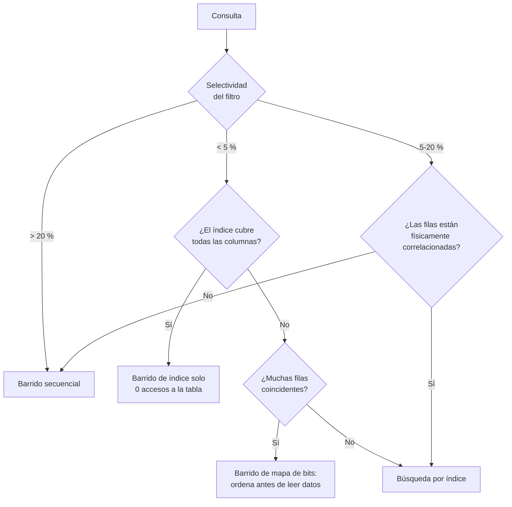

# 049 — B-Tree: estructura, orden de columnas y selectividad

> [Programa](../../../README.md) · [Parte 09](../README.md) · [← Anterior](../../part-09-almacenamiento-indices-y-planes/048-paginas-filas-y-buffer-pool/README.md) · [Siguiente →](../../part-09-almacenamiento-indices-y-planes/050-lsm-tree-compactacion-y-amplificacion/README.md)

Parte 09 — Almacenamiento, índices y planes · Intermedio ·
4 horas estimadas · motores `postgresql`, `mysql`, `sqlite` · laboratorio
[`labs/04-indexing`](../../../labs/04-indexing/README.md) · 3 fuentes.

**Conceptos centrales:** `B-Tree` · `prefijo más a la izquierda` · `selectividad` · `índice cubriente`

**En este caso se comparan 7 motores**: 5 lo resuelven (5 con el resultado comprobado por máquina) y 2 no, con el motivo escrito.

---

## Propósito

Dominar el índice B-Tree: cómo se recorre, por qué el orden de las columnas decide qué consultas sirve y cuándo el motor decide no usarlo.

## Resultados de aprendizaje

Al terminar podrás:

1. Calcular la altura de un B-Tree y el número de páginas de una búsqueda.
2. Aplicar la regla del prefijo más a la izquierda.
3. Explicar por qué una condición de rango «detiene» el uso de las columnas siguientes.
4. Estimar selectividad y predecir si el índice se usará.
5. Diseñar índices cubrientes y medir su beneficio y su costo.

## Fundamentos

### La estructura

Bayer y McCreight (1972) definieron el B-Tree; los motores usan la variante B⁺: todos los datos en las hojas, hojas enlazadas entre sí para recorridos por rango.

```text
                    [ 200 | 500 ]                    raíz
                   /      |      \
          [50|120]   [300|400]   [700|900]           internos
          /  |  \      /  |  \     /  |  \
        hojas ordenadas, enlazadas: → → → →
```

**Altura:**

```text
entradas por página ≈ 8 192 / (tamaño de clave + puntero)
con clave de 8 B + puntero 6 B: ≈ 585 entradas
N = 10 000 000  →  altura = ⌈log₅₈₅ 10⁷⌉ = 3
```

**Tres páginas** para localizar cualquier fila entre diez millones. Y en la práctica los niveles superiores están siempre en memoria, así que la búsqueda cuesta una o dos lecturas físicas.

Los B-Tree son **muy planos**: multiplicar los datos por 585 añade un solo nivel.

### El prefijo más a la izquierda

Un índice sobre `(a, b, c)` ordena por `a`, luego por `b`, luego por `c`. Sirve para:

| Consulta | ¿Usa el índice? | Hasta dónde |
|---|---|---|
| `WHERE a = 1` | Sí | `a` |
| `WHERE a = 1 AND b = 2` | Sí | `a`, `b` |
| `WHERE a = 1 AND b = 2 AND c = 3` | Sí | todo |
| `WHERE b = 2` | **No** (o barrido de índice) | — |
| `WHERE a = 1 AND c = 3` | Parcial | solo `a`; filtra `c` después |
| `ORDER BY a, b` | Sí, sin ordenar | — |
| `ORDER BY b` | No | — |

La analogía exacta es la guía telefónica ordenada por apellido y luego por nombre: buscar por nombre sin apellido no aprovecha el orden.

### El rango detiene el índice

Regla que Winand desarrolla como concepto central:

```sql
-- índice (course_id, registrada_en, nota)
WHERE course_id = 42 AND registrada_en > '2026-01-01' AND nota = 6.0
```

El motor puede usar `course_id` (igualdad) y `registrada_en` (rango), pero **no** `nota`: dentro del rango de fechas, las notas no están ordenadas globalmente. `nota` se aplica como filtro sobre las filas leídas.

De ahí la regla de diseño: **igualdades primero, luego la columna de orden, y el rango al final**. Es exactamente la regla ESR de MongoDB de la clase 026, con otro nombre.

### Selectividad

```text
selectividad = filas que cumplen / filas totales
```

| Selectividad | Uso probable del índice |
|---|---|
| < 1 % | Casi seguro |
| 1 – 5 % | Probable |
| 5 – 20 % | Depende del ancho de fila y la correlación |
| > 20 % | Barrido secuencial |

Un índice sobre una columna booleana con reparto 50/50 casi nunca se usa: leer la mitad de la tabla por accesos aleatorios es peor que leerla entera en secuencial (clase 038).

**Excepción importante:** el índice **parcial** sobre el valor raro sí sirve.

```sql
CREATE INDEX enrollments_pendientes ON enrollments (course_id)
WHERE estado = 'pendiente';    -- solo el 2 % de las filas
```

### Índice cubriente

Si el índice contiene todas las columnas que la consulta necesita, el motor no toca la tabla:

```sql
CREATE INDEX enr_cubriente ON enrollments (course_id, registrada_en) INCLUDE (nota);
```

`INCLUDE` (PostgreSQL 11+, SQL Server) añade columnas **solo a las hojas**: no participan en el orden ni engordan los nodos internos. Es más barato que añadirlas a la clave.



## Ejemplo trabajado

Consulta frecuente sobre 5 000 000 de inscripciones:

```sql
SELECT student_id, nota
FROM enrollments
WHERE course_id = 42 AND estado = 'activa' AND registrada_en >= '2026-01-01'
ORDER BY registrada_en DESC
LIMIT 20;
```

**Datos del dominio:** 300 cursos (16 667 filas por curso), 85 % activas, la mitad posteriores a esa fecha.

**Índice 1 — ingenuo, una columna:**

```sql
CREATE INDEX i1 ON enrollments (course_id);
```

```text
Búsqueda por índice: 16 667 entradas
Acceso a la tabla:   16 667 lecturas (posiblemente aleatorias)
Filtro:              estado y fecha, descarta ~58 %
Orden:               7 000 filas ordenadas en memoria
LIMIT 20
```

**Índice 2 — orden equivocado:**

```sql
CREATE INDEX i2 ON enrollments (registrada_en, course_id, estado);
```

Peor: el rango va primero, así que el índice se recorre desde la fecha hasta el final —millones de entradas— filtrando `course_id` sobre cada una.

**Índice 3 — igualdades, orden, rango:**

```sql
CREATE INDEX i3 ON enrollments (course_id, estado, registrada_en DESC);
```

```text
Descenso del árbol:        3 páginas
Recorrido de hojas:        20 entradas (ya en el orden pedido, descendente)
Acceso a la tabla:         20 filas
Orden:                     NINGUNO (el índice lo entrega)
```

**16 667 → 20.** Y desaparece el ordenamiento, que era el otro coste.

**Índice 4 — cubriente:**

```sql
CREATE INDEX i4 ON enrollments (course_id, estado, registrada_en DESC)
       INCLUDE (student_id, nota);
```

```text
Accesos a la tabla: 0
```

**Comparación medida:**

| Índice | Entradas leídas | Filas de tabla | ¿Ordena? | Tamaño |
|---|---:|---:|---|---:|
| Sin índice | — | 5 000 000 | Sí | 0 |
| i1 | 16 667 | 16 667 | Sí | 107 MB |
| i2 | ~2 500 000 | 2 500 000 | No | 214 MB |
| i3 | 20 | 20 | No | 161 MB |
| i4 | 20 | **0** | No | 268 MB |

**El costo del índice, que también hay que declarar.** i4 pesa 268 MB y se mantiene en **cada** inserción, actualización y borrado de la tabla. Con 400 inscripciones diarias, es despreciable. Con 40 000 por segundo, no lo es: cada escritura toca el índice y compite por sus páginas.

Regla: **un índice es una apuesta de que se leerá más de lo que se escribirá**. Los índices que no se usan solo cuestan.

```sql
SELECT indexrelname, idx_scan, pg_size_pretty(pg_relation_size(indexrelid))
FROM pg_stat_user_indexes WHERE idx_scan = 0 ORDER BY pg_relation_size(indexrelid) DESC;
```

## Comparación

| Objetivo | Diseño |
|---|---|
| Igualdad en varias columnas | Índice compuesto, las más selectivas antes |
| Igualdad + orden | Igualdades, luego la columna del `ORDER BY` |
| Rango | Al final del índice |
| Evitar acceso a la tabla | `INCLUDE` con las columnas proyectadas |
| Valor poco frecuente | Índice parcial |
| Búsqueda por función | Índice de expresión |

## Errores frecuentes

1. **Un índice por columna.** El motor rara vez combina dos con eficacia; un compuesto sirve a más consultas.
2. **Rango antes que igualdad.** Desperdicia el resto del índice.
3. **Indexar columnas de baja cardinalidad.** Salvo como índice parcial.
4. **Función sobre la columna en el `WHERE`.** `WHERE lower(email) = ...` no usa el índice sobre `email`; hace falta un índice de expresión.
5. **Índices que nadie usa.** Cuestan espacio y escrituras.
6. **Ignorar el orden del `ORDER BY` en el índice.** Un índice ascendente sirve para `DESC` en muchos motores, pero no siempre en índices compuestos con sentidos mixtos.

## De la clase a la operación

Los índices se acumulan: cada incidencia añade uno y nadie retira los anteriores. Una revisión trimestral de índices no usados suele recuperar decenas de gigabytes y acelerar la escritura sin tocar una línea de código.

## Reto de transferencia

1. Elige tu consulta más frecuente y diseña el índice con la regla igualdad-orden-rango.
2. Mide entradas leídas, filas de tabla y presencia de ordenamiento antes y después.
3. Conviértelo en cubriente y compara tamaño frente a beneficio.
4. Enumera los índices sin uso de tu base y calcula el espacio recuperable.

## Preguntas de evaluación

1. Calcula la altura de un B-Tree con 500 millones de filas y clave de 16 bytes.
2. ¿Por qué un índice sobre `(a, b)` no sirve para `WHERE b = 2`?
3. Explica por qué un rango impide aprovechar las columnas posteriores.
4. Da una consulta tuya donde el índice cubriente compense y otra donde no.

---

## 🌐 El mismo problema en cada motor

**Caso:** Igualdad primero, rango después: por qué el orden de las columnas del índice decide todo

Un índice B-Tree ordena las filas por la concatenación de sus columnas, en
el orden en que se declararon. De ahí sale la única regla de diseño de
índices que hay que recordar: **las columnas de igualdad van primero, la de
rango va al final**, y después de una columna de rango el índice deja de
poder acotar nada.

El caso pide los alumnos de DB-101 con nota entre 60 y 90. Con el índice
`(curso, nota)`, el motor entra por la igualdad y recorre un rango contiguo:
lee exactamente las filas que devuelve. Con `(nota, curso)` tendría que
recorrer todas las notas entre 60 y 90 de **todos** los cursos y descartar
después. El resultado es idéntico en los dos casos; el trabajo, no.

Salida esperada, idéntica en todos los motores que lo resuelven:

| estudiante | nota |
|---|---|
| `Bob` | `61` |
| `Grace` | `72` |
| `Ada` | `90` |

El contrato vive en [`motores.yaml`](motores.yaml) y lo comprueba
`python scripts/verificar_equivalencia.py --clase 049`: 5 de
las 5 implementaciones se ejecutan de verdad y su
resultado se compara con esa tabla; el resto se declara como material revisado,
no ejecutado.

| Motor | ¿Resuelve el caso? | Nivel de prueba | Código | Fuente |
|---|---|---|---|---|
| SQLite | sí | núcleo | [código](implementaciones/sqlite/consulta.sql) | [doc oficial](https://sqlite.org/optoverview.html) |
| DuckDB | sí | núcleo | [código](implementaciones/duckdb/consulta.sql) | [doc oficial](https://duckdb.org/docs/stable/sql/indexes.html) |
| PostgreSQL | sí | servicio | [código](implementaciones/postgresql/consulta.sql) | [doc oficial](https://www.postgresql.org/docs/current/indexes-multicolumn.html) |
| MySQL | sí | servicio | [código](implementaciones/mysql/consulta.sql) | [doc oficial](https://dev.mysql.com/doc/refman/8.4/en/multiple-column-indexes.html) |
| MongoDB | sí | servicio | [código](implementaciones/mongodb/consulta.js) | [doc oficial](https://www.mongodb.com/docs/manual/tutorial/equality-sort-range-guideline/) |
| Apache Cassandra | **no** | — | — | [doc oficial](https://cassandra.apache.org/doc/latest/cassandra/developing/cql/ddl.html) |
| Redis | **no** | — | — | [doc oficial](https://redis.io/docs/latest/commands/zrangebyscore/) |

### Los que resuelven el caso

#### SQLite · [`implementaciones/sqlite/consulta.sql`](implementaciones/sqlite/consulta.sql)

✅ **verificado** — se ejecuta en CI sin servicios

```sql
-- motor: sqlite
-- doc: https://sqlite.org/optoverview.html
-- nota: para comprobarlo, anteponer EXPLAIN QUERY PLAN a la consulta:
--         SEARCH notas USING INDEX notas_curso_nota (curso=? AND nota>? AND nota<?)
--       Con el indice creado como (nota, curso) la misma linea diria
--         SEARCH notas USING INDEX ... (nota>? AND nota<?)
--       sin la igualdad: el motor recorreria las notas de TODOS los cursos.

-- === preparacion ===
CREATE TABLE notas (
    estudiante TEXT NOT NULL,
    curso      TEXT NOT NULL,
    nota       INTEGER NOT NULL,
    PRIMARY KEY (estudiante, curso)
);
INSERT INTO notas (estudiante, curso, nota) VALUES
    ('Ada',   'DB-101', 90),
    ('Linus', 'DB-101', 58),
    ('Grace', 'DB-101', 72),
    ('Bob',   'DB-101', 61),
    ('Ada',   'SE-201', 66),
    ('Grace', 'SE-201', 78);

-- El orden de las columnas del indice NO es una preferencia de estilo. Con
-- (curso, nota) el motor entra por la igualdad y recorre un RANGO CONTIGUO de
-- notas. Con (nota, curso) tendria que recorrer todas las notas entre 60 y 90 de
-- TODOS los cursos y filtrar despues.
CREATE INDEX notas_curso_nota ON notas (curso, nota);

-- === consulta ===
SELECT estudiante, nota
FROM notas
WHERE curso = 'DB-101' AND nota BETWEEN 60 AND 90
ORDER BY nota, estudiante;
```

- **Por qué sí:** `EXPLAIN QUERY PLAN` dice en una línea si hubo `SEARCH ... USING INDEX` o `SCAN`: es la forma más directa que existe de comprobar si el índice sirvió.
- **Por qué no:** Su planificador solo usa **un** índice por tabla y no tiene reunión hash ni por fusión: las conclusiones sobre estrategias de índice no se transfieren a un motor grande.
- 📄 Documentación oficial: <https://sqlite.org/optoverview.html>

#### DuckDB · [`implementaciones/duckdb/consulta.sql`](implementaciones/duckdb/consulta.sql)

✅ **verificado** — se ejecuta en CI sin servicios

```sql
-- motor: duckdb
-- doc: https://duckdb.org/docs/stable/sql/indexes.html
-- nota: aqui el indice apenas cambia nada, y esa es la comparacion. El filtro se
--       resuelve leyendo la columna comprimida y descartando bloques por sus
--       valores minimo y maximo: no hay arbol que recorrer.

-- === preparacion ===
CREATE TABLE notas (
    estudiante VARCHAR NOT NULL,
    curso      VARCHAR NOT NULL,
    nota       INTEGER NOT NULL,
    PRIMARY KEY (estudiante, curso)
);
INSERT INTO notas (estudiante, curso, nota) VALUES
    ('Ada',   'DB-101', 90),
    ('Linus', 'DB-101', 58),
    ('Grace', 'DB-101', 72),
    ('Bob',   'DB-101', 61),
    ('Ada',   'SE-201', 66),
    ('Grace', 'SE-201', 78);

-- El orden de las columnas del indice NO es una preferencia de estilo. Con
-- (curso, nota) el motor entra por la igualdad y recorre un RANGO CONTIGUO de
-- notas. Con (nota, curso) tendria que recorrer todas las notas entre 60 y 90 de
-- TODOS los cursos y filtrar despues.
CREATE INDEX notas_curso_nota ON notas (curso, nota);

-- === consulta ===
SELECT estudiante, nota
FROM notas
WHERE curso = 'DB-101' AND nota BETWEEN 60 AND 90
ORDER BY nota, estudiante;
```

- **Por qué sí:** Sirve para ver el contraste: aquí el índice apenas importa, porque el filtro se resuelve leyendo la columna comprimida y descartando bloques por sus valores mínimo y máximo. El mismo problema, otra solución.
- **Por qué no:** Sus índices ART están pensados para restricciones de unicidad y búsquedas muy selectivas, no para sostener planes: razonar sobre orden de columnas aquí no lleva a ninguna parte.
- 📄 Documentación oficial: <https://duckdb.org/docs/stable/sql/indexes.html>

#### PostgreSQL · [`implementaciones/postgresql/consulta.sql`](implementaciones/postgresql/consulta.sql)

✅ **verificado** — se ejecuta contra el motor real levantado con `docker compose`

```sql
-- motor: postgresql
-- doc: https://www.postgresql.org/docs/current/indexes-multicolumn.html
-- nota: la medicion que cierra la discusion:
--         EXPLAIN (ANALYZE, BUFFERS) SELECT ...
--       Con (curso, nota): «Index Cond» lleva las dos condiciones.
--       Con (nota, curso): la igualdad baja a «Filter» y aparece
--       «Rows Removed by Filter», que es exactamente el trabajo desperdiciado.
--       Y con INCLUDE (estudiante) el indice cubre la consulta entera y el plan
--       pasa a «Index Only Scan»: no se toca la tabla.

-- === preparacion ===
DROP TABLE IF EXISTS notas;

CREATE TABLE notas (
    estudiante text NOT NULL,
    curso      text NOT NULL,
    nota       integer NOT NULL,
    PRIMARY KEY (estudiante, curso)
);
INSERT INTO notas (estudiante, curso, nota) VALUES
    ('Ada',   'DB-101', 90),
    ('Linus', 'DB-101', 58),
    ('Grace', 'DB-101', 72),
    ('Bob',   'DB-101', 61),
    ('Ada',   'SE-201', 66),
    ('Grace', 'SE-201', 78);

-- El orden de las columnas del indice NO es una preferencia de estilo. Con
-- (curso, nota) el motor entra por la igualdad y recorre un RANGO CONTIGUO de
-- notas. Con (nota, curso) tendria que recorrer todas las notas entre 60 y 90 de
-- TODOS los cursos y filtrar despues.
CREATE INDEX notas_curso_nota ON notas (curso, nota);

-- === consulta ===
SELECT estudiante, nota
FROM notas
WHERE curso = 'DB-101' AND nota BETWEEN 60 AND 90
ORDER BY nota, estudiante;
```

- **Por qué sí:** Es donde la regla se puede medir: `EXPLAIN (ANALYZE, BUFFERS)` muestra las filas leídas frente a las devueltas, y `Rows Removed by Filter` delata al índice con las columnas en mal orden. Además tiene índices cubrientes con `INCLUDE`, para responder sin ir a la tabla.
- **Por qué no:** Cada índice es una estructura más que mantener en cada `INSERT`, `UPDATE` y `DELETE`, y en su modelo MVCC un `UPDATE` puede tener que escribir en **todos** los índices de la tabla aunque no cambie ninguna columna indexada.
- 📄 Documentación oficial: <https://www.postgresql.org/docs/current/indexes-multicolumn.html>

#### MySQL · [`implementaciones/mysql/consulta.sql`](implementaciones/mysql/consulta.sql)

✅ **verificado** — se ejecuta contra el motor real levantado con `docker compose`

```sql
-- motor: mysql
-- doc: https://dev.mysql.com/doc/refman/8.4/en/multiple-column-indexes.html
-- nota: EXPLAIN muestra key_len, que dice cuantos BYTES del indice se usaron.
--       Si key_len solo cubre la primera columna, el motor no llego a acotar por
--       la segunda, y ahi esta el diagnostico.

-- === preparacion ===
DROP TABLE IF EXISTS notas;

CREATE TABLE notas (
    estudiante VARCHAR(50) NOT NULL,
    curso      VARCHAR(50) NOT NULL,
    nota       INT NOT NULL,
    PRIMARY KEY (estudiante, curso)
);
INSERT INTO notas (estudiante, curso, nota) VALUES
    ('Ada',   'DB-101', 90),
    ('Linus', 'DB-101', 58),
    ('Grace', 'DB-101', 72),
    ('Bob',   'DB-101', 61),
    ('Ada',   'SE-201', 66),
    ('Grace', 'SE-201', 78);

-- El orden de las columnas del indice NO es una preferencia de estilo. Con
-- (curso, nota) el motor entra por la igualdad y recorre un RANGO CONTIGUO de
-- notas. Con (nota, curso) tendria que recorrer todas las notas entre 60 y 90 de
-- TODOS los cursos y filtrar despues.
CREATE INDEX notas_curso_nota ON notas (curso, nota);

-- === consulta ===
SELECT estudiante, nota
FROM notas
WHERE curso = 'DB-101' AND nota BETWEEN 60 AND 90
ORDER BY nota, estudiante;
```

- **Por qué sí:** La regla es la misma y `EXPLAIN` muestra `key_len`, que dice **cuántos bytes del índice se usaron de verdad**: es la forma más precisa de comprobar hasta qué columna llegó a acotar el motor.
- **Por qué no:** InnoDB organiza la tabla por la clave primaria, así que todo índice secundario guarda la clave primaria como puntero: una clave primaria ancha —un UUID en texto— engorda todos los índices de la tabla a la vez.
- 📄 Documentación oficial: <https://dev.mysql.com/doc/refman/8.4/en/multiple-column-indexes.html>

#### MongoDB · [`implementaciones/mongodb/consulta.js`](implementaciones/mongodb/consulta.js)

✅ **verificado** — se ejecuta contra el motor real levantado con `docker compose`

```javascript
// motor: mongodb
// doc: https://www.mongodb.com/docs/manual/tutorial/equality-sort-range-guideline/
// nota: la regla tiene nombre propio en la documentacion de MongoDB —«igualdad,
//       orden, rango»— y es la misma de esta clase. Para medirla:
//         db.notas.find(...).explain("executionStats")
//       y comparar totalKeysExamined con nReturned: si el primero es mucho
//       mayor, el indice esta en mal orden.

// === preparacion ===
db.notas.drop();
db.notas.insertMany([
  { estudiante: "Ada", curso: "DB-101", nota: 90 },
  { estudiante: "Linus", curso: "DB-101", nota: 58 },
  { estudiante: "Grace", curso: "DB-101", nota: 72 },
  { estudiante: "Bob", curso: "DB-101", nota: 61 },
  { estudiante: "Ada", curso: "SE-201", nota: 66 },
  { estudiante: "Grace", curso: "SE-201", nota: 78 },
]);
db.notas.createIndex({ curso: 1, nota: 1 });

// === consulta ===
db.notas
  .find({ curso: "DB-101", nota: { $gte: 60, $lte: 90 } },
        { _id: 0, estudiante: 1, nota: 1 })
  .sort({ nota: 1, estudiante: 1 })
  .forEach((d) => print(d.estudiante + "|" + d.nota));
```

- **Por qué sí:** La regla se llama aquí «igualdad, orden, rango» y está documentada con ese nombre: es la misma idea, y `explain("executionStats")` compara `totalKeysExamined` con `nReturned` para ver cuánto se leyó de más.
- **Por qué no:** El límite de 64 índices por colección y el costo de mantenerlos en cada escritura son los mismos que en un relacional, con un agravante: sin esquema, es fácil acabar con índices sobre campos que solo existen en la mitad de los documentos.
- 📄 Documentación oficial: <https://www.mongodb.com/docs/manual/tutorial/equality-sort-range-guideline/>

### Los que no resuelven este caso — y qué se hace en su lugar

Descartar un motor con un argumento es tan formativo como usarlo. Ninguna de estas filas dice que el motor sea peor: dice que este problema no es el suyo.

| Motor | Por qué no | Qué se hace en su lugar | Fuente |
|---|---|---|---|
| Apache Cassandra | No hay índices que diseñar sobre una tabla existente: el orden lo fija la clave primaria al crearla, y cambiarlo significa crear otra tabla y reescribir los datos. La decisión de esta clase se toma una vez, al modelar, y no se puede corregir después. | La clave de agrupamiento **es** el índice: `PRIMARY KEY ((curso), nota, estudiante)` da exactamente el mismo acceso por igualdad y rango que el índice `(curso, nota)` de esta clase. | [doc](https://cassandra.apache.org/doc/latest/cassandra/developing/cql/ddl.html) |
| Redis | No hay índices sobre valores: el acceso es por clave. Un rango solo se puede pedir sobre la puntuación de un conjunto ordenado, y eso hay que haberlo previsto al escribir. | Un conjunto ordenado por curso (`notas:DB-101`) con la nota como puntuación, que da el mismo acceso por rango que el índice de esta clase, a cambio de mantener una estructura por criterio. | [doc](https://redis.io/docs/latest/commands/zrangebyscore/) |

---

## Laboratorio

```bash
python scripts/validate_repository.py
python labs/04-indexing/run_indexing_lab.py
```

Guarda como evidencia la salida completa, la versión del motor y la semilla o
los parámetros usados. Una captura sin comando no es evidencia: no se puede
repetir.

## Evaluación

| Criterio | Peso | Qué se comprueba |
|---|---:|---|
| Comprensión conceptual | 25 % | Explica el mecanismo, no solo el resultado |
| Ejecución reproducible | 25 % | Otra persona obtiene lo mismo con las instrucciones dadas |
| Interpretación basada en evidencia | 25 % | Cada conclusión se apoya en una salida o una medición |
| Límites y riesgos declarados | 25 % | Dice qué no demuestra el ejercicio y qué faltaría en producción |

La clase se da por superada cuando la respuesta explica el mecanismo, muestra
la salida que la respalda y declara al menos un límite del ejercicio.

## Fuentes de esta clase

Todo lo afirmado arriba procede de estas obras. Los identificadores viven en
[`catalog/sources.json`](../../../catalog/sources.json) y el estado de los
enlaces se comprueba con `python scripts/check_external_links.py`.

- **R. Bayer, E. McCreight** (1972). [Organization and Maintenance of Large Ordered Indices](https://link.springer.com/article/10.1007/BF00288683). Acta Informatica 1(3). DOI [10.1007/BF00288683](https://doi.org/10.1007/BF00288683).  
  Artículo original del B-Tree.
- **Goetz Graefe** (2011). [Modern B-Tree Techniques](https://www.nowpublishers.com/article/Details/DBS-028). Foundations and Trends in Databases 3(4). DOI [10.1561/1900000028](https://doi.org/10.1561/1900000028).  
  Estado del arte del B-Tree: división, compresión y concurrencia.
- **Markus Winand** (2012). [SQL Performance Explained](https://use-the-index-luke.com/). Markus Winand. ISBN 978-3-9503078-2-5.  
  Versión web gratuita. Índices B-Tree y su relación con el orden de las columnas.

---

> [Programa](../../../README.md) · [Parte 09](../README.md) · [← Anterior](../../part-09-almacenamiento-indices-y-planes/048-paginas-filas-y-buffer-pool/README.md) · [Siguiente →](../../part-09-almacenamiento-indices-y-planes/050-lsm-tree-compactacion-y-amplificacion/README.md)
