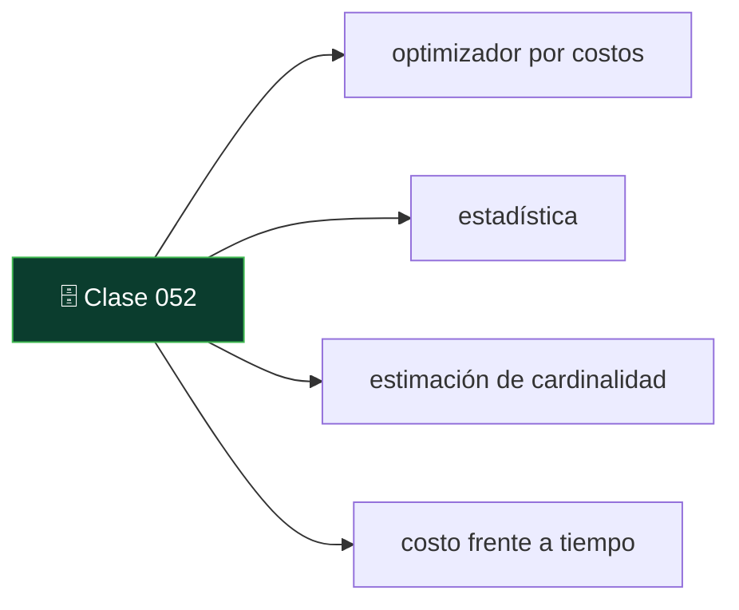
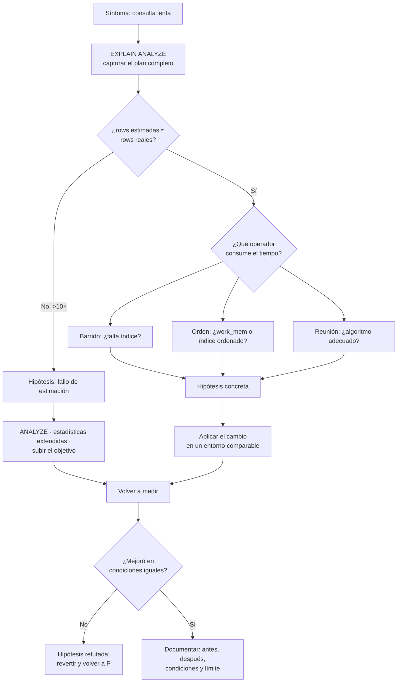

# 052 — Planes de ejecución: leer EXPLAIN y refutar una hipótesis

   

> [Programa](../../../README.md) · [Parte 09](../README.md) · [← Anterior](../../part-09-almacenamiento-indices-y-planes/051-indices-especializados/README.md) · [Siguiente →](../../part-10-distribucion-replica-y-consistencia/053-replica-lider-unico-multilider-y-sin-lider/README.md)

Parte 09 — Almacenamiento, índices y planes · Avanzado ·
4 horas estimadas · motores `postgresql`, `sqlite`, `duckdb` · laboratorio
[`labs/04-indexing`](../../../labs/04-indexing/README.md) · 3 fuentes.

**Conceptos centrales:** `optimizador por costos` · `estadística` · `estimación de cardinalidad` · `costo frente a tiempo`

**En este caso se comparan 7 motores**: 6 lo resuelven (5 con el resultado comprobado por máquina) y 1 no, con el motivo escrito.



---

## Propósito

Leer un plan de ejecución como evidencia y no como adorno. El plan permite convertir «va lento» en una hipótesis concreta, comprobable y refutable.

## Resultados de aprendizaje

Al terminar podrás:

1. Explicar cómo el optimizador por costos elige un plan.
2. Distinguir costo estimado de tiempo real y filas estimadas de filas devueltas.
3. Diagnosticar los cuatro fallos habituales de estimación.
4. Refutar una hipótesis de rendimiento con evidencia.
5. Saber cuándo el problema es la estadística y no el índice.

## Fundamentos

### El optimizador por costos

Selinger et al. (1979) definieron el método que siguen todos los motores relacionales:

1. Enumerar planes equivalentes (equivalencias E1–E6 de la clase 011).
2. Estimar, para cada uno, cuántas filas produce cada operador a partir de las **estadísticas** del catálogo.
3. Asignar un costo mediante un modelo (páginas secuenciales, páginas aleatorias, CPU por fila).
4. Elegir el más barato.

El eslabón débil es el paso 2: **si la estimación de cardinalidad es mala, la elección será mala**, por bueno que sea el modelo de costos. Casi todos los planes malos son fallos de estimación.

### Las dos parejas de números

```sql
EXPLAIN (ANALYZE, BUFFERS, FORMAT TEXT) SELECT ...;
```

```text
Seq Scan on enrollments  (cost=0.00..91234.00 rows=12 width=32)
                         (actual time=0.03..842.11 rows=3841022 loops=1)
  Filter: (nota > 4.0)
  Rows Removed by Filter: 1158978
  Buffers: shared hit=1204 read=64586
```

| Pareja | Qué comparar |
|---|---|
| `cost` frente a `actual time` | El costo es una unidad interna, **no** milisegundos. Solo sirve para comparar planes entre sí |
| `rows` estimadas frente a `rows` reales | **Aquí está el diagnóstico.** Una desviación de más de 10× explica casi cualquier plan malo |

En el ejemplo: estimó 12 filas y devolvió 3 841 022. Un factor de 320 000. Con esa estimación el planificador eligió un bucle anidado que, con 3,8 millones de filas, es catastrófico.

### Los cuatro fallos de estimación

| Fallo | Síntoma | Corrección |
|---|---|---|
| **Estadísticas obsoletas** | Estimaciones lejanas tras una carga masiva | `ANALYZE tabla` |
| **Columnas correlacionadas** | Subestimación con varios `AND` | `CREATE STATISTICS ... (dependencies)` |
| **Distribución sesgada** | Bien para valores comunes, mal para los raros | Subir `default_statistics_target` |
| **Expresión opaca** | Estimación fija del 0,5 % o similar | Índice de expresión, o reescribir el predicado |

El segundo merece detalle. El planificador supone **independencia** entre predicados:

```text
sel(ciudad='Santiago') = 0,30
sel(region='Metropolitana') = 0,35
estimación combinada = 0,30 · 0,35 = 0,105  → 10,5 %
realidad: casi toda Santiago está en la Metropolitana → ~30 %
```

Subestima por un factor de 3. Con varias columnas correlacionadas, el error se multiplica. PostgreSQL 10+ permite corregirlo:

```sql
CREATE STATISTICS est_ciudad_region (dependencies, ndistinct)
  ON ciudad, region FROM direcciones;
ANALYZE direcciones;
```

### Método de refutación

Un plan no se «mejora»: se formula una hipótesis y se intenta **refutarla**.



El paso que casi nadie da es **revertir cuando la hipótesis se refuta**. Los índices que no sirvieron se quedan, y al cabo de dos años la tabla tiene once índices de los que se usan cuatro.

## Ejemplo trabajado

Síntoma: el panel del curso tarda 8 s.

```sql
EXPLAIN (ANALYZE, BUFFERS)
SELECT c.nombre, count(*) AS inscritos, avg(e.nota) AS promedio
FROM courses c JOIN enrollments e ON e.course_id = c.id
WHERE c.periodo = '2026-1' AND e.estado = 'activa'
GROUP BY c.id, c.nombre;
```

**Plan inicial:**

```text
HashAggregate  (cost=... rows=40) (actual time=8123.4..8124.1 rows=40 loops=1)
  ->  Nested Loop  (cost=... rows=53) (actual time=0.4..7890.2 rows=1521044 loops=1)
        ->  Seq Scan on courses c  (rows=40) (actual rows=40 loops=1)
              Filter: (periodo = '2026-1')
        ->  Index Scan using enr_course_idx on enrollments e
              (cost=... rows=1) (actual rows=38026 loops=40)
              Index Cond: (course_id = c.id)
              Filter: (estado = 'activa')
              Rows Removed by Filter: 6710
        Buffers: shared hit=201 read=182304
```

**Diagnóstico, leyendo los números:**

1. El bucle anidado estimó **53** filas y produjo **1 521 044**: factor 28 700.
2. El origen: el índice interno estimó `rows=1` por iteración y devolvió 38 026.
3. Con `rows=1` estimado, el bucle anidado parecía barato. Con 38 026, es la peor elección posible.

**Hipótesis 1:** las estadísticas de `enrollments` están obsoletas.

```sql
ANALYZE enrollments;
```

Nueva ejecución: la estimación interna pasa de 1 a 16 800. El planificador cambia a reunión por hash:

```text
HashAggregate  (actual time=612.3..613.0 rows=40 loops=1)
  ->  Hash Join  (actual time=88.1..520.7 rows=1521044 loops=1)
        ->  Seq Scan on enrollments e   (actual rows=4250000)
              Filter: (estado = 'activa')
        ->  Hash  ->  Seq Scan on courses c  (actual rows=40)
```

**8 123 ms → 613 ms** sin crear un solo índice. El problema nunca fue el índice: era la estadística.

**Hipótesis 2:** todavía se barren 4,25 millones de inscripciones. Un índice parcial evitaría el barrido.

```sql
CREATE INDEX enr_activas ON enrollments (course_id) INCLUDE (nota)
WHERE estado = 'activa';
```

```text
HashAggregate  (actual time=214.8..215.2 rows=40 loops=1)
  ->  Nested Loop  (actual rows=1521044 loops=1)
        ->  Seq Scan on courses c  (actual rows=40)
        ->  Index Only Scan using enr_activas  (actual rows=38026 loops=40)
              Heap Fetches: 0
```

**613 ms → 215 ms.** `Heap Fetches: 0` confirma que el índice cubre la consulta.

**Registro de evidencia, que es el entregable:**

```text
Consulta      : panel del curso, período 2026-1
Antes         : 8 123 ms · bucle anidado · estimación 53 / real 1 521 044
Intervención 1: ANALYZE enrollments        → 613 ms (reunión por hash)
Intervención 2: índice parcial cubriente   → 215 ms (Heap Fetches: 0)
Costo añadido : índice de 92 MB, mantenido en cada escritura de fila activa
Condiciones   : PostgreSQL 16, 5 M inscripciones, caché caliente en las tres medidas
No demuestra  : nada sobre concurrencia; una sola sesión
```

La penúltima línea —caché caliente en las tres medidas— es lo que hace comparables los números. La última evita que alguien extrapole.

## Comparación

| Señal en el plan | Causa probable | Acción |
|---|---|---|
| `rows` estimadas ≪ reales | Estadísticas obsoletas o correlación | `ANALYZE`, estadísticas extendidas |
| `Rows Removed by Filter` alto | Índice sin la columna del filtro | Añadirla al índice |
| `Sort Method: external merge` | `work_mem` insuficiente | Subirlo o indexar el orden |
| Bucle anidado con `loops` alto | Estimación baja del interno | Corregir estadística |
| `Heap Fetches` alto en barrido de índice | Mapa de visibilidad desactualizado | `VACUUM` |
| `read` ≫ `hit` en `Buffers` | El conjunto de trabajo no cabe | Más memoria o menos datos |

## Errores frecuentes

1. **Leer `cost` como milisegundos.** Es una unidad interna sin significado absoluto.
2. **Usar `EXPLAIN` sin `ANALYZE`.** No hay filas reales que comparar.
3. **Crear índices antes de mirar la estimación.** La mitad de los planes malos se arreglan con `ANALYZE`.
4. **Medir una vez en frío y otra en caliente.** Los números dejan de ser comparables.
5. **Forzar el plan con pistas.** Tapa el síntoma y estorba cuando los datos cambian.
6. **No revertir lo que no funcionó.** Los índices inútiles se acumulan.

## De la clase a la operación

Un plan que degrada tras un despliegue suele deberse a una carga masiva sin `ANALYZE` o a un cambio en la distribución de datos. Guardar los planes de las consultas críticas como referencia permite detectar el cambio en minutos en vez de en días.

## Reto de transferencia

1. Captura el plan de tu consulta más lenta con `ANALYZE` y `BUFFERS`.
2. Identifica el operador con mayor desviación entre estimación y realidad.
3. Formula una hipótesis, aplícala y vuelve a medir en las mismas condiciones.
4. Escribe el registro de evidencia completo, incluida la línea de «no demuestra».

## Preguntas de evaluación

1. ¿Por qué una subestimación de cardinalidad lleva a elegir bucle anidado?
2. Explica por qué el planificador subestima con columnas correlacionadas y cómo se corrige.
3. ¿Qué significa `Heap Fetches` distinto de cero en un barrido de índice?
4. Da una hipótesis tuya que resultó refutada y qué hiciste con el cambio.

---

## 🌐 El mismo problema en cada motor

**Caso:** Tres consultas que devuelven lo mismo y no cuestan lo mismo

Un plan de ejecución no se lee para admirarlo: se lee para **refutar una
hipótesis**. «Esta consulta es lenta porque falta un índice» es una hipótesis,
y el plan es lo que la confirma o la tumba. Sin esa disciplina, optimizar
consiste en añadir índices hasta que algo mejore.

El caso pregunta quién tiene al menos una inscripción, y admite tres
formulaciones equivalentes: reunión con `DISTINCT`, `IN` con subconsulta y
semirreunión con `EXISTS`. Las tres devuelven las mismas dos filas —eso lo
garantiza el álgebra relacional— y ninguna cuesta lo mismo. Cuál gana no se
decide leyendo el SQL: se decide midiendo, y cada implementación trae al lado
la orden exacta con la que se mide en ese motor.

Salida esperada, idéntica en todos los motores que lo resuelven:

| nombre |
|---|
| `Ada` |
| `Linus` |

El contrato vive en [`motores.yaml`](motores.yaml) y lo comprueba
`python scripts/verificar_equivalencia.py --clase 052`: 5 de
las 6 implementaciones se ejecutan de verdad y su
resultado se compara con esa tabla; el resto se declara como material revisado,
no ejecutado.

| Motor | ¿Resuelve el caso? | Nivel de prueba | Código | Fuente |
|---|---|---|---|---|
| PostgreSQL | sí | servicio | [código](implementaciones/postgresql/consulta.sql) | [doc oficial](https://www.postgresql.org/docs/current/using-explain.html) |
| MySQL | sí | servicio | [código](implementaciones/mysql/consulta.sql) | [doc oficial](https://dev.mysql.com/doc/refman/8.4/en/explain.html) |
| SQLite | sí | núcleo | [código](implementaciones/sqlite/consulta.sql) | [doc oficial](https://sqlite.org/eqp.html) |
| DuckDB | sí | núcleo | [código](implementaciones/duckdb/consulta.sql) | [doc oficial](https://duckdb.org/docs/stable/guides/meta/explain_analyze.html) |
| MongoDB | sí | servicio | [código](implementaciones/mongodb/consulta.js) | [doc oficial](https://www.mongodb.com/docs/manual/reference/explain-results/) |
| Apache Cassandra | sí | declarado | [código](implementaciones/cassandra/consulta.cql) | [doc oficial](https://cassandra.apache.org/doc/latest/cassandra/managing/tools/cqlsh.html) |
| Redis | **no** | — | — | [doc oficial](https://redis.io/docs/latest/commands/slowlog-get/) |

### Los que resuelven el caso

#### PostgreSQL · [`implementaciones/postgresql/consulta.sql`](implementaciones/postgresql/consulta.sql)

✅ **verificado** — se ejecuta contra el motor real levantado con `docker compose`

```sql
-- motor: postgresql
-- doc: https://www.postgresql.org/docs/current/using-explain.html
-- nota: como se mide aqui:
--         EXPLAIN (ANALYZE, BUFFERS) SELECT ...
--       Lo que hay que mirar, en este orden:
--         1. «rows=X ... actual rows=Y»: si X e Y difieren en un orden de
--            magnitud, el problema son las ESTADISTICAS, no el indice.
--         2. «Rows Removed by Filter»: trabajo hecho y tirado.
--         3. «shared read» frente a «shared hit»: cuanto vino del disco.
--       Y un aviso: ANALYZE EJECUTA la consulta. Sobre un UPDATE o un DELETE
--       hay que envolverlo en BEGIN ... ROLLBACK.

-- === preparacion ===
DROP TABLE IF EXISTS inscripciones, estudiantes;

CREATE TABLE estudiantes (
    nombre text PRIMARY KEY
);
CREATE TABLE inscripciones (
    estudiante text NOT NULL,
    curso      text NOT NULL,
    PRIMARY KEY (estudiante, curso)
);
INSERT INTO estudiantes (nombre) VALUES ('Ada'), ('Linus'), ('Grace');
INSERT INTO inscripciones (estudiante, curso) VALUES
    ('Ada', 'DB-101'), ('Ada', 'SE-201'), ('Linus', 'DB-101');

-- === consulta ===
-- «Quien tiene al menos una inscripcion» se puede escribir de tres formas que
-- devuelven LO MISMO y cuestan cosas distintas:
--
--   A) SELECT DISTINCT e.nombre FROM estudiantes e
--      JOIN inscripciones i ON i.estudiante = e.nombre;
--      -> multiplica filas y luego las deduplica: trabajo hecho y deshecho.
--
--   B) SELECT nombre FROM estudiantes
--      WHERE nombre IN (SELECT estudiante FROM inscripciones);
--      -> el optimizador suele convertirlo en semirreunion; suele.
--
--   C) la de abajo: semirreunion explicita. El motor se detiene en la primera
--      coincidencia y no multiplica nada.
--
-- Que las tres den lo mismo es una propiedad del algebra relacional. Cual es
-- mas barata NO se decide leyendo: se decide midiendo con EXPLAIN, y por eso
-- esta clase se llama «refutacion».
SELECT e.nombre
FROM estudiantes e
WHERE EXISTS (
    SELECT 1 FROM inscripciones i WHERE i.estudiante = e.nombre
)
ORDER BY e.nombre;
```

- **Por qué sí:** `EXPLAIN (ANALYZE, BUFFERS)` es el mejor instrumento de esta lista: da coste estimado **y** tiempo real, filas estimadas **y** filas reales —cuando divergen mucho, el problema son las estadísticas y no el índice— y cuántos bloques vinieron de la caché y cuántos del disco.
- **Por qué no:** `ANALYZE` **ejecuta la consulta**: sobre un `UPDATE` o un `DELETE` hay que envolverlo en una transacción y deshacerla, o se aplica de verdad. Es un error que se comete una sola vez en producción.
- 📄 Documentación oficial: <https://www.postgresql.org/docs/current/using-explain.html>

#### MySQL · [`implementaciones/mysql/consulta.sql`](implementaciones/mysql/consulta.sql)

✅ **verificado** — se ejecuta contra el motor real levantado con `docker compose`

```sql
-- motor: mysql
-- doc: https://dev.mysql.com/doc/refman/8.4/en/explain.html
-- nota: como se mide aqui:
--         EXPLAIN ANALYZE SELECT ...        (8.0.18 y posteriores, con tiempos)
--         EXPLAIN FORMAT=JSON SELECT ...    (el coste que calculo el optimizador)
--       La columna `rows` del EXPLAIN clasico es una ESTIMACION, no un hecho:
--       se lee como si fuera un dato medido y no lo es.

-- === preparacion ===
DROP TABLE IF EXISTS inscripciones;
DROP TABLE IF EXISTS estudiantes;

CREATE TABLE estudiantes (
    nombre VARCHAR(50) PRIMARY KEY
);
CREATE TABLE inscripciones (
    estudiante VARCHAR(50) NOT NULL,
    curso      VARCHAR(50) NOT NULL,
    PRIMARY KEY (estudiante, curso)
);
INSERT INTO estudiantes (nombre) VALUES ('Ada'), ('Linus'), ('Grace');
INSERT INTO inscripciones (estudiante, curso) VALUES
    ('Ada', 'DB-101'), ('Ada', 'SE-201'), ('Linus', 'DB-101');

-- === consulta ===
-- «Quien tiene al menos una inscripcion» se puede escribir de tres formas que
-- devuelven LO MISMO y cuestan cosas distintas:
--
--   A) SELECT DISTINCT e.nombre FROM estudiantes e
--      JOIN inscripciones i ON i.estudiante = e.nombre;
--      -> multiplica filas y luego las deduplica: trabajo hecho y deshecho.
--
--   B) SELECT nombre FROM estudiantes
--      WHERE nombre IN (SELECT estudiante FROM inscripciones);
--      -> el optimizador suele convertirlo en semirreunion; suele.
--
--   C) la de abajo: semirreunion explicita. El motor se detiene en la primera
--      coincidencia y no multiplica nada.
--
-- Que las tres den lo mismo es una propiedad del algebra relacional. Cual es
-- mas barata NO se decide leyendo: se decide midiendo con EXPLAIN, y por eso
-- esta clase se llama «refutacion».
SELECT e.nombre
FROM estudiantes e
WHERE EXISTS (
    SELECT 1 FROM inscripciones i WHERE i.estudiante = e.nombre
)
ORDER BY e.nombre;
```

- **Por qué sí:** Desde 8.0.18 tiene `EXPLAIN ANALYZE` con tiempos reales, y `EXPLAIN FORMAT=JSON` expone el coste que calculó el optimizador para cada alternativa.
- **Por qué no:** La columna `rows` del `EXPLAIN` clásico es una **estimación** que la gente lee como si fuera un hecho, y sus estadísticas son mucho más pobres que las de PostgreSQL: se muestrean pocas páginas del índice y se recalculan en momentos difíciles de predecir.
- 📄 Documentación oficial: <https://dev.mysql.com/doc/refman/8.4/en/explain.html>

#### SQLite · [`implementaciones/sqlite/consulta.sql`](implementaciones/sqlite/consulta.sql)

✅ **verificado** — se ejecuta en CI sin servicios

```sql
-- motor: sqlite
-- doc: https://sqlite.org/eqp.html
-- nota: como se mide aqui:
--         EXPLAIN QUERY PLAN SELECT ...
--       Dos lineas y una pregunta: SCAN o SEARCH. No hay coste ni tiempo, asi
--       que no se pueden comparar dos planes por numero; solo por forma.

-- === preparacion ===
CREATE TABLE estudiantes (
    nombre TEXT PRIMARY KEY
);
CREATE TABLE inscripciones (
    estudiante TEXT NOT NULL,
    curso      TEXT NOT NULL,
    PRIMARY KEY (estudiante, curso)
);
INSERT INTO estudiantes (nombre) VALUES ('Ada'), ('Linus'), ('Grace');
INSERT INTO inscripciones (estudiante, curso) VALUES
    ('Ada', 'DB-101'), ('Ada', 'SE-201'), ('Linus', 'DB-101');

-- === consulta ===
-- «Quien tiene al menos una inscripcion» se puede escribir de tres formas que
-- devuelven LO MISMO y cuestan cosas distintas:
--
--   A) SELECT DISTINCT e.nombre FROM estudiantes e
--      JOIN inscripciones i ON i.estudiante = e.nombre;
--      -> multiplica filas y luego las deduplica: trabajo hecho y deshecho.
--
--   B) SELECT nombre FROM estudiantes
--      WHERE nombre IN (SELECT estudiante FROM inscripciones);
--      -> el optimizador suele convertirlo en semirreunion; suele.
--
--   C) la de abajo: semirreunion explicita. El motor se detiene en la primera
--      coincidencia y no multiplica nada.
--
-- Que las tres den lo mismo es una propiedad del algebra relacional. Cual es
-- mas barata NO se decide leyendo: se decide midiendo con EXPLAIN, y por eso
-- esta clase se llama «refutacion».
SELECT e.nombre
FROM estudiantes e
WHERE EXISTS (
    SELECT 1 FROM inscripciones i WHERE i.estudiante = e.nombre
)
ORDER BY e.nombre;
```

- **Por qué sí:** `EXPLAIN QUERY PLAN` cabe en dos líneas y dice lo único que suele importar: si hubo `SCAN` o `SEARCH ... USING INDEX`. Para aprender a leer planes es el mejor punto de partida, porque no hay ruido.
- **Por qué no:** No da coste ni tiempo ni filas: no se puede comparar dos planes por número, solo por forma. Y como el planificador tiene pocas opciones, no enseña a diagnosticar los casos difíciles.
- 📄 Documentación oficial: <https://sqlite.org/eqp.html>

#### DuckDB · [`implementaciones/duckdb/consulta.sql`](implementaciones/duckdb/consulta.sql)

✅ **verificado** — se ejecuta en CI sin servicios

```sql
-- motor: duckdb
-- doc: https://duckdb.org/docs/stable/guides/meta/explain_analyze.html
-- nota: como se mide aqui:
--         EXPLAIN ANALYZE SELECT ...
--       Dibuja el arbol con el tiempo de cada operador. Aviso: el optimizador
--       reescribe tanto que este EXISTS acabara convertido en una reunion, y el
--       plan no se parecera a lo escrito.

-- === preparacion ===
CREATE TABLE estudiantes (
    nombre VARCHAR PRIMARY KEY
);
CREATE TABLE inscripciones (
    estudiante VARCHAR NOT NULL,
    curso      VARCHAR NOT NULL,
    PRIMARY KEY (estudiante, curso)
);
INSERT INTO estudiantes (nombre) VALUES ('Ada'), ('Linus'), ('Grace');
INSERT INTO inscripciones (estudiante, curso) VALUES
    ('Ada', 'DB-101'), ('Ada', 'SE-201'), ('Linus', 'DB-101');

-- === consulta ===
-- «Quien tiene al menos una inscripcion» se puede escribir de tres formas que
-- devuelven LO MISMO y cuestan cosas distintas:
--
--   A) SELECT DISTINCT e.nombre FROM estudiantes e
--      JOIN inscripciones i ON i.estudiante = e.nombre;
--      -> multiplica filas y luego las deduplica: trabajo hecho y deshecho.
--
--   B) SELECT nombre FROM estudiantes
--      WHERE nombre IN (SELECT estudiante FROM inscripciones);
--      -> el optimizador suele convertirlo en semirreunion; suele.
--
--   C) la de abajo: semirreunion explicita. El motor se detiene en la primera
--      coincidencia y no multiplica nada.
--
-- Que las tres den lo mismo es una propiedad del algebra relacional. Cual es
-- mas barata NO se decide leyendo: se decide midiendo con EXPLAIN, y por eso
-- esta clase se llama «refutacion».
SELECT e.nombre
FROM estudiantes e
WHERE EXISTS (
    SELECT 1 FROM inscripciones i WHERE i.estudiante = e.nombre
)
ORDER BY e.nombre;
```

- **Por qué sí:** `EXPLAIN ANALYZE` dibuja el árbol de operadores con el tiempo de cada uno y las filas que pasaron: es la forma más legible de ver dónde se va el tiempo de una consulta analítica.
- **Por qué no:** Su optimizador reescribe tanto —descorrelación, empuje de filtros, reordenación de reuniones— que el plan casi nunca se parece a la consulta escrita, y eso confunde a quien está aprendiendo a relacionar ambas cosas.
- 📄 Documentación oficial: <https://duckdb.org/docs/stable/guides/meta/explain_analyze.html>

#### MongoDB · [`implementaciones/mongodb/consulta.js`](implementaciones/mongodb/consulta.js)

✅ **verificado** — se ejecuta contra el motor real levantado con `docker compose`

```javascript
// motor: mongodb
// doc: https://www.mongodb.com/docs/manual/reference/explain-results/
// nota: como se mide aqui:
//         db.estudiantes.aggregate([...]).explain("executionStats")
//       Las tres cifras que resuelven casi todo:
//         nReturned            lo que devolvio
//         totalKeysExamined    entradas de indice leidas
//         totalDocsExamined    documentos leidos
//       Si los dos ultimos son mucho mayores que el primero, se lee de mas.
//       Y recordar que el plan ganador queda CACHEADO: la consulta puede
//       degradarse meses despues sin que el codigo haya cambiado.

// === preparacion ===
db.estudiantes.drop();
db.inscripciones.drop();
db.estudiantes.insertMany([
  { _id: "Ada" }, { _id: "Linus" }, { _id: "Grace" },
]);
db.inscripciones.insertMany([
  { estudiante: "Ada", curso: "DB-101" },
  { estudiante: "Ada", curso: "SE-201" },
  { estudiante: "Linus", curso: "DB-101" },
]);
db.inscripciones.createIndex({ estudiante: 1 });

// === consulta ===
// La forma barata: agrupar por estudiante en la coleccion PEQUENA de las
// inscripciones, en vez de recorrer los estudiantes buscando cada uno.
db.inscripciones
  .aggregate([
    { $group: { _id: "$estudiante" } },
    { $sort: { _id: 1 } },
  ])
  .forEach((d) => print(d._id));
```

- **Por qué sí:** `explain("executionStats")` da las tres cifras que resuelven casi todo: `nReturned`, `totalKeysExamined` y `totalDocsExamined`. Si el segundo o el tercero son mucho mayores que el primero, se está leyendo de más, y ahí está el diagnóstico.
- **Por qué no:** Su planificador prueba varios planes y **cachea el ganador**: la consulta puede ir bien meses y degradarse cuando la distribución cambia, sin que nada haya cambiado en el código. Diagnosticarlo exige acordarse de que la caché de planes existe.
- 📄 Documentación oficial: <https://www.mongodb.com/docs/manual/reference/explain-results/>

#### Apache Cassandra · [`implementaciones/cassandra/consulta.cql`](implementaciones/cassandra/consulta.cql)

⚪ **declarado** — se revisa a mano contra la documentación citada; la máquina no lo ejecuta

```sql
-- motor: cassandra
-- doc: https://cassandra.apache.org/doc/latest/cassandra/managing/tools/cqlsh.html
-- nota: implementacion declarada. Aqui no hay plan que leer porque no hay
--       optimizador que elija: la consulta hace lo que el modelo permite. Lo que
--       si hay es TRACING, que muestra la traza DISTRIBUIDA:
--         - que nodo coordino la consulta
--         - a que replicas pregunto y cuanto tardo cada una
--         - cuantas SSTables se abrieron
--         - cuantas lapidas se recorrieron  <- el diagnostico mas util del motor
--
--       Y la consecuencia incomoda: si va lenta, la culpa es del modelo de
--       datos. El diagnostico es barato; la correccion es crear otra tabla y
--       migrar los datos.

-- === preparacion ===
CREATE KEYSPACE IF NOT EXISTS escuela
  WITH replication = {'class': 'SimpleStrategy', 'replication_factor': 1};

DROP TABLE IF EXISTS escuela.inscripciones_por_estudiante;

CREATE TABLE escuela.inscripciones_por_estudiante (
    estudiante text,
    curso      text,
    PRIMARY KEY (estudiante, curso)
);

INSERT INTO escuela.inscripciones_por_estudiante (estudiante, curso) VALUES ('Ada', 'DB-101');
INSERT INTO escuela.inscripciones_por_estudiante (estudiante, curso) VALUES ('Ada', 'SE-201');
INSERT INTO escuela.inscripciones_por_estudiante (estudiante, curso) VALUES ('Linus', 'DB-101');

-- === consulta ===
TRACING ON;
SELECT DISTINCT estudiante FROM escuela.inscripciones_por_estudiante;
TRACING OFF;
```

- **Por qué sí:** `TRACING ON` no muestra un plan —no hay optimizador que elija— sino la **traza distribuida** de la consulta: qué nodo coordinó, a qué réplicas preguntó, cuántas SSTables se abrieron y cuántas lápidas se recorrieron. Para diagnosticar este motor, esa información vale más que un plan.
- **Por qué no:** Precisamente porque no hay optimizador, no hay nada que refutar sobre la consulta: si va lenta, la culpa es del modelo de datos, y arreglarlo significa crear otra tabla y migrar. El diagnóstico es barato; la corrección, no.
- 📄 Documentación oficial: <https://cassandra.apache.org/doc/latest/cassandra/managing/tools/cqlsh.html>

### Los que no resuelven este caso — y qué se hace en su lugar

Descartar un motor con un argumento es tan formativo como usarlo. Ninguna de estas filas dice que el motor sea peor: dice que este problema no es el suyo.

| Motor | Por qué no | Qué se hace en su lugar | Fuente |
|---|---|---|---|
| Redis | No hay planes: cada orden tiene una complejidad fija y documentada, y está escrita en su página de referencia. `SMEMBERS` es O(N) y siempre lo será; no hay optimizador que pueda cambiarlo. | La disciplina equivalente es leer la complejidad en la documentación antes de usar la orden, y vigilar el registro de órdenes lentas (`SLOWLOG GET`), que delata las que bloquearon el hilo único. | [doc](https://redis.io/docs/latest/commands/slowlog-get/) |

---

## Laboratorio

```bash
python scripts/validate_repository.py
python labs/04-indexing/run_indexing_lab.py
```

Guarda como evidencia la salida completa, la versión del motor y la semilla o
los parámetros usados. Una captura sin comando no es evidencia: no se puede
repetir.

## Evaluación

| Criterio | Peso | Qué se comprueba |
|---|---:|---|
| Comprensión conceptual | 25 % | Explica el mecanismo, no solo el resultado |
| Ejecución reproducible | 25 % | Otra persona obtiene lo mismo con las instrucciones dadas |
| Interpretación basada en evidencia | 25 % | Cada conclusión se apoya en una salida o una medición |
| Límites y riesgos declarados | 25 % | Dice qué no demuestra el ejercicio y qué faltaría en producción |

La clase se da por superada cuando la respuesta explica el mecanismo, muestra
la salida que la respalda y declara al menos un límite del ejercicio.

## Fuentes de esta clase

Todo lo afirmado arriba procede de estas obras. Los identificadores viven en
[`catalog/sources.json`](../../../catalog/sources.json) y el estado de los
enlaces se comprueba con `python scripts/check_external_links.py`.

- **P. Griffiths Selinger, M. M. Astrahan, D. D. Chamberlin, R. A. Lorie, T. G. Price** (1979). [Access Path Selection in a Relational Database Management System](https://dl.acm.org/doi/10.1145/582095.582099). ACM SIGMOD. DOI [10.1145/582095.582099](https://doi.org/10.1145/582095.582099).  
  Base del optimizador por costos que siguen usando los motores actuales.
- **PostgreSQL Global Development Group** (2026). [PostgreSQL: Using EXPLAIN](https://www.postgresql.org/docs/current/using-explain.html).  
  Lectura de planes de ejecución y diferencia entre costo estimado y tiempo real.
- **SQLite Consortium** (2026). [SQLite: Query Optimizer Overview](https://sqlite.org/optoverview.html).  
  Como decide SQLite usar un índice; útil para leer EXPLAIN QUERY PLAN.

---

> [Programa](../../../README.md) · [Parte 09](../README.md) · [← Anterior](../../part-09-almacenamiento-indices-y-planes/051-indices-especializados/README.md) · [Siguiente →](../../part-10-distribucion-replica-y-consistencia/053-replica-lider-unico-multilider-y-sin-lider/README.md)
