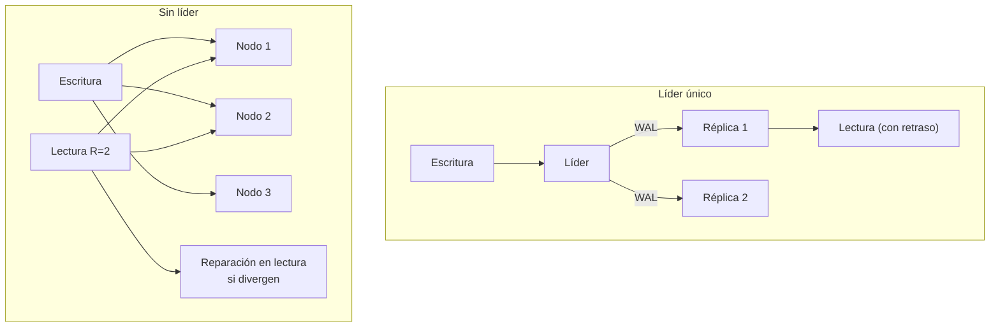

# 043 — Réplica: líder único, multilíder y sin líder

> [Programa](../../../README.md) · [Parte 09](../README.md) · [← Anterior](../../part-08-almacenamiento-indices-y-planes/042-planes-de-ejecucion-y-refutacion/README.md) · [Siguiente →](../../part-09-distribucion-replica-y-consistencia/044-particionado-rebalanceo-y-claves-calientes/README.md)

Parte 09 — Distribución, réplica y consistencia · Avanzado ·
4 horas estimadas · motores `postgresql`, `mysql`, `cassandra` · laboratorio
[`labs/05-nosql-workloads`](../../../labs/05-nosql-workloads/README.md) · 3 fuentes.

**Conceptos centrales:** `replicación sincrónica` · `retraso de réplica` · `quórum` · `lectura de tu propia escritura`

---

## Propósito

Replicar datos entendiendo qué se gana (disponibilidad, lectura escalada, cercanía geográfica) y qué se paga (retraso, conflictos, pérdida potencial en la conmutación).

## Resultados de aprendizaje

Al terminar podrás:

1. Comparar las tres topologías de replicación y su modelo de fallo.
2. Explicar el retraso de réplica y las anomalías que produce.
3. Aplicar las garantías de sesión que las corrigen.
4. Calcular quórums de lectura y escritura sin líder.
5. Decidir entre replicación síncrona y asíncrona con un criterio de negocio.

## Fundamentos

### Las tres topologías

| Topología | Escrituras | Conflictos | Ejemplos |
|---|---|---|---|
| **Líder único** | Un nodo | Imposibles | PostgreSQL, MySQL, SQL Server |
| **Multilíder** | Varios nodos | Inevitables, hay que resolverlos | Multirregión, CouchDB, CRDT |
| **Sin líder** | Cualquier nodo, por quórum | Se resuelven al leer | Dynamo, Cassandra, Riak |

Con líder único no hay conflictos de escritura **por construcción**: todas pasan por el mismo nodo, que las ordena. Es la razón por la que sigue siendo la elección correcta salvo que haya un motivo fuerte para otra cosa.

### Síncrona frente a asíncrona

| Modo | Confirma cuando | Se pierde en la conmutación | Latencia de escritura |
|---|---|---|---|
| Asíncrona | El líder escribió | Lo aún no replicado | Baja |
| Síncrona | Al menos una réplica confirmó | Nada | +1 ida y vuelta |
| Semisíncrona | Una réplica de N | Nada, si esa sobrevive | +1 ida y vuelta |

La asíncrona es la configuración por defecto casi siempre, y significa que **una conmutación puede perder transacciones ya confirmadas al cliente**. No es un fallo: es el compromiso elegido. Debe estar escrito en el objetivo de punto de recuperación (RPO, clase 048).

PostgreSQL permite ajustarlo por transacción:

```sql
SET synchronous_commit = 'remote_apply';   -- solo para las operaciones críticas
```

Patrón útil: asíncrono por defecto, síncrono para pagos.

### El retraso y sus anomalías

El retraso de réplica es el tiempo entre confirmar en el líder y ser visible en la réplica. Con carga normal son milisegundos; durante una carga masiva o un `VACUUM` pesado, pueden ser minutos.

```sql
SELECT client_addr,
       pg_wal_lsn_diff(pg_current_wal_lsn(), replay_lsn) AS bytes_de_retraso,
       replay_lag
FROM pg_stat_replication;
```

Tres anomalías, con sus nombres y sus remedios:

| Anomalía | Qué ve el usuario | Garantía que la corrige |
|---|---|---|
| Lee su propia escritura y no la ve | Publica un comentario y desaparece | **Lectura de tus escrituras** |
| Ve datos que retroceden | Refresca y el comentario vuelve a desaparecer | **Lectura monótona** |
| Ve un efecto antes que su causa | La respuesta antes que la pregunta | **Consistencia causal** (clase 046) |

Implementaciones habituales:

- **Lectura de tus escrituras:** durante N segundos tras escribir, leer del líder. O guardar el LSN de la escritura y exigir que la réplica lo haya alcanzado.
- **Lectura monótona:** fijar cada sesión a la misma réplica.

### Sin líder y quórums

Dynamo introdujo el modelo: se escribe en N réplicas, se espera confirmación de W, se lee de R.

```text
R + W > N  →  los conjuntos de lectura y escritura se solapan
              → alguna réplica leída tiene la última escritura
```

Con N = 3:

| W | R | Solapa | Tolera |
|---|---|---|---|
| 2 | 2 | Sí | 1 nodo caído en ambas operaciones |
| 3 | 1 | Sí | 0 en escritura, 2 en lectura |
| 1 | 3 | Sí | 2 en escritura, 0 en lectura |
| 1 | 1 | **No** | Máxima disponibilidad, sin garantía |

Advertencia importante: **`R + W > N` no da linealizabilidad**. Garantiza que alguna réplica leída tiene el valor más reciente, no que se sepa distinguirlo si hay escrituras concurrentes, ni protege contra reversiones si un nodo se recupera con datos viejos. Bailis et al. desarrollan qué se puede y qué no se puede garantizar sin coordinación.

Mecanismos de reparación: reparación en lectura (al detectar réplicas atrasadas, se corrigen), entrega con pista (un nodo vecino acepta la escritura del caído y se la entrega al volver) y reparación anti-entropía periódica.



## Ejemplo trabajado

Sistema: un líder y dos réplicas asíncronas; las lecturas se reparten entre las réplicas.

**La anomalía, con traza real:**

```text
t0    Cliente escribe la nota  -> líder. COMMIT. Respuesta 200.
t0+5ms Cliente recarga la ficha -> réplica 2 (retraso: 340 ms)
t0+5ms Respuesta: la nota no aparece.
t0+1s  Cliente recarga         -> réplica 1 (retraso: 12 ms)
t0+1s  Respuesta: la nota aparece.
t0+2s  Cliente recarga         -> réplica 2 (aún atrasada)
t0+2s  Respuesta: la nota DESAPARECE otra vez.
```

Dos anomalías en cinco segundos: no lee su propia escritura y la lectura no es monótona. Para el usuario, el sistema está roto; para el equipo, todo está «en verde».

**Corrección 1 — leer del líder tras escribir:**

```python
def leer_ficha(ctx, student_id):
    # Tras una escritura propia, leer del líder durante una ventana
    # holgadamente mayor que el retraso p99 observado.
    if ctx.escribio_hace_menos_de(seconds=10):
        return leer(lider, student_id)
    return leer(replica_de(ctx.session_id), student_id)
```

**Corrección 2 — esperar al LSN**, más precisa y sin cargar el líder:

```python
def escribir_nota(ctx, ...):
    lsn = lider.execute("...; SELECT pg_current_wal_lsn()")
    ctx.session["lsn_minimo"] = lsn

def leer_ficha(ctx, student_id):
    r = replica_de(ctx.session_id)
    if r.replay_lsn() < ctx.session.get("lsn_minimo", 0):
        return leer(lider, student_id)      # esta réplica aún no alcanza
    return leer(r, student_id)
```

**Corrección 3 — fijar la sesión a una réplica.** Resuelve la lectura monótona (nunca retrocede) pero no la lectura de las propias escrituras si esa réplica va atrasada. Se combina con la 1 o la 2.

**Cálculo de capacidad de lectura.** Con un líder que sostiene 8 000 lecturas/s y dos réplicas iguales:

```text
solo líder:          8 000 lecturas/s
líder + 2 réplicas: 24 000 lecturas/s teóricas
con el 10 % desviado al líder por consistencia: ~21 600 útiles
```

Y el límite que no se supera: **las escrituras no escalan**. Todas van al líder. Añadir réplicas no aumenta en nada la capacidad de escritura; eso exige particionar (clase 044).

## Comparación

| Necesidad | Topología |
|---|---|
| Escalar lecturas | Líder único + réplicas |
| Alta disponibilidad regional | Líder único con conmutación automática |
| Escritura en varias regiones | Multilíder, con resolución de conflictos |
| Tolerar la caída de varios nodos | Sin líder con quórum |
| Cero pérdida en la conmutación | Replicación síncrona |
| Latencia mínima de escritura | Asíncrona, con RPO declarado |

## Errores frecuentes

1. **Conmutación automática con réplica asíncrona sin declarar el RPO.** Se pierden transacciones confirmadas.
2. **Repartir lecturas sin garantías de sesión.** Aparecen las tres anomalías.
3. **Suponer que las réplicas escalan la escritura.** No lo hacen.
4. **Cerebro dividido en multilíder.** Dos líderes aceptando escrituras que después no se pueden reconciliar.
5. **`R + W > N` interpretado como linealizabilidad.** No lo es.
6. **No vigilar el retraso.** Una réplica atrasada sirve datos viejos sin ningún error visible.

## De la clase a la operación

El retraso de réplica es la métrica que más incidencias explica y la que menos se mira. Una alerta sobre el retraso p99 —y la lógica que desvía al líder cuando se supera— evita la clase entera de incidencias «me desaparecen los datos».

## Reto de transferencia

1. Levanta un líder y una réplica y mide el retraso bajo carga de escritura.
2. Reproduce las tres anomalías con un cliente que lea de la réplica.
3. Implementa la corrección por LSN y demuestra que desaparecen.
4. Calcula el RPO real de tu configuración actual, en segundos y en transacciones.

## Preguntas de evaluación

1. ¿Cuántas transacciones se pierden en una conmutación asíncrona con 340 ms de retraso y 2 000 escrituras/s?
2. Explica por qué fijar la sesión a una réplica no resuelve la lectura de tus escrituras.
3. Con N = 5, enumera las combinaciones `R`/`W` que solapan y su tolerancia a fallos.
4. Da una operación de tu sistema que justifique replicación síncrona y otra que no.

---

## Laboratorio

```bash
python scripts/validate_repository.py
python labs/05-nosql-workloads/run_nosql_lab.py
```

Guarda como evidencia la salida completa, la versión del motor y la semilla o
los parámetros usados. Una captura sin comando no es evidencia: no se puede
repetir.

## Evaluación

| Criterio | Peso | Qué se comprueba |
|---|---:|---|
| Comprensión conceptual | 25 % | Explica el mecanismo, no solo el resultado |
| Ejecución reproducible | 25 % | Otra persona obtiene lo mismo con las instrucciones dadas |
| Interpretación basada en evidencia | 25 % | Cada conclusión se apoya en una salida o una medición |
| Límites y riesgos declarados | 25 % | Dice qué no demuestra el ejercicio y qué faltaría en producción |

La clase se da por superada cuando la respuesta explica el mecanismo, muestra
la salida que la respalda y declara al menos un límite del ejercicio.

## Fuentes de esta clase

Todo lo afirmado arriba procede de estas obras. Los identificadores viven en
[`catalog/sources.json`](../../../catalog/sources.json) y el estado de los
enlaces se comprueba con `python scripts/check_external_links.py`.

- **Martin Kleppmann** (2017). [Designing Data-Intensive Applications](https://dataintensive.net/). O'Reilly. ISBN 978-1-4493-7332-0.  
  Referencia central del programa para replicación, partición, transacciones distribuidas y streaming.
- **Jim Gray, Pat Helland, Patrick O'Neil, Dennis Shasha** (1996). [The Dangers of Replication and a Solution](https://dl.acm.org/doi/10.1145/233269.233330). ACM SIGMOD. DOI [10.1145/233269.233330](https://doi.org/10.1145/233269.233330).  
  Cuantifica cómo crecen los conflictos con el número de réplicas.
- **Giuseppe DeCandia, Deniz Hastorun, Madan Jampani** (2007). [Dynamo: Amazon's Highly Available Key-value Store](https://www.allthingsdistributed.com/files/amazon-dynamo-sosp2007.pdf). ACM SOSP. DOI [10.1145/1294261.1294281](https://doi.org/10.1145/1294261.1294281).  
  Hash consistente, quorums ajustables y reconciliación en el cliente.

---

> [Programa](../../../README.md) · [Parte 09](../README.md) · [← Anterior](../../part-08-almacenamiento-indices-y-planes/042-planes-de-ejecucion-y-refutacion/README.md) · [Siguiente →](../../part-09-distribucion-replica-y-consistencia/044-particionado-rebalanceo-y-claves-calientes/README.md)
