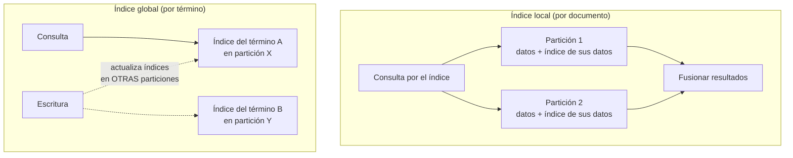

## Propósito

Repartir los datos entre nodos para escalar la escritura, evitando los dos fallos que hacen inútil el reparto: las particiones calientes y el rebalanceo que mueve todo.

## Resultados de aprendizaje

Al terminar podrás:

1. Comparar particionado por rango y por hash, con sus consultas favorecidas.
2. Explicar el hash consistente y por qué reduce el movimiento de datos.
3. Detectar y mitigar una clave caliente.
4. Diseñar índices secundarios en un sistema particionado.
5. Estimar el costo de un rebalanceo.

## Fundamentos

### Por qué particionar

La replicación (clase 043) escala **lecturas**. Para escalar **escrituras** o superar la capacidad de un nodo, hay que repartir los datos: cada partición vive en un nodo y recibe solo su parte del tráfico.

Es un cambio cualitativo: se pierden las reuniones baratas, las transacciones que abarcan varias particiones y los índices secundarios globales gratuitos.

### Rango frente a hash

| | Por rango | Por hash |
|---|---|---|
| Asignación | `[a-f] → n1`, `[g-m] → n2` | `hash(clave) mod N` |
| Consultas de rango | **Eficientes** (particiones contiguas) | Preguntan a todos los nodos |
| Reparto de carga | Desigual si la distribución lo es | Uniforme |
| Punto caliente temporal | **Sí**: si la clave es el tiempo, todo va al último | No |
| Ejemplo | HBase, particiones de PostgreSQL | Cassandra, DynamoDB |

El punto caliente temporal del particionado por rango es el error clásico: usar la marca de tiempo como clave de partición envía **todas** las escrituras al nodo del rango actual, mientras el resto está ocioso.

**Solución híbrida**, la más usada: `(entidad, ventana_temporal)` como clave compuesta. El hash sobre la entidad reparte, y la ventana acota el tamaño (clase 029).

### Hash consistente

Con `hash(clave) mod N`, cambiar `N` reubica casi todo:

```text
N=4 → N=5:  se mueven aproximadamente 4/5 = 80 % de las claves
```

El hash consistente coloca nodos y claves en un anillo; cada clave va al primer nodo en sentido horario. Al añadir un nodo, solo se mueven las claves de su segmento:

```text
N=4 → N=5:  se mueve aproximadamente 1/5 = 20 %
```

Con nodos virtuales (cada nodo físico ocupa 128–256 posiciones del anillo) el reparto es más uniforme y el rebalanceo se distribuye entre todos los nodos existentes en vez de castigar a uno.

Alternativa más simple y muy usada: **particiones fijas**. Se crean 1 024 particiones desde el principio y se asignan a los nodos; añadir un nodo solo reasigna particiones enteras, sin recalcular hashes. Es lo que hacen Riak y Elasticsearch.

### Claves calientes

Una clave con tráfico desproporcionado satura su nodo por mucho que se reparta el resto. Ningún esquema de particionado lo resuelve, porque la clave es indivisible.

| Mitigación | Cómo | Costo |
|---|---|---|
| **Salado** | Añadir un sufijo aleatorio: `curso-bd#0`…`#15` | Leer exige consultar las 16 |
| **Caché delante** | Redis absorbe las lecturas | Coherencia (clase 027) |
| **Réplica dedicada** | Más réplicas para esa clave | Operación específica |
| **Agregación local** | Acumular en el cliente y volcar por lotes | Retraso, pérdida ante caída |

El salado es la técnica canónica y hay que dimensionarla: con 16 sufijos, la escritura se reparte entre 16 particiones y **cada lectura hace 16 consultas**. Se aplica solo a las claves realmente calientes, no a todas.

### Índices secundarios



| | Local | Global |
|---|---|---|
| Escritura | Solo la partición propia | Varias particiones |
| Lectura por el índice | **Todas** las particiones (dispersar y reunir) | Una |
| Consistencia | Trivial | Asíncrona en la práctica |
| Ejemplos | Cassandra, Elasticsearch | DynamoDB GSI |

El compromiso es limpio: el índice local carga la lectura, el global carga la escritura. Con muchas particiones, la dispersión del índice local se vuelve cara porque la latencia es la del nodo más lento (Dean y Barroso, clase 052).

## Ejemplo trabajado

Sistema de eventos: 200 000 escrituras/s, 500 nodos posibles, consultas por `sensor_id` y por rango temporal.

**Diseño 1 — partición por `ocurrido_en`:**

```text
Todas las escrituras del momento presente van a la MISMA partición.
Nodo activo: 1 de 500. Caudal máximo: el de un nodo (~10 000/s).
Resultado: el clúster de 500 nodos rinde como uno.
```

Fallo total. Es el punto caliente temporal.

**Diseño 2 — partición por `hash(sensor_id)`:**

```text
100 000 sensores → reparto uniforme
Escritura:            200 000/s repartidas entre 500 nodos = 400/s por nodo
Consulta por sensor:  1 partición
Consulta por rango temporal global: 500 particiones (dispersar y reunir)
```

Correcto para escritura y para la consulta por sensor. La consulta temporal global es cara, pero es rara.

**Diseño 3 — partición por `(hash(sensor_id), dia)`:**

Añade la cota de tamaño de partición (clase 030) sin perder el reparto.

```text
tamaño de partición = 86 400 mediciones · 100 B ≈ 8,6 MB   ✔
consulta de 7 días para un sensor = 7 particiones, en paralelo
```

**Ahora la clave caliente.** Un sensor emite 20 000 mediciones/s, 100 veces más que el resto:

```text
sin salado:  su partición recibe 20 000/s → satura un nodo
con salado de 16:
   escritura: (hash(sensor_id + '#' + aleatorio(0,15)), dia) → 1 250/s por partición
   lectura:   16 consultas en paralelo, fusionadas por el cliente
```

Aplicado **solo** a los sensores identificados como calientes, mediante una lista consultada por el productor. Salar los 100 000 sensores multiplicaría por 16 el costo de todas las lecturas para resolver un problema de uno.

**Costo del rebalanceo.** De 500 a 600 nodos, con 40 TB:

| Esquema | Datos movidos |
|---|---:|
| `hash mod N` | ~33 TB |
| Hash consistente con nodos virtuales | ~6,7 TB |
| 4 096 particiones fijas | ~6,7 TB, en unidades enteras |

A 1 Gb/s por nodo y limitando el rebalanceo al 20 % del ancho de banda para no degradar el servicio:

```text
6,7 TB / (500 nodos · 25 MB/s) ≈ 9 minutos
33  TB / (500 nodos · 25 MB/s) ≈ 44 minutos con degradación notable
```

El rebalanceo debe ser **gradual y limitado**: uno automático y sin límite ante un fallo transitorio puede convertir la caída de un nodo en la caída del clúster, al saturar la red justo cuando hay menos capacidad.

## Comparación

| Necesidad | Esquema |
|---|---|
| Consultas de rango frecuentes | Rango, con vigilancia del punto caliente |
| Escritura uniforme | Hash |
| Series temporales por entidad | Hash de entidad + cubo temporal |
| Añadir nodos sin gran movimiento | Hash consistente o particiones fijas |
| Consulta por atributo no clave | Índice global si domina la lectura; local si domina la escritura |

## Errores frecuentes

1. **Marca de tiempo como clave de partición.** Concentra toda la escritura en un nodo.
2. **`hash mod N`.** Cualquier cambio de tamaño mueve casi todo.
3. **Salar todas las claves.** Encarece todas las lecturas por un problema puntual.
4. **Rebalanceo automático sin límite de ancho de banda.** Amplifica los fallos.
5. **Suponer transacciones entre particiones.** Exigen coordinación (clase 047).
6. **Particiones sin cota de tamaño.** El problema reaparece dentro de cada nodo.

## De la clase a la operación

La decisión de particionar es difícil de revertir: cambiar la clave de partición con datos en producción es reescribir el conjunto completo. Conviene retrasarla mientras un solo nodo baste, y cuando llegue, elegirla con las consultas y el reparto de tráfico medidos, no supuestos.

## Reto de transferencia

1. Mide el reparto real de tráfico por clave en tu sistema e identifica el percentil 99.
2. Elige clave de partición y justifica el esquema con las consultas reales.
3. Calcula el tamaño máximo de partición y el cubo necesario.
4. Estima el volumen y el tiempo de un rebalanceo al añadir un 20 % de nodos.

## Preguntas de evaluación

1. ¿Por qué particionar por tiempo destruye la ventaja de un clúster grande?
2. Calcula el porcentaje de claves movidas al pasar de 8 a 9 nodos con `mod N` y con hash consistente.
3. Da una clave caliente de tu dominio y dimensiona su salado con lectura y escritura.
4. ¿Cuándo preferirías índice secundario global sobre local, con cifras?
