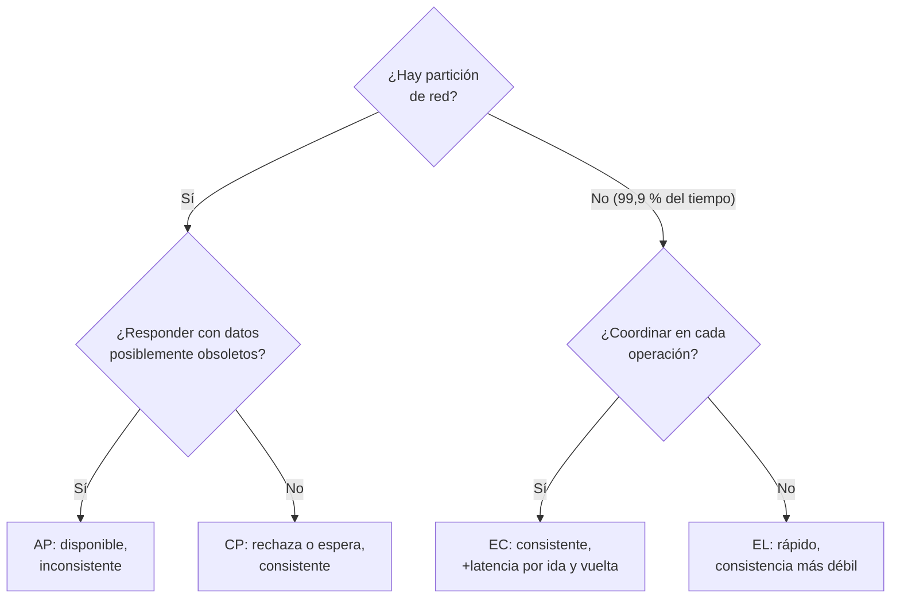

# 045 — CAP, PACELC y lo que realmente se elige

> [Programa](../../../README.md) · [Parte 09](../README.md) · [← Anterior](../../part-09-distribucion-replica-y-consistencia/044-particionado-rebalanceo-y-claves-calientes/README.md) · [Siguiente →](../../part-09-distribucion-replica-y-consistencia/046-modelos-de-consistencia-y-garantias-de-sesion/README.md)

Parte 09 — Distribución, réplica y consistencia · Avanzado ·
3 horas estimadas · motores `cassandra`, `spanner`, `postgresql` · laboratorio
[`labs/05-nosql-workloads`](../../../labs/05-nosql-workloads/README.md) · 4 fuentes.

**Conceptos centrales:** `partición de red` · `disponibilidad` · `latencia frente a consistencia`

---

## Propósito

Enunciar CAP con precisión, entender por qué su lectura popular es engañosa y usar PACELC, que describe mejor el compromiso que se toma todos los días.

## Resultados de aprendizaje

Al terminar podrás:

1. Enunciar el teorema CAP con las definiciones exactas de sus términos.
2. Explicar por qué «elegir dos de tres» es una lectura incorrecta.
3. Aplicar PACELC y situar motores reales en su clasificación.
4. Determinar qué garantías sobreviven a una partición.
5. Decidir el comportamiento de tu sistema durante una partición, por operación.

## Fundamentos

### El enunciado preciso

Gilbert y Lynch (2002) demostraron formalmente la conjetura de Brewer. Los términos tienen definiciones estrictas que casi nunca se citan:

- **C (consistencia):** *linealizabilidad*. Existe un orden total de las operaciones compatible con el tiempo real; toda lectura devuelve la última escritura confirmada.
- **A (disponibilidad):** **toda** petición a un nodo **no caído** recibe respuesta correcta, en tiempo finito.
- **P (tolerancia a particiones):** el sistema sigue funcionando aunque la red pierda arbitrariamente mensajes entre nodos.

**Teorema:** ningún sistema distribuido puede garantizar las tres simultáneamente.

### Por qué «dos de tres» está mal

La red **se particiona**. No es una opción de diseño: es un hecho del mundo. Renunciar a P significaría suponer que la red nunca falla, lo cual no es un sistema distribuido sino una apuesta.

Por tanto la elección real es binaria y **solo durante la partición**:

- **CP:** rechazar peticiones que no puedan garantizar consistencia. Se pierde disponibilidad.
- **AP:** responder con datos posiblemente obsoletos. Se pierde consistencia.

Brewer lo aclaró él mismo en 2012: el teorema se aplica en el instante de la partición y las tres propiedades son continuas, no binarias. Además, la mayor parte del tiempo **no hay partición**, y ahí CAP no dice nada. Ese vacío es lo que PACELC llena.

### PACELC

Abadi (2012):

```text
if (P) then (A or C)      -- durante una partición: disponibilidad o consistencia
else     (L or C)         -- en operación normal: latencia o consistencia
```

La segunda mitad es la que gobierna el 99,9 % del tiempo. Cada confirmación sincrónica a otra región cuesta una ida y vuelta: entre Santiago y Fráncfort, unos 200 ms. Ese costo se paga **siempre**, no solo cuando algo falla.

| Sistema | Con partición | Sin partición | Clasificación |
|---|---|---|---|
| PostgreSQL (líder único, síncrono) | C | C | PC/EC |
| PostgreSQL (líder único, asíncrono) | C en el líder | L | PC/EL |
| Cassandra (`ONE`) | A | L | PA/EL |
| Cassandra (`QUORUM`) | Configurable | C | PC/EC |
| DynamoDB (eventual) | A | L | PA/EL |
| DynamoDB (fuerte) | C | C | PC/EC |
| MongoDB (`majority`) | C | C | PC/EC |
| Spanner | C | C | PC/EC |

Dos observaciones que cambian la conversación:

1. **La clasificación es por operación, no por producto.** Cassandra es AP o CP según el nivel de consistencia de **cada** consulta.
2. **Spanner es PC/EC** y aun así ofrece alta disponibilidad, porque usa redes privadas con particiones extremadamente raras y consenso rápido (clase 047). No viola CAP: elige C y su disponibilidad práctica es alta porque P casi nunca ocurre.

### Qué sobrevive a una partición

Bailis et al. clasifican qué garantías son alcanzables **manteniendo la disponibilidad total**:

| Garantía | ¿Disponible bajo partición? |
|---|---|
| Consistencia eventual | Sí |
| Lectura de tus escrituras | Sí (con sesión fijada) |
| Lectura monótona | Sí |
| Consistencia causal | Sí |
| Aislamiento de instantánea | **No** |
| Serializabilidad | **No** |
| Linealizabilidad | **No** |

La frontera es nítida: todo lo que exige un orden total acordado necesita coordinación, y la coordinación es lo primero que una partición rompe. Todo lo demás —incluida la consistencia causal, que es bastante fuerte— se puede sostener sin coordinar.



## Ejemplo trabajado

Plataforma educativa con nodos en Santiago y Fráncfort. La red entre regiones se corta 4 minutos.

**Operación 1 — leer el catálogo de cursos.**

Datos que cambian una vez al día. Servir la versión de hace unos minutos no daña a nadie.

```text
Decisión: AP. Se sirve desde la réplica local aunque esté desconectada.
Consecuencia: un curso creado hace 3 minutos en Santiago no se ve en Fráncfort.
Aceptable: sí, y se documenta.
```

**Operación 2 — inscribir en un curso con cupo limitado.**

Si ambas regiones aceptan inscripciones sin coordinarse, el cupo se excede.

```text
Decisión: CP. Durante la partición, la región sin quórum rechaza.
Consecuencia: 4 minutos sin inscripciones en Fráncfort.
Aceptable: sí. Peor sería vender 50 plazas de un curso de 40.
```

**Operación 3 — registrar una nota.**

Escritura de un solo autor por par (estudiante, curso). No hay conflicto posible.

```text
Decisión: AP con consistencia causal. Se acepta localmente y se reconcilia después.
Consecuencia: la nota tarda en verse en la otra región.
Aceptable: sí, porque no hay dos escritores compitiendo por el mismo dato.
```

**La tabla que resulta, y que es el entregable de esta clase:**

| Operación | Con partición | Justificación | Coste declarado |
|---|---|---|---|
| Leer catálogo | A | Datos casi estáticos | Hasta 5 min de desfase |
| Inscribir con cupo | C | Recurso finito compartido | Indisponible en la minoría |
| Registrar nota | A | Un solo escritor por clave | Visibilidad diferida |
| Autenticar | A | Credenciales replicadas, cambios raros | Un cambio de contraseña puede tardar |
| Cambiar contraseña | C | Seguridad: no puede quedar la antigua | Indisponible en la minoría |

**Y el lado «else», que se paga siempre.** Sin partición, la inscripción con `QUORUM` entre regiones cuesta:

```text
ida y vuelta Santiago-Fráncfort ≈ 200 ms
inscripción con quórum global   ≈ 200 ms añadidos por operación
```

Ese es el `EC` de PACELC, y es la razón por la que casi todos los sistemas globales acaban con **datos regionales**: la inscripción se coordina solo dentro de la región del curso, no globalmente. Eso convierte una decisión de consistencia global en una local, y es el diseño que de verdad se usa.

## Comparación

| Situación | Clasificación adecuada |
|---|---|
| Sesiones y preferencias | PA/EL |
| Catálogo de productos | PA/EL |
| Inventario con reserva | PC/EC |
| Movimientos contables | PC/EC |
| Métricas y telemetría | PA/EL |
| Autenticación (lectura) | PA/EL |
| Cambio de credenciales | PC/EC |

## Errores frecuentes

1. **«Elegimos AP» como decisión de producto.** Es por operación, no por sistema.
2. **Renunciar a P.** La red se particiona; no es opcional.
3. **Usar «consistencia» de CAP y de ACID como sinónimos.** Son cosas distintas: linealizabilidad frente a restricciones de integridad.
4. **Ignorar el lado «else».** El costo de latencia se paga siempre, la partición casi nunca.
5. **Suponer que un producto tiene una clasificación fija.** Depende del nivel de consistencia elegido.
6. **Coordinar globalmente lo que podría coordinarse por región.**

## De la clase a la operación

La pregunta útil en una revisión de arquitectura no es «¿somos CP o AP?», sino «¿qué hace exactamente cada operación durante una partición, y quién decidió que eso era aceptable?». Esa tabla, escrita, vale más que cualquier etiqueta.

## Reto de transferencia

1. Enumera las operaciones críticas de tu sistema.
2. Decide para cada una A o C durante la partición, con justificación de negocio.
3. Calcula el costo de latencia del lado «else» en tu topología real.
4. Identifica una operación que hoy se coordina globalmente y podría hacerlo por región.

## Preguntas de evaluación

1. Enuncia CAP con las definiciones exactas de C, A y P.
2. ¿Por qué Spanner puede ser PC/EC y tener alta disponibilidad práctica?
3. Da una operación de tu sistema que hoy es AP sin que nadie lo haya decidido.
4. ¿Qué garantías transaccionales son inalcanzables manteniendo disponibilidad total?

---

## Laboratorio

```bash
python scripts/validate_repository.py
python labs/05-nosql-workloads/run_nosql_lab.py
```

Guarda como evidencia la salida completa, la versión del motor y la semilla o
los parámetros usados. Una captura sin comando no es evidencia: no se puede
repetir.

## Evaluación

| Criterio | Peso | Qué se comprueba |
|---|---:|---|
| Comprensión conceptual | 25 % | Explica el mecanismo, no solo el resultado |
| Ejecución reproducible | 25 % | Otra persona obtiene lo mismo con las instrucciones dadas |
| Interpretación basada en evidencia | 25 % | Cada conclusión se apoya en una salida o una medición |
| Límites y riesgos declarados | 25 % | Dice qué no demuestra el ejercicio y qué faltaría en producción |

La clase se da por superada cuando la respuesta explica el mecanismo, muestra
la salida que la respalda y declara al menos un límite del ejercicio.

## Fuentes de esta clase

Todo lo afirmado arriba procede de estas obras. Los identificadores viven en
[`catalog/sources.json`](../../../catalog/sources.json) y el estado de los
enlaces se comprueba con `python scripts/check_external_links.py`.

- **Seth Gilbert, Nancy Lynch** (2002). [Brewer's Conjecture and the Feasibility of Consistent, Available, Partition-Tolerant Web Services](https://dl.acm.org/doi/10.1145/564585.564601). ACM SIGACT News 33(2). DOI [10.1145/564585.564601](https://doi.org/10.1145/564585.564601).  
  Demostración formal del teorema CAP y de su enunciado exacto.
- **Eric Brewer** (2012). [CAP Twelve Years Later: How the Rules Have Changed](https://www.infoq.com/articles/cap-twelve-years-later-how-the-rules-have-changed/). IEEE Computer 45(2). DOI [10.1109/MC.2012.37](https://doi.org/10.1109/MC.2012.37).  
  El propio autor corrige la lectura simplista de elegir dos de tres.
- **Daniel J. Abadi** (2012). [Consistency Tradeoffs in Modern Distributed Database System Design](https://www.cs.umd.edu/~abadi/papers/abadi-pacelc.pdf). IEEE Computer 45(2). DOI [10.1109/MC.2012.33](https://doi.org/10.1109/MC.2012.33).  
  PACELC: el compromiso latencia-consistencia existe también sin particiones.
- **Peter Bailis, Aaron Davidson, Alan Fekete, Ali Ghodsi, Joseph M. Hellerstein, Ion Stoica** (2014). [Highly Available Transactions: Virtues and Limitations](https://www.vldb.org/pvldb/vol7/p181-bailis.pdf). PVLDB 7(3).  
  Qué garantías transaccionales sobreviven a una partición y cuáles no.

---

> [Programa](../../../README.md) · [Parte 09](../README.md) · [← Anterior](../../part-09-distribucion-replica-y-consistencia/044-particionado-rebalanceo-y-claves-calientes/README.md) · [Siguiente →](../../part-09-distribucion-replica-y-consistencia/046-modelos-de-consistencia-y-garantias-de-sesion/README.md)
