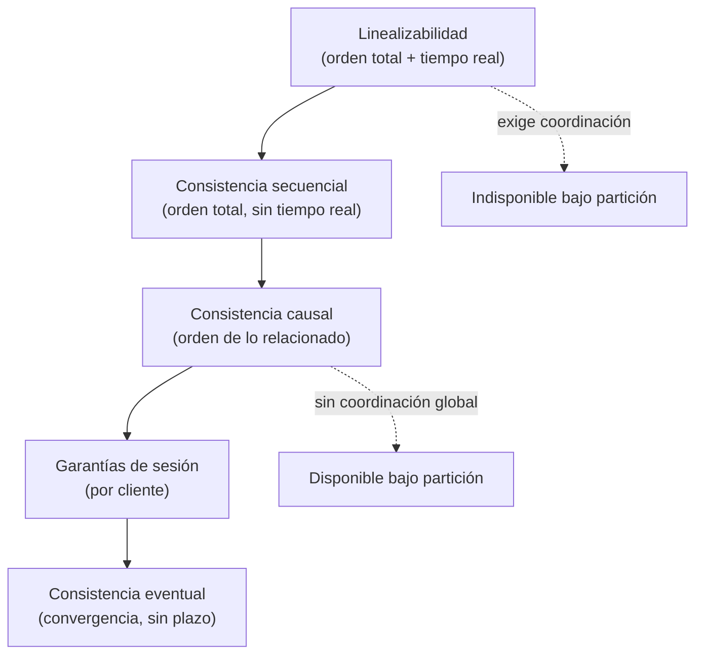

# 046 — Modelos de consistencia y garantías de sesión

> [Programa](../../../README.md) · [Parte 09](../README.md) · [← Anterior](../../part-09-distribucion-replica-y-consistencia/045-cap-pacelc-y-lo-que-realmente-se-elige/README.md) · [Siguiente →](../../part-09-distribucion-replica-y-consistencia/047-consenso-y-transacciones-distribuidas/README.md)

Parte 09 — Distribución, réplica y consistencia · Avanzado ·
3 horas estimadas · motores `cassandra`, `mongodb`, `spanner` · laboratorio
[`labs/05-nosql-workloads`](../../../labs/05-nosql-workloads/README.md) · 5 fuentes.

**Conceptos centrales:** `linealizabilidad` · `consistencia causal` · `lectura monotona` · `convergencia`

---

## Propósito

Ordenar el vocabulario de la consistencia. «Consistencia fuerte» y «eventual» son los extremos de una jerarquía con muchos escalones útiles en medio, y elegir el escalón correcto ahorra coordinación.

## Resultados de aprendizaje

Al terminar podrás:

1. Situar los modelos principales en su jerarquía de implicación.
2. Distinguir linealizabilidad de serializabilidad.
3. Aplicar las cuatro garantías de sesión.
4. Explicar la consistencia causal y cómo se implementa.
5. Reconocer para qué sirven los CRDT y cuáles son sus límites.

## Fundamentos

### La jerarquía



La línea que importa está entre **secuencial** y **causal**: por encima hace falta acuerdo global y el sistema deja de estar disponible durante una partición; por debajo, no.

### Linealizabilidad frente a serializabilidad

Se confunden constantemente y son cosas distintas:

| | Linealizabilidad | Serializabilidad |
|---|---|---|
| Ámbito | Operaciones sobre **un objeto** | **Transacciones** sobre varios objetos |
| Garantiza | Orden total compatible con el tiempo real | Equivalencia a *alguna* ejecución en serie |
| Tiempo real | **Sí**: si A termina antes de que B empiece, A va antes | **No**: el orden serie puede ser cualquiera |
| Origen | Sistemas distribuidos | Bases de datos |

La combinación de ambas se llama **estricta serializabilidad**, y es lo que ofrecen Spanner y CockroachDB. PostgreSQL en `SERIALIZABLE` sobre un nodo también la cumple de hecho, porque no hay distribución que rompa el tiempo real.

Consecuencia práctica: un sistema puede ser serializable y devolver datos «viejos». Si una transacción confirma y otra empieza después y no la ve, es serializable —existe un orden serie válido— pero no linealizable. Para un usuario que acaba de guardar algo, esa distinción es la diferencia entre un sistema correcto y uno roto.

### Las cuatro garantías de sesión

Definidas por conveniencia del cliente, no del sistema. Son baratas y resuelven casi todas las quejas de usuario:

| Garantía | Promete | Implementación típica |
|---|---|---|
| **Lectura de tus escrituras** | Ves lo que acabas de escribir | Leer del líder tras escribir, o esperar al LSN |
| **Lectura monótona** | Nunca ves datos que retroceden | Fijar la sesión a una réplica |
| **Escrituras monótonas** | Tus escrituras se aplican en tu orden | Enrutar las escrituras de la sesión al mismo nodo |
| **Lectura de tus escrituras en orden** | Lees los efectos en el orden causal | Marcas de versión propagadas |

Ninguna exige coordinación global. Todas sobreviven a una partición. Es el mejor retorno por unidad de esfuerzo en un sistema distribuido.

### Consistencia causal

Si el evento A **causó** el evento B, todo observador ve A antes que B. Los eventos no relacionados pueden verse en cualquier orden.

Se apoya en la relación «ocurre antes» de Lamport (1978) y se implementa con relojes vectoriales o marcas de versión que viajan con los datos.

```text
Ana publica una nota            (A)
Luis lee A y comenta            (B)   B depende causalmente de A
Sara publica algo sin relación  (C)   C es concurrente con A y B

Todo observador debe ver A antes que B.
Ver C antes o después es indiferente.
```

Es el modelo más fuerte que se puede sostener con disponibilidad total, y basta para casi cualquier sistema social o colaborativo. El caso que motiva su existencia es el clásico: nadie debe ver la respuesta a un mensaje que aún no ha visto.

### CRDT

Estructuras cuyo estado converge sin coordinación, porque su operación de fusión es asociativa, conmutativa e idempotente. Shapiro et al. las formalizaron.

| CRDT | Semántica | Límite |
|---|---|---|
| Contador G | Solo incrementa | No decrementa |
| Contador PN | Incrementa y decrementa | No admite cotas |
| Conjunto G | Solo añade | No elimina |
| Conjunto OR | Añade y elimina | Metadatos crecen |
| LWW-Register | Gana el de marca de tiempo mayor | **Se pierden escrituras** |
| RGA / secuencias | Texto colaborativo | Complejo, metadatos |

El límite fundamental: **un CRDT no puede hacer cumplir una invariante global**. Un contador PN converge, y no puede garantizar «nunca por debajo de cero» sin coordinación, porque dos réplicas pueden decrementar simultáneamente sin verse. Esa es exactamente la frontera de Bailis (clase 045).

`LWW-Register` merece una advertencia: es el CRDT más usado y el que silenciosamente **descarta** escrituras concurrentes. Con relojes desincronizados, la que gana puede ser la más antigua.

## Ejemplo trabajado

Foro del curso, replicado entre dos regiones con replicación asíncrona.

**Sin ninguna garantía:**

```text
t0  Ana (Santiago)  publica  "¿Alguien entiende la clase 34?"   → réplica CL
t1  Luis (Fráncfort) lee la pregunta (ya replicada) y responde   → réplica DE
t2  Sara (Fráncfort) carga el hilo → ve la respuesta de Luis
                                     pero NO la pregunta de Ana
```

Sara ve una respuesta a nada. Es una violación de causalidad, y es lo que produce la replicación asíncrona sin control de orden.

**Con consistencia causal:**

```python
# Cada publicación lleva las dependencias que su autor había visto.
publicacion = {
    "id": "p2",
    "autor": "luis",
    "texto": "Yo la entendí, mira...",
    "depende_de": ["p1"],          # Luis había visto p1 al escribir
}

def mostrar(hilo, replica):
    for p in hilo:
        # No se muestra nada cuyas causas no estén presentes.
        if not all(replica.tiene(d) for d in p["depende_de"]):
            replica.solicitar(p["depende_de"])
            continue
        mostrar_publicacion(p)
```

La réplica retrasa `p2` hasta tener `p1`. Sara nunca ve la respuesta sin la pregunta. **No hizo falta coordinación global**: solo propagar dependencias.

**Con garantías de sesión, para el otro problema:**

```text
t0  Ana publica en la réplica CL
t1  Ana recarga → se enruta a la réplica DE (aún sin replicar)
t2  Ana no ve su propia publicación
```

```python
def leer_hilo(sesion, hilo_id):
    r = replica_de(sesion)                       # lectura monótona: siempre la misma
    if r.version() < sesion.get("version_minima", 0):
        r = lider                                # lectura de tus escrituras
    return r.leer(hilo_id)

def publicar(sesion, texto):
    version = lider.publicar(texto)
    sesion["version_minima"] = version
```

Dos garantías, unas pocas líneas, ninguna coordinación global.

**Contraste con un caso donde hace falta coordinación.** «El foro se cierra al llegar a 1 000 mensajes»: es una invariante global sobre un contador con cota. Ningún CRDT ni garantía de sesión la sostiene. Requiere consenso (clase 047) o aceptar que se pase de 1 000 y compensar después.

**Tabla de decisión resultante:**

| Operación del foro | Modelo suficiente |
|---|---|
| Publicar y leer mensajes | Causal + sesión |
| Contar mensajes para mostrar | Eventual (aproximado) |
| Cerrar el hilo al llegar al límite | Linealizable |
| Editar el propio mensaje | Sesión (escrituras monótonas) |
| Edición colaborativa a varias manos | CRDT de secuencia |

## Comparación

| Modelo | Coordinación | Disponible bajo partición | Coste |
|---|---|---|---|
| Linealizable | Global, por operación | No | Alto |
| Secuencial | Global | No | Alto |
| Causal | Solo dependencias | **Sí** | Medio (metadatos) |
| Sesión | Ninguna | **Sí** | Bajo |
| Eventual | Ninguna | **Sí** | Mínimo |

## Errores frecuentes

1. **Confundir linealizabilidad con serializabilidad.** Distinto ámbito y distinta promesa.
2. **Pedir consistencia fuerte por defecto.** Se paga latencia en cada operación (el «else» de PACELC).
3. **Aceptar consistencia eventual sin garantías de sesión.** Produce quejas de usuario evitables con poco esfuerzo.
4. **Creer que los CRDT resuelven las invariantes.** Convergen; no restringen.
5. **`LWW-Register` con relojes desincronizados.** Descarta escrituras válidas.
6. **No decir cuánto dura «eventualmente».** Sin un plazo medido, no es una garantía operativa.

## De la clase a la operación

Casi todas las quejas de «datos que aparecen y desaparecen» se resuelven con lectura de tus escrituras y lectura monótona, sin tocar el modelo de consistencia del almacén. Es la primera intervención que hay que probar.

## Reto de transferencia

1. Clasifica cinco operaciones de tu sistema en la jerarquía de modelos.
2. Implementa lectura de tus escrituras y lectura monótona en una de ellas.
3. Reproduce una violación de causalidad y corrígela propagando dependencias.
4. Identifica una invariante que ningún CRDT puede sostener y di cómo la resolverías.

## Preguntas de evaluación

1. Da un sistema serializable que no sea linealizable, con una traza.
2. ¿Por qué la consistencia causal sobrevive a una partición y la secuencial no?
3. Explica qué escrituras pierde un `LWW-Register` y en qué condiciones.
4. Elige el modelo mínimo suficiente para tres operaciones tuyas y justifica cada elección.

---

## Laboratorio

```bash
python scripts/validate_repository.py
python labs/05-nosql-workloads/run_nosql_lab.py
```

Guarda como evidencia la salida completa, la versión del motor y la semilla o
los parámetros usados. Una captura sin comando no es evidencia: no se puede
repetir.

## Evaluación

| Criterio | Peso | Qué se comprueba |
|---|---:|---|
| Comprensión conceptual | 25 % | Explica el mecanismo, no solo el resultado |
| Ejecución reproducible | 25 % | Otra persona obtiene lo mismo con las instrucciones dadas |
| Interpretación basada en evidencia | 25 % | Cada conclusión se apoya en una salida o una medición |
| Límites y riesgos declarados | 25 % | Dice qué no demuestra el ejercicio y qué faltaría en producción |

La clase se da por superada cuando la respuesta explica el mecanismo, muestra
la salida que la respalda y declara al menos un límite del ejercicio.

## Fuentes de esta clase

Todo lo afirmado arriba procede de estas obras. Los identificadores viven en
[`catalog/sources.json`](../../../catalog/sources.json) y el estado de los
enlaces se comprueba con `python scripts/check_external_links.py`.

- **Kyle Kingsbury** (2026). [Jepsen: Consistency Models](https://jepsen.io/consistency).  
  Mapa de modelos de consistencia y sus relaciones de implicación.
- **Kyle Kingsbury** (2026). [Jepsen: Analyses](https://jepsen.io/analyses).  
  Informes que verifican empiricamente las garantías que cada motor afirma.
- **Werner Vogels** (2009). [Eventually Consistent](https://dl.acm.org/doi/10.1145/1435417.1435432). Communications of the ACM 52(1). DOI [10.1145/1435417.1435432](https://doi.org/10.1145/1435417.1435432).  
  Definición operativa de consistencia eventual y de sus variantes de sesión.
- **Leslie Lamport** (1978). [Time, Clocks, and the Ordering of Events in a Distributed System](https://dl.acm.org/doi/10.1145/359545.359563). Communications of the ACM 21(7). DOI [10.1145/359545.359563](https://doi.org/10.1145/359545.359563).  
  Orden causal y relojes logicos: base de la consistencia distribuida.
- **Marc Shapiro, Nuno Preguica, Carlos Baquero, Marek Zawirski** (2011). [Conflict-free Replicated Data Types](https://inria.hal.science/inria-00609399/document). SSS.  
  Estructuras que convergen sin coordinación: alternativa al bloqueo distribuido.

---

> [Programa](../../../README.md) · [Parte 09](../README.md) · [← Anterior](../../part-09-distribucion-replica-y-consistencia/045-cap-pacelc-y-lo-que-realmente-se-elige/README.md) · [Siguiente →](../../part-09-distribucion-replica-y-consistencia/047-consenso-y-transacciones-distribuidas/README.md)
