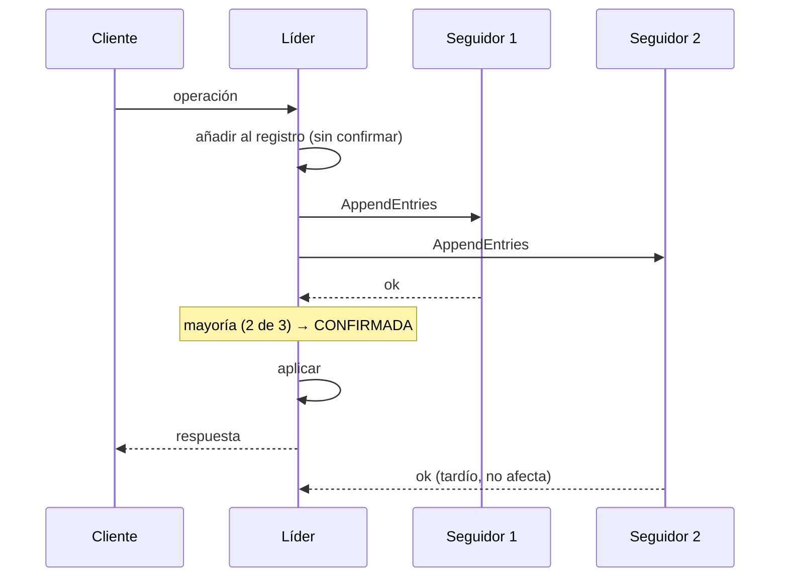

# 047 — Consenso y transacciones distribuidas: Raft, 2PC y sagas

> [Programa](../../../README.md) · [Parte 09](../README.md) · [← Anterior](../../part-09-distribucion-replica-y-consistencia/046-modelos-de-consistencia-y-garantias-de-sesion/README.md) · [Siguiente →](../../part-10-operacion-seguridad-y-gobierno/048-respaldo-y-restauracion-probada/README.md)

| | |
|---|---|
| **Parte** | 09 — Distribución, réplica y consistencia |
| **Nivel** | Avanzado |
| **Horas estimadas** | 4 |
| **Motores** | `spanner`, `cockroachdb`, `postgresql` |
| **Laboratorio** | [`labs/03-transactions`](../../../labs/03-transactions/README.md) |
| **Fuentes** | 4 |

**Conceptos centrales:** `consenso` · `elección de líder` · `commit en dos fases` · `saga` · `compensación`

---

## Propósito

Coordinar varios nodos cuando hace falta acuerdo: consenso para elegir líder y ordenar operaciones, y las tres formas de que una operación abarque varios sistemas.

## Resultados de aprendizaje

Al terminar podrás:

1. Explicar qué problema resuelve el consenso y por qué necesita mayoría.
2. Describir Raft: elección de líder, replicación del registro y confirmación.
3. Identificar el fallo del commit en dos fases y por qué bloquea.
4. Diseñar una saga con sus compensaciones.
5. Elegir entre 2PC, saga y bandeja de salida transaccional.

## Fundamentos

### El problema del consenso

Varios nodos deben ponerse de acuerdo en un valor, tolerando caídas y mensajes perdidos. Es el problema que subyace a: elegir líder, decidir si una transacción confirma, ordenar un registro replicado.

**Por qué mayoría.** Con `2f + 1` nodos se toleran `f` caídas, porque dos mayorías cualesquiera se solapan en al menos un nodo, y ese nodo impide que se tomen dos decisiones contradictorias. Con 5 nodos se toleran 2. Un número par no aporta: 4 nodos toleran 1, igual que 3, y tienen más coordinación.

Lamport resolvió el problema con Paxos (1998); Ongaro y Ousterhout diseñaron Raft (2014) buscando explícitamente que fuese comprensible, y por eso es el que implementan etcd, Consul, CockroachDB y TiKV.

### Raft en tres piezas

**1. Elección de líder.** Cada nodo tiene un temporizador aleatorio. Al agotarse sin recibir señal del líder, se declara candidato del mandato `t+1` y pide votos. Con mayoría, es líder. La aleatoriedad de los temporizadores es lo que evita elecciones empatadas indefinidamente.

**2. Replicación del registro.** El líder recibe las operaciones, las añade a su registro y las envía a los seguidores. Una entrada se **confirma** cuando la mayoría la ha escrito. Solo entonces se aplica y se responde al cliente.

**3. Seguridad.** Un candidato solo obtiene votos si su registro está **al menos tan actualizado** como el del votante. Esa regla garantiza que un líder nuevo contiene todas las entradas confirmadas: nada confirmado se pierde jamás.



Costo: **una ida y vuelta a la mayoría por operación**. En un centro de datos, ~1 ms; entre regiones, cientos.

### Commit en dos fases

```text
Fase 1 (preparar):  el coordinador pregunta a cada participante "¿puedes confirmar?"
                    cada uno responde SÍ o NO, y si dice SÍ queda OBLIGADO
Fase 2 (confirmar): si todos dijeron SÍ, el coordinador ordena confirmar; si no, abortar
```

**El fallo.** Si el coordinador cae después de que todos digan SÍ y antes de enviar la decisión, los participantes quedan **en duda**: no pueden confirmar (quizá alguien dijo NO) ni abortar (quizá todos dijeron SÍ). Mantienen sus bloqueos indefinidamente.

Por eso 2PC se llama protocolo **bloqueante**. La corrección es un coordinador replicado por consenso —y entonces cada transacción cuesta consenso más dos rondas—. Es lo que hace Spanner, con la ventaja de una red controlada y relojes acotados por TrueTime.

Helland argumenta que a escala esto no se sostiene, y propone el enfoque alternativo.

### Sagas

Descomponer la operación en pasos locales atómicos, cada uno con su **compensación**:

```text
T1 → T2 → T3 → T4
      ↓ falla T3
C2 ← C1                    (compensaciones en orden inverso)
```

Propiedades que hay que asumir explícitamente:

- **No hay aislamiento.** Los estados intermedios son visibles. Otro proceso puede ver el pedido creado y el pago aún no cobrado.
- **Las compensaciones son semánticas, no técnicas.** No se «deshace» un correo enviado: se envía uno de disculpa. No se deshace un cobro: se emite un reembolso.
- **Todo paso y toda compensación debe ser idempotente** (clase 037), porque se reintentan.

### Bandeja de salida transaccional

El problema más común no es una transacción entre dos bases: es «escribir en la base **y** publicar un evento» de forma atómica.

```sql
BEGIN;
INSERT INTO enrollments (...) VALUES (...);
INSERT INTO outbox (tipo, carga, creado_en)
       VALUES ('inscripcion.creada', '{"student_id":11,...}', now());
COMMIT;
-- Un proceso aparte lee outbox y publica. Si falla, reintenta.
```

Una sola transacción local garantiza que el evento existe si y solo si la inscripción existe. La publicación es al-menos-una-vez, y el consumidor debe ser idempotente. Resuelve el problema real sin ninguna transacción distribuida, y por eso es la primera opción a considerar.

## Ejemplo trabajado

Inscripción que debe: reservar cupo (servicio de cursos), cobrar (servicio de pagos) y emitir credencial (servicio de identidad).

**Opción A — 2PC:**

```text
coordinador → prepare → cursos, pagos, identidad
todos SÍ → commit
```

Problemas concretos:

- El servicio de pagos es una pasarela externa: **no ofrece `prepare`**. 2PC es inaplicable desde el principio.
- Los tres servicios mantienen bloqueos durante toda la operación, incluida la latencia de la pasarela (segundos).
- Si el coordinador cae, tres servicios quedan bloqueados.

**Opción B — saga:**

```python
PASOS = [
    ("reservar_cupo",     reservar_cupo,     liberar_cupo),
    ("cobrar",            cobrar,            reembolsar),
    ("emitir_credencial", emitir_credencial, revocar_credencial),
]

def ejecutar_saga(saga_id, ctx):
    hechos = []
    for nombre, accion, compensacion in PASOS:
        try:
            # La clave de idempotencia deriva de la saga y del paso:
            # un reintento repite exactamente la misma clave.
            accion(ctx, clave_idem=f"{saga_id}:{nombre}")
            hechos.append((nombre, compensacion))
        except ErrorPermanente:
            for nombre_h, comp in reversed(hechos):
                comp(ctx, clave_idem=f"{saga_id}:comp:{nombre_h}")
            raise SagaAbortada(nombre)
    return "ok"
```

**Traza de un fallo en el cobro:**

```text
t0  reservar_cupo    → ok (cupo 39/40)
t1  cobrar           → tarjeta rechazada (ErrorPermanente)
t2  liberar_cupo     → ok (cupo 40/40)
resultado: saga abortada, estado coherente
```

**La falta de aislamiento, hecha visible:**

```text
t0    reservar_cupo → cupo 39/40
t0+1s otro usuario consulta → ve 39 plazas libres, no 40
t1    cobro falla
t2    liberar_cupo → cupo 40/40
```

Durante ~1 segundo el sistema mostró un cupo que no estaba realmente comprometido. **Es inherente a la saga y hay que decidir si es aceptable.** Aquí sí lo es: como mucho, alguien vio una plaza menos de las disponibles, lo que es conservador. Si el error fuese al revés —mostrar plazas que no existen— no sería aceptable.

**Opción C — bandeja de salida + coreografía**, la que suele resultar mejor:

```text
inscripciones: BEGIN; INSERT enrollment; INSERT outbox('inscripcion.creada'); COMMIT
pagos:         consume 'inscripcion.creada' → cobra → publica 'pago.ok' o 'pago.fallido'
inscripciones: consume 'pago.fallido'      → marca la inscripción como anulada
identidad:     consume 'pago.ok'           → emite credencial
```

Ningún coordinador, ninguna transacción distribuida, cada paso atómico en su propia base. A cambio: la coreografía es más difícil de seguir que la orquestación, y hace falta trazabilidad para saber dónde se detuvo una inscripción.

## Comparación

| Mecanismo | Atomicidad | Aislamiento | Bloqueante | Cuándo |
|---|---|---|---|---|
| Transacción local | Total | Total | No | Una sola base: **siempre que se pueda** |
| Bandeja de salida | Total en el origen | Del origen | No | Base + evento |
| 2PC | Total | Total | **Sí** | Pocos participantes, todos con `prepare`, red controlada |
| 2PC sobre consenso | Total | Total | No | Spanner, CockroachDB |
| Saga (orquestada) | Eventual | **Ninguno** | No | Servicios heterogéneos, pasos largos |
| Saga (coreografiada) | Eventual | Ninguno | No | Muchos servicios, bajo acoplamiento |

## Errores frecuentes

1. **2PC entre microservicios por red pública.** Bloqueo garantizado ante fallo del coordinador.
2. **Sagas sin compensación para algún paso.** Un fallo posterior deja el sistema inconsistente sin remedio.
3. **Compensaciones no idempotentes.** Un reintento reembolsa dos veces.
4. **Ignorar la falta de aislamiento de las sagas.** Los estados intermedios se ven y a veces se actúa sobre ellos.
5. **Publicar el evento antes del `COMMIT`.** Si la transacción se revierte, el evento ya salió.
6. **Número par de nodos en consenso.** Más coordinación, misma tolerancia.

## De la clase a la operación

La mayoría de las «transacciones distribuidas» que se plantean en un diseño desaparecen al reunir los datos que deben cambiar juntos en una misma base (clase 024). Antes de coordinar, conviene comprobar si la frontera del agregado está mal trazada.

## Reto de transferencia

1. Identifica una operación de tu sistema que abarque dos almacenes.
2. Diséñala como saga con compensaciones idempotentes.
3. Implementa la bandeja de salida y demuestra la atomicidad entre estado y evento.
4. Documenta qué estado intermedio queda visible y por cuánto tiempo.

## Preguntas de evaluación

1. ¿Por qué el consenso necesita mayoría estricta y no basta la mitad?
2. Traza el fallo del coordinador en 2PC y explica por qué los participantes no pueden decidir.
3. Da un paso de tu sistema cuya compensación no sea una simple inversión.
4. ¿Qué garantiza la bandeja de salida y qué obligación traslada al consumidor?

---

## Laboratorio

```bash
python scripts/validate_repository.py
python labs/03-transactions/run_lab.py
```

Guarda como evidencia la salida completa, la versión del motor y la semilla o
los parámetros usados. Una captura sin comando no es evidencia: no se puede
repetir.

## Evaluación

| Criterio | Peso | Qué se comprueba |
|---|---:|---|
| Comprensión conceptual | 25 % | Explica el mecanismo, no solo el resultado |
| Ejecución reproducible | 25 % | Otra persona obtiene lo mismo con las instrucciones dadas |
| Interpretación basada en evidencia | 25 % | Cada conclusión se apoya en una salida o una medición |
| Límites y riesgos declarados | 25 % | Dice qué no demuestra el ejercicio y qué faltaría en producción |

La clase se da por superada cuando la respuesta explica el mecanismo, muestra
la salida que la respalda y declara al menos un límite del ejercicio.

## Fuentes de esta clase

Todo lo afirmado arriba procede de estas obras. Los identificadores viven en
[`catalog/sources.json`](../../../catalog/sources.json) y el estado de los
enlaces se comprueba con `python scripts/check_external_links.py`.

- **Diego Ongaro, John Ousterhout** (2014). [In Search of an Understandable Consensus Algorithm](https://raft.github.io/raft.pdf). USENIX ATC.  
  Raft: consenso equivalente a Paxos con elección de líder explicita.
- **Leslie Lamport** (1998). [The Part-Time Parliament](https://dl.acm.org/doi/10.1145/279227.279229). ACM TOCS 16(2). DOI [10.1145/279227.279229](https://doi.org/10.1145/279227.279229).  
  Paxos, el primer algoritmo de consenso práctico demostrado correcto.
- **Pat Helland** (2007). [Life beyond Distributed Transactions: An Apostate's Opinion](https://www.cidrdb.org/cidr2007/papers/cidr07p15.pdf). CIDR.  
  Entidades, actividades y por qué las transacciones distribuidas no escalan.
- **James C. Corbett, Jeffrey Dean, Michael Epstein** (2012). [Spanner: Google's Globally-Distributed Database](https://research.google/pubs/spanner-googles-globally-distributed-database-2/). USENIX OSDI.  
  Serializabilidad global usando incertidumbre de reloj acotada (TrueTime).

---

> [Programa](../../../README.md) · [Parte 09](../README.md) · [← Anterior](../../part-09-distribucion-replica-y-consistencia/046-modelos-de-consistencia-y-garantias-de-sesion/README.md) · [Siguiente →](../../part-10-operacion-seguridad-y-gobierno/048-respaldo-y-restauracion-probada/README.md)
