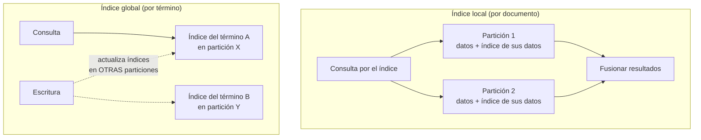

# 054 — Particionado, rebalanceo y claves calientes

> [Programa](../../../README.md) · [Parte 10](../README.md) · [← Anterior](../../part-10-distribucion-replica-y-consistencia/053-replica-lider-unico-multilider-y-sin-lider/README.md) · [Siguiente →](../../part-10-distribucion-replica-y-consistencia/055-cap-pacelc-y-lo-que-realmente-se-elige/README.md)

Parte 10 — Distribución, réplica y consistencia · Avanzado ·
3 horas estimadas · motores `cassandra`, `mongodb`, `postgresql` · laboratorio
[`labs/05-nosql-workloads`](../../../labs/05-nosql-workloads/README.md) · 3 fuentes.

**Conceptos centrales:** `hash consistente` · `partición por rango` · `punto caliente` · `reequilibrio`

**En este caso se comparan 8 motores**: 6 lo resuelven (5 con el resultado comprobado por máquina) y 2 no, con el motivo escrito.

---

## Propósito

Repartir los datos entre nodos para escalar la escritura, evitando los dos fallos que hacen inútil el reparto: las particiones calientes y el rebalanceo que mueve todo.

## Resultados de aprendizaje

Al terminar podrás:

1. Comparar particionado por rango y por hash, con sus consultas favorecidas.
2. Explicar el hash consistente y por qué reduce el movimiento de datos.
3. Detectar y mitigar una clave caliente.
4. Diseñar índices secundarios en un sistema particionado.
5. Estimar el costo de un rebalanceo.

## Fundamentos

### Por qué particionar

La replicación (clase 043) escala **lecturas**. Para escalar **escrituras** o superar la capacidad de un nodo, hay que repartir los datos: cada partición vive en un nodo y recibe solo su parte del tráfico.

Es un cambio cualitativo: se pierden las reuniones baratas, las transacciones que abarcan varias particiones y los índices secundarios globales gratuitos.

### Rango frente a hash

| | Por rango | Por hash |
|---|---|---|
| Asignación | `[a-f] → n1`, `[g-m] → n2` | `hash(clave) mod N` |
| Consultas de rango | **Eficientes** (particiones contiguas) | Preguntan a todos los nodos |
| Reparto de carga | Desigual si la distribución lo es | Uniforme |
| Punto caliente temporal | **Sí**: si la clave es el tiempo, todo va al último | No |
| Ejemplo | HBase, particiones de PostgreSQL | Cassandra, DynamoDB |

El punto caliente temporal del particionado por rango es el error clásico: usar la marca de tiempo como clave de partición envía **todas** las escrituras al nodo del rango actual, mientras el resto está ocioso.

**Solución híbrida**, la más usada: `(entidad, ventana_temporal)` como clave compuesta. El hash sobre la entidad reparte, y la ventana acota el tamaño (clase 029).

### Hash consistente

Con `hash(clave) mod N`, cambiar `N` reubica casi todo:

```text
N=4 → N=5:  se mueven aproximadamente 4/5 = 80 % de las claves
```

El hash consistente coloca nodos y claves en un anillo; cada clave va al primer nodo en sentido horario. Al añadir un nodo, solo se mueven las claves de su segmento:

```text
N=4 → N=5:  se mueve aproximadamente 1/5 = 20 %
```

Con nodos virtuales (cada nodo físico ocupa 128–256 posiciones del anillo) el reparto es más uniforme y el rebalanceo se distribuye entre todos los nodos existentes en vez de castigar a uno.

Alternativa más simple y muy usada: **particiones fijas**. Se crean 1 024 particiones desde el principio y se asignan a los nodos; añadir un nodo solo reasigna particiones enteras, sin recalcular hashes. Es lo que hacen Riak y Elasticsearch.

### Claves calientes

Una clave con tráfico desproporcionado satura su nodo por mucho que se reparta el resto. Ningún esquema de particionado lo resuelve, porque la clave es indivisible.

| Mitigación | Cómo | Costo |
|---|---|---|
| **Salado** | Añadir un sufijo aleatorio: `curso-bd#0`…`#15` | Leer exige consultar las 16 |
| **Caché delante** | Redis absorbe las lecturas | Coherencia (clase 027) |
| **Réplica dedicada** | Más réplicas para esa clave | Operación específica |
| **Agregación local** | Acumular en el cliente y volcar por lotes | Retraso, pérdida ante caída |

El salado es la técnica canónica y hay que dimensionarla: con 16 sufijos, la escritura se reparte entre 16 particiones y **cada lectura hace 16 consultas**. Se aplica solo a las claves realmente calientes, no a todas.

### Índices secundarios



| | Local | Global |
|---|---|---|
| Escritura | Solo la partición propia | Varias particiones |
| Lectura por el índice | **Todas** las particiones (dispersar y reunir) | Una |
| Consistencia | Trivial | Asíncrona en la práctica |
| Ejemplos | Cassandra, Elasticsearch | DynamoDB GSI |

El compromiso es limpio: el índice local carga la lectura, el global carga la escritura. Con muchas particiones, la dispersión del índice local se vuelve cara porque la latencia es la del nodo más lento (Dean y Barroso, clase 052).

## Ejemplo trabajado

Sistema de eventos: 200 000 escrituras/s, 500 nodos posibles, consultas por `sensor_id` y por rango temporal.

**Diseño 1 — partición por `ocurrido_en`:**

```text
Todas las escrituras del momento presente van a la MISMA partición.
Nodo activo: 1 de 500. Caudal máximo: el de un nodo (~10 000/s).
Resultado: el clúster de 500 nodos rinde como uno.
```

Fallo total. Es el punto caliente temporal.

**Diseño 2 — partición por `hash(sensor_id)`:**

```text
100 000 sensores → reparto uniforme
Escritura:            200 000/s repartidas entre 500 nodos = 400/s por nodo
Consulta por sensor:  1 partición
Consulta por rango temporal global: 500 particiones (dispersar y reunir)
```

Correcto para escritura y para la consulta por sensor. La consulta temporal global es cara, pero es rara.

**Diseño 3 — partición por `(hash(sensor_id), dia)`:**

Añade la cota de tamaño de partición (clase 030) sin perder el reparto.

```text
tamaño de partición = 86 400 mediciones · 100 B ≈ 8,6 MB   ✔
consulta de 7 días para un sensor = 7 particiones, en paralelo
```

**Ahora la clave caliente.** Un sensor emite 20 000 mediciones/s, 100 veces más que el resto:

```text
sin salado:  su partición recibe 20 000/s → satura un nodo
con salado de 16:
   escritura: (hash(sensor_id + '#' + aleatorio(0,15)), dia) → 1 250/s por partición
   lectura:   16 consultas en paralelo, fusionadas por el cliente
```

Aplicado **solo** a los sensores identificados como calientes, mediante una lista consultada por el productor. Salar los 100 000 sensores multiplicaría por 16 el costo de todas las lecturas para resolver un problema de uno.

**Costo del rebalanceo.** De 500 a 600 nodos, con 40 TB:

| Esquema | Datos movidos |
|---|---:|
| `hash mod N` | ~33 TB |
| Hash consistente con nodos virtuales | ~6,7 TB |
| 4 096 particiones fijas | ~6,7 TB, en unidades enteras |

A 1 Gb/s por nodo y limitando el rebalanceo al 20 % del ancho de banda para no degradar el servicio:

```text
6,7 TB / (500 nodos · 25 MB/s) ≈ 9 minutos
33  TB / (500 nodos · 25 MB/s) ≈ 44 minutos con degradación notable
```

El rebalanceo debe ser **gradual y limitado**: uno automático y sin límite ante un fallo transitorio puede convertir la caída de un nodo en la caída del clúster, al saturar la red justo cuando hay menos capacidad.

## Comparación

| Necesidad | Esquema |
|---|---|
| Consultas de rango frecuentes | Rango, con vigilancia del punto caliente |
| Escritura uniforme | Hash |
| Series temporales por entidad | Hash de entidad + cubo temporal |
| Añadir nodos sin gran movimiento | Hash consistente o particiones fijas |
| Consulta por atributo no clave | Índice global si domina la lectura; local si domina la escritura |

## Errores frecuentes

1. **Marca de tiempo como clave de partición.** Concentra toda la escritura en un nodo.
2. **`hash mod N`.** Cualquier cambio de tamaño mueve casi todo.
3. **Salar todas las claves.** Encarece todas las lecturas por un problema puntual.
4. **Rebalanceo automático sin límite de ancho de banda.** Amplifica los fallos.
5. **Suponer transacciones entre particiones.** Exigen coordinación (clase 047).
6. **Particiones sin cota de tamaño.** El problema reaparece dentro de cada nodo.

## De la clase a la operación

La decisión de particionar es difícil de revertir: cambiar la clave de partición con datos en producción es reescribir el conjunto completo. Conviene retrasarla mientras un solo nodo baste, y cuando llegue, elegirla con las consultas y el reparto de tráfico medidos, no supuestos.

## Reto de transferencia

1. Mide el reparto real de tráfico por clave en tu sistema e identifica el percentil 99.
2. Elige clave de partición y justifica el esquema con las consultas reales.
3. Calcula el tamaño máximo de partición y el cubo necesario.
4. Estima el volumen y el tiempo de un rebalanceo al añadir un 20 % de nodos.

## Preguntas de evaluación

1. ¿Por qué particionar por tiempo destruye la ventaja de un clúster grande?
2. Calcula el porcentaje de claves movidas al pasar de 8 a 9 nodos con `mod N` y con hash consistente.
3. Da una clave caliente de tu dominio y dimensiona su salado con lectura y escritura.
4. ¿Cuándo preferirías índice secundario global sobre local, con cifras?

---

## 🌐 El mismo problema en cada motor

**Caso:** Ocho pedidos en una partición y uno en cada una de las otras dos

Repartir datos entre nodos parece un problema de aritmética y es un problema
de **elegir la clave**. El caso tiene diez pedidos de tres clientes, y uno
de ellos concentra ocho: la distribución normal de cualquier negocio real.

Si la clave de partición es el cliente, ese reparto **es** el reparto entre
nodos: una partición con ocho y dos con uno. Añadir nodos no arregla nada,
porque una clave no se puede partir; eso es una **clave caliente**. Si la
clave fuera el identificador del pedido, el reparto sería casi perfecto… a
cambio de que «todos los pedidos del cliente A» pase a ser una consulta a
todos los nodos.

No hay opción buena: hay una decisión, y esta consulta la hace visible antes
de tomarla.

Salida esperada, idéntica en todos los motores que lo resuelven:

| particion | pedidos |
|---|---|
| `A` | `8` |
| `B` | `1` |
| `C` | `1` |

El contrato vive en [`motores.yaml`](motores.yaml) y lo comprueba
`python scripts/verificar_equivalencia.py --clase 054`: 5 de
las 6 implementaciones se ejecutan de verdad y su
resultado se compara con esa tabla; el resto se declara como material revisado,
no ejecutado.

| Motor | ¿Resuelve el caso? | Nivel de prueba | Código | Fuente |
|---|---|---|---|---|
| Apache Cassandra | sí | declarado | [código](implementaciones/cassandra/consulta.cql) | [doc oficial](https://cassandra.apache.org/doc/latest/cassandra/developing/data-modeling/data-modeling_logical.html) |
| MongoDB | sí | servicio | [código](implementaciones/mongodb/consulta.js) | [doc oficial](https://www.mongodb.com/docs/manual/core/sharding-shard-key/) |
| PostgreSQL | sí | servicio | [código](implementaciones/postgresql/consulta.sql) | [doc oficial](https://www.postgresql.org/docs/current/ddl-partitioning.html) |
| SQLite | sí | núcleo | [código](implementaciones/sqlite/consulta.sql) | [doc oficial](https://sqlite.org/lang_select.html) |
| DuckDB | sí | núcleo | [código](implementaciones/duckdb/consulta.sql) | [doc oficial](https://duckdb.org/docs/stable/data/partitioning/partitioned_writes.html) |
| Redis | sí | servicio | [código](implementaciones/redis/consulta.txt) | [doc oficial](https://redis.io/docs/latest/operate/oss_and_stack/reference/cluster-spec/) |
| Amazon DynamoDB | **no** | — | — | [doc oficial](https://docs.aws.amazon.com/amazondynamodb/latest/developerguide/bp-partition-key-design.html) |
| Microsoft SQL Server | **no** | — | — | [doc oficial](https://learn.microsoft.com/sql/relational-databases/partitions/partitioned-tables-and-indexes) |

### Los que resuelven el caso

#### Apache Cassandra · [`implementaciones/cassandra/consulta.cql`](implementaciones/cassandra/consulta.cql)

⚪ **declarado** — se revisa a mano contra la documentación citada; la máquina no lo ejecuta

```sql
-- motor: cassandra
-- doc: https://cassandra.apache.org/doc/latest/cassandra/developing/data-modeling/data-modeling_logical.html
-- nota: implementacion declarada. Aqui el reparto NO es una consulta: es la
--       clave primaria. `cliente` como clave de particion significa que los
--       ocho pedidos de A viven en el mismo nodo, y que anadir nodos no reparte
--       ese trabajo: una clave no se puede partir.
--
--       La correccion documentada es anadir un componente a la clave de
--       particion —el mes, un cubo numerico— y aceptar que las consultas
--       tendran que recorrerlos:
--         PRIMARY KEY ((cliente, mes), id)
--       Cambiarlo despues obliga a reescribir los datos.

-- === preparacion ===
CREATE KEYSPACE IF NOT EXISTS ventas
  WITH replication = {'class': 'SimpleStrategy', 'replication_factor': 1};

DROP TABLE IF EXISTS ventas.pedidos_por_cliente;

CREATE TABLE ventas.pedidos_por_cliente (
    cliente text,
    id      int,
    PRIMARY KEY (cliente, id)
);

INSERT INTO ventas.pedidos_por_cliente (cliente, id) VALUES ('A', 1);
INSERT INTO ventas.pedidos_por_cliente (cliente, id) VALUES ('A', 2);
INSERT INTO ventas.pedidos_por_cliente (cliente, id) VALUES ('B', 9);
INSERT INTO ventas.pedidos_por_cliente (cliente, id) VALUES ('C', 10);

-- === consulta ===
-- El token es lo que decide el nodo. Esta consulta muestra el reparto real:
SELECT cliente, token(cliente) AS token, COUNT(*) AS pedidos
FROM ventas.pedidos_por_cliente
GROUP BY cliente;

-- Y la herramienta que delata las particiones grandes desde fuera:
--   nodetool tablehistograms ventas.pedidos_por_cliente
```

- **Por qué sí:** El reparto es explícito y está en la clave primaria: la clave de partición se convierte en un token y el token decide el nodo. Añadir nodos redistribuye tokens sin parar el servicio, con hashing consistente y nodos virtuales.
- **Por qué no:** Una partición desequilibrada es un problema estructural: la documentación recomienda no pasar de 100 MB por partición, y una clave caliente lo supera sin remedio. La corrección —añadir un componente a la clave de partición, como el mes— obliga a reescribir los datos.
- 📄 Documentación oficial: <https://cassandra.apache.org/doc/latest/cassandra/developing/data-modeling/data-modeling_logical.html>

#### MongoDB · [`implementaciones/mongodb/consulta.js`](implementaciones/mongodb/consulta.js)

✅ **verificado** — se ejecuta contra el motor real levantado con `docker compose`

```javascript
// motor: mongodb
// doc: https://www.mongodb.com/docs/manual/core/sharding-shard-key/
// nota: en un cluster fragmentado, esta misma agregacion sobre la coleccion
//       config.chunks dice cuantos trozos tiene cada fragmento. Y la trampa que
//       no se ve aqui: una clave MONOTONA —una fecha, un contador— manda todas
//       las escrituras al mismo fragmento, aunque el reparto de datos parezca
//       equilibrado.

// === preparacion ===
db.pedidos.drop();
db.pedidos.insertMany([
  { _id: 1, cliente: "A" }, { _id: 2, cliente: "A" }, { _id: 3, cliente: "A" },
  { _id: 4, cliente: "A" }, { _id: 5, cliente: "A" }, { _id: 6, cliente: "A" },
  { _id: 7, cliente: "A" }, { _id: 8, cliente: "A" }, { _id: 9, cliente: "B" },
  { _id: 10, cliente: "C" },
]);

// === consulta ===
db.pedidos
  .aggregate([
    { $group: { _id: "$cliente", pedidos: { $sum: 1 } } },
    { $sort: { pedidos: -1, _id: 1 } },
  ])
  .forEach((d) => print(d._id + "|" + d.pedidos));
```

- **Por qué sí:** El fragmentado es transparente para la aplicación: el enrutador dirige la consulta al fragmento correcto y el balanceador mueve trozos entre fragmentos sin intervención. Y desde la versión 5.0 la clave de fragmentación se puede **cambiar** en caliente, algo que casi ningún motor permite.
- **Por qué no:** Una clave monótona —una fecha, un contador— manda **todas** las escrituras al mismo fragmento; el fragmentado por hash lo evita pero elimina las consultas por rango. Es exactamente la misma disyuntiva del caso, con otros nombres.
- 📄 Documentación oficial: <https://www.mongodb.com/docs/manual/core/sharding-shard-key/>

#### PostgreSQL · [`implementaciones/postgresql/consulta.sql`](implementaciones/postgresql/consulta.sql)

✅ **verificado** — se ejecuta contra el motor real levantado con `docker compose`

```sql
-- motor: postgresql
-- doc: https://www.postgresql.org/docs/current/ddl-partitioning.html
-- nota: con particionado declarativo, el sesgo se puede ver directamente en el
--       tamano de cada particion:
--         SELECT relname, pg_size_pretty(pg_relation_size(oid))
--         FROM pg_class WHERE relname LIKE 'pedidos_%';

-- === preparacion ===
DROP TABLE IF EXISTS pedidos;

CREATE TABLE pedidos (
    id      integer PRIMARY KEY,
    cliente text NOT NULL
);
-- Diez pedidos, tres clientes, y uno de ellos concentra ocho. No es un caso
-- artificial: es la distribucion normal de cualquier negocio real.
INSERT INTO pedidos (id, cliente) VALUES
    (1, 'A'), (2, 'A'), (3, 'A'), (4, 'A'), (5, 'A'),
    (6, 'A'), (7, 'A'), (8, 'A'), (9, 'B'), (10, 'C');

-- === consulta ===
-- Si la clave de particion es el cliente, esto ES el reparto entre nodos: una
-- particion con ocho pedidos y dos con uno. Anadir nodos no arregla nada,
-- porque una clave no se puede partir. Si la clave fuera el id del pedido, el
-- reparto seria 4/3/3 y el problema no existiria... a cambio de que «todos los
-- pedidos del cliente A» pase a ser una consulta a TODOS los nodos.
SELECT cliente AS particion, COUNT(*) AS pedidos
FROM pedidos
GROUP BY cliente
ORDER BY pedidos DESC, cliente;
```

- **Por qué sí:** El particionado declarativo por lista, rango o hash reparte una tabla en varias **dentro del mismo servidor**, lo que ya da la mayor parte del beneficio: poda de particiones al consultar y borrado instantáneo por `DROP`. Y esta misma consulta es la forma de comprobar el equilibrio antes de decidir.
- **Por qué no:** No reparte entre máquinas: para eso hacen falta extensiones (Citus) o otro producto. Y el particionado tiene su propio precio —más planificación, más archivos, y claves foráneas que no pueden apuntar a una tabla particionada sin cuidado.
- 📄 Documentación oficial: <https://www.postgresql.org/docs/current/ddl-partitioning.html>

#### SQLite · [`implementaciones/sqlite/consulta.sql`](implementaciones/sqlite/consulta.sql)

✅ **verificado** — se ejecuta en CI sin servicios

```sql
-- motor: sqlite
-- doc: https://sqlite.org/lang_select.html
-- nota: esta consulta no reparte nada: MIDE. Es la que hay que ejecutar sobre
--       los datos reales antes de elegir clave de particion, y la que casi
--       nunca se ejecuta hasta que un nodo va al 100 % y los demas al 5 %.

-- === preparacion ===
CREATE TABLE pedidos (
    id      INTEGER PRIMARY KEY,
    cliente TEXT NOT NULL
);
-- Diez pedidos, tres clientes, y uno de ellos concentra ocho. No es un caso
-- artificial: es la distribucion normal de cualquier negocio real.
INSERT INTO pedidos (id, cliente) VALUES
    (1, 'A'), (2, 'A'), (3, 'A'), (4, 'A'), (5, 'A'),
    (6, 'A'), (7, 'A'), (8, 'A'), (9, 'B'), (10, 'C');

-- === consulta ===
-- Si la clave de particion es el cliente, esto ES el reparto entre nodos: una
-- particion con ocho pedidos y dos con uno. Anadir nodos no arregla nada,
-- porque una clave no se puede partir. Si la clave fuera el id del pedido, el
-- reparto seria 4/3/3 y el problema no existiria... a cambio de que «todos los
-- pedidos del cliente A» pase a ser una consulta a TODOS los nodos.
SELECT cliente AS particion, COUNT(*) AS pedidos
FROM pedidos
GROUP BY cliente
ORDER BY pedidos DESC, cliente;
```

- **Por qué sí:** Sirve para lo importante: **medir el sesgo antes de repartir**. La consulta del caso es la que hay que ejecutar sobre los datos reales antes de elegir clave de partición, y no hace falta ningún clúster para ejecutarla.
- **Por qué no:** No hay particionado que aplicar después: aquí se toma la decisión, no se implementa.
- 📄 Documentación oficial: <https://sqlite.org/lang_select.html>

#### DuckDB · [`implementaciones/duckdb/consulta.sql`](implementaciones/duckdb/consulta.sql)

✅ **verificado** — se ejecuta en CI sin servicios

```sql
-- motor: duckdb
-- doc: https://duckdb.org/docs/stable/data/partitioning/partitioned_writes.html
-- nota: el equivalente analitico del reparto es escribir Parquet particionado:
--         COPY pedidos TO 'salida' (FORMAT PARQUET, PARTITION_BY (cliente));
--       Y sufre el mismo sesgo: una carpeta con ocho archivos y dos con uno.

-- === preparacion ===
CREATE TABLE pedidos (
    id      INTEGER PRIMARY KEY,
    cliente VARCHAR NOT NULL
);
-- Diez pedidos, tres clientes, y uno de ellos concentra ocho. No es un caso
-- artificial: es la distribucion normal de cualquier negocio real.
INSERT INTO pedidos (id, cliente) VALUES
    (1, 'A'), (2, 'A'), (3, 'A'), (4, 'A'), (5, 'A'),
    (6, 'A'), (7, 'A'), (8, 'A'), (9, 'B'), (10, 'C');

-- === consulta ===
-- Si la clave de particion es el cliente, esto ES el reparto entre nodos: una
-- particion con ocho pedidos y dos con uno. Anadir nodos no arregla nada,
-- porque una clave no se puede partir. Si la clave fuera el id del pedido, el
-- reparto seria 4/3/3 y el problema no existiria... a cambio de que «todos los
-- pedidos del cliente A» pase a ser una consulta a TODOS los nodos.
SELECT cliente AS particion, COUNT(*) AS pedidos
FROM pedidos
GROUP BY cliente
ORDER BY pedidos DESC, cliente;
```

- **Por qué sí:** La misma medición sobre volúmenes grandes, y además puede escribir a Parquet **particionado por columna** (`PARTITION_BY`), que es el reparto físico del mundo analítico y sufre exactamente el mismo problema de sesgo.
- **Por qué no:** Ese particionado es de archivos en disco, no de nodos: no hay redistribución ni rebalanceo, solo carpetas.
- 📄 Documentación oficial: <https://duckdb.org/docs/stable/data/partitioning/partitioned_writes.html>

#### Redis · [`implementaciones/redis/consulta.txt`](implementaciones/redis/consulta.txt)

✅ **verificado** — se ejecuta contra el motor real levantado con `docker compose`

```text
# motor: redis
# doc: https://redis.io/docs/latest/operate/oss_and_stack/reference/cluster-spec/
# nota: en Redis Cluster el espacio de claves se parte en 16384 RANURAS fijas y
#       cada nodo posee un conjunto de ranuras. Mover datos es mover ranuras.
#         CLUSTER KEYSLOT pedido:1     -> a que ranura va esta clave
#       Y la trampa: una operacion sobre varias claves exige que todas caigan en
#       la misma ranura, lo que obliga a etiquetas de hash como
#       {cliente-A}:pedido:1 ... que concentran a proposito y reintroducen la
#       clave caliente que se queria evitar.

# === preparacion ===
FLUSHDB
HINCRBY reparto A 1
HINCRBY reparto A 1
HINCRBY reparto A 1
HINCRBY reparto A 1
HINCRBY reparto A 1
HINCRBY reparto A 1
HINCRBY reparto A 1
HINCRBY reparto A 1
HINCRBY reparto B 1
HINCRBY reparto C 1

# === consulta ===
EVAL "local t=redis.call('HGETALL','reparto') local m={} for i=1,#t,2 do m[#m+1]={t[i],tonumber(t[i+1])} end table.sort(m,function(a,b) if a[2]~=b[2] then return a[2]>b[2] end return a[1]<b[1] end) local r={} for _,v in ipairs(m) do r[#r+1]=v[1]..'|'..v[2] end return r" 0
```

- **Por qué sí:** Redis Cluster reparte el espacio de claves en 16 384 ranuras fijas y asigna ranuras a nodos: mover datos es mover ranuras, sin volver a calcular nada. `CLUSTER KEYSLOT` permite ver a qué ranura va cada clave antes de escribirla.
- **Por qué no:** Una operación que toque varias claves solo funciona si todas caen en la misma ranura, lo que obliga a usar etiquetas de hash (`{cliente-A}:pedido:1`) y a concentrar a propósito… reintroduciendo la clave caliente que se quería evitar.
- 📄 Documentación oficial: <https://redis.io/docs/latest/operate/oss_and_stack/reference/cluster-spec/>

### Los que no resuelven este caso — y qué se hace en su lugar

Descartar un motor con un argumento es tan formativo como usarlo. Ninguna de estas filas dice que el motor sea peor: dice que este problema no es el suyo.

| Motor | Por qué no | Qué se hace en su lugar | Fuente |
|---|---|---|---|
| Amazon DynamoDB | El reparto es interno y no se controla: solo se elige la clave de partición. Una clave caliente se manifiesta como estrangulamiento (`ThrottlingException`) sin que haya nada que ajustar en el servicio. | Repartir la clave a mano añadiéndole un sufijo aleatorio (`CLIENTE#A#3`) y consultar todos los sufijos al leer: la solución documentada por el propio proveedor, y una buena muestra de lo que cuesta una clave caliente. | [doc](https://docs.aws.amazon.com/amazondynamodb/latest/developerguide/bp-partition-key-design.html) |
| Microsoft SQL Server | Tiene particionado de tablas dentro de una instancia, pero no un modelo de reparto entre nodos comparable al del resto de la lista: el escalado horizontal se resuelve por otras vías. | Particionado por rango dentro de la instancia para el mantenimiento, y reparto entre bases por criterios de negocio en la capa de aplicación. | [doc](https://learn.microsoft.com/sql/relational-databases/partitions/partitioned-tables-and-indexes) |

---

## Laboratorio

```bash
python scripts/validate_repository.py
python labs/05-nosql-workloads/run_nosql_lab.py
```

Guarda como evidencia la salida completa, la versión del motor y la semilla o
los parámetros usados. Una captura sin comando no es evidencia: no se puede
repetir.

## Evaluación

| Criterio | Peso | Qué se comprueba |
|---|---:|---|
| Comprensión conceptual | 25 % | Explica el mecanismo, no solo el resultado |
| Ejecución reproducible | 25 % | Otra persona obtiene lo mismo con las instrucciones dadas |
| Interpretación basada en evidencia | 25 % | Cada conclusión se apoya en una salida o una medición |
| Límites y riesgos declarados | 25 % | Dice qué no demuestra el ejercicio y qué faltaría en producción |

La clase se da por superada cuando la respuesta explica el mecanismo, muestra
la salida que la respalda y declara al menos un límite del ejercicio.

## Fuentes de esta clase

Todo lo afirmado arriba procede de estas obras. Los identificadores viven en
[`catalog/sources.json`](../../../catalog/sources.json) y el estado de los
enlaces se comprueba con `python scripts/check_external_links.py`.

- **Martin Kleppmann** (2017). [Designing Data-Intensive Applications](https://dataintensive.net/). O'Reilly. ISBN 978-1-4493-7332-0.  
  Referencia central del programa para replicación, partición, transacciones distribuidas y streaming.
- **Giuseppe DeCandia, Deniz Hastorun, Madan Jampani** (2007). [Dynamo: Amazon's Highly Available Key-value Store](https://www.allthingsdistributed.com/files/amazon-dynamo-sosp2007.pdf). ACM SOSP. DOI [10.1145/1294261.1294281](https://doi.org/10.1145/1294261.1294281).  
  Hash consistente, quorums ajustables y reconciliación en el cliente.
- **Apache Software Foundation** (2026). [Apache Cassandra Documentation](https://cassandra.apache.org/doc/latest/).  
  CQL, claves de partición y niveles de consistencia ajustables.

---

> [Programa](../../../README.md) · [Parte 10](../README.md) · [← Anterior](../../part-10-distribucion-replica-y-consistencia/053-replica-lider-unico-multilider-y-sin-lider/README.md) · [Siguiente →](../../part-10-distribucion-replica-y-consistencia/055-cap-pacelc-y-lo-que-realmente-se-elige/README.md)
