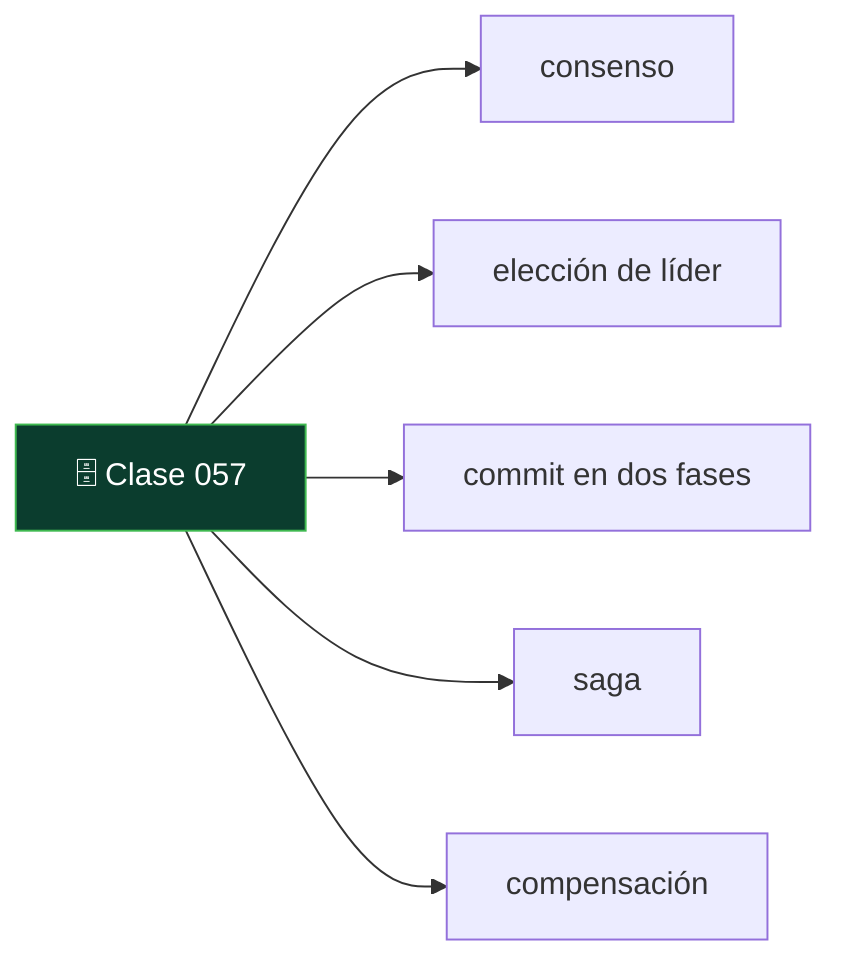
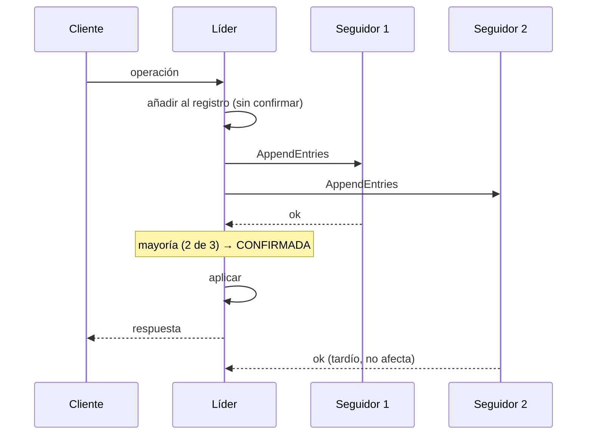

# 057 — Consenso y transacciones distribuidas: Raft, 2PC y sagas

   

> [Programa](../../../README.md) · [Parte 10](../README.md) · [← Anterior](../../part-10-distribucion-replica-y-consistencia/056-modelos-de-consistencia-y-garantias-de-sesion/README.md) · [Siguiente →](../../part-11-operacion-seguridad-y-gobierno/058-respaldo-y-restauracion-probada/README.md)

Parte 10 — Distribución, réplica y consistencia · Avanzado ·
4 horas estimadas · motores `spanner`, `cockroachdb`, `postgresql` · laboratorio
[`labs/03-transactions`](../../../labs/03-transactions/README.md) · 4 fuentes.

**Conceptos centrales:** `consenso` · `elección de líder` · `commit en dos fases` · `saga` · `compensación`

**En este caso se comparan 8 motores**: 7 lo resuelven (5 con el resultado comprobado por máquina) y 1 no, con el motivo escrito.



---

## Propósito

Coordinar varios nodos cuando hace falta acuerdo: consenso para elegir líder y ordenar operaciones, y las tres formas de que una operación abarque varios sistemas.

## Resultados de aprendizaje

Al terminar podrás:

1. Explicar qué problema resuelve el consenso y por qué necesita mayoría.
2. Describir Raft: elección de líder, replicación del registro y confirmación.
3. Identificar el fallo del commit en dos fases y por qué bloquea.
4. Diseñar una saga con sus compensaciones.
5. Elegir entre 2PC, saga y bandeja de salida transaccional.

## Fundamentos

### El problema del consenso

Varios nodos deben ponerse de acuerdo en un valor, tolerando caídas y mensajes perdidos. Es el problema que subyace a: elegir líder, decidir si una transacción confirma, ordenar un registro replicado.

**Por qué mayoría.** Con `2f + 1` nodos se toleran `f` caídas, porque dos mayorías cualesquiera se solapan en al menos un nodo, y ese nodo impide que se tomen dos decisiones contradictorias. Con 5 nodos se toleran 2. Un número par no aporta: 4 nodos toleran 1, igual que 3, y tienen más coordinación.

Lamport resolvió el problema con Paxos (1998); Ongaro y Ousterhout diseñaron Raft (2014) buscando explícitamente que fuese comprensible, y por eso es el que implementan etcd, Consul, CockroachDB y TiKV.

### Raft en tres piezas

**1. Elección de líder.** Cada nodo tiene un temporizador aleatorio. Al agotarse sin recibir señal del líder, se declara candidato del mandato `t+1` y pide votos. Con mayoría, es líder. La aleatoriedad de los temporizadores es lo que evita elecciones empatadas indefinidamente.

**2. Replicación del registro.** El líder recibe las operaciones, las añade a su registro y las envía a los seguidores. Una entrada se **confirma** cuando la mayoría la ha escrito. Solo entonces se aplica y se responde al cliente.

**3. Seguridad.** Un candidato solo obtiene votos si su registro está **al menos tan actualizado** como el del votante. Esa regla garantiza que un líder nuevo contiene todas las entradas confirmadas: nada confirmado se pierde jamás.



Costo: **una ida y vuelta a la mayoría por operación**. En un centro de datos, ~1 ms; entre regiones, cientos.

### Commit en dos fases

```text
Fase 1 (preparar):  el coordinador pregunta a cada participante "¿puedes confirmar?"
                    cada uno responde SÍ o NO, y si dice SÍ queda OBLIGADO
Fase 2 (confirmar): si todos dijeron SÍ, el coordinador ordena confirmar; si no, abortar
```

**El fallo.** Si el coordinador cae después de que todos digan SÍ y antes de enviar la decisión, los participantes quedan **en duda**: no pueden confirmar (quizá alguien dijo NO) ni abortar (quizá todos dijeron SÍ). Mantienen sus bloqueos indefinidamente.

Por eso 2PC se llama protocolo **bloqueante**. La corrección es un coordinador replicado por consenso —y entonces cada transacción cuesta consenso más dos rondas—. Es lo que hace Spanner, con la ventaja de una red controlada y relojes acotados por TrueTime.

Helland argumenta que a escala esto no se sostiene, y propone el enfoque alternativo.

### Sagas

Descomponer la operación en pasos locales atómicos, cada uno con su **compensación**:

```text
T1 → T2 → T3 → T4
      ↓ falla T3
C2 ← C1                    (compensaciones en orden inverso)
```

Propiedades que hay que asumir explícitamente:

- **No hay aislamiento.** Los estados intermedios son visibles. Otro proceso puede ver el pedido creado y el pago aún no cobrado.
- **Las compensaciones son semánticas, no técnicas.** No se «deshace» un correo enviado: se envía uno de disculpa. No se deshace un cobro: se emite un reembolso.
- **Todo paso y toda compensación debe ser idempotente** (clase 037), porque se reintentan.

### Bandeja de salida transaccional

El problema más común no es una transacción entre dos bases: es «escribir en la base **y** publicar un evento» de forma atómica.

```sql
BEGIN;
INSERT INTO enrollments (...) VALUES (...);
INSERT INTO outbox (tipo, carga, creado_en)
       VALUES ('inscripcion.creada', '{"student_id":11,...}', now());
COMMIT;
-- Un proceso aparte lee outbox y publica. Si falla, reintenta.
```

Una sola transacción local garantiza que el evento existe si y solo si la inscripción existe. La publicación es al-menos-una-vez, y el consumidor debe ser idempotente. Resuelve el problema real sin ninguna transacción distribuida, y por eso es la primera opción a considerar.

## Ejemplo trabajado

Inscripción que debe: reservar cupo (servicio de cursos), cobrar (servicio de pagos) y emitir credencial (servicio de identidad).

**Opción A — 2PC:**

```text
coordinador → prepare → cursos, pagos, identidad
todos SÍ → commit
```

Problemas concretos:

- El servicio de pagos es una pasarela externa: **no ofrece `prepare`**. 2PC es inaplicable desde el principio.
- Los tres servicios mantienen bloqueos durante toda la operación, incluida la latencia de la pasarela (segundos).
- Si el coordinador cae, tres servicios quedan bloqueados.

**Opción B — saga:**

```python
PASOS = [
    ("reservar_cupo",     reservar_cupo,     liberar_cupo),
    ("cobrar",            cobrar,            reembolsar),
    ("emitir_credencial", emitir_credencial, revocar_credencial),
]

def ejecutar_saga(saga_id, ctx):
    hechos = []
    for nombre, accion, compensacion in PASOS:
        try:
            # La clave de idempotencia deriva de la saga y del paso:
            # un reintento repite exactamente la misma clave.
            accion(ctx, clave_idem=f"{saga_id}:{nombre}")
            hechos.append((nombre, compensacion))
        except ErrorPermanente:
            for nombre_h, comp in reversed(hechos):
                comp(ctx, clave_idem=f"{saga_id}:comp:{nombre_h}")
            raise SagaAbortada(nombre)
    return "ok"
```

**Traza de un fallo en el cobro:**

```text
t0  reservar_cupo    → ok (cupo 39/40)
t1  cobrar           → tarjeta rechazada (ErrorPermanente)
t2  liberar_cupo     → ok (cupo 40/40)
resultado: saga abortada, estado coherente
```

**La falta de aislamiento, hecha visible:**

```text
t0    reservar_cupo → cupo 39/40
t0+1s otro usuario consulta → ve 39 plazas libres, no 40
t1    cobro falla
t2    liberar_cupo → cupo 40/40
```

Durante ~1 segundo el sistema mostró un cupo que no estaba realmente comprometido. **Es inherente a la saga y hay que decidir si es aceptable.** Aquí sí lo es: como mucho, alguien vio una plaza menos de las disponibles, lo que es conservador. Si el error fuese al revés —mostrar plazas que no existen— no sería aceptable.

**Opción C — bandeja de salida + coreografía**, la que suele resultar mejor:

```text
inscripciones: BEGIN; INSERT enrollment; INSERT outbox('inscripcion.creada'); COMMIT
pagos:         consume 'inscripcion.creada' → cobra → publica 'pago.ok' o 'pago.fallido'
inscripciones: consume 'pago.fallido'      → marca la inscripción como anulada
identidad:     consume 'pago.ok'           → emite credencial
```

Ningún coordinador, ninguna transacción distribuida, cada paso atómico en su propia base. A cambio: la coreografía es más difícil de seguir que la orquestación, y hace falta trazabilidad para saber dónde se detuvo una inscripción.

## Comparación

| Mecanismo | Atomicidad | Aislamiento | Bloqueante | Cuándo |
|---|---|---|---|---|
| Transacción local | Total | Total | No | Una sola base: **siempre que se pueda** |
| Bandeja de salida | Total en el origen | Del origen | No | Base + evento |
| 2PC | Total | Total | **Sí** | Pocos participantes, todos con `prepare`, red controlada |
| 2PC sobre consenso | Total | Total | No | Spanner, CockroachDB |
| Saga (orquestada) | Eventual | **Ninguno** | No | Servicios heterogéneos, pasos largos |
| Saga (coreografiada) | Eventual | Ninguno | No | Muchos servicios, bajo acoplamiento |

## Errores frecuentes

1. **2PC entre microservicios por red pública.** Bloqueo garantizado ante fallo del coordinador.
2. **Sagas sin compensación para algún paso.** Un fallo posterior deja el sistema inconsistente sin remedio.
3. **Compensaciones no idempotentes.** Un reintento reembolsa dos veces.
4. **Ignorar la falta de aislamiento de las sagas.** Los estados intermedios se ven y a veces se actúa sobre ellos.
5. **Publicar el evento antes del `COMMIT`.** Si la transacción se revierte, el evento ya salió.
6. **Número par de nodos en consenso.** Más coordinación, misma tolerancia.

## De la clase a la operación

La mayoría de las «transacciones distribuidas» que se plantean en un diseño desaparecen al reunir los datos que deben cambiar juntos en una misma base (clase 024). Antes de coordinar, conviene comprobar si la frontera del agregado está mal trazada.

## Reto de transferencia

1. Identifica una operación de tu sistema que abarque dos almacenes.
2. Diséñala como saga con compensaciones idempotentes.
3. Implementa la bandeja de salida y demuestra la atomicidad entre estado y evento.
4. Documenta qué estado intermedio queda visible y por cuánto tiempo.

## Preguntas de evaluación

1. ¿Por qué el consenso necesita mayoría estricta y no basta la mitad?
2. Traza el fallo del coordinador en 2PC y explica por qué los participantes no pueden decidir.
3. Da un paso de tu sistema cuya compensación no sea una simple inversión.
4. ¿Qué garantiza la bandeja de salida y qué obligación traslada al consumidor?

---

## 🌐 El mismo problema en cada motor

**Caso:** Cuando no hay ROLLBACK que valga: compensar en vez de deshacer

Dos servicios, dos bases de datos, una operación: reservar vuelo y hotel. El
vuelo se confirma; el hotel falla. No hay transacción que abarque a los dos,
así que **no hay nada que revertir**: la reserva del vuelo se confirmó de
verdad, existió como reserva válida y alguien pudo verla.

La respuesta es una **saga**: ejecutar la acción inversa. Y la acción inversa
no es un `ROLLBACK`, es una operación de negocio —cancelar— con sus propias
reglas, su penalización posible y su propia probabilidad de fallar.

El caso deja las dos cosas por escrito: el hotel fallido y el vuelo
compensado. Ver `compensado` en vez de que la fila del vuelo haya
desaparecido es exactamente la diferencia entre una saga y una transacción.

Salida esperada, idéntica en todos los motores que lo resuelven:

| paso | estado |
|---|---|
| `hotel` | `fallido` |
| `vuelo` | `compensado` |

El contrato vive en [`motores.yaml`](motores.yaml) y lo comprueba
`python scripts/verificar_equivalencia.py --clase 057`: 5 de
las 7 implementaciones se ejecutan de verdad y su
resultado se compara con esa tabla; el resto se declara como material revisado,
no ejecutado.

| Motor | ¿Resuelve el caso? | Nivel de prueba | Código | Fuente |
|---|---|---|---|---|
| SQLite | sí | núcleo | [código](implementaciones/sqlite/consulta.sql) | [doc oficial](https://sqlite.org/lang_update.html) |
| DuckDB | sí | núcleo | [código](implementaciones/duckdb/consulta.sql) | [doc oficial](https://duckdb.org/docs/stable/sql/query_syntax/select.html) |
| PostgreSQL | sí | servicio | [código](implementaciones/postgresql/consulta.sql) | [doc oficial](https://www.postgresql.org/docs/current/sql-prepare-transaction.html) |
| MongoDB | sí | servicio | [código](implementaciones/mongodb/consulta.js) | [doc oficial](https://www.mongodb.com/docs/manual/core/write-operations-atomicity/) |
| Redis | sí | servicio | [código](implementaciones/redis/consulta.txt) | [doc oficial](https://redis.io/docs/latest/commands/hset/) |
| Google Cloud Spanner | sí | declarado | [código](implementaciones/spanner/consulta.sql) | [doc oficial](https://cloud.google.com/spanner/docs/transactions) |
| CockroachDB | sí | declarado | [código](implementaciones/cockroachdb/consulta.sql) | [doc oficial](https://www.cockroachlabs.com/docs/stable/transactions) |
| Apache Kafka | **no** | — | — | [doc oficial](https://kafka.apache.org/documentation/#semantics) |

### Los que resuelven el caso

#### SQLite · [`implementaciones/sqlite/consulta.sql`](implementaciones/sqlite/consulta.sql)

✅ **verificado** — se ejecuta en CI sin servicios

```sql
-- motor: sqlite
-- doc: https://sqlite.org/lang_update.html
-- nota: la fila del vuelo NO desaparece: queda como 'compensado'. Esa
--       diferencia con un ROLLBACK es la clase entera. Y hay una segunda
--       leccion escondida: si el proceso muere entre el fallo del hotel y la
--       compensacion, nadie sabra que habia que compensar. El registro de la
--       saga tiene que ser duradero ANTES de dar el primer paso.

-- === preparacion ===
CREATE TABLE reservas (
    paso   TEXT PRIMARY KEY,
    estado TEXT NOT NULL
);

-- Paso 1: el servicio de vuelos confirma. En SU base de datos, esto ya esta
-- hecho y CONFIRMADO: nadie de fuera puede deshacerlo.
INSERT INTO reservas (paso, estado) VALUES ('vuelo', 'confirmado');

-- Paso 2: el servicio de hoteles no tiene habitaciones. Falla.
INSERT INTO reservas (paso, estado) VALUES ('hotel', 'fallido');

-- Compensacion. Y aqui esta toda la clase: esto NO es un ROLLBACK. El vuelo se
-- confirmo de verdad, existio como reserva valida durante un tiempo, y alguien
-- pudo verlo. Deshacerlo exige ejecutar la ACCION INVERSA —cancelar—, que es
-- una operacion de negocio con sus propias reglas: puede tener penalizacion,
-- puede requerir autorizacion, y puede fallar tambien.
UPDATE reservas SET estado = 'compensado' WHERE paso = 'vuelo';

-- === consulta ===
SELECT paso, estado FROM reservas ORDER BY paso;
```

- **Por qué sí:** La saga no necesita nada del motor: es un patrón de aplicación con registro de pasos. Verlo aquí, sin infraestructura, deja claro que el problema no es tecnológico sino de diseño.
- **Por qué no:** Cada paso y cada compensación hay que escribirlos, y el registro de la saga hay que hacerlo duradero: si el proceso muere entre el fallo y la compensación, nadie sabrá que había que compensar.
- 📄 Documentación oficial: <https://sqlite.org/lang_update.html>

#### DuckDB · [`implementaciones/duckdb/consulta.sql`](implementaciones/duckdb/consulta.sql)

✅ **verificado** — se ejecuta en CI sin servicios

```sql
-- motor: duckdb
-- doc: https://duckdb.org/docs/stable/sql/query_syntax/select.html
-- nota: la consulta que de verdad importa aqui es la de auditoria, la que se
--       ejecuta sobre el registro de todas las sagas:
--         SELECT saga_id FROM pasos WHERE estado = 'fallido'
--         AND saga_id NOT IN (SELECT saga_id FROM pasos WHERE estado = 'compensado');
--       Es decir: que sagas quedaron a medias. Ahi esta el dinero perdido.

-- === preparacion ===
CREATE TABLE reservas (
    paso   VARCHAR PRIMARY KEY,
    estado VARCHAR NOT NULL
);

-- Paso 1: el servicio de vuelos confirma. En SU base de datos, esto ya esta
-- hecho y CONFIRMADO: nadie de fuera puede deshacerlo.
INSERT INTO reservas (paso, estado) VALUES ('vuelo', 'confirmado');

-- Paso 2: el servicio de hoteles no tiene habitaciones. Falla.
INSERT INTO reservas (paso, estado) VALUES ('hotel', 'fallido');

-- Compensacion. Y aqui esta toda la clase: esto NO es un ROLLBACK. El vuelo se
-- confirmo de verdad, existio como reserva valida durante un tiempo, y alguien
-- pudo verlo. Deshacerlo exige ejecutar la ACCION INVERSA —cancelar—, que es
-- una operacion de negocio con sus propias reglas: puede tener penalizacion,
-- puede requerir autorizacion, y puede fallar tambien.
UPDATE reservas SET estado = 'compensado' WHERE paso = 'vuelo';

-- === consulta ===
SELECT paso, estado FROM reservas ORDER BY paso;
```

- **Por qué sí:** Sirve para la pregunta que se hace después: **cuántas sagas quedaron a medias**. Analizar el registro de pasos y encontrar los que fallaron sin compensación es una consulta analítica, y es la que descubre el dinero perdido.
- **Por qué no:** No participa en la saga: la observa.
- 📄 Documentación oficial: <https://duckdb.org/docs/stable/sql/query_syntax/select.html>

#### PostgreSQL · [`implementaciones/postgresql/consulta.sql`](implementaciones/postgresql/consulta.sql)

✅ **verificado** — se ejecuta contra el motor real levantado con `docker compose`

```sql
-- motor: postgresql
-- doc: https://www.postgresql.org/docs/current/sql-prepare-transaction.html
-- nota: PostgreSQL SI implementa la confirmacion en dos fases:
--         BEGIN; ...; PREPARE TRANSACTION 'reserva-42';
--         COMMIT PREPARED 'reserva-42';   -- o ROLLBACK PREPARED
--       Y conviene saber por que casi nadie la usa: una transaccion preparada
--       retiene sus bloqueos INDEFINIDAMENTE si el coordinador desaparece, y
--       basta una olvidada para impedir el vacio de toda la base. Por eso
--       max_prepared_transactions vale 0 por omision: hay que activarlo a
--       proposito. La saga existe porque esa alternativa sale peor.

-- === preparacion ===
DROP TABLE IF EXISTS reservas;

CREATE TABLE reservas (
    paso   text PRIMARY KEY,
    estado text NOT NULL
);

-- Paso 1: el servicio de vuelos confirma. En SU base de datos, esto ya esta
-- hecho y CONFIRMADO: nadie de fuera puede deshacerlo.
INSERT INTO reservas (paso, estado) VALUES ('vuelo', 'confirmado');

-- Paso 2: el servicio de hoteles no tiene habitaciones. Falla.
INSERT INTO reservas (paso, estado) VALUES ('hotel', 'fallido');

-- Compensacion. Y aqui esta toda la clase: esto NO es un ROLLBACK. El vuelo se
-- confirmo de verdad, existio como reserva valida durante un tiempo, y alguien
-- pudo verlo. Deshacerlo exige ejecutar la ACCION INVERSA —cancelar—, que es
-- una operacion de negocio con sus propias reglas: puede tener penalizacion,
-- puede requerir autorizacion, y puede fallar tambien.
UPDATE reservas SET estado = 'compensado' WHERE paso = 'vuelo';

-- === consulta ===
SELECT paso, estado FROM reservas ORDER BY paso;
```

- **Por qué sí:** Cada paso local **sí** es transaccional, que es lo que hace viable la saga: el paso y su anotación en el registro se confirman juntos. Y con el patrón de bandeja de salida —escribir el evento en la misma transacción que el cambio— se garantiza que nunca haya un cambio sin su evento.
- **Por qué no:** PostgreSQL implementa el estándar XA para confirmación en dos fases (`PREPARE TRANSACTION`), y precisamente por eso conviene saber por qué casi nadie lo usa: una transacción preparada retiene bloqueos **indefinidamente** si el coordinador desaparece, y basta una para bloquear el vacío de toda la base.
- 📄 Documentación oficial: <https://www.postgresql.org/docs/current/sql-prepare-transaction.html>

#### MongoDB · [`implementaciones/mongodb/consulta.js`](implementaciones/mongodb/consulta.js)

✅ **verificado** — se ejecuta contra el motor real levantado con `docker compose`

```javascript
// motor: mongodb
// doc: https://www.mongodb.com/docs/manual/core/write-operations-atomicity/
// nota: el registro de la saga cabe en un documento por operacion, con los
//       pasos dentro. Escribir un paso es una escritura atomica: ni transaccion
//       ni conjunto de replicas. Lo que NO garantiza nada es que el estado
//       escrito aqui coincida con el mundo real: si el servicio de vuelos no
//       recibio la cancelacion, el documento dira 'compensado' igualmente.

// === preparacion ===
db.sagas.drop();
db.sagas.insertOne({ _id: "reserva-42", pasos: [] });

// Paso 1: el vuelo se confirma de verdad, en otro sistema.
db.sagas.updateOne(
  { _id: "reserva-42" },
  { $push: { pasos: { paso: "vuelo", estado: "confirmado" } } },
);

// Paso 2: el hotel falla.
db.sagas.updateOne(
  { _id: "reserva-42" },
  { $push: { pasos: { paso: "hotel", estado: "fallido" } } },
);

// Compensacion: accion inversa sobre el paso ya confirmado.
db.sagas.updateOne(
  { _id: "reserva-42", "pasos.paso": "vuelo" },
  { $set: { "pasos.$.estado": "compensado" } },
);

// === consulta ===
db.sagas
  .aggregate([
    { $unwind: "$pasos" },
    { $project: { _id: 0, paso: "$pasos.paso", estado: "$pasos.estado" } },
    { $sort: { paso: 1 } },
  ])
  .forEach((d) => print(d.paso + "|" + d.estado));
```

- **Por qué sí:** El registro de la saga cabe en un documento por operación, con sus pasos dentro: escribir el paso y su estado es una sola escritura atómica, sin transacción y sin conjunto de réplicas.
- **Por qué no:** Al no haber restricciones entre colecciones, nada impide que el registro diga «compensado» y el servicio de vuelos no se haya enterado: la coherencia entre el registro y el mundo real la sostiene el código, y hay que reconciliarla periódicamente.
- 📄 Documentación oficial: <https://www.mongodb.com/docs/manual/core/write-operations-atomicity/>

#### Redis · [`implementaciones/redis/consulta.txt`](implementaciones/redis/consulta.txt)

✅ **verificado** — se ejecuta contra el motor real levantado con `docker compose`

```text
# motor: redis
# doc: https://redis.io/docs/latest/commands/hset/
# nota: Redis es un buen sitio para el ESTADO EN VUELO de la saga —que pasos van
#       hechos, cuales faltan— con caducidad para detectar las que se quedaron a
#       medias:
#         EXPIRE saga:reserva-42 3600
#       Lo que NO debe ser es el unico sitio donde vive ese estado: con
#       appendfsync everysec se puede perder hasta un segundo, y una saga
#       huerfana es dinero que nadie devuelve.

# === preparacion ===
FLUSHDB
HSET saga:reserva-42 vuelo confirmado
HSET saga:reserva-42 hotel fallido
HSET saga:reserva-42 vuelo compensado

# === consulta ===
EVAL "local r={} for _,p in ipairs({'hotel','vuelo'}) do r[#r+1]=p..'|'..redis.call('HGET',KEYS[1],p) end return r" 1 saga:reserva-42
```

- **Por qué sí:** Es un buen sitio para el **estado en vuelo** de la saga: qué pasos van hechos, cuáles faltan y cuáles hay que compensar, con caducidad automática para detectar las que se quedaron a medias.
- **Por qué no:** Si ese estado se pierde —y con `appendfsync everysec` se puede perder—, la saga queda huérfana: nadie sabrá que había que compensar. El registro de una saga es justo lo que **no** debe vivir solo en una caché.
- 📄 Documentación oficial: <https://redis.io/docs/latest/commands/hset/>

#### Google Cloud Spanner · [`implementaciones/spanner/consulta.sql`](implementaciones/spanner/consulta.sql)

⚪ **declarado** — se revisa a mano contra la documentación citada; la máquina no lo ejecuta

```sql
-- motor: spanner
-- doc: https://cloud.google.com/spanner/docs/transactions
-- nota: implementacion declarada, y deliberadamente distinta: aqui NO hay saga.
--       Si los dos datos caben en el mismo sistema, Spanner ofrece la
--       alternativa que la saga sustituye: una transaccion distribuida de
--       verdad, serializable, con confirmacion en dos fases sobre Paxos. El
--       coordinador tambien esta replicado por consenso, asi que no puede
--       quedarse colgado como el coordinador XA del que huye la saga.
--
--       Y el limite, que es el que importa: esto solo vale si los dos servicios
--       COMPARTEN base de datos. Una arquitectura de servicios independientes
--       evita eso a proposito, y por eso la saga sigue existiendo.

-- === preparacion ===
CREATE TABLE reservas (
    paso   STRING(MAX) NOT NULL,
    estado STRING(MAX) NOT NULL,
) PRIMARY KEY (paso);

-- === consulta ===
-- Una sola transaccion para las dos reservas. Si la segunda falla, la primera
-- NO ocurrio: no hay estado intermedio observable y no hay nada que compensar.
--
--   BEGIN;
--     INSERT INTO reservas (paso, estado) VALUES ('vuelo', 'confirmado');
--     INSERT INTO reservas (paso, estado) VALUES ('hotel', 'confirmado');
--   COMMIT;   -- o ROLLBACK entero
--
SELECT paso, estado FROM reservas ORDER BY paso;
```

- **Por qué sí:** Es la alternativa a la saga cuando ambos datos caben en el mismo sistema: una transacción distribuida de verdad, serializable, con confirmación en dos fases sobre Paxos y sin coordinador que se pueda quedar colgado, porque el coordinador también está replicado por consenso.
- **Por qué no:** Solo sirve si los dos servicios comparten base de datos, que es exactamente lo que una arquitectura de servicios independientes evita a propósito. Y cada transacción distribuida paga la latencia del consenso.
- 📄 Documentación oficial: <https://cloud.google.com/spanner/docs/transactions>

#### CockroachDB · [`implementaciones/cockroachdb/consulta.sql`](implementaciones/cockroachdb/consulta.sql)

⚪ **declarado** — se revisa a mano contra la documentación citada; la máquina no lo ejecuta

```sql
-- motor: cockroachdb
-- doc: https://www.cockroachlabs.com/docs/stable/transactions
-- nota: implementacion declarada. Misma alternativa que Spanner —transaccion
--       distribuida serializable sobre Raft— con protocolo de PostgreSQL, asi
--       que se puede probar sin reescribir la aplicacion.
--       Lo que SI hay que escribir es el ciclo de reintento: las transacciones
--       que abarcan varios rangos pueden abortarse por conflicto con el codigo
--       de error 40001, y reintentar no es opcional. Parte de la complejidad
--       que la saga hacia explicita vuelve por esta puerta.

-- === preparacion ===
DROP TABLE IF EXISTS reservas;

CREATE TABLE reservas (
    paso   STRING PRIMARY KEY,
    estado STRING NOT NULL
);

-- === consulta ===
--   BEGIN;
--     SAVEPOINT cockroach_restart;      -- punto de reintento
--     INSERT INTO reservas VALUES ('vuelo', 'confirmado');
--     INSERT INTO reservas VALUES ('hotel', 'confirmado');
--     RELEASE SAVEPOINT cockroach_restart;
--   COMMIT;
--
SELECT paso, estado FROM reservas ORDER BY paso;
```

- **Por qué sí:** Da la misma garantía —transacciones distribuidas serializables sobre Raft— con protocolo de PostgreSQL, así que se puede probar la alternativa a la saga sin reescribir la aplicación.
- **Por qué no:** Las transacciones que abarcan muchos rangos pueden ser abortadas por conflicto y **hay que reintentarlas siempre**: el ciclo de reintento no es opcional, y eso reintroduce en el código parte de la complejidad que la saga hacía explícita.
- 📄 Documentación oficial: <https://www.cockroachlabs.com/docs/stable/transactions>

### Los que no resuelven este caso — y qué se hace en su lugar

Descartar un motor con un argumento es tan formativo como usarlo. Ninguna de estas filas dice que el motor sea peor: dice que este problema no es el suyo.

| Motor | Por qué no | Qué se hace en su lugar | Fuente |
|---|---|---|---|
| Apache Kafka | No es un almacén de estado ni ejecuta pasos: es el registro por el que viajan los eventos entre servicios. La saga se **coordina** con él, pero no se implementa en él. | El patrón de bandeja de salida: cada servicio escribe el cambio y el evento en la **misma transacción local**, y un proceso de captura de cambios publica el evento en Kafka. Así nunca hay un cambio sin evento ni un evento sin cambio, que es el problema que hunde a las sagas escritas a mano. | [doc](https://kafka.apache.org/documentation/#semantics) |

---

## Laboratorio

```bash
python scripts/validate_repository.py
python labs/03-transactions/run_transactions_lab.py
```

Guarda como evidencia la salida completa, la versión del motor y la semilla o
los parámetros usados. Una captura sin comando no es evidencia: no se puede
repetir.

## Evaluación

| Criterio | Peso | Qué se comprueba |
|---|---:|---|
| Comprensión conceptual | 25 % | Explica el mecanismo, no solo el resultado |
| Ejecución reproducible | 25 % | Otra persona obtiene lo mismo con las instrucciones dadas |
| Interpretación basada en evidencia | 25 % | Cada conclusión se apoya en una salida o una medición |
| Límites y riesgos declarados | 25 % | Dice qué no demuestra el ejercicio y qué faltaría en producción |

La clase se da por superada cuando la respuesta explica el mecanismo, muestra
la salida que la respalda y declara al menos un límite del ejercicio.

## Fuentes de esta clase

Todo lo afirmado arriba procede de estas obras. Los identificadores viven en
[`catalog/sources.json`](../../../catalog/sources.json) y el estado de los
enlaces se comprueba con `python scripts/check_external_links.py`.

- **Diego Ongaro, John Ousterhout** (2014). [In Search of an Understandable Consensus Algorithm](https://raft.github.io/raft.pdf). USENIX ATC.  
  Raft: consenso equivalente a Paxos con elección de líder explicita.
- **Leslie Lamport** (1998). [The Part-Time Parliament](https://dl.acm.org/doi/10.1145/279227.279229). ACM TOCS 16(2). DOI [10.1145/279227.279229](https://doi.org/10.1145/279227.279229).  
  Paxos, el primer algoritmo de consenso práctico demostrado correcto.
- **Pat Helland** (2007). [Life beyond Distributed Transactions: An Apostate's Opinion](https://www.cidrdb.org/cidr2007/papers/cidr07p15.pdf). CIDR.  
  Entidades, actividades y por qué las transacciones distribuidas no escalan.
- **James C. Corbett, Jeffrey Dean, Michael Epstein** (2012). [Spanner: Google's Globally-Distributed Database](https://research.google/pubs/spanner-googles-globally-distributed-database-2/). USENIX OSDI.  
  Serializabilidad global usando incertidumbre de reloj acotada (TrueTime).

---

> [Programa](../../../README.md) · [Parte 10](../README.md) · [← Anterior](../../part-10-distribucion-replica-y-consistencia/056-modelos-de-consistencia-y-garantias-de-sesion/README.md) · [Siguiente →](../../part-11-operacion-seguridad-y-gobierno/058-respaldo-y-restauracion-probada/README.md)
