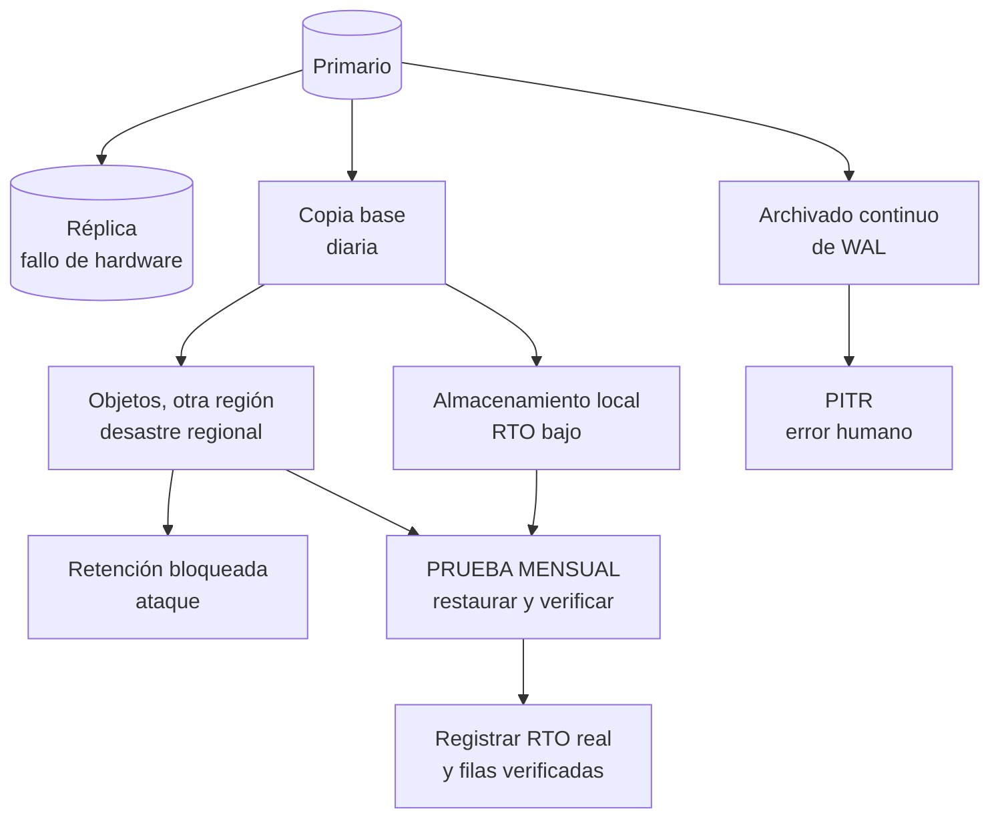

# 048 — Respaldo y restauración: solo cuenta lo que se ha restaurado

> [Programa](../../../README.md) · [Parte 10](../README.md) · [← Anterior](../../part-09-distribucion-replica-y-consistencia/047-consenso-y-transacciones-distribuidas/README.md) · [Siguiente →](../../part-10-operacion-seguridad-y-gobierno/049-migraciones-evolutivas-sin-caida/README.md)

Parte 10 — Operación, seguridad y gobierno · Intermedio ·
4 horas estimadas · motores `postgresql`, `sqlite`, `mongodb` · laboratorio
[`labs/03-transactions`](../../../labs/03-transactions/README.md) · 3 fuentes.

**Conceptos centrales:** `RPO` · `RTO` · `recuperación a un punto en el tiempo` · `prueba de restauración`

---

## Propósito

Convertir la copia de seguridad en una garantía verificada. Una copia que nunca se ha restaurado no es una copia: es una carpeta que ocupa espacio.

## Resultados de aprendizaje

Al terminar podrás:

1. Definir RPO y RTO y derivarlos de una exigencia de negocio.
2. Distinguir copia lógica, física y recuperación a un punto en el tiempo.
3. Diseñar un plan que cubra los cinco modos de pérdida.
4. Ejecutar y cronometrar una restauración completa.
5. Explicar por qué una réplica no es una copia de seguridad.

## Fundamentos

### RPO y RTO

- **RPO (objetivo de punto de recuperación):** cuántos datos se acepta perder, en tiempo. Determina la frecuencia de copia y el modo de replicación.
- **RTO (objetivo de tiempo de recuperación):** cuánto se acepta estar caído. Determina el tipo de copia y el procedimiento.

Ambos salen de una conversación con el negocio, no de una preferencia técnica. La pregunta útil es concreta: *«si perdiéramos los datos de las últimas cuatro horas, ¿qué habría que rehacer y cuánto costaría?»*.

| RPO | Mecanismo necesario |
|---|---|
| 24 h | Copia diaria |
| 1 h | Copia diaria + archivado de WAL cada hora |
| 5 min | Archivado continuo de WAL |
| ~0 | Réplica síncrona **más** copias |

| RTO | Mecanismo necesario |
|---|---|
| 24 h | Restaurar copia lógica |
| 1 h | Copia física + WAL |
| 5 min | Réplica en caliente con conmutación |
| ~0 | Multimaestro o activo-activo |

### Los cinco modos de pérdida

Un plan solo está completo si cubre los cinco:

| Modo | Cubre |
|---|---|
| Fallo de hardware | Réplica, RAID |
| Corrupción de datos | Copia + WAL desde antes de la corrupción |
| **Error humano** (`DROP TABLE`) | Recuperación a un punto en el tiempo |
| **Ataque** (cifrado o borrado) | Copia inmutable, fuera de línea o con retención bloqueada |
| Desastre regional | Copia en otra región |

Los dos marcados son los que la réplica **no** cubre, y son los más frecuentes. Un `DELETE` erróneo se replica en milisegundos a todas las réplicas. Un atacante con credenciales de administrador borra el primario y las réplicas.

**Una réplica no es una copia de seguridad.** Protege contra fallo de hardware y nada más.

### Tipos de copia

| Tipo | Qué es | Restauración | Verificación |
|---|---|---|---|
| **Lógica** (`pg_dump`) | SQL o formato propio | Lenta; reconstruye índices | Fácil: se puede leer |
| **Física** (`pg_basebackup`) | Archivos del clúster | Rápida | Requiere el mismo motor y versión mayor |
| **PITR** | Copia física + WAL archivado | A cualquier instante | La más completa |
| **Instantánea de volumen** | Copia del almacenamiento | Muy rápida | Debe ser atómica entre volúmenes |

La copia lógica tiene una ventaja subestimada: es legible y portable entre versiones mayores. La física es mucho más rápida de restaurar pero está atada al motor.

### La regla 3-2-1

Tres copias, en dos medios distintos, una fuera del sitio. En la práctica actual: primario + copia local + copia en almacenamiento de objetos de otra región, esta última con **retención bloqueada** para que ni siquiera un administrador comprometido pueda borrarla.



## Ejemplo trabajado

Requisito de negocio: *«no podemos perder más de 15 minutos de inscripciones y debemos volver en menos de 2 horas»*. → RPO = 15 min, RTO = 2 h.

**Configuración:**

```bash
# postgresql.conf
archive_mode = on
archive_command = 'test ! -f /archivo/%f && cp %p /archivo/%f'
archive_timeout = 300          # fuerza cierre de segmento cada 5 min → RPO ≤ 5 min

# copia base diaria
pg_basebackup -D /copias/base-$(date +%F) -Ft -z -X stream -c fast
```

**Escenario: a las 14:37 alguien ejecuta `DELETE FROM enrollments;` sin `WHERE`.**

Lo que **no** sirve:

- La réplica: recibió el `DELETE` en 12 ms.
- La copia de las 03:00 sin WAL: perdería 11 horas y media de trabajo.

Lo que sirve:

```bash
# 1. Detener el servicio y preservar el estado actual (por si acaso)
systemctl stop postgresql
mv /var/lib/postgresql/16/main /var/lib/postgresql/16/main.roto

# 2. Restaurar la copia base más reciente
tar xzf /copias/base-2026-08-19/base.tar.gz -C /var/lib/postgresql/16/main

# 3. Reproducir el WAL hasta JUSTO ANTES del error
cat > /var/lib/postgresql/16/main/postgresql.auto.conf <<'EOF'
restore_command = 'cp /archivo/%f %p'
recovery_target_time = '2026-08-19 14:36:30'
recovery_target_action = 'pause'
EOF
touch /var/lib/postgresql/16/main/recovery.signal

# 4. Arrancar; PostgreSQL reproduce y se detiene en el objetivo
systemctl start postgresql
```

**Verificación antes de promover** —este paso es el que casi nadie hace y el que evita restaurar sobre un estado equivocado—:

```sql
SELECT count(*) FROM enrollments;                       -- ¿coincide con lo esperado?
SELECT max(registrada_en) FROM enrollments;             -- ¿llega hasta 14:36?
SELECT * FROM enrollments ORDER BY registrada_en DESC LIMIT 5;
```

Solo si cuadra:

```sql
SELECT pg_wal_replay_resume();   -- o promover
```

**Cronometraje real de una prueba** sobre 500 GB:

```text
Descarga de la copia desde otra región    38 min
Descompresión y colocación                12 min
Reproducción de 11 h de WAL               24 min
Verificación de integridad y conteos       8 min
                                        --------
RTO real medido                           82 min      ✔ por debajo de las 2 h
RPO real medido                       ≤ 5 min         ✔ por debajo de 15 min
```

**Sin esta medición, el RTO es una suposición.** Y las suposiciones se descubren falsas el día del incidente, que es el peor día.

**La prueba mensual, automatizada:**

```bash
#!/usr/bin/env bash
set -euo pipefail
INICIO=$(date +%s)

restaurar_en_entorno_aislado /copias/base-mas-reciente
esperar_a_que_acepte_conexiones

# Comprobar contenido, no solo que el proceso arranque: una base
# restaurada vacía arranca perfectamente.
FILAS=$(psql -tAc "SELECT count(*) FROM enrollments")
test "$FILAS" -gt 1000000 || { echo "::error::restauración vacía: $FILAS filas"; exit 1; }
psql -tAc "SELECT count(*) FROM (
             SELECT e.student_id FROM enrollments e
             LEFT JOIN courses c ON c.id = e.course_id
             WHERE c.id IS NULL) t" | grep -qx 0 || { echo "::error::integridad"; exit 1; }

echo "RTO medido: $(( ($(date +%s) - INICIO) / 60 )) min · filas: $FILAS"
```

El punto crítico está en el comentario: **una base restaurada vacía arranca sin errores**. Comprobar que el servicio responde no demuestra nada; hay que contar el contenido.

## Comparación

| Amenaza | Réplica | Copia diaria | PITR | Copia inmutable externa |
|---|---|---|---|---|
| Fallo de disco | Sí | Sí | Sí | Sí |
| Corrupción lógica | **No** | Parcial | **Sí** | Sí |
| `DROP TABLE` | **No** | Parcial | **Sí** | Sí |
| Cifrado por atacante | **No** | **No** | **No** | **Sí** |
| Desastre regional | Si es remota | Si es remota | Si es remota | **Sí** |

## Errores frecuentes

1. **No probar nunca la restauración.** El fallo más grave y el más común.
2. **Confundir réplica con copia.** No cubre error humano ni ataque.
3. **Copias en la misma cuenta y con los mismos permisos que el primario.** Un atacante las borra también.
4. **Verificar que el servicio arranca y no el contenido.** Una base vacía arranca.
5. **No cronometrar.** El RTO declarado no coincide con el real.
6. **Copias sin cifrar en almacenamiento de objetos.** La fuga es tan grave como la pérdida.
7. **Retener el WAL sin límite o sin vigilancia.** Llena el disco del primario.

## De la clase a la operación

La métrica que resume la salud del plan es la fecha de la última restauración verificada. Si es de hace más de un mes, el plan es una hipótesis. Publicarla en el panel de operación cambia la conducta del equipo más que cualquier documento.

## Reto de transferencia

1. Deriva RPO y RTO de una conversación real de negocio, con la pregunta concreta.
2. Configura archivado continuo y realiza una recuperación a un punto en el tiempo.
3. Cronometra la restauración completa y compara con el RTO declarado.
4. Automatiza la prueba mensual con verificación de contenido, no solo de arranque.

## Preguntas de evaluación

1. ¿Por qué una réplica no protege de un `DELETE` sin `WHERE`?
2. Calcula el RPO real de tu configuración actual, en minutos.
3. ¿Qué comprobarías tras restaurar, antes de promover a producción?
4. Diseña la protección de tus copias frente a un atacante con credenciales de administrador.

---

## Laboratorio

```bash
python scripts/validate_repository.py
python labs/03-transactions/run_transactions_lab.py
```

Guarda como evidencia la salida completa, la versión del motor y la semilla o
los parámetros usados. Una captura sin comando no es evidencia: no se puede
repetir.

## Evaluación

| Criterio | Peso | Qué se comprueba |
|---|---:|---|
| Comprensión conceptual | 25 % | Explica el mecanismo, no solo el resultado |
| Ejecución reproducible | 25 % | Otra persona obtiene lo mismo con las instrucciones dadas |
| Interpretación basada en evidencia | 25 % | Cada conclusión se apoya en una salida o una medición |
| Límites y riesgos declarados | 25 % | Dice qué no demuestra el ejercicio y qué faltaría en producción |

La clase se da por superada cuando la respuesta explica el mecanismo, muestra
la salida que la respalda y declara al menos un límite del ejercicio.

## Fuentes de esta clase

Todo lo afirmado arriba procede de estas obras. Los identificadores viven en
[`catalog/sources.json`](../../../catalog/sources.json) y el estado de los
enlaces se comprueba con `python scripts/check_external_links.py`.

- **PostgreSQL Global Development Group** (2026). [PostgreSQL: Backup and Restore](https://www.postgresql.org/docs/current/backup.html).  
  Volcado lógico, copia de archivos y recuperación a un punto en el tiempo.
- **Laine Campbell, Charity Majors** (2017). [Database Reliability Engineering](https://www.oreilly.com/library/view/database-reliability-engineering/9781491925935/). O'Reilly. ISBN 978-1-4919-2594-2.  
  Operación, respaldos, objetivos de servicio y gestion de cambios.
- **Betsy Beyer, Chris Jones, Jennifer Petoff, Niall Richard Murphy** (2016). [Site Reliability Engineering: How Google Runs Production Systems](https://sre.google/sre-book/table-of-contents/). O'Reilly. ISBN 978-1-4919-2912-4.  
  Lectura libre. Objetivos de nivel de servicio y presupuesto de error.

---

> [Programa](../../../README.md) · [Parte 10](../README.md) · [← Anterior](../../part-09-distribucion-replica-y-consistencia/047-consenso-y-transacciones-distribuidas/README.md) · [Siguiente →](../../part-10-operacion-seguridad-y-gobierno/049-migraciones-evolutivas-sin-caida/README.md)
