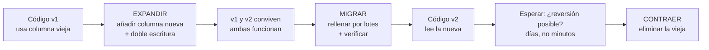

# 049 — Migraciones evolutivas sin ventana de caída

> [Programa](../../../README.md) · [Parte 10](../README.md) · [← Anterior](../../part-10-operacion-seguridad-y-gobierno/048-respaldo-y-restauracion-probada/README.md) · [Siguiente →](../../part-10-operacion-seguridad-y-gobierno/050-control-de-acceso-y-seguridad-por-fila/README.md)

Parte 10 — Operación, seguridad y gobierno · Avanzado ·
3 horas estimadas · motores `postgresql`, `mysql` · laboratorio
[`labs/03-transactions`](../../../labs/03-transactions/README.md) · 3 fuentes.

**Conceptos centrales:** `expandir y contraer` · `doble escritura` · `relleno` · `compatibilidad hacia atras`

**En este caso se comparan 7 motores**: 6 lo resuelven (5 con el resultado comprobado por máquina) y 1 no, con el motivo escrito.

---

## Propósito

Cambiar el esquema mientras la aplicación sirve tráfico. La técnica se resume en una idea: nunca hacer un cambio incompatible; hacer dos compatibles con un periodo de convivencia en medio.

## Resultados de aprendizaje

Al terminar podrás:

1. Aplicar el patrón expandir-migrar-contraer.
2. Identificar qué operaciones DDL bloquean y por cuánto.
3. Diseñar una doble escritura con relleno y verificación.
4. Escribir migraciones idempotentes y reversibles.
5. Reconocer el cambio que sí exige una ventana de parada.

## Fundamentos

### Expandir, migrar, contraer

Ambler y Sadalage formalizaron la técnica. Todo cambio incompatible se descompone en tres despliegues:

```text
1. EXPANDIR   Añadir lo nuevo sin quitar lo viejo. Ambas versiones del código funcionan.
2. MIGRAR     Rellenar los datos nuevos. Cambiar el código para usarlos. Verificar.
3. CONTRAER   Eliminar lo viejo, cuando ya nadie lo usa.
```

La regla que lo hace funcionar: **en todo momento, la versión antigua y la nueva del código deben poder ejecutarse contra el mismo esquema**. Durante un despliegue gradual conviven, y en una reversión también.

| Cambio deseado | Expandir | Migrar | Contraer |
|---|---|---|---|
| Renombrar columna | Añadir la nueva | Copiar + doble escritura + cambiar lecturas | Eliminar la antigua |
| Cambiar tipo | Añadir columna con el tipo nuevo | Convertir + doble escritura | Eliminar la antigua |
| Dividir tabla | Crear la nueva + vista de compatibilidad | Copiar + cambiar escrituras | Eliminar la antigua |
| Añadir `NOT NULL` | Añadir `CHECK NOT VALID` | Corregir nulos + `VALIDATE` | Convertir a `NOT NULL` |
| Añadir clave foránea | `NOT VALID` | Corregir huérfanos + `VALIDATE` | — |

### Qué bloquea y por cuánto

Este es el conocimiento operativo que evita incidentes:

| Operación | PostgreSQL |
|---|---|
| `ADD COLUMN` sin valor por defecto | Instantáneo (bloqueo breve) |
| `ADD COLUMN ... DEFAULT` | Instantáneo desde PG 11 |
| `ADD COLUMN ... NOT NULL` sin defecto | **Falla** si hay filas |
| `DROP COLUMN` | Instantáneo (marca como borrada) |
| `ALTER TYPE` que exige conversión | **Reescribe la tabla**: bloqueo largo |
| `CREATE INDEX` | **Bloquea escrituras** |
| `CREATE INDEX CONCURRENTLY` | No bloquea; más lento; puede fallar y dejar un índice inválido |
| `ADD CONSTRAINT ... NOT VALID` | Instantáneo |
| `VALIDATE CONSTRAINT` | Barrido sin bloquear escrituras |
| `SET NOT NULL` con `CHECK` validado previo | Instantáneo desde PG 12 |

**La trampa de la cola de bloqueos.** Un `ALTER TABLE` que necesita un bloqueo exclusivo espera a que terminen las transacciones en curso, y **mientras espera bloquea a todas las que llegan detrás**. Una consulta de informe de 10 minutos convierte un `ALTER` instantáneo en 10 minutos de indisponibilidad total de esa tabla.

La defensa es siempre la misma:

```sql
SET lock_timeout = '3s';
ALTER TABLE ... ;   -- si no consigue el bloqueo en 3 s, falla y se reintenta después
```

En MySQL, además, hay que recordar que **el DDL no es transaccional** (clase 014): una migración de varios pasos que falla a la mitad no se revierte sola.



## Ejemplo trabajado

Objetivo: renombrar `enrollments.nota` a `calificacion` y cambiar su tipo de `REAL` a `NUMERIC(2,1)`. Tabla de 5 millones de filas, 400 escrituras/s.

**Lo que NO se puede hacer:**

```sql
ALTER TABLE enrollments RENAME COLUMN nota TO calificacion;
```

Instantáneo en el motor y **catastrófico**: todo el código desplegado que dice `nota` falla desde ese instante, incluidas las instancias que aún no se han actualizado.

### Paso 1 — Expandir

```sql
SET lock_timeout = '3s';
ALTER TABLE enrollments ADD COLUMN calificacion NUMERIC(2,1);   -- instantáneo

CREATE OR REPLACE FUNCTION sync_calificacion() RETURNS TRIGGER AS $$
BEGIN
  -- Doble escritura en ambos sentidos: el código viejo escribe `nota`,
  -- el nuevo escribe `calificacion`, y ambos quedan sincronizados.
  IF NEW.calificacion IS DISTINCT FROM OLD.calificacion THEN
    NEW.nota := NEW.calificacion::real;
  ELSIF NEW.nota IS DISTINCT FROM OLD.nota THEN
    NEW.calificacion := NEW.nota::numeric(2,1);
  END IF;
  RETURN NEW;
END; $$ LANGUAGE plpgsql;

CREATE TRIGGER trg_sync_calificacion BEFORE INSERT OR UPDATE ON enrollments
FOR EACH ROW EXECUTE FUNCTION sync_calificacion();
```

Aquí no ha cambiado nada para el código existente. Se puede revertir sin consecuencias.

### Paso 2 — Rellenar por lotes

Un `UPDATE` único de 5 millones de filas mantendría un bloqueo enorme, generaría 5 millones de versiones muertas y un WAL gigantesco.

```sql
DO $$
DECLARE ultimo RECORD; n INTEGER;
BEGIN
  LOOP
    WITH lote AS (
      SELECT student_id, course_id FROM enrollments
      WHERE calificacion IS NULL AND nota IS NOT NULL
      ORDER BY student_id, course_id LIMIT 10000 FOR UPDATE SKIP LOCKED
    )
    UPDATE enrollments e SET calificacion = e.nota::numeric(2,1)
    FROM lote l WHERE e.student_id = l.student_id AND e.course_id = l.course_id;
    GET DIAGNOSTICS n = ROW_COUNT;
    EXIT WHEN n = 0;
    COMMIT;             -- transacción corta por lote
    PERFORM pg_sleep(0.1);   -- dar aire al autovacuum y a la réplica
  END LOOP;
END $$;
```

`SKIP LOCKED` evita esperar a filas que la aplicación está modificando. La pausa evita que el relleno dispare el retraso de réplica (clase 043).

### Paso 3 — Verificar antes de seguir

```sql
SELECT count(*) FROM enrollments
WHERE nota IS DISTINCT FROM calificacion::real;   -- debe ser 0
```

**Esta consulta es la puerta.** Si no da cero, no se avanza.

### Paso 4 — Desplegar el código que lee `calificacion`

Despliegue gradual. Durante horas conviven instancias que leen una y otra columna; el disparador mantiene ambas correctas.

### Paso 5 — Esperar

Días, no minutos. Es la ventana en la que una reversión del código sigue siendo posible sin tocar la base.

### Paso 6 — Contraer

```sql
SET lock_timeout = '3s';
DROP TRIGGER trg_sync_calificacion ON enrollments;
ALTER TABLE enrollments DROP COLUMN nota;
```

**Resumen de la operación:**

| Paso | Duración | Bloqueo | ¿Reversible? |
|---|---|---|---|
| 1 Expandir | < 1 s | Breve | Sí |
| 2 Rellenar | ~2 h | Ninguno | Sí |
| 3 Verificar | minutos | Ninguno | Sí |
| 4 Desplegar | ~30 min | Ninguno | Sí |
| 5 Esperar | días | Ninguno | Sí |
| 6 Contraer | < 1 s | Breve | **No** |

Cinco de seis pasos son reversibles. Solo el último no lo es, y para entonces ya se ha demostrado que nadie usa la columna vieja.

### El cambio que sí exige parada

No todo se puede hacer en caliente. Ejemplos honestos: cambiar la clave primaria de una tabla enorme referenciada por muchas otras, o una reorganización que exige reescribir el conjunto sin espacio para una copia. Ahí la decisión correcta es programar una ventana, comunicarla y ensayarla sobre una copia restaurada (clase 048), no forzar un procedimiento en caliente que se quedará a medias.

## Comparación

| Enfoque | Caída | Riesgo | Duración total |
|---|---|---|---|
| `ALTER` directo | Sí, mientras dure | Alto | Minutos |
| Expandir-migrar-contraer | Ninguna | Bajo | Días |
| Tabla sombra + intercambio | Segundos | Medio | Horas |
| Herramienta en línea (`gh-ost`, `pt-osc`) | Ninguna | Medio | Horas |

## Errores frecuentes

1. **`RENAME COLUMN` en caliente.** Rompe todo el código desplegado.
2. **`ALTER` sin `lock_timeout`.** Una consulta larga bloquea la tabla entera.
3. **`UPDATE` masivo en una sola transacción.** Hinchazón, WAL enorme, retraso de réplica.
4. **`CREATE INDEX` sin `CONCURRENTLY` en producción.** Bloquea escrituras.
5. **Contraer el mismo día que se despliega.** No queda margen de reversión.
6. **Migraciones no idempotentes.** Un reintento tras un fallo parcial falla o duplica.
7. **No verificar entre pasos.** Se avanza sobre datos incompletos.

## De la clase a la operación

Las migraciones son el cambio con mayor probabilidad de causar una caída, porque se prueban con datos de desarrollo y se ejecutan sobre datos de producción. Ensayarlas contra una copia restaurada del tamaño real es la práctica que más incidentes evita.

## Reto de transferencia

1. Elige un cambio incompatible real y descomponlo en los tres pasos.
2. Implementa la doble escritura y demuestra que ambas versiones del código funcionan.
3. Rellena por lotes midiendo el retraso de réplica durante el proceso.
4. Escribe la consulta de verificación que actúa como puerta entre pasos.

## Preguntas de evaluación

1. ¿Por qué `RENAME COLUMN` es peligroso si es instantáneo en el motor?
2. Explica la cola de bloqueos y cómo `lock_timeout` la evita.
3. ¿Qué aporta `SKIP LOCKED` en un relleno por lotes?
4. Da un cambio de tu esquema que sí exigiría una ventana de parada, y justifícalo.

---

## 🌐 El mismo problema en cada motor

**Caso:** Añadir una columna con la aplicación en marcha y sin que nadie lo note

Una migración sin caída no es una migración rápida: es una migración
**compatible en los dos sentidos**. Durante el despliegue conviven la versión
vieja del código y la nueva, así que el esquema tiene que servir a las dos a
la vez. De ahí el patrón de tres tiempos: **expandir** —añadir lo nuevo sin
tocar lo viejo—, **migrar** —rellenar por lotes mientras ambas versiones
funcionan— y **contraer** —retirar lo viejo, y solo cuando ya no queda nadie
usándolo.

El caso ejecuta los tres pasos sobre una tabla de personas: se añade
`apellido` anulable, se rellena y se inserta una fila nueva con las dos
columnas. El resultado es trivial; lo que cambia entre motores es **cuánto
bloquea cada paso**, y ahí está la diferencia entre un despliegue invisible y
una caída de veinte minutos.

Salida esperada, idéntica en todos los motores que lo resuelven:

| id | apellido |
|---|---|
| `1` | `Lovelace` |
| `2` | `Torvalds` |
| `3` | `Hopper` |

El contrato vive en [`motores.yaml`](motores.yaml) y lo comprueba
`python scripts/verificar_equivalencia.py --clase 049`: 5 de
las 6 implementaciones se ejecutan de verdad y su
resultado se compara con esa tabla; el resto se declara como material revisado,
no ejecutado.

| Motor | ¿Resuelve el caso? | Nivel de prueba | Código | Fuente |
|---|---|---|---|---|
| PostgreSQL | sí | servicio | [código](implementaciones/postgresql/consulta.sql) | [doc oficial](https://www.postgresql.org/docs/current/sql-altertable.html) |
| MySQL | sí | servicio | [código](implementaciones/mysql/consulta.sql) | [doc oficial](https://dev.mysql.com/doc/refman/8.4/en/innodb-online-ddl-operations.html) |
| SQLite | sí | núcleo | [código](implementaciones/sqlite/consulta.sql) | [doc oficial](https://sqlite.org/lang_altertable.html) |
| DuckDB | sí | núcleo | [código](implementaciones/duckdb/consulta.sql) | [doc oficial](https://duckdb.org/docs/stable/sql/statements/alter_table) |
| MongoDB | sí | servicio | [código](implementaciones/mongodb/consulta.js) | [doc oficial](https://www.mongodb.com/docs/manual/data-modeling/schema-design-process/) |
| Apache Cassandra | sí | declarado | [código](implementaciones/cassandra/consulta.cql) | [doc oficial](https://cassandra.apache.org/doc/latest/cassandra/developing/cql/ddl.html) |
| Redis | **no** | — | — | [doc oficial](https://redis.io/docs/latest/develop/using-commands/keyspace/) |

### Los que resuelven el caso

#### PostgreSQL · [`implementaciones/postgresql/consulta.sql`](implementaciones/postgresql/consulta.sql)

✅ **verificado** — se ejecuta contra el motor real levantado con `docker compose`

```sql
-- motor: postgresql
-- doc: https://www.postgresql.org/docs/current/sql-altertable.html
-- nota: casi todo ALTER TABLE pide un bloqueo ACCESS EXCLUSIVE, aunque sea un
--       instante. Si hay una consulta larga en marcha, el ALTER espera Y TODO
--       LO QUE LLEGUE DETRAS ESPERA CON EL. La forma segura es:
--         SET lock_timeout = '3s';
--         ALTER TABLE personas ADD COLUMN apellido text;
--       y reintentar si falla, en vez de confiar en que sera rapido.

-- === preparacion ===
DROP TABLE IF EXISTS personas;

CREATE TABLE personas (
    id     integer PRIMARY KEY,
    nombre text NOT NULL
);
INSERT INTO personas (id, nombre) VALUES
    (1, 'Ada Lovelace'), (2, 'Linus Torvalds');

-- EXPANDIR. La columna nueva nace ANULABLE y sin restricciones: la version
-- vieja de la aplicacion, que no la conoce, sigue insertando sin problemas.
ALTER TABLE personas ADD COLUMN apellido text;

-- MIGRAR. Se rellena por lotes, sin bloquear la tabla entera. Mientras dura,
-- conviven las dos versiones del codigo: la vieja escribe solo `nombre` y la
-- nueva escribe las dos columnas.
UPDATE personas SET apellido = 'Lovelace' WHERE id = 1;
UPDATE personas SET apellido = 'Torvalds' WHERE id = 2;

-- CONTRAER. Solo cuando NO queda nadie ejecutando la version vieja se puede
-- endurecer la columna o retirar la antigua. Ese «solo cuando» es la parte que
-- se salta todo el mundo, y es la que produce la caida.
INSERT INTO personas (id, nombre, apellido) VALUES (3, 'Grace Hopper', 'Hopper');

-- === consulta ===
SELECT id, apellido FROM personas ORDER BY id;
```

- **Por qué sí:** Desde la versión 11, añadir una columna con valor por omisión **no reescribe la tabla**: es un cambio de catálogo instantáneo. Y el DDL es transaccional, así que una migración a medias se deshace entera.
- **Por qué no:** Casi todo `ALTER TABLE` pide un bloqueo `ACCESS EXCLUSIVE`, aunque sea por un instante: si hay una consulta larga en marcha, el `ALTER` espera **y todo lo que llegue detrás espera con él**. La regla práctica es poner siempre `lock_timeout` y reintentar, en vez de confiar en que será rápido.
- 📄 Documentación oficial: <https://www.postgresql.org/docs/current/sql-altertable.html>

#### MySQL · [`implementaciones/mysql/consulta.sql`](implementaciones/mysql/consulta.sql)

✅ **verificado** — se ejecuta contra el motor real levantado con `docker compose`

```sql
-- motor: mysql
-- doc: https://dev.mysql.com/doc/refman/8.4/en/innodb-online-ddl-operations.html
-- nota: declarar el algoritmo a proposito, para que el motor FALLE en vez de
--       copiar en silencio una tabla de 200 GB:
--         ALTER TABLE personas ADD COLUMN apellido VARCHAR(50), ALGORITHM=INSTANT;
--       Y recordar que el DDL NO es transaccional: una migracion a medias se
--       queda a medias.

-- === preparacion ===
DROP TABLE IF EXISTS personas;

CREATE TABLE personas (
    id     INT PRIMARY KEY,
    nombre VARCHAR(50) NOT NULL
);
INSERT INTO personas (id, nombre) VALUES
    (1, 'Ada Lovelace'), (2, 'Linus Torvalds');

-- EXPANDIR. La columna nueva nace ANULABLE y sin restricciones: la version
-- vieja de la aplicacion, que no la conoce, sigue insertando sin problemas.
ALTER TABLE personas ADD COLUMN apellido VARCHAR(50);

-- MIGRAR. Se rellena por lotes, sin bloquear la tabla entera. Mientras dura,
-- conviven las dos versiones del codigo: la vieja escribe solo `nombre` y la
-- nueva escribe las dos columnas.
UPDATE personas SET apellido = 'Lovelace' WHERE id = 1;
UPDATE personas SET apellido = 'Torvalds' WHERE id = 2;

-- CONTRAER. Solo cuando NO queda nadie ejecutando la version vieja se puede
-- endurecer la columna o retirar la antigua. Ese «solo cuando» es la parte que
-- se salta todo el mundo, y es la que produce la caida.
INSERT INTO personas (id, nombre, apellido) VALUES (3, 'Grace Hopper', 'Hopper');

-- === consulta ===
SELECT id, apellido FROM personas ORDER BY id;
```

- **Por qué sí:** InnoDB tiene DDL en línea con `ALGORITHM=INPLACE` y, para añadir columnas, `ALGORITHM=INSTANT` desde 8.0.12: la columna se añade en milisegundos sin copiar la tabla.
- **Por qué no:** El DDL **no** es transaccional: una migración a medias se queda a medias. Y no todos los cambios admiten `INSTANT`; los que no, copian la tabla entera, así que hay que declarar el algoritmo explícitamente para que el motor **falle** en vez de copiar en silencio una tabla de 200 GB.
- 📄 Documentación oficial: <https://dev.mysql.com/doc/refman/8.4/en/innodb-online-ddl-operations.html>

#### SQLite · [`implementaciones/sqlite/consulta.sql`](implementaciones/sqlite/consulta.sql)

✅ **verificado** — se ejecuta en CI sin servicios

```sql
-- motor: sqlite
-- doc: https://sqlite.org/lang_altertable.html
-- nota: ADD COLUMN es casi instantaneo. Cambiar un tipo o anadir una
--       restriccion, en cambio, exige el procedimiento de doce pasos que
--       documenta el propio proyecto: crear tabla nueva, copiar, borrar,
--       renombrar. Y durante ese rato la base esta bloqueada.

-- === preparacion ===
CREATE TABLE personas (
    id     INTEGER PRIMARY KEY,
    nombre TEXT NOT NULL
);
INSERT INTO personas (id, nombre) VALUES
    (1, 'Ada Lovelace'), (2, 'Linus Torvalds');

-- EXPANDIR. La columna nueva nace ANULABLE y sin restricciones: la version
-- vieja de la aplicacion, que no la conoce, sigue insertando sin problemas.
ALTER TABLE personas ADD COLUMN apellido TEXT;

-- MIGRAR. Se rellena por lotes, sin bloquear la tabla entera. Mientras dura,
-- conviven las dos versiones del codigo: la vieja escribe solo `nombre` y la
-- nueva escribe las dos columnas.
UPDATE personas SET apellido = 'Lovelace' WHERE id = 1;
UPDATE personas SET apellido = 'Torvalds' WHERE id = 2;

-- CONTRAER. Solo cuando NO queda nadie ejecutando la version vieja se puede
-- endurecer la columna o retirar la antigua. Ese «solo cuando» es la parte que
-- se salta todo el mundo, y es la que produce la caida.
INSERT INTO personas (id, nombre, apellido) VALUES (3, 'Grace Hopper', 'Hopper');

-- === consulta ===
SELECT id, apellido FROM personas ORDER BY id;
```

- **Por qué sí:** `ALTER TABLE ... ADD COLUMN` es una operación de catálogo, casi instantánea, y desde la versión 3.35 también existe `DROP COLUMN`.
- **Por qué no:** Es casi lo único que se puede alterar: cambiar un tipo, añadir una restricción o reordenar columnas exige el procedimiento de doce pasos que documenta el propio proyecto —crear tabla nueva, copiar, borrar, renombrar—, y durante ese rato la base está bloqueada.
- 📄 Documentación oficial: <https://sqlite.org/lang_altertable.html>

#### DuckDB · [`implementaciones/duckdb/consulta.sql`](implementaciones/duckdb/consulta.sql)

✅ **verificado** — se ejecuta en CI sin servicios

```sql
-- motor: duckdb
-- doc: https://duckdb.org/docs/stable/sql/statements/alter_table
-- nota: la consulta util antes de migrar es esta otra, sobre una copia de los
--       datos reales:
--         SELECT COUNT(*) FILTER (WHERE apellido IS NULL) AS sin_apellido,
--                COUNT(*) AS total FROM personas;
--       Migrar sin esa cuenta es empezar a ciegas.

-- === preparacion ===
CREATE TABLE personas (
    id     INTEGER PRIMARY KEY,
    nombre VARCHAR NOT NULL
);
INSERT INTO personas (id, nombre) VALUES
    (1, 'Ada Lovelace'), (2, 'Linus Torvalds');

-- EXPANDIR. La columna nueva nace ANULABLE y sin restricciones: la version
-- vieja de la aplicacion, que no la conoce, sigue insertando sin problemas.
ALTER TABLE personas ADD COLUMN apellido VARCHAR;

-- MIGRAR. Se rellena por lotes, sin bloquear la tabla entera. Mientras dura,
-- conviven las dos versiones del codigo: la vieja escribe solo `nombre` y la
-- nueva escribe las dos columnas.
UPDATE personas SET apellido = 'Lovelace' WHERE id = 1;
UPDATE personas SET apellido = 'Torvalds' WHERE id = 2;

-- CONTRAER. Solo cuando NO queda nadie ejecutando la version vieja se puede
-- endurecer la columna o retirar la antigua. Ese «solo cuando» es la parte que
-- se salta todo el mundo, y es la que produce la caida.
INSERT INTO personas (id, nombre, apellido) VALUES (3, 'Grace Hopper', 'Hopper');

-- === consulta ===
SELECT id, apellido FROM personas ORDER BY id;
```

- **Por qué sí:** Admite el mismo `ALTER TABLE` para el caso, y sirve para lo que de verdad hace falta antes de migrar: **comprobar sobre una copia de los datos reales** cuántas filas tienen el campo vacío o mal formado. Migrar sin esa cuenta es empezar a ciegas.
- **Por qué no:** No hay aplicación en marcha que proteger: el problema de esta clase —dos versiones del código conviviendo— no existe aquí.
- 📄 Documentación oficial: <https://duckdb.org/docs/stable/sql/statements/alter_table>

#### MongoDB · [`implementaciones/mongodb/consulta.js`](implementaciones/mongodb/consulta.js)

✅ **verificado** — se ejecuta contra el motor real levantado con `docker compose`

```javascript
// motor: mongodb
// doc: https://www.mongodb.com/docs/manual/data-modeling/schema-design-process/
// nota: la fase de EXPANDIR es gratis: anadir un campo es escribir documentos
//       con el. Lo que no es gratis es lo de despues: el codigo tiene que
//       tratar con documentos viejos SIN el campo y nuevos con el, a veces
//       durante anos. La migracion no desaparece, se vuelve invisible.

// === preparacion ===
db.personas.drop();
db.personas.insertMany([
  { _id: 1, nombre: "Ada Lovelace" },
  { _id: 2, nombre: "Linus Torvalds" },
]);

// MIGRAR: por lotes, sin bloquear nada.
db.personas.updateOne({ _id: 1 }, { $set: { apellido: "Lovelace" } });
db.personas.updateOne({ _id: 2 }, { $set: { apellido: "Torvalds" } });

// La version nueva del codigo ya escribe las dos cosas.
db.personas.insertOne({ _id: 3, nombre: "Grace Hopper", apellido: "Hopper" });

// CONTRAER seria, aqui, un validador $jsonSchema que exija el campo. Y solo
// cuando ya no queden documentos sin el:
//   db.personas.countDocuments({ apellido: { $exists: false } })  ->  0

// === consulta ===
db.personas
  .find({}, { _id: 1, apellido: 1 })
  .sort({ _id: 1 })
  .forEach((d) => print(d._id + "|" + d.apellido));
```

- **Por qué sí:** No hay `ALTER TABLE` que ejecutar: añadir un campo es escribir documentos con él. La fase de expandir es gratis y la migración se puede hacer documento a documento sin bloquear nada.
- **Por qué no:** Esa facilidad esconde el trabajo: el esquema pasa a estar en el código, que tiene que tratar con documentos viejos **sin** el campo y nuevos con él, a veces durante años. La migración no desaparece; se vuelve invisible y permanente.
- 📄 Documentación oficial: <https://www.mongodb.com/docs/manual/data-modeling/schema-design-process/>

#### Apache Cassandra · [`implementaciones/cassandra/consulta.cql`](implementaciones/cassandra/consulta.cql)

⚪ **declarado** — se revisa a mano contra la documentación citada; la máquina no lo ejecuta

```sql
-- motor: cassandra
-- doc: https://cassandra.apache.org/doc/latest/cassandra/developing/cql/ddl.html
-- nota: implementacion declarada. ADD es barato: no reescribe datos y las filas
--       viejas devuelven null en la columna nueva.
--       Lo que NO se puede alterar nunca: la clave primaria, el tipo de una
--       columna existente y el orden de agrupamiento. Para eso hay que crear
--       otra tabla, migrar los datos y cambiar la aplicacion. La decision de
--       modelado se toma una vez.

-- === preparacion ===
CREATE KEYSPACE IF NOT EXISTS escuela
  WITH replication = {'class': 'SimpleStrategy', 'replication_factor': 1};

DROP TABLE IF EXISTS escuela.personas;

CREATE TABLE escuela.personas (
    id     int PRIMARY KEY,
    nombre text
);
INSERT INTO escuela.personas (id, nombre) VALUES (1, 'Ada Lovelace');
INSERT INTO escuela.personas (id, nombre) VALUES (2, 'Linus Torvalds');

-- EXPANDIR
ALTER TABLE escuela.personas ADD apellido text;

-- MIGRAR
UPDATE escuela.personas SET apellido = 'Lovelace' WHERE id = 1;
UPDATE escuela.personas SET apellido = 'Torvalds' WHERE id = 2;

INSERT INTO escuela.personas (id, nombre, apellido) VALUES (3, 'Grace Hopper', 'Hopper');

-- === consulta ===
SELECT id, apellido FROM escuela.personas;
```

- **Por qué sí:** `ALTER TABLE ... ADD` es un cambio de esquema que se propaga por el clúster y no reescribe datos: las filas viejas devuelven `null` en la columna nueva, sin coste.
- **Por qué no:** Lo que **no** se puede cambiar es la clave primaria, ni el tipo de una columna existente, ni el orden de agrupamiento: para eso hay que crear otra tabla y migrar los datos. La decisión de modelado se toma una vez.
- 📄 Documentación oficial: <https://cassandra.apache.org/doc/latest/cassandra/developing/cql/ddl.html>

### Los que no resuelven este caso — y qué se hace en su lugar

Descartar un motor con un argumento es tan formativo como usarlo. Ninguna de estas filas dice que el motor sea peor: dice que este problema no es el suyo.

| Motor | Por qué no | Qué se hace en su lugar | Fuente |
|---|---|---|---|
| Redis | No hay esquema que migrar, pero sí hay **formato de valor**, y cambiarlo es el mismo problema con menos ayuda: no hay `ALTER` que avise ni catálogo que consultar para saber qué claves tienen el formato viejo. | Versionar el formato en el nombre de la clave (`sesion:v2:123`) y hacer que el código lea las dos versiones durante la transición: expandir, migrar y contraer, escrito a mano. | [doc](https://redis.io/docs/latest/develop/using-commands/keyspace/) |

---

## Laboratorio

```bash
python scripts/validate_repository.py
python labs/03-transactions/run_transactions_lab.py
```

Guarda como evidencia la salida completa, la versión del motor y la semilla o
los parámetros usados. Una captura sin comando no es evidencia: no se puede
repetir.

## Evaluación

| Criterio | Peso | Qué se comprueba |
|---|---:|---|
| Comprensión conceptual | 25 % | Explica el mecanismo, no solo el resultado |
| Ejecución reproducible | 25 % | Otra persona obtiene lo mismo con las instrucciones dadas |
| Interpretación basada en evidencia | 25 % | Cada conclusión se apoya en una salida o una medición |
| Límites y riesgos declarados | 25 % | Dice qué no demuestra el ejercicio y qué faltaría en producción |

La clase se da por superada cuando la respuesta explica el mecanismo, muestra
la salida que la respalda y declara al menos un límite del ejercicio.

## Fuentes de esta clase

Todo lo afirmado arriba procede de estas obras. Los identificadores viven en
[`catalog/sources.json`](../../../catalog/sources.json) y el estado de los
enlaces se comprueba con `python scripts/check_external_links.py`.

- **Scott W. Ambler, Pramod J. Sadalage** (2006). [Refactoring Databases: Evolutionary Database Design](https://databaserefactoring.com/). Addison-Wesley. ISBN 978-0-321-29353-4.  
  Migraciones con período de transición y compatibilidad hacia atras.
- **Martin Kleppmann** (2017). [Designing Data-Intensive Applications](https://dataintensive.net/). O'Reilly. ISBN 978-1-4493-7332-0.  
  Referencia central del programa para replicación, partición, transacciones distribuidas y streaming.
- **PostgreSQL Global Development Group** (2026). [PostgreSQL Documentation](https://www.postgresql.org/docs/current/).  
  Documentación de referencia del motor relacional principal del programa.

---

> [Programa](../../../README.md) · [Parte 10](../README.md) · [← Anterior](../../part-10-operacion-seguridad-y-gobierno/048-respaldo-y-restauracion-probada/README.md) · [Siguiente →](../../part-10-operacion-seguridad-y-gobierno/050-control-de-acceso-y-seguridad-por-fila/README.md)
