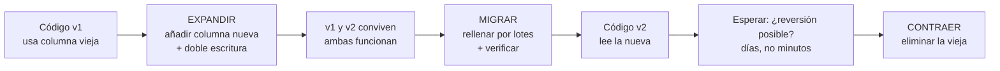

# 049 — Migraciones evolutivas sin ventana de caída

> [Programa](../../../README.md) · [Parte 10](../README.md) · [← Anterior](../../part-10-operacion-seguridad-y-gobierno/048-respaldo-y-restauracion-probada/README.md) · [Siguiente →](../../part-10-operacion-seguridad-y-gobierno/050-control-de-acceso-y-seguridad-por-fila/README.md)

| | |
|---|---|
| **Parte** | 10 — Operación, seguridad y gobierno |
| **Nivel** | Avanzado |
| **Horas estimadas** | 3 |
| **Motores** | `postgresql`, `mysql` |
| **Laboratorio** | [`labs/03-transactions`](../../../labs/03-transactions/README.md) |
| **Fuentes** | 3 |

**Conceptos centrales:** `expandir y contraer` · `doble escritura` · `relleno` · `compatibilidad hacia atras`

---

## Propósito

Cambiar el esquema mientras la aplicación sirve tráfico. La técnica se resume en una idea: nunca hacer un cambio incompatible; hacer dos compatibles con un periodo de convivencia en medio.

## Resultados de aprendizaje

Al terminar podrás:

1. Aplicar el patrón expandir-migrar-contraer.
2. Identificar qué operaciones DDL bloquean y por cuánto.
3. Diseñar una doble escritura con relleno y verificación.
4. Escribir migraciones idempotentes y reversibles.
5. Reconocer el cambio que sí exige una ventana de parada.

## Fundamentos

### Expandir, migrar, contraer

Ambler y Sadalage formalizaron la técnica. Todo cambio incompatible se descompone en tres despliegues:

```text
1. EXPANDIR   Añadir lo nuevo sin quitar lo viejo. Ambas versiones del código funcionan.
2. MIGRAR     Rellenar los datos nuevos. Cambiar el código para usarlos. Verificar.
3. CONTRAER   Eliminar lo viejo, cuando ya nadie lo usa.
```

La regla que lo hace funcionar: **en todo momento, la versión antigua y la nueva del código deben poder ejecutarse contra el mismo esquema**. Durante un despliegue gradual conviven, y en una reversión también.

| Cambio deseado | Expandir | Migrar | Contraer |
|---|---|---|---|
| Renombrar columna | Añadir la nueva | Copiar + doble escritura + cambiar lecturas | Eliminar la antigua |
| Cambiar tipo | Añadir columna con el tipo nuevo | Convertir + doble escritura | Eliminar la antigua |
| Dividir tabla | Crear la nueva + vista de compatibilidad | Copiar + cambiar escrituras | Eliminar la antigua |
| Añadir `NOT NULL` | Añadir `CHECK NOT VALID` | Corregir nulos + `VALIDATE` | Convertir a `NOT NULL` |
| Añadir clave foránea | `NOT VALID` | Corregir huérfanos + `VALIDATE` | — |

### Qué bloquea y por cuánto

Este es el conocimiento operativo que evita incidentes:

| Operación | PostgreSQL |
|---|---|
| `ADD COLUMN` sin valor por defecto | Instantáneo (bloqueo breve) |
| `ADD COLUMN ... DEFAULT` | Instantáneo desde PG 11 |
| `ADD COLUMN ... NOT NULL` sin defecto | **Falla** si hay filas |
| `DROP COLUMN` | Instantáneo (marca como borrada) |
| `ALTER TYPE` que exige conversión | **Reescribe la tabla**: bloqueo largo |
| `CREATE INDEX` | **Bloquea escrituras** |
| `CREATE INDEX CONCURRENTLY` | No bloquea; más lento; puede fallar y dejar un índice inválido |
| `ADD CONSTRAINT ... NOT VALID` | Instantáneo |
| `VALIDATE CONSTRAINT` | Barrido sin bloquear escrituras |
| `SET NOT NULL` con `CHECK` validado previo | Instantáneo desde PG 12 |

**La trampa de la cola de bloqueos.** Un `ALTER TABLE` que necesita un bloqueo exclusivo espera a que terminen las transacciones en curso, y **mientras espera bloquea a todas las que llegan detrás**. Una consulta de informe de 10 minutos convierte un `ALTER` instantáneo en 10 minutos de indisponibilidad total de esa tabla.

La defensa es siempre la misma:

```sql
SET lock_timeout = '3s';
ALTER TABLE ... ;   -- si no consigue el bloqueo en 3 s, falla y se reintenta después
```

En MySQL, además, hay que recordar que **el DDL no es transaccional** (clase 014): una migración de varios pasos que falla a la mitad no se revierte sola.



## Ejemplo trabajado

Objetivo: renombrar `enrollments.nota` a `calificacion` y cambiar su tipo de `REAL` a `NUMERIC(2,1)`. Tabla de 5 millones de filas, 400 escrituras/s.

**Lo que NO se puede hacer:**

```sql
ALTER TABLE enrollments RENAME COLUMN nota TO calificacion;
```

Instantáneo en el motor y **catastrófico**: todo el código desplegado que dice `nota` falla desde ese instante, incluidas las instancias que aún no se han actualizado.

### Paso 1 — Expandir

```sql
SET lock_timeout = '3s';
ALTER TABLE enrollments ADD COLUMN calificacion NUMERIC(2,1);   -- instantáneo

CREATE OR REPLACE FUNCTION sync_calificacion() RETURNS TRIGGER AS $$
BEGIN
  -- Doble escritura en ambos sentidos: el código viejo escribe `nota`,
  -- el nuevo escribe `calificacion`, y ambos quedan sincronizados.
  IF NEW.calificacion IS DISTINCT FROM OLD.calificacion THEN
    NEW.nota := NEW.calificacion::real;
  ELSIF NEW.nota IS DISTINCT FROM OLD.nota THEN
    NEW.calificacion := NEW.nota::numeric(2,1);
  END IF;
  RETURN NEW;
END; $$ LANGUAGE plpgsql;

CREATE TRIGGER trg_sync_calificacion BEFORE INSERT OR UPDATE ON enrollments
FOR EACH ROW EXECUTE FUNCTION sync_calificacion();
```

Aquí no ha cambiado nada para el código existente. Se puede revertir sin consecuencias.

### Paso 2 — Rellenar por lotes

Un `UPDATE` único de 5 millones de filas mantendría un bloqueo enorme, generaría 5 millones de versiones muertas y un WAL gigantesco.

```sql
DO $$
DECLARE ultimo RECORD; n INTEGER;
BEGIN
  LOOP
    WITH lote AS (
      SELECT student_id, course_id FROM enrollments
      WHERE calificacion IS NULL AND nota IS NOT NULL
      ORDER BY student_id, course_id LIMIT 10000 FOR UPDATE SKIP LOCKED
    )
    UPDATE enrollments e SET calificacion = e.nota::numeric(2,1)
    FROM lote l WHERE e.student_id = l.student_id AND e.course_id = l.course_id;
    GET DIAGNOSTICS n = ROW_COUNT;
    EXIT WHEN n = 0;
    COMMIT;             -- transacción corta por lote
    PERFORM pg_sleep(0.1);   -- dar aire al autovacuum y a la réplica
  END LOOP;
END $$;
```

`SKIP LOCKED` evita esperar a filas que la aplicación está modificando. La pausa evita que el relleno dispare el retraso de réplica (clase 043).

### Paso 3 — Verificar antes de seguir

```sql
SELECT count(*) FROM enrollments
WHERE nota IS DISTINCT FROM calificacion::real;   -- debe ser 0
```

**Esta consulta es la puerta.** Si no da cero, no se avanza.

### Paso 4 — Desplegar el código que lee `calificacion`

Despliegue gradual. Durante horas conviven instancias que leen una y otra columna; el disparador mantiene ambas correctas.

### Paso 5 — Esperar

Días, no minutos. Es la ventana en la que una reversión del código sigue siendo posible sin tocar la base.

### Paso 6 — Contraer

```sql
SET lock_timeout = '3s';
DROP TRIGGER trg_sync_calificacion ON enrollments;
ALTER TABLE enrollments DROP COLUMN nota;
```

**Resumen de la operación:**

| Paso | Duración | Bloqueo | ¿Reversible? |
|---|---|---|---|
| 1 Expandir | < 1 s | Breve | Sí |
| 2 Rellenar | ~2 h | Ninguno | Sí |
| 3 Verificar | minutos | Ninguno | Sí |
| 4 Desplegar | ~30 min | Ninguno | Sí |
| 5 Esperar | días | Ninguno | Sí |
| 6 Contraer | < 1 s | Breve | **No** |

Cinco de seis pasos son reversibles. Solo el último no lo es, y para entonces ya se ha demostrado que nadie usa la columna vieja.

### El cambio que sí exige parada

No todo se puede hacer en caliente. Ejemplos honestos: cambiar la clave primaria de una tabla enorme referenciada por muchas otras, o una reorganización que exige reescribir el conjunto sin espacio para una copia. Ahí la decisión correcta es programar una ventana, comunicarla y ensayarla sobre una copia restaurada (clase 048), no forzar un procedimiento en caliente que se quedará a medias.

## Comparación

| Enfoque | Caída | Riesgo | Duración total |
|---|---|---|---|
| `ALTER` directo | Sí, mientras dure | Alto | Minutos |
| Expandir-migrar-contraer | Ninguna | Bajo | Días |
| Tabla sombra + intercambio | Segundos | Medio | Horas |
| Herramienta en línea (`gh-ost`, `pt-osc`) | Ninguna | Medio | Horas |

## Errores frecuentes

1. **`RENAME COLUMN` en caliente.** Rompe todo el código desplegado.
2. **`ALTER` sin `lock_timeout`.** Una consulta larga bloquea la tabla entera.
3. **`UPDATE` masivo en una sola transacción.** Hinchazón, WAL enorme, retraso de réplica.
4. **`CREATE INDEX` sin `CONCURRENTLY` en producción.** Bloquea escrituras.
5. **Contraer el mismo día que se despliega.** No queda margen de reversión.
6. **Migraciones no idempotentes.** Un reintento tras un fallo parcial falla o duplica.
7. **No verificar entre pasos.** Se avanza sobre datos incompletos.

## De la clase a la operación

Las migraciones son el cambio con mayor probabilidad de causar una caída, porque se prueban con datos de desarrollo y se ejecutan sobre datos de producción. Ensayarlas contra una copia restaurada del tamaño real es la práctica que más incidentes evita.

## Reto de transferencia

1. Elige un cambio incompatible real y descomponlo en los tres pasos.
2. Implementa la doble escritura y demuestra que ambas versiones del código funcionan.
3. Rellena por lotes midiendo el retraso de réplica durante el proceso.
4. Escribe la consulta de verificación que actúa como puerta entre pasos.

## Preguntas de evaluación

1. ¿Por qué `RENAME COLUMN` es peligroso si es instantáneo en el motor?
2. Explica la cola de bloqueos y cómo `lock_timeout` la evita.
3. ¿Qué aporta `SKIP LOCKED` en un relleno por lotes?
4. Da un cambio de tu esquema que sí exigiría una ventana de parada, y justifícalo.

---

## Laboratorio

```bash
python scripts/validate_repository.py
python labs/03-transactions/run_lab.py
```

Guarda como evidencia la salida completa, la versión del motor y la semilla o
los parámetros usados. Una captura sin comando no es evidencia: no se puede
repetir.

## Evaluación

| Criterio | Peso | Qué se comprueba |
|---|---:|---|
| Comprensión conceptual | 25 % | Explica el mecanismo, no solo el resultado |
| Ejecución reproducible | 25 % | Otra persona obtiene lo mismo con las instrucciones dadas |
| Interpretación basada en evidencia | 25 % | Cada conclusión se apoya en una salida o una medición |
| Límites y riesgos declarados | 25 % | Dice qué no demuestra el ejercicio y qué faltaría en producción |

La clase se da por superada cuando la respuesta explica el mecanismo, muestra
la salida que la respalda y declara al menos un límite del ejercicio.

## Fuentes de esta clase

Todo lo afirmado arriba procede de estas obras. Los identificadores viven en
[`catalog/sources.json`](../../../catalog/sources.json) y el estado de los
enlaces se comprueba con `python scripts/check_external_links.py`.

- **Scott W. Ambler, Pramod J. Sadalage** (2006). [Refactoring Databases: Evolutionary Database Design](https://databaserefactoring.com/). Addison-Wesley. ISBN 978-0-321-29353-4.  
  Migraciones con período de transición y compatibilidad hacia atras.
- **Martin Kleppmann** (2017). [Designing Data-Intensive Applications](https://dataintensive.net/). O'Reilly. ISBN 978-1-4493-7332-0.  
  Referencia central del programa para replicación, partición, transacciones distribuidas y streaming.
- **PostgreSQL Global Development Group** (2026). [PostgreSQL Documentation](https://www.postgresql.org/docs/current/).  
  Documentación de referencia del motor relacional principal del programa.

---

> [Programa](../../../README.md) · [Parte 10](../README.md) · [← Anterior](../../part-10-operacion-seguridad-y-gobierno/048-respaldo-y-restauracion-probada/README.md) · [Siguiente →](../../part-10-operacion-seguridad-y-gobierno/050-control-de-acceso-y-seguridad-por-fila/README.md)
