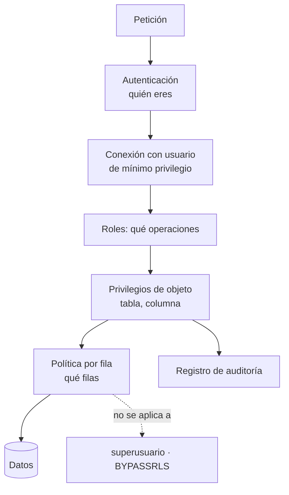

## Propósito

Declarar quién puede ver y hacer qué, en el motor y no solo en la aplicación. El control de acceso que vive únicamente en el código se salta con una consola y unas credenciales.

## Resultados de aprendizaje

Al terminar podrás:

1. Diseñar roles con privilegio mínimo y separación de funciones.
2. Distinguir privilegios de objeto, de columna y de fila.
3. Implementar seguridad por fila para multiinquilino.
4. Reconocer los riesgos de `SECURITY DEFINER` y del rol `PUBLIC`.
5. Auditar los privilegios efectivos de una base.

## Fundamentos

### Privilegio mínimo

Cada actor recibe **solo** lo que necesita. NIST SP 800-53 lo formaliza como control AC-6; OWASP lo sitúa como A01 (control de acceso roto), la categoría número uno de su Top 10.

La estructura habitual separa el **rol** (permisos) del **usuario** (identidad):

```sql
-- Roles por función, sin capacidad de conectarse
CREATE ROLE app_lectura   NOLOGIN;
CREATE ROLE app_escritura NOLOGIN;
CREATE ROLE app_migracion NOLOGIN;

GRANT USAGE ON SCHEMA public TO app_lectura, app_escritura, app_migracion;
GRANT SELECT ON ALL TABLES IN SCHEMA public TO app_lectura;
GRANT SELECT, INSERT, UPDATE, DELETE ON ALL TABLES IN SCHEMA public TO app_escritura;
GRANT ALL ON SCHEMA public TO app_migracion;

-- Los futuros objetos también, o el rol se queda obsoleto en la próxima migración
ALTER DEFAULT PRIVILEGES IN SCHEMA public
  GRANT SELECT ON TABLES TO app_lectura;

-- Usuarios: identidades que se conectan
CREATE USER svc_api        LOGIN PASSWORD '...' IN ROLE app_escritura;
CREATE USER svc_informes   LOGIN PASSWORD '...' IN ROLE app_lectura;
CREATE USER svc_migraciones LOGIN PASSWORD '...' IN ROLE app_migracion;
```

Tres cuentas con tres alcances distintos. Si se filtran las credenciales de `svc_informes`, el atacante lee; no borra.

**`ALTER DEFAULT PRIVILEGES` es imprescindible:** sin él, cada tabla nueva creada por una migración queda invisible para el rol de lectura, y alguien acaba «arreglándolo» con un `GRANT ALL`.

### Errores estructurales de PostgreSQL por defecto

```sql
-- Hasta PG 14, cualquiera podía crear objetos en el esquema public
REVOKE CREATE ON SCHEMA public FROM PUBLIC;
-- Cualquiera puede conectarse a cualquier base
REVOKE CONNECT ON DATABASE mi_base FROM PUBLIC;
```

`PUBLIC` no es «los administradores»: es **todo rol existente**. Los CIS Benchmarks incluyen ambas revocaciones entre sus controles de configuración endurecida.

### Seguridad por fila

Los privilegios de tabla son de todo o nada. Para multiinquilino hace falta filtrar por fila **en el motor**:

```sql
ALTER TABLE enrollments ENABLE ROW LEVEL SECURITY;
ALTER TABLE enrollments FORCE  ROW LEVEL SECURITY;   -- aplicar también al dueño

CREATE POLICY inquilino_aislado ON enrollments
  USING       (tenant_id = current_setting('app.tenant_id')::int)
  WITH CHECK  (tenant_id = current_setting('app.tenant_id')::int);
```

- `USING` filtra lo que se **lee** (y lo que se puede actualizar o borrar).
- `WITH CHECK` valida lo que se **escribe**: sin él, un inquilino podría insertar filas atribuidas a otro.

La aplicación fija la variable al tomar la conexión del agrupador:

```python
with pool.connection() as conn:
    conn.execute("SELECT set_config('app.tenant_id', %s, true)", (tenant,))
    # `true` = local a la transacción: se limpia al terminar, y una conexión
    # reutilizada del agrupador no hereda el inquilino de la petición anterior.
```

El tercer argumento `true` es la diferencia entre un aislamiento correcto y una fuga entre inquilinos con agrupadores de conexiones.

**Advertencia:** la seguridad por fila **no** se aplica a superusuarios ni a roles con `BYPASSRLS`. La aplicación nunca debe conectarse como superusuario, aquí menos que nunca.

### `SECURITY DEFINER`

Una función `SECURITY DEFINER` se ejecuta con los privilegios de quien la creó, no de quien la llama. Es útil y es la vía habitual de escalada de privilegios si se escribe mal:

```sql
CREATE FUNCTION resumen_curso(cid int) RETURNS TABLE(...) AS $$
  SELECT ... FROM enrollments WHERE course_id = cid;
$$ LANGUAGE sql SECURITY DEFINER SET search_path = pg_catalog, public;
```

`SET search_path` es obligatorio: sin él, quien llama puede crear un objeto en un esquema propio que sombree al real y hacer que la función ejecute su código con privilegios ajenos.



## Ejemplo trabajado

Plataforma multiinquilino: cada institución ve solo sus datos. Además, los docentes ven las notas de sus cursos y los estudiantes solo las propias.

```sql
ALTER TABLE enrollments ENABLE ROW LEVEL SECURITY;
ALTER TABLE enrollments FORCE  ROW LEVEL SECURITY;

-- Aislamiento entre instituciones: se aplica SIEMPRE, encima de todo lo demás
CREATE POLICY p_inquilino ON enrollments
  AS RESTRICTIVE
  USING (tenant_id = current_setting('app.tenant_id')::int);

-- Un estudiante ve sus propias inscripciones
CREATE POLICY p_estudiante ON enrollments
  FOR SELECT TO rol_estudiante
  USING (student_id = current_setting('app.user_id')::int);

-- Un docente ve las de los cursos que dicta
CREATE POLICY p_docente ON enrollments
  FOR SELECT TO rol_docente
  USING (EXISTS (SELECT 1 FROM teaching t
                 WHERE t.course_id = enrollments.course_id
                   AND t.teacher_id = current_setting('app.user_id')::int));

-- Y solo el docente puede calificar, solo sus cursos
CREATE POLICY p_docente_califica ON enrollments
  FOR UPDATE TO rol_docente
  USING      (EXISTS (SELECT 1 FROM teaching t WHERE t.course_id = enrollments.course_id
                        AND t.teacher_id = current_setting('app.user_id')::int))
  WITH CHECK (EXISTS (SELECT 1 FROM teaching t WHERE t.course_id = enrollments.course_id
                        AND t.teacher_id = current_setting('app.user_id')::int));
```

**Cómo se combinan las políticas** —esto es lo que se entiende mal—:

- Las políticas **permisivas** (por defecto) se combinan con **OR**: basta que una permita.
- Las **restrictivas** se combinan con **AND**: todas deben permitir.

Por eso `p_inquilino` es `RESTRICTIVE`: garantiza que ninguna política permisiva futura pueda saltarse el aislamiento entre instituciones. Si fuera permisiva, añadir mañana una política de «administrador ve todo» abriría un agujero entre inquilinos.

**Privilegios de columna** para datos sensibles:

```sql
REVOKE SELECT ON students FROM app_lectura;
GRANT  SELECT (id, nombre, email) ON students TO app_lectura;   -- sin RUT ni dirección
```

**Verificación, que es lo que convierte esto en ingeniería:**

```sql
SET app.tenant_id = '1';
SET app.user_id   = '11';
SET ROLE rol_estudiante;

SELECT count(*) FROM enrollments;             -- solo las del estudiante 11
SELECT count(*) FROM enrollments WHERE student_id <> 11;   -- debe ser 0
INSERT INTO enrollments (tenant_id, student_id, course_id) VALUES (2, 11, 1);
-- ERROR: new row violates row-level security policy
RESET ROLE;
```

Estas comprobaciones deben ser **pruebas automatizadas**. Una política de seguridad sin prueba es una intención.

**Auditoría de privilegios efectivos:**

```sql
SELECT grantee, table_name, string_agg(privilege_type, ', ') AS privilegios
FROM information_schema.role_table_grants
WHERE table_schema = 'public'
GROUP BY grantee, table_name ORDER BY grantee, table_name;

SELECT rolname, rolsuper, rolbypassrls, rolcreatedb FROM pg_roles
WHERE rolsuper OR rolbypassrls;    -- debe ser una lista muy corta y conocida
```

## Comparación

| Necesidad | Mecanismo |
|---|---|
| Servicio que solo lee | Rol con `SELECT` |
| Ocultar columnas sensibles | Privilegios de columna o vista |
| Aislar inquilinos | Política restrictiva por fila |
| Un usuario ve solo lo suyo | Política permisiva por fila |
| Operación privilegiada acotada | `SECURITY DEFINER` con `search_path` fijo |
| Saber quién hizo qué | Registro de auditoría |

## Errores frecuentes

1. **La aplicación se conecta como superusuario.** Ignora toda la seguridad por fila.
2. **Un solo usuario para todo.** Una filtración lo compromete todo.
3. **`set_config` sin `local = true`.** El inquilino persiste en la conexión reutilizada del agrupador: fuga entre inquilinos.
4. **Política sin `WITH CHECK`.** Se puede escribir en el ámbito de otro.
5. **Olvidar `ALTER DEFAULT PRIVILEGES`.** Las tablas nuevas quedan mal permisionadas.
6. **`PUBLIC` con privilegios.** Aplica a todos los roles.
7. **`SECURITY DEFINER` sin `search_path`.** Escalada de privilegios.

## De la clase a la operación

Las filtraciones de datos multiinquilino rara vez son un fallo del motor: son un `WHERE tenant_id = ?` que faltaba en una consulta nueva. La seguridad por fila hace que ese olvido sea imposible, porque el filtro deja de depender de que alguien lo escriba.

## Reto de transferencia

1. Diseña tres roles con privilegio mínimo para tu sistema.
2. Implementa el aislamiento entre inquilinos con una política restrictiva.
3. Escribe pruebas automatizadas que intenten leer y escribir fuera del ámbito.
4. Audita los privilegios efectivos y los roles con `BYPASSRLS`.

## Preguntas de evaluación

1. ¿Por qué la política de inquilino debe ser restrictiva y no permisiva?
2. Explica la fuga que produce `set_config` sin ámbito local en un agrupador.
3. ¿Qué añade `WITH CHECK` que `USING` no cubre?
4. Da un caso donde `SECURITY DEFINER` sea necesario y cómo lo asegurarías.
