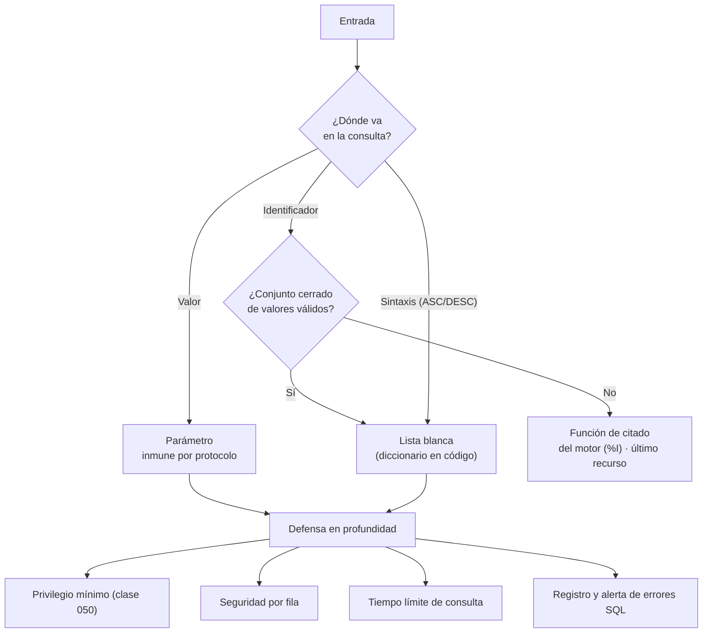

# 051 — Inyección SQL y el contrato de parametrización

> [Programa](../../../README.md) · [Parte 10](../README.md) · [← Anterior](../../part-10-operacion-seguridad-y-gobierno/050-control-de-acceso-y-seguridad-por-fila/README.md) · [Siguiente →](../../part-10-operacion-seguridad-y-gobierno/052-observabilidad-slo-y-capacidad/README.md)

Parte 10 — Operación, seguridad y gobierno · Fundamentos ·
3 horas estimadas · motores `postgresql`, `sqlite`, `mysql` · laboratorio
[`labs/01-sql-foundations`](../../../labs/01-sql-foundations/README.md) · 4 fuentes.

**Conceptos centrales:** `consulta parametrizada` · `identificador dinamico` · `lista blanca` · `defensa en profundidad`

**En este caso se comparan 7 motores**: 5 lo resuelven (5 con el resultado comprobado por máquina) y 2 no, con el motivo escrito.

---

## Propósito

Eliminar la inyección SQL por construcción, entendiendo por qué la parametrización funciona y qué casos no cubre — que son justamente donde siguen apareciendo las vulnerabilidades.

## Resultados de aprendizaje

Al terminar podrás:

1. Explicar por qué una consulta parametrizada es inmune, a nivel de protocolo.
2. Identificar las cuatro partes de una consulta que **no** admiten parámetros.
3. Aplicar listas blancas y funciones de citado para esos casos.
4. Reconocer inyección de segundo orden y en consultas dinámicas del servidor.
5. Aplicar defensa en profundidad más allá de la parametrización.

## Fundamentos

### Por qué funciona la parametrización

La inyección ocurre porque el motor recibe **una sola cadena** y decide qué es código y qué es dato al analizarla. Si el dato contiene sintaxis, se convierte en código.

Con una consulta parametrizada, el cliente envía **dos cosas separadas** por el protocolo:

```text
1. La plantilla:  SELECT * FROM students WHERE email = $1
   → el motor la analiza y planifica AHORA, sin ver ningún valor
2. Los valores:   ['ana@ejemplo.cl'"; DROP TABLE students;--']
   → llegan después, cuando el árbol sintáctico YA está fijado
```

El valor **nunca pasa por el analizador sintáctico**. No es que se escape bien: es que no hay nada que escapar, porque no participa en el análisis. Es una garantía estructural, no una comprobación.

OWASP lo sitúa como la defensa principal y la especificación PEP 249 la define para todo cliente Python conforme.

```python
# CORRECTO
cur.execute("SELECT * FROM students WHERE email = %s", (email,))
cur.execute("SELECT * FROM students WHERE email = ?", (email,))   # sqlite3

# VULNERABLE — todas las formas, incluida la que parece moderna
cur.execute("SELECT * FROM students WHERE email = '" + email + "'")
cur.execute("SELECT * FROM students WHERE email = '%s'" % email)
cur.execute(f"SELECT * FROM students WHERE email = '{email}'")
```

La tercera es hoy la más frecuente: la f-string parece limpia y es exactamente la misma concatenación.

### Lo que no se puede parametrizar

Un parámetro ocupa el lugar de un **valor**. No puede ocupar el lugar de un identificador ni de sintaxis, porque el motor necesita ambos para analizar la consulta:

| Elemento | ¿Parametrizable? | Solución |
|---|---|---|
| Valor en `WHERE`, `VALUES`, `SET` | **Sí** | Parámetro |
| Nombre de tabla o columna | No | **Lista blanca** |
| Dirección de `ORDER BY` | No | Lista blanca (`ASC`/`DESC`) |
| Nombre de esquema | No | Lista blanca |
| Número de elementos de `IN` | Parcial | Generar tantos marcadores como elementos, o pasar un arreglo |
| `LIMIT` / `OFFSET` | Sí en la mayoría | Parámetro, y validar que sea entero |

**La lista blanca es la única defensa correcta para identificadores.** No una expresión regular, no un escape: una comparación contra un conjunto cerrado de valores permitidos, definido en el código.

```python
ORDENABLES = {"nombre": "s.nombre", "nota": "e.nota", "fecha": "e.registrada_en"}
SENTIDOS  = {"asc": "ASC", "desc": "DESC"}

def listar(cur, orden: str, sentido: str, limite: int):
    col = ORDENABLES.get(orden)
    dir_ = SENTIDOS.get(sentido.lower())
    if col is None or dir_ is None:
        raise ValueError("orden no permitido")
    # `col` y `dir_` salen del diccionario, NUNCA de la entrada del usuario:
    # la entrada solo se usa como clave de búsqueda.
    cur.execute(f"SELECT s.nombre, e.nota FROM ... ORDER BY {col} {dir_} LIMIT %s",
                (min(int(limite), 100),))
```

La clave está en el comentario: lo que se interpola es el **valor del diccionario**, no la entrada. La entrada solo decide qué valor conocido se usa.

### Inyección de segundo orden

El dato entra parametrizado —y por tanto se guarda íntegro, con sus comillas— y se inyecta **después**, cuando otro proceso lo concatena:

```python
# Paso 1: guardado correctamente
cur.execute("INSERT INTO students (nombre) VALUES (%s)", ("Ana'; DROP TABLE x;--",))

# Paso 2: un informe lo lee de la base y lo concatena. Aquí ocurre la inyección.
nombre = cur.execute("SELECT nombre FROM students WHERE id=1").fetchone()[0]
cur.execute(f"SELECT * FROM logs WHERE usuario = '{nombre}'")   # VULNERABLE
```

La lección: **todo dato es entrada, venga de donde venga**. Que esté en la base no lo hace confiable.

### SQL dinámico en el servidor

Dentro de una función PL/pgSQL, el problema reaparece:

```sql
-- VULNERABLE
EXECUTE 'SELECT * FROM ' || tabla || ' WHERE id = ' || id;

-- CORRECTO: format con %I (identificador citado) y %L (literal citado)
EXECUTE format('SELECT * FROM %I WHERE id = %L', tabla, id);

-- MEJOR: identificador por lista blanca, valor por parámetro real
EXECUTE format('SELECT * FROM %I WHERE id = $1', tabla) USING id;
```

`%I` cita como identificador y `%L` como literal. `USING` pasa un parámetro de verdad.



## Ejemplo trabajado

Buscador de cursos con filtros opcionales y orden configurable: el caso donde más veces se abandona la parametrización «porque es dinámico».

```python
ORDENABLES = {"nombre": "c.nombre", "periodo": "c.periodo",
              "inscritos": "inscritos"}
SENTIDOS   = {"asc": "ASC", "desc": "DESC"}

def buscar_cursos(cur, *, texto=None, periodo=None, min_inscritos=None,
                  orden="nombre", sentido="asc", limite=50):
    condiciones, params = [], []

    # Cada filtro añade su condición Y su parámetro: la consulta crece
    # dinámicamente, los valores nunca se concatenan.
    if texto:
        condiciones.append("c.nombre ILIKE %s")
        params.append(f"%{texto}%")
    if periodo:
        condiciones.append("c.periodo = %s")
        params.append(periodo)
    if min_inscritos is not None:
        condiciones.append("(SELECT count(*) FROM enrollments e "
                           " WHERE e.course_id = c.id) >= %s")
        params.append(int(min_inscritos))

    where = f"WHERE {' AND '.join(condiciones)}" if condiciones else ""

    col = ORDENABLES.get(orden)
    dir_ = SENTIDOS.get(str(sentido).lower())
    if col is None or dir_ is None:
        raise ValueError("parámetro de orden no permitido")

    params.append(min(max(int(limite), 1), 200))

    sql = f"""
        SELECT c.id, c.nombre, c.periodo,
               (SELECT count(*) FROM enrollments e WHERE e.course_id = c.id) AS inscritos
        FROM courses c
        {where}
        ORDER BY {col} {dir_}, c.id
        LIMIT %s
    """
    cur.execute(sql, params)
    return cur.fetchall()
```

**Por qué es seguro:**

- Toda la sintaxis interpolada (`where`, `col`, `dir_`) procede de **literales del código** o de diccionarios cerrados.
- Todos los valores del usuario van como parámetros.
- El límite está acotado: evita que alguien pida un millón de filas.
- `ORDER BY ... , c.id` da orden total (clase 015).

**Comprobación con entradas hostiles:**

```python
buscar_cursos(cur, texto="'; DROP TABLE courses;--")
# → busca literalmente ese texto. 0 resultados. Ninguna tabla borrada.

buscar_cursos(cur, orden="nombre; DROP TABLE courses;--")
# → ValueError: parámetro de orden no permitido

buscar_cursos(cur, periodo="2026-1' OR '1'='1")
# → busca ese período literal. 0 resultados.
```

**Defensa en profundidad**, porque ningún control único es suficiente:

```sql
-- 1. El usuario de la aplicación no puede borrar tablas
REVOKE ALL ON SCHEMA public FROM svc_api;
GRANT  SELECT, INSERT, UPDATE ON ALL TABLES IN SCHEMA public TO svc_api;

-- 2. Tiempo límite: una inyección basada en tiempo se corta
ALTER ROLE svc_api SET statement_timeout = '10s';

-- 3. Sin acceso a metadatos innecesarios
REVOKE SELECT ON pg_authid FROM PUBLIC;
```

Con estas tres medidas, una inyección que llegara a ejecutarse encontraría un usuario que no puede escribir en el catálogo, con consultas cortadas a los 10 segundos y sin poder enumerar credenciales.

## Comparación

| Técnica | Eficacia | Nota |
|---|---|---|
| Consulta parametrizada | **Total** para valores | La defensa principal |
| Lista blanca de identificadores | **Total** | Única correcta para nombres |
| Función de citado del motor (`%I`) | Alta | Solo si la lista blanca es imposible |
| Escape manual | **Baja** | Depende de codificación y motor; no usar |
| Cortafuegos de aplicación | Parcial | Complemento, nunca sustituto |
| ORM | Alta por defecto | Se pierde con SQL en crudo |

## Errores frecuentes

1. **f-strings con entrada de usuario.** La forma moderna del mismo error de siempre.
2. **Escape manual.** Existen bypass por codificación y por multibyte.
3. **Confiar en datos de la base.** Inyección de segundo orden.
4. **`ORDER BY` desde la petición sin lista blanca.** El vector más frecuente hoy.
5. **SQL en crudo dentro de un ORM sin parametrizar.** Se pierde toda la protección.
6. **Devolver el error SQL al cliente.** Regala el esquema al atacante.
7. **La aplicación con privilegios de administrador.** Convierte una inyección en un desastre.

## De la clase a la operación

Las inyecciones que llegan a producción hoy casi nunca están en el `WHERE`: están en el `ORDER BY`, en un nombre de tabla dinámico o en un informe que concatena datos leídos de la propia base. Buscar concatenación de cadenas cerca de la palabra `execute` en toda la base de código es una auditoría de una tarde con mucho retorno.

## Reto de transferencia

1. Busca en tu proyecto toda construcción de SQL por concatenación o f-string.
2. Convierte los valores a parámetros y los identificadores a lista blanca.
3. Escribe pruebas con entradas hostiles que demuestren el comportamiento seguro.
4. Aplica las tres medidas de defensa en profundidad y verifica cada una.

## Preguntas de evaluación

1. Explica a nivel de protocolo por qué un parámetro no puede inyectar.
2. ¿Por qué el nombre de una columna no se puede parametrizar?
3. Describe un caso de inyección de segundo orden en tu propio sistema.
4. Si una inyección llegara a ejecutarse, ¿qué podría hacer con tus privilegios actuales?

---

## 🌐 El mismo problema en cada motor

**Caso:** El texto que buscaba ser código y se quedó en dato

Alguien escribe `' OR '1'='1` en un formulario de búsqueda. Si la aplicación
construye la consulta pegando cadenas, lo que llega al motor deja de ser una
búsqueda: `WHERE nombre = '' OR '1'='1'` devuelve **todos** los usuarios,
incluido el administrador. Si la aplicación usa un parámetro, la consulta y
el valor viajan por caminos distintos, el texto nunca se analiza como SQL y
el resultado es cero: no hay ningún usuario que se llame así.

Esa es toda la defensa, y no es una biblioteca ni un cortafuegos: es no
construir sentencias con concatenación. El caso lo comprueba en cada motor,
y la matriz añade lo que casi nadie mira: que **el mismo problema existe sin
SQL** —en MongoDB, en Redis, en un índice de búsqueda— con otra sintaxis.

Salida esperada, idéntica en todos los motores que lo resuelven:

| encontrados |
|---|
| `0` |

El contrato vive en [`motores.yaml`](motores.yaml) y lo comprueba
`python scripts/verificar_equivalencia.py --clase 051`: 5 de
las 5 implementaciones se ejecutan de verdad y su
resultado se compara con esa tabla; el resto se declara como material revisado,
no ejecutado.

| Motor | ¿Resuelve el caso? | Nivel de prueba | Código | Fuente |
|---|---|---|---|---|
| SQLite | sí | núcleo | [código](implementaciones/sqlite/consulta.sql) | [doc oficial](https://sqlite.org/lang_expr.html) |
| DuckDB | sí | núcleo | [código](implementaciones/duckdb/consulta.sql) | [doc oficial](https://duckdb.org/docs/stable/sql/query_syntax/prepared_statements) |
| PostgreSQL | sí | servicio | [código](implementaciones/postgresql/consulta.sql) | [doc oficial](https://www.postgresql.org/docs/current/plpgsql-statements.html) |
| MySQL | sí | servicio | [código](implementaciones/mysql/consulta.sql) | [doc oficial](https://dev.mysql.com/doc/refman/8.4/en/sql-prepared-statements.html) |
| MongoDB | sí | servicio | [código](implementaciones/mongodb/consulta.js) | [doc oficial](https://www.mongodb.com/docs/manual/faq/fundamentals/) |
| Redis | **no** | — | — | [doc oficial](https://redis.io/docs/latest/develop/reference/protocol-spec/) |
| OpenSearch | **no** | — | — | [doc oficial](https://docs.opensearch.org/latest/query-dsl/full-text/query-string/) |

### Los que resuelven el caso

#### SQLite · [`implementaciones/sqlite/consulta.sql`](implementaciones/sqlite/consulta.sql)

✅ **verificado** — se ejecuta en CI sin servicios

```sql
-- motor: sqlite
-- doc: https://sqlite.org/lang_expr.html
-- nota: en Python, la forma correcta es la de siempre:
--         cur.execute("SELECT COUNT(*) FROM usuarios WHERE nombre = ?", (entrada,))
--       Y el detalle que empuja al error: executescript() NO admite parametros,
--       asi que quien necesita varias sentencias acaba concatenando.

-- === preparacion ===
CREATE TABLE usuarios (
    nombre TEXT PRIMARY KEY,
    rol    TEXT NOT NULL
);
INSERT INTO usuarios (nombre, rol) VALUES
    ('ada', 'admin'), ('linus', 'lector'), ('grace', 'lector');

-- === consulta ===
-- Alguien escribe esto en el formulario de busqueda:   ' OR '1'='1
--
-- CONCATENADO (lo que NO se debe hacer nunca), la consulta que llega al motor
-- deja de ser una busqueda y pasa a ser otra consulta distinta:
--     SELECT ... WHERE nombre = '' OR '1'='1'
--   -> devuelve LOS TRES usuarios, incluido el administrador.
--
-- PARAMETRIZADO, el motor recibe la consulta y el valor por caminos separados:
-- el texto nunca se analiza como SQL, se compara como dato. No existe ningun
-- usuario que se llame asi, y el resultado es cero.
--
-- Aqui el valor va como literal correctamente entrecomillado, que es lo que el
-- controlador construye por dentro al usar un parametro.
SELECT COUNT(*) AS encontrados
FROM usuarios
WHERE nombre = ''' OR ''1''=''1';
```

- **Por qué sí:** Su interfaz de Python usa marcadores `?` y la biblioteca estándar rechaza pasar parámetros con `execute` sobre varias sentencias: el camino fácil es también el seguro.
- **Por qué no:** `executescript` **no** admite parámetros, así que quien necesite ejecutar varias sentencias se ve empujado a concatenar. Es un empujón hacia el error justo donde más duele.
- 📄 Documentación oficial: <https://sqlite.org/lang_expr.html>

#### DuckDB · [`implementaciones/duckdb/consulta.sql`](implementaciones/duckdb/consulta.sql)

✅ **verificado** — se ejecuta en CI sin servicios

```sql
-- motor: duckdb
-- doc: https://duckdb.org/docs/stable/sql/query_syntax/prepared_statements
-- nota: la trampa propia de la analitica: los IDENTIFICADORES —nombres de tabla
--       y de columna— no se pueden parametrizar en NINGUN motor, y en un guion
--       de analisis suelen venir de fuera. Ahi la defensa no es un parametro:
--       es una lista blanca de nombres permitidos.

-- === preparacion ===
CREATE TABLE usuarios (
    nombre VARCHAR PRIMARY KEY,
    rol    VARCHAR NOT NULL
);
INSERT INTO usuarios (nombre, rol) VALUES
    ('ada', 'admin'), ('linus', 'lector'), ('grace', 'lector');

-- === consulta ===
-- Alguien escribe esto en el formulario de busqueda:   ' OR '1'='1
--
-- CONCATENADO (lo que NO se debe hacer nunca), la consulta que llega al motor
-- deja de ser una busqueda y pasa a ser otra consulta distinta:
--     SELECT ... WHERE nombre = '' OR '1'='1'
--   -> devuelve LOS TRES usuarios, incluido el administrador.
--
-- PARAMETRIZADO, el motor recibe la consulta y el valor por caminos separados:
-- el texto nunca se analiza como SQL, se compara como dato. No existe ningun
-- usuario que se llame asi, y el resultado es cero.
--
-- Aqui el valor va como literal correctamente entrecomillado, que es lo que el
-- controlador construye por dentro al usar un parametro.
SELECT COUNT(*) AS encontrados
FROM usuarios
WHERE nombre = ''' OR ''1''=''1';
```

- **Por qué sí:** Admite sentencias preparadas con `?` igual que el resto, y es donde más tentador resulta saltárselas: los guiones de análisis se escriben deprisa, con nombres de tabla pegados desde una variable.
- **Por qué no:** Los identificadores —nombres de tabla y de columna— **no** se pueden parametrizar en ningún motor, y en analítica son justo lo que suele venir de fuera. Ahí la defensa es una lista blanca, no un parámetro.
- 📄 Documentación oficial: <https://duckdb.org/docs/stable/sql/query_syntax/prepared_statements>

#### PostgreSQL · [`implementaciones/postgresql/consulta.sql`](implementaciones/postgresql/consulta.sql)

✅ **verificado** — se ejecuta contra el motor real levantado con `docker compose`

```sql
-- motor: postgresql
-- doc: https://www.postgresql.org/docs/current/plpgsql-statements.html
-- nota: la puerta que sigue abierta no esta en la aplicacion, esta DENTRO de la
--       base. Esto es inyectable igual:
--         EXECUTE 'SELECT * FROM usuarios WHERE nombre = ''' || entrada || '''';
--       y la forma correcta es:
--         EXECUTE format('SELECT * FROM usuarios WHERE nombre = %L', entrada);
--       Ninguna revision del codigo de la aplicacion va a mirar ahi.

-- === preparacion ===
DROP TABLE IF EXISTS usuarios;

CREATE TABLE usuarios (
    nombre text PRIMARY KEY,
    rol    text NOT NULL
);
INSERT INTO usuarios (nombre, rol) VALUES
    ('ada', 'admin'), ('linus', 'lector'), ('grace', 'lector');

-- === consulta ===
-- Alguien escribe esto en el formulario de busqueda:   ' OR '1'='1
--
-- CONCATENADO (lo que NO se debe hacer nunca), la consulta que llega al motor
-- deja de ser una busqueda y pasa a ser otra consulta distinta:
--     SELECT ... WHERE nombre = '' OR '1'='1'
--   -> devuelve LOS TRES usuarios, incluido el administrador.
--
-- PARAMETRIZADO, el motor recibe la consulta y el valor por caminos separados:
-- el texto nunca se analiza como SQL, se compara como dato. No existe ningun
-- usuario que se llame asi, y el resultado es cero.
--
-- Aqui el valor va como literal correctamente entrecomillado, que es lo que el
-- controlador construye por dentro al usar un parametro.
SELECT COUNT(*) AS encontrados
FROM usuarios
WHERE nombre = ''' OR ''1''=''1';
```

- **Por qué sí:** El protocolo extendido separa de verdad la sentencia del valor: no es que el controlador escape bien, es que el valor viaja en otro mensaje. Y `quote_literal` y `format` con `%L` cubren los casos en que hay que construir SQL dinámico dentro de una función.
- **Por qué no:** Ese SQL dinámico dentro de funciones es la puerta que sigue abierta: `EXECUTE 'SELECT ... ' || parametro` es inyectable exactamente igual, y vive dentro de la base, donde ninguna revisión del código de la aplicación lo va a mirar.
- 📄 Documentación oficial: <https://www.postgresql.org/docs/current/plpgsql-statements.html>

#### MySQL · [`implementaciones/mysql/consulta.sql`](implementaciones/mysql/consulta.sql)

✅ **verificado** — se ejecuta contra el motor real levantado con `docker compose`

```sql
-- motor: mysql
-- doc: https://dev.mysql.com/doc/refman/8.4/en/sql-prepared-statements.html
-- nota: durante anos, PDO traia ATTR_EMULATE_PREPARES activado por omision: el
--       controlador construia la sentencia con escape en el CLIENTE en vez de
--       enviar sentencia y valor por separado. Miles de aplicaciones creyeron
--       estar parametrizando mientras concatenaban.

-- === preparacion ===
DROP TABLE IF EXISTS usuarios;

CREATE TABLE usuarios (
    nombre VARCHAR(50) PRIMARY KEY,
    rol    VARCHAR(50) NOT NULL
);
INSERT INTO usuarios (nombre, rol) VALUES
    ('ada', 'admin'), ('linus', 'lector'), ('grace', 'lector');

-- === consulta ===
-- Alguien escribe esto en el formulario de busqueda:   ' OR '1'='1
--
-- CONCATENADO (lo que NO se debe hacer nunca), la consulta que llega al motor
-- deja de ser una busqueda y pasa a ser otra consulta distinta:
--     SELECT ... WHERE nombre = '' OR '1'='1'
--   -> devuelve LOS TRES usuarios, incluido el administrador.
--
-- PARAMETRIZADO, el motor recibe la consulta y el valor por caminos separados:
-- el texto nunca se analiza como SQL, se compara como dato. No existe ningun
-- usuario que se llame asi, y el resultado es cero.
--
-- Aqui el valor va como literal correctamente entrecomillado, que es lo que el
-- controlador construye por dentro al usar un parametro.
SELECT COUNT(*) AS encontrados
FROM usuarios
WHERE nombre = ''' OR ''1''=''1';
```

- **Por qué sí:** Sentencias preparadas en el protocolo y `PREPARE`/`EXECUTE` en SQL, con la misma separación entre sentencia y valor.
- **Por qué no:** Su historial de conectores con opción de «emular» las sentencias preparadas del lado del cliente —PDO con `ATTR_EMULATE_PREPARES` activado por omisión durante años— hizo que muchas aplicaciones creyeran estar parametrizando cuando estaban concatenando con escape.
- 📄 Documentación oficial: <https://dev.mysql.com/doc/refman/8.4/en/sql-prepared-statements.html>

#### MongoDB · [`implementaciones/mongodb/consulta.js`](implementaciones/mongodb/consulta.js)

✅ **verificado** — se ejecuta contra el motor real levantado con `docker compose`

```javascript
// motor: mongodb
// doc: https://www.mongodb.com/docs/manual/faq/fundamentals/
// nota: la inyeccion clasica no existe —las consultas son documentos, no
//       cadenas— pero hay otra. Si `entrada` viene de un cuerpo JSON sin
//       comprobar el tipo y resulta ser un OBJETO:
//         entrada = { "$ne": null }
//         db.usuarios.find({ nombre: entrada })   -> devuelve TODOS
//       Eso es inyeccion de OPERADOR, y la defensa no es escapar: es comprobar
//       que lo recibido es una cadena antes de construir el filtro.

// === preparacion ===
db.usuarios.drop();
db.usuarios.insertMany([
  { nombre: "ada", rol: "admin" },
  { nombre: "linus", rol: "lector" },
  { nombre: "grace", rol: "lector" },
]);

// === consulta ===
const entrada = "' OR '1'='1";
if (typeof entrada !== "string") throw new Error("entrada no es una cadena");
print(db.usuarios.countDocuments({ nombre: entrada }));
```

- **Por qué sí:** Las consultas son documentos, no cadenas: no hay sintaxis que romper con comillas, así que la inyección clásica no existe.
- **Por qué no:** Existe otra. Si un valor recibido de fuera se inserta tal cual en el filtro y resulta ser un objeto —`{"$ne": null}` o `{"$gt": ""}`— deja de ser un dato y pasa a ser un operador: **inyección de operador**. La defensa no es escapar, es comprobar el tipo antes de construir el filtro.
- 📄 Documentación oficial: <https://www.mongodb.com/docs/manual/faq/fundamentals/>

### Los que no resuelven este caso — y qué se hace en su lugar

Descartar un motor con un argumento es tan formativo como usarlo. Ninguna de estas filas dice que el motor sea peor: dice que este problema no es el suyo.

| Motor | Por qué no | Qué se hace en su lugar | Fuente |
|---|---|---|---|
| Redis | El protocolo RESP indica la longitud de cada argumento, así que un valor no puede convertirse en otra orden: la inyección de órdenes no es posible por diseño. | Donde sí reaparece el problema es en los scripts Lua construidos con concatenación: si el guion se arma pegando texto del usuario, hay inyección de Lua. Los valores van en `KEYS` y `ARGV`, nunca dentro del texto del script. | [doc](https://redis.io/docs/latest/develop/reference/protocol-spec/) |
| OpenSearch | Sus consultas son JSON, así que no hay comillas que romper; pero tiene su propia versión del problema con `query_string`, que **sí** interpreta una sintaxis con operadores dentro de una cadena de texto del usuario. | Usar `match` en vez de `query_string` para el texto que venga de fuera, y si hace falta la sintaxis avanzada, `simple_query_string`, que ignora los errores en vez de ejecutar cosas raras. | [doc](https://docs.opensearch.org/latest/query-dsl/full-text/query-string/) |

---

## Laboratorio

```bash
python scripts/validate_repository.py
python labs/01-sql-foundations/run_lab.py
```

Guarda como evidencia la salida completa, la versión del motor y la semilla o
los parámetros usados. Una captura sin comando no es evidencia: no se puede
repetir.

## Evaluación

| Criterio | Peso | Qué se comprueba |
|---|---:|---|
| Comprensión conceptual | 25 % | Explica el mecanismo, no solo el resultado |
| Ejecución reproducible | 25 % | Otra persona obtiene lo mismo con las instrucciones dadas |
| Interpretación basada en evidencia | 25 % | Cada conclusión se apoya en una salida o una medición |
| Límites y riesgos declarados | 25 % | Dice qué no demuestra el ejercicio y qué faltaría en producción |

La clase se da por superada cuando la respuesta explica el mecanismo, muestra
la salida que la respalda y declara al menos un límite del ejercicio.

## Fuentes de esta clase

Todo lo afirmado arriba procede de estas obras. Los identificadores viven en
[`catalog/sources.json`](../../../catalog/sources.json) y el estado de los
enlaces se comprueba con `python scripts/check_external_links.py`.

- **OWASP** (2026). [SQL Injection Prevention Cheat Sheet](https://cheatsheetseries.owasp.org/cheatsheets/SQL_Injection_Prevention_Cheat_Sheet.html).  
  Consultas parametrizadas como defensa principal, con sus excepciones.
- **OWASP** (2021). [OWASP Top 10](https://owasp.org/Top10/).  
  A03 Inyección y A01 Control de acceso roto afectan directamente al diseño de datos.
- **Marc-Andre Lemburg** (1999). [PEP 249 - Python Database API Specification v2.0](https://peps.python.org/pep-0249/).  
  Contrato de parametrización que evita la concatenación de entradas.
- **Python Software Foundation** (2026). [Python: sqlite3](https://docs.python.org/3/library/sqlite3.html).  
  API DB-API 2.0 usada por los laboratorios ejecutables del repositorio.

---

> [Programa](../../../README.md) · [Parte 10](../README.md) · [← Anterior](../../part-10-operacion-seguridad-y-gobierno/050-control-de-acceso-y-seguridad-por-fila/README.md) · [Siguiente →](../../part-10-operacion-seguridad-y-gobierno/052-observabilidad-slo-y-capacidad/README.md)
