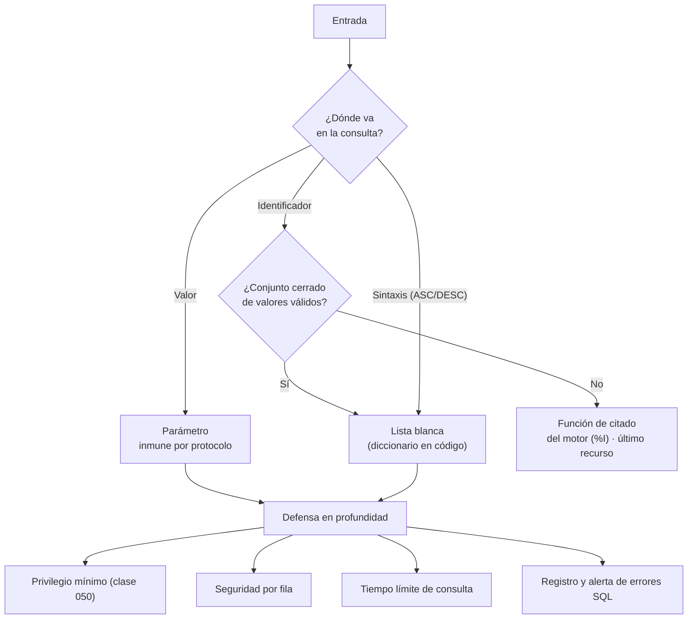

## Propósito

Eliminar la inyección SQL por construcción, entendiendo por qué la parametrización funciona y qué casos no cubre — que son justamente donde siguen apareciendo las vulnerabilidades.

## Resultados de aprendizaje

Al terminar podrás:

1. Explicar por qué una consulta parametrizada es inmune, a nivel de protocolo.
2. Identificar las cuatro partes de una consulta que **no** admiten parámetros.
3. Aplicar listas blancas y funciones de citado para esos casos.
4. Reconocer inyección de segundo orden y en consultas dinámicas del servidor.
5. Aplicar defensa en profundidad más allá de la parametrización.

## Fundamentos

### Por qué funciona la parametrización

La inyección ocurre porque el motor recibe **una sola cadena** y decide qué es código y qué es dato al analizarla. Si el dato contiene sintaxis, se convierte en código.

Con una consulta parametrizada, el cliente envía **dos cosas separadas** por el protocolo:

```text
1. La plantilla:  SELECT * FROM students WHERE email = $1
   → el motor la analiza y planifica AHORA, sin ver ningún valor
2. Los valores:   ['ana@ejemplo.cl'"; DROP TABLE students;--']
   → llegan después, cuando el árbol sintáctico YA está fijado
```

El valor **nunca pasa por el analizador sintáctico**. No es que se escape bien: es que no hay nada que escapar, porque no participa en el análisis. Es una garantía estructural, no una comprobación.

OWASP lo sitúa como la defensa principal y la especificación PEP 249 la define para todo cliente Python conforme.

```python
# CORRECTO
cur.execute("SELECT * FROM students WHERE email = %s", (email,))
cur.execute("SELECT * FROM students WHERE email = ?", (email,))   # sqlite3

# VULNERABLE — todas las formas, incluida la que parece moderna
cur.execute("SELECT * FROM students WHERE email = '" + email + "'")
cur.execute("SELECT * FROM students WHERE email = '%s'" % email)
cur.execute(f"SELECT * FROM students WHERE email = '{email}'")
```

La tercera es hoy la más frecuente: la f-string parece limpia y es exactamente la misma concatenación.

### Lo que no se puede parametrizar

Un parámetro ocupa el lugar de un **valor**. No puede ocupar el lugar de un identificador ni de sintaxis, porque el motor necesita ambos para analizar la consulta:

| Elemento | ¿Parametrizable? | Solución |
|---|---|---|
| Valor en `WHERE`, `VALUES`, `SET` | **Sí** | Parámetro |
| Nombre de tabla o columna | No | **Lista blanca** |
| Dirección de `ORDER BY` | No | Lista blanca (`ASC`/`DESC`) |
| Nombre de esquema | No | Lista blanca |
| Número de elementos de `IN` | Parcial | Generar tantos marcadores como elementos, o pasar un arreglo |
| `LIMIT` / `OFFSET` | Sí en la mayoría | Parámetro, y validar que sea entero |

**La lista blanca es la única defensa correcta para identificadores.** No una expresión regular, no un escape: una comparación contra un conjunto cerrado de valores permitidos, definido en el código.

```python
ORDENABLES = {"nombre": "s.nombre", "nota": "e.nota", "fecha": "e.registrada_en"}
SENTIDOS  = {"asc": "ASC", "desc": "DESC"}

def listar(cur, orden: str, sentido: str, limite: int):
    col = ORDENABLES.get(orden)
    dir_ = SENTIDOS.get(sentido.lower())
    if col is None or dir_ is None:
        raise ValueError("orden no permitido")
    # `col` y `dir_` salen del diccionario, NUNCA de la entrada del usuario:
    # la entrada solo se usa como clave de búsqueda.
    cur.execute(f"SELECT s.nombre, e.nota FROM ... ORDER BY {col} {dir_} LIMIT %s",
                (min(int(limite), 100),))
```

La clave está en el comentario: lo que se interpola es el **valor del diccionario**, no la entrada. La entrada solo decide qué valor conocido se usa.

### Inyección de segundo orden

El dato entra parametrizado —y por tanto se guarda íntegro, con sus comillas— y se inyecta **después**, cuando otro proceso lo concatena:

```python
# Paso 1: guardado correctamente
cur.execute("INSERT INTO students (nombre) VALUES (%s)", ("Ana'; DROP TABLE x;--",))

# Paso 2: un informe lo lee de la base y lo concatena. Aquí ocurre la inyección.
nombre = cur.execute("SELECT nombre FROM students WHERE id=1").fetchone()[0]
cur.execute(f"SELECT * FROM logs WHERE usuario = '{nombre}'")   # VULNERABLE
```

La lección: **todo dato es entrada, venga de donde venga**. Que esté en la base no lo hace confiable.

### SQL dinámico en el servidor

Dentro de una función PL/pgSQL, el problema reaparece:

```sql
-- VULNERABLE
EXECUTE 'SELECT * FROM ' || tabla || ' WHERE id = ' || id;

-- CORRECTO: format con %I (identificador citado) y %L (literal citado)
EXECUTE format('SELECT * FROM %I WHERE id = %L', tabla, id);

-- MEJOR: identificador por lista blanca, valor por parámetro real
EXECUTE format('SELECT * FROM %I WHERE id = $1', tabla) USING id;
```

`%I` cita como identificador y `%L` como literal. `USING` pasa un parámetro de verdad.



## Ejemplo trabajado

Buscador de cursos con filtros opcionales y orden configurable: el caso donde más veces se abandona la parametrización «porque es dinámico».

```python
ORDENABLES = {"nombre": "c.nombre", "periodo": "c.periodo",
              "inscritos": "inscritos"}
SENTIDOS   = {"asc": "ASC", "desc": "DESC"}

def buscar_cursos(cur, *, texto=None, periodo=None, min_inscritos=None,
                  orden="nombre", sentido="asc", limite=50):
    condiciones, params = [], []

    # Cada filtro añade su condición Y su parámetro: la consulta crece
    # dinámicamente, los valores nunca se concatenan.
    if texto:
        condiciones.append("c.nombre ILIKE %s")
        params.append(f"%{texto}%")
    if periodo:
        condiciones.append("c.periodo = %s")
        params.append(periodo)
    if min_inscritos is not None:
        condiciones.append("(SELECT count(*) FROM enrollments e "
                           " WHERE e.course_id = c.id) >= %s")
        params.append(int(min_inscritos))

    where = f"WHERE {' AND '.join(condiciones)}" if condiciones else ""

    col = ORDENABLES.get(orden)
    dir_ = SENTIDOS.get(str(sentido).lower())
    if col is None or dir_ is None:
        raise ValueError("parámetro de orden no permitido")

    params.append(min(max(int(limite), 1), 200))

    sql = f"""
        SELECT c.id, c.nombre, c.periodo,
               (SELECT count(*) FROM enrollments e WHERE e.course_id = c.id) AS inscritos
        FROM courses c
        {where}
        ORDER BY {col} {dir_}, c.id
        LIMIT %s
    """
    cur.execute(sql, params)
    return cur.fetchall()
```

**Por qué es seguro:**

- Toda la sintaxis interpolada (`where`, `col`, `dir_`) procede de **literales del código** o de diccionarios cerrados.
- Todos los valores del usuario van como parámetros.
- El límite está acotado: evita que alguien pida un millón de filas.
- `ORDER BY ... , c.id` da orden total (clase 015).

**Comprobación con entradas hostiles:**

```python
buscar_cursos(cur, texto="'; DROP TABLE courses;--")
# → busca literalmente ese texto. 0 resultados. Ninguna tabla borrada.

buscar_cursos(cur, orden="nombre; DROP TABLE courses;--")
# → ValueError: parámetro de orden no permitido

buscar_cursos(cur, periodo="2026-1' OR '1'='1")
# → busca ese período literal. 0 resultados.
```

**Defensa en profundidad**, porque ningún control único es suficiente:

```sql
-- 1. El usuario de la aplicación no puede borrar tablas
REVOKE ALL ON SCHEMA public FROM svc_api;
GRANT  SELECT, INSERT, UPDATE ON ALL TABLES IN SCHEMA public TO svc_api;

-- 2. Tiempo límite: una inyección basada en tiempo se corta
ALTER ROLE svc_api SET statement_timeout = '10s';

-- 3. Sin acceso a metadatos innecesarios
REVOKE SELECT ON pg_authid FROM PUBLIC;
```

Con estas tres medidas, una inyección que llegara a ejecutarse encontraría un usuario que no puede escribir en el catálogo, con consultas cortadas a los 10 segundos y sin poder enumerar credenciales.

## Comparación

| Técnica | Eficacia | Nota |
|---|---|---|
| Consulta parametrizada | **Total** para valores | La defensa principal |
| Lista blanca de identificadores | **Total** | Única correcta para nombres |
| Función de citado del motor (`%I`) | Alta | Solo si la lista blanca es imposible |
| Escape manual | **Baja** | Depende de codificación y motor; no usar |
| Cortafuegos de aplicación | Parcial | Complemento, nunca sustituto |
| ORM | Alta por defecto | Se pierde con SQL en crudo |

## Errores frecuentes

1. **f-strings con entrada de usuario.** La forma moderna del mismo error de siempre.
2. **Escape manual.** Existen bypass por codificación y por multibyte.
3. **Confiar en datos de la base.** Inyección de segundo orden.
4. **`ORDER BY` desde la petición sin lista blanca.** El vector más frecuente hoy.
5. **SQL en crudo dentro de un ORM sin parametrizar.** Se pierde toda la protección.
6. **Devolver el error SQL al cliente.** Regala el esquema al atacante.
7. **La aplicación con privilegios de administrador.** Convierte una inyección en un desastre.

## De la clase a la operación

Las inyecciones que llegan a producción hoy casi nunca están en el `WHERE`: están en el `ORDER BY`, en un nombre de tabla dinámico o en un informe que concatena datos leídos de la propia base. Buscar concatenación de cadenas cerca de la palabra `execute` en toda la base de código es una auditoría de una tarde con mucho retorno.

## Reto de transferencia

1. Busca en tu proyecto toda construcción de SQL por concatenación o f-string.
2. Convierte los valores a parámetros y los identificadores a lista blanca.
3. Escribe pruebas con entradas hostiles que demuestren el comportamiento seguro.
4. Aplica las tres medidas de defensa en profundidad y verifica cada una.

## Preguntas de evaluación

1. Explica a nivel de protocolo por qué un parámetro no puede inyectar.
2. ¿Por qué el nombre de una columna no se puede parametrizar?
3. Describe un caso de inyección de segundo orden en tu propio sistema.
4. Si una inyección llegara a ejecutarse, ¿qué podría hacer con tus privilegios actuales?
