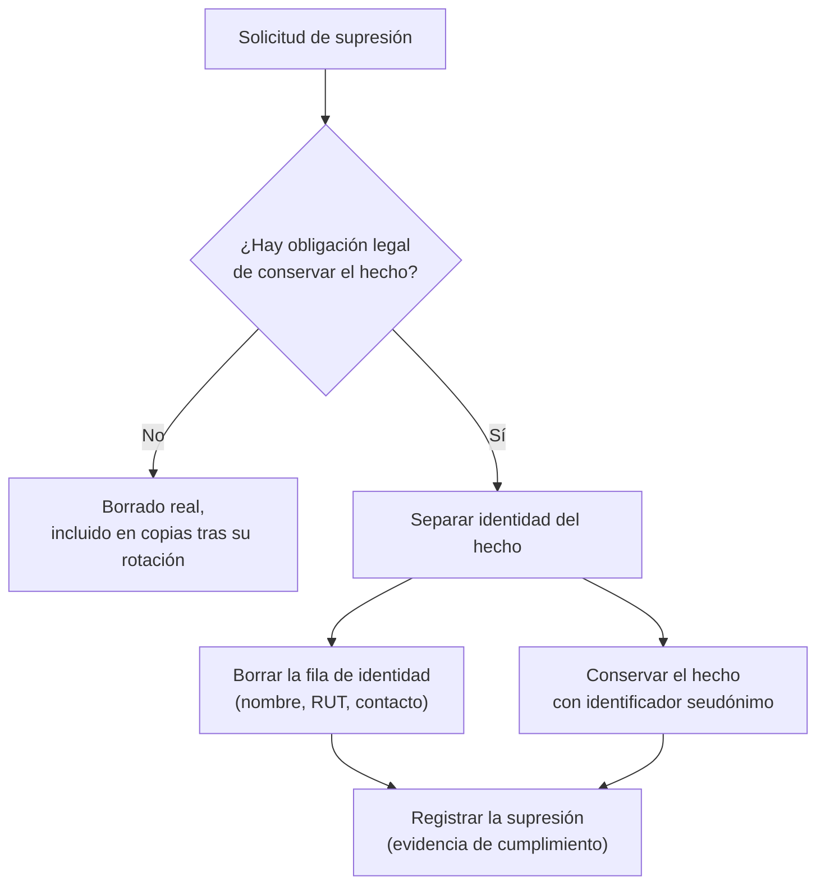

## Propósito

Traducir las obligaciones de privacidad en decisiones de esquema. Minimización, retención y supresión no son cláusulas de un documento legal: son columnas, políticas y trabajos programados.

## Resultados de aprendizaje

Al terminar podrás:

1. Aplicar minimización y limitación de finalidad al diseñar tablas.
2. Distinguir anonimización de seudonimización y sus consecuencias legales.
3. Implementar una política de retención con supresión verificable.
4. Resolver el conflicto entre derecho de supresión y necesidad de conservar evidencia.
5. Construir un registro de tratamiento a partir del propio esquema.

## Fundamentos

### Los principios que afectan al esquema

El RGPD europeo y la Ley 19.628 chilena comparten principios cuya traducción técnica es directa:

| Principio | Traducción al esquema |
|---|---|
| **Minimización** | No crear la columna si no hay una finalidad declarada |
| **Limitación de finalidad** | El dato recogido para A no se usa para B sin nueva base legal |
| **Limitación del plazo** | Toda tabla con datos personales necesita política de retención |
| **Exactitud** | Debe existir un camino para rectificar |
| **Integridad y confidencialidad** | Cifrado, control de acceso (clase 050), auditoría |
| **Responsabilidad proactiva** | Hay que poder **demostrarlo**, no solo cumplirlo |

El último es el que más se subestima: la obligación incluye poder acreditar lo que se hace. Un registro de tratamiento generado desde el esquema es una forma barata de cumplirlo.

### Anonimización frente a seudonimización

| | Seudonimización | Anonimización |
|---|---|---|
| Qué es | Reemplazar identificadores por códigos, guardando la correspondencia | Eliminar la posibilidad de reidentificar |
| ¿Sigue siendo dato personal? | **Sí** | No |
| Reversible | Sí, con la tabla de correspondencia | No |
| Ejemplo | `student_id` en vez del RUT | Agregados con supresión de celdas pequeñas |

Error frecuente y caro: llamar «anonimizado» a un conjunto seudonimizado. Reemplazar el nombre por un identificador **no** anonimiza: si quedan la fecha de nacimiento, la comuna y el sexo, la reidentificación es factible con datos externos.

Anonimizar de verdad exige agregación con umbral, generalización o ruido:

```sql
-- Publicable: suprime los grupos demasiado pequeños para reidentificar
SELECT comuna, extract(year FROM edad_rango) AS rango, count(*) AS n
FROM v_estudiantes
GROUP BY comuna, rango
HAVING count(*) >= 10;      -- k-anonimato con k = 10
```

### Retención

Cada tabla con datos personales necesita responder cuatro preguntas: **qué** se guarda, **para qué**, **cuánto tiempo** y **qué pasa después**.

Documentado en el propio esquema, para que no viva solo en una hoja de cálculo:

```sql
COMMENT ON TABLE  enrollments IS
  'Datos personales: sí. Finalidad: gestión académica. '
  'Retención: 5 años tras el egreso (obligación legal de certificación). '
  'Después: seudonimizar student_id y conservar el agregado.';
COMMENT ON COLUMN students.rut IS
  'Identificador nacional. Base legal: obligación legal. '
  'Acceso: rol_secretaria. Retención: igual que enrollments.';
```

### El conflicto de la supresión

El derecho de supresión no es absoluto: cede ante obligaciones legales de conservación. Un estudiante puede pedir borrar su cuenta, y la institución debe conservar el registro académico.

La solución de diseño es **separar la identidad del hecho**:



```sql
-- Identidad: se puede suprimir
CREATE TABLE student_identity (
  student_id INTEGER PRIMARY KEY REFERENCES students(id),
  rut        TEXT UNIQUE,
  nombre     TEXT NOT NULL,
  email      TEXT,
  suprimida_en TIMESTAMPTZ
);

-- Hechos académicos: se conservan, referencian solo al identificador interno
CREATE TABLE enrollments (
  student_id INTEGER NOT NULL REFERENCES students(id),
  course_id  INTEGER NOT NULL REFERENCES courses(id),
  nota       NUMERIC(2,1),
  PRIMARY KEY (student_id, course_id)
);
```

Con esta separación, ejercer el derecho es borrar una fila de `student_identity`. El histórico académico sobrevive, referido a un identificador que ya no apunta a ninguna persona identificable.

**Esta decisión hay que tomarla al diseñar.** Si el RUT está copiado en quince tablas —y lo estará si es la clave primaria (clase 007)—, la supresión se convierte en un proyecto.

## Ejemplo trabajado

Inventario del dominio, que es el punto de partida de todo lo demás:

| Tabla.columna | ¿Personal? | Finalidad | Base legal | Retención | Acceso |
|---|---|---|---|---|---|
| `student_identity.rut` | Sí, identificador | Certificación académica | Obligación legal | 5 años tras egreso | `rol_secretaria` |
| `student_identity.nombre` | Sí | Emisión de certificados | Contrato | Ídem | `rol_secretaria`, `rol_docente` |
| `student_identity.email` | Sí | Comunicación | Contrato | Hasta baja + 1 año | `rol_secretaria` |
| `enrollments.nota` | Sí, asociado | Evaluación | Contrato | 5 años tras egreso | `rol_docente` (solo sus cursos) |
| `access_log.ip` | **Sí** | Seguridad | Interés legítimo | **90 días** | `rol_seguridad` |
| `courses.nombre` | No | — | — | Indefinida | Público |

`access_log.ip` es el que se olvida: una dirección IP es dato personal en la mayoría de los marcos, y los registros de acceso suelen guardarse para siempre «por si acaso».

**Retención automatizada:**

```sql
CREATE TABLE retencion_politica (
  tabla       TEXT PRIMARY KEY,
  columna_ts  TEXT NOT NULL,
  dias        INTEGER NOT NULL,
  accion      TEXT NOT NULL CHECK (accion IN ('borrar','seudonimizar')),
  descripcion TEXT NOT NULL
);

INSERT INTO retencion_politica VALUES
  ('access_log', 'ocurrido_en',  90, 'borrar',
   'Registros de acceso: interés legítimo en seguridad, 90 días'),
  ('notificaciones', 'enviada_en', 365, 'borrar',
   'Historial de notificaciones enviadas');
```

```sql
-- Ejecución diaria, por lotes para no bloquear (clase 049)
DO $$
DECLARE p RECORD; n INTEGER;
BEGIN
  FOR p IN SELECT * FROM retencion_politica WHERE accion = 'borrar' LOOP
    LOOP
      EXECUTE format(
        'DELETE FROM %I WHERE ctid IN (
           SELECT ctid FROM %I WHERE %I < now() - make_interval(days => $1)
           LIMIT 10000)', p.tabla, p.tabla, p.columna_ts) USING p.dias;
      GET DIAGNOSTICS n = ROW_COUNT;
      EXIT WHEN n = 0;
      COMMIT;
    END LOOP;
  END LOOP;
END $$;
```

Se usa `format` con `%I` (clase 051) porque el nombre de tabla no es parametrizable, y viene de una tabla de configuración controlada, no de una entrada de usuario.

**Verificación, que es lo que acredita el cumplimiento:**

```sql
SELECT p.tabla, p.dias,
       (SELECT count(*) FROM access_log
        WHERE ocurrido_en < now() - make_interval(days => p.dias)) AS fuera_de_plazo
FROM retencion_politica p WHERE p.tabla = 'access_log';
-- fuera_de_plazo debe ser 0
```

**El punto que casi siempre falta: las copias de seguridad.** Borrar de la base no borra de las copias. Un dato suprimido hoy sigue en la copia de ayer, y en la de hace un mes.

La posición defendible —y la que aceptan los reguladores— es: las copias tienen su propio ciclo de rotación, la supresión se completa cuando la última copia que contenía el dato ha expirado, y ese plazo está documentado.

```text
Retención de copias: 35 días
→ La supresión se completa como máximo 35 días después de la solicitud.
→ Se documenta en la respuesta al titular.
→ Nadie restaura una copia parcialmente para reinsertar datos suprimidos.
```

**Registro de tratamiento generado desde el esquema:**

```sql
SELECT c.table_name, c.column_name,
       col_description(format('%I.%I', c.table_schema, c.table_name)::regclass,
                       c.ordinal_position) AS documentacion
FROM information_schema.columns c
WHERE c.table_schema = 'public'
ORDER BY c.table_name, c.ordinal_position;
```

Una columna con datos personales y sin comentario es un hallazgo de auditoría. Convertir eso en una comprobación de integración continua hace que la documentación no envejezca.

## Comparación

| Objetivo | Técnica | Consecuencia |
|---|---|---|
| Reducir exposición | No recoger el dato | La más eficaz y la menos usada |
| Permitir análisis sin identidad | Seudonimización | Sigue siendo dato personal |
| Publicar datos abiertos | Anonimización con k-anonimato | Pérdida de detalle |
| Cumplir plazos | Retención automatizada | Trabajo programado + verificación |
| Atender supresión | Separar identidad de hecho | Decisión de diseño temprana |
| Acreditar cumplimiento | Documentación en el esquema | Auditable y siempre al día |

## Errores frecuentes

1. **Recoger «por si acaso».** Cada columna es una obligación permanente.
2. **Llamar anonimizado a lo seudonimizado.** Error con consecuencias legales.
3. **Registros de acceso eternos.** Las IP son datos personales.
4. **Identificador nacional como clave primaria.** Lo esparce por todo el esquema.
5. **Ignorar las copias en la supresión.** El dato sigue ahí.
6. **Política de retención sin verificación.** Se rompe en silencio.
7. **Borrado lógico llamado supresión.** Marcar `borrado = true` no suprime nada.

## De la clase a la operación

La mayor parte del trabajo de cumplimiento se ahorra al diseñar: separar identidad de hechos, no recoger lo innecesario y documentar la finalidad de cada columna cuesta una tarde al inicio y evita un proyecto de meses cuando llega la primera solicitud o la primera auditoría.

## Reto de transferencia

1. Inventaría las columnas con datos personales de tu esquema, con finalidad y base legal.
2. Documenta cada una con `COMMENT` y añade una comprobación en CI que exija comentario.
3. Implementa una política de retención con su verificación.
4. Diseña el procedimiento de supresión, incluido el plazo derivado de tus copias.

## Preguntas de evaluación

1. ¿Por qué la seudonimización no exime de las obligaciones de protección de datos?
2. Da una columna de tu sistema que hoy no tendría base legal declarada.
3. Explica cómo atiendes una supresión conservando una obligación legal.
4. ¿Cuándo se completa realmente una supresión, dado tu ciclo de copias?
